# 续篇 - 30个『提高5倍微信成交率』的小技巧（51 - 80）

> 来源：[https://oee5lr7gsk.feishu.cn/docx/NruPdt8ovo6UGaxUp5lcFgcEnzc](https://oee5lr7gsk.feishu.cn/docx/NruPdt8ovo6UGaxUp5lcFgcEnzc)

全文共：8,875 字

预计阅读时间：6.66 分钟

## 前言

圈友们好，我是根源。

过去有过几年的线下销售、带团队的经验

同时也是一位实战经验比较丰富的心理谘询师

去年，正式的转型做了线上的知识付费、以及私域。

有分享过这个系列主题的文章

阅读和点赞数据都还不错

想着既然这个系列的主题，刚好符合目前的趋势

同时、这也是我自己很喜欢的主题

因为微信场景可以说是

这个时代最贴近每个人『天天见』的场景

只要能把微信用的好，就代表在这个时代

一定能获得比其他人更多的机会

不管是更好的信任感、更讨人喜欢、又或者是赚到更多的钱

趁着这几天，接著整理了新的续篇

第51 - 80 个提高微信成交率的小技巧

作为前面两篇的续集

（前两篇直达链接：

1.  ）

『微信成交』这个主题，我个人其实挺喜欢的。

一方面是，这是我的强项，帮助我去年完成了七位数的转型收入

再一个点就是，这件事我也是近一年才接触，并且真正做到了擅长。

因为我其实从去年开始，第一次从线下转型做线上。

那我发现，转型之后，所有的销售、关系经营、成交，

几乎全部的场景都迁移到了线上，更准确的说是微信。

这背后有一些核心的底层逻辑，我觉得是很关键的。

在上一篇精华帖中，我其实有提到

### 线上的本质，其实是线下场景的迁移

所以在微信上谈成交，本质上是将线下的场景做了切换

其背后的底层的逻辑是一样的

就是我们需要和客户建立足够的信任

然后，成交就是一件水到渠成、自然而然的事情。

我也一直认为，私域的终点是微信

如果能有一些

透过微信沟通更好的小技巧

这是能大大的增加关系维护的效率

以及更好地成交产品

刚刚好想借着这个主题

梳理我去年一整年在线上，微信聊天成交

以及总结过去十二年的销售经验

每一个小技巧都很轻

看完便可以知道如何快速上手。

* * *

## 技巧051：一个让客户有「被尊重感」的重要的习惯

微信跟客户介绍产品，有时候内容只要是

一看就知道复制贴上，或者是合并档案

像这种情况，我发完后一定会解释，这么做的原因：

不是不尊重

而是为了增加效率

因为，一般来说，对方收到太长的讯息

或者是，一看就知道复制贴上的讯息

可能会出现一种「你对我不尊重」的感觉

当然，这谈的不是全部人

多说一嘴肯定好，让对方感受到被尊重。

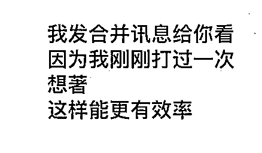

所以，我多打了这句话

就是为了让对方多一点「被尊重感」。

* * *

## 技巧052：一个增加自己产品曝光的开场方式

曝光自己，有很多不同的方式

聊天中无意的说到

不要特别说，就是简单带过

也是一种很好的曝光方式

就类似：

你最近刚换手机啊

这手机也太好看了

我原本也想买

对了

下次如果有需求

可以问问我

我有个朋友专门卖这个的

估计能便宜

一说完，马上跳下一个话题

这时候只为了

增加对方心中对你的『新印象』

只要有印象，当哪天有需求

这位朋友就会出现，然后找你问！

* * *

## 技巧053：想要提高成交率，你一定要锻炼的能力

销售中，有一个很难很难的环节

就是『开口成交』

说直白一点，就是『开口要钱』

这是一个需要花大把时间训练的能力

甚至，所有销售中的反对问题

只有『开口要钱后』

你听到的，才会是真正的反对问题

原本什么都好，结果一开口收钱

对方就开始有理由了

我要问我老公

我要问我父母

家里钱不是我管......

* * *

## 技巧054：这样经营朋友圈，你也能透过时间的积累提高成交率！

我一直是个，不太更新『商业』朋友圈的人

基本上，一个月能有个一两则，跟课程相关的，

那就已经是够多了

我发现，多数人想要得到的

并不是『一堂课』，又或者是『一次机会』

而是想看一种『未来的生活愿景』

也就是，越不严肃、越丰富，甚至是越多采多姿的朋友圈

总会得到更多『爱心』

得到越多『爱心』，就代表关注的人越多、看的人越多

以前我总认为，这样的『爱心』是无效的

但后来发现，这是一个错误的认知

很多时候，就因为这些默默看的人越多

当哪天，不小心更新什么，与商业、或是课程相关的内容

就有机会出现对方的一种好奇

可能是

原来你也有课程

原来上个人生能好

原来.......

比如下面这则对话，就是从朋友圈过来主动找我成交的朋友，

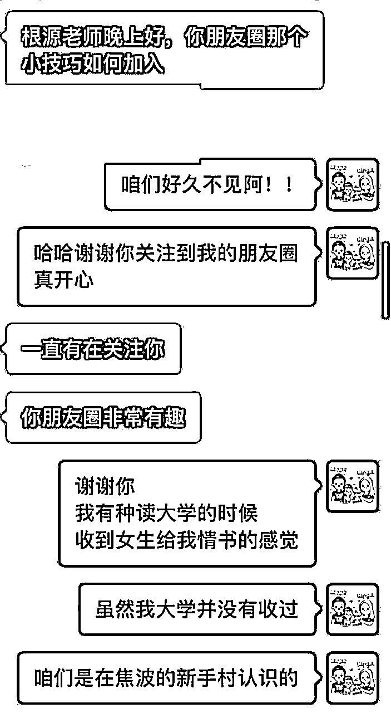

* * *

## 技巧055：成交是一段关系的新的开始

下面这则案例，是一个老朋友的被动成交

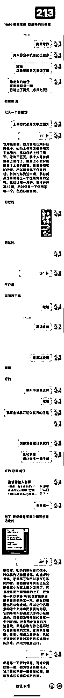

当对方主动出现时

尤其是像这样，一见面就打钱

一定要多说两句

用夸奖或者是自夸的方式

肯定对方的『决定』

这很重要

这也是一种让对方能有被尊重的方式

虽然当下成交已经完成

但是交情会一直延续下去，

也因为这样看似闲聊的对话

会让信任感能够持续地提升

未来某天，当有新的课程，对方刚好有需要时

成交就有机会因为足够的信任感，而自然发生。

* * *

## 技巧056：这个举动，帮助你释放客户的需求

但一般来说，只要能感受到『意愿』

我一定会做一个举动，叫做『释出需求』

这个『释放需求』其实也是一种产品的曝光

透过曝光进一步确认对方需求

这里我特别说了一句

没上沟通课

就可以有这么好的使用

这句话，其实更深的含意想说的是：

我跟你说

我有沟通课

如果来的话可以更精进

如果真要转变成技术

这也能是一种『小钩子』

* * *

## 技巧057：成交之前，有一件事一定要说清楚

我们先看一个案例

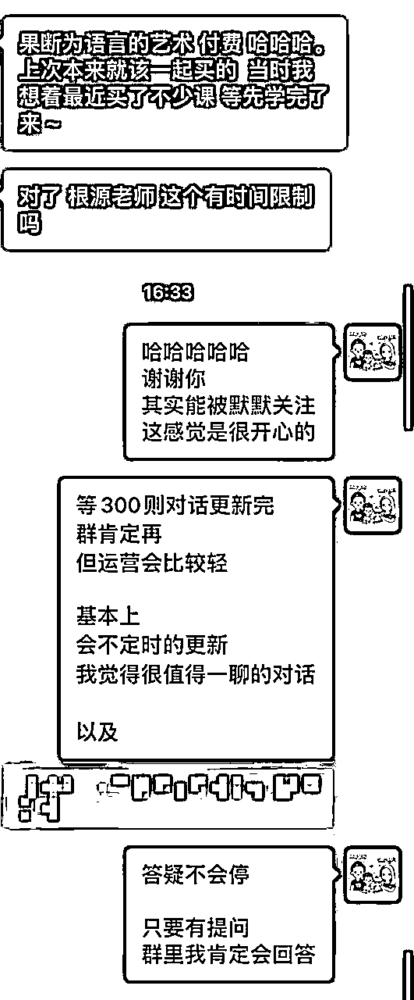

这个案例其实是一位上过沟通课的老学员

主动找我成交

对话中学员有这样一个提问

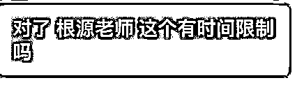

这个问题，坦白说我思考了许久

还记得最初做课程

我都会想，能给多少尽量给多少

一开始，反正为了收钱我就包山包海

学员付钱之前，提出什么需求我就答应

做不做的到先不管，先答应再说

但后来发现，交付这件事情，与其收了钱之后解释

还不如，收钱之前就说清楚

做得到的就说

做不到的就不要说

这样做的目的

一是倒逼自己想清楚产品的规则和交付的内容

再来一个是，给到客户合理的预期，

预期清晰了，退费这件事就不太会发生。

* * *

## 技巧058：一个超级重要的销售思维！

以前，我做销售的时候，很容易犯一个错

就是，当我发现对方，有『成交』意向的时候

我就会开始，一直烦他一直追踪他

为的就是，把钱能快点收下

但随着销售经验越多

我才发现，这是个很严重的问题

会让对方有一种，很『利益』的感觉

当时出现这问题，有几个原因

1、太急躁

收钱这件事情，就得慢慢来

只要信任感充足，这就是一件水到渠成的事情

2、名单太少

当名单过少，难得出现一位意向名单

这可得是上天送的一份大礼

就开始追踪追踪追踪

所有人不经营

就只经营这个有意向的名单

也因为那些年的经验，我开始有个习惯

经营关系

经营客户

经营某些群

唯有做这件事情

才能够让自己，有源源不绝的客户

老师曾跟我说一句话：

量大人潇洒

* * *

## 技巧059：没有确认客户真实需求之前，这件事一定不要做！

我们下面这则对话案例，闲聊中，对方抛出了这样一个提问

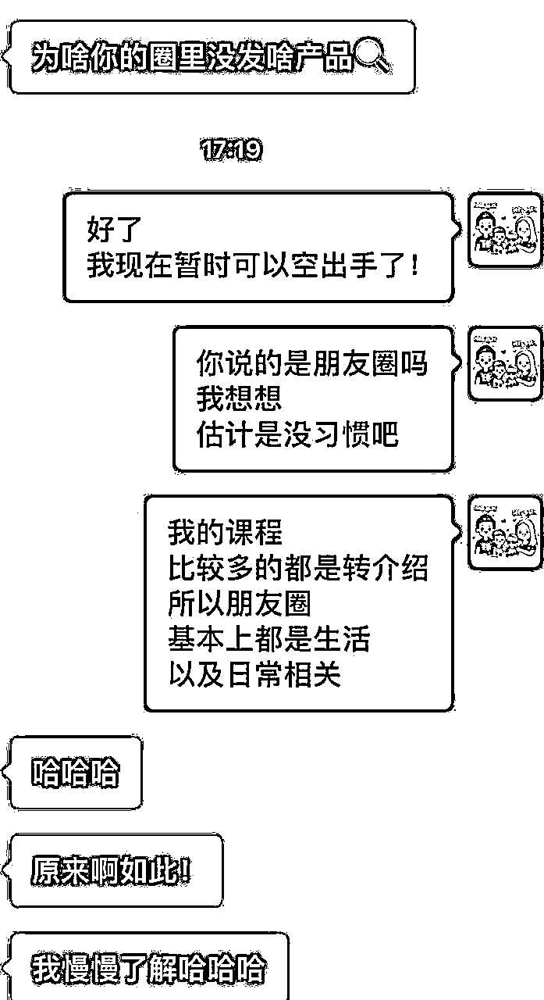

看完这个提问，有人可能会误会

我估计能切入产品了！！

但我没有这么做

因为，对方虽然这么问，但这句话，不一定是『真话』

都不知道对方是不是真需求的情况，介绍产品就会显得有点不礼貌

所以，我依旧只做了基本的自我介绍

他想问自然会问

对方没持续的说

或者是刻意的问产品种类

我就会继续闲聊

这个案例我想说的是

新朋友尽量不要，一开始就卖东西

在对方没需求的时候，假设我们钩子丢出去，对方依旧没问

那先放下，别持续的追问，

因为，这种情况，成交率不会高，还有可能造成反感。

* * *

## 技巧060：没谈收钱之前，客户的“感兴趣”一定不要轻易当真

销售的过程，只要没谈到『收钱』

都不要对于，对方打的任何一句话，抱有太大预期

比如下面这个案例

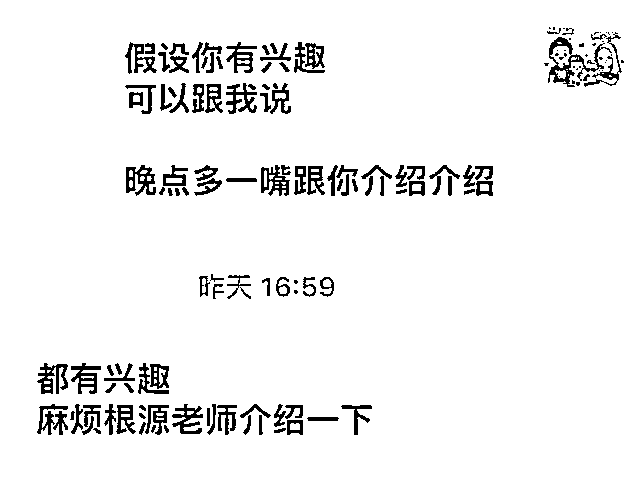

对方有了这个回应

一般来说，普通业务员就会有种

『成了』，我肯定能成交了的感觉

因为，单纯从对方的字面意思解读，充斥著满满的兴趣

但资深业务员会知道，这就是一个『说词』

只要没谈到价格，没谈到收钱，这些话就是听听就好。

所以，

不要再谈收钱之前，对于任何语言，抱有太大『期待』，因为很容易失望。

而是想办法透过闲聊，多积累一点点信任感。

* * *

## 技巧061：产品销售的一个非常重要的原则

这则案例是透过公众号加我好友的新朋友

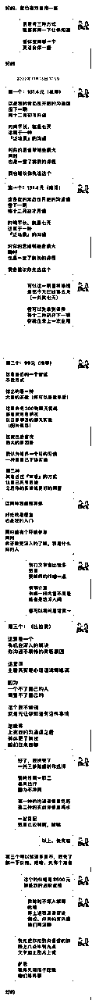

销售过程中，有个很重要的原则

尽量不要再一次的沟通中

让客户花一次以上的钱

除非，时机真的不错

给客户两个以上的选项

是之前介绍的一个小技巧

对话的最后我给了对方三个选项

我的顺序，同时也是希望他报名的顺序

这是一个更好的顺序

因为已经报名一个，我并没有继续的说。

之所以有这样子的原则

是因为当我们跟客户的信任度不够时

如果一直推销，会给到客户一种很不好的感受

就是你跟我聊天就是为了想让我付钱。

这会把好不容易建立起来的信任感破坏掉。

所以这个原则一定要留意。

* * *

## 技巧062：谈成交时，这个情绪一定要迈过

下面这则案例是一位沟通课的老学员

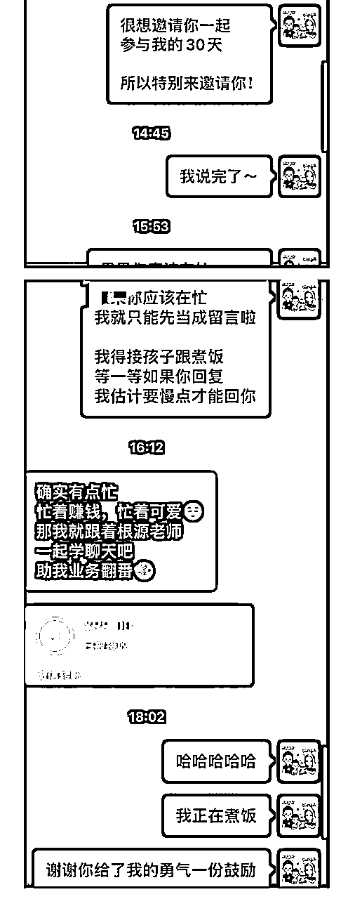

但这对话有个小插曲

我发现

这是人内心的一种『恐惧』

当我介绍完产品时

对方消失了好一阵子

虽然我知道，她应该是去忙了

但心中，总会有种莫名的『害怕』

会不会，他心里其实觉得不舒服

但我一直跟自己说

所有的恐惧，都是想像而来的

当下，一定不会有恐惧

迈过这个情绪，谈成交之后，就可以多一些洒脱！

* * *

## 技巧063：不要让自己只有单一产品，最少两个以上

从21年转型到线上做知识付费，我有一个挺深刻的感悟

不要让自己只有单一产品，最少两个以上

这样，才有机会让对方挑选

之前的技巧有提到，

每个人都要有一个低价引流款，一个高价款。

这里我做一点延伸

因为更多的产品

除了可以给对方挑选

还能在对方看到某个产品不感兴趣时

多一些别的选项来匹配需求。

比如下面这则案例，也是因为我给了两个选项，对方会多一个需求匹配项。

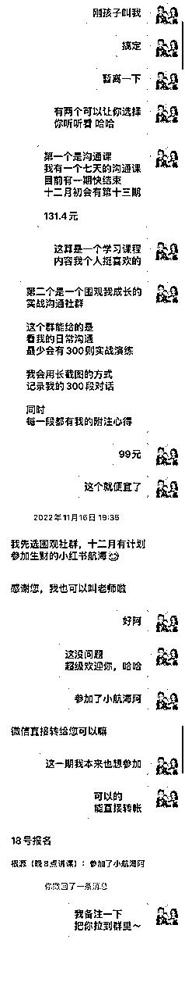

* * *

## 技巧064：谈成交前，这个环节一定要做好！

这是一位转介绍的新朋友

销售的过程中有一个环节叫做：重复确认需求

这个事情很重要

因为，这会决定对方说付钱后

会不会真正的给钱

比如下面这张对话，

可以看到，对方有说到一句话

想跟我学沟通

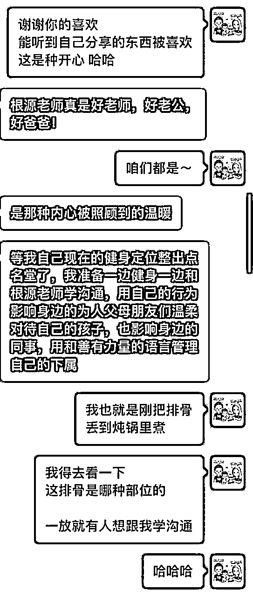

假设他会特别的问，我有什么样的课程

那就代表，这个想学的意愿是真的

但他没有说，我也没特别追问

有时候确认对方的意愿

不一定只有提问才能知道

所有的细节，都在对方的回复中。

也正是因为对方没有继续说「学沟通」的话题

我就没有特别谈成交

这都是基于对方「需求真假」的判断

* * *

## 技巧065：为产品的成交留钩子

这则案例讲的技巧是，在对话中为自己的产品留钩子

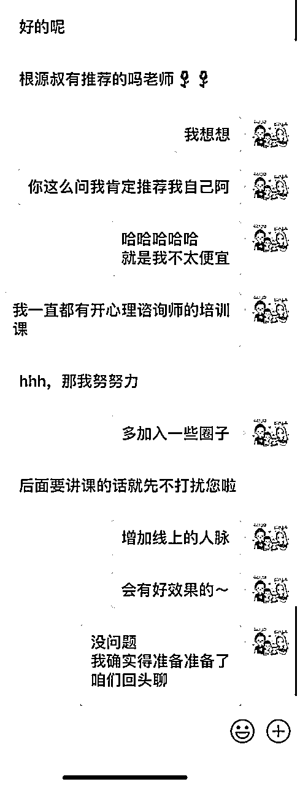

没有谈成交，主要是因为当时有点忙

想著不急，未来有机会

但是留下一个钩子

就相当于告诉她，她想要的内容，我是有的

这一段的重点是：

如何在沟通中，下一个未来有机会深聊的『伏笔』

同时，丝滑地展示自己的产品。

* * *

## 技巧066：产品定价的这个原则很重要！

从去年开始，我给自己的调整

便宜的产品，坚决不特价也不优惠

也就一两百的东西，优惠能优惠到哪

但是，假设愿意继续来新课程

那我就能给出一两百（以上）的优惠

这几乎就是，便宜课程刚好当送了

之所以给自己这样的设定，是因为

我发现到一个很有趣的点

只要在金钱上给优惠

总容易有个人设，这东西的价值其实能调整的

大原则：

新产品不优惠

但老学员复购，给出足够的好处，或者是金额上的特惠

做出一个区别

这样做，既可以让自己塑造一个「高价值」的人设

同时，也会让老学员多一种「被照顾」的感受，这其实是增加复购率的一个很重要的细节。

* * *

## 技巧067：这样的销售大忌，一定不要犯

下面是一位朋友微信推销的案例

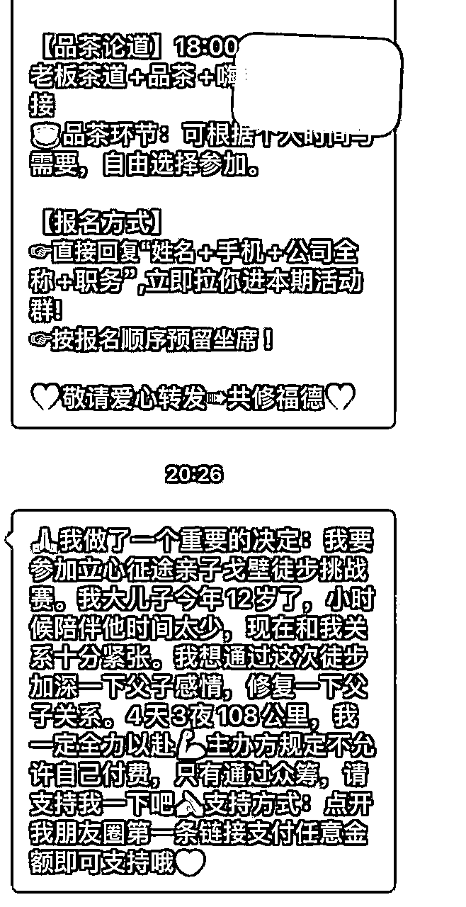

我常想，很多人想达到某种目的

但是，方式却用的如此粗糙，让目标离自己越来越远

很多朋友会对微商反感，就是因为有太多的朋友，屁话都不说，直接发广告

这就跟，另一半找你上床，连个前戏都没有，直接硬上，这谁会舒服。

这则小技巧

其实是用一个反面教材当案例

关系的经营过程中，只要大错不犯

一点点积累好的印象，就有机会在未来某一天，突然就完成成交。

* * *

## 技巧068：做好销售，你一定要练好的一项基本能力！

我一直觉得

做好销售，一定要具备，能随时介绍自己产品的能力

能快速的，说出自己优势的能力

因为，你永远不知道，什么时候会来客人

就我个人而言，我的课程其实很少直接发海报

都一定是先解释，因为海报就是个辅助效果

比如下面的案例，就是跟朋友的闲聊，对方突然提到咨询师课程。

介绍产品和展示自己的细节可以看对话截图。

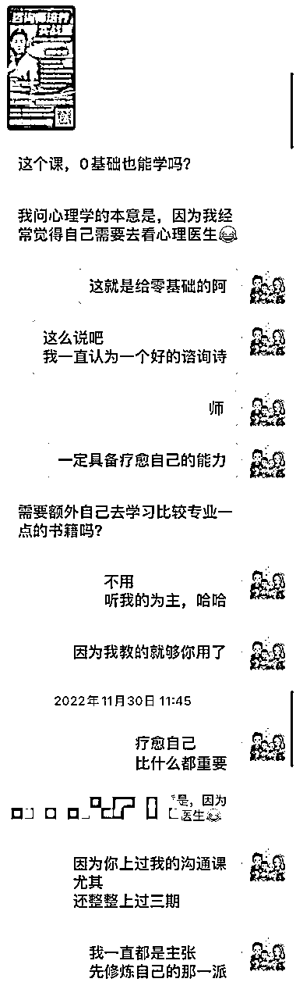

* * *

## 技巧069：这样的开场，更容易提高成交率！

我们先看学员的一个案例

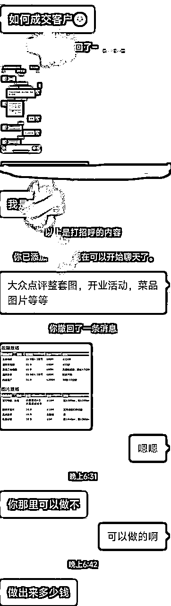

就学员跟客户的对话来看，其实开场出了很大的问题

之前我谈过

新朋友谈成交之前，一定要先『寒暄』

先聊聊

客户怎么称呼

从什么地方加到我好友

这名字真特别

……

反正一定要找几个话题，先暖暖场

最差也先打个招呼，礼貌得有

这个对话中，连开场都没有，劈头就说产品内容。

如果以这张对话来看

客户提到了需求，发了需求图，还问了多少钱

这边能给出的回复就是

先问对方预算，然后说自己的价格

能匹配就可能顺便成交

但因为信任感不足

这样的对话，假设成交都是运气好

所以要能增加成交率的方式，就是

重新打个招呼

聊个几句再谈产品

会更好一些

* * *

## 技巧070：让老客户，复购更高客单价的产品的三个流程

小金额要转超大金额

比如几百转几万，或者是几千转几万

单纯只有私信是不够的

就我个人来说，几百块转几万块，我会有这样的流程

⭕️流程一：2~3位数付费课程

第一次付费肯定要有的

这过程，因为对方已经付款，

所以上课过程，就变成老师单项『筛选』的过程

通常，我都会在这样的课程上，招募『主编』

就是负责帮我整理课件的学生

这同时也是一种，我对于私教的筛选

⭕️流程二：最少要有一次的四位数付款

只要我觉得不错的人

对我进行，第二到第三次的付费，我就会开始追踪

多跟他聊天，跟他有好的『私交』

聊天的过程，还得评估对方的『预算』

能不能付的起这样的钱

⭕️流程三：直接邀请

上面的两个过程，最少要超过三个月以上，我就会直接问对方

一直以来你都很支持我

过程中

我也发现到你的细心

以及很强的能力

我能感觉到

未来若是有机会共事

是件挺幸福的事情

如果我想找你聊聊

我有一个

私教课程产品

不知道你介不介意

听我跟你说说

后面就得看产品属性

因為，前面交情如果足够，这东西又是他的刚需

这三阶段下来，不能保证一定成交

但最少能增加不错的成交率

* * *

## 技巧071：让客户愿意跟你聊下去的顶级开场（一）

信任感的建立，一定需要长时间的关系经营

微信聊天，其实一种最简单的关系经营方式

谈到聊天，有时候难的不是如何找话题聊下去

而是找到一个合适的理由开场切入

这张对话的背景是

我更新了一篇朋友圈

有一位朋友给我点赞，我便私信这位朋友跟他说谢谢

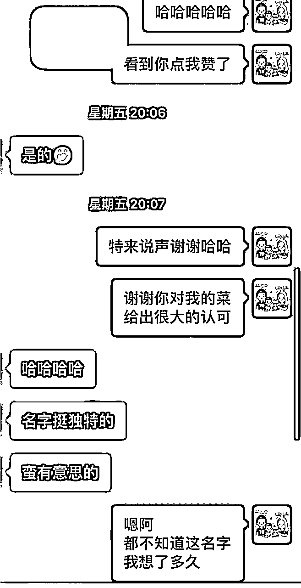

这其实是个非常柔和的开场方法

有著很明确的理由外

还能让对方，有种被关注的小惊喜感

毕竟，随手点一个赞被道谢

这不是一件能常常碰上的事儿

开场之后，只要随口问个

许久不见

最近一切都顺利吗

这就能有个很棒的聊天场景

能很容易的，接上各种不同的话题

挺好用的一个触达私域的小技巧～

* * *

## 技巧072：让客户愿意跟你聊下去的顶级开场（二）

开场如何切入，有一个最好用也最实用的方式

就是：承袭上段内容

上次聊什么结尾，那这次，就用什么开场

比如下卖弄这个案例：

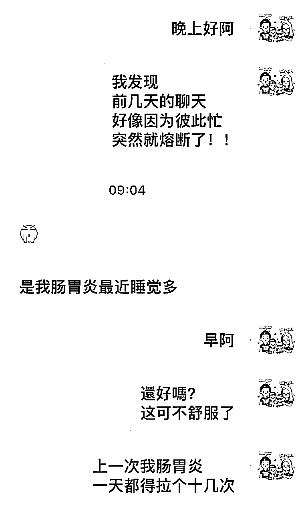

那如果上次啥也没聊

那就可以用

很抱歉上一次突然消失

或者是

才发现前几天都忙

话题就这么没了......

这都是一个相对『轻松』的开场方式

只要对方开始回话

上次只要聊的不差

那就有机会，能延续上次的好能量，继续聊下去。

* * *

## 技巧073：让客户「不愿意被成交」的秘籍（一）

如果你不想成交这个客户，

你只要持续做一件事就可以：不停地向对方推销产品

这时候一定有人疑惑，当销售结果不要推销。

各位，我们先模拟模拟，自己是一个客户。

路上一个帅哥搭讪你，你满心欢喜想着：哇，他可能对我啥啥啥的。

结果一靠近就说：你好，健身房考虑一下吗？

或者是地铁上，一个女生挺可爱的就来搭讪你，心想估计是看我长得很帅。

女生一开口就说：你好，我最近刚创业，有空来我的店看看。

一听就知道，这属于推销的语言。人就会本能性地排斥。

那如果不推销产品，我们能做什么？

在跟客户信任感不够的时候，就是闲聊

闲聊的原则：

关心他！不要谈太多与自己有关的事情

* * *

## 技巧074：让客户「不愿意被成交」的秘籍（二）

让客户不愿意被成交的第二个秘籍就是，一直不停地说自己。

想像一个场景，你跟客户在微信上聊天，开口闭口一直说我觉得。

这在销售过程中，是很忌讳的大事。

沟通交流的过程中，你一定要懂，客户到底想要什么？

客户要的是：

你愿意听他说话，

你愿意多了解他，

你愿意安慰他

....

这一类的

尤其是：你愿意了解他、倾听他，这是最关键的。

去想像一种状况，每次客户一说到事情。

你就说：不不不，我觉得这件事情应该是这样，你说的不对。

客户说事情，你又说：没有，我认为这件事情不是你说的这样。

* * *

## 技巧075：让客户「不愿意被成交」的秘籍（三）

让客户不愿意被成交的第二个秘籍就是，「一直说」。

不知道各位，有沒有见过一些业务员，

见面之后，她就不停的说不停地说。

从公司说到产品、从产品说到制度、从制度介绍到场地。

都没有机会给你提问，也没有机会给你开口。

就跟机关枪一样，哒哒哒哒哒哒哒哒哒说不停。

尾声的小技巧，主要讲述的都是，与客户聊天时不能犯的事情。

当你一直说的时候，就很容易让对方听不下去。

我之前有讲过沟通的时候，能量是流动的

只要你一直说，客户就没有办法透过对话，提高自己的能量。

这其实是销售和客户关系经营中的大忌。

* * *

## 技巧076：让客户「不愿意被成交」的秘籍（四）

第四个让客户「不愿被成交」的秘籍是：不停地否认对方的观点

我们看几个例子

假设今天客户说：这一次的新闻，我觉得股票应该会往下跌

我回覆：不可能，不可能往下跌

客户：这次的新冠应该维持年底，就会好转

我回：不可能，肯定不会

客户：明天估计会下大雨，看现在的乌云密布

我回：不可能下雨，明天肯定大太阳

各位看到这样的对话，心里有什么感受？假设你是客户。

肯定会不想聊下去，对不对

因为每个人都希望被认同和被尊重

当你一直在否对对方，这就很容易让这段关系经营不下去。

* * *

## 技巧077：让客户「不愿意被成交」的秘籍（五）

第五个让客户「不愿被成交」的秘籍是：像调查户口一样，不停地问

我有见过销售这样跟客户聊天

你是哪里人？……

哪个学校毕业的？……

结婚了吗？……

小孩几个？……

吃饱没？.......

试问：今天有人在微信上，一口气就问了你上面5个问题，你会有什么想法？

这人估计是来做身家调查的吧……

所以当我们在微信上经营客户关系时

一定不要出现太多这样的问句，

这种问句只要一多，对方就会容易反感。

想要再建立好感，就会比较难。

* * *

## 技巧078：让客户「不愿意被成交」的秘籍（五）

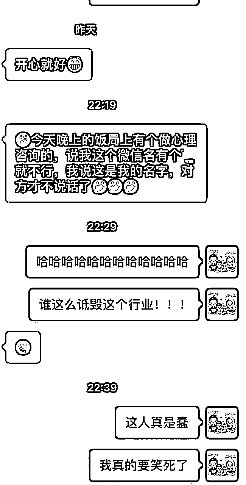

这对话的背景，是我好朋友跟我说

某个场合吃饭，遇到一位心理谘询师

結果，这谘询师一加微信就说

名字上有『x』不好

结果，我朋友就跟谘询师说

但这是我的名字....

这其实是个很尴尬的場景

同时，这也是一种很没礼貌，以及很蠢的行为

对外的沟通

切记，一定得小心谨慎

尤其，对于批评的话，以及『建议』

更不要随便开口说

这些都属于『争议』类的语言

很多时候，建议可以说，但交情不到就别说

在不熟悉的状况下，与人沟通，尽量少用这些言词，

给你个建议

你这样做不太好

這就不是個好方法

............

* * *

## 技巧079：让客户「不愿意被成交」的秘籍（六）

这则对话，是一个谈成交的反面教材

因为他的切入法，我想绝大多数人，是不喜欢的

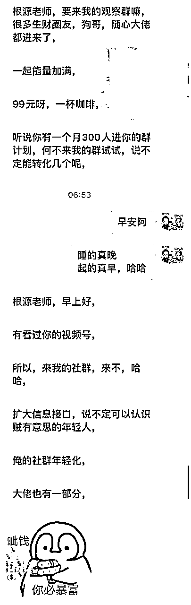

当看到这样的对话，我心里就想

很多销售，一定也犯了同样的错

啥都不说，就直接谈产品、直接谈收钱

这其实是个销售大忌

经营人际关系，一直都需要时间

直接谈并不是不行

但是，要有个被拒绝的心理准备

以及，这关系可能会扣点分的准备

我只要谈到收钱

一定会经过『小段时间』的铺陈。

不要开口第一句，就谈成交。

* * *

## 技巧080：让客户「不愿意被成交」的秘籍（七）

下面这张对话，我想谈一个很重要的主题

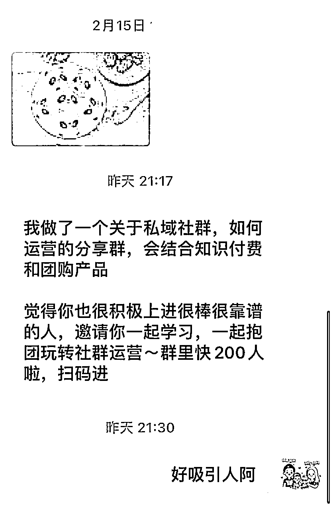

微信有个功能：『群发』

不知道有多少人，曾经使用过这功能？

可能没使用过，

但肯定，尝试的手动群发过

一次全选九个发，连续个十次也能发给90人

这是个好工具，也是个好方式

就过去的打广告思维

这样的方式，不只能省钱，还有机会增加『曝光量』

但这功能，却是一个被多数人『讨厌』的举动

假设你是客户，对方用群发的方式邀请你参加某某社群

你会觉得对方因为重视你而邀请你吗？

肯定不会！

甚至可能会想，我就是你的通讯录里面的一个推销对象。

也因为这种不被尊重感，就很跟客户建立真正的信任和私交。

这件事真的挺重要的，也可以说是经营客户的大忌。

在我的价值观体系中

关系经营这件事，「温暖人心」相比于「效率」，要重要得多得多

因为换位思考，每个人都希望被认真对待。

既然我自己是喜欢这样的方式，那我也应该用同样的方式对待别人。

这也是一种『将心比心』。

* * *

## 尾声的过去历史介绍

我是根源，同时也是第四期的生财圈友

一个有 2w+ 实战案例的心理咨询师

12年线下销售、团队管理经验。

2022 年开始转型线上，做一些知识付费的项目。

过去曾发表过几篇文章

都能看到这，代表你对文章的喜爱

肯定有一定的程度！

也欢迎阅读过去我写过的历史文章。

2021年的文章（精华x1）

1.  精华《直觉式萨克斯 透过社群成功变现146万》 https://t.zsxq.com/116B1bcYc

1.  《73项被动收入打造》 https://t.zsxq.com/11EHjTH0P

1.  《杭州夜话02场，夜话官复盘》 https://t.zsxq.com/19IkX4UMl

1.  《年入百万，团队从20人到4万人》 https://t.zsxq.com/19JYt77hL

1.  《主题：如何更有效的链接见面会认识的圈友》 https://t.zsxq.com/19VY2LWg4

2022年的文章

1.  《互联网小白，第 1 次做线上产品，7 天赚回 10 倍门票》 https://t.zsxq.com/11ooZZbM7

1.  《把捣乱分子『逆势』转成爱用者的好方式》 https://t.zsxq.com/19lipLhJ5

1.  《 好的内容，是目前依旧没退旧流行的变现方式 》 https://t.zsxq.com/19BLMAYw1

1.  《明白老师的一个启发，让我从100天日耕的过程赚了30W+》 https://t.zsxq.com/19BgNoxfi

2023年的文章（精华x6）

1.  《私域的意义不是管理，而是经营》 https://t.zsxq.com/19WEsfSq1

1.  精华《9年传统行业 1 年时间，从一无所有，到年入 200 万》 https://t.zsxq.com/10nmEr1cA

1.  精华《25个提高微信成交率的小技巧》 https://t.zsxq.com/11AgRW24F

1.  精华《35 个让私域收入翻 3 倍的技巧》 https://t.zsxq.com/11FmV2aqZ

1.  精华《续篇 - 25个提高微信成交率的小技巧（26 - 50）》 https://t.zsxq.com/13yRbmUwo

1.  《 私域话题：涨价之后，如何回复以及留住客户？》 https://t.zsxq.com/11UJk9HxQ

1.  精华《成为自由职业者的20个必备特质 》 https://t.zsxq.com/14XTxhh15

1.  《 36个让私域成交率翻倍的实战指南！ 》 https://t.zsxq.com/17zSrYzvk

1.  精华《产品线有引流体系，如何通过沟通促成升单？》 https://t.zsxq.com/17ocUJEFA

1.  《知识付费赛道，如何透过处理『反对问题』，增加用户粘性和复购率？》 https://t.zsxq.com/181fSc5rv

2024年的文章（精华x5）

1.  精华《第一次尝试「问答群形式」的公域往私域转化，7天变现11万》 https://t.zsxq.com/18gBXlWxE

1.  《 线上新手，我是如何用一套固定流程，累计成交 300 万高价产品？ 》 https://t.zsxq.com/18IWgDiXo

1.  精华《 私域话题-如何在客户咨询过程中，透过三个步骤提高2倍成交率？ 》 https://t.zsxq.com/196Ad34aR

1.  《私域的十倍增长话题：不同信任程度的客户，如何提升成交率？》 https://t.zsxq.com/YKHGT

1.  精华《 为什么都是做副业，我能第一年就达到七位数？ 》 https://t.zsxq.com/APodD

1.  《 写作赛道，如何使用「算账思维」精准地评估产出？》 https://t.zsxq.com/ymcEE

1.  《 私域+知识付费话题：如何通过增加合理的触达次数，提升2倍以上成交率？》 https://t.zsxq.com/elSxU

1.  《9年传统行业转型第2年，如何维持百万利润》 https://t.zsxq.com/61VlK

1.  《把副业做到超过主业收入，你必须得知道的20件事！》 https://t.zsxq.com/bkbd1

1.  精华《用这 13 个思维，我做过的副业全都成功变现！》 https://t.zsxq.com/1q1Re

1.  精华《如何找到靠谱的人，让项目成功几率提升十倍？》 https://t.zsxq.com/hJZfN

1.  《私域筛选流程小尝试，四位数产品课程，转化率40%》 https://t.zsxq.com/o2dJx