# 5个月赚了20w，小红书学习资料实战分享大揭秘

> 来源：[https://a033a8trbo.feishu.cn/docx/OOnEd6RhmoW09ExOp11c6BGsnTE](https://a033a8trbo.feishu.cn/docx/OOnEd6RhmoW09ExOp11c6BGsnTE)

全文约9300字，下面组件点击可以直接跳转：

# 引言

*   各位圈友们好，我是申铭，首次在生财分享经验。我会尽可能详尽地分享每一步操作，如果大家有任何建议，欢迎在评论区提出。我正式加入生财是在今年4月份。不过，在翻看我之前学习的文档时，我发现自己早在21年或者22年就已经是生财的编外迷弟了，当时可是看了不少生财的内容。今年有幸找到@郑韩 韩哥，是他拉我进了这个圈子，真心感谢韩哥！

*   这个项目从2023年9月开始筹备，10月正式上线了第一件产品链接。截至2024年元宵节前后，短短5个月的时间里，我实现了大约20万的收益，30天最高收益更是达到了4.9万。由于这个项目主要是教育学习类的资料，所以最大的资金成本就是平台收取的5%扣点（万元内免佣）。我刚刚查看了后台，发现针对我的这个类目，扣点现在已经调整到了2%。（2024年11月15日补充更新，近期开了个新店，同款产品起店稳定销量花了将近四周时间，现在单个店单月最高卖了6.7w）

# 第一部分：我的虚拟资料副业之旅

*   先简单做个自我介绍，我之前一直在文娱行业摸爬滚打，先后在影视公司和经纪公司担任制片人和经纪人。刚入行时，我主要从事与营销相关的宣传、品牌工作，因此对新媒体有一定的了解和基础。到了21年底，我决定正式离开文娱行业，转而投身直播带货的领域，一直到现在都在做这个。期间，在2022年的时候，我算是比较早的一批接触并尝试制作小程序短剧的人。在不忙的时候，我拍过几部短剧，不过遗憾的是，并没有获得什么大的收益。

*   我做小红书账号的动机，主要源于在直播电商公司“太闲”。通常早上6点开播，播到中午12点或者两点就结束了，下午的时间如果不利用起来就觉得浪费。我本身又是个喜欢折腾的人，之前和朋友一起尝试过做账号，虽然没能成功，但心里还是想再试试看，万一这次能赚到钱呢？于是，我就这样开始了我的小红书之旅。

*   小红书账号最初发布的内容，是关于“教大家如何进行小红书起号”的。那时候，我已经看过很多相关课程，掌握了一个底层逻辑：模仿。所以，我通常会先确定选题，然后找到爆款内容进行模仿，再用PPT把那些内容重新编辑一下。当时的想法很简单：只要有数据、能涨粉丝就行，粉丝多了说不定还能接到一些商务合作呢。

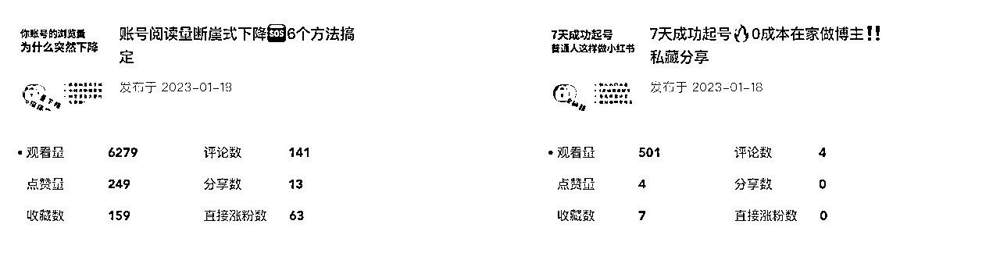

*   最初，由于自己没有原创内容，都是靠模仿他人的内容来输出，所以制作内容的过程相当吃力。因此，账号仅仅运营了7天，我就选择停掉了。然而，这7天的数据反馈却出乎意料地好。虽然账号停掉了，但这让我更加坚信小红书这个平台是有机会的。相比之下，小红书对普通人来说更加友好，更适合第一次尝试自媒体的人。之后，我一直在反思应该如何改进，并最终决定专注于垂直人群，创作他们真正需要的内容，并基于他们的需求和痛点来开发产品。

*   账号在停更了很长一段时间之后，于23年9月中旬重新发布了一篇笔记，发现数据表现还不错，于是我就将之前的内容全部隐藏了。而且，还有很多人通过评论和私信找我索要资料，我当时觉得这个赛道选择应该是没错的。同时，我也在着手准备产品，虽然当时并不确定产品能不能卖出去，或者是否适合市场。但我想着，先行动起来再说，毕竟最大的成本也只是时间成本。

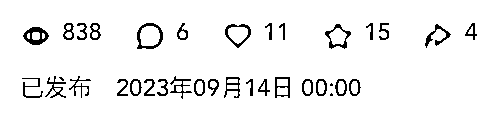

*   于是，我一边发布笔记，一边着手准备产品。在23年10月8日，我发布了第一条关于产品的笔记。下图是这条笔记的数据截图，当时虽然有一些数据反馈，但并不是很高。这条笔记的大部分数据都是后期通过搜索获得的。在接下来的内容中，我会和大家分享我是如何获取搜索流量的，因为在我们店铺后期的成交中，有近60%都是来自搜索成交。在小红书上搜索相关关键词，每10篇内容中，大概有7篇左右都是我们的。

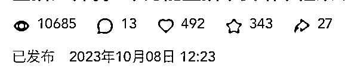

*   学习资料的产品笔记是中午发的，第一个订单是晚上成交的。

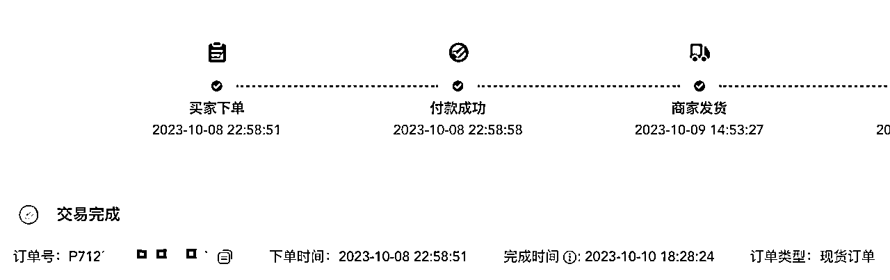

*   这个项目从9月开始，一直持续到现在。在去年12月份，我决定找朋友合伙一起做这个项目，我们两个人一共运营了4个账号。截止目前，我们单店的30天最高销售额达到了4.9万，同时粉丝数量也增长了8000多。那段时间正值过年前后，大家都处于比较焦虑的状态，所以出单速度相对较快，这一点我当时就已经预料到了。

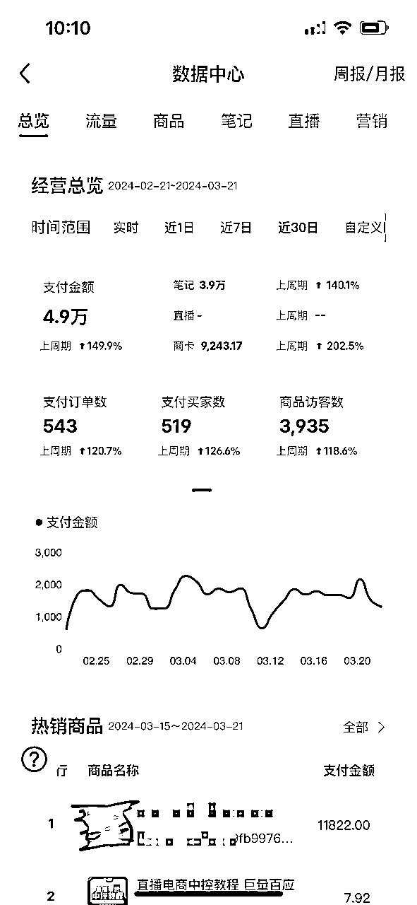

*   2024年11月15日补充更新，近期开了个新店，同款产品起店稳定销量花了将近四周时间，现在单个店单月最高卖了6.7w。下图是10月份单店gmv截图。

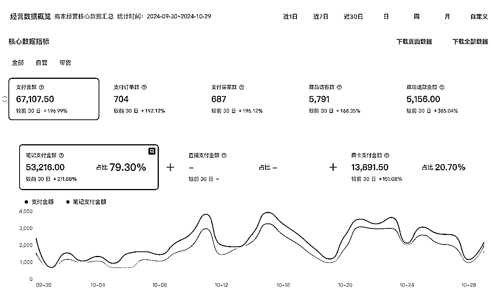

*   以上是我做这个副业的大概时间线，可能有些杂乱，但大家可以根据这个时间线去浏览下面的干货内容。目前，我们还在基于当时选择的产品进行扩展，开发新的产品。目前只有两三个同行在学习并尝试模仿我们的做法，但他们并不了解我们的核心优势是什么。他们从去年年底开始尝试，至今他们的笔记数据虽然看起来不错，产品的客单价却比我们低了一半，而他们最高的销量也只有220多单。

# 第二部分：具体操作流程揭秘

## 1.选品策略：

### 1）如何选品

a.选品一定要垂直。怎么理解“垂直”呢？就是说，我们可以选择一个大领域，比如国考、艺考、小学学科资料等，这些都是我认为的大领域，因为它们的产品还可以进一步细分。以国考为例，它可以细分为行政、申论、面试等板块；艺考则可以细分为面试、文艺常识、专业知识等板块。这就是细分。在初期，想要快速取得成果，一定要从这种落到实处的细分领域入手。原因是，用户会针对性地搜索“国考面试”、“公务员面试”、“文艺常识”、“北电面试”、“浙传艺考面试”等关键词。这样，在我们埋设搜索词时，就可以覆盖每一条笔记。当我们的笔记和账号数量足够多时，搜索出来的内容基本上都会是我们的。

b.看平台关联笔记。以我做的第一个垂直类产品为例，如果它在平台上的相关笔记数量能达到几万加，那就说明在小红书上这个产品有很大的市场潜力，目标用户群体比较多。你可以在小红书的搜索框中输入“xxx内容/产品关键词xxx”，如果关联笔记的数量能达到几万加，那就意味着这个产品或内容在小红书平台上有很大的发展空间。当然，如果关联笔记只有几千或几百，也并不意味着不能做，只是相对来说，这样的产品或内容可能出单速度较慢，数据表现不会特别好。我们在进行新品延展的时候就发现了这个问题，虽然偶尔也能出单，但出单速度相对较慢。

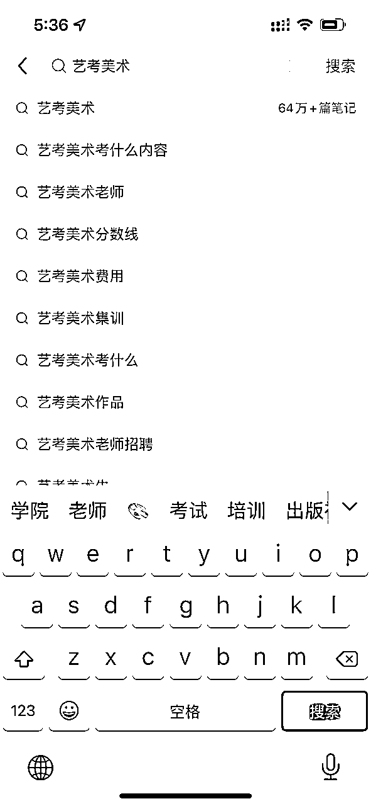

c.联想词选品。和上图一样，可以在小红书上输入想要进入的大领域名称，比如国考、小升初、专升本，然后观察下拉出现的关联词。这些关联词基本上反映了用户的需求和痛点。根据我的个人经验，如果你第一次搜索时，某个联想词出现的位置越靠上，那么它的需求量就越大。因此，我们的产品就可以围绕这些高需求的联想词来开发。

### 2）产品从哪儿来

这个是大部分人问的最多的问题。

我们的产品，初期都是从同行那里来的。在小红书上，有很多博主会推出一些引流的产品，甚至是付费购买的产品，我们直接去买来就好了。为了避免内容重复，建议多买几家的产品，但在购买前一定要让他们给你发目录，确保不会买到重复的内容。

当然，你也可以去闲鱼、某多、某宝等平台购买，这些平台可以作为基础选项。因为我觉得这几个平台上的产品，内容质量和规划结构可能都不是很好。相比之下，小红书上的产品至少都被整理过一遍，但其中也有少部分内容质量不佳的。不过没关系，他们的内容质量越差，我们赚钱的机会就越多。

因为资料大家都能弄到，比如现在流行的国考、省考、经济师等各种资料。如果同行做的产品特别差，很多用户会在商品评论区反馈。一旦看到不好的评论，大部分人就不愿意下单了。所以，我们后续在做产品的时候，也要注重商品评价的优化，这是提升转化率的关键。

在拿到这些同行的资料后，我们需要花时间进行整理、排版、分类和融合，把它打造成一份像样的学习资料。如果缺少某些内容，又不是自己擅长的领域，可以通过网络搜索（如网页、微信文章）来进行补充。想要更快速或更高质量地找到对应的网页链接，我建议使用百度的文心一言进行提问。它在每次回答后，下方都会附带对应的网页链接。如果没有带的话，可以在指令里加入“你基于你的知识库和全网进行搜索”。最终呈现的学习资料，如果你自己都觉得非常有价值，那么下单的人也一定会觉得很值。

### 3）版权规避

大部分资料都是没有版权的，而有版权的通常是那些课程。因此，我建议大家不要去制作盗版课程产品。或者，你可以借助AI工具对资料进行重构和优化，调整结构、改变文案表述，这样也能在一定程度上规避版权问题。

如果你没有后端支持，但确实想利用一些可能存在版权问题的资料，并且这些资料已经有了一定的流量或销量，那么你可以尝试联系版权作者、讲师或相关机构进行合作。这样，你不仅能在很大程度上规避版权问题，还能为你的业务增添更多合法性和专业性。

### 4）我为什么要去挂在店铺里？

很多人选择将学习资料或虚拟资料转移到私域，主要是为了方便后续转化更高客单价的产品，或是降低退货率。但我从一开始就选择了不同的路径，我将所有产品，哪怕只是1块、1毛的商品，都挂在店铺里。

这样做的好处有几点：

首先，现在很多人都不喜欢私聊、后台tt或加微信，遇到这样的客户，我们可能会失去一个客源。但如果让他们直接去店铺里购买，即使只是几块钱的小额交易，他们也不会太在意。这样，我们就能很快地“赚到第一个1元钱”。而且，一旦他们下单，我们就能获取到他们的信息，包括手机号和联系地址，这时我们就可以主动添加他们的微信。根据我们的经验，通过这种方式添加的好友，80%的人都会通过好友申请。后续就看你如何在私域进行沟通和运营了，生财星球里有很多关于私域运营的优质资料，大家可以去看一下。

其次，这样做还能省账号。因为如果经常给人私信发消息，账号很容易被限制。我们也试过直接发微信号，但经常需要换号或者换引流方式，太累了。但在店铺客服沟通时，我们可以采用更隐蔽、更安全的方式来引导用户添加微信，目前我们还没有遇到过问题。而且，客服还可以直接发送链接网址，非常方便。我们还可以设置拍下后自动发送短信，短信里添加微信二维码也很安全，一条短信只需几分钱。

最后，开店铺做商品链接也弥补了我笔记信息不足的问题。我可以在商品链接里写得足够详细，包括资料的内容、提供的服务等，这样用户更愿意下单，也更愿意加入我们的私域。

### 5）产品资质和店铺类目选择

0828更新补充本节内容：

关于产品资质的问题，有人问是否需要许可证？答：不用。大家可以观察拼多多、淘宝等平台，也有很多人在售卖自己打印的产品，目前都没遇到问题。不过，这确实存在潜在风险，因为如果出现问题，多半是同行举报所致。我们已经提前预判了风险，所以无论是电子资料还是纸质资料，对外都统一口径说是“赠送的”，这样一来，产品就变得合规了。在小红书上，我们可以挂上俱乐部或社群的链接，小红书笔记还是在宣传资料本身，但实际对外口径是加入社群后赠送的内部学习资料。同样，也可以挂上视频课程，视频质量没有特定要求，因为大家主要关注的是学习资料。

关于商品在小红书的产品类目选择，初期我们的电子版选择的是“艺术潮玩-艺术品及周边-艺术定制-虚拟定制”。后期则选择了“笔记本”、“文具”以及“教育培训”等分类。像“虚拟定制”、“笔记本”、“文具”这些类目都不需要资质审核，后台添加类目基本上都能审核通过。不过，如果选择这些类目发布商品，建议在商品标题中加入相关类目的关键词，例如“2025国考/考公/公务员 政策解读定制笔记本”，这样在审核时更容易通过。如果审核未通过，建议检查商品链接的所有文字部分，是否提及了“书”这个关键词或其他违禁词，一旦提及，基本上都不会通过审核（我们目前的情况是这样）。但如果你本身拥有资格证书、毕业证书等，可以选择“文具/文化/文创/宠物 > 教育培训 > 技能培训-xxxx”等类目，这些类目只要有相应资质就可以通过审核，并且在文案、商品链接介绍上可以更加自由发挥，不像前面提到的那些需要那么谨慎（但仍然不能提及“书”这个字眼）。

如果想确保安全却又没有证书怎么办？（注意，个人店无法操作此方法，只适用于蓝v店）最近，我们发现了一个巧妙的策略，可以称之为“借花献佛”。具体有两种实施方式：

a. 你可以在小红书上发布笔记，寻找拥有所需证书的人购买。通常，只需花费200-500元就能买到，因为实际上你只需要一张图片。之后，自己再补充一份合同即可。

b. 如果你不想花费这笔钱，可以尝试在Boss直聘上发布类似岗位的信息，并将拥有该证书作为第一条要求。同时，将工资设置得相对较高，这样会吸引很多人来咨询。在简单沟通后，你可以询问他们是否持有该证书，并请求查看照片。大多数情况下，他们都会主动发送给你，这样就获得一份了一份资质证书（基本上发来的都没打码）。

## 2.内容创作：

### 1）如何写爆款笔记

a.学会模仿

因为这种类型的笔记是需要很大的量的，如果我们全部原创的话，每天的效率会非常低。在去年和今年上半年，小红书的规则还不是特别严格，我们的策略主要是以“模仿”为主，偶尔替换一些关键词。比如，如果别人的标题是“考公，面试官最反感什么”，我们就会稍作调整，变成“考公，面试官最不喜欢什么”，甚至进一步拓展为“考公面试官最讨厌的行为”或者“考公面试千万不要这样做，面试官特反感”。我们会在保留原帖意思的基础上，进行不同程度的变形。

对于这类笔记，我们通常不会在正文中写太多内容。如果写的话，也只是简单提及资料的一些要点和标签。因为我们的产品是学习资料，我们需要将产品视觉化，也就是说，我们的图片就是学习资料的内容。特别是当封面有很多字时，用户也更愿意点击和互动，因为字多，大家会简单浏览一下，然后点赞/收藏起来以备后用。虽然其中很大一部分人并没有购买，但他们的互动数据可以让这条笔记被更多人看到。

b.如何找爆款笔记

关于如何找到爆款笔记，其实方法很简单。你只需直接搜索与你的产品或内容相关的关键词，然后按照热度进行排序。找到热度排名第一、第二的笔记，直接模仿它们的风格和内容即可。我们目前销量最好、数据表现最出色的笔记，都是模仿了那些超级爆款笔记的选题和标题，只是我们在笔记的图片和内容上做了一些差异化的调整。而且，这种特别爆款的笔记选题，你可以反复发布，比如每周发一次，因为曾经爆过的内容很有可能再爆。

c.原创笔记的选题是：延展赛道类目

现在我们不再完全模仿别人的笔记了，而是将重点放在参考别人的选题上。那么，我们现阶段是如何确定笔记选题的？我们会将产品或赛道进行进一步的延展和细分，这些细分的内容就构成了我们的选题和标题。同时，我们也会考虑“应季性”，比如小初阶段的内容可以结合寒暑假来策划；国考相关的内容则可以结合当前的时政热点，如某某会议、某某政策，甚至最近大火的黑神话，由于其巨大的影响力，也有可能出现在国考的试题中。

### 2）封面怎么搞定

关于学习资料的笔记封面，我并没有进行详细的统计。但从经验来看，有两种形式的封面表现较好，点击率也相当高。一种是文字较多的类型，让人一眼就能看出内容很干货；另一种则是采用简洁的背景加上关键词，直接明了地突出主题。对于字体和颜色的选择，越鲜明越好，不必过于复杂或艺术化。具体效果可以参考下图：

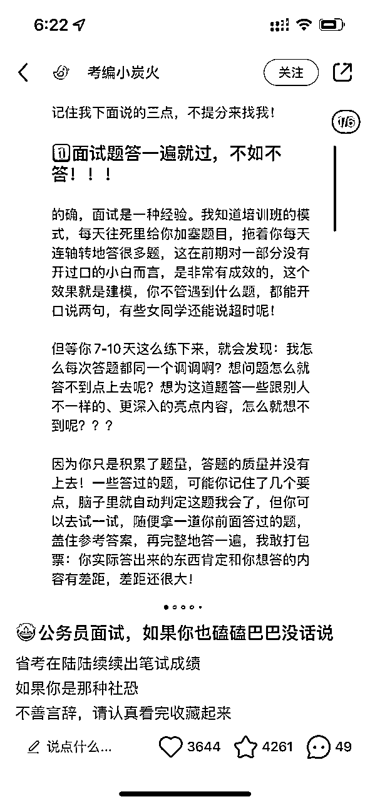

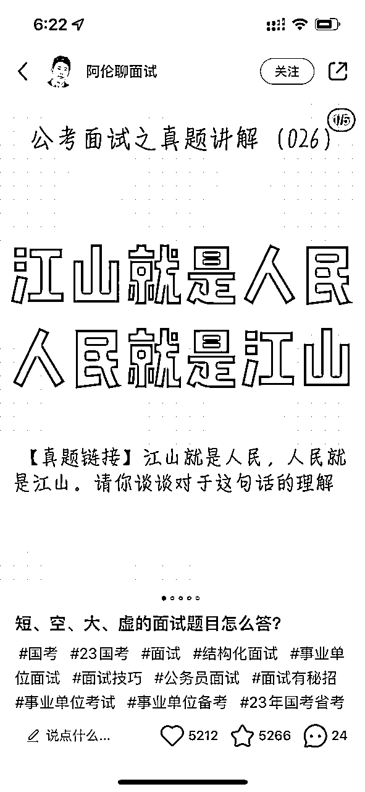

### 3）新规低质量笔记调整方案

小红书近期出了一个新规，它的标题是《针对大量发布重复/低质交易笔记行为的治理公告》，8月15日生效的，我想大部分在做小红书的朋友都有看到。这个新规主要是针对在小红书平台内通过搬运、重复、低质量混剪等劣质内容拿流量的行为。巧了，其中有一个就是针对我们在新规前主要发的内容，新规说：“账号多次剪辑影视作品或者翻拍书籍内容，没有二次创作解读，挂书本或者课程商品的交易笔记”。（如下图，新规中配图）

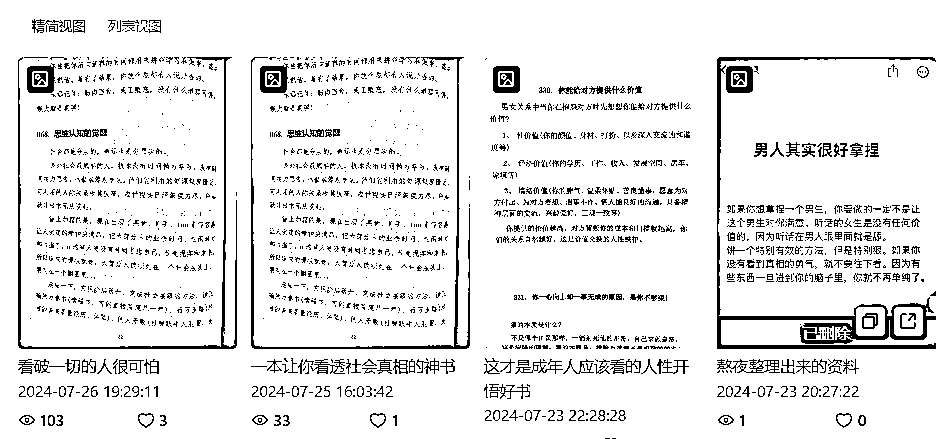

这个新规简直就是为我们这类内容量身定做的！刚开始，我们以为可以轻松应对，但发了几条内容后，发现数据比以往低了不少。于是，我们开始进行调整，调整之后数据逐渐恢复了。主要进行了以下几种形式的调整：

第一种，保持原来拍摄产品内容的图片不变，但在笔记正文里增加了200字以上的文案。这个文案可以直接从我们的产品中搬运，也可以参考同行的多篇文案，然后用AI工具将这些文案巧妙地结合起来。

第二种，采用vlog形式，将产品融入日常生活中。如果大家看过那种“女生一个人在家做电商月入10万”、“一个人下班做跨境赚到5万”的视频内容，应该就能理解我说的这种形式。就是混剪生活素材（如上班、工作、路上、吃喝、逛街、玩、风景等），然后配上语音讲解。语音文案内容主要与产品相关，并在其中解决目标人群的痛点需求。对于我们的资料号来说，这种视频的时长最好不超过90秒。虽然制作这种笔记效率低、麻烦、文案有难度，但它的优点在于现阶段数据比纯资料产品图好，更容易爆火，而且相比图文有更好的长尾效应。

第三种，纸质版资料实拍并涂写标记。这是我们目前调整后，比较省时省力的一种内容呈现方式。提前准备好文案后，在各种场景背景下拍摄资料即可，只需要露出手来出镜，基本上一遍就能过。同时，遇到爆款文案时，还可以在不同场景下反复拍摄，数据表现也还不错。

## 3.搜索流量优化：

之前提到过，搜索词的选择非常重要。当搜我们这个领域的关键词时，展现出来的基本上都是我们的笔记。而且，我们后期的大部分成交也都来源于搜索。比如下图（左）所示，3月份我们卖了3万多，其中有67%的金额是通过搜索成交的。再给大家看一个更极端的例子，前两天我发现我们有一个账号的观众来源中，有96%都是来自搜索。说实话，我现在都不确定这是好事还是坏事了。

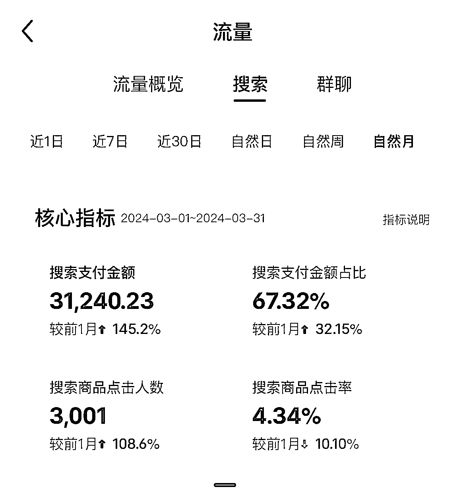

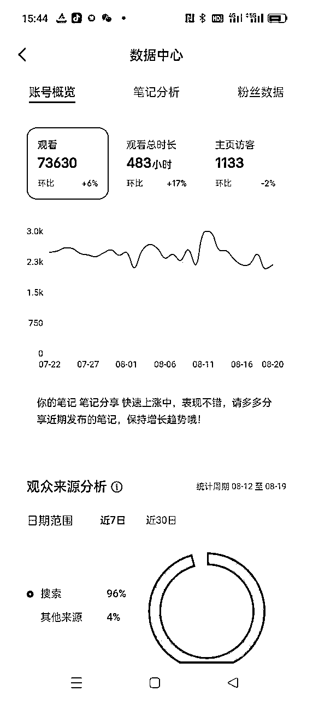

### 1）找搜索词技巧

赛道基础关键词：国考、艺考、吉他、直播、面试；

目标用户搜索词：搜索框输入基础关键词，看下拉联想词，联想的都可以；

笔记内容关键词：就是你的这篇笔记主要讲的内容，比如小学语文背诵、事业单位面试真题等。

### 2）埋搜索词技巧（关键词布局）

我之前在某个地方看到过（具体来源记不清了），在别人的课程中也提到过关键词权重的问题（这只是我个人的理解，仅供参考）。我认为关键词权重的大致顺序是：标题>内容>标签>评论。

下图是布局方法：

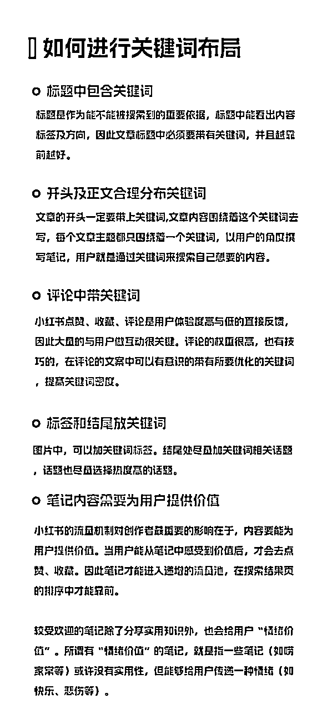

# 第三部分：从虚拟到实体，价值升级

## 1.升级背景：

*   在我做了快两个月的时候，遇到了同行。她先是给我的内容点赞和收藏，接着还拍下了我的产品但待付款，我就知道，我的“秘密”藏不住了，有同行要来分一杯羹了。同行的出现意味着这个赛道不再是我一个人的垄断，人人都可以参与进来，那我能赚到的钱自然就少了。于是，我开始重温生财之前的各种文章，进行复盘，并附上当时做笔记的关键词，以便更好地分析和应对。

=引导私域做成交占比90%；

=在短视频、图文最后、评论区要留资料，资料最好是打印出来的，纸质版更让人想要；

=评论区让他们发xxx，或简单钩子，然后@小号，或者发粉丝群链接；

=粉丝群助理引导，转私域送资料；

=私信回复：可语音、表情包、笔记或小号主页（带微信号的）

*   这篇笔记是我针对性阅读相关文章后，专为引导私域流量而整理的。里面的每一种方法我都亲自尝试过。特别是那句“纸质版资料更吸引人”，让我深受启发，下定决心制作纸质版引流资料。最终，我采用了“店铺+纸质版资料”的模式，效果雀石不错。

*   这个纸质版最大的优势在于：同行很难复制同款。因为我之前进行了大量的收集整理工作，并且在这个阶段不断发布内容，对这个领域已经有了一定的了解。在后续的产品制作中，我融入了很多自己的理解和独到之处，虽然这些内容不是我原创的，但我能准确地找到并巧妙地运用它们，形成独特的竞争优势。

*   在过程中，我也遇到过一些非同行想要电子版的情况。确实，电子版对大部分人来说更为便捷。但我都一一拒绝了。虽然这样做可能会让我失去一些客户，但从另一个角度来看，这一操作实际上延长了我的店铺和账号的生命周期。对我来说，每个月在公司做直播带货有固定收入，所以情况还算好。但对于那些全职做这个副业的人来说，如果同行涌入，而下一个产品或项目还没准备好，就可能会突然面临很久的空档期，这无疑会影响他们的情绪。最终，事实证明，我的选择是正确的。

## 2.提升附加值+后续课程承接：

### 1）附加值能提升90%的私域添加+粘性

在这里，我想简单和大家分享一下我的产品策略。我从未将这个产品视为我的正式或主要产品，它只是一个引流品。即便如此，我的客单价也从未低于70元。

我的目的很简单，就是通过一些有门槛的产品，吸引高质量的私域用户。虽然这种方式的效率可能不如那种免费的引流方式快，但吸引来的用户质量和后续的成交率却远远高出其他形式。大家可以思考一个问题：如果一个人为了学习或获取某种资源，连几十块钱都不愿意花，那你觉得在私域引导他们购买三位数或四位数价格的产品，会容易成交吗？即使成交，那转化率又会有多少？这也与我的做事逻辑相符，我始终追求优质，我的客户也是如此。

虽然我已经设定了门槛，但仍有些人不愿意添加微信。遇到这种情况，我选择了增加产品的附加值。我在产品描述中明确写明：购买产品将享受持续更新和问答服务。增加这两项服务后，大家添加微信的意愿又提升了很多。由于产品的特殊性，目前大概有90%左右的人愿意添加微信。不要觉得这么便宜的东西，提供服务和咨询会不会太卷了，服务和咨询顶多浪费我玩游戏、刷韩剧的时间，那我觉得不如把它变成产品的一部分，还能提高的收益。如果主创人员时间精力不允许的话，可以招一些兼职的人，每个月只需要2000-3000，他们就能把线上咨询做的很好。而我们只需要做的就是，提前做好问答的内容汇总，直接发给他们。如果有特别的问题，他们无法回答的，都会统一汇总到我这里，每天晚上做一个统一的回复。

### 2）后续课程承接

加到微信的人，都是相对精准且具有付费意愿和能力的潜在客户。在中期，我曾打算自己研发产品，并在私域进行转化，但发现无论是时间还是成本上的投入都相当大，这让我陷入了迷茫。

刚巧那会儿，我搬家到了广州，并且之前已经加入了@郑韩 韩哥的星球，于是我决定向韩哥寻求建议。我向韩哥阐述了我目前的情况和近期的迷茫，韩哥听后说：“你可以找团队负责后端，你与他们合作就好了。”

这句话仿佛醍醐灌顶，瞬间点醒了我。他的意思是，我可以专注于前端的引流和获客，而将后端的产品交付交给其他团队来做，我只需要参与分成就行了。真的是当局者迷，我之前一直没有从这个角度去思考。

最近，我也找到了合适的后端交付团队，并在朋友圈重点营销他们提供的多种价格的大课程产品。而且，这个团队还有专门的人员负责在私域的群里为大家解答问题。值得一提的是，我们所有私域的微信都是个人账号，并没有使用企业微信。

## 3.产品延展：

在今年，我们对产品进行了进一步的延展，选了足够垂直且细分的类目进行深耕。新产品已经推出一个月，目前的数据表现还可以。

# 第四部分：选对赛道，持续成长

## 赛道选择建议：

在这块也是想对还在选赛道的朋友，做几点建议：

a.垂直细分的赛道更容易成功。因为做的人少，做的有品质的更少，如果这个赛道产品品质低的话，那我们就可以来就赚钱了；

b.尽量选择具有长久需求的市场。虽然市场在不断变化，但某些需求是相对稳定的。我们要做的就是找到那些能在三年、五年甚至更长时间内持续赚钱的赛道。虽然这样说在现在看起来有些不现实，但只要你仔细观察具体的赛道，就会发现其实有很多这样的机会。比如专注国考面试、专注艺考、专注澳洲留学或者专注专升本等，这些赛道虽然听起来很宽泛，但实际上里面包含了很多细分的领域，足够我们长期深耕。而且，做长久不是为了稳定，而是为了有更多的时间和精力去培养团队，然后自己能够抽身去选择新的项目。

c. 对于个人或小团队来说，做小买卖是更合适的选择。就像我这个项目一样，即使我没有后端支持，仅凭前端的引流产品所赚的钱，如果按照每个人每个月成本1万来计算的话，每个月至少可以养活3-4个人。但实际上，这个工作在初期是我一个人完全在做的，我朋友是后期才加入的，所以一共也才2个人。而且因为“小”，我在进行产品迭代和优化的时候也更加简单、快速。

d.（2024年11月15日补充更新部分）还有两个小方向需要有一定的经验或者迅速获取信息的能力，我觉得其实是可以做的，我们本来是要计划下半年去做这个新产品的，但是下半年基本上在忙别的电商的事情，可能要拖到明年了。这两个方向一个是文旅，具体是什么品，你们可以去深挖一下，文旅行业哪些可以做成文字、或者书本；另一个呢，是我们做的第一个学习资料再细分的方向，就是下沉城市、乡镇县的公务员资料，这个大家可以去小红书深度挖一下具体的需求分类。文旅的品，我是一直想做的，但是由于的确有专业壁垒，如果有能做的可以通过鱼丸联系我，我可以当你的分销，然后提供一些产品的建议。

# 结语

首次在生财分享，若有遗漏或表述不清之处，欢迎大家随时提出宝贵意见～对于整篇帖子的结构，如果大家有任何建议，也请不吝赐教，我会根据大家的反馈进行后续的调整与优化。最后，祝愿大家都能生财有道！