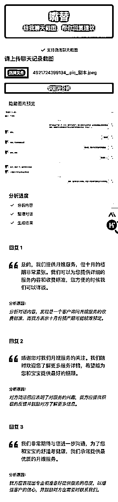
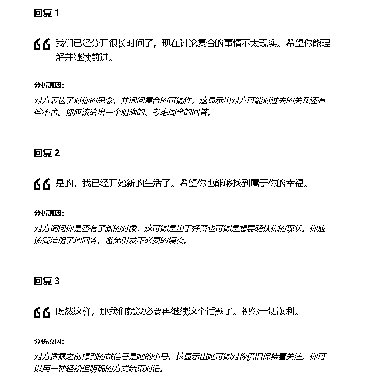
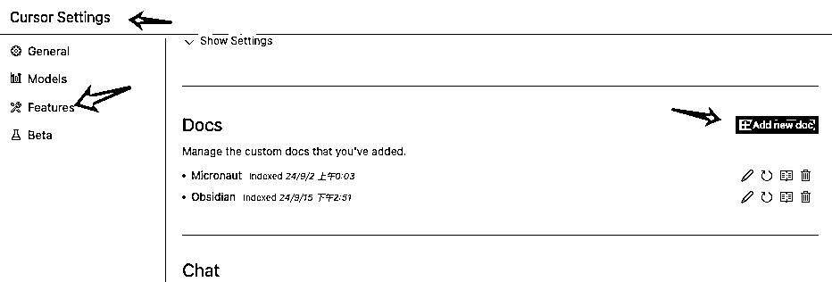
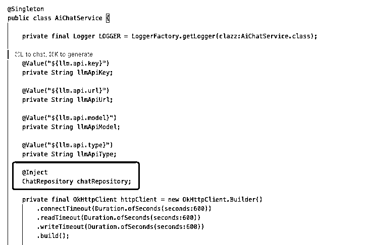
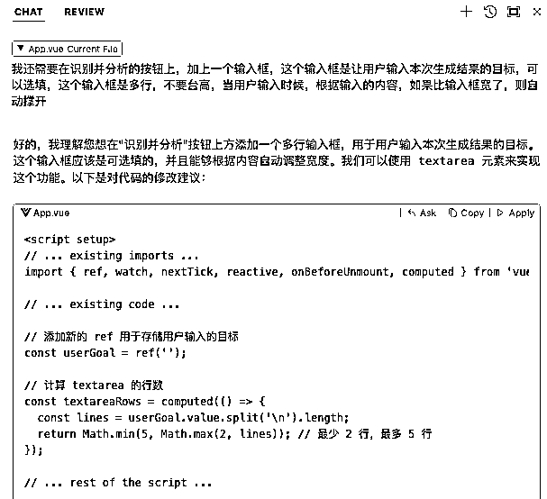
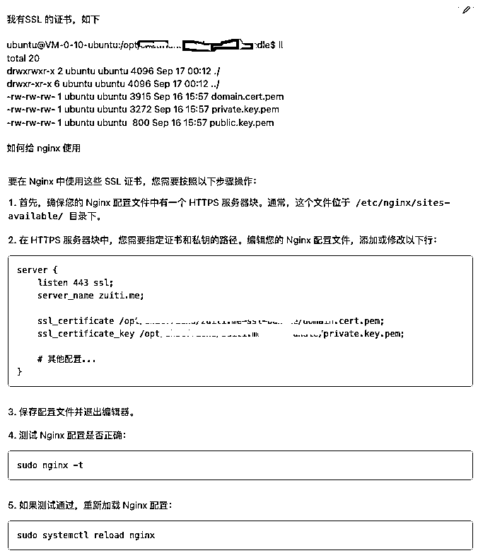
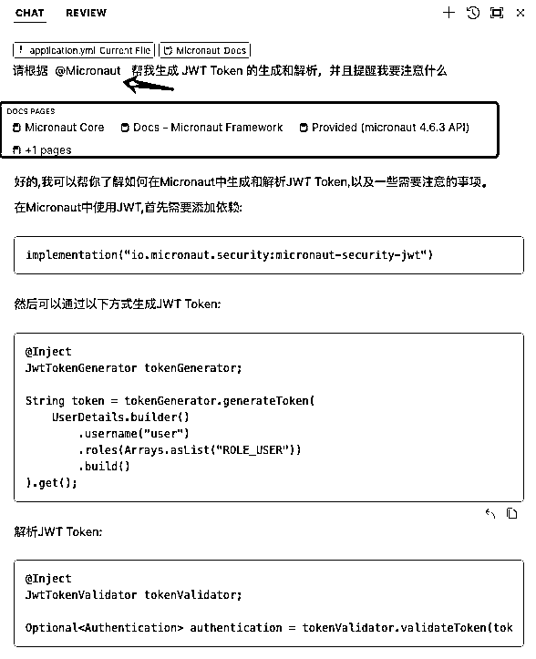

# 如何使用 Cursor 和 AI 一天半肝出来一个产品

> 来源：[https://rxas35pmvn.feishu.cn/docx/Og5TdyOpgobHFbxlzqDcfSuundg](https://rxas35pmvn.feishu.cn/docx/Og5TdyOpgobHFbxlzqDcfSuundg)

# 产品介绍

捋生财风向标，发现有介绍 Rizz 这个产品的，就是上传一个对话截图，然后帮你聊天

这个想法我在去年就有过，当时想做一个陪你聊的产品，但是一直没想好如何交互，这次看到 Rizz 上传聊天记录的这种交互模式，再加上这半年 AI 编程工具和应用的迅速发展。我就想能否借助 9 月航海的契机，尝试快速做一个产品原型 MVP 出来

## 介绍

### 先上截图

### 功能介绍

现在只有一个功能，上传聊天截图（微信），分析截图内容，给出建议回复，以及原因

## 功能构想

我设想了很多功能

*   回复建议

*   直接 AI 回复 ✅

*   根据选定风格进行回复

*   聊天对象信息丰富

*   聊天对象背景信息设置

*   聊天对象内容加星

*   给聊天对象设定回复风格

*   丰富自己的背景信息

*   设定我的基础风格

*   资料库

*   设定一些资料

*   履约流程

这个版本因为想快速上线，所以只做了一个功能

# 开发

在这里我给大家介绍一下我的开发和工具，以及在过程中的思考

## 决定开发

缘起就在上面说了，然后我开始先确认这是否是一个真实的可以赚钱的需求

1.  看 Rizz，是约会类的第一名，每个月大约可以有 20 万美金

1.  看 Rizz，起因是 Reddit 上的讨论，不知道怎么回复这是一个普遍的需求

1.  之前和朋友聊，他那边也是说身边很多人有这个需求

基于上面的东西，我没有继续更多的调研了，我就是想，如果可以在 24 小时做出来一个原型，然后上线测试，只要用户数量还可以，不愁收钱，而且收钱的天花板还不错

## 功能取舍

既然决定在 24 小时开发，所以功能上要有取舍

*   聊天对象的背景设置等。砍掉

*   多聊天对象。砍掉

*   要登录我才能知道用户是谁。砍掉，这个犹豫了一些时间，最终砍掉的原因是，我想部署在海外，Google 登录最自然，但是给用户门槛；微信等登录，如果在网页上，之前没做过需要查资料，费时间。

*   支持多个聊天软件截图。砍掉，最终决定只支持微信，先跑通再说。下一个应该是 qq

## 技术选型

这个小产品主题的功能就几个点

1.  一个前端，一个后端（废话）

1.  图形识别

1.  数据库

1.  AI

我考虑的是

1.  开发速度和发展维护性上做权衡，航海手册中有很多的快速部署工具，但是如果想要更好支持 OCR 的确是需要自己部署服务器

1.  要快速开发，我手上有一些已经积累的代码，我本身时候后端开发，对前端完全不熟悉

1.  Cursor 等 AI 工具，一定是通过大量代码训练出来的，那就找最流行的语言

1.  后端选择 Java，因为在熟悉程度和维护性上，而且我有了一些代码积累。Python 对我来说更适合做脚手架的工作。GO / Rust 不够熟悉，Js / Ts 还未经过需要长时间 Server 运行的积累

1.  框架选择了 Micronaut， Spring 太重，而且 Micronaut 文档完善，这个可以直接供 Cursor 使用

1.  前端选择 Vue，我对 Vue 的了解，1/10 分，但是我知道是可以用 Js/Ts，可以很方便的做自适应的网站

1.  组件库用 Flowbite，基于 Tailwind，省事儿，而且之前接触过一些

## 开始开发

工具使用 Cursor

使用 Cursor 时候，我遵循以下几个点

1.  前端、后端、OCR等服务，每个都拆成一个单独的项目，目的是让 Cursor 在项目工程中主要面对一种语言，让 AI 识别的更加轻松

1.  优先把涉及到的框架等内容，填充到 Cursor 的文档库中，在一些问题中让 Cursor 有可以查询的内容

1.  如果可能，先从网上找可以生成项目框架的方法，让 Cursor 使用起来时候就已经有了一定的代码基础

### 使用项目框架的原因

因为任何一种语言都有很多的框架，没有好坏只有适合。如果我们完全让 Cursor 从 0 开始构建，他会按照自己的方式去选型。如果我们想要对代码有掌控性，那这并不利于这一点。

比如 Java 最流行的框架是 Spring，如果让 Cursor 生成，则很大概率会受到 Spring 的影响，不管是代码结构、配置文件还是等等。这时候不如去找一个框架生成的工具，先把架子搭起来。Cursor 就会受到框架的限制，从而收敛，更容易给出有针对性的代码

## 使用 Cursor

在这个过程中，我对 Cursor 的使用分成三种

1.  在我熟悉的代码库中，我让 Cursor 扮演和我结对编程的伙伴

1.  在我不熟悉的代码领域，我让 Cursor 扮演开发，我来当做需求方，同时我对他的代码进行 Review 和修改

1.  在一些技术领域，让 Cursor 当做标准的 AI

### 和 Cursor 结对编程

和 Cursor 结对编程中，我会大量的进行编码工作，使用的比较多的功能是

1.  让 Cursor 进行代码填充，但是我会给代码起头，比如我自己写一些变量的定义等，这样 Cursor 完全知道要走什么我节省的是手的工作

比如这个框起来的类型的代码，我就可以完全先打 @Inj 这样的开头，Cursor 会联系上下文进行联想，准确率大约是8 成

1.  一个我脑子里面有完整实现想法的，我会使用 Cmd+L 这样的方式，唤起 AI 对话框，我来给他一个粗略的实现方式的描述，然后让他帮我生成代码，我在做合并动作

1.  不断的把报错信息粘贴到对话框，让他帮我看

这个过程我来主导代码库，也就是我明确的知道每个细节

然后让 Cursor 生成单元测试，通过对单元测试的 Review，反向检验业务代码的生成情况

### 我做需求方

在前端开发时候，我真的不熟悉，生成的很多代码也看的一知半解，我遵循这个流程

1.  使用 Cmd+I Composer 功能，先让他帮我生成多个文件。前提是我知道这应该是多文件操作

1.  生成的多文件，先放着，因为很大概率生成的文件是不可用的

1.  直接运行，然后让 Cursor 看报错，大量的时间在对话框中进行

我是需求方，所以我就需要把需求写的分场的明确，我还会给他一些可以参考的内容，比如前端我就会让他参考一些产品来做

然后最常用的还是在对话区域进行，这时候可以给出明确的需求。

因为我主要使用在前端，现在大部分的前端框架都可以快速在浏览器预览，所以这个修改-反馈的循环是非常快速的

### 把 Cursor 当做精通编程的AI

这时候就是当做 ChatGPT 问就行

### 一些 Cursor 的使用技巧

1.  提前把文档放进去，在一些小众的代码场景下，让 Cursor 生成时候，使用 @ 来选择文档，让他参考文档来进行

1.  尤其是很多框架更新速度是非常快的，不同版本之间也并非全部兼容，这时候让 Cursor 根据全新的框架来生成内容更好

1.  如果几次都无法生成满意的文档，可以新开一个对话 Cmd + L，然后先让 Cursor 重新通读一遍代码库 @Codebase

1.  灵活使用 Cmd+L 开启新对话和 Cmd+Shift+L 把选中内容放入已有对话中。

1.  每个对话都是有上下文的，如果你确定要保留上下文，请使用 Cmd+Shift+L 把选中内容放入上下文

1.  有时候上下文会有干扰，典型的已有上下文已经熟悉正在操作的代码了，人工修改了一些内容（比如修改变量名），此时如果还是在这个上下文中继续，则会把已经人工修改好的部分改回来。这时候就应该新开对话，采用新的上下文

1.  当想要 Cursor 横跨几个文件进行操作时候，可以在对话的地方通过 @ 选中这几个文件，多 @ 几个文件，然后一起提问，这时候他就可以知道一些上下背景信息了。在使用一些基础 Server 支撑当前正在编辑的业务代码中非常好用

1.  在生成一些代码时候，尤其是界面等，可以让 Cursor 去参考和模仿。

## 坑

*   Paddle OCR 的坑，就是各种配不上，配上了也很烦，自定义就更麻烦，好在搞定了

*   聊天 OCR 解析比想象的复杂的多，而且暂时只能支持微信（白天和夜晚模式）

*   AI 使用

*   AI-1\. 在调用国产模型、海外模型、本地模型分别做了测试，最后暂时选型使用 Kimi，然后本地 Ollama 千问 2 也调通了

*   AI-2\. 推理模式，利用推理模式显然会让回复更好，但是现在几乎只有 ChatGPT4+和 Claude 勉强可以用，考虑到成本，暂时放弃

在 AI 使用上，做了很多测试。如果把各种散乱的识别出来的内容，一股脑的扔给 Claude3.5 或者 ChatGPT4+，都可以很容易的识别出来聊天的内容和多个发言人，以及意图。甚至都不用多复杂的提示词。

但是如果使用国产的模型或者是开源模型（Llama3.1:8B 和 qwen2:7b）结果就很差。就需要大量的提示词的工作。

出于成本的考虑，以及对多 AI Agent 的准备，我还是先选择了 Kimi。可能只是一个过度方案吧。最终我认为还是针对领域要训练自己的模型，中文用千问 2 做基座，英文用 Llama3.1 做基座。

# 上线发布

虽然这是一个很简陋的“玩具”，并且功能上还有很多的缺陷，甚至生成的回答 AI 味也有点浓。但我还是决定先上线放出去再说

小范围的发出去之后，定向的和几个我认为会有需要的朋友简单聊了一下。就很快收集到一些反馈和需求，而且在一些特定的领域也有了深入定向的意向

在整体推广的节奏上，我还是想更加完善一些再进行下一步

### 下一步优化方向的思考

我自己是有很多的想法的，尤其是针对一些特定行业的特定人群。但还是决定把这个动作留在更后边。第一步还是去进行“抄”。既然 Rizz 是已经被验证的，这个验证即有需求的验证，也有交互方式的验证。那么还是先把他和相关产品的好的一部分抄过来再说。

另外下一步也想兼容一下 Whatsapp 等海外流行的聊天工具，完全翻译成英文再做一个多语言的站点。

上面是我在弄【嘴替】的过程。欢迎大家交流。后续的开发的情况我也会随时和大家汇报