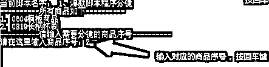

# 在小红书铺80个矩阵号，如何批量注册蓝v号、批量谈货源，以及批量混剪？

> 来源：[https://halulxp5w5.feishu.cn/docx/PPcrdO11CodhE3xr2jZcP26tnTd](https://halulxp5w5.feishu.cn/docx/PPcrdO11CodhE3xr2jZcP26tnTd)

# 一、批量注册蓝V账号

专业号相比个人号的优势在于专业号可以一个主号关联3个子号，后期我们上架商品的时候效率提升很多

## 1、注册主号开通专业号

#### 开通专业号


#### 开通店铺


#### 开通微信支付


## 2、注册子号（上限3个）

常规流程注册并实名认证子号

## 3、专业号和子号互相关注

常规互关

## 4、隐藏收藏和粉丝/关注列表


## 5、子号升级专业号

按照下方流程图来搞


## 6、专业号邀请子账号

### 1、母号发送邀请


### 2、子号接受邀请


### 3、母号开通子号权限

权限开通完成后子号清空一下小红书程序，重新打开，即可看到店铺就有了，代表绑定成功


## 7、注意事项

1、主号不发笔记，只开店挂商品，子号只实名和发带货笔记/视频，这样做为了避免主号死了，3个子号全死，所以主号不发笔记

2、专业号升级经常遇到名字审核不通过，会有小红书官方客服回访电话，不知道如何起名，直接让客服帮你起一个能通过的名字

3、专业号升级600元费用

# 二、批量下载素材

1、考古家旗舰版批量下载视频链接（闲鱼共享号或者跟人拼号比较便宜）


六、哼哼猫批量去水印

将导出的素材链接粘贴到哼哼猫，每次最多20个，批量提取后，仅下载视频即可

如果没用考古加会员，抖音手动一个个复制链接填进去，每次复制20个链接批量下载视频，目前哼哼猫是批量去水印应用最广泛的工具


# 三、批量发货

单量少的时候有些1688商家不想走店管家，我们可以从1688网站代发下单，但是单例多的时候，比如一天十几单，手动下单效率就比较低了，我们可以通过店管家自动下单发货

## 1、店铺管家注册并登陆

https://fxali1.dgjapp.com/Common/Page/NewOrder-WaitOrder?token=B7DA7EE06CE60E00985A7A4FA85BCC15&dbname=wdJM8OZZiF60rm73/6ttwJTwCBwY2vpy

## 2、添加店铺，选小红书，然后小红书扫码授权


## 3、绑定商家、绑定厂家

绑定后告诉1688商家，让他们审核通过一下


## 4、将对应的商品关联到对应的厂家

点击左侧【商品列表】，选中要对接自动发货的品，点击【商品批量绑定厂家】，即可将对应的商品订单推送到商家那里，后续我们不用自己发货，只需要盯售后即可


## 5、绑定店管家后如何打款？

添加商家的微信，微信对接打款

## 6、绑定店管家后如何对接售后？

创建一个售后表跟商家对接


## 7、批量谈货源

将谈货源的话术模板添加到搜狗输入法快捷方式，谈货源的时候可以直接点常用语就发送了，不需要一个个去输入问题，等商家回复即可

1、小红书面单或者菜鸟面单可以吗？

2、退货的话发出运费扣多少？

3、能否绑定店管家自动派单，能的话发一下店管家账号，单量上后我去绑定店管家

4、发货时间是24还是48小时发货

5、麻烦以上问题回复一下，顺便发一下退货地址，我填到小红书后台


# 四、批量剪辑

## 1、基础说明

根据显示的对应程序名称，跑对应的程序

### 电脑硬件配置要求：CPU i5以上，16GB运行内存以上，CPU核心数8个以上，没这配置就别跑了


2、链接: https://pan.baidu.com/s/14PkYewJRlnTw9Mu47FpTew?pwd=5pye 提取码: 5pye

## 3、准备工作-创建商品和配置

### 3.1 修改主配置文件main.json


### 3.2 创建商品运行参数配置文件

复制商品配置文件


名称命名为和主配置文件的商品名字一样的名称


### 3.3 创建商品文件夹

同理，复制文件夹模板创建出0819长柄杯刷文件夹


### 3.4 在画面素材里面新建当日日期目录


你的素材是什么时候下载的，你就写什么时候的日期，例如20240819，因为后面我们可能同一个商品需要多次下载素材，都创建下载素材的日期


这时候我们已经完成创建


## 4、把素材放入对应的文件夹

### 4.1 爆款脚本文件夹

放入爆款脚本，只放1个

### 4.2 画面素材文件夹

放入画面素材，首次下载30个左右，我这里演示，放的少


## 5、爆款脚本分割（方法一：程序直接分割）

### 5.1 修改配置

在0819长柄杯刷.json中修改爆款脚本的名字，直接复制粘贴


### 5.2 启动程序




### 5.3 程序执行完成


### 5.4 生成的文件

#### 5.4.1 生成爆款脚本的分镜文件

从frame_1.mp4-----frame_8.mp4

#### 5.4.2 解说音频

0819长柄杯刷.mp3


#### 5.4.3 分镜信息文件


### 5.5 检查程序分镜

打开剪映，导入【爆款脚本分镜】和【解说音频】文件夹


爆款脚本镜头按【名称】和【A-Z】升序排列，这样就从frame_1---frame_8来排序，直接拖入剪映主轨道


音频我们也拖进去，然后关闭镜头轨道的声音，听一下是否对的上，对的上就没问题，如果对不上，建议用下方的手动标记帧信息的分镜方法


### 5.6 制作分镜信息描述文件

打开分镜信息文件，复制内容，不要复制最后一个逗号


粘贴到 3、检测替换比例创建归类文件夹 这个参数里面，注意我们的数据格式为 [ [], [], [] ]，注意不要粘贴错


手动指定替换还是不替换

手动编辑镜头描述


### 5.7 复制做好的分镜信息到

将程序3中描述好的分镜信息，复制粘贴到 5、检测分类文件夹素材量 和 6、剪辑合成对应的位置

注意[[],[],[]]格式，其他没啥注意的


## 6、爆款脚本分割（方法二：剪映中分割，手动标记帧信息，然后程序分割）

### 6.1 修改配置

在剪映分镜好后查看轨道上方的时间点信息，标记镜头时间，在用程序根据时间来切分

第1个分割位置：00:00:00:00


第2个分割位置：00:00:02:20


第3个分割位置：00::00:05:02


第4个分割位置：00:00:06:25


依此类推，一直记录到最后一个，记录到手工标记时间的参数里


### 6.2 启动程序


### 6.3 人工记录时间点信息分割优势

剩下的步骤同5.3--5.7一样

人工标记时间分割提供了一种更更细化的分割方法，程序分割有时候分不准确的时候，我们可以人工分割

## 7、检测替换比例创建镜头分类文件夹

启动 3、检测替换比例创建归类文件夹.exe程序，输入商品


### 7.1 自动计算替换画面所占比例


### 7.2 自动创建分类文件夹


### 7.3 自动将每个原始分镜放到对应的分类文件夹

自动将刚才的frame_1.mp4到frame_8.mp4依次放到对应的文件夹，并且命名为了key.mp4，


## 8、素材画面分割

了解素材画面分割里面的参数，前面配置好，这里基本上不需要改参数，目前的参数就是最佳参数

我们找的几十个画面素材，用程序来切分成1-10秒的画面连续的片段

1秒以下的分割片段不保存：太短，画面跳动太厉害，如果想改参数，最低建议0.8秒以上

10秒以上的分割片段不保存：太长了意义也不大，10秒足够用来替换画面了

180秒以上的视频不分割：视频太长了，分割慢，而且3分钟以上的视频很多是重复画面，分太多重复画面无意义


自动分割完成，自动创建了【素材切分】--【20240819】文件夹，分割素材自动保存到这里


## 9、分割素材归类

### 9.1 导入分割素材

首先打开文件夹所在位置，导入分镜素材到billfish


### 9.2 拖动符合时长的素材到对应的文件夹

程序剪辑处理逻辑：

素材时长 > 镜头时长：

比如素材时长2.1秒，镜头时长1.8秒，则裁剪掉素材多余的0.3秒

镜头时长 * 0.8 < 素材时长 < 1 :

后期会程序自动变速，比如2秒钟的镜头，我们的素材最低要1.6秒，从1.6变速到2秒画面播放还算自然

通过Billfish软件筛选出符合片段时长的素材，拖动到对应的归类文件夹


### 9.3 Billfish筛选

也可以通过筛选大于多少秒的视频，这样对于一些3-5秒的镜头，我们更有针对性的去拖动到对应文件夹


### 9.4、检测分类文件夹的素材量

为了保证后面剪辑混剪足够随机，每个分类文件夹的素材量我们心里要有数，每个需要替换的文件夹最少有10个满足时长要求的镜头，这样才能有足够的素材去随机替换，但是前面为了提高效率，我们测品的前3天需要满足5个以上符合时长要求的片段

归类镜头数量：检查出分类文件夹有多少个素材

满足时长要求的数据： 素材时长>镜头时长*0.8都计入，后期可以变速解决时长问题

### 9.5 素材数量问题

满足时长的文件夹素材量 > 10: 显示白色

满足时长的文件夹素材量 5-10 ： 显示绿色

满足时长的文件夹素材量< 5 : 显示红色，需要补充素材


### 9.6 素材补充

对于缺素材的，我们针对性去补充，最后保证不低于5个，就可以进行剪辑了


## 10、程序混剪合成视频

### 10.1 参数

一般就需要改每次生成多少个视频即可


### 10.2 剪辑处理步骤

1、随机选择镜头画面

2、优先用新素材：

3天内新素材的随机选中概率为0.7

3-7天的素材随机选中概率为0.2

7天以上的素材随机选中概率为0.1

3、裁剪与变速处理

素材时长>镜头时长： 直接裁剪

镜头时长*0.8 <素材时长 <镜头时长 ： 自动变速（取代剪映中人工变速那一步）

4、添加了滤镜去重轨道

5、添加了画中画去重轨道

启动程序


最后在成品文件夹中我们可以看到最终视频


成品视频


## 11、剪映混剪合成视频

### 导入未拼接的镜头剪辑

如果需要人工剪辑特殊处理，比如处理字幕，可以导入程序的中间产物---【未拼接的成品镜头文件夹】，生成了很多个，已经做好了随机选择片段、裁剪、变速、调整画面比例，这样我们按顺序拖入剪映就不需要频繁的变速、裁剪和随机选文件了


导入【成品分镜未拼接】、【解说音频】


导入剪映的时候直接按顺序拖入对应的分镜文件夹里面的镜头文件，再进行画中画、滤镜等操作


# 五、Windows共享文件

涉及到多人协作文件共享的操作，可以Windows局域网实现文件共享，实现内部人员协作的高效文件传输

员工做好了，保存到共享文件，或者我做好了，保存到共享文件夹，实现同一局域网下的所有人都能访问公共文件，实现内容的互通，而不必频繁的互相传输文件导致的人力和时间浪费

## 1、主机

创建其他用户


## 2、分机


一定要添加Windows凭证


# 六、封面抓取和去重

## 整体参数配置

```
"zhuaqutupian": {
        "User-Agent": ["Mozilla/5.0 (Windows NT 10.0; Win64; x64) AppleWebKit/537.36 (KHTML, like Gecko) Chrome/123.0.0.0 Safari/537.36"],
        "cookie_file": "./抓取图片并去重/cookie.txt",
        "quchongsucai": "./抓取图片并去重/去重素材",
        "output_dir": "./抓取图片并去重/输出图片",
        "link_csv": "./抓取图片并去重/笔记链接文件/笔记链接.csv",
        "opicaty": 0.01,
        "shengchengcishu": 2,
        "fanzhuan": 0,
        "zaosheng": 0.05,
        "suofang": 1.05
    },

    "zhuaqushangpin": {
        "User-Agent": ["Mozilla/5.0 (Windows NT 10.0; Win64; x64) AppleWebKit/537.36 (KHTML, like Gecko) Chrome/123.0.0.0 Safari/537.36"],
        "cookie_file": "./抓取商品数据/cookie.txt",
        "goods_csv": "./抓取商品数据/商品数据.csv",
        "charts_html": "./抓取商品数据/商品图表展示.html",
        "chrome_path": "./抓取商品数据/Application/chrome.exe"
        "qingqiujiange":1
    }
```

## 网盘文件

抓取图片并去重

链接: https://pan.baidu.com/s/1nUP9KVxRpCutgML4r0Lgag?pwd=f4es 提取码: f4es

抓取商品数据

链接: https://pan.baidu.com/s/1EwccgOiXWc31Y4nZOfFiDQ?pwd=4hp2 提取码: 4hp2

## 抓取图片用户身份获取


## 抓取图片并去重

图片去重逻辑：

左上、右上、左下、右下、中心，随机加了5张贴纸透明度1%，并且整图又随机加一张画中画透明度1%

所以，【去重素材】文件夹里面的图，你可多找点网图，放进去，随机度就会更高，需要jpg、png常见图片格式

另外部分参数可调：

画中画透明度："opicaty": 0.01, 1%的透明度

生成次数："shengchengcishu": 2, 同一张图片去重后生成的次数

翻转："fanzhuan": 0, 0不翻转，1为水平翻转

缩放："suofang": 1.05，放大1.05倍后，边缘会被裁剪掉

噪声："zaosheng": 0.05, 越小，噪声去重越低


# 七、 商品销量抓取和展示

可以每天监控一次对标账号的商品数据


## 抓取商品数据用户身份获取

图示：


## 抓取商品并展示

# 八、 批量监控对标商品销量

## 登陆地址：

https://www.java1024.site/website/#/login

## 界面认识：


表格下方是根据你记录的销量数据的趋势图


## 自动监控商品：

输入小红书挂车商品链接，注意不是笔记链接是商品链接


2、点右上角箭头


3、点右下角的复制链接


4、输入商品链接点击自动监控


5、点击修改、补充商品相关信息，如果你只需要监控销量，这些信息不用补充，如果需要AI分析，这些信息在监控3-7天后补充一下


## 手动发布商品

点击首页【手动发布商品】


## AI分析

点击【AI分析】,会生成AI分析报告,并且得出一个评分，评分仅供参考


最后，在生财挖掘的小红书电商带货这个赛道，之前也是刚入门报了书豪小红书电商的训练营，慢慢摸索进去后总算舒了一口气了。

在做小红书店铺上，很多次想要放弃，在大的正反馈来临之前，一直不断的有问生财电商大佬@书豪各种小红书店铺选品和侧品以及运营实操方面的细节。

感谢@书豪让我成功的踏入了电商创业这条路，在我人生的低谷期解决了我实操和心态方面的各种卡点，感谢书豪的小红书陪跑课程对我的扎扎实实的帮助