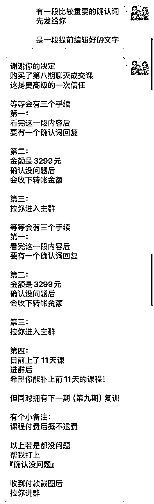

# 《如何处理退费(反对)问题，让高客单产品的退费率大幅降低？》

> 来源：[https://oee5lr7gsk.feishu.cn/docx/Pa0CdOP1RoFbfmxeYjzc6wAFnDf](https://oee5lr7gsk.feishu.cn/docx/Pa0CdOP1RoFbfmxeYjzc6wAFnDf)

全文共：5,816 字

预计阅读时间：6.66 分钟

圈友们好，我是根源

目前已经在知识付费、以及私域运营的赛道深耕两年半

这一年多，跟明白老师还有陈雪美女一起做俱乐部

成绩都还稳定，会员的净成长跟复购率，数据也都挺好

今天想谈一的主题，也是大家会比较关注的一个话题——退费问题的处理

其实在做任何的交付，不管是实体产品的交付，还是虚拟产品的交付，

我们很常遇到的就是客户或者学员，因为对于课程的内容不如自己最开始的预期，所以想退费。

又或者是他也没有提退费，只是表达，这课程我觉得不好，就希望我们可以做出一点反应。

那最终如果能退费，肯定是他们内心中最想要得到的目的之一，

但他又不明说，我们也不明说，就是导致这个场面其实挺尴尬的。

那如何更好地处理客户想退费的心，

这是每一个做产品/服务交付的人，都需要具备的能力

那我也通过这篇文章，谈一谈自己总结的经验

希望这些经验或方法，能帮到正在看文章的圈友

很欢迎看完文章后

能一起讨论。

* * *

# 处理退费问题的两大阶段

客户想要退费，或者给到一些不好的反馈，

我们通常会对这样子的场景有一个定义——『反对问题』，

处理退费（反对）问题分两个阶段

1.  「事前准备」

1.  「事后处理」。

* * *

# 应对退费问题的「事前准备」

第一个我想先谈处理反对问题的「事前准备」

因为我目前的产品主要做的是知识付费的交付，它是个虚拟产品。

那如果是虚拟产品，我就会在处理前会有一个比较繁杂的手续。

因为我算是个体户，并不是那种很严谨的公司，

所以，在客户做购买产品、贩卖产品之前的的准备，我可能会多一些文字上的解说手续。

## 退费规则越清晰，后续的退费就有机会越少发生

在贩卖产品之前，如果说我们能把这个产品的交付规则说的越详细，

这个规则倒不是说我课程到底要交付什么，因为这个本来就应该在海报上做一个比较完整的呈现。

这里谈的是跟他说明这堂课的退费规则，如果说这个可以说的清晰，

就能在东西卖出去之后，客户如果真的会有很多问题，或者真的会有疑虑，甚至真的会有不满，

能够因为这个规则说的清晰，让他不会因为不满，就马上找你宣泄他不开心的情绪。

那这个规则就像是

我自己在卖产品的时候，一定会有一段话在最后说明，就是售出之后概不退费。

这里并不是说，不退费就一定好，其实都不是的，

而是我们能不能够让客户清楚的知道，他花钱购买这个产品之后，

如果说他真的有反对问题，最差能够得到一个什么样子的反馈。

像有人的产品可能是这样子

假设今天是周四，今天购买之后，在周六的晚上12点之前，他都有机会可以选择退费。

也就是这个规则说的越清晰，对方就会知道说：

假设这产品我不满意，我能够在什么样子的范围下，我可以争取得到什么样子的权益。

也就是我们在处理反对问题的事前准备，如果规则越清晰，这时候反对问题（退费）就可以越少

一种就是，平台原本就有规定，这规定可能是三天之内你可以无条件的退款；

第二种是，如果说我们最终的收款或者是成交的场景不是属于平台，而是属于个人，

可能是微信转账，可能是转到公司账，我一般都会用文字讲的清晰。

也就是这时候的规定其实自己定。

因为定到最后，这会是一个你个人的原则。

* * *

## 成交之前的确认词，也是建立自己的规则和人设

如果你的产品买的人越来越多，他们就会知道：

购买你的产品就是能够有一天的犹豫期，

购买你的产品就是花付钱的那一刻，我就没有办法退费。

……

这东西只要说清楚，我们就会有一个产品购买之后的不退费的人设。

因为像我自己的产品，在售出的那一刻，

我都会有一段确认词，那确认词大概是这样子的形式：

我会有一个非常清晰的规则解说，

解说完之后，也会有一个很清晰的路径，这个路径它必须得按照1234的步骤做完，这个成交才算完成。

* * *

## 让客户感觉到你在为ta考虑，退费的概率就越低

那上次有个学员就问我说：

老师

我想知道一下，

你最后让我们回复你『确认没问题』，

这事情它是有符合法律效益的吗？

就我个人所知是不符合的。

但因为这个产品的贩售，并不是一个公司化的体系，它更多的是人情之间的道义。

所以做这个举动，只是为了让他再次的确认。

就是我会特别跟他说：

我打完这一段

是你付费之前最后的考虑

因为这毕竟不是一个便宜的产品

所以我希望你慎重考虑之后再决定

我认为

这才是对于每一笔钱付出去之后

对于自己有一个更好的交代

我其实知道销售员最终都希望成交，

但是成交的这个步骤，如果说能多一点手续，或者多考虑一点时间，

其实是可以让客户感觉到，你真的在为我着想。

所以，如果说我们一开始在付费之前有这样子的提前准备，

能够让客户感觉到我不是只为了把东西卖给你，而是我真的想把一个对你有需求的产品卖给你。

所以，在付费之前的举动能够越复杂越好，

也就是在客户付钱的那一刻，我们能够把考虑时间多一两分钟，

其实会比直接付款要来的更好，这样后续产生的问题也会更少。

* * *

# 发生退费问题的「事后处理」

接着就是客户购买之后，他有疑虑，想找你退费，那我们应该怎么处理？

其实最大的点是情绪处理。

因为当客户有不满意，一定是觉得不开心。

可能是交付没有得到满足

可能是我在交付的过程中，我得不到我想要的

可能是跟一开始我想得到的东西好像是不一样的

……

## 发生退费问题时，处理的两大核心原则

这时候做法会分两种情况：

⭕️一种是，如果你的产品体系是坚决不退费，那就要在一开始说清楚，

就是在客户找你谈的时候，你就得先说清楚。

⭕️另一种是，但如果你最后是能够接受给对方退费的，

那这时候，最好的解决方法就是不要解决任何情绪问题，

不要解决任何产品问题，也不要解决任何交付内容上的问题，就把钱直接退了。

就假设你的底线是我能够接受我把钱退给你，那就不要解决那么多的问题，钱直接退给对方。

因为，有过多语言上的交流，你会心情更不好，对方会说更多你产品交付上的问题，

那与其去解决这些，有可能是认知上的问题，或者是客观上的偏差，你还不如就直接把钱退了。

* * *

## 处理退费问题，最优先的是先安抚对方的情绪

那因为我的产品体系是不退费的，

所以我们就得在处理退费上、在文字表达上，有更多的更多的小细节需要注意。

客户既然想找你，代表他不满意，他不满意心情一定不会好。

那解决心情不好的第一个重点是

### 我们必须得先先安抚情绪，再解决问题。

就是我们不能够先解决问题再安抚情绪，就像客户说：

你这产品交付

怎么跟我想象的不一样？

我们马上就怼他了：

怎么会！

我海报上说的12345的交付

我都做到啦

而且你都获得了

为什么这时候你要退费

或者是我跟他说：

目前我们的产品交付

其实给到的六个点

我全部都做到了

我能知道下

就是为什么我都做到了

你来反馈吗？

是因为你不满意吗？

这个叫先解决事情，而不是先解决情绪。

但如果是先解决情绪，就变成是

真的很对不起

我的产品交付

让你有这样子的感受

我能知道一下

就是产品上的什么地方

是你感觉到不满意的吗？

这个是先解决情绪，就是我先让他知道说我有意愿想帮你解决。

但是我并没有说，如果你不满意，可以退费。

因为当我开始先面对他情绪的时候，我才会知道有没有可能他最终不满意的理由跟我的交付没有关系。

有可能是群里的某一个人说话让他不开心了。

所以，先站在他的立场为他思考。

* * *

## 所有反对问题的出现，都可以让我变得更好

那第二个是我们得有更好的出发点，去理解或者去面对这些反对问题。

如果我的课程一直都很好，

到目前为止没有遇过任何跟课程相关的反对问题，这反而是个危机。

因为你会不知道该怎么进步。

也就是我们必须得先有一个好的价值观，

这个价值观就是当有人来找我，提出课程的反馈，甚至是不好的反馈，

又或者是当有人来跟我讲他对于上课的某一个东西的不满，这其实是一件好事。

如果说，我用『好事儿』的心态看待这个事情，那我就能够有好的情绪来处理客户的反对问题，

因为只有负面的声音才会让一个人可以往前走，才会让一个课程可以有迭代。

所以当我有这样子的价值观之后，我就能够不会因为一个客户跟我说我的交付不好，

我当下就不开心，当下就觉得不满意，当下就想怼他。

也就是当我对于反对问题有这样子的心理预期之后，所有的反对问题出来的那一刻。

我第一个一定是先道歉，因为我的交付不如他预期。

我一定跟他说：

对不起

我的课程某些地方

让你有这样子的感受

我能知道一下

就是什么内容或者什么样的交付

让你感觉到不满意吗？

我这边先问理由，先问原因，

那当他感觉，我想认真解决这个问题之后，他就会说出真正的状况，

那这状况有可能跟他所描述的是一样的，也有可能跟他描述的是不一样的，

我觉得都好，不管是哪一种都好。

那我就会说：

我能知道一下

我可以怎么补救吗？

因为我们在课程的最开始

我有特别说过

我的课程体系是不退费的

所以我想知道一下

在不退费的前提之下

你希望我能够再给出什么样子的帮助

或者我能够再给出什么样子的协助？

这情况很像是一种博弈行为，这个博弈行为就是

他希望通过某一些话术退费，但你不想退，

他都知道，我一开始的规则就是不能退费，但他就想争取，他就想试试看我多说一点，能不能够让你退费。

但如果说一开始情绪没解决好，他就会咬死

你不退费我就去弄你，

你不退费我就怎么样，

你不退费我就去黑你，

……

但如果你先安抚情绪，让他知道说你在意他，你在乎他，

你的交付在某些地方做的确实不如他预期

如果说先把情绪解决了，我们再跟对方说：

对不起

有个事情我得先跟你说声抱歉

因为我们在一开始有说过

我的产品是不退费的

所以我能知道一下

在这个前提之下

有没有什么样子的这个方式

是你希望我能够给出你解答

* * *

## 不要给出课程/服务交付范围之外的东西

在处理的时候，其实有一个很大的重点是

不能够给出超出课程交付的东西

因为交付这件事情是一个非常主观的，就算他一开始买产品是因为信任我，

但是这过程发现虽然信任你，但是这个交付不如预期的时候，这种主观我们很难去解决。

所以，交付者能做的点就是在这个可控范围之内，把产品尽量的交付好，

但如果最后真的发现客户他得到的不是他想要的，我们只能想尽办法跟他说课程内容你应该怎么使用。

或者是如果是我的话，

我可能会这样子的方法去使用我的交付体系

又或者是，原来我当时的规则里面有个东西我没有说的太过于清晰。

你应该这么使用，可以得到你想要的。

因为其实客户要的就是你是否在乎他，而不是我真的不满意，

所以，当他的心情得到关注之后，我们再给他一些规则范围之内更好的使用这个产品/服务的方式。

因为最怕的就是，我不断的退让，他就会不断的要，

那就跟杀价一样，就是东西卖100块，我就说要不50吧。

如果那店家说：好吧，那50吧，

你就会感觉是不是我杀少了，要不我再多杀一点，我看一下你的底线到底在哪。

所以，在不断测试底线的过程，交付者就必须有一个很清晰的规定，

就类似于：

我想知道一下

在不退费的情况之下

因为目前课程交付

基本上所有的交付我都已经做到了

我想知道一下

就是在现有的交付内容之下

你觉得我能够多做些什么

让你能够得到更好的解决方案？

如果他提出一个超出交付预期的东西，或者是这个其实不在课程范围之内的，那我就不答应他。

我会说：

对不起

如果说你提的是这样子的要求

我可能没法答应你

因为这个课程当时的……

所以这交付

其实是超出课程范围之外的

所以这个我可能没法答应

除了这个之外

我想知道你还希望得到什么样子的解答

因为当我们开始放了一个口，对方就会多要一些，

当我再放一个口，对方就会再多要一些，一定要避免这样子的情况发生。

因为要到最后客户就会说，要不这样子你退费吧，那这事情就没解了。

我的原则是不能退费，可是我只要放了一个退费的口，

那就代表我一开始的规定，其实就是说好玩的，我的人设在这个地方就会出现问题。

所以，我不会因为这个客户是否难搞，我最后就让我的底线消失，变成要不我把钱退给你吧。

我觉得这是原则，这是一个是否你在这个场景之下能够做的长做的远的原则，

当然不一定这个方法对，如果说你的原则是，我可以退费，那一开始就把钱给对方退了。

* * *

# 尾声的过去历史介绍

我是根源，同时也是第四期的生财圈友

一个有 2w+ 实战案例的心理咨询师

12年线下销售、团队管理经验。

2022 年开始转型线上，做一些知识付费的项目。

过去曾发表过几篇文章

都能看到这，代表你对文章的喜爱

肯定有一定的程度！

也欢迎阅读过去我写过的历史文章。

2021年的文章（精华x1）

1.  精华《直觉式萨克斯 透过社群成功变现146万》 https://t.zsxq.com/116B1bcYc

1.  《73项被动收入打造》 https://t.zsxq.com/11EHjTH0P

1.  《杭州夜话02场，夜话官复盘》 https://t.zsxq.com/19IkX4UMl

1.  《年入百万，团队从20人到4万人》 https://t.zsxq.com/19JYt77hL

1.  《主题：如何更有效的链接见面会认识的圈友》 https://t.zsxq.com/19VY2LWg4

2022年的文章

1.  《互联网小白，第 1 次做线上产品，7 天赚回 10 倍门票》 https://t.zsxq.com/11ooZZbM7

1.  《把捣乱分子『逆势』转成爱用者的好方式》 https://t.zsxq.com/19lipLhJ5

1.  《 好的内容，是目前依旧没退旧流行的变现方式 》 https://t.zsxq.com/19BLMAYw1

1.  《明白老师的一个启发，让我从100天日耕的过程赚了30W+》 https://t.zsxq.com/19BgNoxfi

2023年的文章（精华x6）

1.  《私域的意义不是管理，而是经营》 https://t.zsxq.com/19WEsfSq1

1.  精华《9年传统行业 1 年时间，从一无所有，到年入 200 万》 https://t.zsxq.com/10nmEr1cA

1.  精华《25个提高微信成交率的小技巧》 https://t.zsxq.com/11AgRW24F

1.  精华《35 个让私域收入翻 3 倍的技巧》 https://t.zsxq.com/11FmV2aqZ

1.  精华《续篇 - 25个提高微信成交率的小技巧（26 - 50）》 https://t.zsxq.com/13yRbmUwo

1.  《 私域话题：涨价之后，如何回复以及留住客户？》 https://t.zsxq.com/11UJk9HxQ

1.  精华《成为自由职业者的20个必备特质 》 https://t.zsxq.com/14XTxhh15

1.  《 36个让私域成交率翻倍的实战指南！ 》 https://t.zsxq.com/17zSrYzvk

1.  精华《产品线有引流体系，如何通过沟通促成升单？》 https://t.zsxq.com/17ocUJEFA

1.  《知识付费赛道，如何透过处理『反对问题』，增加用户粘性和复购率？》 https://t.zsxq.com/181fSc5rv

2024年的文章（精华x5）

1.  精华《第一次尝试「问答群形式」的公域往私域转化，7天变现11万》 https://t.zsxq.com/18gBXlWxE

1.  《 线上新手，我是如何用一套固定流程，累计成交 300 万高价产品？ 》 https://t.zsxq.com/18IWgDiXo

1.  精华《 私域话题-如何在客户咨询过程中，透过三个步骤提高2倍成交率？ 》 https://t.zsxq.com/196Ad34aR

1.  《私域的十倍增长话题：不同信任程度的客户，如何提升成交率？》 https://t.zsxq.com/YKHGT

1.  精华《 为什么都是做副业，我能第一年就达到七位数？ 》 https://t.zsxq.com/APodD

1.  《 写作赛道，如何使用「算账思维」精准地评估产出？》 https://t.zsxq.com/ymcEE

1.  《 私域+知识付费话题：如何通过增加合理的触达次数，提升2倍以上成交率？》 https://t.zsxq.com/elSxU

1.  《9年传统行业转型第2年，如何维持百万利润》 https://t.zsxq.com/61VlK

1.  《把副业做到超过主业收入，你必须得知道的20件事！》 https://t.zsxq.com/bkbd1

1.  精华《用这 13 个思维，我做过的副业全都成功变现！》 https://t.zsxq.com/1q1Re

1.  精华《如何找到靠谱的人，让项目成功几率提升十倍？》 https://t.zsxq.com/hJZfN

1.  《私域筛选流程小尝试，四位数产品课程，转化率40%》 https://t.zsxq.com/o2dJx

1.  《 30个『提高5倍微信成交率』的小技巧 》 https://t.zsxq.com/oThQB

1.  《私域话题—引流来的客户，用什么样的话术，可以提高2倍成交率？》 https://t.zsxq.com/RuaIy