# 从0到1，使用RPA+Claude，我做了一个小红书爆款商品采集和分析工具

> 来源：[https://ia0969wpr2.feishu.cn/docx/Q5JbdWDvRohrbax45HscbUBHnVd](https://ia0969wpr2.feishu.cn/docx/Q5JbdWDvRohrbax45HscbUBHnVd)

如何寻找niche？如何挖掘冷门爆款？ 这个问题对于想要变现的朋友来说绝对是绕不开的。前阵子我在小红书上搜索关键词商品时，偶然发现了一些让我大跌眼镜，却又卖得异常火爆的产品。

比如，AI头型检测，客单价98-1998元不等，竟然卖出了5000多份，保守估计收入超过500万！这还不包括已经引入私域的后续成交。更令人惊讶的是，卖家的粉丝也只有4000多个。除此之外，再比如NFC游戏卡等等，都是我之前从未关注过的冷门爆款。

这些发现让我灵机一动：如果能自动采集小红书的商品信息，然后根据客单价和销量评估销售额，按销售额排序，不就能快速找到最赚钱的产品，挖掘潜在的市场机会了吗？

这个发现激发了我的灵感,促使我开发了一个自动化工具,用于采集小红书商品信息并进行销售额分析。本文将分享我如何运用RPA和Claude来实现这个项目的全过程。

# 数据采集与分析

为了实现这个想法,主要有以下节点

### 数据采集

采集关键词下的商品信息&笔记信息。

这部分我们使用 RPA 进行。众所周知，小红书的反爬虫机制非常严格，而且加密算法也经常变动。所以对我们来说，最好的方式就是使用 RPA 模拟人类操作进行数据采集。实现思路可以参考我之前写的的小红书移动端笔记采集: https://t.zsxq.com/Xpvu2 逻辑是一致的。这样做的好处是完全人工操作，只是在后台采集数据，可以避免账号被封禁，而且采集效率高，数据准确性和实时性好。

之前的文章中我介绍了如何在移动端进行小红书笔记的采集，商品采集也是类似的，我们搜索之后直接点击商品tab页，这个时候mimt后台就会默认拦截到商品信息，我们根据实际需要把数据保存到Excel或者json文件等即可，这里不做过多的赘述了，上面的文章中都有了详细的教程了。

### 数据分析

以"AI"为关键词的采集为例,我们收集到了约2000条商品数据。将这些数据按预估销售量降序排列后,我发现了许多意想不到的热销商品。例如,前面提到的AI头型检测产品,销量超过5000份,平均客单价相当可观。这个发现再次证实了市场上存在着大量我们难以预想到的盈利机会。

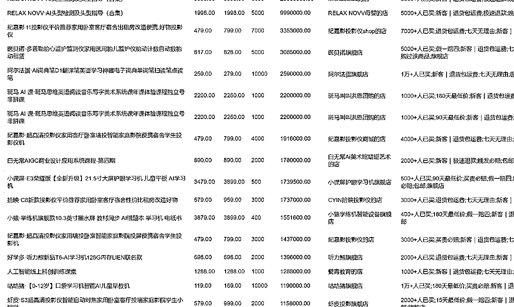

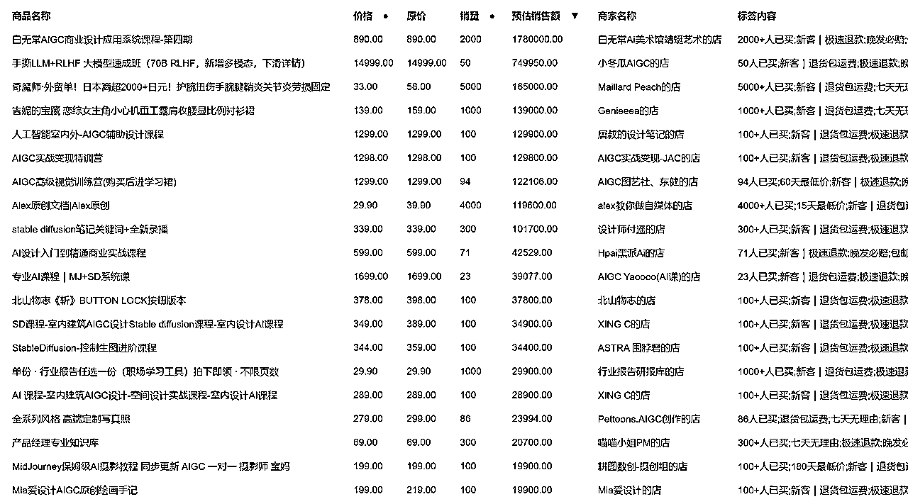

再比如搜索资料下的商品list，我们发现有卖中药药方、客单价29的简单学生家长必备手册竟然也卖出了1万加，可见小红书上宝妈群体的潜力。

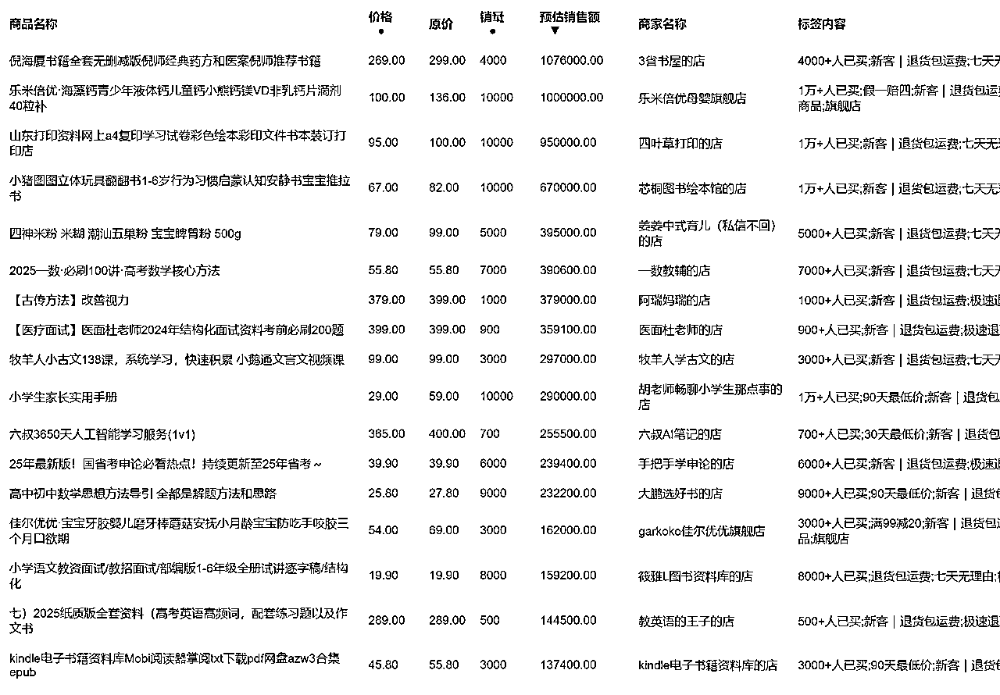

通过这种方式，我们可以发现每个关键词下都隐藏着一些出人意料的赚钱方式。以此为基础，我们绝对可以发现更多的赚钱机会。

## Claude 封装页面

在完成数据采集后,我面临着如何有效管理和展示数据的问题。虽然最初将数据存储在Excel中,但这种方式不利于灵活的筛选，所以后面我直接把数据扔到了数据库中，考虑到尽可能地简单，但另一个问题是，数据查看和索引不方便。

这时，我想到了用 Claude sonnet 3.5 构建一个页面来解决这个问题。以下是我的提示词：

"请为我设计一个简洁的网页界面,用于展示和筛选小红书商品数据。页面应包含以下功能:

1.  数据表格显示,包括商品名称、价格、销量、预估销售额等字段

1.  排序功能,允许用户按不同字段排序

1.  筛选功能,让用户可以按关键词筛选商品或者笔记

"请使用python和html帮我获取当前桌面上的xhs_note_mobile.db表中的xhs_goods，然后渲染到html中"

"请再次帮我修改，首先新增一个筛选条件为：search_keyword，另外请给我进行分页，因为数据过多容易卡顿"

"请再次新增一个页面，用于提交关键词，提交后请保存到这个库中的xhs_goods_keyword表中，你需要创建这个表，我后续要根据这个表中的关键字进行采集"

"接下来请你帮我优化下样式，现在表格是偏右的，左边一大块空间都白着浪费掉了"

"请再次帮我修改，goods页面中去掉商品ID，商家链接，卖家ID，抓取时间字段"

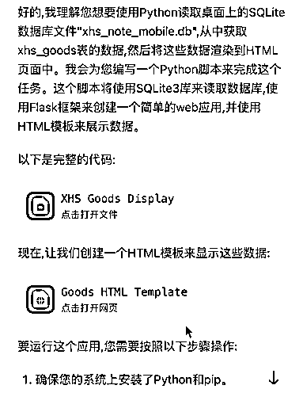

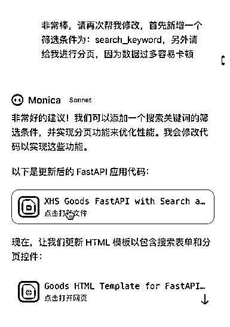

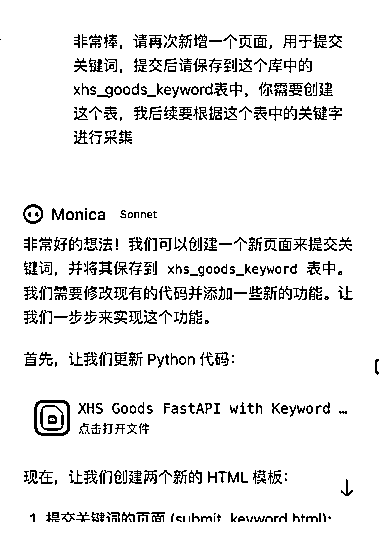

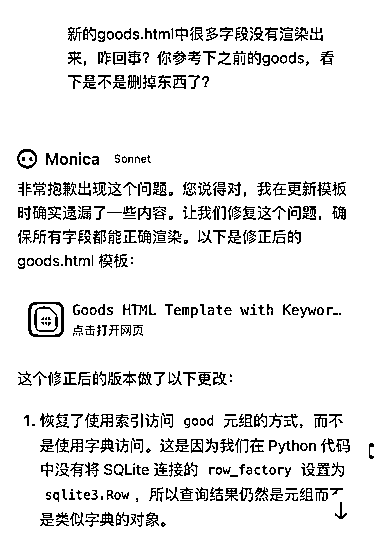

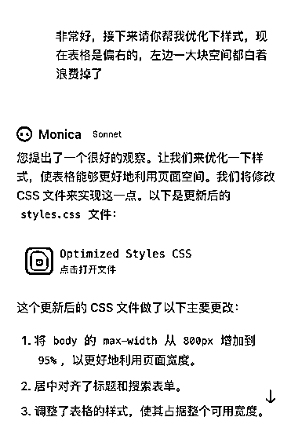

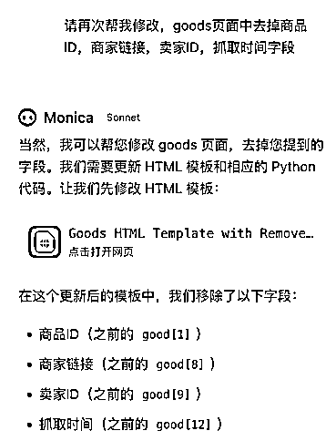

当然，这种方式还需要反复拷贝提示词，现在我们直接下载使用cursor可以更简单方便地实现了（强烈推荐cursor，会送500条claude sonnet 3.5，谁用谁知道）

经过几轮对话后，页面成型，完整的代码我就不贴了，大家根据实际需求和cursor对话即可，几乎0参与，100%代码AI生成：

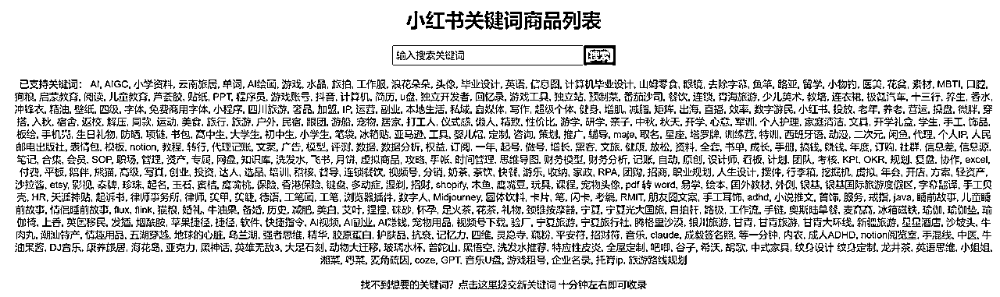

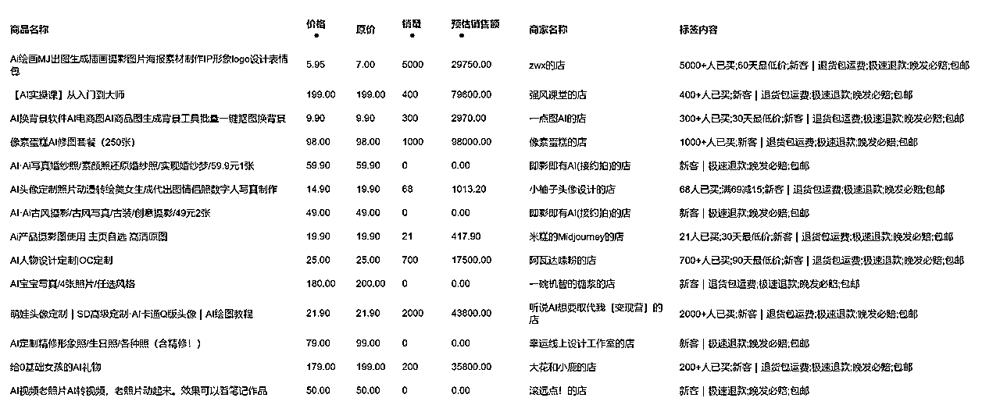

大家可以在下面体验，但后台只有一个手机采集数据，速度不会很快，请大家耐心等待。也欢迎大家提出宝贵意见和建议。

http://xhsgoods.lzzadvance.cn/

最后一个简单的总结和反思，通过AI的加持，让我几乎在一天之内就完成了这个集采集&展示的流程，同时也让我深刻认识到在寻找副业机会时,数据驱动的方法可以带来意想不到的洞察。

通过结合RPA的自动化能力和Claude AI的辅助，相信我们都能够更高效地发现和把握潜在的市场机会，一起加油