# AI经验总结丨如何用好AI赋能个人和企业（万字篇）

> 来源：[https://t16jzwqrzjx.feishu.cn/docx/QCDcdPa3loIfttxLJ14cxskknOd](https://t16jzwqrzjx.feishu.cn/docx/QCDcdPa3loIfttxLJ14cxskknOd)

# 前言

从去年年初开始用ChatGPT，并且探索了各种AI提效项目，自己也逐渐从小白到了用AI还凑合的人，在生财里带了3期ChatGPT提效航海、在公司里把AI各个业务的赋能都摸索了一遍、又和各种AI圈友讨论交流，这个月决定动笔来总结一下过去的实践思考，于是便整理了这篇文章，希望它能够对你用好AI有一定的帮助~

为此我想跟大家聊4个事情：对AI合理的预期➕如何用好AI工具➕AI赋能案例➕提示词工程。

在我从小白到熟练掌握AI的过程中，其实也经历了一段时间的“AI无用论”，我总觉得ChatGPT看起来好像什么都搞不定，那AI的价值到底是啥呢？它看起来也代替不了人啊。

AI代替人，我也经常听很多小伙伴跟我提到过，感觉好像AI被吹嘘的很厉害，但是其实用起来效果一般般。

但其实可能真相是：AI不取代人，AI只解决具体的问题。

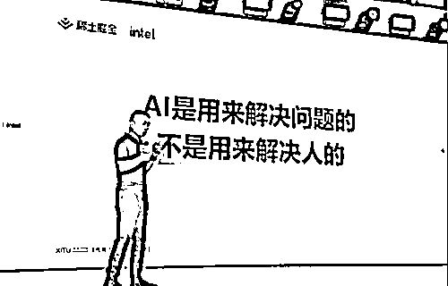

我想我现在对AI的定义是伙伴，一个可以帮助我更快成长、生活更便捷的伙伴。

# 一、对AI合理的预期

我想了半天应该如何描述对AI的预期，最后我觉得“合理”是一个相对中性也好理解的事情。

AI能够完整替代人吗？

会有一些重复机械化工作的岗位逐步被AI完整替代，大家津津乐道的AI客服其实很多时候都是给客服提质用的；一般情况下的裁员是人+AI干活足够了，不需要不会用AI干活的人了。

AI一点用都没有吗？

也不是，用好AI能够快速让你在一个你不熟悉的业务里达到70分的水平，能够省去大量的学习成本。

如果你能够把自身的业务很好的融入AI，那最起码在AI的加持下你能够完成之前1倍的产出不在话下。

不迷信AI觉得AI无所不能，不忽略AI觉得它一点用没有。

对AI合理的预期，才能够真正的用好AI。

带着这样的预期我们需要去观察评估，如今的AI发展到了哪一步，这个阶段AI可以在哪些事情上做到更好。

那么最值得我们去深度观察的事情有两件：模型能力、算力成本。

深度关注这两个事情就可以了，其它的事情都是围绕这两点来拓展的。

模型能力决定着AI能够做到哪一步。

用了GPT4o、Claude 3.5-sonnet、Gemini 1.5pro后你能够知道AI的理解思考能力已经很强了，但在缺乏专业数据的时候它依然有很多内容回答不上来，AI并不是无所不能的神。

用了midjourney、comfy ui 你能够知道AI能够绘制各种精制的图案，但对于图片内的文字依然没什么好办法，这么看cavan、稿定设计的海报未来一段时间内AI绘画工具都搞不定。

面壁智能V2.6版本支持端侧模型部署，这代表着端侧模型又跑出来一个小的里程碑事件，再过一段时间，各种能在硬件上大规模本地化部署高质量的端侧模型就该变成可能了。

算力成本则代表着AI应用的广度。

这里解释一下这个点，为什么算力成本是AI应用的广度；AI产品和之前互联网产品较大差异的一点是，它的边际成本并不随着用户量的增长而递减。

传统的互联网产品如果用户在10万人和100万人虽然服务器成本上会有一些差距，但其实并没有那么大，只要维护好服务器带宽就好了，成本并不是10倍的增加。

但是如果是AI产品，它需要消耗token用于和用户的对话交互，那从10万人到100万人的时候，AI产品的成本是10倍递增的，并不会像服务器成本那样，没有较大的变化，它是一个正相关的增长曲线。

那这样就会出现一个问题，如果一个企业每天服务用户的token费用为20万，但营收为10万，那这个公司的业务亏损倒闭也是一个指日可待的事情。

如果公司想赚钱，那要么去找到算力成本更低的模型，要么就想办法转嫁到消费者身上了，公司其实没啥选择。

如果算力成本能够低到和带宽成本一样的水平，那各种场景下其实都会充斥着AI产品，很多有意思的产品形态会逐步展示出来。

目前在国内模型能力和算力成本压缩的比较好的模型以deepseek为首，100万token只需要2块钱，如果你要自己做点AI产品试一试，deepseek的模型能力和成本都是最佳的选择。

当我们把这两点结合我们会发现，目前的AI现状是：

文生文的模型能力已经很成熟了，且算力成本已经可以通过本地化部署或者deepseek来压得很低，大量的产品都已经积极+AI，取得了不错的结果。

AI 搜索、AI办公、企业提效，AI在一点点改变人们日常的生活。

而文生图、文生视频受制于模型能力、算力成本还在珊珊起步的阶段。

所以你看AI不是万能的神，也不是无用的泡沫，它是一个珊珊起步的孩童。

我们应该对AI多一点耐心，多一点宽容，多一点放松。

很多时候我们对AI的错误认知往往来自于过于冗余的信息，天天关注AI反而会迷失在信息的海洋里。

我跟身边很多朋友聊过后发现，大家对于AI的错误认知往往来自各种为了流量自媒体的吹嘘，这里我给大家提供一些我自己感觉还不错的信息渠道：

少在这两个渠道看AI的内容：视频号、抖音号，本身短视频就是为了算法逻辑而生的产物，很多内容更多的是为了迎合爆款逻辑而不是真实度，我去年就在抖音看到了GPT5要出来的消息，然而到了现在还是4o。

公众号的话给大家推荐AIGC Rank的排行榜，这些公众号可以让你获得最新的AI咨询（当然也有广告）。

Bilibili是不错的学习渠道，有很多高质量的AI学习课程，大家按需搜索选高赞的就可以了。

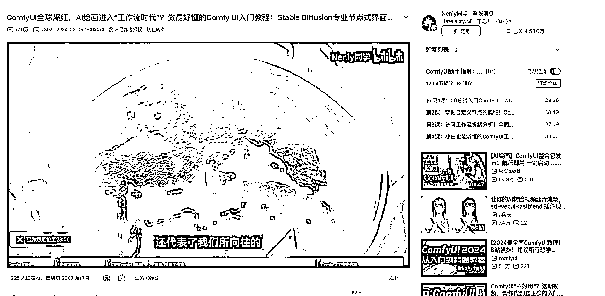

即刻AI探索站是个不错的渠道，里边有很多前言一手的AI信息：https://web.okjike.com/topic/63579abb6724cc583b9bba9a

如果想看AI周报的话推荐阅读《歸藏的AIGC周刊》：https://quail.ink/op7418/，基本上最新的AI咨询他都会有提及。

AI并非万能的神，而是人类手中的利器，用好它才能创造奇迹。

# 二、如何用好AI工具

最有效、最简单用好AI的方式就是：多用AI，这比听100个课程、看100个公众号文章都要强。

我发现很多人跟我讨论AI的时候头头是道，但是一聊Prompt就是懵逼状态，哎，认真多干点践行的事情吧，空口无凭创建的认知都是空中楼阁。

多用AI并不需要你去掌握多么资深的提示词技巧，当你遇到什么问题或者有什么想法先去找AI聊一聊，看看能不能获得不同维度的思路和解题方法。

有思考跟AI聊一聊，看看你琢磨的对不对？

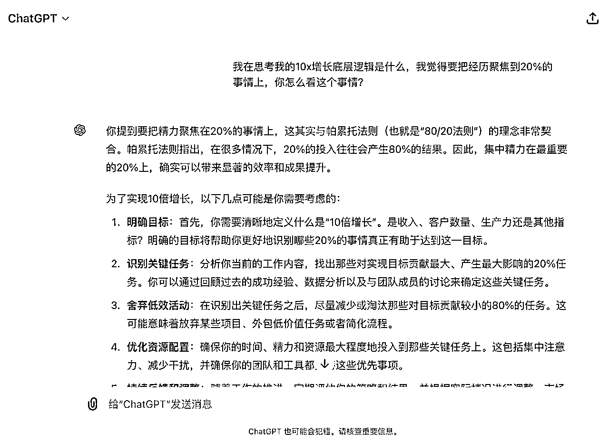

有问题问问AI，看看他能不能给到你想要的答案？

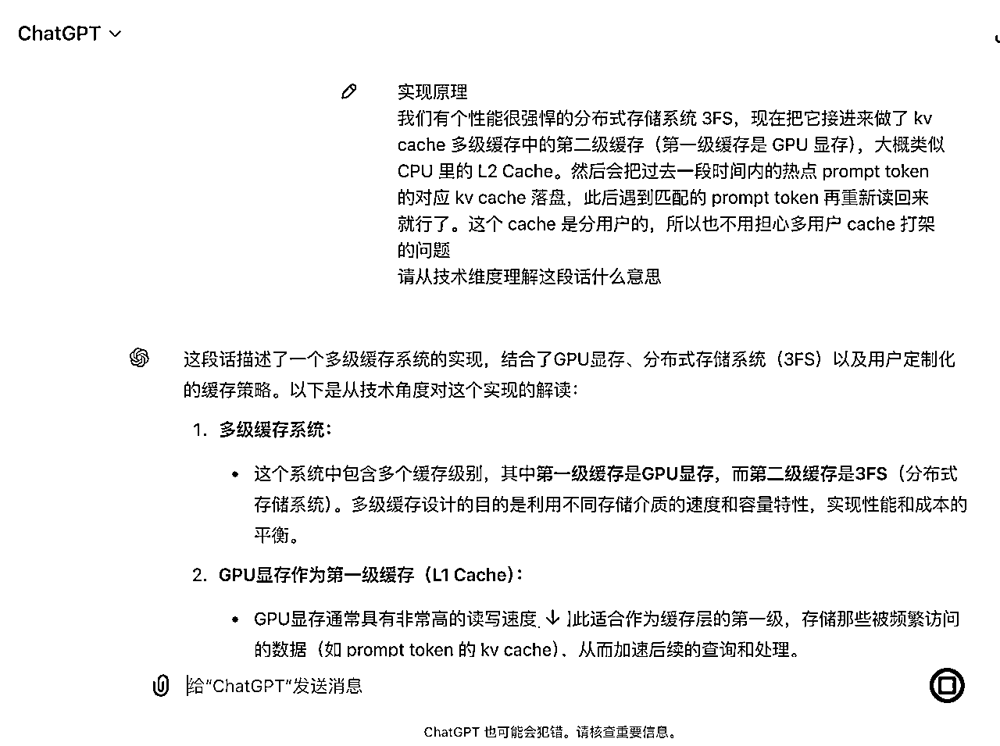

想买电脑打《黑神话悟空》了，先问问AI什么配置才能玩得动？

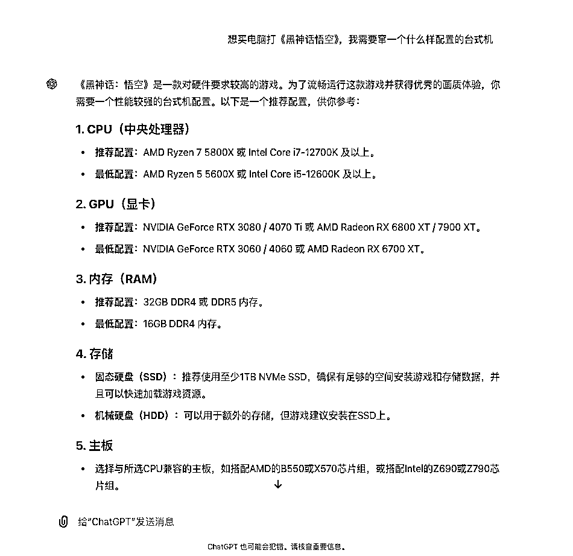

转变自己的思考方式，不要认为必须写好Prompt才能去用AI，随时随地随心所欲的和AI对话。

渐渐地让AI成为你生活中不可或缺的一部分，这才是真正用好AI的办法。

不是每一个人都需要成为AI专家，但每一个人其实都需要去使用AI。

AI可以做专业的事情，也可以做很平凡的事情，我们需要找到最合适自己的场景，哪怕是一个给你说加油陪你唠嗑的AI，它对你的生活有帮助那它就是非常有价值的事情。

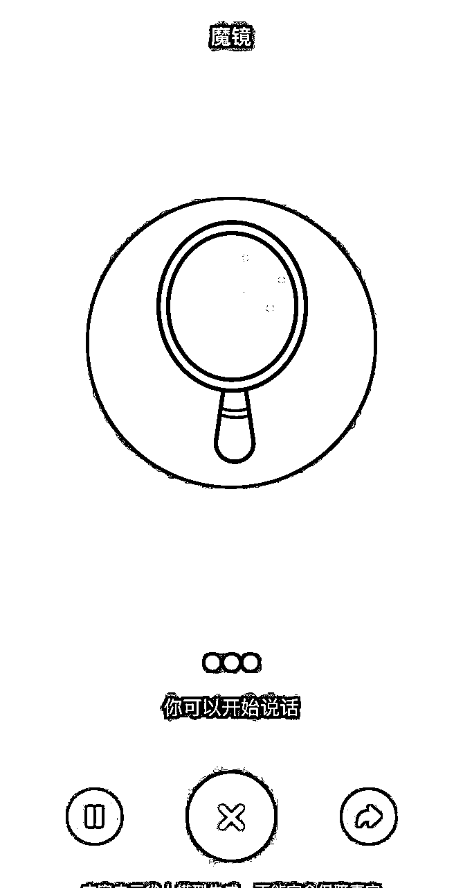

那如果我们想在专业场景用好AI该怎么做呢？

首先需要找到对应场景下的AI工具，然后再熟练把它镶嵌到业务工作中。

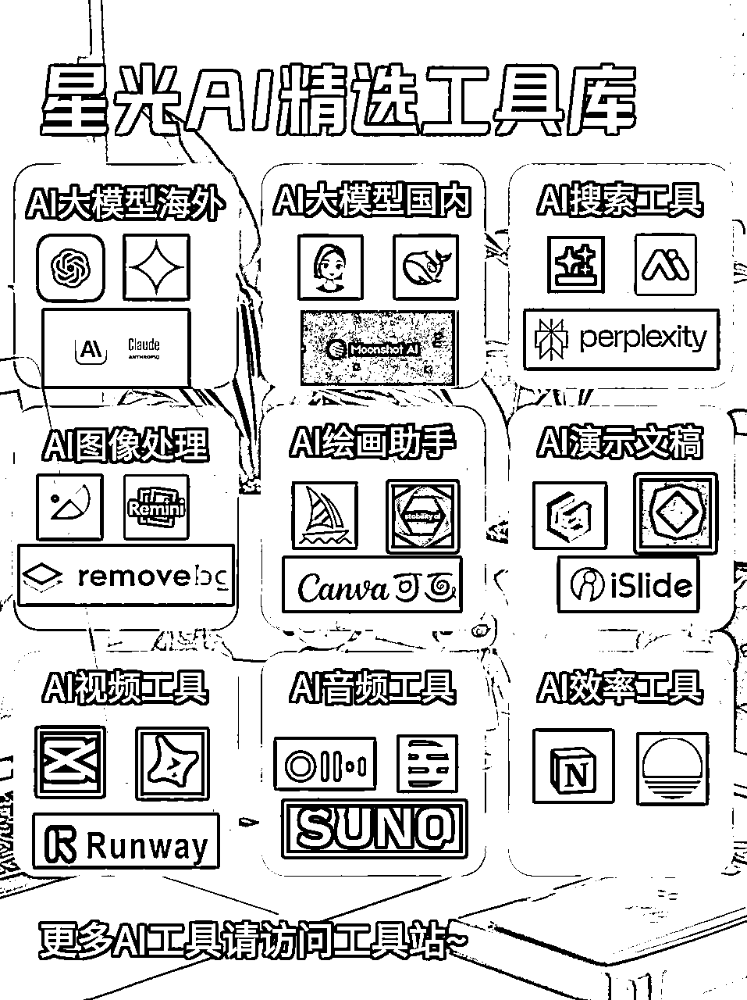

工具的话请看这个图，更多工具详情请查阅“AI精选工具库”：https://t16jzwqrzjx.feishu.cn/wiki/EsvowFAqFiTiYDkJgE0cWquPnWb?from=from_copylink。

之前我在带生财航海的时候发现对于小白用户来说其实找到靠谱的AI产品是一个比较难的事情，大家经常能搜到的AI导航站长这个样子：

太多工具了，我光看着我都不知道我要用谁来解决问题；索性我把用过觉得不错的AI产品精选汇总了一下，差不多100款，做了一个AI精选工具站；我希望它能够帮助更多人更方便的用AI。

纸上得来终觉浅，绝知此事要躬行，AI的掌握离不开实践的积累。

# 三、AI赋能案例

这个时候我要再次拿出来这张图：AI是用来解决问题的，AI不是用来解决人的。

所以我给这个模块最终定下的标题是：AI赋能，而不是AI替代人。

AI在我眼中赋能有两个大的维度效果，一个是提效，一个是提质。

提效：没有AI的时候我自己一天只能干20事情，现在有了AI我能干40件了，我的效率被AI提升了。

提质：没有AI的时候我卖货只能卖熟悉的商品，现在有了AI我什么产品都能卖了，我的能力被AI提升了。

AI赋能的核心就是工作流；那我借助下面的6个人案例来跟大家讲讲AI的具体应用：

1.  提质案例：写公众号文章

1.  提质+提效案例：AI写营销内容

1.  提质案例：客服系统

1.  暂时无用案例：教育批改作业

1.  提质案例：AI抠图

1.  提效案例：漫画翻译案例

## 3.1 案例

### 案例01 ：写公众号文章

那我以我写的这篇万字总结为例，首先写公众号我要梳理选题，确定我要写哪些内容，接下来是去写大纲，梳理清楚自己整体的思路；接下来是写初稿，然后成稿雕花，在之后就是排版布局。

那在这个流程里AI能够对我有哪些赋能呢？

首先在“确定选题环节”我能够去跟AI聊一聊我的选题思路，能够帮我更好的明确我要写什么东西，从而不至于跑题太久；这块的方案我目前做的比较简单，就是告诉AI我的背景是什么，我的目的是什么，然后带着我的思路一点点和它聊，最后碰撞出来一个结果。

同样的梳理大纲后我会在梳理完一个初稿后去找AI聊，你觉得我的大纲思路怎么样，你有没有什么好的建议？

当我完成初稿后，我们就要开终稿雕花环节，这个地方是无数个细节构成的。

我会去把整个稿件喂给AI，让它从逻辑上来帮我做一些校核，看看有哪些地方我写的逻辑性不好，哪些地方有可以提升的点，让它给到一些建议。

最后的排版布局就是我自己的审美来解决的了，目前阶段AI的帮助不大。

大家可以看到我在写这篇文章的时候并没有说有了AI我写的更快，反而我写的更慢了；但整体的质量会比之前更让我觉得满意，因为有一个人在反复跟我聊这篇文章到底怎么样。

### 案例02：AI写营销内容

我以电商营销内容为例，首先我们来看一下私域营销文案的产出逻辑是什么样子的：

如何选择产品和用户群，这个问题是个策略问题，这个环节其实涉及不到啥AI了（理论上也可以AI化，但这个是数据建模及模型训练的问题，不在本次讨论范围之内）

阅读产品详情页这块可以直接投喂给AI，但这样对AI模型的要求其实是比较高的，同时token消耗的量也是相对大一些的，而且识别质量还不一定是高的。

所以这块一般是OCR工具+AI整理文案，这样大家都做自己擅长的事情，通过一个简单的工作流来完成这一步骤，效果会比纯用AI强，而且成本还低，当OCR工具整理完详情页内容后，我们给AI一个简单的Prompt让它把详情页内容总结一下。

为什么还要做总结呢？因为各种详情页的内容识别一般都不具备啥可读性，各种信息乱七八糟的，以京东详情页为例，OCR识别出来的效果是这样的：

直接扔给AI数据源乱七八糟的，这种会导致最后的结果产出也是不好的。

那我们用一个AI工具整理好久变成这样的。

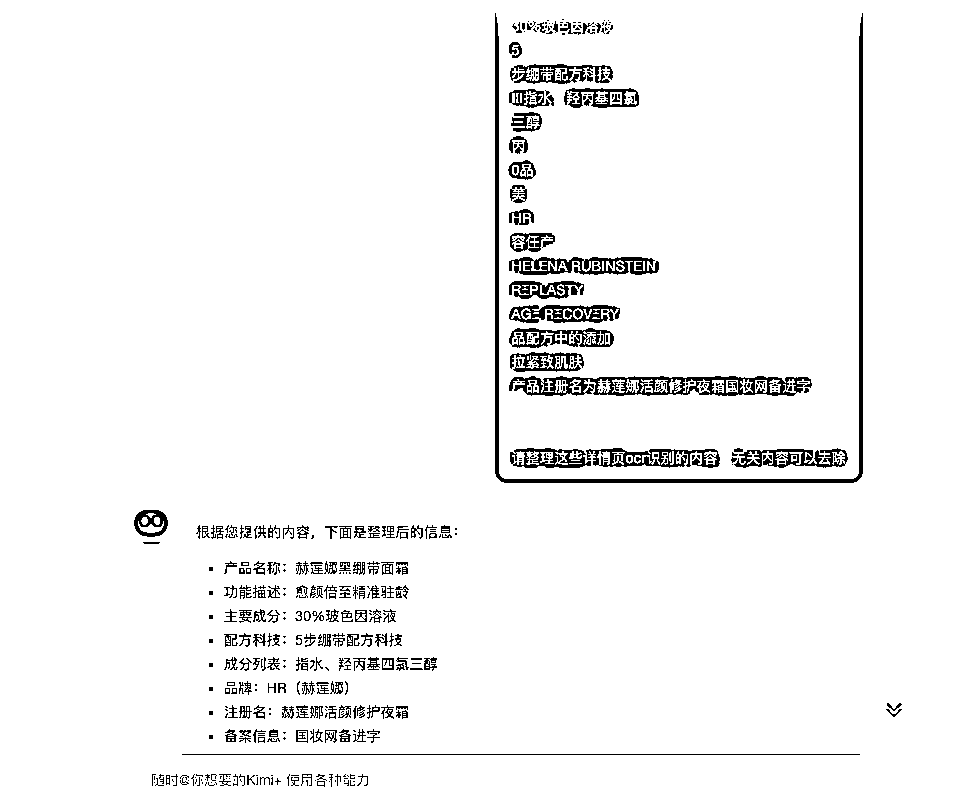

撰写文案其实我们遇到一个卡点就是，我搞AI的其实不咋会写营销文案，我写C端各种页面的文案没啥问题，但是私域卖货的文案，这个事情真没有写过啊。

那这个时候怎么办呢？首先去找公司内部写文案的同学取经，看看她写文案的逻辑是什么样子的，能不能抽象出一些方法论出来，比如说到底长文案短文案哪个效果更好，用户更再议的点是什么。

同时去小红书、公众号等各个渠道搜索大家整理好的文案写作公式和案例，把这些案例整理后然后投喂给AI。

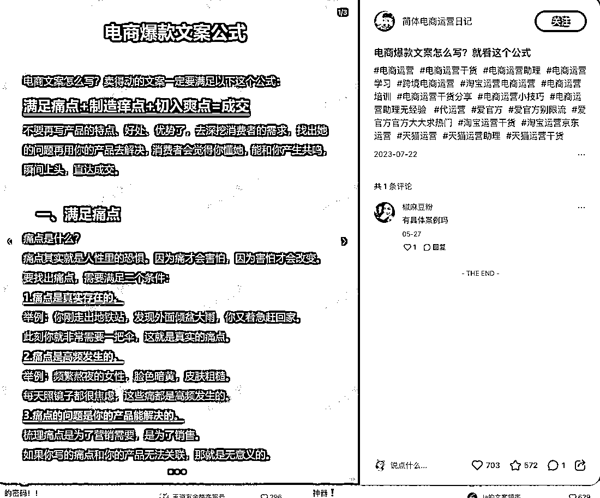

最后把这些内容封装到Prompt里边，我们会投喂给AI三个信息：

1.  详情页产品信息

1.  用户群信息

1.  商品折扣信息

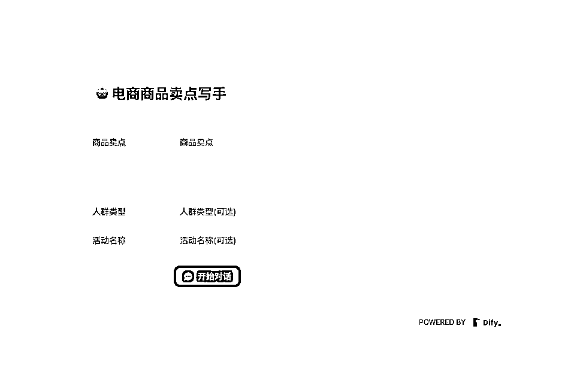

让它根据这些信息来产出商品的5个卖点，同时再根据用户信息去判断到底哪一个卖点是最核心最有价值的。

最后围绕这一个卖点产出开头一句话话术、产品卖点话术、促销信息话术。

以这个品为案例，我们最后看看产出效果，这个人群类型和活动名称我暂时就置空。

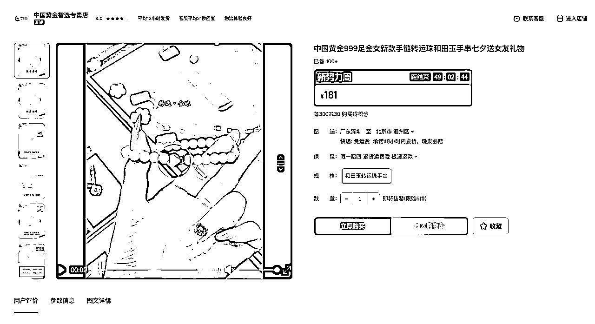

按照配置好的工作流产出的内容是这样的：

我围绕这个AI写内容做了很多轮测试，基本上能够跟公司的文案同学80%的水平吧，至于为什么达不到100%或者更多，因为每个品类都需要去投喂更多的资料。

比如说服饰类和食品类用户关注的点其实是不一样的，但用同一套AI逻辑，那整体效果还是会差一些。

### 案例03：客服系统（知识库+质检）

客服其实是这一波AI效果还不错的场景，但并不是大家想的AI替代客服，从此就不用人了，而是说AI能够帮助客服解决更多的问题，同时AI也能更好的帮助策略团队进行质检提升客服团队的服务质量。

在这里需要详细解释一下为什么说AI不是替代客服，而是帮助客服。

服务最重要的事情是 人和人的交互，而不是放一个机器在那想办法匹配上用户的回答。

各种客服系统前置的交互是为了解决一些基础高频常用问题，比如说退换货是几天需不需要自己出运费。

但一旦涉及到更复杂的信息，比如说人需要推荐服务、需要售后服务，这时候AI就很难搞定了，或者说用AI搞定这些成本极高，不如客服团队+知识库的逻辑来搞定这些事情了。

客服典型的两个场景：知识库、质检。

我们先从知识库说起，那么正常客服回答用户的流程是这样的。

那对人来说最大的问题在哪？

在于解决方案很多时候人自己给不到足够精准的内容。

为什么？因为活动规则及商品信息太多了，所以人本身无法靠记忆搞定这些事情。

比如说用户说请你给我推荐一款冬天的羽绒服，当你的商品库里有几百个商品的时候，你没法做出推荐，因为你压根不知道这些商品有什么区别，用户也没空等你研究商品有什么区别。

小红书、抖音的内容电商在一定程度上其实解决了选择问题，毕竟测评了才知道产品到底好不好。

那这个时候能通过培训解决吗？

要看业务形态，比如电商的商品回答基本上没戏；但活动规则和售后如果内容不多的话可以，如果每个商品的售后都不一样，那就完全没戏了。

主要是看你的内容的复杂度来决定的。

这块在实现方案的时候重点还不是怎么做RAG，因为无论你怎么去搞RAG，最大的一个问题其实是你前置的文档规则和商品信息可能是不全的。

我在做这块的时候花的最大的时间是一点点去直接面对客服团队，把所有规则从新梳理了一遍，梳理完了发现和我们公司刚开始预存的文档根本就对不上，这种情况你怎么搞RAG，最终的结果也是没用的。

如果只是做资料库，那把资料整理好用RAG也可以解决，这其实是一个完全辅助人的助手；能够代替人的AI客服该怎么做呢？

最核心的点在于：意图识别+工作流匹配。

通过识别用户的意图来引导用户进入对应的工作流，在一个工作流里引导用户解决该问题。

这个事情麻烦在哪里？要把每一个工作流都梳理清楚，然后去用模型做意图识别的匹配，引导用户进入工作流；意味着你要做好这个事情，要去拉着业务团队一点点把工作流拆清楚拆细。

稍微简单一点的做法是人做意图识别，AI直接把对应工作流的内容扔给客服，做一个比资料库更加有用的助手。

说完给客服赋能我们来聊一聊AI质检，这个又是怎么回事。

为了让服务团队能有一个高质量的服务，策略团队会对服务的整个过程进行检测，来不断提升服务的标准。

那么这里边有一个问题是，服务的量其实是特别大的，策略团队不可能把所有的内容都看一遍，那只有抽检这一种办法，比如10份 100份 1000份抽检出1分来进行查看，然后追加用户评价来做参考。

AI的出现能够很好的解决全量检测的问题，只需要把标准投喂输入给AI就能够完整的检测一个客服人员和用户的所有对话数，能够更加全面的去看客服的服务水平。

这个时候会发现一个问题，虽然减轻了策略人员抽检的量，但整体的问题量肯定是会成几何倍上升，很可能会出现策略团队天天忙着处理质检问题忙不过来的场景。

以及质检一般都是多轮质检，但每一轮质检都是重新调用一次源文件，这个token的消耗是巨额的，对于大公司量大来说自己部署开源模型或者7B小模型是个不错的选择。

小公司的话现在尽可能用deepseek这种有多轮对话缓存的内容，这样的话成本其实是直线下降的。

比如说我一共有20轮对话，那成本其实可以做到之前的十分之一左右，会有非常显著的下降。

### 案例04：教育批改作业

这个场景的案例比较有意思，它并不是一个成功应用AI提效的案例，相反我觉得这是一个现阶段不需要AI去提效的案例，我来跟大家聊一聊这个场景。

这个场景的流程是这样的，它是一个英语教学的场景：

那这个流程我们一看就大概能够知道，这个里边能够花费时间去做的事情是批改和点评这个事情。

乍一看其实有可能用AI提效的，毕竟AI批改和点评这个事情还是可以快速完成的。

但这个项目我去具体深挖批改流程的时候发现一个问题，学生提交作业是通过图片提交的，且每个题目的作答方式还是不一样的，并不是都按照选择或者写内容，有的地方是画个圈来选择正确答案。

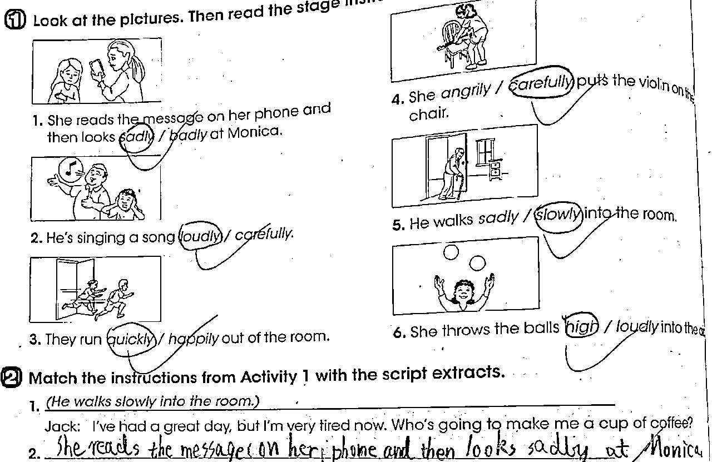

那这里边如果我们用OCR这个问题是解决不了的，因为很多模块的内容会失真，同时阅读场景学生写的英文内容不一定能够识别对，毕竟老师还能看出来，但机器实在搞不定。

那能用AI直接解决吗？理论上是可以的，但是涉及到用什么模型呢？

高质量的多模态识别并且能够准确阅卷那我们能用的可能只有Gemini 1.5pro这个模型了。

能做到100%的准确度吗？

肯定做不到，甚至说能做到70%的准确度都算很厉害的程度了。

也就是AI批改完老师还得再把这个环节去确认一下批改的有没有问题。

老师批改这份作业+点评要花多久呢？10分钟。

AI搞定完老师质检要花多久呢？其实差不多时间。

那最后花费那么多人力成本提效提个啥呢？提升不了啥。

这个场景下如果内容都是在系统上作答，那其实就好搞很多了，但可惜不是，都需要ocr的介入，这种情况下还是依赖人更靠谱一点。

但也许随着AI能力的进步，多模态识别和判断精度上来了，准确率能够做到99%了，那这个事情其实就可以用AI完成全流程了。

或者说它整个把系统上了自动化，也可以用AI来提效，但这种做法吧，真不一定成本比收益大。

所以说到底考察的还是：模型能力和算力成本。

项目一算账，算到最后还是老老实实人工搞吧。

### 案例05：AI抠图

以京东的大闸蟹为例来跟大家讲讲这个项目，现在我们的目标是：获得大闸蟹产品的抠图，后续方便各个渠道拼接图片合成资源。

大闸蟹的轮播图一共五张，在不考虑AI的情况下我们如果想获取抠图做好的流程方式是这样的：

人为选择符合标准的图——抠图软件抠图到后台。

这个方法吧太耗人工了，而且当你的商品图数量越来越多的时候，依赖人工也是个解决不了的事情，如果都是新图还可以通过招聘小团队或者外包的方式来解决，如果有几十万个旧图的商品要解决呢？

光搭建这个招聘和解决系统都是一个非常麻烦的事情。

那纯用AI能解决这个问题吗？ChatGPT也不会抠图。

那这个场景下的问题如何用AI产品+抠图工具产品解决呢？

AI产品选图+工具抠图。

我们可以给AI制定一个图片标准，比如说必须有完整的商品图才算合格、比如说不能有过多文字遮挡，依赖这些标准AI产品可以把整个轮播图都鉴定一圈，合适的再去抠图环节，然后完了再质检一下抠图质量。

如果最终有合格的，这个图片就可以入库了，如果没有那就标记这个产品需要新的解决方案。

那我们总结一下这个场景的工作流如下：

那我们拿螃蟹这个产品继续测试一下，结果如下：

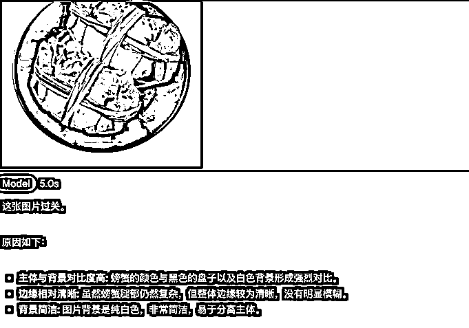

基于这个工作流其实还可以不同sku选择不同的检测方式，这样可以更大提升精准程度，不过这个属于提高精度的事情了，大家能够通过这个案例理解工作流的重要性就可以了。

### 案例06：漫画翻译案例 comic-translate

最近刷到github上的漫画翻译案例：https://github.com/ogkalu2/comic-translate，感觉也是一个很棒的AI工作流运用场景，来跟大家分享一下如何利用AI翻译。

比如这页漫画如果我们想把它翻译成英文，那其实在之前最快捷的方式就是用人工肝了，一个人翻译漫画的内容、一个人来通过PS修改。

那AI来了赋能这块的翻译呢？单用ChatGPT肯定是没戏的，它给你讲讲这个漫画是什么还行，换内容肯定没戏。

这个方案里最难的其实是找到内容区域然后把文字精准替换，直接上ocr的话识别出来的是这个样子，根本用不了。

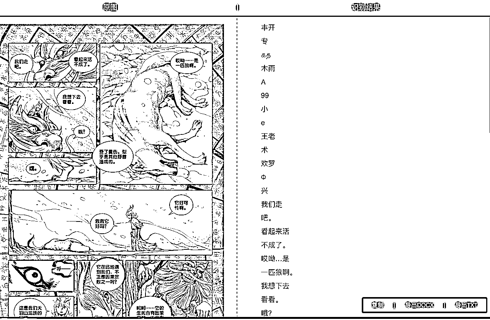

但其实如果ocr定位到一个块的时候识别效果还是很不错的。

那其实能够把各个模块定位出来，能够一块一块提取文字替换就可以了。

于是comic-translate先做了俩模型用来定位文字位置，再用ocr识别，再用大模型翻译，最后用工具替换文案。

它们先用了两个模型来标记气泡和文本：

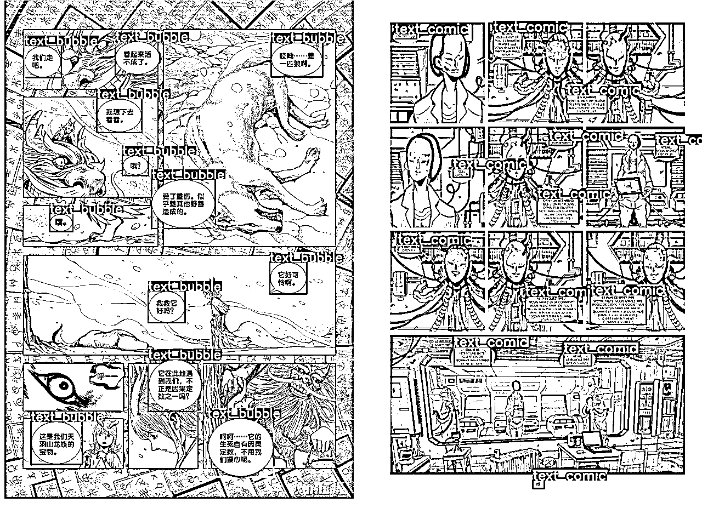

接下来其实按照text_comic来识别文本内容就可以了，每一个快单独ocr然后做好标记。

之后把块里的文字抹掉，LLM翻译一下文本内容，更新上最新的内容即可，最终完成高质量翻译。

这六个案例讲完了，希望对大家了解AI赋能有更多的帮助，接下来我跟大家聊一聊我对企业提效的一些思考。

企业对AI提效还需要额外注意一个事情，叫算账。

在企业里提效≠有用，为什么这么说呢？

我花200万的资源成本去给一个20万的服务团队做提效，最终获得25万的产出，那我这个roi的意义的是什么呢？

看起来是很不错的数据，一算ROI全是负的亏损的内容。

AI企业提效算账是头等大事，免得看起来做了个高大尚的事情，结果却是一地鸡毛。

AI正在重塑我们的工作方式，那些曾经看似不可能的任务，如今正借助AI的力量成为现实。

## 3.2 企业AI氛围

我觉得对于企业而言，AI赋能不只有对业务线来说的场景，还有一个更大的场景是企业内部使用AI的氛围。

为什么这么说？

原因主要是：不可能所有的工作流都有专门的AI产品团队去配合拆解，很多工作流如果让AI产品团队配合来做roi是往死里亏得，那这些场景就得由团队内部的人用AI来解决，所以这个时候就要看公司整体使用的AI氛围怎么样了。

整个公司有好的组织文化，有很高的组织效率，大家都用AI做的热火朝天，老板不以AI解决人为核心而是解决问题为核心，那这个公司人均产出的内容其实会远高于竞品公司的。

但这个地方最难的一个点其实是：企业文化价值观，或者说老板对于AI的认知。

要是你的老板天天看视频号和抖音各种AI震惊的消息，他觉得AI可以替代所有人了，那么这种情况下公司的企业文化和氛围反正会变成大家都想办法把自己的内容做成有壁垒的事情，效率什么扔一边去，反正首先保住工作是第一位的，用AI？自己干掉自己吗。。。

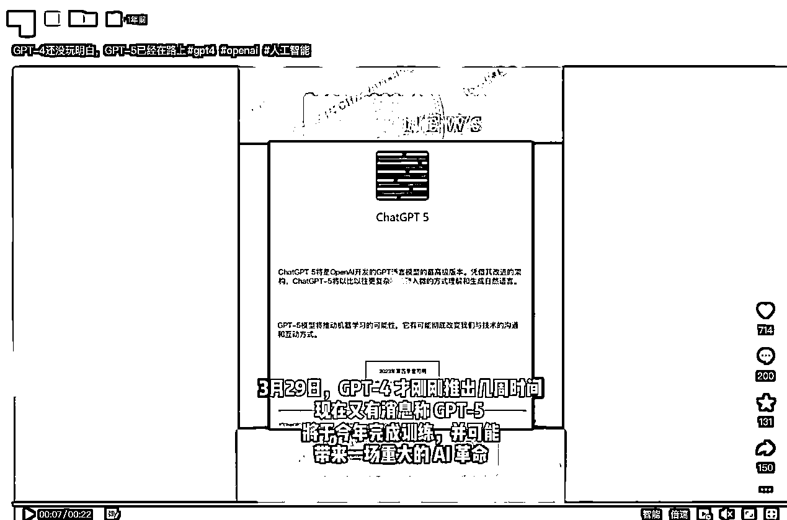

这种情况下最多小团队的leader能够维护好自己的团队，让大家觉得AI帮助很大，愿意为了自己之后的利益从而用好AI，去解决更多的问题。

不过这种情况也是可遇不可得的，我目前观察公司里能够有这种AI使用氛围的其实也只有极少数的团队，且这些团队leader都是对AI有很深的认知和实践，才有这种团队氛围。

我目前的感受就是在未来AI越来越强的时代，企业组织效率之间的差距将进一步被拉大，天壤之别毫不过分，毕竟在AI的加持下一个人真的可以做到过去几倍的产出是没有问题的，但这个事情的实现又是极难的。

小团队来说如何塑造这种AI的氛围？

团队leader愿意认真的去实践研究，多用用AI，不是每天从哪扯皮干各种忽悠的事情。

认真的践行，大家都会看在眼里跟着做的，假大空最后终究是一无是处。

## 3.3 小团队常用工具/产品mvp验证工具：dify、coze

那继续基于AI场景来聊一聊落地方案。

很多时候我们如果没有充足的经验不要拿研发区做试错，最好是用dify或者coze这种产品搞定了mvp再去用研发批量化，用研发试错成本太高了而且到底能不能实现在AI时代真的得打个问号。

coze和dify都是低代码平台，可以让你根据工作流来封装对应的产品，也能够发布给别人去用。

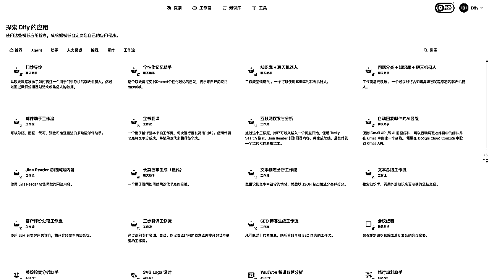

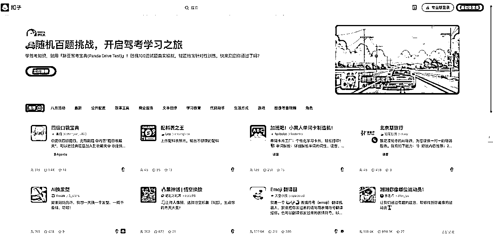

那如何选择是coze还是dify呢？

如果你对模型要求比较高，比如你要用国外的模型或者deepseek、零一万物最新的模型，那你直接用dify就好了，在dify上它支持几十个模型的API接入，想用哪个版本用哪个。

如果你觉得什么样模型都能解决问题，你还需要知识库和各种插件来协同作业，那你用coze是个比较好的选择，coze在这个方便上做的比较简洁容易上手。

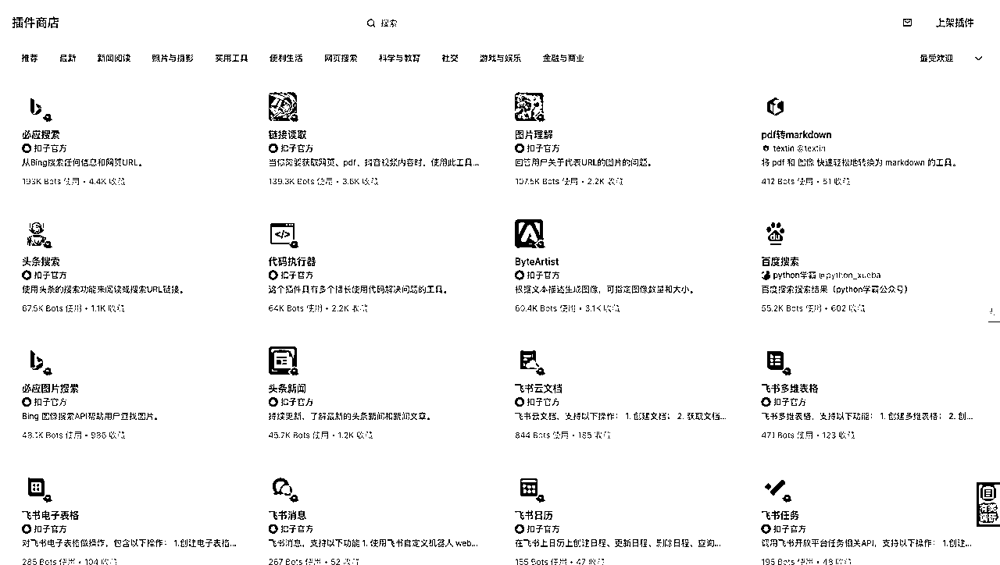

比如说我的客服售后意图识别模块的demo完全是由coze来实现的，coze通过知识库做问题匹配然后通过llm归类到具体意图上，它会把检索逻辑封装的简单一点，dify则会复杂一些，对rag了解不是那么深的没有那么好上手。

如果你希望能够通过bot来实现部署还没有研发的时候，coze会省事一点，coze支持公众号、抖音、飞书等各个端的直接部署，而dify在这些场景部署都需要api接入。

这两个平台都支持工作流方式来进行方案设计，都是蛮好用的。

# 四、提示词工程

从我开始用AI，我就觉得提示词是一个很费劲的事情，所以我一直蛮支持对小白用户要做智能体社区，让AI发烧友来做好智能体，然后普通小白用户来用，这样是一个AI更容易被大家使用的方式。

但在专业场景下，提示词工程是整个AI自动化的核心。

那么我们该如何写好提示词呢？在这里我们不提缜密的信息和严谨的流程，这个是提示词必须要做到的事情。

当我们这些能力都具备了，很多时候我们会面临这样一个场景：我们不是这个场景的专家，我们没有办法控制提示词完成高质量的产出。

把自己变成这个领域内专业的人其实是一个不现实的想法，那该怎么办呢？

找资料——投喂AI——测试出结果。

我以抖音文案为例来讲这个事情，现在我要去写一个抖音视频脚本的AI，让我们来看一下每一步要做什么：

最简单最简单的办法，找一个你觉得很棒的抖音短视频，把它直接扔给模型，让模型拆出来它每一步是怎么做的。

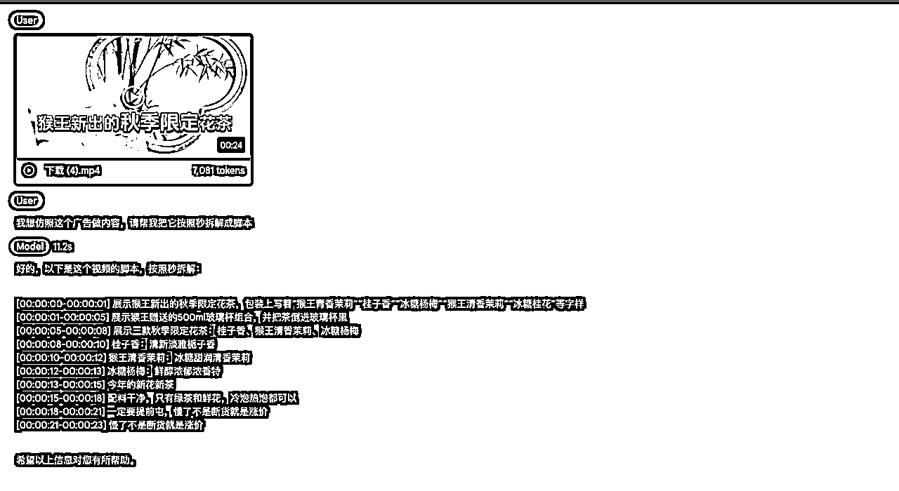

然后跟模型提出你的诉求，让它帮忙仿写这个案例：

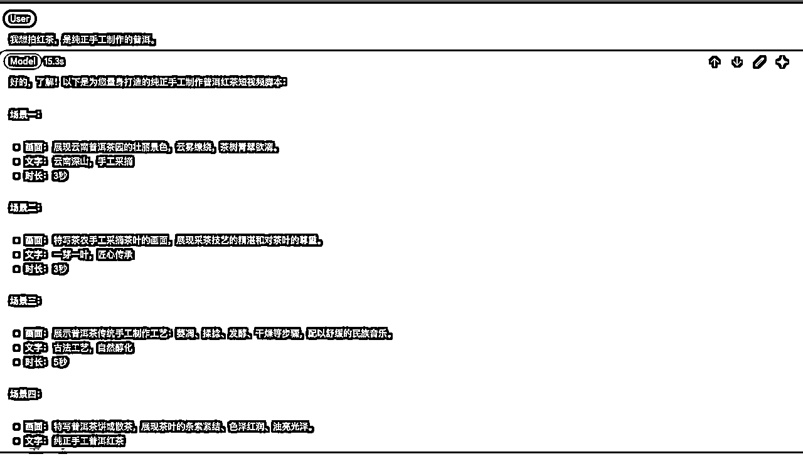

这个方法比较初级，主要依靠模型的理解能力，产出的效果可能一般般，那再深入一步该怎么办呢？

去找懂抖音的人去问或者查询各种相关的资料，通过这些内容抽象总结一下写抖音脚本文案的逻辑：

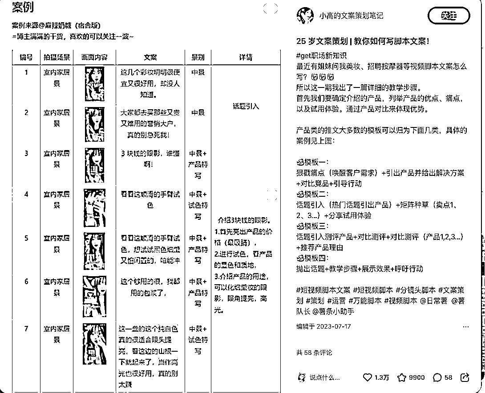

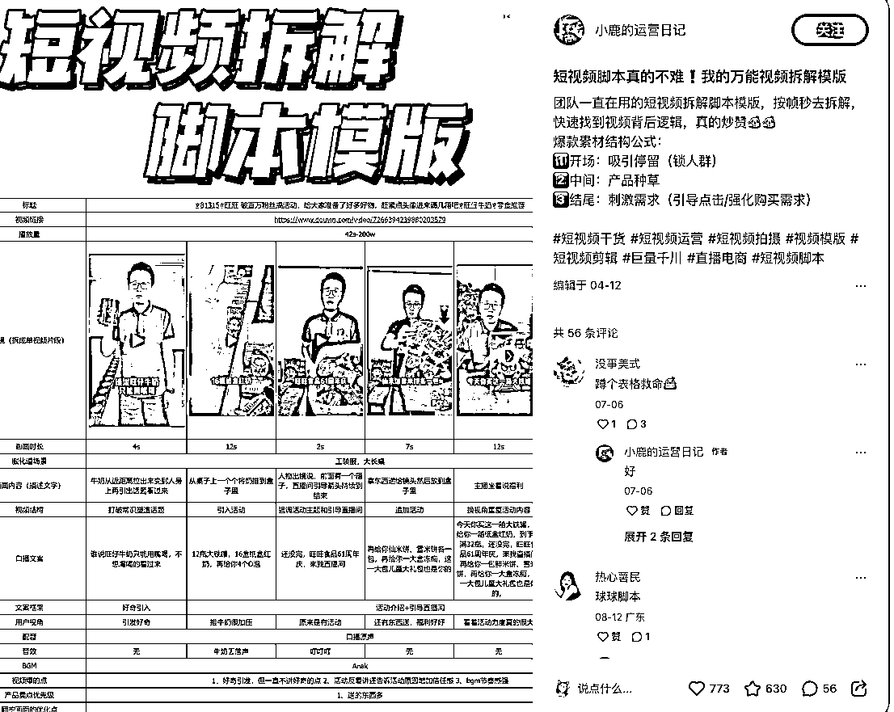

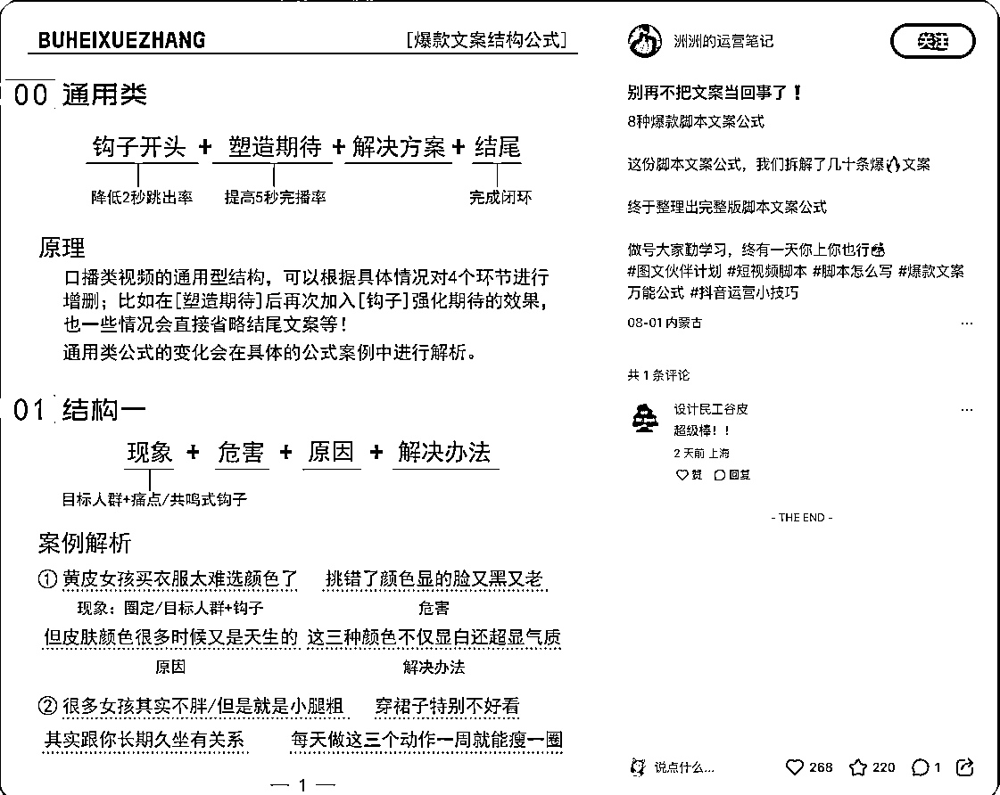

把这些内容总结扔给AI，这样AI就有了更严谨的逻辑性内容依据，能够产出更加靠谱的内容。

我在3.1案例中营销案例就是用这个逻辑做的，产出的质量还可以。

我们在上边列举了模仿、搜集经验这两个办法，还有别的更好的让AI产出的办法吗？

当然有，那就是让AI系统的学习一遍，给AI投喂一门课程。

先用通义听悟把音频转成文字，再把文字统一投喂给AI让它来学习，在它学习之后让它总结对应的经验，来提升内容产出的效果。

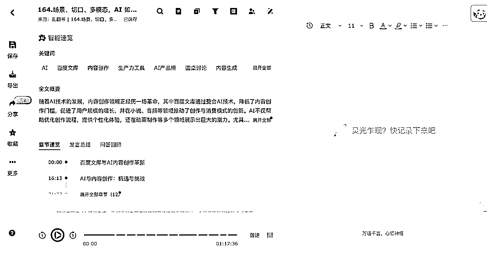

不过带着AI一起学完一门课程，你就有了一个非常聪明且专业的AI助手了，它能够给你很多很多的惊喜。

# 结尾

AI的内容聊完啦，如果你愿意听我唠嗑几句可以接着往下看：

这篇文章起于8月7日立秋，壬申月的开始，在22号终于封笔。花了几天时间敲定大纲，花了一周时间写完主体内容，又花了一周时间雕花各个细节，让每一个上下环节看起来润滑一些。

写完的时候如释重负的吐出了一口气，这一年践行了好多事情，体会到了创业失败内心的苦闷，体会到了脚踏实地往前的快乐收货。

其实我在刚刚做AI的时候也经历了非常不落地的阶段，总是沉迷看各种新闻，体验各种最新的产品，却没有去认真用好AI本身，没有去挖掘那些深价值的事情。

公众号停更了两个月很大一部分也在于我好像没有找到说能够让我很快乐很愿意去付出努力聚焦的深度，我好像也不知道写一些什么内容，我在即刻断断续续写了AI践行的各种总结，最后有了这篇总结之作~

在5个礼拜前，我们在super黄的小群里讨论《10x is easier than 2x》这本书，群友问到了一个问题：你们觉得自己最核心的20%到底是什么。

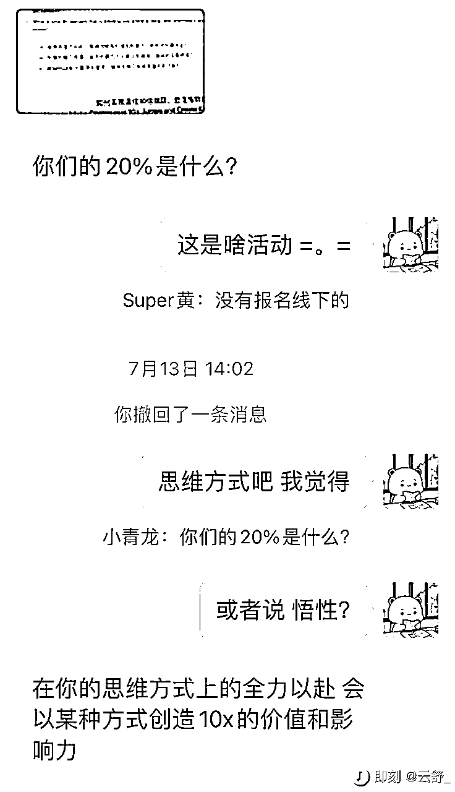

我当时觉得可能是思维方式，但后来想想这个事情不对，它是一个表层的事情，并非自己真正核心擅长的事情。

我想了想一边用排除法再加上分析自己优点看看能不能推演出来点什么。

首先肯定不是画原型图写prd的能力，这个技能我只能说大众水准，而且从求职市场还是自己做事情这个能力都卖不出去价格；也不太可能是对于AI提效的理解，我觉得这个就是短暂的信息差技能，后续AI越来越强和大家更多实践，其实会是一个基础的产品经理技能。

反正零零散散了窜了一堆类似的点，我都一一把这些pass了。

那天我听完李老师的AI分享，我在路上走，突然脑子里冒出来一句话：对用户需求和商业模型的洞察力。

想了想过去的案例，好像是这样子的，我乐呵呵跑到一线去当客服、跑到仓库里搬货，用心认真的去做好这些最基础很多时候大家不愿意做的事情，所以那两个业务我的需求抓的很准。

我想这个事情也是我在AI时代对于自己的定位，我自己感兴趣也愿意为之努力的事情~

在最后，我和Gemini一起写了一首诗，预祝大家前程似锦~

《秋风行》

秋风瑟瑟起，壬申叶飘零。

创业多艰险，征途漫漫行。

迷茫曾困顿，今朝志更明。

专注勤耕耘，风雨亦无惊。

诸君携手进，共勉向光明。

长路虽遥远，未来定可期。