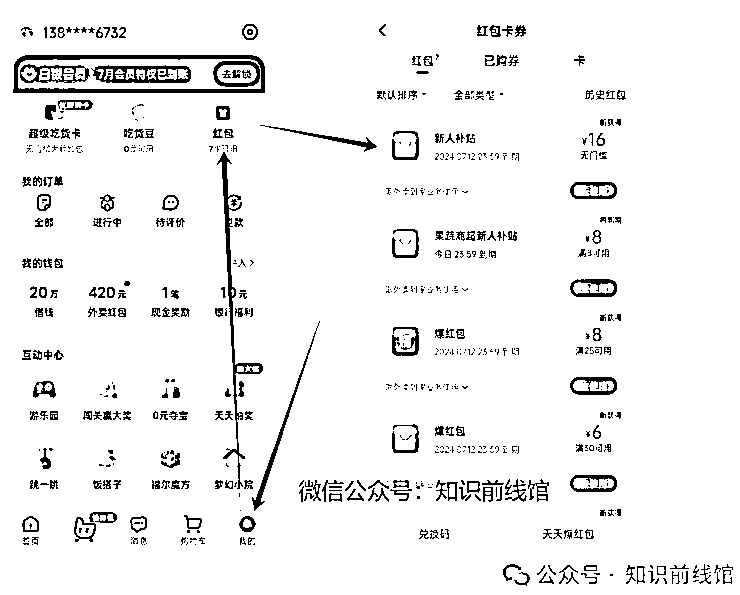

# 饿了么APP拉新，我是如何做到月入5k的呢？【副业】

> 来源：[https://fcnzyo4fd2j9.feishu.cn/docx/UL6kdEqiEoQmSrxmwVQcaKtGnwe](https://fcnzyo4fd2j9.feishu.cn/docx/UL6kdEqiEoQmSrxmwVQcaKtGnwe)

我想大部分的小伙伴在奶茶店、华莱士、网吧等快餐店的附近场所， 都有过被饿了么推广拉新的经历，它们都会说帅哥或者美女，手机有没有用过饿了么点过外卖或者说最近一年有没有点过外卖，你如果说没有，他就会要求你帮忙下载一个，然后你登录上去看了一下如果是新用户她就会说这边可以免费帮你点一份外卖:奶茶、汉堡可乐等餐饮...

哇塞，很多小伙伴就会觉得这天下居然有免费的午餐吗?案是NO!

饿了么是一个外卖平台，推广拉新必须要求新客户下首单，哪些推广员才有佣金，而且这个收益是非常高的，哪些外卖一般推广员是不会要的，直接给客户吃的，一天几十单外卖，不得把哪些推广员吃出病来哈哈哈!

有些小伙伴想要复制这个推广模式获利，但是不知道怎么"辨别新老用户"和不知道怎么找"拉新入口渠道"

给大家看一下馆主的战绩：

## 一、饿了么-新老用户辨别

1、下载，安卓打开【应用商店】-----苹果打开【App Store】搜索【饿了么】

2、登录，手机号码从来没有注册过饿了么

1、新用户--手机号码从来没有注册的账号登录操作流程图

我们也可以点击-我的界面，点击-红包界面，查看有没有新人无门槛红包

ps：一定要有新人无门槛红包才算新用户

## 二、饿了么-拉新渠道

1、官方邀请码

每个星期三是饿了么(嗨吃节)双倍佣金的日子，也是经常做饿了么推广员的喜日子，因为拉一单等于平常日拉两单。

*   推广员打开自己手机上的饿了么app

*   在搜索框输入:天天赚现金

*   点击-搜索

*   点击-立即参与活动

*   点击-去赚现金，开启邀请二维码

*   推广员拿到二维码后，可以保存到相册里面，推广新客户时拿出来扫码

平常日的界面：

2、拉新操作流程

确认客户的饿了么app是新用户，就点击-饿了么app首页的左上角扫一扫，扫码自己的饿了么推广码(邀请码)，然后客户会收到一个新人无门槛红包，可以用来抵扣点外卖的商品，由于饿了么是一个外卖平台，它邀请推广的新用户必须要下个首单，就是说要拿客户手机的饿了么点一份外卖，我们推广员才能拿到奖励。

客户下单的钱，推广员要返回给客户，不然谁帮你搞

领取新人无门槛红包：

下单操作流程：

饿了么红包一定要选新人无门槛红包，下单的联系不能修改，一定是本账号手机号码，如果想修改可以在备注里面修改让外卖员打这个电话，下单的金额一定要大于8元，不然拉新无效，一定吩咐客户不要退单!

这里咱们讲解一下细节，这些细节是馆主在平常推广的过程中个人分析出来的，这些知识点可以让你们少走很多坑!

我们点外卖的时候最好不要经常点奶茶或者红牛这些水品，可以点一下面、饭啊之类的，因为饿了么一个邀请码一天最多拉四五单就降价佣金了，为了把佣金保持在高价格，就不要经常点奶茶和水。

如何快速做单，根据人群和推广模式来操作，你是主打街道上的还是店铺、网吧的，每个操作模式都不一样。

街道上的人群，选品下单一定要快，这里推荐奶茶和华莱士，街道上的客户很匆忙，客户-般不会要外卖，我们可以在备注里面留下自己的联系方式，要特意咐客户不要退单，退单拉新无效。

店铺和网吧的人群，选品下单我们动作可以慢一点，挑选价格偏低一些的

一个后台，一般一天最多只能拉4单，拉新多了平台就会降价，馆主建议你们可以多准备几台手机开邀请码，记得，后台不能一机多号，频繁切换账号会出现无法拉新。

变现逻辑：

1单佣金25-38（星期三双倍），下单点一份外卖成本8块钱，外卖可给客户、外卖小哥，也可以给自己吃。

2、一天拉4单*30=120￥，佣金-成本=利润，120-32=88

3、做这行的根本就不用担心吃饭问题，我们下单的时候，在备注里面写下，到了打这个xx电话，直接让客户离开了，外卖小哥来到目的位置，会打备注里面的电话。

4、你有几台手机，一天不得做好多单。

重点强调:饿了么只能同城做单，就是不能跨省或者跨城市做单

客户(前端)--------后端(推广员)必须在同一个地区

## 小结

饿了么APP拉新和渠道馆主就写这么多了，小伙伴们请耐心多看几遍，有哪里不懂可以联系我。