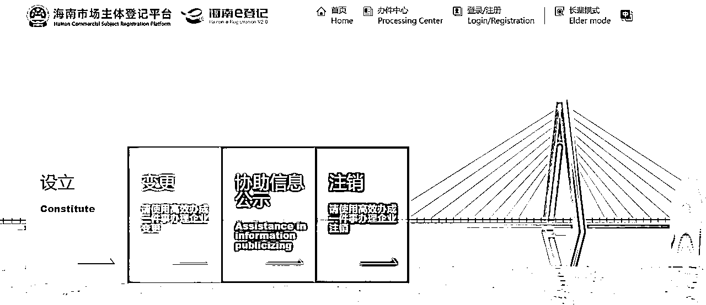

# 营业执照注册注销，出版物经营许可证代办问题

> 来源：[https://y00s9eo32dx.feishu.cn/docx/KhOqde5euoNqpzxT9A6cwRASndf](https://y00s9eo32dx.feishu.cn/docx/KhOqde5euoNqpzxT9A6cwRASndf)

大家好，我是结果，专门做电商营业执照和电商各类许可证这方面的业务，也就是俗称的代办

做网赚，各大平台开网店是始终绕不过去的一环，所以这次分享的是关于电商营业执照以及出版物经营许可证的注册注销，还有就是如何处理使用过程中会碰到的一些问题

# 一、出版物经营许可证

## 1、出版物经营许可证办理

出版物经营许可证是依托于营业执照的，不可以单独存在，所以要先办理营业执照。

各地营业执照办理情况不一，但主要的就是经营地址的问题，大部分地区是可以选择用家里的地址作为经营地址的，甚至租房也可以，但是都是需要房产证复印件作为证明，部分地区还需要当地居委会证明，解决了营业执照的问题办好了营业执照后，就可以选择用营业执照去办理出版物了。

其中要注意的是大城市的对出版物的审核会比较严谨，有的会要求需要实际经营场所，场所面积大小，仓库货物货架等等，不允许住宅当商业经营场所，如果是比较偏远的小地方，审核规则就没那么严，一般有营业执照就行，但也有的会上门拍照，因为各地标准不一样，具体标准需要去当地县一级以上的行政服务中心的窗口去咨询。

## 2、注销出版物

只需要注销营业执照就可以，出版物会因为营业执照的注销而自动注销，个别代办会套路，额外收一笔注销出版物的费用，其实是没必要的

## 3、出版物代办的注意事项

因为不是每个人都能满足自己办理的条件，所以找代办办理的时候需要注意的哪些情况？

首先 出版物因为属于比较敏感的东西 关乎于书籍 禁书 邪教 之类的 国家一直都是比较严格把控，如果发生了一些举报，核查，政策走向，等问题，县一级的就有可能会开始整顿，一般来说简单点就是先做网店的备案登记，严重的话就会核查是否实地经营，所以这也是出版物偶尔会失效被查的原因，所有人都把控不了失效，只跟运气有关，全国都是这样，

真遇到这个情况，不要纠结于怎么就失效了 ，而是能否利用出版物经营许可证创造更多的收益，失效了就网店更换一下营业执照和出版物就行，不会影响你的网店。

代办如果给你承诺一定可以不被查，或者一定可以年审，这个其实是个人承诺不了的，因为核查这是政府部门的行为，这也是为什么会有代办过度承诺后，暴雷跑路的原因，需要警惕过度承诺，但是也不用过于担心，大部分的出版物是碰不上这些情况的，不然代办早就不干这业务了。

还有就是营业执照经营地址，出版物经营许可证的地址是不是虚拟地址，挂靠地址，集群地址的问题，我可以这么说，所有那种几百块的营业执照，一两千的出版物经营许可证的都是虚拟地址，这是成本导致的，

虚拟地址的出版物的行情价格一般都在1500上下浮动，如果想要真实地址的出版物，有，像开天猫店 京东店的就是那种真实地址办的出版物，行情价格在5000上下，而且每年都要交一笔3000上下的地址的使用费，一般开个普通小网店的，1000多的出版物就够了

# 二、电商营业执照

## 1、营业执照的注册问题

主要是经营地址，之前讲出版物的时候就已经讲了就不重复了，一般营业执照用的最多就是个体户，以及个人独资，两者其实区别不大，唯一的就是个体户监管不严，可以大概率避免报税

个人独资相对个体户，税务会查的严一点，但也不多，一般不要去税务登记，其实一两年就不用担心税务问题，极少数地区政府会在办理营业执照后强制给你开通税务（比如重庆），这个就需要注意，每个季度做个税务零申报就行（不开发票就可以零申报），教程网上一大把

营业执照每年6.30号要年审，自己网上就能完成，教程同样网上一大把

有个套路就是现在很多短信，电话会让你说年审收费300元，不然会怎么样，其实就是自己网上年审一样的，自己识别，不年审的话会导致营业执照经营异常，影响网店的使用

## 2、营业执照的注销问题

现在有的地区是开通了网上注销的，但是具体哪些地区可以网上哪些地区要线下没有一个标准，同省份不同城市有的可以网上注销，有的只能线下注销，所以先搜索本省的政务服务网，找到对应城市，再看下能不能网上注销，网上搜索一下流程，就可以自行注销，

以最常见的海南举例，办理和注销都是最便宜最方便的地区，价格大概都在在50-100，也可以自己全程网上办理营业执照和注销营业执照，就可以不用花钱，我个人觉得海南是一个岛，人们非常不容易来回跑，但是非常希望外地人来发展商业，所以网上注册网上注销流程做的非常方便，只要登录进网站就是傻瓜式操作流程，注销营业执照也不需要归还或者销毁营业执照原件直接申请就行

比如注册注销海南营业执照，只需要手机下载海易办，注册实名认证一下，搜索登录网站 海南e登记 ，注册登录一下，要注册就点击设立，要注销就选择注销，具体流程十分简单方便，按提示操作就行，

但是也相对做了限制，一个人只能线上办一家个体户或者个人独资公司，想要多办几张需要去线下办理。

关于营业执照注销价格不一，没有一个标准，同省份不同城市有的可以网上注销，有的只能线下注销，因为地区不一样，每个代办的收费不一样，但是一般来说电商营业执照无税务问题，注销大概在150-800左右，价格的差异来自于不同地区，以及同一个地区营业执照注销，情况又分为有没有税务，税务有没有异常，营业执照有没有经营异常等情况

## 3、营业执照注意事项

尽量不要让自己的营业执照异常，异常后三年内一定要注销，下图为国家企业信用信息公示系统的提示

这是有规定的，不然会让你以后都不能开公司，招标之类的，而且注销起来又贵又麻烦，有的中介会宣传经营异常不注销会上征信，这倒不至于，这说法属于套路。