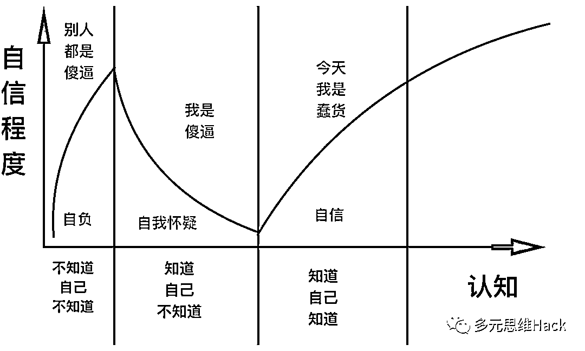

# 赚钱急于求成的心态，该如何破除？

> 来源：[https://pznme756ly.feishu.cn/docx/TkGbdCbF7oIxC1xzSA1cnslunze](https://pznme756ly.feishu.cn/docx/TkGbdCbF7oIxC1xzSA1cnslunze)

大家好，我是明白，生财 8 期老圈友。

前几天和一个圈友聊天，他说 —— 我非常想赚钱，但尝试了很多事情，都失败了。我明明知道，要先沉下心来学习、提升能力，但总忍不住想急于求成，这种该心态怎么办？

其实这种情形，不是个例。我在公众号经常看到类似提问，包括我自己，以前也是这样。不过后来，我经历了很多，成长了很多，在这方面有了更深、更全面的思考，我才慢慢摆脱了这种心态。

今天就来分享一下，我对「赚钱总想急于求成」这件事的思考，希望对你有一些启发。

# 1 从急于求成，到耐心积累

我在 2017 年我刚加入生财有术时，看到别人的帖子，好像随便做一件事情，都能「轻松」赚钱，心里就很着急。

于是，我整天琢磨如何找到一个赚钱秘诀，让自己一夜暴富，尝试了很多我认为能「轻松」赚钱的事情，但都没赚到钱。

越没有赚到钱，我就越着急，心态变得越来越焦虑、越来越浮躁。以至于那段时间只要一打开生财有术，我就莫名心跳加快，胸口发闷。于是，我索性不看生财有术了。

后来，我学习了其他一些个人成长方面的知识。

比如，得到 APP 上，李笑来老师的《通往财富自由之路》。

在里面，我更新了一些观念，比如——

*   注意力 > 时间 > 金钱。

*   成长是最好的投资

*   付费就是捡便宜

*   一切都是积累

经过一番学习，我心态变得不那么急躁。于是，我开始静下心来，耐心学习一些基础知识，练习技能。

后来，我做了《不用写代码的爬虫课》，然后在课程的开发、运营过程中，将学到的知识加以运用、练习。又做了知识星球精选站https://t.zsxq.com/jtul2、公众号、和其他一些事情。

当然，这个过程也并不是一帆风顺，因为每隔一段时间，我就会冒出来找捷径的想法，然后跑去研究一些能快速致富的秘籍。结果秘籍没找到，反而浪费了很多时间、精力。

现在想想，如果我能早点明白「一切都是积累」的道理，破除掉急于求成的心态，可能会少走 1-2 年弯路。

最近我花时间思考、总结了一下，发现导致这个现象，根本上是因为 2 个原因。

# 2 导致急于求成的 2 个原因

以前我写过：赚钱不是一件事情，所以学不会，也做不到。

赚钱是结果，是做某件事情的结果。

一个人想要赚钱，必须把做某件事做成，然后才会得到赚钱这个结果。

于是，一个人想要赚钱，需要思考 2 个因素 ——

1 什么事情能赚钱？—— 见识

2 如何把这件事情做成？—— 能力

如果一个人见识和能力都足够，那事情必然能做成，就必然能赚到钱。

相反，一个人做了很多事情，没赚到钱。但依然在赚钱方面，急于求成，往往是没想清楚这 2 点——

1 不知道哪些事情能赚钱 —— 对世界认识不够

2 不知道自己能做好什么 —— 对自己认识不够

我们来具体看看——

## （1）对自己认识不够

根据达克效应，人在成长过程中，认知会经历几个阶段——

*   不知道自己不知道

*   知道自己不知道

*   知道自己知道

*   不知道自己知道

在赚钱方面急于求成的人，一般都处在第 1 阶段，不知道自己不知道：对自己的知识、能力、资源没有准确的认识，不知道哪些事情自己能做到，哪些做不到。

于是，看到别人做一件事情赚钱，就会盲目自信，觉得自己也能做到，结果试了以后发现不行。

如果一个人是理性的，多次失败后，他就会去反思，为什么自己做不到？然后就会得出结论，核心是自己的能力不够，而不是没找到合适的事情。如果不提升自己的能力，那无论尝试多少次，都不会有结果。

这时候，他对自己的能力有清楚的认识，再听到一些事情，无论别人说它有多大红利，多大的赚钱机会。他就不会去做，甚至都不会去想，因为他知道自己做不到，想了也没用。于是，他能沉下心提升自己的能力。

但现实中，很多人是不理性的。他会被失败归结为外部因素，比如我们常听到的：运气。他会觉得，这是我运气不好，只要我试的次数足够多，就一定能找到轻松、快速赚钱的事情。

这时候，他对自己的能力没有清楚的认识，一看到别人说各种「机会」，立马就会跑去做，完全不考虑自己是否有能力做到。于是，今天试一下这个，明天试一下那个，这样就没法沉下心来提升自己的能力。

能力不够，就肯定没法赚到钱。赚不到钱，就更着急，更想去找能快速赚钱的事情。时间花在找赚钱事情上，能力就更不会提升。于是，陷入恶性循环。

## （2）对世界认识不够

以前在朋友圈看到一段话，觉得很有道理 ——

人总是会误会自己的擅长和不擅长。在自己不擅长的领域里，因为只看到了写皮毛，就觉得很简单，自己完全可以。相反，在自己很擅长的领域里，因为很懂，才看到了更深出的困难和瓶颈，变的畏手畏脚觉得自己不行。

有人听说一件事情能快速赚钱，就会去做，往往是因为对这件事情不够了解。因为不够了解，所以觉得「轻轻松松就能赚到钱」。

但根据能量守恒定律，这明显是不可能的。

那些宣传一件事情能轻松、快速赚钱的人，大概率只展示了项目的一小部分内容，而隐藏了一些重要的因素。

比如，我最早学习写作的时候，看到很多写作课的宣传是：听了写作课，就快速写出 10w+，然后赚到钱。还列举了一些案例，有人听了写作课，确实赚到钱了，我一看，有人验证过了，能赚钱，买！

而事实上，写作和赚钱之间，只是相关性，并不是因果性。写作只是赚钱中的一环，其他还有 99 环，这 99 环里任何一环没有，就不会有赚钱这个结果。于是，我听了写作课，肯定赚不到钱。

任何赚钱的事情，都是需要多个因素一起结合，才能有赚钱这个结果。

再比如，有人写了一个知乎好物帖子，各个步骤都很清晰——

*   如何养号

*   如何选品

*   如何买赞

*   如何提升盐值

*   如何模仿写文章转化高

其他人一看，嗯，我照着做一定也能月入 5w。

但其实，能分享出来的信息，一定只是赚钱链条里的部分，而不是全部。

那些没法分享出来的，才是决定赚钱的关键，比如——

*   根据教程灵活变通的能力

*   有用户视角，知道哪类产品需求强烈

*   有文案基础，知道如何微创新提高转化

*   有研究能力，能总结出知乎用户的喜好偏向

*   死磕，一天写 10 篇文案的勤奋

*   ……

这些没法用文字分享出来的东西，叫做能力。而能力，是需要长期积累才能拥有的，不是一个课程，一篇教程，一个训练营能教会的。

因为对这件「能赚钱的事情」认识不够，不知道商业世界的运转逻辑，不知道做成需要哪些能力，不知道哪些是关键因素。

所以，无知者无畏，人就容易盲目自信，最后肯定失败。

一个人对自己认识不够，对世界认识不够，又有「赚钱」这 2 个字摆在眼前，他就可能被利益诱惑，去做那件「简单、轻松能赚钱」事情。

但这 2 个因素，是赚钱的前提条件，于是，结果肯定失败。

# 3 急于求成的心态怎么破？

前面讲到，一个人想快速赚钱，是因为他觉得——

1 自己有能力做到

2 这件事情很简单

解决方法就是，多思考一下做成这件事的人——

1 他有什么能力、资源，自己全都有吗？

2 这件事情的影响因素有哪些，自己能全部解决掉吗？

如果这 2 件事情都想不清楚，也研究不出来，那说明基本功不过关，大概率就做不好。

我之前为了防止自己被外界诱惑，被惯性带跑，会在墙上贴 2 张纸 ——

1 天上不会掉馅饼

2 这件事情我有能力做好吗？

每天看一次，我就能冷静下来，踏实学习知识、提高能力。

如果不管不顾，只想着做一些「看起来能快速赚钱」的事情。最终我肯定赚不到钱，还把本该用来积累的时间浪费掉，人也会越来越浮躁，越来越急于求成。

所以，牢记赚钱的第一性原理：一个人能赚钱，本质上是因为他创造了价值。而创造价值的核心，是能力。

所以，无论什么情况下，把握住这个核心，不断提升自己的能力，就能不断创造更多价值，自然就能赚到更多钱。

一切都是积累。慢就是快。

祝各位圈友都能，不仅赚到钱，还能在过程中让自己的能力不断获得积累，让赚钱这件事越来越顺利。

* * *

# 小尾巴：历史介绍~

我是明白，生财有术 8 期老圈友，星球编号 20。

程序员出身，目前自己创业，做一个成长社群《日新月异俱乐部》

也欢迎你加我微信「mingbai62」交流。

以下是我在生财的历史 27 篇精华帖合集

也代表我的一个成长轨迹，

如果有兴趣，点击链接直达 ——

2024年（x1）

1.  《参加航海实战，如何让自己每天都有正反馈？》https://t.zsxq.com/9e2ns

1.  《详解：写作和赚钱的 4 个关系！看完你一定会忍不住想开始写！》 https://t.zsxq.com/192OLDlds

1.  《7 年生财拉新 1100 +，我只做对了一件事》https://t.zsxq.com/19SqL7McC

1.  《当思考成为习惯，赚钱会更容易》https://t.zsxq.com/19vgy7kcp

(这个还没得精华，但我觉得写的很好哈哈，是赚钱最重要的一个环节）

2023年（x1）

1.  《身体残疾卧床 3 年，我在人生最低谷加入生财有术，有哪些成长？》 https://t.zsxq.com/19KWDvzz0

2021年（x3）

1.  《复盘 | 亦仁 3 年前的帖子，帮我每月被动收入 1 万块》 https://t.zsxq.com/19jaotwbv

1.  《嘉宾问答|“想去更好的公司，我该如何利用好时间？”》 https://t.zsxq.com/1952Q3a92

1.  《2883 人向朋友介绍生财有术时，说的最多是 16 个词！》 https://t.zsxq.com/19MYWwvCl

2020年（x6）

1.  《产品想要获得更大收益，应该不断向用户的真实需求靠近》 https://t.zsxq.com/19kQ7NILy

1.  《 我的2019：普通人如何培养自己的用户视角？》 https://t.zsxq.com/19fyFdZRL

1.  《如何通过分析成功案例，帮自己建立赚钱清单》 https://t.zsxq.com/19FNjtIjB

1.  《思路详解：如何为某个细分领域用户提供产品，并赚钱》 https://t.zsxq.com/19qoI1QQB

1.  《学习和赚钱是什么关系？》 https://t.zsxq.com/19uQcuMzJ

1.  《5000 字深度拆解 | Manchuan 公众号 2 个月涨粉百万，普通人如何复制？》 https://t.zsxq.com/19cD1keUB

2019年（x8）

1.  《在生财有术，普通人如何从 0 到 1，培养赚钱思维》 https://t.zsxq.com/19rA0kWrD

1.  《生财有术第 3 期，我是如果做到邀请 245 个用户的？》 https://t.zsxq.com/1968tlTAx

1.  《公众号和抖音之间的赚钱机会》 https://t.zsxq.com/19OfzDckK

1.  《可复制，零门槛 | 如何借别人的流量，打造一个稳定的被动收入系统》 https://t.zsxq.com/19sVRn6Yx

1.  《做自己擅长的事，把技能树打通，然后再去赚钱》 https://t.zsxq.com/19evWC1Xl

1.  《信息整合：一个可复用，低门槛的成熟商业模式》 https://t.zsxq.com/192zoSooT

1.  《产品名字，只有一个目的：降低用户认知成本》 https://t.zsxq.com/19QUBrDOT

1.  《数据是需求的抽象化 | 帮你快速找到 100 个赚钱思路 》 https://t.zsxq.com/19QrIpsuC

2018年（x3）

1.  《分享一下，抓取其他微信号的方式，而且是精准粉》 https://t.zsxq.com/19sKQT9bF

1.  《如何几乎零成本做到1w多付费学员？》 https://t.zsxq.com/198XWAGhV

1.  《36 个小而美赚钱项目之一：蛋黄酥白皮书》 https://t.zsxq.com/19G4PKUXr

2017年（x2）

1.  《一个零成本，为公众号增粉，并高转化率为付费社群，进而再次付费转化加入小密圈的案例》 https://t.zsxq.com/19WJ8NILt

1.  《一款软件，webscraper，帮助非技术领域的朋友，做到爬虫可以做的事情》 https://t.zsxq.com/19RSl40n5