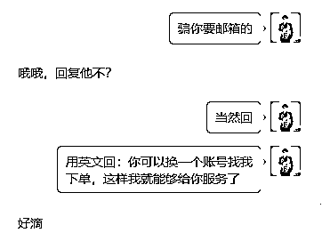

# 7天，40个合作伙伴，营收34000+， 借势《黑神话：悟空》，切入蓝海细分赛道，成为全球性平台游戏服务类目TOP1

> 来源：[https://zyr90ttkjb.feishu.cn/docx/To8Cdv7VuopfuSxWnc3cNGG8nRf](https://zyr90ttkjb.feishu.cn/docx/To8Cdv7VuopfuSxWnc3cNGG8nRf)

生财的圈友们大家好，我是凳子哥，主营跨境电商自选超市和赚美金工作室业务。

2024.6.24进的星球，时隔两个月，这是我在生财发的第一篇帖子，主要是想写一下，最近的《黑神话：悟空》游戏爆火，成为现象级别的一个热点事件背后，自己在这个事件当中的创收复盘以及对自身认知模型的进一步思考。

先说战果：

1，游戏20号上线，21号便正式推出自己的美金项目

2，在不到7天内，聚集40个美金合作方加盟我的项目

3，成为某平台《黑神话：悟空》服务类目TOP1

4，围绕《黑神话：悟空》关键词，已有40+项目店铺，给老外提供服务

本次复盘，我能够给你主要提供的价值点：

1，如何培养从无到有，创项目的能力

2，创热点项目的亲身经历全流程案例复盘

3，投资人给出的宝贵经验以及我的心得

对于创业者而言，每一次流量聚集在哪里，往往就是商机所在的地方，所以这一次黑神话爆火，直接就带动了一群人产生创收和增益。

像我们所看到的：

游戏博主杨家齐，直播打通关，3天涨粉51万，收获170多万的打赏，个人收益85万。

此外还有张大仙等一众游戏主播，借助这一波热点，一边涨粉，一边把钱给赚了。

除了直播游戏，还有的赚钱方式，比如：卖修改器、联动线下旅游、公众号爆文、创作视频、卖游戏设备、做电商卖手机壳相关产品、带货《黑神话：悟空》和瑞幸咖啡联名款等等。

《黑神话：悟空》20号上线，身边的朋友大致分两批，第一批人是兴冲冲买完游戏要体验的，第二批人是想着怎么把握赚钱机会的。

游戏上线的第一天晚上，其实我也不知道干嘛，我应该属于第三批——似乎是觉得这个机会和我无关的普通人。

那时的我不会知道，在27号自己写这篇帖子的时候，短短不到七天的时间，借助《黑神话：悟空》这波风找到细分蓝海赛道。

7天，40个合作伙伴，营收34000+，成为全球性平台游戏服务类目TOP1，下面，我拆解一下事件的脉络。

投资人说：你要好好写写，为什么你能把握这个机会，而不是别人。

# 一，总体的时间线：（2024年）

1，8.20上午10点《黑神话：悟空》游戏正式上线

2，8.21下午16:48，我的项目正式立项，以赚美金业务为切入口

3，8.22日，持续更文+腾讯会议宣讲，我记得第一次会议是66人来听

4，8.23日，持续更文+腾讯会议宣讲+人脉分销

5，8.24日，持续更文+直播1小时+腾讯会议宣讲

6，8.25日，持续更文+直播50分钟，被警告下播但成功引流+腾讯会议宣讲

7，8.26日，持续更文+自有提供服务店铺数达35家

8，8.27日，凌晨过11分的时候，成功招募第40个美金合作方

然后27号下午14:50，公开发文招募结束，晚上开始写这篇复盘帖子。

在此，感谢我的投资人，及时提点我把握住了战机；感谢我的两位助理，为我的后端服务全流程，付出了巨大的努力。

以及感谢帮我推广的合伙人以及每一位支持我的朋友，没有这些要素支持，我很难取得这个成绩。

（连发七篇文章的数据截图）

# 二，项目的缘起&来由

前面有提到，游戏正式上线的第一天晚上，我其实也没明白自己要干嘛，这一次机会和我有什么关系。

所以第一天晚上就睡得很安稳，基本上什么都没想。

21号上午的时候，开始看到一个消息，大概意思是，《黑神话：悟空》在老外那边，也爆火起来了，且一些老外在玩这个游戏的时候遇到了很多问题，比如：不懂剧情线，人物关系，比较难通关等等问题。

这一刻，我意识到，属于我的机会来了。

就是这个消息，把我之前已经有的神经细胞和已有资源，一下子就串在一起了。

因为我本身就一直有在布局，海外赚美金业务板块，在这个游戏出来之前，我还特意做了全网调查，弄清楚了欧美国家的职业偏好以及自由职业者，他们在各个年龄段群体的年收入水平。

结果让我大吃一惊，欧美很多14岁的孩子，就已经开始有自己的谋生手段，广州在中国的地位相当于美国的洛杉矶，在洛杉矶自由职业这一个群体当中，兼职的年收入都在4万美金以上，折合人民币就是30万以上，而在广州，很多地区的全职年收入也才8万多块。

所以我前期一直做的就是：承接劳务外包，做些编程、网站开发、机器人开发，给老外采购国内货源之类的项目接单。

所以我知道，在老外那边，他们还有游戏教练这个角色，而且还挺吃香，可以理解为：游戏陪玩+攻略指导。

想通了这一点之后，没有任何犹豫，这个项目就直接启动了，但是我当时也不知道能做到什么程度，只当这个是一个小项目。

21号发完第一篇文章，当天晚上，我还悠然的去了一个调酒的小摊前点了一杯酒。（没有意识到即将涌入的大幅流量）

第二天，也就是22号，睡醒起来一看几十个好友等待通过，（我的第一篇文章直接被推送了），都是对这个项目感兴趣的。

至此，我才真正投入到这个机会，在接下来几天开始加班加点的干。

投入到什么程度呢？3天内没有上过大厕，基本上每天都在招募+服务，我怕错过了就再也没有这么好的机会了。

在这个点上，我也想过，前面提到的那个投资人问我的问题，为什么这个机会我能够把握住，而别人即使看到也把握不住？

投资人给我的答案是：

首先，你得让自己有业务基础盘，而且你得持续在这方面深耕，这个决定了你一直有在牌桌上的机会，

谁也不知道机会什么时候会来，但是只要你在桌上，就有机会，很多人连牌桌都没上，即使好牌出现他看到了，又跟他有什么关系呢？

我能够把握这一次机会，其实就印证了上面这句话。

# 三，项目的风口红利

项目本身很简单，我们发现了某个自由职业平台，《黑神话：悟空》这个关键词类目，目前只有1个相关的服务提供，是一个老外，给别人提供游戏的参数设置，报酬是每次15美金。

我的打法：

聚齐至少40个人，然后一起去占据这个平台的优势生态位，趁着很多人第一时间还在忙着打游戏，和反应过来需要服务之间的时间差，就是我的红利期和机会窗口。

而且现在就1个老外提供相对于的服务，只要我的40人冲上去霸占关键词，就能直接把他的优势和利润瓜分掉，每个人可以发布5个项目订单，40人就是200个项目订单，这样，有需求的人一搜，基本上都是我们自己的人，从而拿下这个市场。

到我写这篇帖子的时候，我们已经有了40多个项目店铺，目前已经是该细分类目的top1，目标是做到至少150~200个项目上架，这样别人怎么搜，都是我们自己人。

这几天我经常给别人说的一句话是：

列车还没发出的时候，这个时候赶一下车是可以的，但如果列车已经发动，哪怕只是一分钟，两分钟，这个时候如果你还没上车，就再也上不去了，我还从来没有看到过，列车会倒车回来接人。

普通人走的路，拼的就是概率。

“我努力过无数次了，但我知道，机会只会出现在其中的一两次。”——《飞驰人生2》

而在那关键的一两次机会之外的其他机会，也需要我们用尽自己的力气去把握和争取。

这一次的机会于我看来：

1，试错成本非常低

2，关键类目的蓝海市场，一片空白

3，竞争对手很少

4，我本身就有相关的项目优势资源

这一次机会于我的合作方：

1，只需要支付小门槛加盟费

2，全程所有资料和交付都是我提供

3，拥有店铺的自主权，资金是先到店铺后台

4，同时能够学到海外知识，很多人第一次知道还有谷歌账号

5，也相当于是一次小成本的创业，对双方彼此都是一个机会

之所以说蓝海和竞争对手少，是因为一开始做的时候只有一个竞争对手，直到24号，才开始有外国人，在上面发布其他相关的服务接单赚钱。

做项目，要做下行损失风险小，但潜在收益天花板高的项目。

我们的服务SOP：

最终达成的目标：

1，在平台上赚项目的收益，借助风口的力量

2，通过这个项目，积累老外私域客户，从而实现私域积累，赚长期收益

因为我本身就是做跨境电商的，目前主要是东南亚TK本土、俄罗斯ozon本土，TEMU，接下来还有土耳其贺佰狮，以及facebook等平台要拓展。

国内一个对跨境感兴趣的私域，价值是30~50块钱一个，而如果说这个私域还是老外的话，那价值至少是翻5~10倍，在很多领域都能够实现结合变现。

所以这个项目，在我看来，就是一件利人利己的事情，如此就值得我好好的去推动这个项目，真正成长为自己想要的样子，然后切切实实给大家带来收益，一边学习，一边把钱赚了。

也就是说，只要你上车之后不中途跳车，在这个项目上产生收益增长是必然的，因为我们要么赚项目，要么赚私域，要么赚知识，在哪个角度看都是有价值的。

要么赚短期项目收益，要么赚长期私域用户，只要不下牌桌，赚钱就是必然的结果。

# 四，关于项目现状

这段时间，忙完招募合作方，外加教大家上架项目订单，目前，店铺的数据，都还跑得不错。

【店铺数据】从一开始的0浏览量，到慢慢的几十，到几百。

要知道，很多已经非常卷的类目，上架好自己的服务之后，可能两三个月，也不一定有两三百的曝光，更别说有客户过来咨询了。

到26号，已经真正开始出单。

项目刚发布，就拿到这样的正反馈，说明，我们的战略是没问题的

剩下的，就是继续建设，等风来。

把事情做好了，赚钱就是水到渠成的事情。

我目前给老外服务的类目：

游戏陪玩，攻略，视频制作，图片制作。

我在写这篇复盘的时候，已经让合作方正式发布第二个类目项目，每个人发布4个，40人就是160个项目。

从这个角度出发，于我而言，游戏才真正开始。

该项目的三个价值点：

1，帮助小白基础的学习，至少让合作方学到了东西

2，在平台上接单赚收益，不仅仅是某一个平台，我聚集一批人之后，在哪都有优势。

3，积累私域老外用户，发展私域电商，最终是脱离平台进行创收。

而在做的这个事情，又恰如其分的和跨境电商的主业务又可以结合在一起，如此形成闭环。

很多人都想要确定性，但确定性只能带来微薄的利润和收益，创业路上，敢于拥抱不确定性，才有机会体会到其中的乐趣。

# 五，自我认识和成长

一、找到自己的核心天赋优势点

认识项目很简单，认识自己才是最难的，很多人穷极一生，也不知道自己有哪些天赋，应该去做哪些真正是自己优势位的事情。

这一次项目，对我而言不仅仅是赚钱，还是惊喜的发现自己的天赋点。

在《黑神话：悟空》这个游戏里面，剧情是找到失散的大圣灵根，然后就能回到花果山，重新复活齐天大圣。

而发现并且认识到自己的天赋优势位，无异于也是一次“重新复活”。

投资人说：你身上有一种天赋是，让项目从无到有，以及煽动性进行项目扩展放大的能力。这个天赋用在跨境电商方面有一个很好的运用，就是：建店群的能力，比如：一个月在某平台铺100个店。

所以我的生意模型，是可以对标苏宁和国美的，把自己定位为渠道商，把盘子做大，然后凭借手上几千家店铺以及销转能力，拥有自己的话语权。

而这一次的《黑神话：悟空》项目，操盘的手法，其实就是以上模型的缩影，本质上是一件事情。

二、认识到自己做项目的局限性

1，我目前起盘的项目，还只是停留在短平快的风口红利期项目上

2，我自己在做这个项目，但是我自己不清楚他能够成长到什么程度，如果我深刻理解了这个机会，我也不会第一天去酒摊买酒，而是采取更多必要的推进措施。

而我的投资人，他的水平，是可以根据一个人的特质，从无到有，创一个项目，且能够长期持续做下去，并且有可能成为自己产业的项目。

这个状态和境界，是我要继续成长和学习的。

三、本次项目中运用的5个关键思维点

1，预售思维

创业，不是什么条件都具备好了才去行动的，21号我起盘这个项目之后就直接开卖了，那个时候，我并没有完整的交付流程，甚至我的助理班子都是临时组建的，后端的职业游戏玩家，我也是后面找的。

如果我把一切要素都准备好才去招人扩大自己的规模，那我早就没有这样的机会了。

2，合作思维

一个人会做的很慢，这个时候，找到强有力的合作分销伙伴，势能会叠加的更快。

这一次项目，除了自己团队伙伴帮我转发之外，还有AI司强，和工程设计师雪儿，为我提供了很大助力。

3，风控思维

在做《黑神话：悟空》赚美金这个项目之前，我就在这个平台上被老外骗过几百块钱，所以知道这个平台上有哪些坑，及时的做出风控建议和策略。

4，收费思维

我现在基本上不提供免费的服务，不管是合作做项目也好，还是其他的服务，一定是收费，这个是最好的筛选手段，同时也能够滋养我们自己的能量场。

所以我的合作方基本上都是收费招募的，这一批人行动力更强，同时对我的认可度更高，不仅仅我会很舒服，就连我的助理都会很舒服。

5，统筹思维

在一开始招募到20多个合作方的时候，我发现了一个问题：自己把大量时间都放在了给合作方答疑上了，因为我是多对一交付，所以消息特别多，而这个时候助理班子刚搭建好，教程还有很多地方要优化，他们还没上手。

我必须得把自己解放出来，才能更好的让这个项目活下去。

于是我就直接安排好分工，第1个助理，是个乐观派，让他全盘负责客户的回复和答疑，遇到问题，再补充进去SOP交付文档，事实证明，她干得很好，为我解决了一大问题。

第2个助理，为人细致，做事上还不错，主业是医生写病历和查房，我发现她在写交付流程上很不错，于是把这一板块全盘交给她负责，我自己只需要写第一个样本，她直接跟着这个样本做就可以，这解决了第二大后端交付的问题。

然后，老外玩游戏，是英文版本，而国内很多教程和文档，是中文板块，所以我让人专门负责，把这一块教程，翻译成英文，也为我节省了大量的时间精力。

此外，还有客卿长老，小白同学在第一次接触出海业务的时候，很多工具和账号都没有，新人很容易连注册账号都有各种问题，这个时候，我请了两个专门的技术指导，直接解决问题。

至此，我才有时间精力，去继续招募扩张，以及思考整体项目的发展和品类创收。

# 六，踏上取经路，比抵达灵山更重要

写在最后，拿《黑神话：悟空》里面的一句话和大家共勉：踏上取经路，比抵达灵山更重要。

创业和打工，完全是两码事

大哥和小弟，完全是两路人

当天命人踏上寻找灵根的路时，他便再也回不了头。

这一次《黑神话：悟空》热点风口来临，下一次谁又知道是什么机会呢？不管怎么样，认真打磨好自己的基础盘，让自己持续在前进的路上，不下牌桌，一步一个脚印，我们才能够有更大的机会和空间。

总结一下核心的关键点：

1，一定要有自己的业务基础盘，机会来了才能把握的住

（如果我不做跨境和美金业务，那我也不会有这个机会）

2，每个人都有自己的专属机会，要结合自己的天赋点去做事

（我的天赋是快速起盘，从无到有，以及项目扩张的能力）

3，有了基础盘，不要轻易下牌桌，在机会来临之前提前布局。

（为什么普通人很难抓到风口？是因为很多普通人没有提前布局，而没有提前布局，又是因为他们没有自己的基础盘，所以这是一个恶性循环。）

4，人生中最重要的机会，就那么一两次，能够赚钱的时候，就好好赚钱，因为说不定什么时候，赚钱的窗口就关闭了。

5，敢于拥抱不确定性，机会来了狠狠干！而能否把握机会，在于你之前和当下的积累沉淀。

附赠：

《黑神话：悟空》游戏结局老猴子的智慧语录：

1，“空有天赋，不思进取，小富即安，沉迷享乐，想安逸又想名利，想快意江湖，又想成佛作祖，哪有这样的好事。”

2，“身本多忧，怎可全求，牛魔王如此，孙悟空，也如此，有天命的眷顾，更须有斩断私心凡念的觉悟”

3，“运气只是强者的谦辞”

4，“你原是无名之人，却在集齐六根的途中，斗了重重艰险，战了许多强者，淬炼出了足以配得上那份力量的刚强意志”

5，“世道从来不公。”

附录：（营收数据）

总营收：34768元

图片到账总数是：31650.22

主要是有一个渠道商分销的时候扣除了一部分。

和生财的圈友共勉，希望对在看的你有所帮助，继续和大家一起生财有术！

永远不下牌桌，认真打磨好自己的基础盘，我们都是自己人生的天命人。