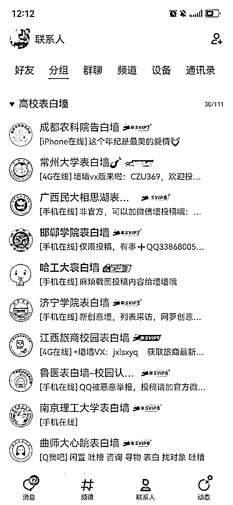

# 《一位普通圈友的项目踩坑及反思》

> 来源：[https://p3j199j7hw.feishu.cn/docx/UneHdfkOroyuaPxaMQVcC3CLnnh](https://p3j199j7hw.feishu.cn/docx/UneHdfkOroyuaPxaMQVcC3CLnnh)

各位生财的圈友，大家好，我是小秦哥。

这是自己在生财有术的第一年，普普通通的新生一枚，很荣幸今年4月份通过涛哥的推荐加入生财有术，这一年在努力看帖子学习，认知得到了很大的提升，也看到了许多优秀的圈友，并清楚的明白自己距离他们有着非常大的差距。

加入后多数时间都在潜水，实在惭愧，这将是自己第一次在生财分享文章。

这篇文章是对自己过去做过的项目的总结和反思，没有激情澎湃低谷逆袭的励志故事，也没有牛逼耀眼的收入数据，也不是来分享所谓的“成功经验”，更多是想表达对“失败”的反思，想用朴实无华的文字分享自己创业路上的踩坑和反思，希望对大家有所帮助。

文章目录：

一、为何要写此文

二、大学期间项目踩坑及反思

三、毕业后项目踩坑及反思

四、谈谈有关创业的 3 个点

### 一、为何要写此文

创业至今，感觉自己好像未取得啥大的成绩，就是一枚普通得不能再普通的生财群友，创业路上也是一路跌跌撞撞。

目前自己坚持最久的事，便是每天写日记，记得是从 2013 年 6 月 9 日一直到现在，这 11 年每天会写日记，记录每天发生的事，并进行反思和总结。

刚开始写日记是因为高考后压力很大，对未来很迷茫，把写日记作为自己缓解压力的一种方式。

后来，便开始爱上写日记，感觉这会让自己每天的生活有迹可循。

最后，每天写日记成了自己的习惯。我想，挺多的创业者能每天跑步或日更文章，最开始可能是热爱或是为了达到某种效果而去做，但最终也会因为习惯的力量牵引着自己去做这件事，如果每天不跑步、不日更文章，就会感觉生活缺少了什么。

其实想想，做成一件事也是从每件小事开始积累的，也需要日拱一卒、持之以恒。

这篇文章，是对自己过去一段时间做项目的反思和总结，有坚持也有及时放弃止损，项目除了收获所谓的经验和赚点小钱外，多数也以“失败”告终。

由于自己的认知和能力有限，文章中的观点不一定正确，但一定是自己当时最真实的想法，希望对大家有所帮助。

在生财经常看到圈友分享自己的创业经历，除了低谷翻盘的励志故事外，也有各种让人难忘的“踩坑”经历和反思，说明大家都一样，都是一路踩坑过来的。

成功使人热血沸腾和自信

失败使人痛苦煎熬和成长

成功会让人感觉你很牛逼，毕竟做事结果说话；失败往往会带来挫败，也不敢分享出来。但我觉得，真正让人成长的是失败后的反思，是敢于直面自己惨淡的经历，也是那个一次次从低谷爬起来不断成长的自己。

大佬的故事太过遥远，那就听一位普通圈友的踩坑和反思吧。

现在，将正式开始分享自己做项目的踩坑经历及反思，希望对圈友有所帮助。

### 二、大学期间项目踩坑及反思

### 1.淘宝客

初步接触淘宝客也是一个偶然的机会，有人把我拉进去一个优惠券的 QQ 群，群里发了一些价格非常优惠的产品。

管理员说，网上想买的商品，把链接发到群里，他们会再发一个链接过来，同样的商品，价格是有优惠的。

他们还说，他们有内部的影藏优惠券，一定要找他们下单才有优惠，直接下单是没有的。

自己心动了，就买了一单，发现价格真的有优惠。

后来就开始琢磨怎么回事，在网上查和付费后，最后才发现这个项目叫“淘宝客”，购买一些软件就可以控制 QQ 在群里发单和帮找优惠券，有人下单就有收入。

于是，自己便开始捣鼓起来。

于是，便开始了受挫之旅。

最开始选择的是 QQ 群发单，那起码群里得有人吧，怎么办？自己拉同学和亲朋好友进群，但是一个人的力量总是有限的，还得找人帮忙。

于是，便招兼职，拉 100 人有 50 元，五毛钱一个人。

一下子就把第一个 1000 人 QQ 群拉到 800 多人了，心情格外爽，想着用这种方式裂变下去，赚钱指日可待！

于是，美美的睡午觉去了。一觉醒来，看到群里面的成员只剩下 100 多人！就像一盆冷水从头狠狠浇灌下来！

最终发现，是被其中一个兼职踢的，我也被他删除了好友，加他 QQ 也不同意，没办法，只能自己认了。

后来反思，这里自己犯了一个致命的错误：太过于信任陌生人，总以为所有人都是善良的。

关键的资源，真的不能随便给未见过面且没有信任基础的陌生人。

之所以设置他为 QQ 群管理员，是因为如果兼职不是 QQ 群的管理员，他们拉人进群的加群率不高，也会受限制，所以就给他们设置了管理员，打算拉群完成后再取消管理员。

后来真没有想到，一个兼职居然利用管理员的身份踢人出群。

除了自己太过于信任陌生人外，在一些项目任务未完成时，自己也要盯紧一些。

* * *

QQ 群是可以屏蔽群信息，微信群的话要么退群、要么就是信息免打扰。

当时一对比，也是发现 QQ 群的效果不如微信群，后面又改成微信号和微信群发单的方式。

接着，因为微信发的信息太频繁，就导致微信号被封，然后接着解封。

后面采取减少发单频率，采用微信老号发单，朋友圈发单，尽管会延迟封号的时间，但也是不可避免的会封号。

于是，反思到：和平台规则对抗的事，短期可能有效，长期注定是无效的。

于是，决定改变策略，便开始把人往返利 APP 里面拉，让他们下载 APP，下载就有有免单优惠，并说需要商品和优惠，直接在 APP 里面搜。

他们每个人都会有自己的专属邀请码，用于自己的推广，他们自己去推广也会有收入。

接着，继续开始自己的 APP 推广“三板斧”:校园赞助，裂变，表白墙宣传。

校园赞助：

也就是赞助班级和社团，都是按人头算赞助费，通过自己的邀请码下载 APP 后本人有包邮免单礼品（利于激活 APP 和让他们体验购物流程），社团有赞助费（按照人头算，8-10 元每人）。

免单的费用是代付款的，也就是说如果他们买的免单商品如果退款了，钱是会返还到我自己账户，是为了避免退款后钱也不见了。

免单费用和赞助费加起来大概 15-18 元每人。

裂变：

分为自己裂变和协助下面的人裂变。

自己裂变就是推广自己的 APP 邀请码，有人下载后会有一个免单礼品，因为免单的礼品是有返佣的，所以他们下载不仅得了一个免单的礼品，还可以有 2-3 元的返现。

协助他人裂变，就是通过我邀请码下载 APP 的人 A，如果再去推广 B。

B 可以得免单礼品（以及 2-3 元返现），这个免单费用我来出。

A 可以得 B 免单后的商品下单返利，我还额外奖励 A 5-10 元的红包

表白墙宣传：

也就是付费让表白墙发广告做推广，当时有 300 多个表白墙的 QQ，后面删除了一些，目前只剩下 100 多个，这个 QQ 也是很久不登录了。

淘宝客项目做了半年，因为收入不达预期、推广成本太大等各种原因，最终也是放弃了。

后来的一些反思：

1.项目会有周期，新模式的出现会有影响。在淘宝客赚钱的时候，如果没有抓住，市场处于下降趋势的时候，再怎么努力达到的效果也不会太好；拼多多和直播带货，会对传统的淘客模式会有影响。

2.圈子真的很重要。当时的自己并没有加入什么创业或者淘客的圈子，一些新的方法不知道，也没有一起打气加油的人，仅凭自己想象在做事，孤独和无助。

过来几年后，依旧听说有人做淘宝客年入千万，月入百万的，说实话真的很羡慕。真是应了那句话：有的项目尽管处于下行期，依旧有人在赚钱。

3.学会计算投产比，不要妄想扩大规模来掩盖效率。当时前后投入了 10 多万，但是自己算产出惨不忍睹，回本周期也长。如果当时知道包裹粉或者其他低成本渠道，或许结果会有所不同。

4.后期的维护很重要。他们下载 APP，购买免单礼品后，基本就没怎么理了，也没有怎么去维护，导致大多数下载拿完礼品后，很多都卸载 APP 了。

5.做项目要量力而行。自己当时还在读大学，赚的钱也不多，采用付费推广的方式还需考虑自己的经济能力和回本周期，特别是单个推广成本还比较高的情况。

### 2.人力资源

也就是劳务中介，顾名思义就是为商家提供劳动力的中介。房地产、家具城、教育机构、车行、手机城等商家搞活动，为他们提供一些人手去帮忙（举广告牌，发传单，现场维护，礼仪，舞蹈，电话客服），为提供一些需要补习的学生提供家教，为大学生提供暑假工。

刚上大学的时候，自己去做过一次兼职赚了 50 元，后面发现组织人做兼职不仅可以帮到别人，还可以拿中介费，比自己做兼职轻松且赚到的还多。

于是便开始行动。

有两个重要的点，一个是商家，也就是跑业务；一个是兼职人员，那就得建 QQ 群拉人。

跑业务：

最开始的时候，是真的没有钱啊，代步工具是花了 100 元问学长买的二手自行车，地下商场买了一双便宜的皮鞋和业务包，印了一些名片就开始跑业务。

怕被客户发现踩着二手自行车来跑业务，就把车子停在比较远且他们看不到的地方，跑完业务再折返回来去跑下一家，感觉当时的自己真的很卑微。

怕自己满身的汗影响形象，就站在远处等风把衣服吹干了再进去谈客户。

三个月的时间，磨坏了 2 双鞋，把大学所在的五线城市基本都走遍了，依旧没有一个单，也会委屈到躲在被子里面掉眼泪，但又怕被舍友发现，所以不敢哭出声，被发现被子湿了也只是说闷头睡觉出了汗…

建 QQ 群：

因为当时学生玩 QQ 比较多且 QQ 群群人数上限更高，所以当时建的是 QQ 群。然后采用招兼职拉人进群、以及不断到其他群宣传、换群这三种方式，不到一个礼拜就弄了 20 多个自己的 QQ 群，又加了学校 200 多个不同的 QQ 群，基本把本校的大学生覆盖了。

因为毕业后不想被 Q 群信息打扰，目前 Q 群只保留了自己创建的和管理的 20 多个群（也很久不看了），加入的 200 多个 Q 群全部都退完了。

因为三个月持续高强度的跑业务，一单也没有，那时候真的想放弃了，感觉跑业务真的太难了。

某天的下午 2:15，一个商家说需要一个兼职帮忙发传单宣传一下，虽然给的报酬非常低，只有 10 元，但还是答应了，把兼职安排好完成任务后，赚到了第一笔收入。

赚的第一笔钱，虽然不多了，真的无比开心，如果没有这一单，可能真的放弃了。

记得当时和合伙人，点了两碗 3.5 元的桂林米粉，豪气的每人加了个 1 元的卤蛋，还开玩笑的说：平分剩下的 1 元，每人 0.5 元，算创业的第一笔纯收入。

后续的发展总体是比较顺利的，通过人力资源这块业务，解决了大学四年的生活费和学费，去广州旅游和看了周杰伦演唱会，买了车，有了自己的小办公室，也存了几十万（不过后面因做项目亏完了）

这些微不足道的成绩，和一些做大学生业务厉害的圈友比起来，只算小打小闹，我重点要聊的还是关于过程中遇到的问题，以及自己的反思。

遇到的问题：

1.商家拖欠兼职工资。

给学生提供的兼职，基本是日结、周结，极少部分是月结的，如果是月结会和学生提前说好，或者用自己的钱先垫付给学生。

记得遇到过这样一个商家，我们这边提供了很多的兼职过去，说好月结的，后面他们公司遇到了经营问题，前后拖了 1 年多才把钱要回来。

因为兼职是我们提供的，学生只会找我们要兼职工资，被学生催的时候也只能尽量安抚，到最后只能用自己的钱先垫付，相当于自己承担了风险，但也不得不这么做。

2.兼职人员放鸽子或迟到。

也就是活动马上要开始兼职人员突然说有事来不了，就会造成很被动，只能临时招人顶上去，或及时和商家沟通。

3.兼职人员工作不认真。

兼职人员工作不认真，被商家发现，要求扣工资，学生不情愿，这边作为中介，就会陷入两难的境地。

后来也想到了应对办法，在招人的时候会提前强调：临时放鸽子永不录用、迟到则兼职任务取消、有事不能来需提前一天说、工作不认真提醒后若仍不改正限制下次报名。

4.被商家暗示提供某些“交易”。

一些商家会给一些暗示，让帮联系一些女大学生提供“服务”，还承诺给一个好的报酬。这时候是比较为难的，如果选择拒绝商家，就会得罪商家导致丢业务；但又不能真的去帮他牵线搭桥。

只能表面答应说帮找一下，实际根本没有找，过一段时间就说没找到。

5.被骗吃骗喝。

遇到过一些商家的负责人，谈话就暗示带他出去吃个饭聊聊业务，开心了一定能成的，实际上是去他朋友的酒店吃贵的菜，喝好的酒，一顿操作猛如虎，花了大几千，对于当时属于刚创业大学生的我，说实话，这顿饭吃得不是滋味。

这人不久就调到别处了，后续也没有帮忙介绍业务。

6.暑假工中途改价。

和厂里的负责人谈好价格，因为没有签协议，等搭乘暑假工的车子到中途的时候，厂负责人便说人员太多等各种原因需要调低工价，学生就很不乐意了。

有的学生说我们是诈骗，有的说要赔偿，在半路上联系负责人沟通和安抚学生，花了不少时间。

最终，经过沟通，工价在降低的基础上加了一点，如果还愿意去的学生就送过去做暑假工，不愿意的就补贴车费送回去。

7.其他团队竞争。

学校的人力资源校园团队也有好几个，会有价格竞争（比如给学生更高兼职工资，给商家报价更低来拉拢商家），也会有冒充兼职故意临时放鸽子的。

所以，这时候保证兼职人员数量的供应、加强对兼职人员的审核和沟通、和商家保持沟通畅通，就特别的关键。

8.兼职私自联系商家。

兼职派过去之后，做了一段时间的兼职会私自联系商家，绕过我们，这是无法避免的。

这就取决于商家的选择，选择兼职个体，还是选择背后能源源不断提供兼职的团队，影响因素是商家对人员数量和质量的要求，以及商业道德感（比如，人力资源团队帮介绍人过去做兼职，之后便跳开人力资源团队，私自联系兼职，这种做法有些许不道德）

9.合伙人不干活。

创业之前是说一起好好干，然后五五分，合伙人一开始还干活，后面便捣鼓其他业务，对于人力资源这块完全不理。

最后，只能好聚好散，各干各的。

10.业务量变少，收入不稳定。

快毕业的前一年开始，明显感觉到业务量在变少，收入也不稳定，自己的重心也开始转移到毕业论文等事上面。

这个业务后面只是维持一下老客户，随着自己大学毕业，人力资源业务也就结束了。

#### 一些反思：

1.垫钱赊账做业务的模式需要谨慎。

人力资源这块，有时候是需要提前垫付工资给兼职的，如果最终没有拿到商家的钱，就相当于自己不仅没有赚到钱，还会因为垫付而亏钱。

像我广西老家前些年种沙糖桔非常赚钱，挺多人靠种这个发财了。于是很多的农民就跟风种，去化肥店赊账买农药、买肥料，卖了果子再还钱，化肥店老板就会很为难，不赊账做不了生意，赊账又面临收钱的问题。

如果最终沙糖桔收成不好或者价格低，赊账的钱就还不起，化肥店就会有一大堆烂尾账收不回来。

2.人员的管理和优质的服务很重要。

比如，大学时做人力资源时遇到兼职放鸽子、迟到、不认真干活等情况，人员的管理就非常重要了。

这个业务能顺利做起来，现在反思，靠的还是优质的服务，比如商家需要的人数能供的上、需要的要求能满足、人员不迟到、工作认真。对于兼职人员这块能做到及时发放工资（必要时垫付工资）

3.不做违法违规的事。

做业务时，肯定会多少涉及一些灰色的东西，会面临各种利益的诱惑，合法合规是底线，人一旦突破底线就会慢慢走上不归路。

4.谈业务必须请吃饭才能谈，需谨慎。

我认为，大多数情况吃饭是业务谈好之后的事，或者是边吃边谈，如果是刻意以请客吃饭作为谈业务的前提条件（并在吃饭时故意点贵的酒菜），需谨慎。

5.沟通和善后能力很关键。

会遇到一些突发事件，这时候的沟通和善后能力就特别关键，特别是遇到利益选择的时候，就非常考验一个人的智慧了。

6.不可做忘恩之人。

比如，别人给你介绍客户，是否应该回馈一下别人。

比如，因为别人的介绍你认识了牛逼的人，你后面发展起来了，对于这个当初的介绍人，一定要有感恩之心。

7.创业要提前说好权责、退出机制、利益分配、如何承担亏损。

据我了解，很多的合伙创业，最后闹的不欢而散，往往是因为没有把权责、退出机制、利益分配、如何承担亏损等提前说清楚，先做“坏人”说清楚还是很有必要的。

8.往往是平台成就了个人，并非个人成就了平台。

自己做人力资源，是因为依托大学生（学长）的身份，发现了商家需要兼职人员、学生需要兼职赚生活费的需求，最终经过努力做起来的，就算我不做，也会有其他人做起来。

所以，真的不能过分强调自己的能力，往往是平台或风口成就了自己。

这里，想起一些新闻：有的人离开了大公司，才发现自己并没有那么厉害，只不过行业处于风口时，把自己抬到了和能力不匹配的高度，产生了过度自信。

不要，等潮水退去，才发现自己在裸泳…………

### 3.驾校代理

当时已经不满足于人力资源的业务，便开始着手拓展新的业务。

一家新开的驾校便进入自己的考察范围内，考虑到：新开的驾校报名学车的人不多，不会造成排队拥挤；新开的驾校设备新，体验感好；新开驾校肯定会有比较大的优惠力度。

于是便开车去和老板谈合作：介绍学生去他那里报名驾校，每介绍一个学生给几百元的提成，老板也爽快的答应了。

接下来便是帮驾校招学员，在校园铺天盖地的宣传，陆陆续续招了几百个驾校学员。

此时正幻想着到哪里大餐一顿时，却不知危险已经悄然来临……

没错，特么的，老板卷款跑路了，经侦大队也介入调查了。

后面报名的几百个学生不停给自己打电话，几乎 24 小时都有，电话几乎快被轰爆了，根本无法睡觉，只能不断安慰学生我们会处理好的。

那段日子每天都度日如年，精神压力非常大，但又睡不着，课也不想去上。

实在没办法，就围着操场一圈一圈的跑，跑到差不多虚脱就洗个澡，把手机调成静音睡个觉，睡醒了有未接电话再回拨过去。

开始是寄希望经侦大队那边，能把老板抓到，然后安排退款，我们这边也好向学生有个交代。

于是，隔三差五往经侦大队跑，隔三差五打电话问进展，得到的答复还是正在落实。

等了三个月后，还是没有结果，学生已经忍无可忍了，说真的，自己那时候都不敢出宿舍门，一是害怕遇见驾校学员尴尬；二是怕愤怒的学员失去理智打人，到时候自己还手或不还手都说不过去。

后面想了想，学员是因为信任我们才报名的，驾校老板经营不善跑路是他的不对。我们没能够认真辨别，导致学员遭受损失，是我们的过失，学员从头到尾都是受害者。

于是，便和其他合伙人商量，大家一起垫钱先赔付给学员，他们自己决定如何处理这笔钱，等驾校那边情况确定了再拿回我们垫付的钱。

这次垫付钱，也造成了后面几年负债被动的局面。

现在想一想，即使抓住老板又如何？他已经没有钱了，驾校的车和他的房子，他早在跑路前就已经处理掉了。

截止到这这篇文章，时间已经过去 8 年之久，驾校老板到现在都没有抓住……

据说，驾校老板跑路的 2 年后，又有一家驾校老板跑路了。

反思：

1.新开的店，交钱要多留个心眼。

新开的店，可能会有各种优惠，但往往没有经历时间和市场的考验，特别当这样的店不是大型连锁品牌或在当地经营的时间不长时，付费的风险就会更高一些。

这些新开的店，往往你充了会员没有多久，钱没用完，它们就倒闭或者跑路了。

据我了解，有一些不道德的人靠“跑路”的模式赚钱，也就是新店开业的时候，疯狂招兼职去推广会员卡，等你交了会员卡的钱后，钱没有消费完，店就倒闭了。

法人还可能是农村的老单身汉或者其他“替罪羔羊”，他们有专业的律师，投诉和报警也没用，因为他们早就把“跑路”这一套研究得炉火垂青。

2.遇事要敢于承担责任。

驾校老板跑路后，我们可以把所有责任推给驾校，或者说等待经侦大队处理结果，也可以说自己也是受害者，用各种方式来避免自己垫钱提前赔付。

但，这都是逃避责任的行为，学员因为信任学长而交钱，而面对这份信任唯有敢于承担责任方才对得起他们。

其实，出社会后的创业，又何尝不是如此。

3.低成本的促销活动要小心。

低成本的促销需要多留个心眼，亏本的东西，别人总会想办法从其他地方赚回来，或者里面有什么门道。

比如，驾校收的报名费很低，有着尽快招学员的考量，也可能是因为资金链紧张提前收人收钱规划跑路的前兆。

4.可以选择分期付款的方式，降低风险。

当时报名驾校的学员有一次性付费的，也有分期付款的，也就是他们考完科目一再付后面的钱，这部分学员的付款方式，有效把风险降低了一些。

报名驾校如此，其他一些可以分期付款的商品亦如此。

### 4.Z 金盘

在一个微风徐徐吹来的午后，我坐在学校桂花树下的椅子上休息，阵阵花香让人心情格外舒畅，伸了个懒腰，刷着 QQ 空间

一条学长的空间动态吸引了自己，大概意思是：有个投资项目，投 400 多，15 天后收款 600，首期包赔（也就是首次投的 400 多亏了的话学长赔付），赚了算自己的。

对于这个学长还是信得过的，看他的 QQ 群人数截图，他已经推广几百人了，觉得反正没有什么损失，还能赚钱，几百块钱也不多，就跟着学长去操作。

写到这里，你可能会想到亏钱后学长跑路不赔付了？

其实，并不是这样。投了之后不仅没有亏，第 15 天还顺利到手 600，发现真的能赚钱啊！

赚钱居然如此简单，这项目收益高、投多赚钱，推广还有推荐奖！

我记得网站当时的宣传口号中心是“互助”这个词，我助人人，人人助我，投的多赚得多，推广有奖励（被推广的人每次投，作为推广者都有收入）。

然后了解到学长通过自己投和推广，在短短半年多就赚了上百万。多年后回想起来，才发现他在做这个项目和推广时，已经提前布局好了退路。

为何这么说？

因为当时学长宣传的是，首期投 400 包赔（如果赔了，他是真的帮赔付），然后等你赚了第一次钱后，他会建议你用赚来的 200 来投（200 亏了就不投了），或者拿赚来的 200 去潇洒不投了，因为项目有风险。

但是，群里面每天都有人日赚几千，日赚上万的，都是真实赚这么多，当时真的很疯狂，对于一个月生活费 1500 左右的大学生，谁能保持理智？谁又会错过这个机会？

所以，这就是他的高明之处，首期包赔获取信任，建议你用赚来的钱投，建议你不投，以退为进，钱他会继续赚，也当了好人，后面即使你亏钱了，他也撇开了责任。

嗯，继续聊回来。

当自己赚了第一笔 200 元后，看着群里面别人赚钱那么简单，当然不满足了，于是用自己的存款和弄校园代的钱，疯狂的投进去，也体验到了日赚上万的快乐，感觉人生马上就要迎来巅峰了！

按照这个趋势下去，年入三四百万，指日可待！那时候我还只是一个普通大学生啊，人生这么快就要迎来高光时刻了吗？

记得网站上宣传说，自己投是互助收入，推广是帮助他人而产生管道收入。

这时又开始不满足了，胃口也越来越大了。于是，也用首期包赔的模式推广了一些比较好的朋友和舍友，他们首期全部都赚钱了。

此时，每天打开银行卡看余额，每天沉醉于一种收款的亢奋状态中……

以为自己将成为踩中风口飞上天的猪，没想到终将成为一头待宰的猪！

危险也正在慢慢袭来……

后来，网站收款越来越慢，网站的公告先是说系统升级，过来一段时间会恢复收款。

却不知这是第一波跑路，也就是释放一些金额小的单子，给你造成网站在恢复的错觉，诱导你继续投。

于是，很多人当了第二波韭菜，里面的钱还未取出来，就继续投，幻想着大赚一次，最终血本无归。

自己当时也没有禁受住诱惑，前期赚了的钱，加上自己的存款，全部都投进去了，最终的结局当然是全部亏完。

如果用赚来的钱投，如果赚钱了不投了，或许结果会不一样，我想每个亏钱的人事后的反思大多如此，可是往往因为利益驱使，当局者迷，醒悟总是在亏到血本无归后。

此时，晚矣。

反思：

1.包赔是一种宣传的手段。

包赔的前提往往是首次包赔，且有一定的金额限制和时间限制，可以作为种宣传的手段，方便和客户产生首次的信任。

首次的信任非常关键，是后期成交的基础，前提是自己对项目有把握、自己有实力垫付、项目也是正规的项目，不能以“包赔”的方式收钱坑人。

2.高收益有风险。

收益性、安全性、流动性是资金的三个特征，就像三角形的三条边，不可能三条边都无限长，一个项目流动性好且收益高，必然也意味着风险性大。

3.学会看清事物本质。

其实，想一想，一个项目如果没有产生任何的交换价值，钱转来转去，本质还是金字塔模式，意味着用下面人的钱来填补上面人，随着时间流逝以及下面的人数变少，最后崩盘是必然的，这是客观规律。

现在很多网上投资项目，不管如何包装，本质还是金字塔模式，就不要去碰了。

4.不要太贪婪，学会及时止损。

保本比赚钱更加重要，当赚到钱之后，千万不要拿所有的钱去投某个项目，甚至还借钱加杠杆去操作，这样的做法看似很勇敢，其实就是莽夫行为。

学会及时止损是一种智慧，当你发现一件事做下去会继续亏本的时候，扭转局面无望的时候，即使前面亏得再多，不要有什么情怀，要果断放弃，不要存侥幸心理。

坚持很难，放弃有时候更难，因为投入了感情、资金、时间等沉没成本，但及时止损是必须做的且正确的选择。

### 5.网上 D 博

一个人亏了钱之后，总是想着快速翻身，但是有这种想法的人，往往又会跳入下一个陷阱，尽管有的项目你明知道是坑，但为了回本你会选择放手一搏，想回本且不甘的心会战胜理智。

很不幸，那个继续跳坑的人就是我。

Z 金盘导致自己亏损，心情还是很难受的，怎么也得东山再起吧？怎么也得上演一出逆风翻盘的好戏吧？

一波未平，一波又起。

一坑刚出，一坑又入。

这次来钱更加的快，几秒钟就可以知道结果，到底是亏是赚。

凭借着自己的“研究精神”，感觉把平台的规律摸透了，前期赚到了一些钱，感觉新的机会又来了，马上就可以把 Z金盘亏的钱赚回来了。

于是，继续开始筹钱，开始加大投入。

随着加大投钱的力度，发现“规律”不靠谱了，我当时想肯定是自己没有摸索透。

于是，又开始研究平台“新规律”，结果，我是真的发现了！平台总会让你先小赚，然后再大亏，不断亏亏赚赚，最终你一定是亏的。

你以为研究到了规律，不过只是你以为而已。

你以为你在以小博大放长线钓大鱼，其实你就是别人钓的那条大鱼！

后面的结果就是，及时止损，投降认输，因为继续下去，只会亏得更加的多。

学生时期，真的是不知者不畏，但醒悟过来时，早已经是亏得一塌糊涂。

反思：

1.远离 D 博，不要以为自己很聪明。

有句话叫十赌九输，至今未看到有人靠 D 博发家致富的，开 D 场“致富”的倒是有，不过他们大多都进去吃饭了……

真的不要以为自己很聪明，能摸透平台的规律，不要以为自己先小玩一手不会上瘾，不要以为可以稳定搞钱。

有时候，亏钱的例子就在身边。

我的一个叔叔六年前做红木家具，一年赚个六七十万非常轻松，后来红木家具市场不景气，沾上了 D 博，几年赚的上百万也亏完了。

八年前，老家桂林有一片区域搞旅游开发，一批人成了爆发户，我一个同学的叔叔就是其中之一，面对突然一笔大钱，兴奋冲昏了他的头脑，D 博成了他的娱乐，钱差点全部亏完那是他最后的倔强……

去年外甥（堂姐的儿子）只一个人回来过年，一问才知道，因为 D 博欠了一屁股债，老婆选择和他离婚，孩子归老婆，唉，真的是真实的上演了一出“妻离子散”的剧情……

2.不要想着迅速回本。

做项目如果亏损太大了，一般情况是很难快速回本的，要学会面对现实，如果时刻想着快速回本，可能又会掉入另外的陷阱。

如果有人打着快速回本、快速赚钱的旗号来宣传，如果你有想快速赚钱的心理，那么恭喜你，你成了别人的“目标客户”，他们会对你“重点关照”。

3.学会果断放弃。

当发现继续下去也是不赚钱的时候，当发现项目是个坑的时候，果断放弃便是最好的选择。

不要做那个看不到结果，依旧不舍得放弃的人，比如：恋爱脑，舔狗

4.不要拉别人入火坑。

如果做的项目不怎么可靠，就算推广可以带来收入，也不要拉别人入火炕，因为拉得动的人都是信任你的人，当他发现自己被坑了之后，就不会再轻易相信你了，两个人便就再也没有了信任。

### 6.校园代

读大学的时候，有一段时间做项目缺钱，当时自己就想着再弄点钱，于是去申请校园代。

然后，通过各种渠道了解到了很多的平台，用自己的大学生身份都一一去申请了。

一下子搞定到了一大笔钱，也申请了一些平台的校园代理。

后来一想，也可能其他同学也需要资金，作为平台的校园代理，可以帮平台招客户还可以收一些代理费。

后来帮平台宣传了一段时间，便停止了。

因为，当时的政策是劝止大学生去申请校园代，相关的平台也陆续关闭或者倒闭，各种负面新闻也相继曝出：大学生过度消费和 L 代。

现在感到庆幸的是，自己当时并没有做违规的事，也及时收手了。

但此时，却发现自己跳入了“以贷还贷”的陷阱，巅峰的时候有差不多 20 个平台每个月都需要还款。

为了不逾期，一边努力赚钱，一边规划还款计划，以不断补充本金来减少利息的方式，不断缩小负债。

每个月几十个平台要还债的日子也是痛苦万分……

反思：

1.跟着政策走。

很多项目往往依托平台，平台往往依托政策，当政策的风向变化的时候，就应该及时收手或调整了。

2.理性借贷。

借款时要考虑自己的还款能力，要考虑利息，要考虑钱的用途（值不值，是否有风险），毕竟借来的钱是需要还的。

3.项目有周期，受政策影响。

项目是有周期的，前期好做，后期可能就不好做，如果一个项目受平台或政策影响很大，并且平台规则经常变动，这样的项目慎重选择。

4.保持本心，不做违法的事。

留着青山在，不怕没柴烧，保持本心，踏踏实实做事才会心安。

### 三、毕业后项目踩坑及反思

### 1.进入保险公司

毕业后，做项目不太顺利、就想去大城市看看、想学习营销和管理的知识、也想有个公司挂职方便办信用卡、同学晋升主任需要扩充团队、他说保险能赚大钱，于是便进入了同学的保险团队。

刚开始去深圳真的很困难，一切都是陌生的，身上也没有什么钱，说实话，能长期待在保险行业且赚到大钱的人真的有两把刷子：

因为这个工作属于无底薪，不包吃不包住，深圳吃住行的消费也高，跑业务需要成本，收入纯靠开单（有开单本月就有收入，没有开单当月收入就为 0），加上同行竞争激烈，所以平均留存率 3 个月左右。

2020 年口罩问题爆发，挺长一段时间都在线上开会，团队成员互相见不到，也不能见客户，所有的活动只能通过线上。

过了一段时间，从老家来到深圳，便开始每天戴口罩和做核酸，时不时附近的大楼因为有感染者停留过，整栋楼都封了，感觉每天都是担惊受怕的。

最喜欢的篮球运动员科比也因为意外离开了，那天一直躲在被子里哭，感觉生活太难太难了……

2020 年，忘了怎么过来的，只记得一直在咬牙坚持，在不确定中前行……

经过一年的努力，也顺利当上了主管。

下面重点谈谈在保险公司的收获、为何退出、以及反思。

收获：

旅游奖励：

因为业绩和团队管理优秀，经常被奖励去一些地方旅游，还是挺开心的。

学到了销售知识：

比如怎么去约访客户，怎么和客户面谈，如何礼品营销，活动量管理和跟踪。

学会了团队管理：

比如团队成员心态不好的时候，如何对他们进行心态建设；如何调动团队的积极性；如何组织团队活动；如何提升团队凝聚力和战斗力等。

提升了抗压能力：

说实话，当时的压力还是很大的，会有业绩压力，也会有团队管理压力，但不管有多大的压力都得自我消化，再给团队成员带来更多的正能量。

认识一批优秀的人：

在里面确实遇到了一批优秀的人，他们从不同的行业来到保险公司。

退出原因：

1.团队成员开始业绩不稳定，他们的收入下降厉害，也会给自己带来心理压力；

2.口罩问题，导致业务开发难度增大；

3.行业已经过了巅峰期，处于下滑的趋势；

4.长期处于高压状态下，个人的状态开始慢慢变差；

5.陆续有团队成员离职，心态开始变化；

6.已经开始投资米粉店和水果店；

反思：

1.团队的心态建设很重要。

当团队成员业绩不好的时候，情绪往往处于低谷，需要适当的关心和辅导，不然负能量就会逐步传播，然后影响到整个团队。

当团队成员业绩好的时候，会有干劲和信心，但也容易产生傲气，需要引导戒骄戒躁，持续努力。

2.上岗前的业务培训很有必要。

在保险公司，各种完善的培训真的多。如果开公司，在筛选的基础上，对于新员工的业务培训就很关键，很大程度决定了新员工上岗后的效果。

3.谨慎选择无保障的销售工作。

除了保险，还有很多行业都是无保障的销售工作，如果自己没有一定的经济基础或决心，如果没有做好很长一段时间不赚钱的准备，尝试失败的概率很大。

所以，很多团队采用阿米巴模式招合伙人，除了看个人能力、人品和收报名费外，往往要求不负债且有准备至少 1 年的生活费，就是为了提升成材率。

4.不赚钱团队就会解散。

最好的团建，就是带领大家赚钱，如果不赚钱，就算再好的关系，就算画的饼再大，也留不住人。

前期可以不赚钱，但过了一段时间必须赚钱，不然团队就会散。

5.行业都有风口期，也有二八定律。

保险最好做的时候，有人赚了大钱，虽然目前也有，但是难度加大了很多倍。

其他行业也是如此，会有风口期，抓住了事半功倍；行业也会有二八定律，有人做得好，也有人做的差。

6.学会活动量管理。

活动量管理是一种销售方式，列名单、约访、面谈、成交、转介绍，是一个完整的流程，把这五个步骤都做好，结果就不会差。

线下销售如此，线上成交客户也类似。

### 2.开米粉店

起因：

一个老乡在深圳东门开了几家米粉店，口罩问题来临前，收入不错，每天过得很潇洒，也经常一起吃饭聊天，每次他都雄心勃勃的聊着他的梦想和美好未来。

口罩来之前的 2019 年的年底他还在深圳其它地方大张旗鼓的扩充门面。

不料，因为口罩来临，现金流短缺，客流量减少等原因，硬撑了半年后，他的店就倒闭了，还欠了上百万的债务。

后来，走投无路的他加入了我的保险团队，他利用自己原来的人脉资源开了一些单，虽未完全扭转局面，也有点点缓解。

后面，他提议一起开米粉店，他出技术、货源、配方，我和另外一个伙伴出资金，大家一起开一个米粉店。

我们有资金，但缺项目和技术，他技术资源入股，赚钱大家一起分。

但最后才发现，理想很丰满，现实很骨感。

结局就是，米粉店维持三个月便倒闭了:

有口罩问题的原因；

也有地段选择失误的原因（开业不久后门店前面就一直在修路，断断续续修了几个月，影响很大）；

出技术的老乡开业后不久便一直在躲债，正常经营受到很大的影响，也联系不上他，等了一段时间，看不到希望就只能关店了。

反思：

1.仅技术入股，不投入资金的方式可能是坑。

如果做一个项目，大家一起合作，如果某个人只是技术入股，并没有任何资金投入，就算做不好他也没有太大的损失，如果遇到经营不好的情况，抽身对他影响就不大，损失的往往是投入资金的一方。

2.不确定的大环境下投资谨慎。

在口罩问题还在断断续续的时候，贸然投资，具有比较大的风险。

就比如目前的大环境不好，如果盲目投资也会加大风险。

3.实体行业成本比互联网高，且脱手不易。

随便开个简单的实体店都得要 20w 左右，涉及转让费、押金和租金（往往是压三付一，甚至更久的）、水电费、员工工资等，这些加起来至少也得 3-5 万一个月，利润能达到多少？

如果实体店最后真的干不下去了，找人帮忙转让出去也是需要费用，有的房东还不允许转让，转让的周期断也得几个月。

4.不轻易进陌生行业。

真的不要轻易进入陌生行业，你进入的陌生行业，是别人摸爬滚打几十年的行业，别人都不一定做得好，凭什么你一来就可以做好呢？

### 3.开水果店

起因是一位同事怀二胎，没有精力管理店，准备转让掉她本人的水果店的股份，当时她占股 1/3，另外的 2 个股东也是很熟悉的朋友。

一开始，是有警惕心理的，想着这是不是一个坑啊。

于是，就问她要了店的经营数据，发现数据并没有任何作假，能赚到钱，并且大家都是知根知底的熟人。

然后就准备接手，签了股份转让协议。

前几个月都是赚钱的，都顺利分钱到手。

后面觉得，分的钱太少了，得继续开店，于是后面陆续开了 2 家分店

很遗憾，最终水果店有的转让，有的倒闭了。

倒闭主要有下面几个原因：

1.社区团购。

有人开始在小区直接弄社区团购，水果从批发市场拉过来，利用自己是小区业主的身份作为情感纽带，因为只有很小的运输成本，没有租金、水电、人工的成本，他们直接以稍高于进货价的价格来卖，我们根本就没有价格优势。

2.低价水果店。

附近又陆续开了水果店，为了竞争客户，都在打低价和各种促销，价格太低就赚不到什么钱了，加上成本高，只能亏钱。

3.生鲜超市和大型商场的出现。

生鲜超市和大型商场进行降维打击，生鲜超市以卖菜为主，水果作为低价引流的手段；大型商场货更加多，给人一种逛的感觉，大家买其他物品的时间，水果也顺带买了。

4.路上摆摊。

门店附近也会有一些流动摆摊的参与竞争。

5.口罩问题持续。

水果店整个经营期间都伴随着口罩问题，肯定是受到影响的，有的人都不怎么敢出门，水果店附近也会时不时封楼。

记得，最严重的一次，深圳全市交通停运一周，但员工的工资、房租、水电费还得正常交，水果放久了也容易放坏（为了保证水果是新鲜的，就只能丢掉）

6.房租和人工等成本太高。

随便开个水果店也得 20w 左右，这不是最主要的，主要的成本还是后期每月的房租、水电、物业、员工工资等，一个月固定开支达到 3-5 万，营业额至少 15w 才能保本。

7.资金紧张。

随着各种问题导致持续亏本，资金也开始变得紧张了起来。

8.精力开始分散。

首先，是店与店之间，店多了会导致精力开始分散，精力分散管理就开始出现各种问题。

其次，是个人精力的分散。比如，其中一个女股东在开了三家水果店后，在还未稳定的时候，就开始着手开餐饮店。

对于这种事，我们没有太好的理由去阻止她，不久后，她便上演了一出“姐弟武打戏”……

她的弟弟在老家四川学过做餐饮，家里有三个小孩，一直在家没事干，她就想着把弟弟叫过来深圳开个餐饮店，弟弟负责店内管理和出劳动力，她出资金。

然后就在一家新开的商场选了个位置很好的门面，幻想着姐弟一起赚大钱。

新商场开业前期人流很大，谁知，后期就基本没有什么人流了，导致一直亏损。

迫于生活压力，她弟弟就想着家庭压力大，这个餐饮店反正不赚钱，自己又没有资金投入，就不怎么管店去做兼职赚钱了。

她姐姐因为投入了钱，看到弟弟做事不用心，就一顿骂，两个人就吵起来了，最后便大打出手，关系越亲打起架来也毫不留手，女的打起架来也会特别猛，当我们发现时她们已经打得鼻青脸肿的，最后赶忙拉开。

原本资金就有点紧张，因为她自己和弟弟盲目开餐饮店的缘故，资金就更加紧张了后面也开始影响到了水果店。

反思：

1.先稳定基本盘，再求发展，不要盲目开分店。

不管是开店，还是做项目，先要有基本盘，基本盘稳定后，在资金和精力允许的情况下再考虑开展新业务，并且要做好新业务亏损的准备，即使新业务亏了依旧不影响基本盘。

2.大环境不好要守住钱袋子。

大环境不好，割韭菜的和网上各种诈骗多了起来，创业风险也增加了不少，要守好自己的钱袋子。

3.实体创业谨慎，建议轻创业。

随便开个实体店，小则几十万，大则上百万，钱每天就像水一样流出去，如果没有收入或收入不达预期，就让人很心慌。

没有一定的把握和资金，不要轻易尝试实体创业，建议尝试互联网轻创业。

4.一定要有资金入股，不能单纯技术入股。

一起创业，最好是大家一起出钱，大家在一条船上，口头承诺和感情基础有时并不可靠，特别是在面临利益选择的时候，不要轻易考验人性，否则会教你做人的道理。

5.价格低是一种竞争力。

只要品质没问题或问题不大，低价真的是一种竞争力，不管你承不承认，淘宝客如何，拼多多亦如此。

6.懂技术不一定懂商业。

很多懂煮菜的厨师，并不意味着可以开好一家餐馆。厨师只需要菜做好就可以了，但是开餐馆涉及营销、成本控制、选址、客户维护等等，所以，懂技术到懂商业还是需要一个过程的。

7.成家之后顾虑会增多。

如果选择创业合伙人，对于成家的要充分考虑，不是说不行，而是说成家的人精力容易分散、家庭开支压力大，后期退出的概率大，他们或者更适合稳定的工作。

所以，很多互联网创业团队，有一条招人的要求就是：00 后未成家，想来是有一定道理的。

8.没有永远的朋友，只有永远的利益。

姐弟因为利益也会打架，商业上更是如何，因为利益相悖，再好的关系也会反目成仇，唯一能做的就是尊重对方利益，互利共赢，一起发展。

9.不要盲目拉亲戚朋友创业做生意。

真的不能盲目拉亲戚朋友创业，创业前可能是亲戚朋友，创业后就有可能是仇人。

筛选大于盲目拉人，合伙人往往出现在路上，往往是经过项目的考验后冒出来的。

10.情绪稳定很重要。

创业者的情绪稳定太重要了，会面临压力，也会有各种烦恼，否则面临问题时有可能“大打出手”或出现其他一些过激行为，那就后悔莫及了。

### 四、谈谈有关创业的 3 个点

### 1.谈谈负债

很多人这几年负债压力大，收入骤减，自己也经历过负债，这里谈谈，希望对大家有所帮助。

1.思考负债原因。

痛定思痛，跌倒了并不可怕，要学会反思，并改正，当时是什么原因导致负债？盲目消费？盲目投资？被人骗？染上了不良陋习？有的话，就反思改正，努力搞钱。

2.分析具体情况。

负债是良性的，还是恶性的，按照目前的收入能还得上吗？是私人还是金融机构的？具体应该怎么还？每个月还多少？

分析清楚这些后，思路就会慢慢清晰。

3.面对现实。

面对负债很多人压力倍增，心态受影响，没心情干活。其实，消极是解决不了问题的，还是要积极乐观面对。

实在还不起，那就先保证生活，慢慢还。

父母养大我们不容易。

千万不要想不开，生命诚可贵，我想，能健康活着一定是大多数从医院走出来的人最大的感触。

4.摩擦卡和以贷还贷只是延长时间，不是解决之道。

摩擦卡会有大概千分之六的费用，也就是 1 万会摩擦掉大概 60 元。

以贷还贷会让自己陷入更大的窟窿，最终无法弥补。

不管摩擦卡还是以贷还贷，都只是延长时间的方式而已，还是得努力赚钱，开源节流，不断减少还款本金，从而减少利息，最终逐步走出困境。

5.家人的支持是负债人的最后一道心理防线。

在一帆风顺的时候，经常给家人打打电话，打钱给他们用，别等树欲静而风不止，子欲养而亲不待时才后悔。

在你遇到最困难、最低谷的时候，甚至破产负债累累的时候，家人的支持一定会是你最后的且最温暖的力量源泉，一定是你东山再起时最大的精神鼓励。

### 2.谈谈创业

1.不要有年龄焦虑。

三十而立，真的会让人焦虑，多数人都是普通人，毕业就二十三岁左右了，适应社会加上几段挫折就 30 岁。

看到身边的朋友结婚买车买房，或者事业突飞猛进，心里就非常焦虑，感觉自己一无是处。

说实话，有一段时间我也是如此焦虑，感觉自己像一个废人，远远落后同龄人了，后面学会和自己和解了，和自己比，每天进步一点就好了。

闲暇时，翻开有关褚时健的书也会备受鼓舞，再看王拾柒逆风翻盘的故事也会被深深激励。

2.创业失败去上班，是以退为进。

假如创业失败了，信心受挫和资金短期了，暂时不知道干什么，也可以选择先去上班，不要放不下面子。

去上班可以重新积累资金，重拾信心，反思自己，然后再重新出发创业。

每当读到白龙创业失败，然后上班，再继续创业的故事，也会被不屈不挠的精神深深感动。

3.具备重新开始的勇气。

如果决定了，你觉得准备好了，那就出发吧，大不了重头再来。

### 3.谈谈“守正出奇”

意思是按着常规发展，却又不固守常规，能够突破思维、出奇制胜。

1.背水一战。

韩信派一万军队故意背靠河水，自己率领小部分迎战赵军，并让两千汉军突袭赵营，第二天汉军和赵军展开激战，乘赵军军营空虚的偷袭，拔掉赵军的旗帜，全部插上了汉军的旗帜。

赵军想撤回赵营，却发现营中到处飘扬着汉军的旗帜。赵军士兵以为汉军占了自己的大本营，顷刻间，赵军军心大乱，溃不成军。

很多人只看到一万汉兵和韩信背水一战的勇敢，却会经常忽略那偷袭的两千军。

不要想着每次自己都能够力挽狂澜，不要想着每次背水一战都能获胜，守正才能出奇，最终才能出奇制胜。

但往往先胜而后战更重要。

2.要赚钱也要保重身体。

赚钱固然重要，但保重身体却更加的重要，创业到最后比的还是谁能不下牌桌，谁的身体好能熬的下去。

3.家庭和睦，在外打拼无后顾之忧。

听说了很多的创业故事，成功的创业者家庭大多都是和睦的，正面在外打拼，背后如何家庭矛盾频频，也会最终影响到创业者。

4.学会规避风险。

比如，合法合规；

比如，最终就算公司倒闭了，也能妥善处理员工的工资和不影响到家庭。

* * *

文章的主要内容到此也就写完了，回顾了这几年的创业，没啥大的成绩，有亏有赚，一路坎坎坷坷、跌跌撞撞。

希望此文对圈友们有所帮助，因为自己的能力和认知有限，文中的某些观点如有不妥之处，欢迎圈友批评和指正。

感谢生财有术这个充满正能量的创业平台，让我能认识到这么多优秀的圈友。

最后，祝生财的圈友都能大展宏图，祝生财有术越来越好。

写完此文时，夜已深，我也要休息了，毕竟晚睡伤身……