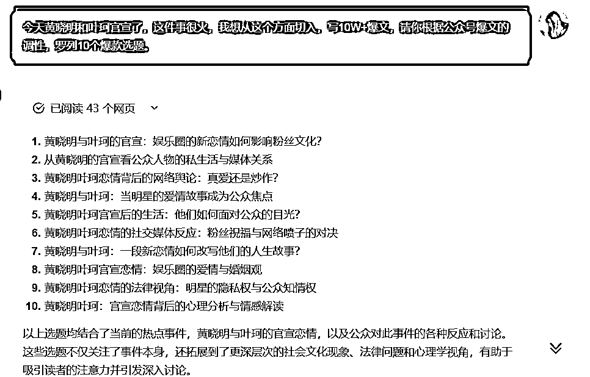
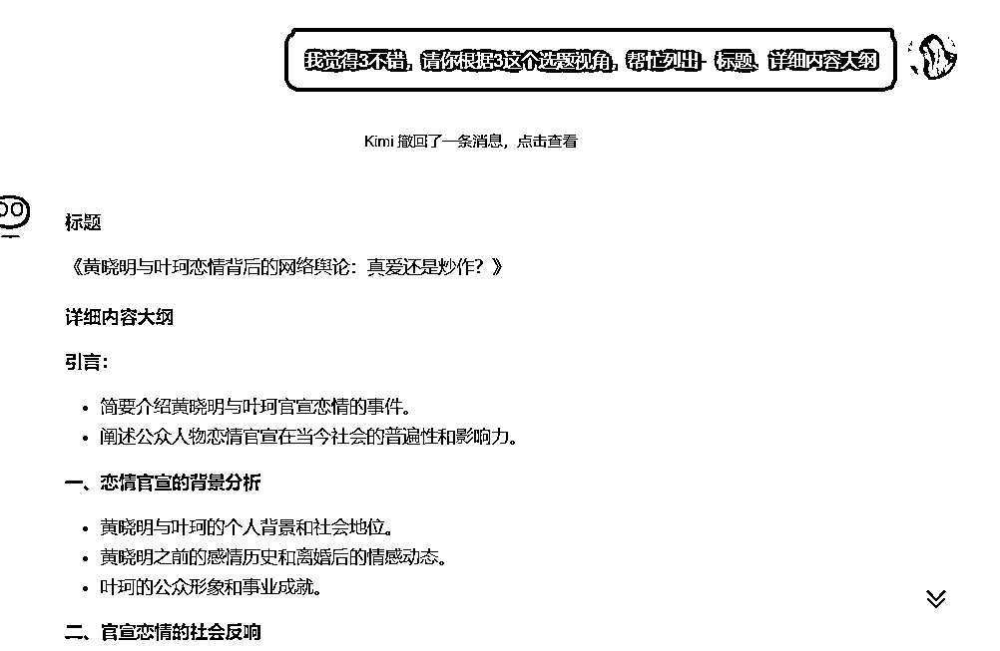
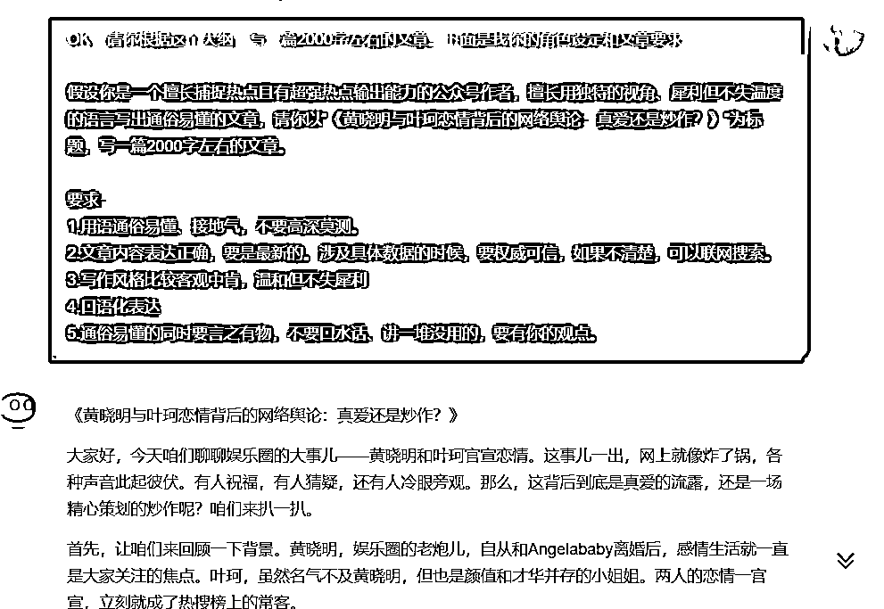
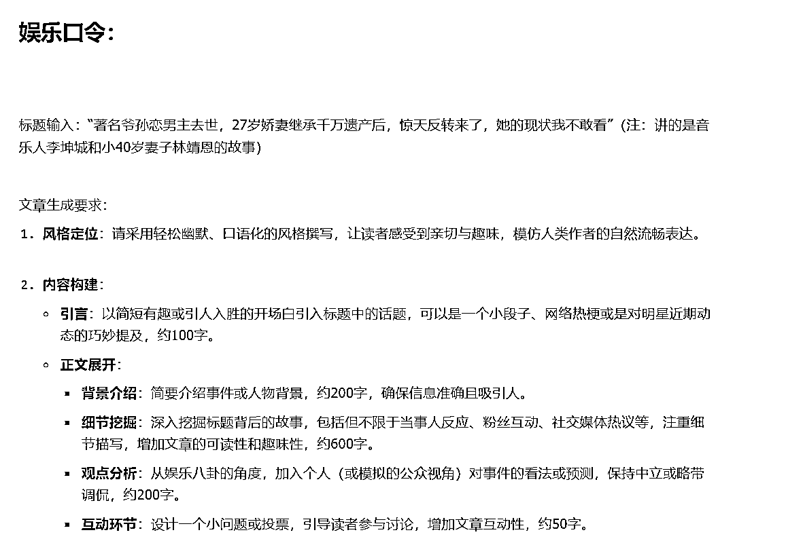
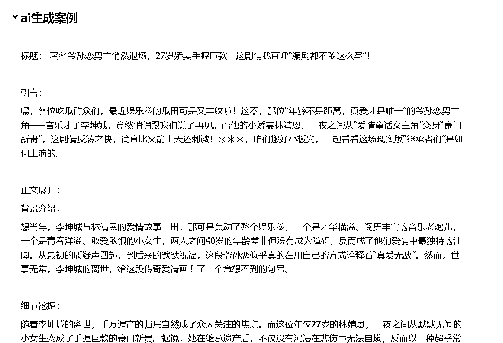

# 热点话题转瞬即逝，如何用AI快速产出抓人眼球的爆款文案？

> 来源：[https://die28mmde0k.feishu.cn/docx/VGoXdFXmooasHUxsZ0icAD2WnGe](https://die28mmde0k.feishu.cn/docx/VGoXdFXmooasHUxsZ0icAD2WnGe)

嗨，你好，我是安七。应届毕业生，1年双百万，主攻ai+写作。

9月19日下午2点多，黄晓明和叶珂官宣在一起，算是这两天娱乐八卦类的比较“突然”但又有点话题争议性的瓜了。

写热点、娱乐八卦类的伙伴，不要错过。

我用Kimi写了2个版本的，和生财圈友们分享下。

如果有要用到口令、发在其他平台的伙伴，也可以联系我，让我这个当事人去点点赞，哈哈

# 版本一：继续沿用我写的《黑神话：悟空》的套路：

# 一、让Kimi找选题

打开Kimi，输入这段文字：

今天黄晓明和叶珂官宣了，这件事很火，我想从这个方面切入，写10W+爆文，请你根据公众号爆文的调性，罗列10个爆款选题。

# 二、让Kimi生成大纲

从上面的选题中，选一个自己喜欢的，接下来就是让它帮忙生成大纲了：

下面是它的回复：

### 标题

《黄晓明与叶珂恋情背后的网络舆论：真爱还是炒作？》

### 详细内容大纲

引言：

*   简要介绍黄晓明与叶珂官宣恋情的事件。

*   阐述公众人物恋情官宣在当今社会的普遍性和影响力。

一、恋情官宣的背景分析

*   黄晓明与叶珂的个人背景和社会地位。

*   黄晓明之前的感情历史和离婚后的情感动态。

*   叶珂的公众形象和事业成就。

二、官宣恋情的社会反响

*   粉丝和公众的初步反应：祝福、惊讶、质疑。

*   媒体报道的角度和态度：正面报道、挖掘历史、猜测分析。

*   社交媒体上的讨论热点：正面支持与负面质疑的比例和内容分析。

三、网络舆论的多样性

*   真爱论：网友对黄晓明与叶珂恋情的正面评价和祝福。

*   炒作论：对恋情真实性的质疑和对可能的商业利益的猜测。

*   中立观点：观望态度和对两人未来恋情发展的预测。

四、案例分析：其他明星官宣恋情的网络反响

*   分析近一两年内其他明星官宣恋情的案例。

*   比较不同案例中网络舆论的异同。

五、公众人物恋情官宣的利弊分析

*   对明星个人品牌和形象的影响。

*   对粉丝情感的正面和负面影响。

*   媒体和公众对明星私生活的关注是否过度。

六、网络舆论对明星恋情的影响

*   网络舆论如何影响明星的恋情发展。

*   明星如何应对和利用网络舆论。

*   网络舆论对明星恋情的长期影响。

七、结论：

*   总结黄晓明与叶珂官宣恋情背后的网络舆论特点。

*   对公众人物恋情官宣现象的思考和展望。

结语：

*   对网络舆论在现代社会中作用的反思。

*   呼吁对公众人物私生活的尊重和理性看待。

通过这个内容大纲，文章将深入探讨黄晓明与叶珂官宣恋情背后的网络舆论，分析公众、媒体和粉丝的不同反应，以及这些反应如何影响明星的个人生活和公众形象。同时，文章也会探讨更广泛的社会文化现象，包括公众对明星私生活的关注和网络舆论的影响力。

# 三、让Kimi根据口令，生成原创文章

觉得大纲没问题后，可以让它直接根据大纲、要求生成文章。

下面是我的口令：

OK，请你根据这个大纲，写一篇2000字左右的文章。下面是我你的角色设定和文章要求：

假设你是一个擅长捕捉热点且有超强热点输出能力的公众号作者，擅长用独特的视角、犀利但不失温度的语言写出通俗易懂的文章，请你以“《黄晓明与叶珂恋情背后的网络舆论：真爱还是炒作？》”为标题，写一篇2000字左右的文章。

要求：

1.用语通俗易懂、接地气，不要高深莫测。

2.文章内容表达正确，要是最新的。涉及具体数据的时候，要权威可信，如果不清楚，可以联网搜索。

3.写作风格比较客观中肯，温和但不失犀利

4.口语化表达

5.通俗易懂的同时要言之有物，不要口水话、讲一堆没用的，要有你的观点。

初版：

《黄晓明与叶珂恋情背后的网络舆论：真爱还是炒作？》

大家好，今天咱们聊聊娱乐圈的大事儿——黄晓明和叶珂官宣恋情。这事儿一出，网上就像炸了锅，各种声音此起彼伏。有人祝福，有人猜疑，还有人冷眼旁观。那么，这背后到底是真爱的流露，还是一场精心策划的炒作呢？咱们来扒一扒。

首先，让咱们来回顾一下背景。黄晓明，娱乐圈的老炮儿，自从和Angelababy离婚后，感情生活就一直是大家关注的焦点。叶珂，虽然名气不及黄晓明，但也是颜值和才华并存的小姐姐。两人的恋情一官宣，立刻就成了热搜榜上的常客。

接下来，咱们看看官宣后的社会反响。粉丝们的反应可谓是五花八门，有的激动得像中了彩票，有的则是一脸懵，还有的则是默默送上祝福。媒体这边也是热闹非凡，有的媒体把两人的恋情夸得像童话故事，有的则是深挖两人的过往，试图找出一些蛛丝马迹。

但是，网络上的舆论可不是一边倒的。有人说这是真爱，毕竟黄晓明和叶珂的互动看起来甜蜜得很。但也有人说这是炒作，毕竟在这个流量为王的时代，明星的一举一动都可能成为炒作的素材。

那么，这些舆论背后，到底隐藏着什么呢？首先，咱们得承认，明星也是人，他们的感情生活也应该得到尊重。但是，作为公众人物，他们的行为往往会被放大解读。这就导致了一个问题：我们很难分辨，这些舆论到底是基于事实，还是被有意引导的结果。

咱们再来看看其他明星官宣恋情的案例。你会发现，每次有明星官宣恋情，网络上的舆论几乎都是两极分化。这说明啥？说明咱们吃瓜群众对于明星的恋情，总是充满了好奇和猜疑。

那么，明星官宣恋情到底有啥利弊呢？好处显而易见，可以增加曝光度，提升人气。但坏处也不少，一旦处理不好，就可能成为舆论的靶子，甚至影响到个人形象。

最后，咱们来聊聊网络舆论对明星恋情的影响。一方面，正面的舆论可以为恋情增色不少，让两人的感情更加稳固。但另一方面，负面的舆论也可能给恋情带来压力，甚至导致感情的破裂。

总的来说，黄晓明和叶珂的恋情官宣，无疑是娱乐圈的一大热点。但背后的网络舆论，却是一个复杂的社会现象。作为旁观者，我们应该保持理性，不要被舆论左右。毕竟，真爱也好，炒作也罢，最终的决定权还是在两位当事人手中。

好了，今天的话题就聊到这儿。对于黄晓明和叶珂的恋情，你怎么看？欢迎留言讨论。别忘了关注、点赞、转发，我们下期再见！

[注：本文为虚构内容，仅供参考。]

互动：看完版本1，满分10分，你觉得可以打多少分？

# 版本二：

结合我自用的AI口令（部分）丢给AI，让它帮忙写：

这是上篇文章，让AI写出来的部分效果展示：

现在我们让它来写黄晓明和叶珂的，看看效果如何：

《黄晓明与叶珂恋情背后的网络舆论：真爱还是炒作？》

哎呀，最近娱乐圈的大瓜真是一个接一个，吃得我都快变成“吃瓜群众”了。这不，黄晓明和叶珂的恋情官宣，又在网上掀起了一阵狂风暴雨。有人欢喜有人忧，有人祝福有人猜，这背后到底是真爱无敌，还是一场精心策划的炒作大戏？咱们今天就来扒一扒这背后的网络舆论。

首先，让我们来点个名，认识一下今天的两位主角。黄晓明，不用多说，娱乐圈的“老戏骨”，自从和Angelababy分道扬镳后，他的感情生活就成了大家茶余饭后的谈资。叶珂，虽然名气不及黄教主，但也是颜值在线，事业有成的女强人一枚。两人的恋情一曝光，立刻就成了热搜榜上的常客，这热度，比夏天的太阳还要炽热。

接下来，咱们得聊聊这官宣的细节。黄晓明在微博上的一句话“抱歉占用公共资源，大家别猜啦，我们在一起了”，简单直接，却又让人浮想联翩。叶珂随后的爱心回应，更是让这波狗粮撒得满地都是。但是，这甜蜜的背后，网友们的讨论却是五花八门。有的激动得像是自己中了彩票，有的则是一脸懵，还有的则是默默送上祝福。这场面，比过年还热闹。

但是，这背后的舆论可不是一边倒的。有人说这是真爱，毕竟黄晓明和叶珂的互动看起来甜蜜得很。但也有人说这是炒作，毕竟在这个流量为王的时代，明星的一举一动都可能成为炒作的素材。这不，有的网友已经开始猜测，这是不是为了某个新剧或者新节目预热呢？

那么，这些舆论背后，到底隐藏着什么呢？首先，咱们得承认，明星也是人，他们的感情生活也应该得到尊重。但是，作为公众人物，他们的行为往往会被放大解读。这就导致了一个问题：我们很难分辨，这些舆论到底是基于事实，还是被有意引导的结果。

咱们再来看看其他明星官宣恋情的案例。你会发现，每次有明星官宣恋情，网络上的舆论几乎都是两极分化。这说明啥？说明咱们吃瓜群众对于明星的恋情，总是充满了好奇和猜疑。

那么，明星官宣恋情到底有啥利弊呢？好处显而易见，可以增加曝光度，提升人气。但坏处也不少，一旦处理不好，就可能成为舆论的靶子，甚至影响到个人形象。

最后，咱们来聊聊网络舆论对明星恋情的影响。一方面，正面的舆论可以为恋情增色不少，让两人的感情更加稳固。但另一方面，负面的舆论也可能给恋情带来压力，甚至导致感情的破裂。

总的来说，黄晓明和叶珂的恋情官宣，无疑是娱乐圈的一大热点。但背后的网络舆论，却是一个复杂的社会现象。作为旁观者，我们应该保持理性，不要被舆论左右。毕竟，真爱也好，炒作也罢，最终的决定权还是在两位当事人手中。

好啦，今天的瓜就吃到这儿。对于黄晓明和叶珂的恋情，你怎么看？是真爱还是炒作？快来评论区留下你的看法，或者参与我们的投票，让我们一起见证这段恋情的发展！

在这个充满变数的娱乐圈，我们总是期待着更多的甜蜜和惊喜。不管未来如何，让我们都保持一颗祝福的心，希望黄晓明和叶珂能够幸福快乐。毕竟，爱情这东西，谁也说不准，不是吗？

[注：本文为虚构内容，仅供参考。]

效果好像也还可以，毕竟是AI生成的初版，没有经过人工润色。

互动：看完版本2，满分10分，你觉得可以打多少分？

# 四、温馨提示

AI写的，只能作为思路提供、初稿辅助哦，不能指望它写这1次，然后发公众号，问：这样写能有多少阅读量？

答：俺也不知道~

初衷是在生财和圈友们分享好玩的玩法，AI写文提效哈，不是直接给答案，赚钱归根到底还是自己的事哦。

# 五、其他系列

OK，文章写到这里也差不多结束啦，非常简单，大家也可以拿我这个先去试试，玩一玩。

这是ai公众号爆文系列的第5个系列，ai调教系列

其他4个系列：

【系列1：】

故事篇：我是如何链接贵人、找到AI公众号爆文方向的？

文章：

【系列2：】

战略篇：坦白局——公众号爆文还值得做吗？

文章（精华帖）：【坦白局】：毕业1年，通过公众号爆文项目赚到7位数，公众号爆文还值得做吗？

【系列3：】

数据篇：精华or水帖？用事实说话：04年大二助理，历时一年，从小白到平均3天一篇10w+爆文机……

文章：《精华or水帖？用事实说话：0...》

【系列4：】

领域推荐篇：24年8月，有什么还不错的小众领域？

文章：https://t.zsxq.com/p8XG3

还有什么想看的？欢迎评论区留言哦。

有收获的话，可以在星球帖子下点个赞，超过100赞放完整版口令，评论区自取~

我是安七，我们下期见~