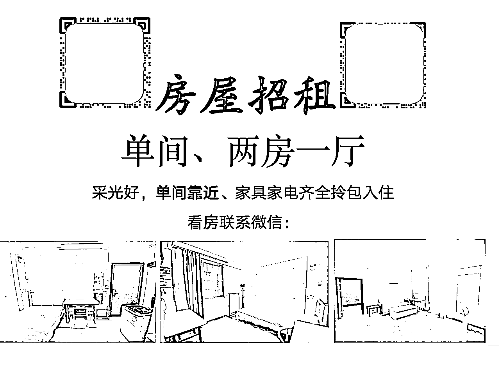
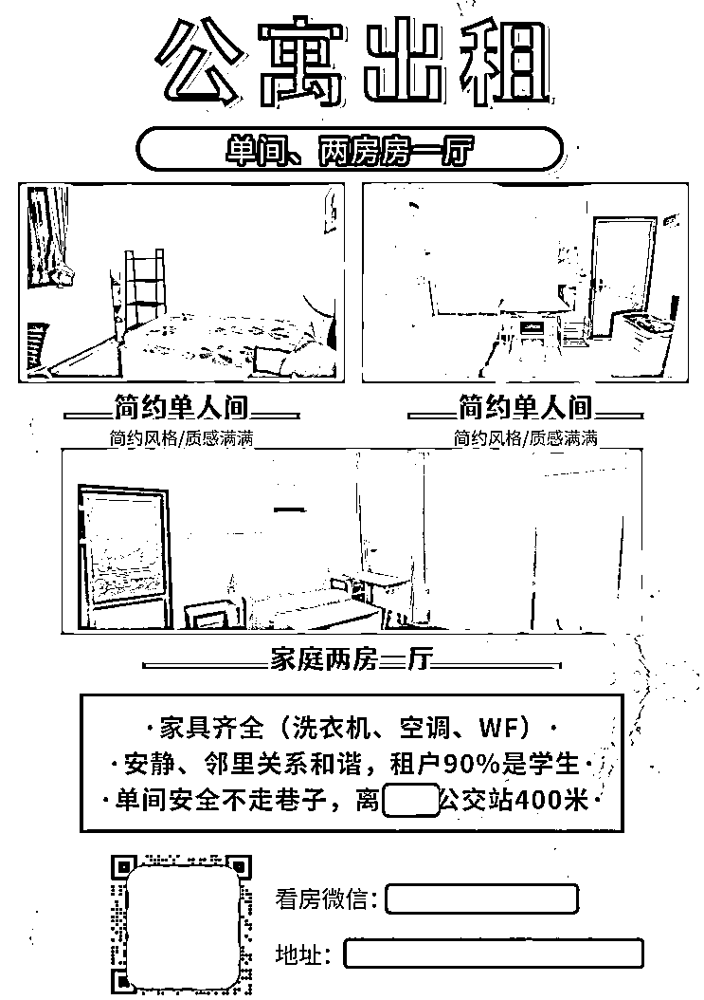
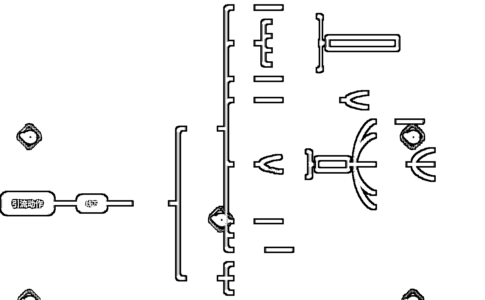
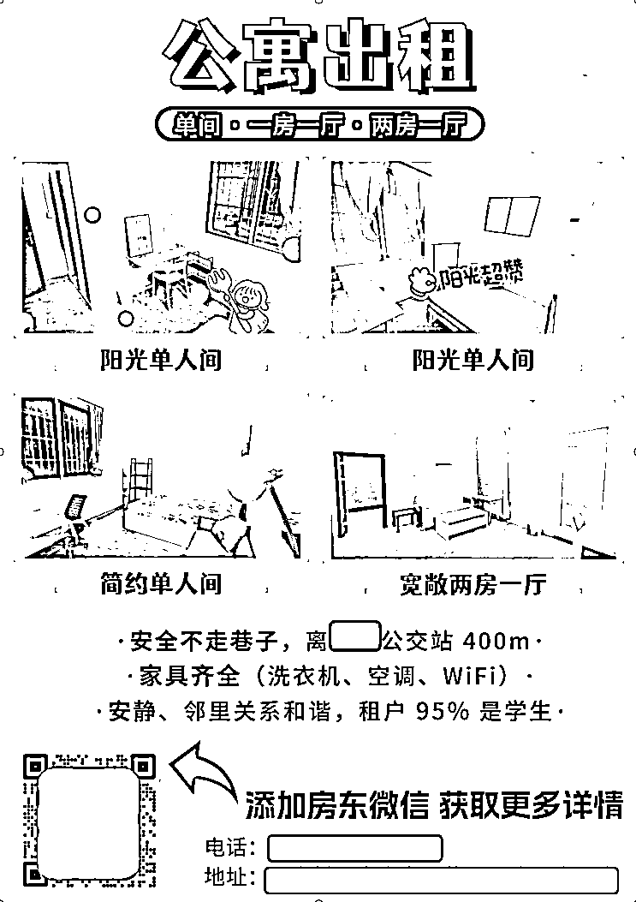
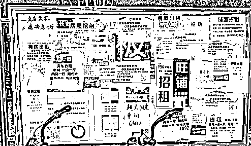
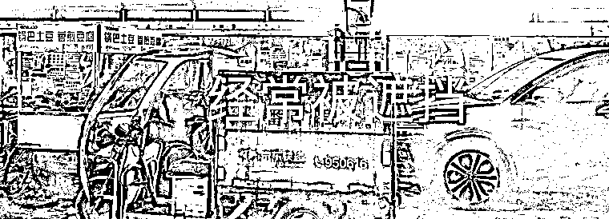
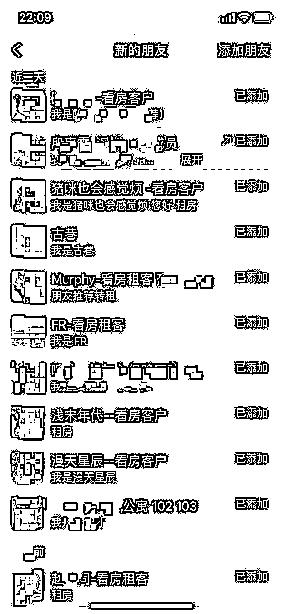
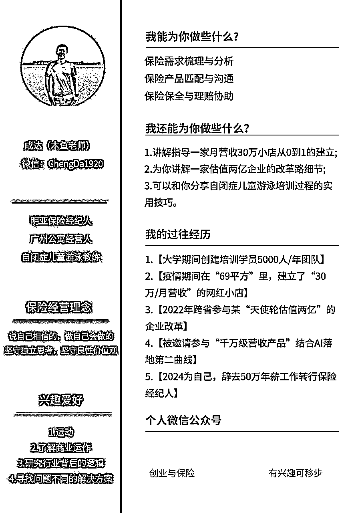

# 入局2个月的新手房东，如何利用一张海报破局，接管4栋公寓出租业务？

> 来源：[https://h24wtd3rug.feishu.cn/docx/WMRldysuVoMlSrxV0btcA4ygnKb](https://h24wtd3rug.feishu.cn/docx/WMRldysuVoMlSrxV0btcA4ygnKb)

## 背景介绍

大家好，简单的自我介绍

我是木鱼

标签：半佛保险经纪人|野生商业研究员|广州房东

2024年，因为家里的原因，辞去一份非常舒适的工作，回到了广州转化保险经纪人。

保险这个行业，我对它的判断是寿命是足够长的，但是入局后，预计会需要一个较长的煎熬期。

为此，我需要在把保险作为主业的基础上，搭建一个“副业”，作为自己基础的现金流。

恰逢一个机会，好友听闻我回来，邀请我一起合伙公寓项目。

我是一点点看到朋友从在几年内买车买房的，而且公寓越做越多（这个点让我失去了思考）。

其次，公寓项目很简单，如果不是做的特别大，管理也无需太多心神。

自己判断，公寓有“友人的经验+自身过往”的经验，大概率是没问题的。

所以没啥犹豫，直接入局。

但是入局后，接连2个月，我没有外租出一套房，而且后续发生了一连串的事件，让我一度怀疑自己决策的正确性。

## 接踵危机

### 1.考察不细，不达预期

自己承接这栋公寓，是以单间为主，老旧虽算不上，但整体来说一般。

自己早年也住过很长一段时间这类公寓，所以潜意识认为，该地区住房客户依然能接受。

可惜，现实大大的打了我的脸。

现在，大多数人对房子的品质要求越来越高，而且会细致到空调的能耗、冰箱等小家电的配置。

我还见过，有拿那些策风水的来查看房间方位的......

合伙人曾提醒，承接公寓后，最好装修一下，但我听完，本着什么客户都有（其实就想少花钱），开始对外放租。

结果看房的纷纷摇头不租。

这下我开始着急了，因为一天不把房子租出去，我一天就需要额外承担内在租金的压力，这对我的现金流非常不利。

为此，咬咬牙，按照合伙人的建议，进行房子装修，同时，让他提供流量给我，提升我的租客流量。

结果发现，踏完一个坑，结果另外一个坑又来了。

### 2.判断失误，助力不足

我原计划是依赖友人长期运营公寓的能力，为我在前期提供流量，然后后期我摸熟流量路径后，自己再来搭建自己的流量路径。

我让合伙人提供流量时，合伙人把我拉进了几个群，虽然上面有几百人，

但是！

这几个群，是过往积累的人，也就是85%是已经租到房子的，而且，里面还有几十位房东。

也就是，我一个新手房东，要在群内和几十位老房东抢夺不到5%的客源......

其次，合伙人突发事故，需要回老家，无法分神协助我，只能远程协助。

最后，也是最糟糕的，合伙人过往虽然在这个行业沉淀，但很多方法都比较传统，基本都是转介绍和贴海报，线上运营的手段几乎没有，而我最薄弱的一环也是线上流量的引入。

这个情况让我进一步陷入困局。

公寓接了，房间装修材料下单了，合伙人突发事件无法兼顾我，怎么办呢？

面对这种局面，我问了合伙人一个问题：

“如果我要把房子租出去，你认为最快最有效的方法是什么”？

合伙人回答：一遍装修房子，一遍去村内贴海报。

“贴海报有用？”我非常怀疑的问合伙人

“你信我，最快的方法，就是去贴海报”。合伙人在电话那头坚定的回答我

## 寻求突破

### 1.见步行步，死马照医

在当下这个困局，我不得不尝试合伙人的建议，跑去贴海报。

为了省钱，公寓在动工的同时，我也跟着装修。

我潜意识还是认为贴海报这个动作，不及把公寓装修好。

但合伙人的建议我不得不认真对待，然后让另外一位正在经营公寓的友人发我一份模版，直接模仿拷贝。

不得不说，当你内心对某事有排斥，确实做不好。

第一版海报做的很普通，普通到我现在回看，一度怀疑自己的智商。

有一说一，我的第一版海报，我认为还是比80%同行优秀的，大伙继续后看就清楚了。

匆匆忙忙做完海报，然后去张贴，继续回来装修我的公寓。

在公寓装修两周后，突然微信亮起一个小红点，我以为是保险客户，结果一开口，就是问我的公寓的事。

我一愣，赶紧应答，然后引流过来看房。

期间，公寓在装修，显得很脏乱，但是这个客户在看房时，对环境接受度非常高，直接开口问一楼价格。

可惜，因为价格原因，没有谈拢。

虽然没有谈拢，这件事让我留心了起来，因为他是我第一位自然流客户。

接着一周时间内，陆续有3位加了我微信，虽然都没成交，但是都是自然流客户。

为了确定这些客户来源，我私信了解，才发现，他们通通是看了海报过来的。

一张这么普通的海报，居然真有流量来，而且比我合伙人的转介绍还多。

我瞬间意识到合伙人说的话是真实的，直接放下手上装修工作，跑回电脑前，赶制一版新海报。

### 2.流量上升，走出阴霾

因为意识到海报的重要性，第二次设计海报时，严谨了很多

这张海报，我是套模版的，但是加入了我自己的一些思考

#### （1）提前验货

我发现，和我样招租的海报，99%都是文字，而且是那种红字黄底的海报。

一位找房客户，在这种海报上，除了“招租、联系人”等情况外，并没有太多信息。

我代入我是客户的角度：我是希望在看海报的时候，我就能知道大概房型，而不是在这大夏天，跑过去一身汗才发现房型不合适，整体体验非常差。

#### （2）解决顾虑

居住，其实不单考虑房型，还有很多维度的事情。

例如：家具、环境安静程度、租户的情况等

为此，我也提前写出来，帮助客户快速了解整体环境，那么到来的客户，会自行验证，甚至精准度会更高。

经过初步思考后，我更新了第二版海报，然后快速的去粘贴。

#### （3）彩色印刷

这点大伙可能看的好笑，彩色印刷也算是亮点吗？

是的，不要小看这一点，因为在我的竞争对手里，都是直接打印，基本1毛钱1张，但是彩印需要1元。而很多人没有意识到，房间感觉的传递，有了色彩会有巨大的差异。

第二版的海报，粘贴5天里流量翻了一番，来了约计9个看房客户，这时，我知道，我的海报是初步成功的了。

也是在这个9个流量里，我成功租出2套，这是距离我入局公寓，整整过去了2个多月

### 3.全力出击，使命必达

从第一版到第二版的海报，整体效果越来越好，加上公寓装修完毕，我内心冒出了一个想法“一个月内，把房间全外租”。

有了这个想法，就按耐不住了，看了看日子，画好记号后，我开始思考。

如果要全部外租，必定要加大流量，目前在我了解的工具里，线下海报是最好的，那线下海报还有优化空间吗？

重新拿过线下海报后，我进行了一下维度思考。

#### （1）海报的逻辑

海报上有多少信息呢？这些信息是如何影响客户的呢？我直接建立思维导图，进行全方位的分析。

从思维导图上看，我发现影响的转化因素非常多，所以的我海报还有很大的优化空间。

那第三版海报进行了哪些优化呢？

*   颜色

采用明黄色，这样在白天和夜晚，能更醒目

*   重点突出

客户关心很多信息，但第二版的关心信息里，还是多了，所以才去红色标注，让更关注的信息凸显，节约客户了解时间

*   图片风格化

这点是我拿给女性去看的，加了一些可爱的字体，整体房间图看起来更柔和。

*   引导加微

有个研究，加了动感标注的店招，能比没有加动感店招的门店提升30%的进店率，所以我才去了这个方法，增加了明确指引的动感标注

*   黄色腰封

这是借助华与华卖书的方法，加了腰封，能最大限度吸引客户拿起观看，从而赢得更多的售卖。

#### （2）客户的动线

现场有神明，这是我非常喜欢的一句话。

那么，在我粘贴线下海报我到底可以做些什么来增大我的转化率呢？

在我走访这些海报张贴栏的时候，发现几个问题

*   海报栏版面大小不一

*   海报栏在晚上的时候，有些区域非常黑暗

*   海报栏会被经常清理、覆盖

*   海报栏会时候有异物遮挡

发现这些问题后，我采取以下方法

*   面对黑暗区域

我采取现场位置抢占，把自己的海报贴在最靠近光源的地方，那么在晚上的时候，客户都很有较清晰的光线查看海报

*   面对经常被清理和覆盖

我采取天天张贴，因为我无法阻止别人对我的清理和覆盖，但是我可以让自己每天都进行更新

*   面对被遮挡

我采取高贴抢占，也就是在尽量搞得地方也露出，起码有异物遮挡，自身的海报也能比别的海报多露出一些。

在以上方法上，我还增加了以下策略

*   狂增数量

信号越大，信息越大，海报栏虽然只有那么一点位置，但是如果我的海报在上面出现多张，那么集合在一起，就是一张超大海报，让我的海报信号比别人更大

*   主动联合

我发现，租客会偶尔提起一房一厅，但这些房源我是暂时没有的，那怎么办？

我立即联系友人，把他的房源信息拿来，然后放到海报上，增大流量入口。

做完这一切，意外惊喜来了。

原定的一个月内对外出租外所有公寓，结果不到2周，全部出租完毕，最夸张的是，在两天内，我成功外租了12间房。

## 复盘总结

事后复盘，我为什么能在这么短时间内对外完租呢？

我觉得可能有几个原因：

### 1.外界流量上涨

不可否认，相较于两个月前，当时的时间节点上，流量是过往的几倍。

### 2.真正的尊重现实

虽然合伙人告诉我海报有用，但一开始我是不相信的，直到去测试了才知道真实性。

所以这件事告诉我，不要小看任何一种方式，去了解去尝试，有了测试再给结论。

### 3.过往对商业拆解的积累

以上的一套方法，是我过往的方法论，所以在拆解上，我天然有些优势，能拆解的更细致。

### 4.海报确实有效

### 5.同行的竞争意识相对薄弱

## 再次出发

在2周内把公寓全部外租后，我的合伙人也惊呆了，想不到我一个新手居然能这么快完成从零到一的闭环。

所以一个月后，因为他个人原因，估计较长一段时间无法兼顾自身公寓，就委托我帮管手上的4栋公寓，帮忙完成招租。

那么效果如何？

给大伙看看我最近几天的流量截图，而且现阶段只有早前热度的6分1，但我的流量比早前更多更旺。

以上就是一个新手房东，入局2个月，在没出租一套房的情况下，怎么用一张1元的海报突破困局，最后接管4栋公寓的部分操作。

当然，里面还有一些关于合作、客户线上线下转化的动作与合伙人对我的支持没写，但在我的角度，这张海报的会在我内心比较特殊，因为它既是流量的起源也是让我意识到商业逻辑遵从现实的实际案例。

文末，放上我个人的过往的经历和可以提供的一些帮助，期待相互交流

具体分享到这，希望对大伙有所帮助，也祝愿看到这篇文的朋友，天天有才，年年发财！😊