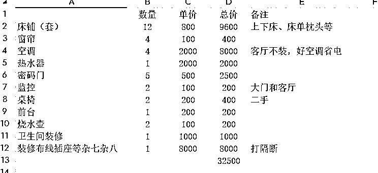
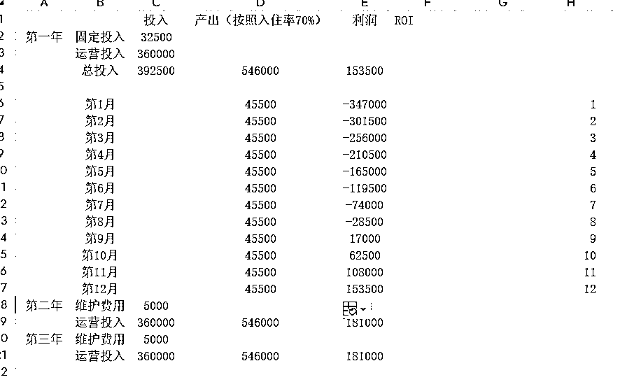

# 如何7天快速调研一个行业，判断是否要入局

> 来源：[https://twi95yz4yg4.feishu.cn/docx/YF3ZdVO4SojuOFxgc7ocOGNUnsc](https://twi95yz4yg4.feishu.cn/docx/YF3ZdVO4SojuOFxgc7ocOGNUnsc)

# 为什么要做调研

很多人执行力较强的朋友，习惯看到一个机会就allin。不可否认执行力强是个优点，但是更不可否认的是选择比努力更重要。对于一些线上小成本投入的项目，边做边调研是一点问题都没有。但对于线下、有资金投入或者大量时间投入的项目，强烈建议大家一定要调研、测试和计算。尤其现在的年景，融资的钱不那么的好拿，你更不能烧自己的钱，拿回来一些行业常识。也不要用身体上的勤奋，掩盖战术上的懒惰。

# 调研过程

## 项目背景

23年的时候，身边一个新入职的同事，说自己刚来北京，住在青旅，很喜欢青旅文化（在北京五道口附近，靠近高校），同时，一周的入住时间结实了很多有意思的人。因为习惯平日聊天过程中就下意识计算下一个某个生意模式赚多少钱。我就随口问了下同事，一个房间住几个人，收费多少。同事给我的数字是，"8人的房间、基本都能住满、一个晚上130元”，我算了一下，这个日均客单价要比当二房东赚钱多了。 正好没有做过线下，很感兴趣，于是开始了我的青旅调研之路。

## 调研步骤

### Step1 明确调研目的

我习惯做任何的事情前，先明确一下目的，调研也是同样。

这个项目你能够到的利润和你入局的预期是否一致？你做一个项目是想满足日常收入，还是走资本路线融资上市。这两个方向的调研视角肯定不同。

调研阶段性目的也会不同。如果第一阶段的目的是：做or不做。那选址具体在哪个区、上哪些运营渠道（美团、携程、飞猪等）、怎么样的装修风格，就不太是第一阶段的重点。

我当时没有说想要做品牌加盟，就单纯把“青旅要不要做？能否通过多店运营的方式，在相对轻松的情况下，年入大几十万”，作为第一个阶段调研目的，通过计算ROI看下是否要入局，落脚点在于轻松经营。如果能做，再去进行第二个阶段的调研，比如选址等。

### Step2 了解行业基本常识

我回顾了一下过往的调研经历，有时候会陷入沉迷细节的误区。都调研到笔记怎么发了、营业执照也下来了，突然某一天发现这个行业有一个卡点，需要很费劲才能绕过去。那绕过去需要耗费多大的成本？目前的人力物力能不能解决都是问题。因此我把“了解行业基本常识”，放在了第一步，也希望大家低头行走的时候，记得抬头看看。

这一步的解决方案是：咨询专家（媒体渠道、朋友介绍、脉脉等）> 搜索（百度、生财，行研报告）> 自主调研。顺序是正相反，起码了解一些行业知识再向行业大佬提问。

我总结了一些常见的、入行前要了解的行业基本知识。欢迎大家一起补充。

1.  行业入驻资格、资质，以及所需成本，是否成为卡点：比如某一个行业重度依赖本地关系、政府关系，没有的话就很难入局。

1.  行业周期：这个行业处在一个上升期还是稳定期还是夕阳期，当然要选择一个起码稳定最好上升的行业。

1.  行业头部：这个行业以及相关产业行业（比如青旅、民宿、商旅酒店）天花板多高。有没有头部（线上、线下），头部卷不卷，竞品都有谁，有多少，还有没有机会。比如要做学科培训赛道，假设获客成本是60一个，可以拼一下，那如果是200一个，300一个，且头部都在卷，那要怎么拼能拼得过？有什么核心优势？这个也和Step1的目标相关，是在这个行业里面混口饭吃还是要做大。

1.  行业基本商业常识：主要商业模式（是做直营、还是加盟、还是培训）、毛利率能到多少、一条客资、线索多少钱。这个是最起码要知道的。

1.  行业壁垒：比如做二奢，鉴定、估价、起盘资金（实体、货）都是这个行业的前期壁垒。那绕过去需要投入多少精力需要考虑

### Step3 调研利润 — 直驱主题

对于常规的行业，从大方向上去分类，不外乎两种：市面上有的、市面上没有的（模式创新等）。两者的调研路径自然也有不同，我是没做过市面上没有的生意，所以针对青旅这种普遍存在的生意，相对调研就容易。

我当时采取的方法是实际体验对标青旅，直接入住，和同事一起去她租住的青旅，观察入住率、和小哥唠嗑，观察用户画像、成本等。（事实证明非常有效，很多成本消耗是很难拍脑门想出来的。尤其对于一个没有做过线下的小白）

说起来调研，很多人觉得无从下手，调研过程中也会遇到很多项目卡点，没关系，先收集再整理，我习惯性先拍脑门，想出一堆问题让我很痛苦，然后再通过收入公式去调整调研事项优先级。

比如，青旅的最基本的收入公式 = 床位数 x 入住率

因为青旅的床位数是固定的，那很容易看到，影响收入最关键的一个数字，就是入住率。入住率与运营能力、选址等强关联，但是这不是第一阶段的重点。那我第一阶段最需要拿到的一个数字是入住率多少不亏钱。我不知道它有没有一个专业名词，暂时叫他“不亏钱入住率”。

#### 入住率（不亏钱入住率）

这个数字的来源我通过自我推导和咨询的方式作为互相验证：

*   通过咨询行业里面的人，是很容易拿到的数字，大约在50%~60%之间。

*   计算单月成本、满入住的收入，来计算“不亏钱入住率”，拿到的数字是：46%。计算过程如下：

*   单月成本 = 房租+物料（床单换洗、水电，网费等）+运营成本+人工 = 20000（北京五道口某小区）+ 2000~3000+暂不明 + 6000 = 约30000/月 （以上计算相对粗略）

*   满房的收入=4个房间x 6个床位（平均）x 120元/日（平均客单价，先忽略装修风格对价格的影响）x 0.95客损（退款、差评协商、投诉等）× 0.8（按平台抽成12%~20%估算）≈ 6.5W/月，先不算报税，平台挂靠会给上税

*   常识1：青旅一般是男、女房间分开住，因此容易存在空床率

*   常识2：行业存在淡旺季，入住率会浮动

*   常识3：行业存在2人较高档房间、8人经济型大房间。那么也可以把房子打了，做比如40个床位，每一个收70。其实算下来差不多，所以粗暴的取了平均客单价和平均房间数。

*   常识4：我计算的数字偏低，通过观察和交流得知，青旅这边存在一些包月、长期住的业务，实际利润就会更低。另外人工这一块还有一部分保洁成本，我一开始也没有计算在内。

#### 利润

有了这个值以后，我还要去计算，平均入住率70%、90%的时候，我的利润是多少。

运营情况良好90%利润情况 = 65000 x 0.9 - 30000 = 28500/月

运营情况普通70%利润情况 = 65000 x 0.7 - 30000 = 15500/月

有没有心凉了一截，感觉还不如上班，哈哈。这里的成本还不算固定投入成本，接下来把成本具体细化一下

#### 成本

粗粗提炼的成本计算公式：

*   单店的成本最基本模型

= 一次性投入+ 每年投入

= 装修（基本装修打隔断）+ 物料 +房租+运营成本+ 人工

*   其中一次性投入约3w，有一些忘记计算在内，比如洗衣机等，实际成本3~5w，取小值计算先，如下图1

#### 投入产出测算

大概看一下，第一年投入40W，房租是大头，理想运营情况下第9个月回本，利润小15万/年/店。

#### 结论

1.  能不能赚钱呢。能赚。但对比预期，要想在北京通过开青旅做到大几十万的利润，至少要铺4家店，且在现金流充裕的情况下，不然利润都不够交下一年房租。（可能上述算账过程中，有很多ROI优化空间，但不太影响最终的一个结果，因为成本部分也有很多地方没有细算），而4~5家店的运营成本和单独一家店是完全没法比较的。

1.  能否作为副业轻松赚呢？个人觉得也不太能。根据调研来的行业常识，可以看到青旅行业存在的风险和隐性成本如下：

1.  消防：因为北京这边很多青旅是开在小区里面，但是小区民用住宅就办不了消防，如果上面来查就很麻烦

1.  邻居举报：谁也不愿意自己家旁边的住户人来人往的，所以这块肯定要在做之前就打点好关系。不然邻居举报，一举报一个准。比如下面：

1.  合同要签长期最少5年，不然装修一次性投入都会打水漂

1.  服务行业的糟心问题，通过和同行交流，有遇到客人投诉有蟑螂的、得皮肤病的、乱丢东西的、还有对吸烟问题的管理等等吧。一个没有多少耐心的e人，听到这基本要炸了。那本身青旅服务的是预算不充裕的客人，当然这个就涉及用户画像了，不是本期重点的探讨

#### 遗留的思考

其实前期阶段的调研远远不够细致，一些用户画像、做男客好还是女客好、什么定位，这些都没有去深入研究。很多时候机会，往往在细节里。但实体对我来说，还是有点重，所以这里也抛一些问题，感兴趣的大家可以一起讨论~

1.  一线城市房租较高，那到其他下沉城市会不会有机会呢？

1.  青旅涉及住宿，如果做成自习室模式，在运营管理方面会不会轻松一些。且收益情况也会更好呢？

1.  问题2也引发了我的思考，同一个地段的房，做什么模式的利润会更高？

1.  是否可以增加其他的盈利模式，比如社群、青旅+自习室？

## 调研公式总结

写到这里，我也算是提炼了下个人的一个调研模型。大致考虑是分两个阶段：前期阶段、入局阶段。

【前期阶段】= 明确调研目的+扫清行业常识+调研利润和成本 = 要不要做

采用的调研方法，主要是：实际体验、咨询行业大佬、混迹行业群看老板们日常讨论的问题（他们日常讨论的，基本就是我日后做的话，很容易面对的）

【入局阶段】= 还没开始提炼，因为青旅没有实操，如果大家对这个话题感兴趣，后面我可以拿一个实操过的项目来写下入局阶段的调研情况。大概思路就是：用户需求、用户画像、商业模式、选址、运营这些吧，一起围绕需求，一切围绕利润，一切围绕增长。

Cheers!