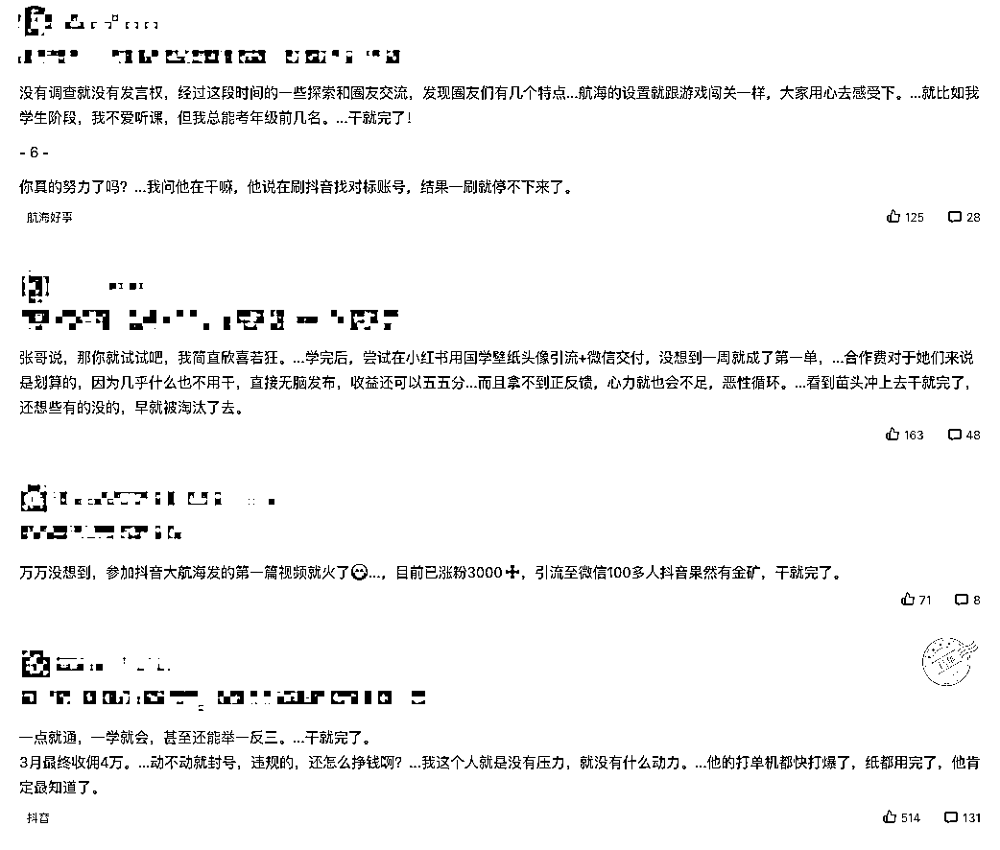
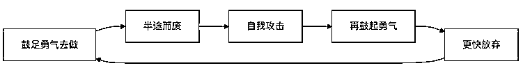
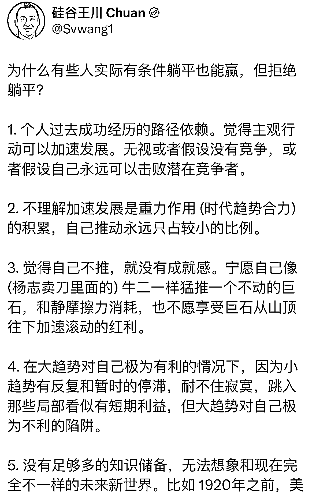
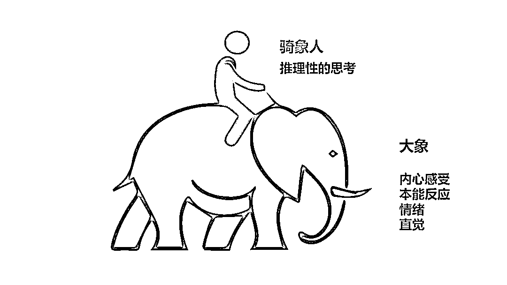
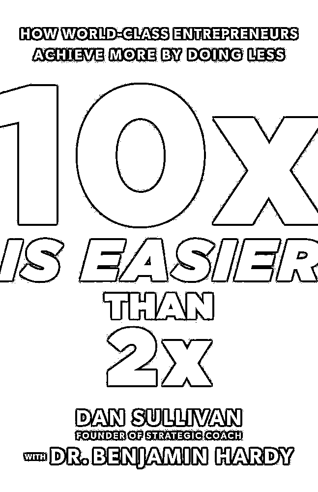
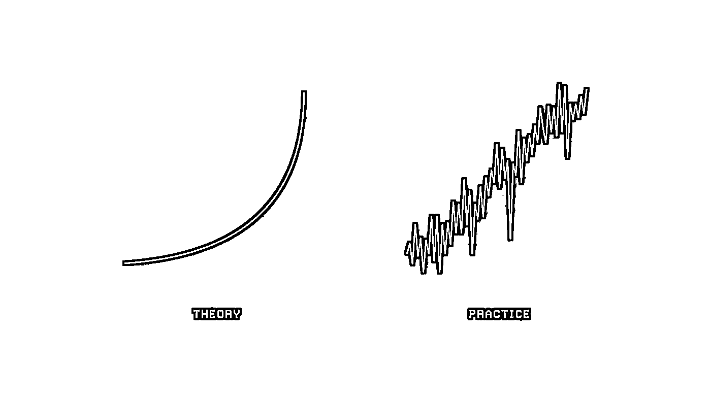
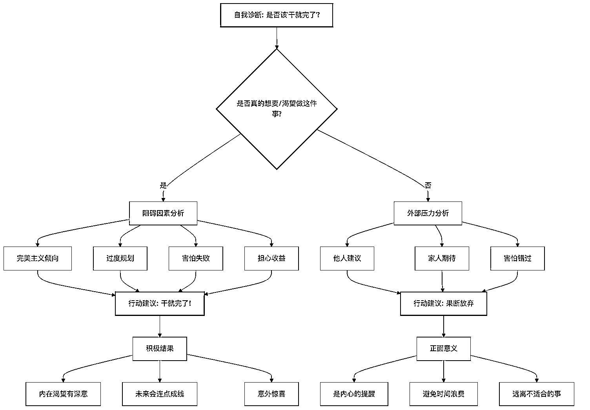
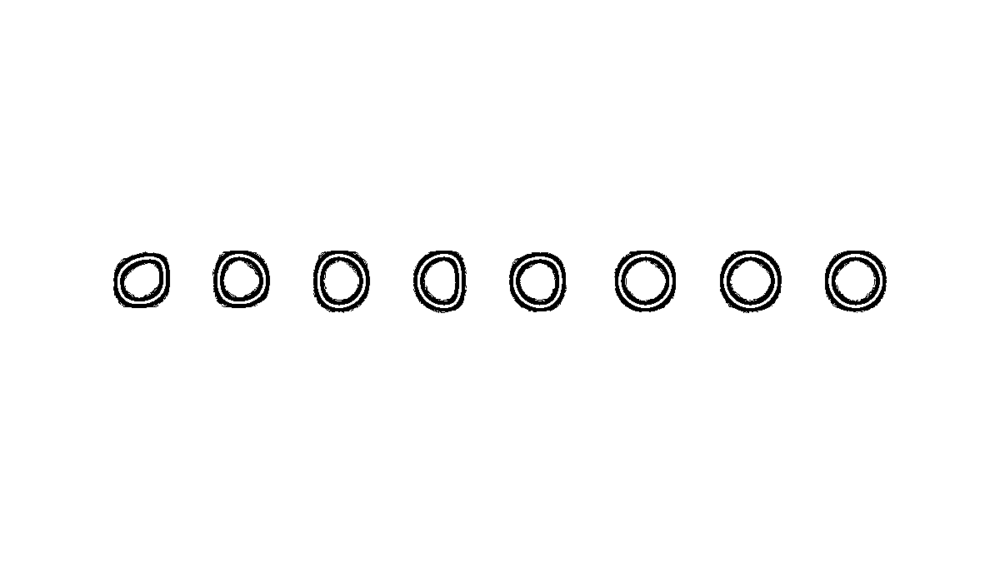

# 从厌恶到领悟： 写给被「干就完了」折磨内耗的你

> 原文：[`www.yuque.com/for_lazy/zhoubao/geb87wfroh0hl4xx`](https://www.yuque.com/for_lazy/zhoubao/geb87wfroh0hl4xx)

## (精华帖)(211 赞)从厌恶到领悟： 写给被「干就完了」折磨内耗的你

作者： 克寒-深度渴望教练

日期：2024-10-22

**加入生财后，你是否曾经有过这样的感受或经历：**

1.  面对扑面而来的**海量赚钱信息** ，在刚开始的兴奋劲过后，感觉到的是**持续的压力、焦虑和迷茫**

2.  **感觉圈友个个卧虎藏龙** ，这个操盘千万项目，那个上大学时已赚到百万……感觉自己做的事情、取得的成果完全拿不出手，**有种处处不如人的心虚感，甚至还自我攻击** ：我都 XX 岁了还没 XX，我怎么这么失败！

3.  加入生财好几年了，但**一直都在潜水观望，从未真正下场做过项目、赚过钱** 。有时候看到别人赚到了，也开始着急，但还是不知道具体要干什么、怎么干。

4.  每次航海实战开始，都会**一口气报好几个，坚持打卡不到一周后 abandon** ，最终一条船都没靠岸

5.  面对那些整理好的、「只要听话照做就能赚钱」的项目，依然还是**犹豫不决，迟迟无法开始行动**

6.  **……**

**  **

**如果你有以上任何一种感受，请放心，你不是一个人！** 作为一个 3 年多的圈友，这些感受我都曾亲身经历过。

**  **

**而且我注意到，当我试图表达这些感受、困惑时，最常听到的建议往往是：「别多想，干就完了！」**

**  **

这句话在生财出现的频率极高，我甚至觉得它有潜力替代「谈钱不伤感情」，成为生财的 slogan。

「干就完了」搜索结果的部分截图 _

**我不知道你听了这句话作何感受，但我一度很排斥厌恶。**

放在两年前，谁要是给我这样的建议，我会默认对方在敷衍我，或者他实际没办法但又不想承认。

我会忍不住在心中反驳：我要能做到还用你说！？

但我这种状态在最近两年发生了改变。

**我开始意识到之前的厌恶只是我内在的投射，也意识到「干就完了」是一剂猛药，对某些人来说是催命毒药，但对另一些人却是救命良药。**

**而区分这剂药是良药还是毒药的关键，往往就藏在我们内心最容易忽视的地方。**

这样的改变是如何发生的呢？

接下来，我会分享下这期间的心路历程，希望能给有过类似感受的你带来一些启发。

* * *

## 「干就完了」不是万能药

**其实刚开始听到「别多想，干就完了」时，我有当头棒喝之感，我会觉得：**

> 对啊，我想这么多干嘛啊，这么矫情干嘛啊，拿到结果不是靠想，而是靠干的啊。
> 
> 那就别磨叽了，直接去行动吧。然后就卯着一股劲去跟着做项目了，自媒体 IP、抖音……

但是这股劲很快用完了，用完了之后就又干不动了。

这时候我就会自我攻击：

> 你事怎么这么多？人家怎么就能干出来的，还是你自己的问题。

**于是陷入一个僵局：鼓足勇气去做——半途而废——自我攻击——再鼓起勇气——更快放弃……**

**  **

一个死循环 _

**  **

但是后来我发现不对劲了：

> 如果「干就完了」总是让我陷入僵局，那会不会不是我的问题，而是这句话有问题？

当我静下心来一想，发现问题还真不少。

那接下来我们就一起来看看，**这个简单的建议里，究竟隐藏着哪些值得我们警惕的问题。**

### **1.回避了真正的问题**

如果你仔细一想，会发现这个建议很荒谬：

我的问题就是我干不动，对方回答说，那你去干就好。

但你建议的正好就是我做不到的啊！

**就像你被失眠折磨了好久，迫不得已去看医生，然后医生啥药也没给你开，就跟你说，你好好睡觉。**

这时候你难道不想抽这个医生两个嘴巴子吗？

更有问题的是，**「干就完了」开始变成一些人的下意识反应** ：

> 自己没动力了，别多想，干就完了；
> 
> 别人遇到了问题，别多想，干就完了；
> 
> ……

当具体问题的分析被忽略，只剩复读机一样的回答时，真正有困扰的人会感到一种窒息和孤独感。

**因为自己鲜活真切的问题就在那，但似乎被所有人无视了。**

**  **

### **2.只看到了事情，而忽视了人的不同**

生财里有很多老板行动力极强，有想法就直接去做，这种人（典型如 ENTJ/INTJ/ESTJ/ISTJ_）在我看来是有「福报之人」，他们往往也从生财中受益最大。

这类人是很适合「干就完了」的。

**但除此之外，还有很多人（典型如 ENFP/INFP/INFJ 等）_
并不是有想法就直接去做的，在做之前会想很多，也经常有内耗。** images.zsxq.com/FvFnGdXvHsx2W_jcsRbXelIRZ5FT)

INFJ 的梗图（图片来自网络）_

_

我自己就属于此类。

如果我去做一件事情，我需要时间去思考、去酝酿，需要看到这件事情对我的价值和意义，才会发自内心去做一件事情。只是赚钱本身，并不足以构成我去做某件事情的充分理由。

对于我这类人，你跟说「别多想，干就完了」是不行的。我需要知道干的目的、意义、价值在哪里，这个是不是我真的需要的……解决了这些，才到了干的环节。

即使做同一件事情，人不一样，做的方式也会不一样。

**我们都不是机器人，不能用同一种方式来对待所有人。**

### **3.忽视了机会成本，违背了 10x 思维**

做事情都是有机会时间成本的，你投入时间精力去做事情 A，那你会失去了做事情 B/C/D 的机会。

但同样的投入，做不同事情带来的效果或收益是很不同的。

**「干就完了」是对时间精力不加筛选的投入，这显然是违背 10x 思维。**

10x 是持续对自己的投入做筛选，不断澄清属于自己的核心价值，要做的核心工作是什么，除此之外，都尽量不做或者外包给他人。

甚至按照王川老师所说：

> 技术进步如此之快，以至于现在最佳的策略，恐怕默认是以「躺平，养好身体，等待」为主。否则你拼死拼活积攒的那点资源，很可能过几年,
> 就因为技术因素而一钱不值，但你的健康则是切切实实损失掉了。

王川老师关于躺平的一条分享 _

**随随便便的干就完了，折腾越多，可能死得越快。**

**  **

### **4.容易只重视外在可见的进步，而忽略了内在不可见的进步**

**  **

一天做了几件事情，这是一眼可见的、可衡量的结果，这会给人带来一种安全感和掌控感：嗯，你看我今天确实的行动，我确实有进步。

我们是容易沉迷于此的。

但与之相对应的，是不可见的、难衡量的结果，比如说我比去年更加诚实、更加勇敢了。

这个你能感觉到，但很难量化，更难以向别人展示。

所以有时候这种内在的提升就容易被忽略。

但这个反而更重要。

同样的项目，差不多的能力，别人能做起来，而你做不起来，很重要的差距就在内在上，而不是具体的技巧和方法。**  ** images.zsxq.com/Fgy9hN5fmENLUtgUSq4b5ozzWL3s)拿到结果的三个层次，越往上越是不可见的（图片来自 Jack
Butcher）_

**  **

**干就完了是忽略了不可见的庞大世界，只肯定可见的有限世界。这属于舍本逐末。**

* * *

## 「干就完了」可以是一剂良药

上面吐槽了这么多，你是不是也开始觉得我说得有道理了，「干就完了」是真不能信。

但如果这篇文章只是停在这里，那它不过是又一篇以偏概全、宣泄情绪、制造对立的文章。

**  **

**所以我接下来就会讲到，在最近两年，我是如何重新认识了「干就完了」这句话的含金量和威力。**

在这个过程中，我也进一步认识到真实世界的复杂之处。

最近我上了一个《戏剧与内在转化》的课程，跟讲很多概念、理论、方法的传统课程不一样，老师这些都不讲，直接演示要做的动作或游戏，然后就让我们直接去做了。

我刚开始很不适应，但是过了一阵子就会发现：有时候不需要提前知道那么多，在做动作的过程中我自然就会有体验，有感受，就会知道怎么做了。

比如说，课程上有一个抛接球的游戏，因为球体积小，不容易接到，刚开始玩时还挺有压力的。这份压力就来自于大脑，来自于思考。但是当我玩着玩着，把注意力都专注到球上，把大脑的思考放下时，抛球和接球就变得很顺畅和自然。

**我的身体很清楚如何做，但大脑的思考常常会让我忘掉这点。**

**  **

关于大脑与身体的关系的一个经典隐喻：象与骑象人（图片来自壹心理）_

**这个经历让我明白一个道理：**

在某些领域，思考反而会阻碍我们感知事物的本质。就像开车时，如果过分思考每个动作的细节，反而会影响我们的自然反应。

**这正是「干就完了」在特定情况下能发挥奇效的科学原理：它帮助我们跳过大脑的过度干预，直接进入身体的自然学习状态。**

**  **

其实你也肯定有过类似的经历。

还记得小时候背唐诗宋词吗？你当时理解所背诗词的含义吗？其实并不理解。

但你听老师的话，直接硬背了下来。

刚开始可能没什么，但当背诵的诗词量突破某个临界点时，你突然发现，自己好像能感知到这些千百年前的古人真正在表达什么的思绪，传递怎样的意境了。你甚至可以自己写诗作词了。

**这就是「别多想，干就完了」。**

**有些经验、有些真相难以言说，非经亲身体会，很难真正理解。**

**此时，「干就完了」所起的作用，就是让我们快速跨过初期积累，跨越临界点，让我们理解自己真正在做的事情是什么。**

**  ** images.zsxq.com/Fp59Hux6JZPw_8blM76g0GAugAw_)很多投入开始时看起来毫无意义，但跨越临界后，一起不一样了（图片来自 Jack
Butcher）_

**  **

**再举两个我自己的例子。**

**  **

**一个是关于写作的。**

**  **

我很喜欢写作，但写作一度让我非常痛苦。

当时，我总是试图在动笔之前先想清楚，梳理一个详细的大纲，然后按照大纲去写文章。

但这样的方法从未奏效，给我带了的是纠结、痛苦和无助，我甚至因此放弃了喜爱的编辑岗位。

我是近两年才意识到，正是动笔写作的过程中，思路才变清晰的，我不可能在动笔之前想清楚一切。

所以现在我写作的方式是，有了灵感直接开始写，直接把脑海中冒出的想法不加修饰地写下来，让自己的手不要停，只要持续不断写，出乎意料的文字就自然流淌出来。

等写完了，当你回看写出的文章时，我常常会感慨：「这竟然是我写出来的？！」。

这是「干就完了」的魅力。

**再有就是我学英语。**

**  **

23 年 7 月，我从王川老师那发现了《10x is easier than 2x》这本书，那时候只有英文版。

《10x is easier than 2x》英文版封面 _

_

我的英文一般，看英文长文都吃力，别说看整本书了。

但当时的中文翻译版太差了，我又特别想看这本书，所以我就索性不管了，直接一字一句硬啃英文原版。

刚开始确实很吃力，但看着看着就顺了，花了 2 周多就读完了。

读完之后我感觉整个人不一样了，除了书本身思想带来的震撼，还有一个是：从此，阅读英文书籍对我来说不是困难了。我直到今天，依然保持了阅读英文书籍的习惯。

**这件事让我明白一个道理：很多东西不需要准备、不需要学习，直接上手用、直接做，过程中缺啥补啥，反而是最快的。**

**  **

**这就是「干就完了」的力量。它让我们突破自己的限制，发现未知的可能。**

那举了这么多例子，**如果总结下，「干就完了」的含金量在哪里呢？**

### **

**

### **1.遵循了人类最自然、高效的学习方式**

婴儿是如何学会说话，如何学会走路的呢？

通过观察和模仿，直接去练习说和走。

传统工匠的老师傅是如何教徒弟的呢？

老师傅教徒弟也是，先练十年基本功再说。

**  **

**从模仿开始，直接去做，然后基于反馈调整，这是我们人类最擅长的学习方式，只不过在当前的学校教育中，我们自然的学习过程被人为割裂，知识和实践之间有了一条鸿沟。**

而这种习惯变得根深蒂固，在我们即使已经脱离了学校环境后，依然在影响着我们。我们总觉得要先准备好，先学习好，然后再去实践。

**  **

**「干就完了」在这个意义上，其实是一种回归，对于实践中学习的回归。**

### **

**

### **2.是对人类头脑局限的充分认知，是对未来不确定性的热切拥抱**

很多人（包括我）都喜欢规划，去规划未来一年、三年甚至十年的发展。

有规划的意识固然很好，但这里有个陷阱：

**沉迷于规划带来的安全感，而倾向于拒绝现实的不确定性。**

我今年比去年多赚了 10 万，那我明年能不能比今年多赚 30 万？等真到了明年，发现跟今年赚得差不多，就会不达预期，觉得自己没做好，而拒绝接受事情并不总是如人意的。

理论与实际（图片来自 Jack Butcher）_

_

有了规划就有了预期，预期就会变成我们看待现实的滤镜。

如果自己意识不到这层滤镜，现实在我们眼中就会扭曲，失去本来的面目。而我们也终将被现实打醒。

**  **

**所以最适合的心态是：一方面积极去规划未来，通过规划帮助我们将渴望变为现实；另一方面又保持诚实，尊重现实，随时做好推翻规划，随时调整的准备。**

因为本质上来说，我们无法规划未来，只能发现和臣服于未来。仅凭当下有效的信息和思考，我们可以做决策，但很难说是高质量决策。当我们开始去做一些事情时，我们会接收到新的信息，会有新的思考，从中发现未来的可能性。

**「干就完了」在这个意义上，是每个人的臣服实验。**

* * *

## 良药 or 毒药？关键在自我诊断

看到这里，你可能会觉得：

> 你在这打辩论呢？正方反方观点都让你说了。但我遇到具体情况，还是不知道要不要「干就完了」啊！

别急，接下来就解决这个问题。

### 自我诊断的核心思路

是否要「干就完了」，需要具体看你是什么情况，它是有适用边界的。

而分辨适用边界的核心在于，你要问下自己：

**我做这件事情，到底是为了什么？我是不是真的想要/渴望做这件事情？**

**  **

**如果你真的想要/渴望做这件事情，**

你是出于性格/完美主义在那里纠结，试图提前去规划设定好各种行动细节，或者害怕自己是不是会失败，或者担心这件事情是否真能赚到钱，

**那就别多想，干就完了，直接去做就好了。**

**内心想要/渴望一件事情，有它深刻的道理** ，当下未必可见，但等到未来某刻回望过去时，你会发现这些事情会连点成线，画出一条意想不到但让人庆幸的道路。

**但如果你并不是真的想要/渴望去做这件事情，**

而是因为别人说这个项目挺好的，是因为父母/另一半说你要赚更多钱，是因为你害怕自己错过这波红利……

这时候，你的纠结内耗并不是问题，反而是内心在给你发出一个信号，它在用这种方式来提醒你：

这件事情并不是你真正想做的，它不适合你，别浪费时间精力在上面了，尽快放弃吧。

**这时候，如果有人跟你说「别多想，干就完了」，你大可回一句：去你的吧。**

**  **

核心思路的图示 _

### 自我诊断的具体方法

这时候你可能会有一个新问题：

**那我怎么知道我是不是真的想要/渴望做这件事情？**

**  **

最简单的一个方法是：

1.  **闭上眼睛，深呼吸 5 次，然后发出声音问自己：「XXX（具体事情）是我真正想做的事情吗？」**

2.  **问完后给自己一点时间，感受一下内心是否有浮现出答案**

3.  **如果答案浮现，出声讲出来：「XXX 是我真正想做的」or「XXX 不是我真正想做的」。**

4.  **如果答案未浮现，就再问自己一遍问题：「XXX（具体事情）是我真正想做的事情吗？」**

**  **

**这里有 3 点提示：**

**  **

**1.问题中的「XXX」最好是具体的事情，事情越具体，我们内心越容易浮现出答案**

比如说，「写 20 篇小红书帖子」比「做一个内容创作者」更具体。

比如说，「学会直播带货的技巧并完成 10 场直播」比「做直播带货」更具体。

**  **

**2.身体的答案比头脑的答案更真实**

**  **

当我们在倾听内心答案时，有两种声音可能冒出来：**身体的声音和头脑的声音。**

通常头脑的声音是占主导的，会压制住身体的声音。但身体的声音最诚实，也是真正答案所在。

在方法中，之所以要把问题和答案出声讲出来，也是为了区分这两者。

有时候我们大脑会试图说服我们去接受一个某个答案，但在出声讲的过程中，你会发现自己会有别扭或不确定的感觉。

比如说，你现在有点缺钱，你看到现在微信小绿书是红利期，所以当你问自己「在接下来 3 个月通过小绿书赚到 1 万元是我真正想做的事情吗？」，你大脑跑出来说，「是的」。但当你说「在接下来 3 个月通过小绿书赚到 1 万元是我真正想做的」时，你会发现你说得不顺畅，或者不坚定，或者喉咙发紧，这些感受都在提醒你，真正的答案是「不想」。

**3.跟任何技能一样，这个方法都需要练习。**

刚开始你可能会感觉不到，也可能会被大脑欺骗，这些都是很正常的，你只需要总结经验，多观察自己的身体/内在感受，慢慢就会越来越敏锐。

熟能生巧（图片来自 Jack Butcher）_

_ 当你通过一件件小事的练习，对于自己的想要越来越清晰，你内在的深度渴望也会浮现出来，你的人生主线也会清晰起来。

* * *

## 开出你自己的「行动处方」

前面我提到：

> 如果你真的想要/渴望做这件事情，你是出于性格/完美主义在那里纠结，试图提前去规划设定好各种行动细节，或者害怕自己是不是会失败，或者担心这件事情是否真能赚到钱，那就别多想，干就完了，直接去做就好了。

有些人可能会想：

> 你这个建议，跟你最开始吐槽的那个建议失眠之人好好睡觉的医生有何区别？！

为了回复这样的质疑，我在接下来会分享下：**如何开出你的「行动处方」，真正把「干就完了」落地** 。

**这份「行动处方」包含一个心态和两个问题。**

### **一个心态是：我允许。**

我允许自己在做事情过程中会走弯路，我允许自己犯错，我允许自己做了一阵子选择放弃，我允许自己不完美，我允许自己会紧张、会害怕、会焦虑。

### **两个问题是：**

**  **

#### **1.最糟糕的情况可能是什么？**

**  **

我们迟迟不行动，很多时候是恐惧一些不确定的可能性。

**但如果我们能够把最坏的可能清晰具体的描述出来，我们会发现其实最坏也没那么可怕。**

这里分享一个我很喜欢的访谈类博主姜 Dora 一条即刻，做了很好的一个示范：

姜 Dora 即刻截图 _

#### **2.在我想做的事情上，我接下来 5min 就可以完成的动作是什么？**

很多时候我们做不到「干就完了」，是因为感觉所要做的事情错综复杂，这会让我们感到压力，感到无从下手。

这个时候，我们需要做的事情，**其实是在想要的方向上，先动起来。**

就像是马拉着一辆装满货物的货车，动起来的第一步是最艰难的，动起来之后反而阻力没那么大了。

**关于迈出第一步，很多人常犯的错误是步子迈得太大。**

**  **

这里有一个小窍门，就是要**让第一步小到你觉得完全没压力，小到有些可笑的程度。**

1.  比如说，你想养成跑步的习惯，那你的第一步甚至不是开始每天跑 1000 米，而是每天起床后先穿上跑鞋。只要完成穿上跑鞋这个动作就可以了，跑不跑不要求。

2.  比如说，作为一个小白，你想开始直播带货，那你的第一步不是去选品，而是先给自己有经验的朋友发条约出来请教的微信。只要发出去这条信息就好。

3.  比如说，你想成为一个内容创作者，那你的第一步不是我要周更文章，而是先让自己每天写 3 句话。只要写 3 句话就好。

所以，**每当感觉到自己在行动上有压力时，不妨问问自己：**

> 在我想做的事情上，我接下来 5min 就可以完成的动作是什么？

**思考出答案后，直接花 5min 把这件事情做了。**

**  **

**做完了这件事情，你就向前迈出了一步，就跟之前站在原点的你不一样了。** 这会让人感觉到力量。

**  ** qvGuTTyJA4W)下决定——〉养成习惯——〉成为技能（图片来自 Jack Butcher）_

* * *

## 最后的总结

**还记得文章开头提到的那些困扰吗？**

> 面对海量信息的焦虑和迷茫...
> 
> 看到别人成功时的自我怀疑...
> 
> 想要行动却总是裹足不前...

**这些都不是你一个人的经历，也不是你的错。**

**「干就完了」确实是一剂神奇的药，但任何药物都需要对症下药才能发挥作用。**

现在的你，已经学会了如何诊断自己的状况，也知道了该如何正确服用这剂良药。接下来要做的，就是按照正确的方法和节奏，一步步找回属于你的心流状态。

**记住：**

1.  你所经历的每一次犹豫，都是在为重要的决定积累智慧

2.  你的每一分焦虑，都是在提醒你倾听内心的声音

3.  你的每一次尝试，都在让你离真实的自己更近一步

**最后，送给同样经历过这些困扰的你：**

**  **

**希望你能意识到自己已经足够好了，不必过分苛责自己；**

**也祝愿你在真心想要的事情上，找到属于你的行动力。**

**你所渴望的，终将化为现实。**

* * *

**后记**

**  **

1.感谢在兰卡那篇[《从一看赚钱帖就焦虑浮躁，到平和开放地吸收信息，我是如何转变的》](https://articles.zsxq.com/id_3wbw2crfij51.html)帖子下留言的圈友，我正是看了你们的留言，发现自己曾经历过的那种内耗，很多圈友也都有。虽然现在我不再受此困扰，但还有很多人正在经历这样的阶段。这让我觉得有必要把这个过程分享一下，希望能给有类似感受的圈友一些启发。

2.这篇文章有两种不同的写法：一种是生财最常见的干货写法，把感受和情绪剔除，只给方法论等干货；另一种则在方法论之余，也表达感受和情绪。我最终选择了后者，**因为这些感受和情绪并非我一人所有，它们值得被表达和被看见** 。我希望以自己的行动，让生财的内容在除了各种年入百万的干货文章之外，增加一些没那么干货的、更走心的内容，让这个社区变得少一点点焦虑，多一点点温暖。

3.分享一组 2023 年国税局披露的数字，帮大家少一点焦虑。  images.zsxq.com/FkDoFu8Ckup3uYYjSyT_tPXHMLxn)

* * *

评论区：

忧愁小松鼠 : 写的真的特别好，目前我就处于干就完了这个状态，也是今年刚加入生财，看到五花八门的贴子真的有点浮躁，甚至想要辞职，但是还是觉得从先赚第一块钱开始，做小红书虚拟资料，干就完了，21 天挣了副业的第一桶金 1600 元，现在小红书流量很少，
所以同时做小绿书，一天发布 10 篇，坚持了一个星期，每篇都是 0 浏览，我还在继续，100 篇不行我就发 500 篇，亦仁老大说过，新手最不容易的就是坚持，所以新手做 3 个月如果没有反馈就换项目，那么我小绿书就坚持 3 个月，如果真的一点浏览就没有，那就换。
第一次小作文评论，谢谢[玫瑰]

旭宏 : 感谢分享，也有过同感。 读完我想到两个段子：
1.抖音网红大蓝，国庆节前后向粉丝推荐股市，说了一句“干就完了！”，事后有粉丝跟着他冲进去，果然，干，就“完了”。
2.一个大学生处男第一次和女朋友 xxoo，想要“提高自己在床上的表现”，百度了一些经验，观摩了岛国动作片，但还是很紧张，没信心，最后，同宿舍的老鸟告诉他：想那么多干嘛？干就完了！[旺柴]
其实我认为，当一个学员、船员、菜鸟内耗时，对他们说出“干就完了”的老鸟、师傅、教练，是不合格的，甚至个别人只是为了显摆自己的优越感，真正合格的教练，是“立刻明白他的问题根源是什么”：期望过高和不自信，然后立即给出对症的“药”--预期管理和信心激励，比如告诉他们项目平均的正反馈周期和收益水平，比如没有上岸也能收获的的能力，比如拿到结果的前辈的基础情况甚至不如这些新手菜鸟等等。
应对办法： 1.我们知道这些道理后，就可以努力做自己的“合格教练”。
2.力争有第一次“干就完了”的行动和正反馈，复盘后努力行成思维惯性，下一次新的问题需要“干就完了”时，自己的内耗情况会减少。

旭宏 : 踏上长征之路时，没有人知道自己最终是会死在路上，还是会站在天安门城楼上，很多时候没得选择，反而是最好的选择，但实际上，我们又确实有的选择，所以才会内耗，那么我们就可以试着让自己的选择变少，甚至让自己在一小段时间内只有一个选择

克寒-深度渴望教练 : 谢谢反馈。能够真正去做并赚到钱，也能感受到你有自己冷静的判断，已经非常难得了[强][强][强]这些尝试都会在未来某个时刻体现出价值，而且会以你意料不到的方式。
另外也有个可能供参考，你的这些尝试都可以记录分享出来，这样你就有两条线，一条是去尝试不同的项目，另一条是作为一个个体不断分享过程中的经验教训。即使最糟糕的情况，尝试的那条线都失败了，但后面那条线积累下的内容也会成为你的作品，去影响你周边的人，让人知道你有在不断复盘提升，别人如果有机会也愿意想到你。
这是稳赢的复利思维，如果你感兴趣，可以看下一本书，叫《秀出你的工作》，相信对你会有启发。

忧愁小松鼠 : 是的，很有道理，有选择，有退路，才会迷茫，记得之前看盗坤老师的一个分享视频，他只能做淘宝，只会做淘宝，不会别的，他当时没有别的选择，也没有退路，所以有今天的成就。
[抱拳]受教

克寒-深度渴望教练 : 我特别喜欢你这句话，「努力做自己的合格教练」，太精准了。没有人比我们自己更了解自己，也只有我们自己能为自己负起责任。如果我们有「做自己教练」的意识和方式，思考、行动、迭代，那我们就已经走上了一个正反馈循环：成功了我们拿到成果，失败了我们得到成长。
谢谢你分享了这么简洁有力的一句话。
至于说「干就完了」的人，我过了某个阶段后，我会感谢他们，因为他们并没有回答的义务，但还是愿意给出建议，这已经很难得了。至于这个建议是否适合，那其实看不同的人的见识和功力了。面对他人的建议，我总是有选择的，做出决定的是我，责任也要自己承担。这也是「做自己的教练」其中的一部分吧。

忧愁小松鼠 : 很好的主意，因为我本质是一个很怕麻烦的人，直白点来说就是一个很懒的人，所以有些事情我知道他有好处，但是我很懒我就不去做。
就算我知道这不是一个优点，但是我可能短时间之内还是没有办法立刻改变。
那么接下来我可以给自己定下一个目标：对自己每天进行复盘，哪怕一句话，10 个字，100 个字，从微小开始。 谢谢您推荐的书，我会去观看他[玫瑰]

克寒-深度渴望教练 : 客气了[社会社会]