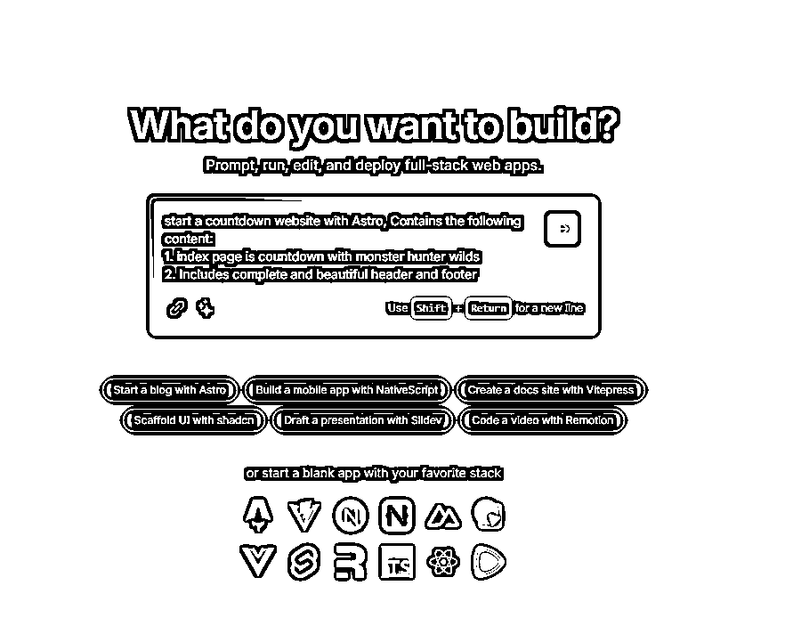
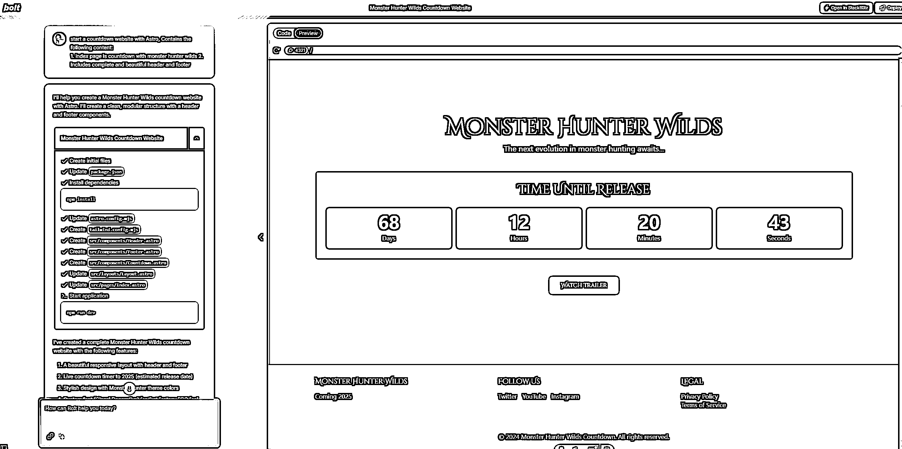
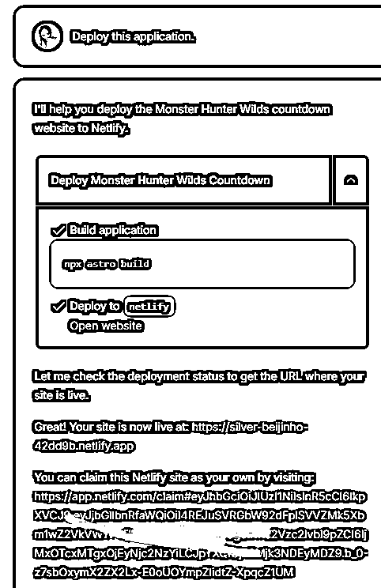

# 输入需求，一键生成网站所有代码，支持预览，一键发布

> 原文：[`www.yuque.com/for_lazy/zhoubao/el29zac5a02ggga1`](https://www.yuque.com/for_lazy/zhoubao/el29zac5a02ggga1)

## (27 赞)输入需求，一键生成网站所有代码，支持预览，一键发布

作者： 彩笺

日期：2024-10-24

# 输入需求，一键生成所有代码，支持预览，一键发布

朋友们，这里是彩笺，持续关注实践 AI 和出海。

今天早上起来发现了一个新的全栈应用的 AI 生成器：

简单介绍：

StackBlitz 公司推出的一个全栈应用的 AI
生成器。只要输入需求，它就会生成你要的全栈应用，前端代码和后端代码同时生成。你可以在它的页面上运行、编辑和部署该应用。

网站地址：[`bolt.new/`](https://bolt.new/)

听起来很强大，用人话列个需求让他尝试做一下；

让他为我喜欢的一款游戏生成一个倒计时网站，要求有两点：

*   主页是该游戏的发布倒计时

*   包含完整美观的网页 header 和 footer

然后就是短暂的等待时间，直接看效果：

网页直接生成好了，和 claude 一样支持预览，上图可以看到没什么问题。

点击左上角 Deploy 部署试试

可以看出他直接在 netlify 这个网站部署好了，点击网站就能查看效果。<[`silver-`](https://silver-) beijinho-42dd9b.netlify.app/>

netlify 和 vercel 都是类型相似的网站，可以部署自己的项目。

在 netlify 中，每个月免费套餐包含了：100G 流量、300 分钟编译时长，以及 1 个同时编译队列。

图中第二个是认领链接，可以将项目同步到自己的账号，此后你将拥有这个项目完全的控制权。

出海真是越来越简单了。

* * *

评论区：

暂无评论