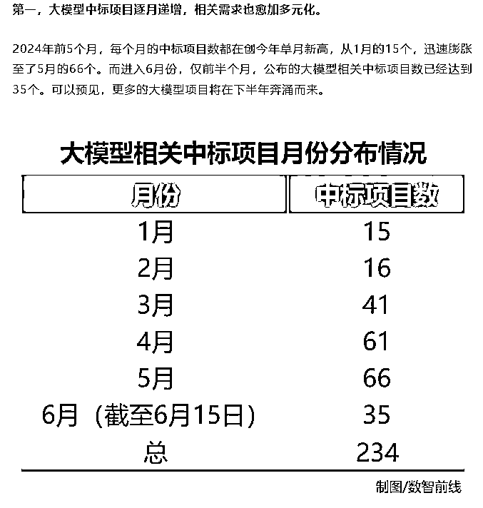
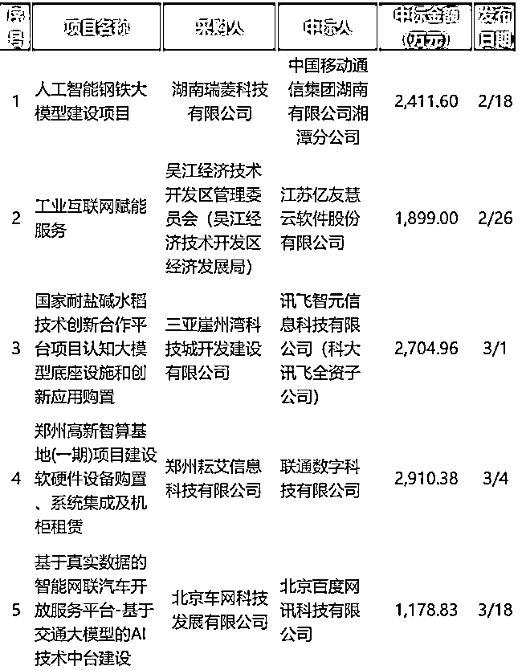

# 如何从 0-1 做一个 AI 项目

> 原文：[`www.yuque.com/for_lazy/zhoubao/iwgrmn3ugp401h20`](https://www.yuque.com/for_lazy/zhoubao/iwgrmn3ugp401h20)

## (18 赞)如何从 0-1 做一个 AI 项目

作者： 老余

日期：2024-10-23

##### 

（图片生成：ideogram）

##### 老余生财日更笔记 16

##### （一句话自我介绍：老余，未来十年专注 AI 领域的直播运营）

本内容根据 AI 师傅的创始人孙志岗分享整理

适合想开发 AI 产品和做 AI 项目的朋友阅读

同样很多道理也适用用其他领域的项目

进入主题

**一、行业现状**

### **

**国外

1.  世界 500 强的 92% 采购了 ChatGPT

2.  Microsoft、Apple、Google 开始在操作系统内置大模型相关服务

3.  英伟达一度成为全球市值最高的公司，稳居前三

### 国内

1.  政府、国企、央企已[接到大搞人工智能的「任务」](http://www.sasac.gov.cn/n2588025/n2588139/c30132964/content.html)，[基础模型采购如火如荼](https://mp.weixin.qq.com/s/EZ-FXqH7t5hbtSayf2jjtw)，都在努力找标杆项目

2.  有研发能力的民企，多数已经动起来，内部升级/招兵买马

3.  没研发能力的民企，用 AI 工具提效已经比较普遍，意识先进者开始用大模型赚钱了，和外包合作实现更好的自动化，甚至产品化

### 整体

无论国内国外：

1.  toC 基本都不盈利（大厂特别有优势）

2.  toB 赚钱亏钱的都有

**  **

**  **

**二、项目方案如何制定**

1、从自身渠道找切入点

蒸汽机车发明人乔治·斯蒂芬森，之前是矿山机械师

蒸汽船发明人罗伯特·富尔顿，之前是潜水艇工程师

蒸汽纺纱机发明人理查德·阿克赖特，之前发明了水力纺纱机

所以：

别想「转行」，你的行业是你的优势

1.  别人比你更懂那个行业，有更多行业资源，凭什么你能赢？

2.  在你最熟悉的行业如果做不成，凭什么换行业就能成？

**做行业里的三懂人才：懂业务，懂 AI，懂编程**

2、我们先看看怎么自己干，然后再看看怎么在公司里干。

普通人抗风险的能力比较弱，创业又是成功率很低的事情，所以不要在什么都没有的情况下就做大投入

#### 案例：

印度小哥 Bhanu Teja Pachipulusu

独立开发 [SiteGPT](https://sitegpt.ai/) 和 [feather](https://feather.so/) 两个产品的印度小哥：

[SiteGPT.ai](https://docs.qq.com/aio/SiteGPT.ai) 踩到了 AI 风口。[Feather 被 25
万美元收购](https://x.com/pbteja1998/status/1801230961943966015)

### 参考阅读

##### **flomo 的经营理念**<[`help.flomoapp.com/about-us/about-us/company-`](https://help.flomoapp.com/about-us/about-us/company-)

concept.html>

1.  [这家公司只有创始人一名员工，年营收千万！他是如何做到的？](https://mp.weixin.qq.com/s/pznEq8JHRMtaSlO_OvzjYQ)

2.  [9 人小公司，细分领域 SaaS 工具从 0 到 1 做到 100 万美金 ARR 的过程](https://mp.weixin.qq.com/s/Xvj7Y7NyTILmyS287ymQOg)

3.  [一个独立创造者的五年](https://mp.weixin.qq.com/s/x6PLSIMn_1qcKnXWPT-J-Q)

4.  [中国的独立开发者都在开发些什么？](https://mp.weixin.qq.com/s/izJdOMP0LY1VeBmzpnXScQ)

5.  [想做“独立开发者”，第一步应该怎么做？](https://mp.weixin.qq.com/s/5q6WYfr6G2zKru0LcvvPUw)

6.  [#独立开发变现周刊](https://mp.weixin.qq.com/mp/appmsgalbum?__biz=MjM5OTM3NzAwNg==&action=getalbum&album_id=1857680644290478080&scene=173&from_msgid=2649285309&from_itemidx=1&count=3&nolastread=1#wechat_redirect)

7.  [一年的独立开发者生活](https://www.maliquankai.com/2018/08/08/2018-08-08-oneyear-developer/)

**三、项目执行注意事项**

1、做好独立开发，最重要的是自律

经常会出现电脑面前一坐一天什么都没开始的情况

2、对综合能力要求比较高

一个人就要是一支军队

#### **四、如何进行项目立项**

在立项阶段，要对这三个要素有初步的答案：

1.  真实需求是什么？

2.  商业模式是什么？

3.  推广渠道在哪里？

**  **

**划重点：** 先看自己有什么渠道，再面向渠道带来的用户定商业模式、找真需求

1.  推广渠道决定用户群体，这确实应该最先定义

2.  不掌握渠道的人做出产品，很容易被掌握渠道的抄走，或分走最大利润

3.  推广渠道和商业模式不是程序员的舒适区，所以要先想清楚

4.  需求想太多，容易陷入兴奋，后两者不多想就动手

#### **1、推广渠道**

**立项阶段只回答一个问题：** 到哪找 100 个种子用户，或 1-2 个种子客户？

用户/客户在手边，不仅好触达，而且说明你离他们不远，是懂他们的（至少不陌生）。

推论：赚钱要先赚熟人的，不丢人。

（这个经验和钟纪生财体验课里说的最小可行性方案是相同的道理）

#### **2、找到真实需求**

超过半数的产品经理，都找不到真实需求。

人的语言、行为表达出的需求，往往不是真实需求。比如：

1.  「酱香拿铁」卖爆了，买的人是为了喝咖啡吗？现在是不是不爆了？

2.  妈妈要你给她买生日蛋糕，她是没钱买还是想吃蛋糕？

3.  女朋友要你接她下班，你说：我给你出打车费……

真实需求往往猜不出来。有效途径只有实地考察。

##### **5 why 法**

丰田公司创始人，丰田佐吉，提出的一种「找根本原因」的方法：

接到一个需求，问为什么有这需求。得到答案后，再问为什么会有这样的答案，以此类推，直至找到根本性的核心需求。

实战中，通常问到 2-3 个 why，就已经找到真需求了。

举例：

看一段羞耻的视频：[`www.bilibili.com/video/BV1wW411Z7Fg/?t=13m49s`](https://www.bilibili.com/video/BV1wW411Z7Fg/?t=13m49s)

5 个 why，找到了真需求「她需要我对她用心」，解决方案是「更多关注她的感受，把过程表达出来」。

但是，5 why 法有两个致命缺点：

1.  如果你对业务理解不够，对方会不耐烦

2.  有时，显得不太礼貌

##### **躬身入局法**

非常简单：自己去把业务做一遍。一遍不够就再来一遍。

真实案例：

1.  高途要求所有新入职的产研，必须先做一个月的销售

2.  美团骑手线的产品经理，都送过外卖

这是比「吃自己的狗粮」更彻底的做法。

缺点：

1.  成本高，时间和资源成本都高。但很值得

2.  有些业务，咱们真插不上手。那就像个学徒一样，全程跟随观察吧

**  **

**行动：** 约付费能力强的群体中，你最熟悉的三个人吃饭。你给 ta 讲 AI，ta 跟你聊业务。找到 AI 能解决的真需求。

以上供大家参考

#项目实操

* * *

评论区：

七天@生财有术 : 这个思路很不错[通过整理分享去获得一些路径，并且结合一些可参考的案例。老余也可以结合自己做 AI 直播的业务给一些项目实操案例呢]应该阅读起来场景感和实操中的避坑卡点等真实思路也更丰富完善~

老余 : 核心：要明白你的什么内容可以让别人停留，购买
AI 直播适用于你的场景，产品本来就能够让用户停留和购买，比如瑞幸优惠券直播间，所以 AI 直播的核心除了技术还有选品上，选品大于技术。
流量主要来自主播（形象，能力）的类目，比如服装，比如仓播，目前是无法被数字人替代的。
现状：从数字人直播去年刚出来的时候就有关注了，实际效果不理想，盈利模式基本上以割韭菜赚钱为主。到了今年，技术相对成熟了，也有抽卡抽出来数字人效果很好的，但是门槛还是比较高