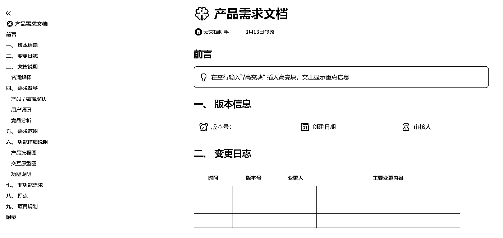
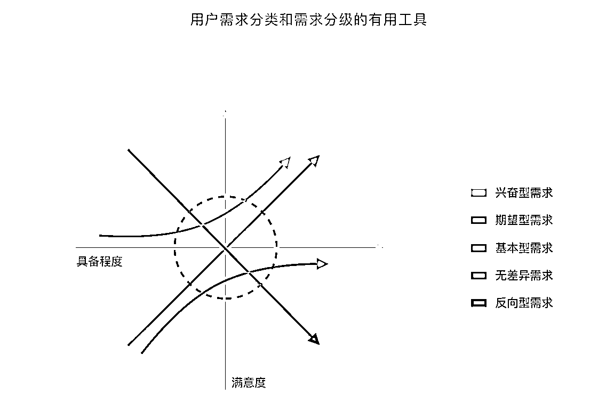

# 如何从 0-1 做一个 AI 产品

> 原文：[`www.yuque.com/for_lazy/zhoubao/llbz3g3rf6qi39cg`](https://www.yuque.com/for_lazy/zhoubao/llbz3g3rf6qi39cg)

## (15 赞)如何从 0-1 做一个 AI 产品

作者： 老余

日期：2024-10-24

图片生成：**IDEOGRAM 2.0**

### 老余生财日更笔记 17

### （一句话自我介绍：老余，未来十年专注 AI 领域的直播运营）

本文根据 AI 师傅的创始人孙志岗分享内容整理

适合所有想自己动手做一个 AI 产品的朋友阅读

## 产品设计：

1.  功能设计 - 干什么

2.  信息架构设计 - 怎么摆放这些功能

3.  交互设计 - 怎么让用户用起来顺手

如果对视觉要求高，还需要特别做视觉设计。否则套模板就差不多。

对全栈来说，三件事不分先后，而是彼此交错。

但起手做的，常常是：抄。

优雅的姿势：

1.  **先自己设计，然后再参考**  - 有独立的想法，不会盲目抄

2.  **学结构、学交互，别学视觉**  - 「像素级」抄袭是会被嘲笑的

3.  **取各家之长做整合、抽象**  - 有机会抛弃别人的桎梏，另起炉灶

避坑关键：

1.  用 5 why 法推演为什么人家这么设计

2.  如果找不到理性答案，慎抄，容易进坑

## 写 PRD

一定要先写需求文档！俗称 PRD（Product Requirement Document）。

1.  虽然可能写完没人看，但写文档的过程比结果更重要，可以让思路更清晰

2.  飞书的「[产品需求文档](https://www.feishu.cn/docx/TeVHdbg5ao0vEdxRhrNcVPkBnle?&from=template_center&ccm_open_type=template_center)」模板特别好用，往里填就行

3.  可以用 ChatGPT 找些思路和灵感，常见功能它写得还不错

## AI 产品设计原则

在设计产品的过程中，时不时检查，是否这些原则全部符合。

### GitHub Copilot 总结的四个关键支柱

GitHub Copilot 是最早，也是迄今为止最成功的基于大模型 AI 的垂类工具产品。其经验非常值得借鉴。

Copilot 团队也乐于分享。在 How we’re experimenting with LLMs to evolve GitHub
Copilot evolve-github-copilot/) 一文中，总结了 GitHub 设计 AI 产品的四个关键支柱（Key Pillars）：

1.  **可预测** 。我们希望创建能引导开发人员实现最终目标的工具，但不会让他们感到惊讶或不知所措。

2.  **可容错** 。正如我们所见，AI 模型可能犯错。用户应该能够轻松地发现不正确的建议，并以较低的成本来解决，以便专注和提高生产力。

3.  **可操控** 。当回答不正确或不符合用户期望时，他们应该能够引导 AI 找到解决方案。否则，我们就是乐观地指望模型产生完美的答案。

4.  **可验证** 。解决方案必须易于评估。模型并不完美，但如果用户能验证其输出，它们就能成为非常有用的工具。

### 七个实操经验

以下内容综合了孙老师教研团队的实战经验、[有赞 CEO
白鸦的分享](https://www.dedao.cn/live/detail?id=5Ba2YRDqjZBXk7Oyl4LV8xm5PoVYKSkZl2X5Rn4yQeEJAKgW1bvG9Nr0Mzo3nd6b)和微软的
Collabrative UX 实践 practices-for-ai-developers)。

1.  **永远不要让 AI 直接生效**

2.  人工确认是必须的

3.  AI 幻觉永远存在

4.  **代替操作和探索，不要完全代替思考**

5.  把 AI 当人看，把用户当老板

6.  不思考的老板是不配发号施令的

7.  让人思考该输入什么，和思考 AI 输出是否正确

8.  **尽量减少 chat**

9.  先用表单。准确、快捷

10.  对话是兜底方案。选项解决不了，或实在太多时才用

11.  **直接给结果**

12.  用户只想要结果，没耐心看太多

13.  如果 agent、思维链、工具调用等过程太耗时，报进度

14.  **明确告知这是 AI 的输出**

15.  给用户可能有错的预期，起到一定免责效果

16.  不要欺骗，不要欺骗，不要欺骗

17.  **收集反馈**

18.  有反馈才有优化

19.  让用户主动上报，比如 ChatGPT 的 👍 和 👎

20.  采集用户行为，比如 GitHub Copilot 里是否按了 `tab` 键，ChatGPT 里是否点击了 copy 按钮

21.  **尊重传统**

22.  AI 不是颠覆，是增强

23.  传统产品设计经验，全都继续有效

### UE/UX 设计经验

[`www.shapeof.ai/`](https://www.shapeof.ai/) 总结了几大方面：

1.  识别 - 帮助用户识别和区分 AI 特性和内容

2.  色彩模式 - 提供视觉提示，帮助用户识别内容中的 AI 特性

3.  图标 - 用图像来表达产品中使用的 AI 形态

4.  命名 - 我们如何称呼 AI？

5.  向导 - 提供线索，帮助用户理解 AI 的工作原理以及如何与之协作

6.  引导 - 提醒用户可以在现有工具中使用 AI

7.  建议 - 向用户提供写提示词的线索

8.  模版 - 向用户提供结构化的模版，并且可以用 AI 预填写

9.  提示 - 用户用 AI 生成结果的不同方式

10.  自动填写 - 让用户轻松地将一个提示词扩展到多个输入

11.  开放对话 - 开放式提示词输入，从而能持续对话或调整结果

12.  混合 - 组合多个提示词或更多输入源，以获得新结果

13.  整理 - 将复杂的信息提炼或重组为简单的结构

14.  调节 - 细化提示或结果，以获得更可预测的输出

15.  过滤/参数 - 让用户定义约束以提高结果的质量

16.  模型管理 - 让用户指定提示词所使用的模型

17.  人格化语音 - 确保输出与您的声音、语调和偏好保持一致

18.  信任 - 让用户控制响应并评估其准确性

19.  警告 - 告知用户模型或技术整体上的不足或风险

20.  控制 - 管理信息流或在请求中途中止以调整提示词

21.  反馈 - 对模型与预期的差距或错误发出信号——但用户能分辨清楚吗？

22.  脚印 - 让用户能够追踪来源和结果之间的关系

原型设计

程序员会更喜欢直接上代码，省却画原型步骤。这个习惯不好：

1.  代码写出来就有感情，不爱改

2.  画原型图，能在具象和整体层面上，更好地把控。

和完整编制的团队不同：

1.  独立开发画原型图不需要太精细，线框图足够

2.  细节在代码里做调整，更直接、准确

3.  AI 直接生成原型图除外

### AI 原型设计工具

用 prompt 出设计图。

测试 prompt：一个 AI 教学网站。界面是对话风格，但是由 AI 主导对话，用户只能点击按钮选择下一步的动作。按钮可能是 1-4 个。

1.  [Motiff（国际版）](https://motiff.com/)/[妙多（中国版）](https://motiff.cn/)

2.  AI 为核的全能设计工具

3.  大模型出现之前立项开发，大模型之后迅速面向 AI 重构，2024 年 6 月正式发布

4.  AI 复制、AI 布局

5.  AI 识别系统组件，建立组件库，AI 做一致性检查

6.  AI 生成 UI

7.  AI 魔法框猜测想要的设计元素（很像 GitHub Copilot）

8.  [Galileo AI](https://www.usegalileo.ai/)

9.  支持 Text to UI 和 Image to UI，设计精美

10.  可以用 prompt 继续修改设计

11.  可以手工调配主题色、字体等

12.  可以直接导出到 Figma

13.  [v0](https://v0.dev/chat/)

14.  支持 Text to UI 和 Image to UI

15.  直接生成 React 前端代码，展示效果更真实

16.  可以用 prompt 继续修改设计，细节控制优于 Galileo

17.  [Figma](https://www.figma.com/)

18.  刚刚发布 AI 功能，和 Motiff 接近，但现在只能 [Join the waitlist](https://help.figma.com/hc/en-us/articles/4406787442711-What-Figma-features-are-in-beta#h_01J1BBH8MADVEQMNFJ2SNPNZCE)

建议流程：

1.  纯用 Motiff

2.  或者用 Galileo 出设计图，发给 v0，再用 v0 做细节调整

### 传统原型设计工具

推荐的工具：

1.  [draw.io](https://draw.io/)

2.  免费开源

3.  对程序员最友好，可以直接改 style

4.  内置的图形库，几乎就足够用了

5.  可以直接编辑云文件，包括 GitHub

6.  保存的 .png 和 .svg 文件还能继续编辑

7.  容器功能特别好用，画架构图首选

8.  有客户端，速度更快

9.  [Figma](https://www.figma.com/)

10.  最受欢迎的专业原型设计工具，非常非常强大，学习成本稍高

11.  可以写 plugin 来扩展其功能

12.  适合多人协作，支持实时协同编辑

13.  直接生成样式代码

14.  有客户端，速度更快

15.  处理 logo、icon 等图片，免费版就够用。

UI 设计推荐阅读：

[《写给大家看的设计书（第 4
版）》](https://www.dedao.cn/ebook/detail?id=rJRdy1qe4xAVBgZrvdGmz8ykaop6QWXnEEwEJnD7LR51qb2KY9NPMXOljVa28m5K)。

快速搭 demo

可以有个期待，AI 把 PRD
直接变成产品。[MetaGPT](https://github.com/geekan/MetaGPT)、Devin labs.com/introducing-devin) 在这方面走得最远，但还很不够。

懂代码的我们，可以用 [Gradio](https://www.gradio.app/)，快速搭出一个主流程 demo，供用户/客户体验，验证需求。

可以参考我之前的实操案例：

[`articles.zsxq.com/id_c4eeqeor28vp.html`](https://articles.zsxq.com/id_c4eeqeor28vp.html)

### Gradio

[`www.gradio.app/`](https://www.gradio.app/)

1.  是 AI 界最常用的界面开发库

2.  非常简单，用纯 python 就能写出功能强大的 Web 界面，不需要任何 JavaScript、CSS 知识

3.  响应式设计，支持手机、平板、电脑等多种设备

4.  文档详细，样例丰富，非常容易上手

比如：

1.  Chatbot Arena: [`lmarena.ai/`](https://lmarena.ai/)

2.  Stable Diffusion web UI: [`github.com/AUTOMATIC1111/stable-diffusion-webui`](https://github.com/AUTOMATIC1111/stable-diffusion-webui)

### 高级定制界面

前面演示的都是用内置模板直接创建界面。但 Gradio 还支持高级自定义界面。

界面中可以放置的组件，有：

1.  AnnotatedImage

2.  Audio

3.  BarPlot

4.  Button

5.  Chatbot

6.  Checkbox

7.  CheckboxGroup

8.  ClearButton

9.  Code

10.  ColorPicker

11.  Dataframe

12.  Dataset

13.  DownloadButton

14.  Dropdown

15.  DuplicateButton

16.  File

17.  FileExplorer

18.  Gallery

19.  HTML

20.  HighlightedText

21.  Image

22.  ImageEditor

23.  JSON

24.  Label

25.  LinePlot

26.  LoginButton

27.  LogoutButton

28.  Markdown

29.  Model3D

30.  MultimodalTextbox

31.  Number

32.  ParamViewer

33.  Plot

34.  Radio

35.  ScatterPlot

36.  SimpleImage

37.  Slider

38.  State

39.  Textbox

40.  UploadButton

41.  Video

界面布局用 tab、row、column 模式

## 迭代

**划重点：** 谨慎增加新功能，保持小而美

1.  别用高频迭代代表勤奋，要用积极运营代表勤奋

2.  第一版只做主路径功能。但别忽略细节体验

3.  用 KANO 模型，找到提升**核心用户** 满意度的功能，

4.  非核心用户骂你，也不要理睬

5.  别轻易改变**核心用户** 画像。如果要变，可能做个新产品更好

KANO 模型：

参考资料

1.  [《邱岳·互联网产品方法论》](https://www.dedao.cn/course/detail?id=Ox1El850jp9VaZasnvJZg6MbrdvRBo)  - 最真实的

2.  [《产品思维 - 从新手到资深产品经理》](https://u.jd.com/RqP0OF3)  - 逻辑最严密的，适合程序员

#项目实操

* * *

评论区：

暂无评论