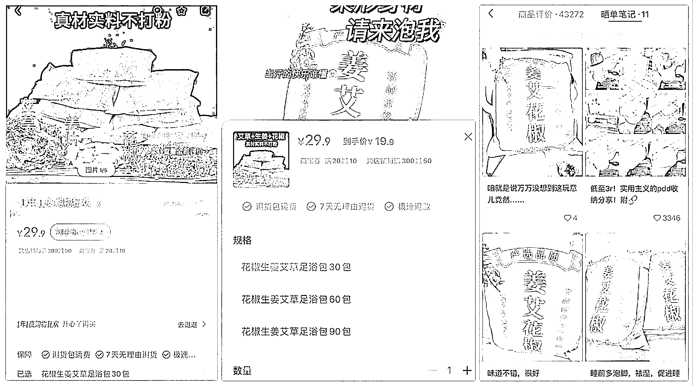

# 2024 最后 2 个月，小红书这 3 个品最好卖......

> 原文：[`www.yuque.com/for_lazy/zhoubao/fvd6q2kuub57errz`](https://www.yuque.com/for_lazy/zhoubao/fvd6q2kuub57errz)

## (54 赞)2024 最后 2 个月，小红书这 3 个品最好卖......

作者： 谢无敌🐱闪亮猫传媒

日期：2024-10-24

Hi[生财的朋友们大家好] 我是你们的老朋友-谢无敌，闪亮猫传媒创始人。

2024 年最后 2 个月，如何才能在小红书逆风翻盘？

我的答案是：**入局养生赛道！**

在快节奏、高强度的大环境下，最近几年大家越来越追求健康生活，带动养生赛道愈发火热。当代的“脆皮年轻人”们，也成了养生消费的主力军。

这一点从搜索量就能看出来，2024 年在小红书，**养生话题的搜索量增长了 200 多倍。**

而在抖音、视频号、快手等各大平台，养生赛道也一直是商家必争之地。

小红书虽然发力晚，但爆发力却非常强，主要就是因为**粉丝精准、质量高。**

很多客单不低的养生产品，**在小红书都能卖出几万单，流水动辄几百万、几千万。**

所以，明年的小红书，养生赛道必然是商机满满。那具体如何做才能抓住商机呢？

今天这篇文章我就开门见山，直接给大家推荐几个**简单好卖的养生爆品，** 包括长期困扰你们的**选品和货源问题。**

不管你是想入局养生赛道的纯博主，还是想自己卖产品的商家，都可以通过这篇文章找到爆单密码！

## 一、选品 3 要素

在直接推荐产品前，首先我们要明白选品有哪些要素，这样你才能拥有长期打造爆品的能力。

### 1、产品实拍性强

无论是图文笔记，还是视频笔记，拍摄都决定着你的内容质量。而在选品时，也要首先考虑到这个因素。

**这个产品是否好拍？你的拍摄技术，是否能把它的优势最大限度展示出来？**

这样在你后续执行落地的时候，才不会遇到卡点，也不会因为实拍效果差，导致数据差。

简单好拍的产品，比如上面讲到的茶饮类。

不需要太复杂的构图、配色、布景，清新的纯色背景就能呈现出比较好的效果。

拍摄难度较大的产品，比如珠宝饰品、衣服等。

因为要体现出产品的质感、造型美，对很多人来说是比较难上手的。

所以在选品时，一定要选择**简单好拍、“容易出片”** 的产品。

### 2、产品规格清晰

很多人重视选品，却忽略了产品规格，但往往就是它直接影响着你的产品转化率。

对于用户来说，产品规格（SKU）清晰明了，用户在浏览产品页时，就能快速获取产品信息，选择符合需求的规格下单。

对于商家来说，能**减少大量的售前咨询，提升用户的下单速度，以及产品整体的转化率。**

不同产品有不同的侧重点，具体如何设置产品规格，我没办法一一展开说。

但你只要记住背后的核心就够了：**从用户需求出发，规格设置简单清晰，让用户能更快做出决策。**

### 3、产品功能聚焦

现在很多商家为了提升产品竞争力，都会把多个功能集于一个品，也就是现在常说的“功能聚合”。

但**真正的好产品，功效一定是精准、垂直的。**

尤其是养生类产品，想要提升复购率，产品功能一定要聚焦于最实用的点，才能吸引到精准用户。

这样你的营销方向也会更明确，否则产品卖点又多又杂，内容方向也会不清晰。

即使吸引到流量，也是不精准的“分散用户”，没办法大批起量。

这里我要提醒大家的是，产品功能聚焦并不是说产品只有一个功能，而是说**站在用户的角度去创作内容，体现产品的实用性。**

不理解没关系，下面我再举 3 个案例来展开讲讲~

## 二、产品推荐

### 1、泡脚包

**实拍性：** 一部手机就能搞定

**产品规格：** 从用户的实际用量出发，设置不同数量的规格，比如这个店家就提供了三个规格供用户选择：

30 包（1 个月的用量）、60 包（2 个月的用量）、90 包（3 个月的囤货量）

**产品功能：** 祛湿、驱寒、助眠、缓解疲劳......

泡脚包的功效多而不杂，都聚焦在“滋养身体”上，实用价值非常高，用户也愿意买单，这也是它能在各大电商平台经久不衰的原因。

我之所以首推这个产品，也是因为**操作简单，投入不高，对新手来说非常友好。**

尤其现在秋冬季，正是“泡脚”的刚需时期，从年末到明年年初这段时间，它的爆单率都会非常高。

比如下面这个专卖泡脚包的账号，客单价从**19.9-49.9，卖了 5.5W 单，流水达到了 250W。**

但他的账号内容几乎都是一套模版，却吸引到了大量的人买单，可见这个品的变现力是非常强的。

### 2、养生茶

**实拍性：** 一部手机就能搞定

**产品规格：** 根据茶的不同功效做组合装，让用户自行选择自己需要的搭配。

**产品功能：** 养生茶的成分、口味、功效分类非常多，美容养颜、瘦身、生发、缓解痛经......

每一种都是强卖点产品，所以你选择哪种功效的产品，就要集中在内容上去强调这个卖点，突出产品的核心价值。

比如下面这个账号，她的“种子循环茶”主打呵护女性健康，“早 C 晚 A”主打美白抗衰。

而她的笔记内容也是结合热点，去突出这些卖点，果然**一个产品链接就卖了 5.1W~**

### 3、经络梳

**实拍性：** 一部手机就能搞定

**产品规格：** 根据产品不同的颜色、包装、赠品，搭配不同组合，比如下面这个店家就提供了 7 种搭配。

**产品功能：** 疏通头部经络，养头发。

和前面两个产品不同，经络梳的功能相对是比较单一的，这时候你的内容就不能过于简单，否则产品的价值感就会变低。

所以一定要站在用户的角度，延伸出一些其他的效果，比如面部按摩等等......

**通过多种用途展示，来增加产品的实用价值，** 用户会更愿意买单。

## 三、如何寻找货源？

选品问题解决了，还剩下一个最难的问题——货源。

带货一定得有货源，而且还得是**价格上有优势的货源渠道。**

除了自有产品或线下货源的商家，其实现在很多线上渠道，也能解决这个问题，比如拼多多、阿里巴巴。

我个人更推荐阿里巴巴，操作很简单：

只要登录阿里巴巴网页或 app，搜索你想要的产品，挑选符合你要求的产品就可以了。

但在选品这一步骤，有 4 点需要大家注意：

### 1、必选：一件代发

一定要选择店铺有“代发”字样的，这种**无需你囤货、进货，供应商可以直接替你发货；**

### 2、必选：支持小红书发货

选择支持小红书平台发货的店铺，如果是**其他平台，很容易被小红书官方查到，** 会有违规封店的风险；

### 3、必选：有保障的商家

选择**带牛头、服务分数更高** 的商家，产品、服务质量会更有保障；

在手机上查看店铺时，也要首选有**“1688 严选”** 标识的店铺。

我个人还有一个小技巧分享给你们：

在优先选“可代发”产品的情况下，如果没有合适的供应商，就再看看其他产品。

假如你非常心仪这个产品的话，可以**找厂家商量一下是否可以单独给你代发。** 毕竟做生意，她也是能赚钱的，万事好商量~

好了，以上就是关于养生赛道从选品到货源的所有问题。

其实从今年的整体情况看，养生赛道是真的好做，**变现价值也非常可观，门槛也不高。**

不仅商家能快速变现，个人博主也能接到不错的广告资源。

最关键的是红利期长，不夸张地说，属于只要开干就有钱赚，所以，现在入局真的一点也不晚。

但如果你还是迟迟犹豫不决，往后可就不好说了，毕竟红利不会一直在......

* * *

评论区：

半扇咸鱼 : 话题搜索量查询用的什么平台？

猪头叔叔 : 喂饭级别的分享[强][强]