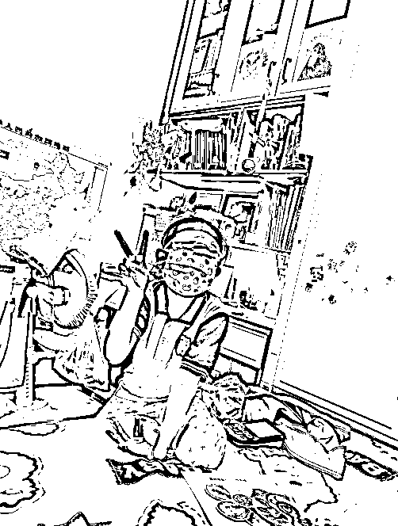

# 少儿 Ai 体验馆，卖知识版权，打通一座城“绘本馆”跟你合作

> 原文：[`www.yuque.com/for_lazy/zhoubao/hsw2saq9d6ea04gb`](https://www.yuque.com/for_lazy/zhoubao/hsw2saq9d6ea04gb)

## (25 赞)少儿 Ai 体验馆，卖知识版权，打通一座城“绘本馆”跟你合作

作者： 领飞懂运营

日期：2024-10-21

大家好！我是领飞！！

有 2 个月，没分享内容了，我有时候写一些东西，写到兴奋点了，就想给大家分享下；

今天这篇内容，是我对孩子“近半年”教育实践的感悟；

在这个过程中我验证了一些事情，拿来跟大家分享下；

内容所阐述“观念”是我个人主义，当然跟大家理念会有所不太一样，所以不喜勿喷；

每个人都有自己的价值观，谁对谁错，不重要，路是自己走出来的。

**（有想法和建议，评论区探讨）**

**  **

* * *

我现在对孩子的未来：

已经不焦虑了，一切顺其自然；

我自己不焦虑了，其实孩子也能给我惊喜。

**未来 Ai 所带来的改变，一定是天翻地覆的取代；**

**  **

高中会越来越难上，不让你上高中，就是不让你轻易考上大学；

其目的是：为了增加基层的劳动力。

长远来看，基础劳动力越来越值钱。

**就目前几年来说，大学毕业即失业**

**  **

孩子都学傻了，一点生存能力都没有，一点商业认知都没有，一点克服困境的精神都没有。

**什么原因造成的？**

**  **

傻学，各种每天补习班，没有任何社会户外的锻炼。

**即便考上大学又如何？**

**  **

未来 Ai 所取代的就是：普通大学的劳动力

除非刚需的大学（清华、北大、交大、复旦），能头顶名牌的光环。

如果，你不是非富即贵家庭，普通人大学出来，资源很少很少会向你倾斜。

跟何况，你备考大学 10 年，只有书本的那点概念，求生存的综合素养一点没有。

这就是毕业即失业的原因。

**当我把这点，看懂之后；**

**  **

我就不焦虑了，解放孩子天性，掌握多种谋生手段，培养各种生存困境解决能力，锻炼个人体魄抗压精神。

我觉得会更重要。

不卷学习，也就不过分的内耗，课外培训班这件事，也就不那么重要了。

当然，学习能力还是要有的，该督促，还是要督促，什么年龄，干什么事情。

是不是学习这块料，你是家长，比谁都清楚；

所以，强求自己，强求孩子，最后的结果都不好。

想明白这些，我也就不想让孩子卷了，我自己也压力小了很多；

上不上大学，无所谓，我也没有资源能倾斜给他，于其这样，还不如让她更加有社会能力。

**我家大宝，今年 7 岁了(二年级)，总跟我聊天：她想赚钱**

**  **

我就跟她讲各种原理，甚至付出行动带她摆地摊，以及包括风险规避解读。

学习课本知识，是顺手的事情，锻炼多项能力成为了主要指令。

今年，我把家里的平板电脑，下载了一堆 Ai 工具；

我让她自己，感触 Ai 的魔法，多么神奇！

**比如：** 小孩子喜欢公主裙，公主形象的卡片，我就让她用 Ai 工具，自己说提示词，生成自己国漫形象的照片。

**比如：** 我家孩子喜欢画画，我就让她把画好的内容，放到 Ai 工具，做出动画。

**比如：** 我让他想个故事，相当于提示词，之后放到 Ai 做出完整的内容；再增加一些难度，又变成绘本画，又做出视频动画，又配置音乐。

反正也是经常玩手机，家长是控制不了的，于其这样，还不如让手机赋予价值。

现在我家孩子，不刷抖音动画了

**总是问我：爸爸！这个动画，能不能用 Ai 做出来。**

**  **

我说能，她就去研究试试。

**  **

**有一天特别有意思，** 我把家里的打印机连在了她手机上，她用 AI 做出了几张“斗罗大陆小五女主”的换装图片，之后打印了出来。

我没看住，她把照片就带到学校去了，估计是拿出去给小伙伴们“炫耀”去了吧。

**下午我接她放学，两眼冒光，跟我说：**

**  **

爸爸，我想到一个挣钱的方法，一块钱一张 AI 小五照片，我卖给我同学，行不行。

我一听，太行了，但我没有鼓励她。

**由于快到冬天了，我说：**

等到夏天，你可以在小区里摆摊打印图片；

现在你同学想打印，你就送他们，让你的同学围在你身边，你也会非常高兴对吧。

通过这件事情，我想到一个项目：

大家可以不妨，试一试！

**“少儿 Ai 体验馆”----让你的孩子，不再用手机看动画片。**

**  **

拒绝不了孩子玩手机，那我们就让它有价值。

我们不要研发什么软件，直接用现成大厂的 APP 就好；

让孩子，体验到 Ai 的神奇，锻炼他们的“提示词”能力；

我觉得这件事情，值得参考，大城市已经开展，三四五六线城市，市场空白真的很多。

**自己研发一套【教学体系】**

**  **

这是我们能够得见的知识版权。

这套教学体系，拿去卖，拿去多开店，不乏是一个能发财的项目。

**Ai 工具太多了，** 我只需要借助巨人的肩膀之下，动动脑子二次“系统”的利用，就可以了。

每个学校附近，都有绘本馆，他们的盈利点真的不多，而且也很老套；借助他们的“势”，低成本的就把一个城市干通了。

**你把这套【教学体系】，** 跟他们合作，用版权赚钱，真的很舒服。

**这套【教学体系】是什么？怎么研发？**

**  **

上面，我已经用自己孩子的案例，做了演示，大家捋一捋，再刻意梳理系统点，也许就出来了。

我写这篇文章的时候，越写越兴奋，因为我太爱这样的赚钱方式了，干了好多年了卖课赚钱。

教育版权的产品，我 2019 年操作过一次，6 个月招商了 300 万的销售额；

由于当时我是跟人合作，技术在他那，最后可想而知，闹掰了；

他觉得他牛，我觉得我牛，其实谁也没格局。

但是这件事情，让我内心芥蒂好几年，自己也不是儿童教育从业者，何来研发一套知识版权。

但是我今天给大家分享的事情，我有点眉目了。

我最近，也在时不时琢磨这件事情，也有了大概“体系”的思路，到时候再跟大家分享吧。

（完）

**往期领飞生财加精文章：**

[0、【倒爷（中介）发财术】合作别人才有意思，大家一起分钱](https://articles.zsxq.com/id_wus55cjxodtw.html)

[1、如何通过【创业知识博主】原始积累 800 万](https://articles.zsxq.com/id_sckk8imjgqgi.html)

[2、【长期暴利项目】中介思维极致，年入百万项目方法](https://articles.zsxq.com/id_cd7wutqqqa61.html)

[3、【卖服务+卖产品】个人轻资产运营，价值“百万”商业模式](https://articles.zsxq.com/id_msepc8pc7r5m.html)

[4、五年用闲钱买房赚了 50 万，小城市房产投资经验，纯干货！！！](https://articles.zsxq.com/id_s0n9vvaawd1j.html)

[5、【先拼数量，再保质量】一个素人做 IP 写小作文，108 营销方法论](https://articles.zsxq.com/id_2q75vclbo9rx.html)

[6、如何用你的“热爱”，选择创业项目方向](https://articles.zsxq.com/id_vcqr0bwozsqa.html)

[7、【中介思维赚钱术】卖人，卖项目，链接高手一起卖](https://articles.zsxq.com/id_n2uw328j6swl.html)

[8、【大龄职场破局副业】6 个入局赛道解析，长期的搞钱策略（2 万字）](https://articles.zsxq.com/id_n3ddt25tm66o.html)

* * *

评论区：

梓铷 Tina : 你的整合能力好强

领飞懂运营 : 谁都要有自己的，谋生能力，这个比学历更重要。

会飞的鱼 : 脑子真好[撇嘴]

南淮 : 让小孩通过 ai 卖东西再变成课程 眼前一亮[强]