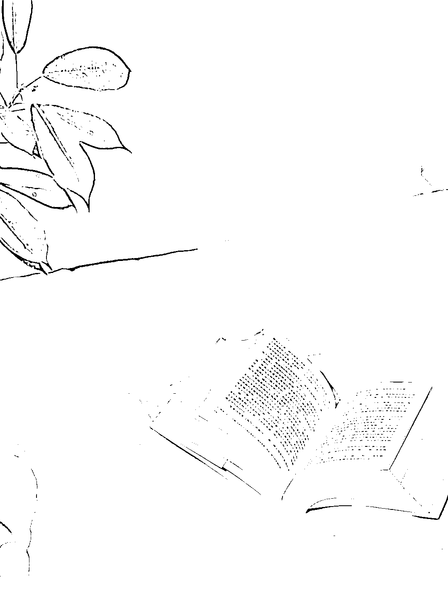

# 靠一张书桌，我形成了复利型赚钱思维

> 原文：[`www.yuque.com/for_lazy/zhoubao/br7mrson670dbe3a`](https://www.yuque.com/for_lazy/zhoubao/br7mrson670dbe3a)

## (18 赞)靠一张书桌，我形成了复利型赚钱思维

作者： 嘿柠檬

日期：2024-10-21

我做博主的初始阶段，是因为偶然在小红书上刷到了几个以分享书籍为主的博主，心想“这也太简单了吧，不就是读书嘛，谁不会啊！”

于是，我也开始尝试做读书博主，最开始的时候，连一张简单的书桌都没有。拍摄背景是大白墙，天空，阳台外，皮革椅子，公园长椅……是任何我可以想得到的地方。

后来，我把拍摄地点移到了桌面，又扩大到整个阳台书桌上。至此，开始了接到了人生中第一本书，也陆续找来了一些文具、台灯、音响、挂画、香薰、笔记本、手表、耳机等品牌方。

我打开了普通人靠自媒体赚钱的新世界，也在不断给自己打造一个增强回路。我开始不断激发自己多维度的潜能，一个赛道和一个账号根本满足不了我的探索欲望，爆发式的成长，让我忍不住去探索其他赛道。

于是我又陆续尝试了电商带货和家居赛道，也无疑吃到了这两个赛道的红利。彼时，我完成了读书，家居和无货源这三个不同赛道的变现闭环，如今也正享受着这三个赛道给我带来的成果享受。

关于家居赛道，我不算最早一批的博主，但入局也算早了。倘若不是接触到这个赛道，我不会知道一个赛道的变现潜力能这样大。

一台上万的冰箱说送就送；大几千的沙发和床垫，柜子也接了好几个；非常容易合作的灯具和卫浴产品；甚至还有地板、美缝剂和油漆这种冷门的合作产品。

两年家居博主下来，现在我的家里随处可见合作得来的产品，它不仅给我带来了财富上的富足，也给我带来了生活品质上的满足。

关于电商赛道，它打开了我的带货思维模式，也推着我开始学习销售和营销，这些以前我嗤之以鼻的技能，如今也都成为了我做自媒体的附加技能……

追溯到源头，只是因为三年前我开始读书了而已。

跟学员聊天的时候，她说：“我喜欢读书，也希望能把我读过的书分享出去，然后再顺带靠这种方式赚到钱，这样再好不过了，”

庆幸，我做到了，今后也会帮助更多人做到。

* * *

评论区：

申姐全域营销 : 真棒，核心就是不断的去行动去实践，一步一脚印的，祝福你

嘿柠檬 : 谢谢[爱心]

半月 : 阿。咋说呢，看完除了觉得你牛逼，没别的。发文还是多点价值要素吧