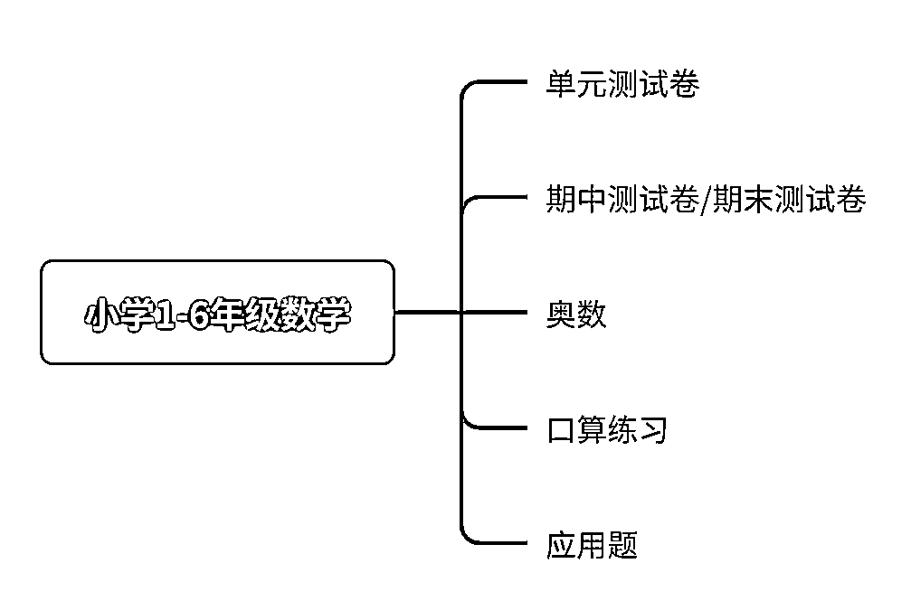
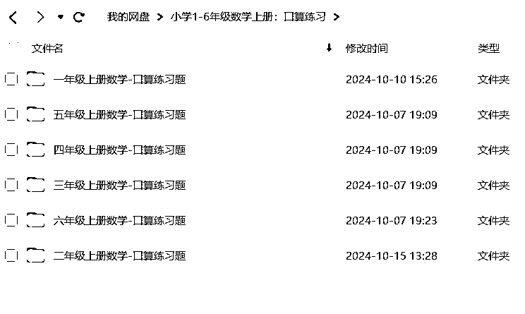
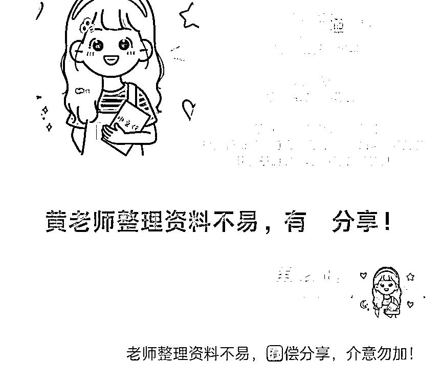
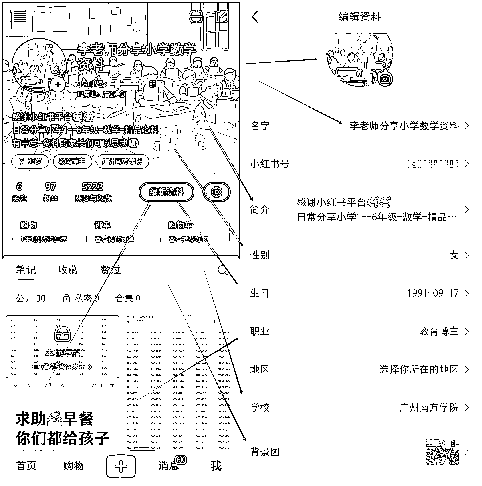
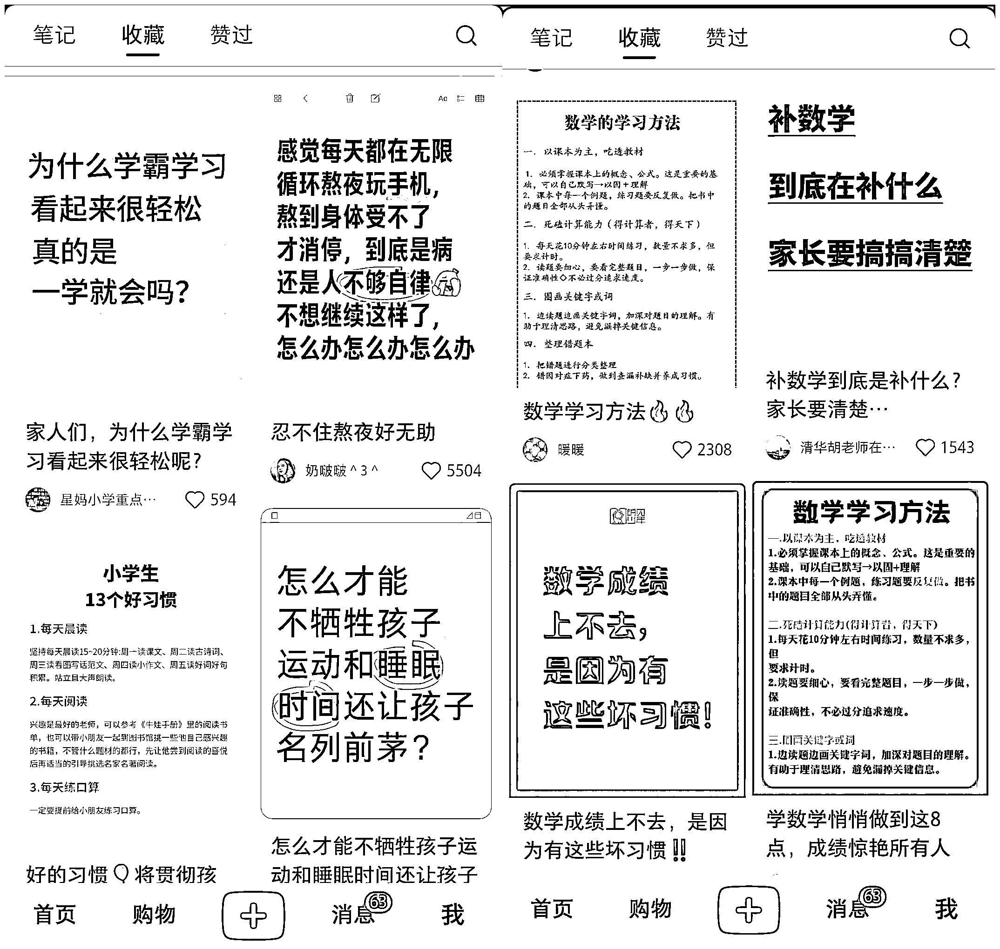
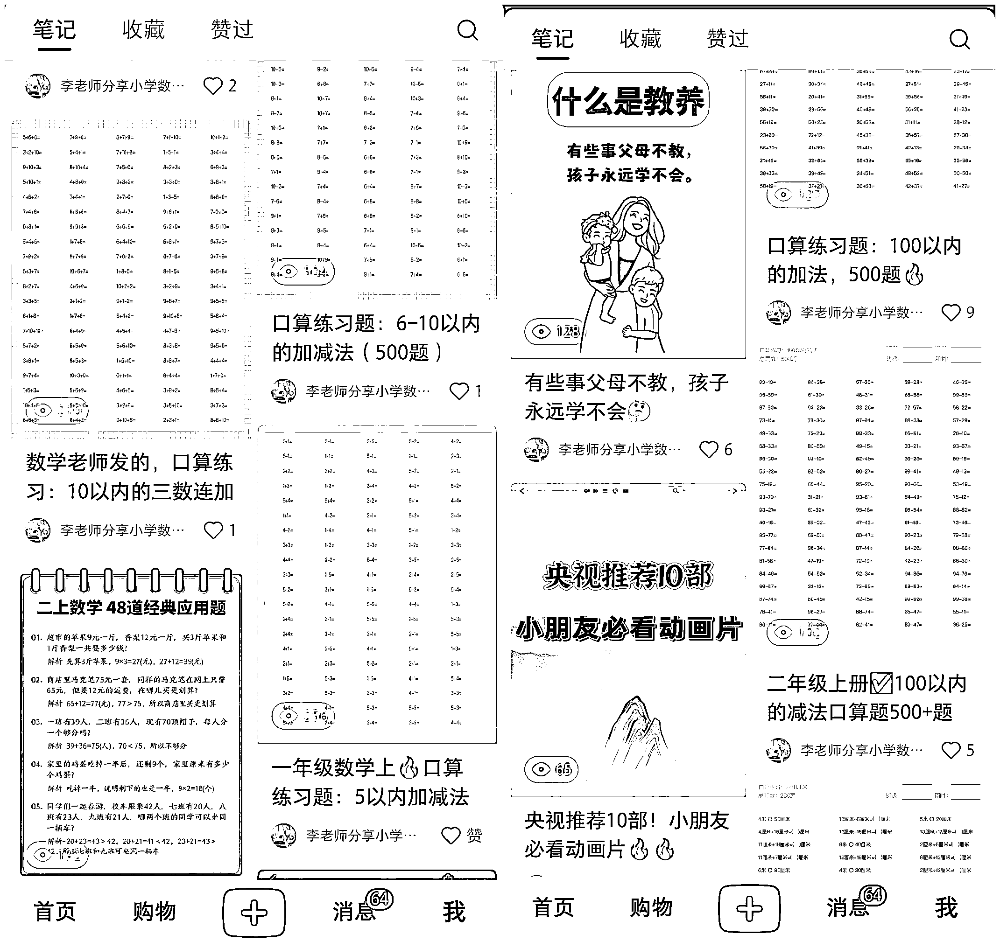
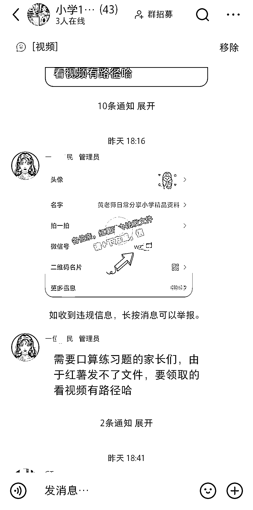
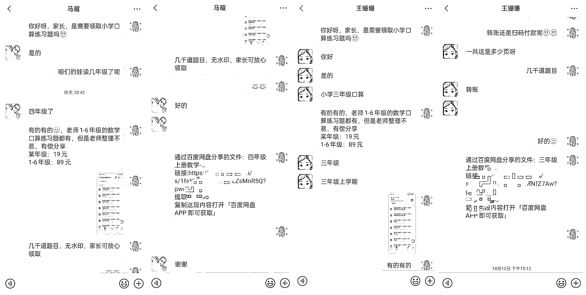
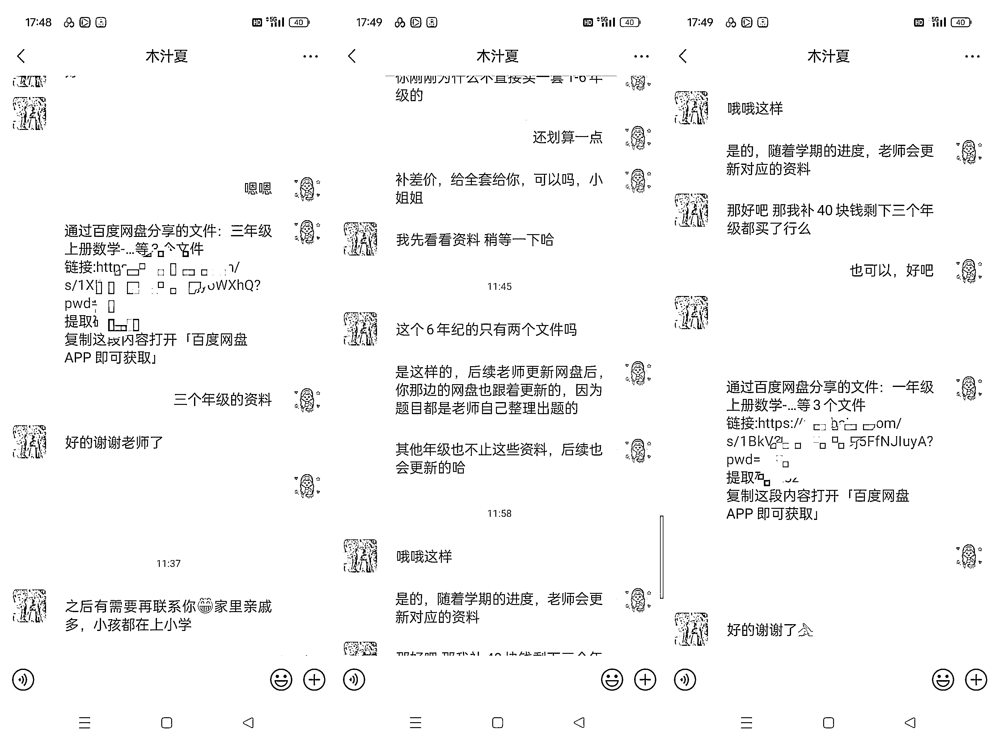

# 小红书引流-k12 教育资料，卖小学生数学口算练习题，从 0-1 实战篇

> 原文：[`www.yuque.com/for_lazy/zhoubao/ilg3xe5o7l4uinni`](https://www.yuque.com/for_lazy/zhoubao/ilg3xe5o7l4uinni)

## (72 赞)小红书引流-k12 教育资料，卖小学生数学口算练习题，从 0-1 实战篇

作者： 馆主

日期：2024-10-15

**哈喽，大家好呀！这里是：知识前线馆，你们也可以叫我：馆主，今天给大家分享的是，小红书引流，卖小学生口算练习题，这篇文章是我前几天写了一个风向标（中标）了，然后一些圈友链接我，请教我怎么做的，还有就是成交的话术是什么，为什么成交的概率那么大，为了解决圈友们的疑惑，馆主今天把思路-
话术都细心的写出来分享给大家。**

**  **

**自我介绍：**

**昵称：知识前线馆**

**年龄：00 年**

行业：地推拉新/小红书引流

加入生财的时间：2024/6/23

**这里跟大家聊聊我是怎么加入生财的** ，我 2022 年出来社会的，到深圳打工的，那时候进厂打螺丝一个月才 5000 块钱，然后打了两个月，实在熬不住，回老家躺平了半年，这半年的时间里面，测试过好多有趣的项目，接触最多的项目是编程，那时候第一个编程语言是：python，然后自己用 python 套用别人的一个模板写了一个自己的博客。

第二个编程语言是：网页三剑客（H5+CSS+JS），然后结合 python 搭建一个前后端完全属于自己的博客。

然后就到某平台上面接单，然后接了两个大学生的博客单子，赚了人生中第一个互联网项目佣金：200 元。

后面接触深一点想当黑客，再 QQ 群里面认识两个大佬，一个台湾的一个大陆的，两个大佬提供了一些资料给我学习，学了两个月半桶水，就去找单子，后面才发现这种单子要特殊渠道才能接触，后面就放弃了。

不过也没亏啥，反而让我对计算机有了更深入的了解，不过我有两个遗憾就是没能，写出一个属于自己的操作系统和浏览器，那时候深入到系统内核研究了，国外有半成品的系统内核，如果那时候深入一个研究，说不定就能研究自己的自定义操作系统，浏览器是谷歌，开放一个源码，可以自己定义一个属于自己的浏览器。

就这样在家浪费我半年的时间，2023 年初，被家里人赶出来打工，再广州漂浮了一个星期，遇到了一个初中同学，然后跟他吃一顿夜宵了解到他再做地推拉新 app，这个赛道感觉吃香啊，然后两人两手一拍，每个人拿出 500 块钱，加起来有 1000 块钱，买小礼品和桌子，就再广东各大跑，一开始平平淡淡的一个月还能赚个月入过万，后来 10 月份去清远找场地，遇到一个好商场扎根两个月，打了 60 万流水利润对半，赚到钱了过个好年。

2024 年初，继续干地推拉新，第一个月还好，第二个后就一直亏本，亏到 5 月份的时候，我直接说解除团队，那时候我带七八个人嘛，然后没钱发工资，就宣布破产，去年赚的几十万，就都亏没了，还倒欠几万块钱，**然后又回老家躺平，身上只有 5 千块钱，再微信群里面看见有人发生财星球的海报，一看，我靠价值过亿的社群，里面的价值一定很大，然后果断加入，** 加入后，在里面迷茫了一个多月，因为感觉好乱，太广泛了，后来慢慢研究和使用才正常了解了生财的价值和项目所在，9 月份开启了一次航海，我赶上了航班，报名：小红书引流-
教育资料篇，通过手册和教练们的分享，我 4 天时间就跑通闭环，然后 14 天对整个引流私域的知识点倒背如流，也梳理了属于自己的引流私域思路，今天我就按照航海的步骤来把我的经验分享给圈友们。

**一、确定赛道**

不过我们做什么项目，第一件事就是确定赛道，好的赛道大于努力，但是我们要先了解赛道才能去选择赛道。

什么是 k12 教育呢？K12 教育通常包括以下几个阶段：

1.  **学前教育** ：包括幼儿园（Kindergarten）和学前班（Preschool）

2.  **小学教育** ：通常包括 1 至 5 年级，针对 5-10 岁的儿童

3.  **初中教育** ：包括 6 至 8 年级，针对 10-13 岁的学生

4.  **高中教育** ：包括 9 至 12 年级，针对 13-18 岁的青少年

这里咱们选：小学赛道，但是小学赛道里面还可以分更多的小赛道，然后再某个小赛道里面我还可以继续分支出更小的赛道，这里用一张图来展示：

看上图，有很多种小小赛道，这里我们选择：小学 1-6 年级数学口算练习题，如果你们是做其他赛道也可以用工具把赛道细分开了，然后你是个人运营的，馆主建议你们挑选一个小小赛道执行就行了，咱们个人执行不就是为了快速赚钱吗，选一个小小赛道把所有时间和精力都打到一个点上，我们才能成功，而不是贪图做大。

赚到钱后，买设备买手机卡，扩大，然后再增加赛道（奥数+应用题）。

**二、整理产品(搭建资料库)**

咱们这个小小赛道的资料库很简单，到淘宝/pdd，微信小程序等等都可以收集的到，如果你们实在找不到，欢迎来跟我要。

**三、搭建账号**

什么是账号？账号相当于你在互联网上的一种身份，你是做什么不重要，但是看起来像是做什么很重要。

咱们做 k12 教育卖资料的一定要把账号包装成：老师，让家长看起来你是一名老师，很多圈友会说馆主，我不喜欢骗人啊，停！这不是骗人，我们只是给网络上的我定义一种身份而已，我们没有行骗，家长发钱我们发资料。

**1、微信账号包装**

这里馆主就不写怎么注册微信了，如果你有两个微信，可以拿其中一个微信来跟着馆主操作，如果你没有微信，那你可以去注册一个微信，不懂就百度一下。

微信账号有以下几点包装：

名字：黄老师，，，，我们可以写 xx 老师都可以

头像：到小红书上搜索，教师头像

个人签名：老师整理资料不易，有偿分享，介意勿加！

朋友圈背景墙：[生财有术网页版
(scys.com)](https://scys.com/view/docx/SVEVdThISoz7CbxhZ2ucCTcanZg#doxcnE9H2zxaICl8teV9lzEwwNh)，手册里面有

**2、小红书账号包装**

注册小红书跳过，直接来看账号包装：

注册好账号后，点击我的界面，然后点击：编辑资料，然后就修改个人主页

**四、制作作品（爆款+引流）**

账号搭建好后，下一步就是制作爆款笔记和引流笔记，咱们这里使用 1+1 法则。

什么是爆款笔记，如何制作爆款笔记？

我们可以去小红书搜索：家长讨论话题性笔记，就是：怎么怎么，为什么什么，这种笔记 99%的号发都会爆，如果爆了，看过你这篇笔记的家长，你下一篇笔记发送的时候，会推送到这些家长首页，所有馆主都是第二篇发引流笔记。

什么是引流笔记，如何制作引流笔记？

就是把你资料库，你觉得有突出点的资料，截图上传到小红书，写一些让家长焦虑的文案

**五、引流私域**

客户求资料怎么办呢，咱们可以创建小红书群聊，然后再评论区放群聊链接，然后客户进群后，咱们再编一个话术：“需要口算练习题的家长们，由于红薯发不了文件，要领取的看视频有路径哈”

然后截图你们的微信个人信息，打开映剪 app，把这个图片制作成 3 秒视频，然后发布小红书群里面，顶置起来。

由于不能放微信号相关的内容，导致写的不是很清楚，但是你们知道原理就行了。

**六、成交转化**

重点来了，客户加我们，第一句话是什么呢？

我们可以这样回复：你好呀，家长，是需要领取小学口算练习题吗，客户一般会回复：是的

我们可以再继续追问，咱们的娃读几年级了呢，客户会回复：x 年级

关键的步骤来了，我们设定好一个模板 xxxxx

我在交流的过程中，要好好的跟家长们沟通，说不定还可以追加单。

**小结**

谢谢圈友们观看，由于好久不写作了，写的有点草稿，不过也算是复盘思路吧！

* * *

评论区：

馆主 : 写作水平有限，看思路和细节就行了。

一颗海星 : 感谢馆主分享！🌹

花生黄油 : 感谢分享！好干货！

乐柠 : 写的很详细，感谢分享！[强]

馆主 : 感谢坚持，等我研究出新的玩法，在写一篇精品教程

馆主 : 感谢圈友们支持，你们的鼓励，是我前进的动力[社会社会][社会社会][社会社会]

馆主 : 感谢圈友的评价，我会更努力的把小红书玩深透，在分享一篇店铺玩法[好的]

春天里 : 非常感谢分享！