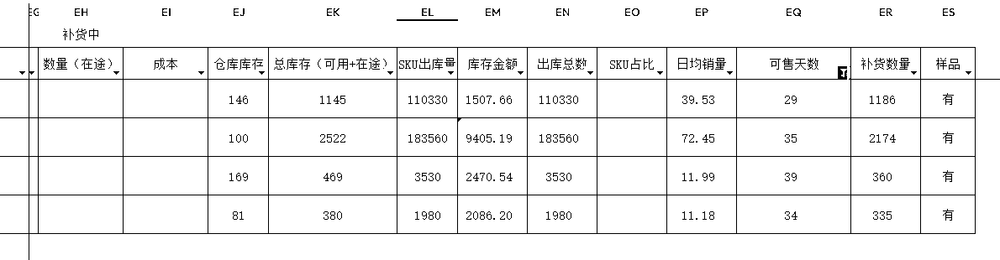
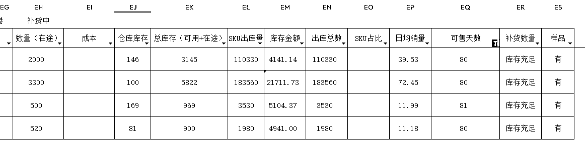
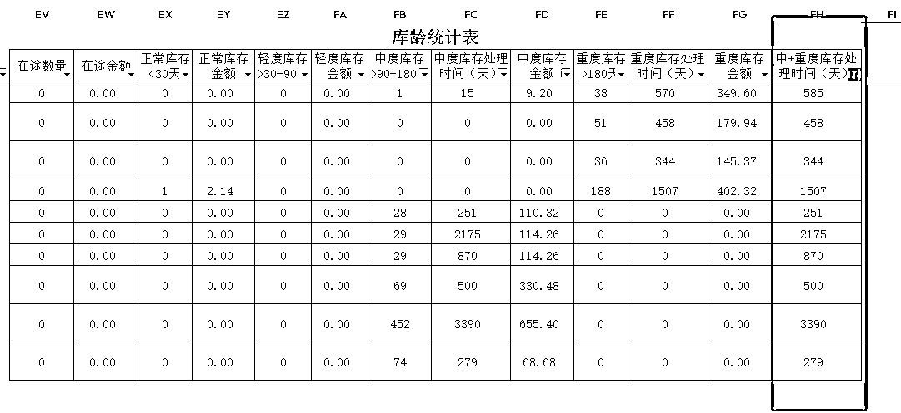
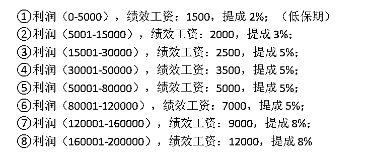
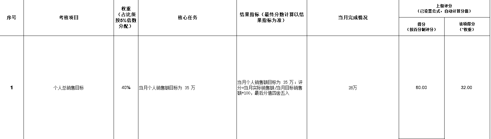
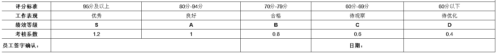

# 机遇与挑战并存的东南亚市场，如何抓住现阶段增长点？

> 原文：[`www.yuque.com/for_lazy/zhoubao/qsuabxoihzow8wsz`](https://www.yuque.com/for_lazy/zhoubao/qsuabxoihzow8wsz)

## (精华帖)(78 赞)机遇与挑战并存的东南亚市场，如何抓住现阶段增长点？

作者： 久成

日期：2024-10-14

生财的圈友们大家好，我叫久成 ，5 年跨境电商老兵+东南亚跨境千万级卖家，拥有多款 Top1
产品。都说未来几年有几大风口，跨境出海无疑是其中的一个。我们深耕跨境电商 5 年，切身体会到跨境带来的红利，感谢生财的邀请，今天给大家分享一下关于出海的一些思考和玩法。

这篇文章共 15000 字，从市场现状到 TikTok 小店起店全流程，再到本土化运营，补货管理，滞销处理方法，最后到电商公司管理给大家展开，大纲如下：

1.海外市场和平台分析

2.TikTok 小店冷启动核心原理，我们如何 3 周打爆新品新店

3.跨境电商如何实现本土化，快速放量

4.如何建立合理的库存管理和补充体系、清理滞销库存

5.电商公司如何招人选人、如何利用绩效实现飞轮效应、如何挖掘骨干

那么咱们话不多说，开始进入主题。

## **一、自我介绍**

大家好，我叫久成，连续创业 8 年。

16 年大一，在大学开始创业，在大学成立吉他工作室和自媒体写作工作室，带领近 20 名大学生月入过万；

17 年大二，做了微信淘客，并且开始在公域引流到私域，做私域返利社群，实现大学生的财务自由；

18 年大三，再次踩中风口，第一批做抖音视频带货，尝到一个人日出千单，单视频单日佣金 3 万+的甜头；

19 年，累计赚到第一个**一百万** ，时年 22 岁，拥有人生的第一辆全款奥迪；

20 年，毕业并顺利创立一家超过 20 人的东南亚跨境电商公司；

21 年，all in 跨境电商 Lazada 平台，本土无货源店群模式，400 家店铺，日单量超过 3 千单，日利润超过 4 万，年底惨遭封杀，一夜直接**亏损 80 多万** ；

22 年，痛定思痛，放弃与平台做对抗，开始**本土备货** ，做 Lazada 本土精品模式；

23 年，新增虾皮，TIKTOK 电商板块，布局东南亚全域电商，多款美妆产品，箱包产品做到马来西亚站点**top1** ，并且开始构建自主品牌的护城河；

24 年，开始赋能国内**品牌出海** ，进一步扩大供应链优势。

**因为专注，所以专业** ，这个是我们其中一个猫店的情况，多款产品做到类目 top1，上榜单的产品也有很多。

## **二、 东南亚为何成为跨境电商首选战场**

说到跨境电商，可能很多朋友第一时间想到的是欧美市场，市场大，人口多，消费能力强，赚美金赚欧元；

谈到东南亚，很多人会觉得这是一个落后，贫穷的地区，这片土地上有着很多分散的国家，部分国家不光面积小，人口数量也少，似乎和欧美这些国家根本无法相比，根本不在同一个体量。

但是最近这几年时间，越来越多跨境电商的卖家，尤其是新卖家，纷纷涌入东南亚市场，将东南亚作为入局跨境电商的首选战场，这是为什么呢？

### **1****.** **海外市场分析，东南亚电商增速全球最快**

**· 当前东南亚电商市场正迸发出无穷的潜力**

**  **

东南亚电子商务市场从 2010 年开始加速增长，直到新冠又将其推入了一个更高的新阶段。

根据 eMarketer 数据显示，2023 年全球零售电商市场增速排名中，东南亚以
18.6%的增速排名第一。而增速最快的十个国家中，东南亚国家占据了一半席位，菲律宾、印度尼西亚、马来西亚、泰国、和越南均进入榜单。预计到 2029
年，东南亚电子商务市场规模将达到 1912 亿美元，2024-2029 年的年复合增长率为 10.42%。

放眼全球，欧美的电商市场已经趋向饱和，对新入驻商家的要求越来越严格，反观东南亚电商市场，高速的增长意味着普通人将会拥有更多的机会。

**· 东南亚主要的电商平台其实更加适合有着中国体质的电商人**

**  **

不管是 Shopee，Lazada 还是 TikTok 小店，都流淌着中国资本的血液，基本都在使用着中国电商的逻辑和规则。

当打开这些跨境电商店铺的后台的时候，我们会发现界面和部分的功能和国内的电商平台差不多，使用的是中式的思维逻辑，对于新卖家来说，难度会更低。

**· 在商品出口贸易这一块，我们有绝对的优势**

**  **

东南亚国家制造业不强，当地的工业产能较低，我国又是世界工厂，种类齐全，性价比高，是当地人对我国的产品青睐的原因。

**· 做东南亚市场的门槛会比欧美市场的低一些**

**  **

东南亚的仓储，人工，物流等成本都会比欧美国家的要低，因此所需的启动资金不需要太高。

### **2****.** **东南亚三大电商平台对比，TikTok 快速崛起**

在东南亚这片土地上，各大电商平台展开大乱斗，其中以 Shopee，Lazada，TikTok 为其中的佼佼者。

**· Shopee**

2015 年成立，作为腾讯系的它率先进攻东南亚市场，仅仅用了 4 年时间，就打败 Lazada，成为东南亚地区规模第一的电商平台，巅峰时期，其母公司 sea
市值一度超过 2000 亿美元，风光无限。

**· Lazada**

在 2012 年更早成立的 Lazada，虽然在与 Shopee 的多年较量中落败，但它作为阿里海外布局中非常重要的一环，阿里一直对其寄予厚望，从 2016
年开始，阿里每年平均向它注资超百亿元。这些年下来，Lazada 也牢牢守住了老二的地位。

**· TikTok**

TikTok 作为东南亚“当红炸鸡子”，它的成长速度，快得惊人。

2021 年，TikTok 率先进入印尼市场，开始摸爬滚打。一年过后，TikTok 成功开通泰国、新加坡、越南、菲律宾，马来西亚这些东南亚国家。

2022 年，TikTok 在东南亚的 GMV 达到 44 亿美元，实现了 3 倍增速。这还不够，2023 年 TikTok 又把这个数字翻了 4 倍，实现
163 亿美元的 GMV。

TikTok 进入东南亚后，吸引了大批来自 Shopee 和 Lazada 的跨境电商卖家，试图抢占新兴平台的红利。当然，TikTok
也是诚意满满，在初期不收取商家佣金，并给予消费者诸多补贴，如免邮费、优惠券、满减券、一分购等。

晚起的鸟儿却吃饱了虫子，相比之下，成立于 2012 年的 Lazada，空间却逐渐被挤占，第二的地位怕是保不住了。外媒直言，TikTok
的电商业务将超越阿里旗下的 Lazada，成为东盟地区第二大电商平台。

**眼下的东南亚电商市场，仍然是一片值得挖掘的热土，TikTok Shop 的快速崛起，也重塑了东南亚电商格局。** 如果按照目前的发展速度，TikTok
Shop 想要成为整个东南亚电商市场的最大的电商平台，也只是时间问题。

TikTok 照搬国内抖音的路子，做兴趣电商，主打一个“货找人”的错位竞争，给尚未经历电商经济太多洗礼的东南亚，一些巨大的震撼。

TikTok 在电商业务上线前就在东南亚市场拥有巨大的用户数量。根据 TikTok 官方数据，截至 2023 年中，TikTok
在东南亚的月活跃用户总数达到 3.25 亿。

换句话说，TikTok Shop 站在巨人肩膀上，有先发的流量优势。整个东南亚的人口结构又趋于年轻化，30 岁以下占比超过
50%。年轻人爱刷短视频，对新鲜事物的接受度又高，正中 TikTok Shop 下怀。越来越多人开始在沉浸式刷短视频和直播的时候，无意识购物。

### **3****.** **拥抱风口，TikTok 小店冷启动核心原理，3 周打爆新店新品**

在过去的五年里，我们经历了 lazada 店群日利润超 4 万的辉煌、经历了疫情时期发不出货死店的阴霾、经历了平台大封店一夜之间亏损 80
多万的打击、经历了选品测品打品的不断试错、经历了品牌搭建和推广受阻的阵痛、经历了 shopee 测评即封店的无奈、经历了多平台运营快爆的喜悦。

随后 TK 小店开始陆续在东南亚上线，于是我们快速入场从联盟带货做起，无人直播赚了一波，半无人直播试了一阵，全真人直播产出为负。

在经过多方尝试之后，我们开始做本土 TK 小店，前期上架就出单，后来竞争逐渐激烈，我们不断测试不断学习和优化我们打法，测试出一套冷启动流程（在此感谢
peter 老师的启发），如何从 0 开始做一个店铺，今天分享给大家。

### ① 了解 TK 算法的底层逻辑

首先我们要知道 TK 算法的底层逻辑，以及怎么做店铺或者做账号能够破解 TK
的流量，实现“**让流量来找你，而不是你去找流量，我们来不追流量，而是让流量来追我们** ”的效果。这里面有三个核心：

**· TK 算法是追强弃弱，只有强者才能分配到流量**

TikTok 里，一切都是数据说了算。从零开始做店的过程中，商家在前期一定要想清楚的一点是：我们会决定要烧钱还是烧货。

很多人决定的是要烧钱，但其实烧钱的方式没有办法做强数据。

**· 烧钱和烧货的区别**

烧钱就是烧广告，用投流去撬动流量，这里存在一个不确定的因素，因为无法预估投产比的多少，而且投产比是有上限，不是说投得越多效果就一定越好，会存在一些潜在的变动。但是光烧钱的话，第一是对直播间对素材的要求很高，第二是产品的价格、评分等因素也会影响到转化率，导致店铺的数据没有办法得到明显的提升。

也就是说烧钱存在一些不确定性，而且是会有上限的，但是烧货的话只要预算充足，会更具有确定性。

而烧货的意思，简单来说就是货损，原来 10 块的东西，我做福利 1 块送，送 10 个送 20 个送 100 个，只要产品没有问题，都能送出去的，假如每件产品的货值是 5 块钱，送 100 件也才 500 块。每个人都是喜欢贪小便宜的，所以这 500 块钱可以给我们的店铺带来更多的商品点击和更高的转化率，这是确定性很高的一件事并且是可以让我们的店铺有一个高速增长的数据趋势。

所以我们选择的是烧货。通过烧货来快速的拉爆店铺，烧货的速度会让“店铺的转化率”和“分钟的成交 GPM”都会达到最高。

这个目的就是告诉 TikTok 的算法，我是在这个品类里新崛起的黑马，我在 7 天的数据，在下个 7 天的数据，在每一个 7
天的数据里，我每周都在增长，每次增长都超过百分之 20。马上 TikTok 就会自动来追你，他会把流量分配给你，而不是你去买流量。

所以说这个是我们起店最重要的一个核心原理，后面会讲到我们是怎么做的实际操作的。

**· 算法是基于机器学习，垃圾进，垃圾出**

算法是一个机器学习的过程，无论是短视频、直播还是商城的流量它都在不停地学习。所以想要获得精准的流量，前提是喂给算法足够多的有效数据，**让它快速学习到，我们要找什么样的用户，标签是什么。**

垃圾的标签一个都不要。

我们做电商的，不需要搞笑的流量，也不要去想像那些拍的视频能够爆个 100 万的播放量，那些都不需要，我们要的是虽然只有两三千的流量，但其中有 20%
的流量是愿意停留并且点击商品链接的，只有点击链接的才会是被识别为电商的标签用户。

我们要筛选掉所有不相关的用户，然后不停的让算法学习我们需要什么样的用户。

**· 算法是统计学，你不是跟所有人在赛马**

第三个核心就是，算法是一个统计学。统计学是不会把 T1，T2，T3，T5 这些不同达人、不同的店铺放到一起去比的。

因为我们不要看最 Top 达人的销量，也不要这个行业里最 Top 店铺的流量，因为我们在前期启动时不会跟他们比，而是在跟同级同类目的新店一起比。

**注意：我们在做数据的阶段，每一个阶段都要记住：我们是跟谁在比？TikTok 他想要什么？我们把什么数据做出来就赢得了这个流量赛马。**

### ② 了解店铺跟主账号的关系

**· 店铺 = 数据中心**

很多中国的商家在做 TK 小店时，都会趋向于只做投流，但其实只做投流的话，账号会碰到上限的问题。也就是 说，TK
的广告户也是一个机器学习过程，如果在这个过程中，我们的消耗效率或流量效率是低于别人的效率时，我们就跑不出量了。

所以说，我们要做的是：以一个店为数据中心，通过 4 个流量口子（直播，短视频，商城，投流）在同一时间，稳定的、平衡的把流量打开。

这样形成的流量架构会非常漂亮，而且不用担心某一天销售额会突然下降，为什么？因为我们是三角形流量架构（直播，短视频，商城）在撑着这个店铺。

**· 主账号 = 流量标签**

主账号是最重要的账号，因为 TikTok
算法是把这个店铺作为所有成交数据的中心，所有的分数，包括发货数据、质量分、服务分等都在里面。而店铺的分数影响是店铺或商品在商城跟搜索展现排名。

那么店铺分数怎么做上去？它最重要影响的就是你的主账号的流量标签，以及你的主账号绑定这个店铺的成长的增速，成长增速比绝对销售额更重要！

**在 TK 上面做生意只要记住一点，他要的是追潮流。**

什么叫做潮流？

就是我有一个每周店铺增长数据是在上升的账号，它卖的东西跟平台用户的关系是属于正在上升的阶段，比如商品卡浏览数据、点击率、转化率等等各项数据都是呈上升曲线。

所以平台会把流量推送给到正在上升中的店铺，而不是绝对销售额最大的店铺。**因此我们关注的不是销售额，而是每一个数据的增长的百分比。**

他只要有高过大部分的同级别商家的增长速度，你就会发现流量会越来越精准，流量会越来越多。

**· 网红达人 = 人群筛选器**

网红达人永远不会是店铺的主流量，但是对一个新店铺来说又是至关重要的部分，为什么？

因为网红达人的链接是一个反向筛选的链接，通过大量网红达人的粉丝关系（用户通过达人的账号点击进店铺），它可以把我们的店铺标签初始数据再筛选一次。

这样它不会影响我们的主账号，但会直接影响店铺的流量精准性，也会间接带动商城的搜索和自然流量的展现。

**所以网红达人营销是前期开店时，第一天就必须要做的。**

**· AD 广告户 = 销售额放大器**

广告户也很重要，它是你验证过的销售额增量的放大器，它可以把你的销售额放到非常大，我了解到很多人遇到的主要问题是：这个广告户放不了量，后面有机会我也写一篇文章和大家详细分享一下我们是怎么去做广告放量的。

### ③ 冷启动前两周：理解三个流量主体的算法核心及方法

这三个流量主体是：

1.  店铺权重，决定商城的排名；

2.  视频账号权重，也是主账号的权重，决定视频初始的流量级；

3.  直播账号权重

这三个流量主体其实都是通过一套机制挖掘出来的。

这三个流量主体是分开的，有不同的权重，但又不能分开做，我们需要同时增长三个权重。我叫它**直播视频商城三角流模型。**

TikTok 是一个基于结果导向的平台，当我们开了一个新店，数据为零，这个时候 TK
是不会冒险把好的用户分配到一个新开的店铺里的，因为平台并不知道这家店会不会发货，不知道货是否有问题，是不是卖假货？

所以冷启动期拿到的流量，一定是垃圾流量，垃圾流量就是垃圾人，这些人里 99%
的人很有可能是不会买东西的。这个期间（尤其是前三周）主要测试的是留人能力，这个时候它不要求成交，要求的是我们能不能把他推来的垃圾人留下来。

所以我们在冷启动期就用到了三角流模型：

1.  首先直播端拉 2 小时直播时长，穿插每十分钟做福利；

2.  其次每天做 20 个小视频去撞广告；

3.  还有定向邀约达人。

接下来分别讲讲这三部分我们怎么做的。

**· 第一点：第一周我们直播做了福袋抽奖，每个进来的人都有机会抽到一个商品。**

**提高留人的能力和平均时长**

我们每 10 分钟放一个商品出去，总共拉了两个小时，共送出了约 12 件客单价约 15 元的商品。这 12
件货主要作用就是把贪小便宜的人留在我的直播间，用来提高数据的展现，包括留人的能力和平均时长。

**商品点击率**

最重要的一个数据叫商品点击率，怎么提高呢？

因为你知道这些留下来的人都是想贪小便宜的人，所以在点福袋的时候，我们会弹出一个要求，让他写一个留言：在第 3 号链接有福利。

那么这些贪小便宜的人参与福袋的这 10 分钟同时在留言给后面的进直播间的人看，引导他们去点第 3 号链接，间接的就把商品点击率拉到了 26%。

这个对于 TK 来讲是很厉害的数据了：

1.  进来的人的平均停留时间超过 1 分钟，代表他对你的内容是感兴趣的

2.  进直播间的人，有 26% 的人都去点了商品卡，代表你卖的商品性价比是有保障的，你有可能成为一个爆款。

让 TikTok 的算法认为你就是专门做一个超级爆品的，一个有潜力的网红商店。

**· 第二点：每天做 20 个短视频去撞广告**

我们是怎么做的呢，其实就是一条主线：找一个老外模特做了一条配音，然后混剪，再用 AI 生成 20 条完全不一样的，有差异化的钩子内容，我们给到 AI
一个版本，让 AI 围绕着这个版本产生 20 条短视频，然后撞广告。

每条视频建 10 - 20
个广告组，让不同的广告组去跑不同的测试流量，因为这样才不会把它们放在同一个卡片里，使得不会重复触达同一批用户。然后，找到一条能够跑出量、跑出高投产的广告组进行复制，再复制
10 个不断测流量。

再来说一下视频内容：**不要急于去讲解介绍产品，一定要放大效果，直击痛点。**

而且前 5 秒是非常重要的，在视频关键时间也要去引导用户点击商品卡查看详情，这样广告就能跑得出量。

**· 第三点：达人邀约**

同时我们也在做达人邀约。前面我们说过了达人端属于反向链接，那我们是怎么玩的呢？

我们最核心的达人，其实就是已经帮我的竞争对手出了单的达人，通常我们会用一个数据工具，先找到行业里卖得最好的店铺，然后去把近 30
天帮他带过货的达人名单导出来，他给 8%，我们就给 15%，把他的达人给“偷”过来。

**冷启动期前两周我们一定要耐得住寂寞，做直播或者做任何的店铺数据，主要做的就是停留 +
点击，只要把这两个做起来，基本上流量就会开始变成真正的电商流量，也就是说用户开始会买东西了。**

### ④ 测试期和打标期

下一个阶段叫做测试期和打标期。

**打标期就是某个时候开始，算法愿意来打标签了。**

这里要记住一点，目前平台有太多烂的店了，所以在这个地方 TK 会先过滤掉一些烂店。比如英区有 6 万多家店，真正能卖货的可能不到 10%，也就是说不到
6000 家，6000 家里面能卖的好的店铺可能不到 600 家。

那么 TikTok 希望的是不要浪费时间在这 59000 家的店铺里面，它要的是成交速度，所以会把 80% 的流量很小心的分配给能够成交的店铺。

在冷启动期，很多人起不来的原因就是被放弃了，被当成了烂店，平台不敢给店铺流量了。所以前期一定要先做数据，做停留，做商品卡点击率，其中商品卡点击率我们是用网红来做的，测试出来是最有效的。第二个就是打标，打标期通常在一周。

10
天后，店铺数据做的差不多了，就会进入标签期。在标签期我们会发现有个特点，就是进来的人开始讲话了。用户会说：“哎，这个东西拿出来给我看一看”。这个时候我们就知道
TK 开始放我们的标签用户来测试转化率了。

这个时候 TK 要的是什么？很简单，TK 同时给 1000 个流量到两个直播间，通过这 1000
个流量来测试我们的转化能力，转化能力里面包含了转化率，以及最重要的 GPM（用 1000 个流量所产生的销售额）。GPM
越高的直播间或者店铺流量会越来越精准，越来越大，TikTok 会不停的给它放量。

**当我们一进到标签期，一定要记住我们做的是转化率。**

**  **

所以在这里面我们要做的数据是什么？是 5 分钟转化率。

那是我们用的方法什么呢？我们用的方法是做福袋。

我们现在会把一个 10 块钱的东西瞬间降价到 1 块钱 ，也就是说，当我先用一个福袋把直播间拉到了 200 人 - 300 人在线时，必须要成交 8-10
单来让转化率瞬间达到 5%，5% 的转化率会超过大部分的同期的直播间，这个时候 TikTok 就会开始推大量的电商的人群进来。因为直播间可以成交，TK
会把好流量推给能成交的直播间。

那下一步我们怎么做？

我们会先做一次免费赠送，一单商品拉上来几百个人，然后立刻做一波 1 块钱快速转化，牺牲大概 10 件货的成本共三五十块钱，去拉快速转化。

这时候直播间会一下子拉到有一两百个有效人数，我们就开始卖主推品，主推品能够成交 10-20 单，每单大概 25 块钱，就可以产生大概 250 - 300
块钱马币的成交金额。

然后再重复做这一次，每一次花二三十块钱的货，去换取三五百块钱的销售额，这对我们来说这就是一个大约 10 倍的投产比例，比广告费还划算。

**我们在直播间从来不投广告，而是投货，用货来算投产比。**

所以我们做店的，其实不外乎是一直在算有效渠道的投产比，我投广告现在可以到 1:8、1:10 或者投到 1：5 都是赚钱的。那么算一下，货的成本是 3 折 4
折，那投到 1:2.5 以上都是赚钱的。它跟广告一样，如果你的投产比是超过 5 以上，那么你就可以死命的投货去换取销售额。

那么针对达人也是一样的，达人也是三个产品。也就是说，**成本价给达人一个样品，我们要算的出来的是，他能帮我们卖几单零售价的商品。** 这样就可以算出来投产比是六倍，八倍还是十倍。

我们当前的样品的投产比是 30 倍，比如我投了 1000 块钱的样品出去，通过达人卖出了 3 万块钱的货，这就是 30 倍的投产比，是非常划算的一个投产比。

### ⑤ 一个月后：放量期

过了一个月，店铺已经进到放量期了，我们会发现进来用户全部都是有效的电商人群，这个时候考验的就是供应链能力了。

**需要经常有新品上架，老客的复购跟新客的转化都同时要兼顾到，才能够持续的有流量。**

这里重点做数据做的是店铺排名。在做商城流量时，店铺排名的权重决定了展现排名，那这个时候我们通常会研究 shop tap，在 seller center
里面有一个叫搜索关键词。

搜索关键词非常重要，我们通常会把相应的关键词植入到短视频和产品页中，拉高搜索的概率。

那么怎么做到稳定放量呢？也就是怎么做到每天超过 5000-10000 的一个销售额呢？

就要靠反向链接。

当我让一个大网红帮我发一条视频，他发出去以后可能有 30 万的播放量，可实际的成交可能只有 300 块钱，那么我得到的是什么？

除了得到这 300 块钱的实时成交，最重要的是我触达到了这 10 万的标签用户，只要这个用户停留超过 5
秒钟且在我的商品的链接点击了，或者在这条视频上停留超过 5 秒钟，那么 TikTok 就会在未来的 7 天不停的追踪他，不停的把我新推出的视频定向推送给他。

所以我们叫这个为反向链接，反向链接越多，商品卡的自然流量就越高。

这个是绝对值得投入的，我们可以用反向链接 + AD 持续放量。

## **三、做好东南亚市场，要坚持本土化战略**

### **1****.** **本土化是必然趋势：依托优势，快速放量**

很多平台，例如我们现在做的 TIKTOK、Shopee、Lazada 都有跨境和本土模式，这两种模式有什么区别呢？

1.  跨境店，就是可用国内执照注册的店铺，在国内选品，上架后通过空运发货到国外，如果你没有货源就从 1688，拼多多等平台采购，一件代发。它听起来简单，门槛低，但是流量小、时效慢、运费高、小白较难拿到好的结果；

2.  本土店，就是当地的个人或企业资料注册的店铺，产品备货在国外仓库，上架后直接从当地海外仓发到消费者手中，它时效很快，大概两三天就能派送完成；其次由于政府扶持当地商业，流量很高；再者，目前平台有运费补贴和免邮活动，所以不需要运费；玩法很多，**天花板很高** ，就连小白也很容易拿到好结果。

同样的产品，本土店**大批量备货** 走海运入海外仓，运费成本低，售价低，2-3 天送达，跨境店因为**单件发空运** ，运费成本高，售价高，8-9
天送达，你是消费者，你怎么选？

通过以上的介绍，大家明白了跨境店和本土店的区别，显而易见，本土店的门槛更高，风险更大，既要海外仓资源，仓储和物流资源，又要不断把货压到国外，但竞争更小，收益也更高，换句话讲就是，**风浪越大，鱼越贵** ！

我们在 21
年就开始布局本土，利用本土模式，流量大、时效快、运费便宜等优势，迅速打造数个百万级的店铺。每个跨境电商的平台为了让用户能够享受极致的购物体验，未来不管是哪个市场，都一定会趋向本土化，在可以选择的情况下，没有人愿意花更多的时间和更多的金钱去买一个同样的东西。

### **2****.** **备货关键点：建立合理的库存补充体系**

上面谈到本土化是必然趋势，那就意味着我们需要把货备到国外去，这一步就非常关键了，也是我们做跨境电商中最考验资金链的环节。

我们把货发到东南亚，都是大批量发的，所以选择走海运的方式，海运有着载货量大，价格便宜等优势，但是劣势也比较明显，时效慢，（不同的国家时效不同，大概在
15-30 天，偶尔遇到海关查验还需要再多等几个星期）。

正是因为有海运的这一过程，所以本土备货就更具难度了，也导致很多想做跨境电商本土的卖家止步于此，那么我们该如何建立合理的库存补充体系呢？下面我分享一些我们自己的经验。

1.  **测款过程**

这里我就默认大家是有海外仓或者有合作的第三方海外仓的了。

当我们选好品之后，就要开始备货了。因为是新品，没有自营的基础数据，我们无法估计备货过去以后的销量，也有可能会滞销，所以是需要测款。

具体测款的时候每个新品要发多少件过去呢？这个根据产品类目和市场容量的不同是有所差异的，像马来西亚的话，我们新品第一批会先发 200-1000
个，像菲律宾的话，就会发 400-2000 个。

我们这个测款的方式更多是适用于普通的中小卖家，如果是大资本卖家这个就可以忽略了，资本的玩法基本都是选好品，直接就备几个柜过去了，用极致的价格优势快速打倒同行。

1.  **常规过程**

当我们备货的产品越来越多之后，里面是一定会有一些表现不错，持续出单，甚至爆单的产品，这时候就需要开始后续的补货。

**我们库存补充的关键点是：提高频率，按需定量。**

提高频率：我们现在每周都会发两次海运，为什么要发两次呢？首先各大船司走东南亚航线的基本都是一周两水，再者是因为每周发两次，一个月八次，相当于把“鸡蛋放在多个篮子里”，避免某一批次的货物遇到海关的查验或者其他突发情况，导致库存不能及时跟上。

按需定量：则是需要我们根据产品的实时数据去备货，我们根据的数据是产品的加权日销量（7 天平均日销量 50%+15 天平均日销量 30%+30 天平均日销量
20%）。

为什么要使用加权日销量呢？我们之前是根据产品的月销量去备货的，后来发现，有些产品是近期突然就爆起来了，也就是说这款产品前面 20 天是不温不火，后面 10
天突然开始火起来了，如果按照简单的月销量去补充库存的话则会有很大可能错失一些潜在的爆款。

这个日销量一般的 erp 或者 wms 系统都可以直接导出来，或者自己做表格计算。

1.  **实操案例**

然后我讲一下我们具体是怎么实操，拿我们自己的表格里面的其中几款产品来举例。

**补货的时间节点：** 总库存（在库+在途）/日均销量，也就是可售天数只要低于 40
天的，表格会自动上红色阴影，则提醒我们需要马上安排补货了，因为按照当前这个产品的销量情况，再卖 40 天，就会断货了。

我们为什么要定 40 天这个分界线呢？国内大部分供应商有现货的情况下，一般 5 天左右都能送达，然后海运周期我们保守取平均算 25 天，则这里就已经需要
30 天时间了，最后我们再多预留 10 天的时间以防意外情况的出现或者是需要工厂定制生产的产品。

**补货的数量：** 上面讲完了需要补货的节点，那么我们该补多少的数量呢？还是拿我们自己的表格里面的其中几款产品来举例。

在上表的第一列填入我们补货的数量，然后看总库存（在库+在途）/日均销量，我们要让可售天数大于 80 天。

为什么要大于 80 天呢？前面说了 40 天为一次保险的备货时间周期，则 80
天就是两次备货时间周期，这样子做的话，基本上前面的库存差不多消耗完，新的一批就能够及时补充。

动态补充，再加上每周两次的补货频率，就可以最大程度减少出现断货的情况，而且库存的压力和滞销的风险也能相对做到最小。

### **3****.** **轻中重度滞销库存的标准制定以及对应处理办法**

有些朋友做跨境电商，每天都在嘎嘎出单，但是一年过去了，却发现没有赚到钱，这是为什么呢？

因为他们没有关注滞销的问题，日积月累，越来越多的产品变成了滞销的库存。这些滞销产品无法流通，无法产生它应有的价值。

其实在我们真正去做跨境电商并且是本土备货的情况下，滞销的情况是无法避免的，会有一些产品是选品的时候没选对，也有一些产品因为出现大量竞品，导致销量下滑，或者是某些产品的热度突然下降，导致销量断崖式下滑。

只要是做本土备货模式的跨境卖家或多或少都会遇到这样的问题，有滞销其实不可怕，可怕的是我们放任不管，或者无从下手。那么我来分享一下我们的处理方法，希望能给大家带来一些启发。

**首先，定标准。**

咱们不能凭感觉就去定义什么产品是滞销品，一切要以数据说话，用标准化的流程去定义什么产品是滞销品。

这边引入一个名词叫库龄（产品入仓的第一天算起）。我说一下我们的标准：正常库存：库龄<30 天；轻度库存：30 天<库龄<90 天；中度库存：90
天<库龄<180 天；重度库存：库龄>180 天。

**其次，有了标准之后，根据滞销的情况制定对应的处理方法。**

轻度库存：分析竞品，重新定价；

中度库存：降价促销，回本即可；

重度库存：再次降价，亏本处理，在东南亚只要咱们的选品不算太差，只要低价都可以清理完。

**最后，定任务。**

有标准，有对应的处理方法后，就缺执行的人。

人性都是懒惰自私的，没有运营会主动去帮公司去清理这些滞销库存，因为清理滞销会影响他们店铺整体的利润率，也需要他们花费不少精力去做这个事情（滞销的产品都是不好卖的）。

所以我们会给运营下达强制的清理库存任务，同时制定他们每个人当月需要处理的滞销产品清单和处理金额标准，而且这一任务会纳入到运营的绩效考核中，是每月必须完成的一项。

**最后再讲一下如何进行实操**

用表格里面的一些数据举个例子，我们一般都会着重处理中度库存和重度库存。

我们会使用这个数据：（中度库存数+重度库存数）/当前日销量=（中/重度库存处理时间），这个数据可以让我们知道：按照目前不过多干预的情况，这些库存需要多少天才能处理完。

如下图，有一款滞销产品是 3390 天，如果不人工干预的话，差不多需要 9 年才能处理完。我们会把只要处理时间超过 90
天的的产品，纳入到下个月运营清理滞销的产品清单中，然后在下个月着重处理。

清理滞销这个事情一定是要长期进行的，做的时间越久了，产品越多，滞销的产品也会不断更新，**每一个产品都有自己的生命周期，平常心对待，标准化流程处理。**

让资金滚动起来，把因滞销而积压的资金释放出来，用来备更多新品，产生更高的利润！

## **四、众行致远，如何打造一支高效能团队**

### **1****.** **电商公司招人选人，是搭建好团队的关键**

我个人觉得招聘这个事情，一定要贯彻做公司的整个周期。有的朋友可能会问，明明咱们不缺人，为什么还要去招人呢？

**我的观点是：要想让公司做的久，就一定不能不招聘。**

① 人越少其实越难管理。人太少的时候公司没氛围，大家可能感觉公司不赚钱，看不到希望，每个人都有自己的小想法；

② 借助招聘，让员工感受到公司发展势头良好的信号。让员工觉得公司现在欣欣向荣，团队在壮大，每个人都有机会做别人的师傅，将来可以升职并拥有一定的权力。

③ 对公司来说，通过招人，员工的工作状态会更好，能力也能得到提升。

④
可以通过不断地招聘去筛选积累合适的储备人才。咱们做电商的，开店不可能只开一家，后续都会走向多店铺布局，合适的人才其实是可以提前储备的，以便日后给我们创造巨大价值。

⑤ 通过招聘去了解更多外部的变化，这个方法有点损，对应聘者有点不公平，但是对老板来说特别有用。

老板在招聘平台发布高薪的运营岗位，通过面试去了解你想要知道的东西。在面试了足够多优秀的应聘者的时候，你就能把很多的电商模式以及运营方法都搞明白。然后可以通过大量的信息分析，你就会知道公司里有什么地方是可以优化改进的了。

招聘的好处有很多，所以我们要重视招聘，要把招聘工作常态化，老板其实就是企业最大的人力资源官。

选择大于努力，这句话在搭建团队中也同样适用。

其实选人，很大程度上是在选择这个人的性格，每个人的性格是很难改变的，除非发生重大变故，你想想改变自己的性格难不难？所以我们在选人的时候，不要妄想去改变他的本性，这是世界上最难的事。

咱们做公司的，只要能发挥人的才能就可以了，没有必要想着怎么去改变别人。有的老板会经常抱怨新招的员工不行，那就说明招人的时候就招错了。

那么我们应该招什么样的人呢？我这里有几个建议，对大家来说不一定适用，可供参考：

（1）尽量选择有欲望的人，没有欲望的人，工作没有激情，自主性比较低，没有战斗力。

（2）运营优先招聘有潜力的小白，最好是大学本科毕业的小白，因为本科毕业，说明他的学习能力是没有问题的。

小白就像一张白纸，你让他学什么，他就学什么，让他怎么做，他就怎么做，特别好管理，也特别好带，只要公司的培训体系没有问题，一般三个月左右就能成为一个合格的运营，他也会更加感激公司，愿意和公司一起发展。

反之招聘有经验的运营，可能在其他公司做过，有一定的运营能力和经验，但也不排除是一个“半桶水”，毕竟一个好的运营，在公司里其实是挺吃香的，工资也不会低，而且店铺做的时间长，积累的权重也会很高，一般都不会轻易离职。

所以那些经常换工作，而且还是一直在找运营工作的人，就是典型的“半桶水”。招过来之后，你就会发现，他会觉得店铺能做起来就是他的功劳，做不起来就是公司的问题。因为他们的自我管理意识特别强，一般很难去管理他，他会认为你什么都不懂，他在上一家公司就是那么干的，而且这样的人一般忠诚度不会太高。

有人觉得带一个小白做运营会很难，其实不是的，运营并不是那么难，就像开车一样，不会开的时候，觉得很难很危险，但是学会之后，就会觉得特别简单，一脚油门，一脚刹车，没什么难的。

（3）尽量招聘外地人。在北上广深这些城市里面做电商，尽量不要招聘本地人，特别多的本地人无欲无求，一般家里都安排得特别好的了，所以也不会在公司里卖力，可能就是来体验一下生活。

当然也有一些很上进的本地人，但是这些人很有可能，也很容易成为你的竞争对手，因为他们有欲望，有战斗力，又有资源，人脉，而且还不缺资金，当把他培养起来后很可能成为你的竞争对手了。

反之外地人就不会有太多这种担忧，尤其是刚毕业想留在这个城市的大学生，他们渴望在这个城市里面扎根，所以战斗力会非常强。

### **2****.** **人性都是懒散的，利用绩效实现飞轮效应**

我们做所有的事情都应该先知道事物的本质和目的，那么绩效的本质和目的是什么呢？

绩效就是通过各种手段或者说方式，比如现金奖励，精神鼓励，团队肯定等，来对员工完成激励。对员工的工作成果进行评估，然后进行奖励，这个过程就叫做绩效的过程。通过激励之后，员工能够产生斗志，会更加有动力去完成工作。

所以绩效的本质就是激励，绩效的目的就是让员工拥有持续的动力，不断地给公司创造价值。

人性都是懒散的，每个人都更加希望自己的生活过得悠闲一点，舒服一点。很多人的梦想就是想要一个“钱多，事少，工资高，离家近”的工作。

那我们的绩效机制该怎么设置才能解决人性懒散的问题呢？答案是“以贪治懒”，每个人其实内心都是有“贪念”的，人的贪念无非就是：求名，求利，求权。我们要善于利用员工的“贪念”作为牵引，激发他们的欲望，改变他懒散，没有激情的状态。

建议老板们每年都可以带着你的员工去看看别墅，看看豪车，带他们去一些高档场所消费，激发他们的欲望。

在制定绩效之前，我们要先知道好的绩效有什么特点：

① 好的绩效能够引起员工兴趣，绩效奖励对员工一定要有吸引力，不然设置个几百块的奖励，员工觉得不痛不痒，自然就不会有什么效果；

② 好的绩效可以驱动员工的动力。设置的绩效目标一定要让努力的员工在能力允许范围内能够达到，否则目标太高则起不到驱动员工的目的；

③
好的绩效能够拉开工资差距，如果把绩效奖励都设置在同一水平线上，或者差距不够大的话，那也产生不了效果。员工会想：凭什么我这么努力，而人家天天摸鱼，最后到手只差个两三百？没有差距，动力就会大打折扣；

④ 好的绩效可以创造价值。如果员工拿到了绩效奖励，但是他却没有给公司创造出实际的价值，那这个绩效就是失败的，公司是亏本的；

⑤ 好的绩效可以有考核的作用，可以制定一些考核指标，然后作为发放绩效奖励的依据，进而约束员工的行为和激励员工为公司创造更大的价值。

那作为电商公司，我们该怎么去制定员工的绩效呢？

我这里就以我们公司的运营岗位来举个例子，对大家来说不一定适用，可供参考：

**（1）提高绩效工资占比，降低无责底薪。**

新入职的运营前三个月有新手保护期，三个月以后实行绩效考核制度，无责底薪降低到 2300 元（广州最低工资标准），将绩效工资占比拉到最大

**（2）绩效工资金额采用阶梯级设置。**

这个设计本质上有点像销售岗位，其实运营也属于销售的一种，我们是根据员工运营的店铺产生的利润来划分不同的绩效工资等级，运营只要做到新的阶段，薪资就可以得到明显的提高，并且给了他们努力的方向，让他们更有动力去完成工作。具体划分如下图。

**（3）绩效考核采用每月动态考核的方式。**

主要考核的指标和占比分别是：个人销售目标（40%），个人毛利目标（30%），清理库存金额指标（10%），主管考核打分（20%）。

每个月月初运营主管需要根据实际情况给每一名运营制定当月的销售目标，毛利目标，处理滞销金额指标，要求必须有进步，而且有一定的难度，但是可以靠努力去实现，然后给我审核，最后在落实到每一个运营。

**（4）绩效考核采用得分制。**

当月完成的实际情况与既定的目标的比值得出该项的得分，如下图，其中一项销售目标的得分，目标 35 万，实际 28
万，最终得分：28/35*100%*40%=32 分

同样，其他的几项也是相同的方法得出分值，最后求和得出总分。在总分的这个考核中，还有一个考核系数，这个考核系数会直接影响到绩效工资的多少。

我们运营的薪资：无责底薪 2300 元+绩效工资+提成+全勤 200 元+其他奖金补贴+社保等。假如 1 名运营，这个月运营产生 8 万的利润，然后得分是
95 分以上，那么他的绩效工资是：7000*1.2=8400 元，基本工资是：2300+8400+4000+200=14900 元；又假如 1
名运营，这个月运营只产生 4 千的利润，然后得分是 60 分以下，那么他的绩效工资是：1500*0.4=600
元，基本工资是：2300+600+80+200=3180 元；

所以，在我们公司，运营之间的工资差距是可以拉开很大的，做的好的运营，是有更大的空间可以一直不断向上突破，拿到更高的薪资。

反之做的不好的运营，我们一开始会给时间让他们去学习，但是长期得不到进步或者其他一些态度懒散经常摸鱼的运营则会因为持续的低工资慢慢被公司淘汰。

### **3****.** **发掘可以创造 80%以上的价值的团队骨干**

老板的精力都是有限的，骨干是团队的核心，我们应该把管理集中在少数人身上，把少部分的人管理好了，整个公司的管理就水到渠成了。**也就是说管理好这些骨干，就能创造公司
80%以上的价值。**

那么我们该怎么去挖掘出公司的团队骨干呢？

首先我们要知道骨干应该要有什么特点：

①
骨干必须是自己人，这里的自己人不是说是自己的亲戚或者是朋友，而是他要认可你，在思想上像你靠拢，非常认同公司的价值观，可以站在你和公司的角度去看待问题，思考问题。

② 骨干是公司团队核心的推动力量，能够带动氛围，凝聚人心，是团队的火车头。

③
骨干是公司的方法库，他一定具备总结方法论的能力，可以迅速复制出一批人来组建一个团队。如果一个员工只具备单兵作战的能力，却不能帮助你去带领团队，那他只能是一个很强的兵，而不是将才。

④
骨干是一定能在公司里传递正能量的，处理上下级的问题时，不会消极，当有负面情绪的时候也不会让下属知道，而是向上级反馈，反馈的时候也不会做过多的抱怨。能成为骨干的人一定是很少抱怨的，他们会主动去寻找问题的根源，并且制定出相应的解决方案。

⑤
骨干一定是可以独当一面的，你只需要把任务交给他，他就能给你一个明确的，甚至是超预期的结果，不用操心他的工作流程怎么安排，计划怎么制定，他就有能力把事情做好，并且还有一个很不错的结果，让你很安心。

骨干能对团队乃至整个公司产生巨大的作用，这个毋庸置疑，那么我们该怎么去挖掘出公司的团队骨干呢？

**（1）从工作思路上面发掘骨干**

工作思路可以综合反映一个人才的知识层次和运用知识的能力。我们可以通过观察员工平时提交的工作报告和平时开会提出的意见来看：

① 观察他是否能够站在全局的高度去考虑问题，不光只思考自己，还会去思考其他人，甚至是整个团队；

② 观察他是否具有超前思维，他是否能用前瞻性的眼光思考事件未来的发展，并且做出调整，而不是只顾眼前；

③ 观察他是否有创造性思维，他能否在一些关键性的问题上提出一些新颖、独创的建议；

④ 观察他是否可以系统性思考问题，他在思考一件事的时候能否做到系统性地，从头到尾地进行思考，然后可以总结出方法论，最后还可以提出可行的解决方案。

**（2）从突发事件中发掘骨干**

突发事件是我们公司经常会遇到的，具体情景包括但不仅限于：店铺收到投诉，主体被同行盗用，被举报侵权等，这时候谁可以主动出来解决这些问题，就说明他具备骨干的基本素质——自我驱动力，一个主动迎难而上，斗志昂扬的员工，一定是有一颗做大事的心的。

**（3）从竞争环境中发掘骨干**

竞争的环境可以激发人的潜能，可以促使人奋发向上，所以我们在发掘骨干的时候可以设置一些竞争，比如说销售额，毛利率等的竞争。

在竞争中我们可以通过观察员工的态度，有的员工不想去竞争，说明他是那种对于困难没有挑战欲望而且对自己能力没有信心的人，这种员工就肯定不能成为骨干，反之那些愿意去展示自己，并且能够在竞争中突显自己的能力，并且脱颖而出的员工就可以成为公司的骨干。

**骨干不是培养出来的，而是发掘出来的。**

有些人你培养之后，他只能做到 60 分，但是有一些人，你不培养，他也是 80
分。有些人天生就能成为骨干，你给他一点阳光就能灿烂，反之一些平庸的人，你给他阳光他反而需要遮阳伞。

人才是天生的，他们有实现自我价值的欲望，有天生的自驱力。优秀的人，给他一件事他能做好，给他十件事他也能做好，他不会觉得事情太多而做不好，一个骨干一定是具有单独操作多件事的能力。

当一个公司有多个骨干的时候，其实老板是最轻松的，业务上的事，管理上的事都会更加顺畅。

* * *

评论区：

张大博🌞 : 想交流下 可以联系么 老板

久成 : 可以

遇到つ : 本土店注册当地公司，公司监事理事必须是本地人吗，还是说可以用中国人身份注册本地公司

久成 : 马来西亚的话是需要有一名当地国籍的秘书就可以了

遇到つ : 感谢圈友解答

Lss : 感谢分享，看完很有收获👍。 感悟：1.懂平台的底层逻辑和算法才能制定关键动作。 2.分析存在的风险，提前谋划。
3.对人性的掌握精准，痛点产生需求，弱点驱动团队。

久成 : [玫瑰]

涤子 : 个人似乎很难做，老板可以链接交流下吗，我可以做运营