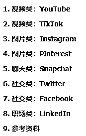
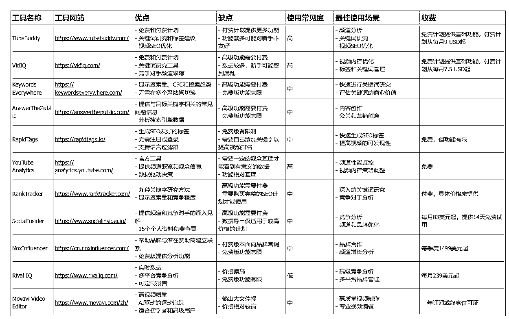

# 海外平台-项目研究工具手册-附工具名称，网址，优缺点，使用场景，收费情况

> 原文：[`www.yuque.com/for_lazy/zhoubao/wzxr4o8neg88z0uf`](https://www.yuque.com/for_lazy/zhoubao/wzxr4o8neg88z0uf)

## (24 赞)海外平台-项目研究工具手册-附工具名称，网址，优缺点，使用场景，收费情况

作者： 来来

日期：2024-10-17

**1****.** **选用最常用 8 个海外平台**

**2****.** **拒绝废话，列表展示工具，这里展示了 1 个表格，飞书共有 8 个表格涵盖 50+工具。虽然我都可以截图粘贴这里来，毕竟图片不好复制，飞书中我已经开放了复制权限。**

**3****.** **8 个工具对比表格，详见飞书文档**  [`duuxkmjwsy.feishu.cn/wiki/SZMawTMxyiyWhxkxNCCcv5C1nab`](https://duuxkmjwsy.feishu.cn/wiki/SZMawTMxyiyWhxkxNCCcv5C1nab)

#龙珠悬赏

* * *

评论区：

亦仁 : gpt 给的工具名单吗

来来 : 是的，删除了不能正常打开的