# TikTok&Facebook 广告 App 投放榜 App 新品榜 App 开发者榜

> 原文：[`www.yuque.com/for_lazy/zhoubao/sow78sglzvpltebs`](https://www.yuque.com/for_lazy/zhoubao/sow78sglzvpltebs)

## (5 赞)TikTok&Facebook 广告 App 投放榜 App 新品榜 App 开发者榜

作者： 梁小伟

日期：2024-10-18

在这个应用琳琅满目的时代，想要让自己的 App 脱颖而出可不是件容易的事。有没有想过，怎样才能快速找到那些市场热度超高的应用，或者搞清楚竞争对手是怎么做的？现在皮皮可以查看**App 投放榜、App 新品榜和 App 开发者榜了，大家可以看看**

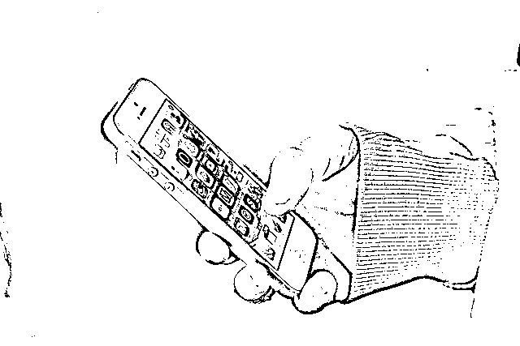

**  **

**  **

**App 投放榜**

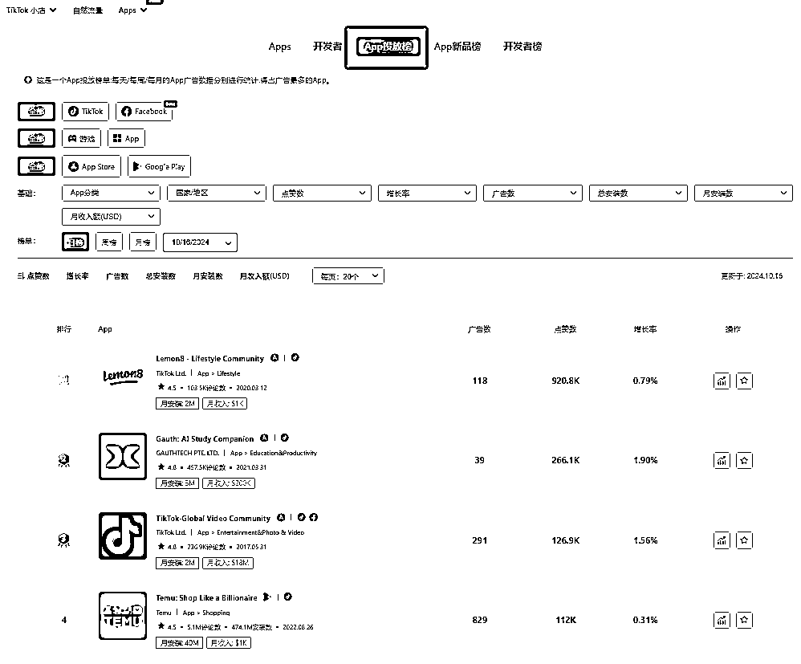

App 投放榜旨在为用户提供实时的广告投放数据和市场分析，帮助广告主快速识别市场热点、优化广告策略，并在竞争中获取优势。

**功能亮点：**

1.**广告数据直观展示**

投放榜清晰地展示各个应用的广告表现数据，包括广告数量、总观看次数和点赞率。

2.**精准的筛选与排序功能**

双平台可以选择**TikTok 和 Facebook** 。包括 App Store 和 Google Play 针对不同应用市场去筛选用户可以选择**App
Store** 和**Google Play** 进行筛选，通过对下载量、用户评分和评论的分析，广告主可以更好地理解用户的偏好和市场趋势。

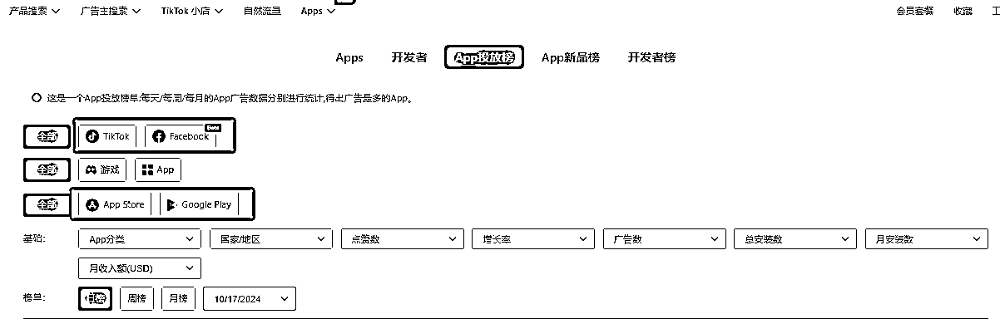

用户可以根据根据应用的类型，广告的观看次数、点赞率和广告数量等维度进行筛选，快速找到表现最佳的广告。

例如，根据如 Action，Adventure 按照广告数去筛选日榜 2024.10.17 位居第一的是**救世者之樹：新世界** 它是一款由韩国游戏公司 IMC
Games 开发的多人在线角色扮演游戏（MMORPG）。游戏的设定围绕着一个充满魔法与奇幻的世界，玩家可以在这个世界中创建和发展自己的角色，探索丰富的环境和故事情节。

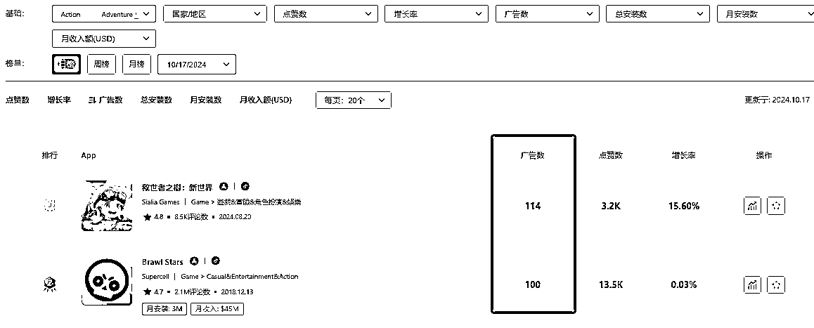

广告数：114 点赞数：3.2k 增长率：15.6%

App 创建时间：2024.08.20 评论数&评分：8.5K/4.8

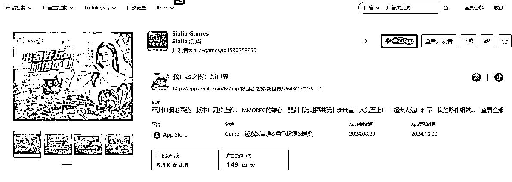

3.**多维度市场分析**

通过分析广告的表现，用户可以识别市场趋势。例如，查看日榜根据点赞率筛选观察到**Gauth: AI Study Companion** 的广告数量和观看次数激增，说明其市场热度上升，广告主可以考虑加大该应用的广告投放。

Gauth: AI Study Companion
是一款强大的学习工具，利用人工智能提供个性化的学习体验。它通过实时解答用户问题、丰富的题库和测验，以及学习进度跟踪功能，帮助学生更有效地掌握知识。此外，Gauth 还鼓励社交学习，让用户能够与其他学生互动和分享资源，从而提升学习动力和效果。总之，Gauth 致力于通过智能化的方式，全面提升学生的学习效率。

App Store 应用的免费教育榜下载应用中目前位居第一

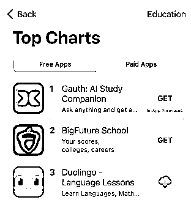

随着个性化学习需求的上升和远程学习的普及，这类应用正在迅速成为教育市场的趋势。AI 技术能够分析学生的学习习惯，提供量身定制的内容和实时解答，同时融合社交学习元素，促进学生之间的互动与合作。

**广告数据分析**

Gauth: AI Study Companion 广告播放:854.7M 点赞数:**14.2M** 月安装数:3M 月收入额(USD):$**200k**

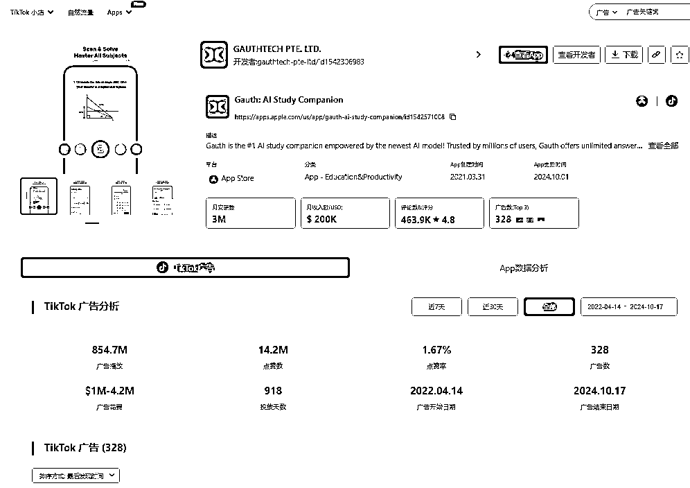

广告素材一：163.8M 播放

广告文案：How many did you get correct? @gauthofficial #gauth #ai #college
#schoolhack #studyhack

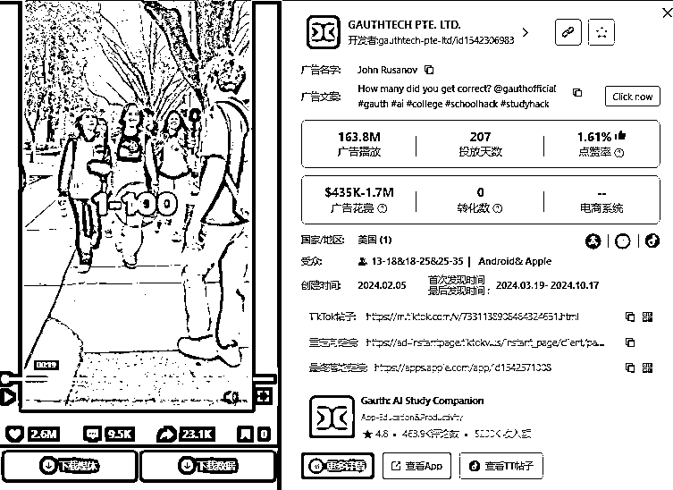

街头采访的形式让广告显得更加真实和自然，能够引起观众的共鸣。通过展示真实学生的反应，增强了广告的可信度。这种采访形式鼓励观众参与讨论，提高了互动性。观众不仅能看到他人的反应，还可能会反思自己的经历，增强了广告的吸引力。这种形式非常适合在 TikTok 等社交媒体平台传播，能够迅速引发用户的分享和讨论，提升品牌曝光度。

广告素材二：65M 广告播放

广告文案：This be the biggest adrenaline rushes in school😂💯 #gauth #ai #finalsweek
#exam #studywithme @Gauth

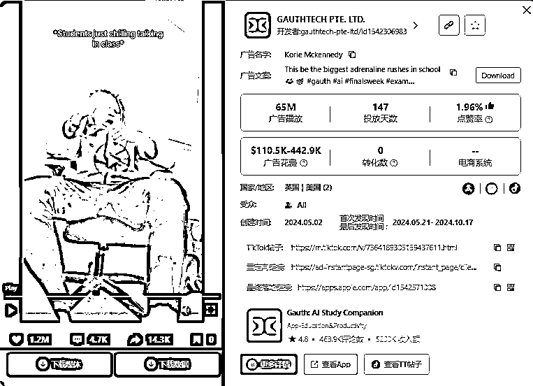

广告通过直接提问和展示学生的反应，激发观众的好奇心和参与感，使人们更愿意思考自己的学习情况。传达了该应用的真实使用场景，使潜在用户能更容易产生共鸣，感受到应用的实用性。内容轻松有趣，能够有效吸引年轻观众的注意，提升观看体验。

广告素材三：36.3M 广告播放

广告文案：THE BEST TUTOR #gauth #ai #finalsweek #exam #studywithme @Gauth

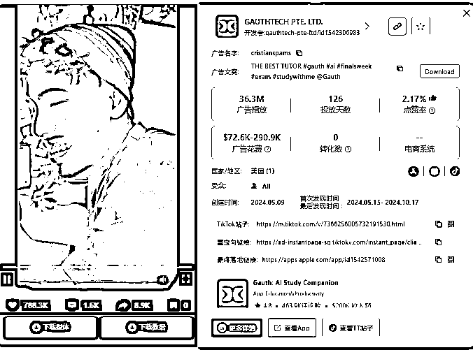

广告内容直接、简洁，能迅速传达出产品的主要功能和优势，将产品融入日常生活场景，广告让观众看到实际应用的价值。

App 数据分析

截至目前，应用的评论总数达到 463.9K，这不仅展示了用户对应用的积极反馈，还提供了市场接受度的直接体现。评论数在 9 月激增，10 月的安装量显著上升反映了市场对该应用的认可和需求。

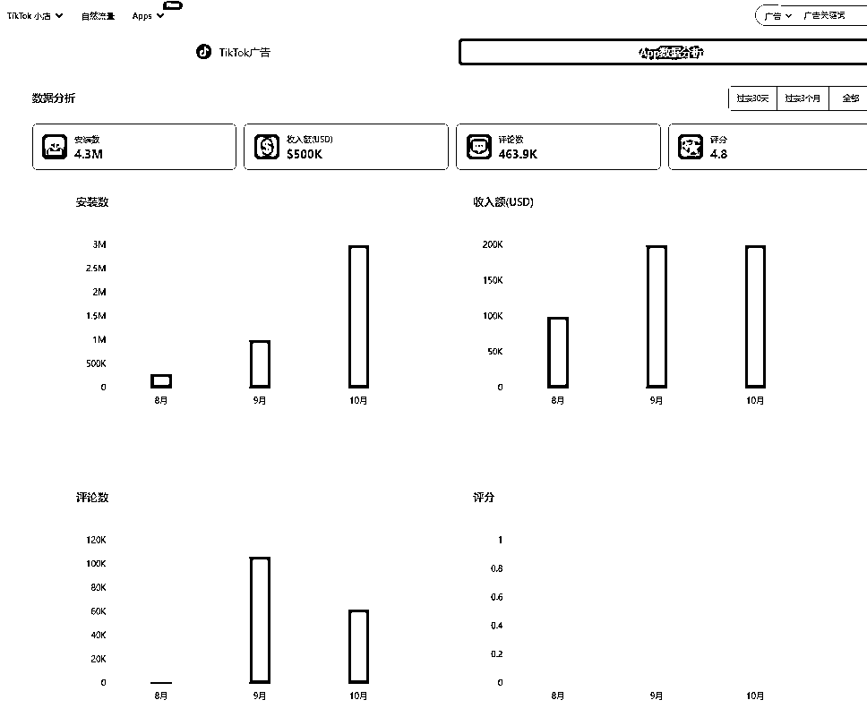

Gauth: AI Study
Companion 的迅速发展展现了在线学习成为常态，越来越多的学生和教育机构转向数字化学习。个性化学习正在成为教育应用的重要特征。通过人工智能和数据分析，应用能够根据学生的学习习惯和能力定制学习计划，满足不同学生的需求，提高学习效果。教育类应用市场的趋势表明，科技与教育的结合将持续深化，个性化、移动化和互动化将成为未来教育应用发展的重要方向。

**App 新品榜**

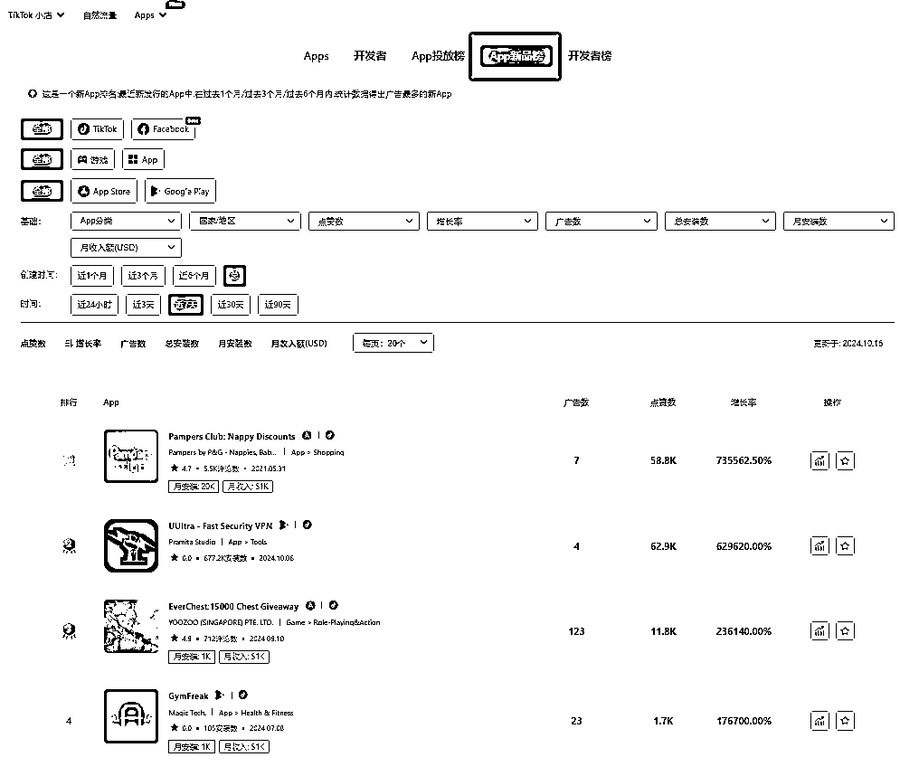

Pipiads 的**App 新品榜** 为广告主和开发者提供了一个强大的工具，帮助他们快速识别市场中的新兴应用和潜力产品。这一功能具备多个显著优势，能够有效提升用户的市场分析能力。

适用：**广告主** 想要寻找最新上线的高潜力应用，以便快速切入市场。**开发者** 希望了解竞争对手的新产品，借鉴成功案例优化自己的应用。

**功能亮点：**

**  **

1.**新应用实时更新**

**实时数据监控** :
App 新品榜实时列出最近上线的应用，让用户能够快速获取最新的市场动态。筛选时间维度范围广：近 24 小时、近三天、近七天等各个时间段供你筛选。

例如，通过选择近 24 小时内增长率进行筛选，用户可以快速找到增长势头最强的应用，如**Hydro Habit** ，其在创建时间为 2024 年 10 月 8 日时已经获得了 24.7K 的安装数，显示出极高的用户关注度。

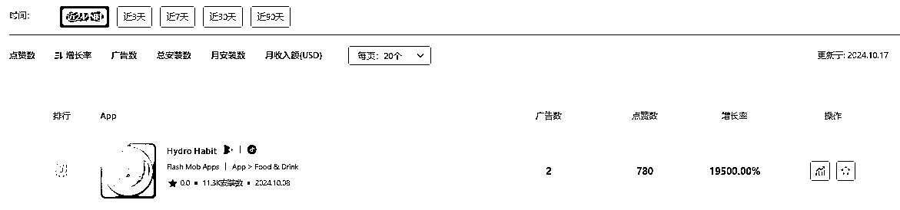

1.  应用展示: 每个新上线的应用都附有详细信息，包括应用名称、开发者、上线时间和应用类别。这些信息使用户能够迅速判断应用的性质和市场潜力，从而制定相应的投放策略。

2.**潜力应用识别**

**高曝光率应用** : 榜单可以按照增长率筛选帮助广告主快速识别那些正在受到用户关注的新产品。比如**Ultra - Fast Security
VPN** 的曝光率高达 629620.00%，显示其广告投放的高效性。这样的信息使得广告主能够识别出市场上表现突出的新应用，从而考虑将广告投放到这些高潜力应用上。

**Pampers Club: Nappy Discounts** 近 7 日增长率高达 735562.50%

广告播放:3M 点赞数:59.5k 月安装数:20k 月收入额(USD):$**1k**

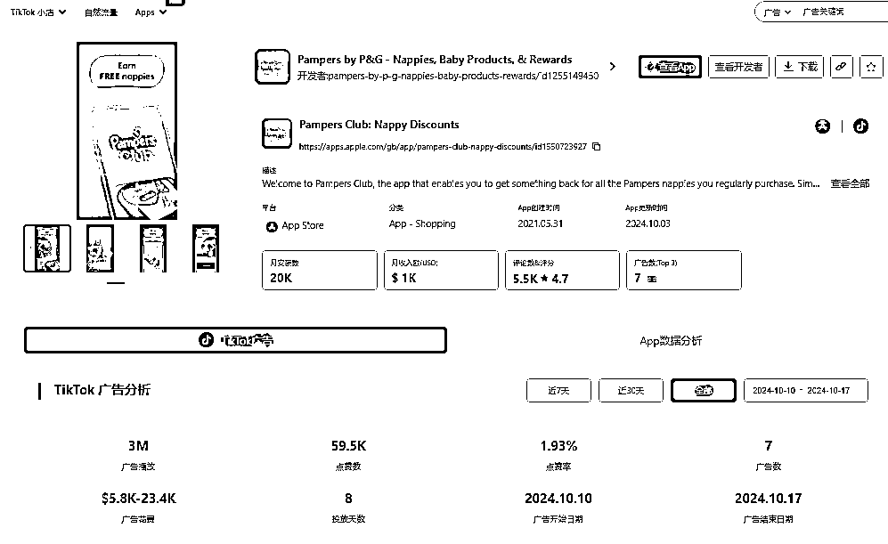

1.  **Pampers Club: Nappy Discounts** 是一款针对家长的购物优惠应用，专注于提供尿布和婴儿护理产品的折扣和优惠。该应用通过会员制度，鼓励用户注册和参与，以获得定制的优惠和奖励。这种类型的应用迎合了现代家庭对于高性价比婴儿产品的需求，并在节省开支方面发挥了重要作用。

近年来，**母婴消费市场** 持续增长，家长们越来越倾向于通过手机应用获取优惠和便利服务。随着电子商务的普及和个性化购物体验的提升，类似于 Pampers
Club 的应用应运而生，满足了家长在购物时对折扣、便利和社区互动的需求。

1.7**M** 播放广告素材 点赞率 3.17%

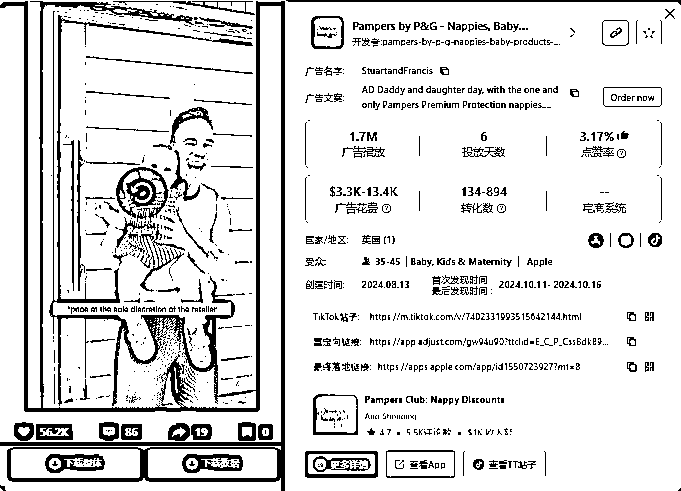

广告视频营造了一个温馨亲密的家庭氛围，通过父亲与婴儿之间的互动传达了关爱和舒适感。产品的清晰展示和细节特写不仅有效突出 Pampers 品牌的优势，还强调了纸尿裤的柔软度与质量，增强了观众的信任感。此外，情感共鸣的传达能够吸引年轻父母的注意，激发他们的购买欲望。

解决痛点：

**精准决策** : 用户能够通过新应用的实时数据快速了解市场动态，从而做出更快速、精准的广告投放决策。

**市场机会把握** : App 新品榜提供的数据不仅能够帮助用户识别竞争对手的成功策略，还能为自己的产品开发和市场推广提供直接的参考。

**降低市场风险** : 通过分析新应用的市场表现，广告主可以在投入广告预算前评估风险，确保投资的安全性。

**App 开发者榜**

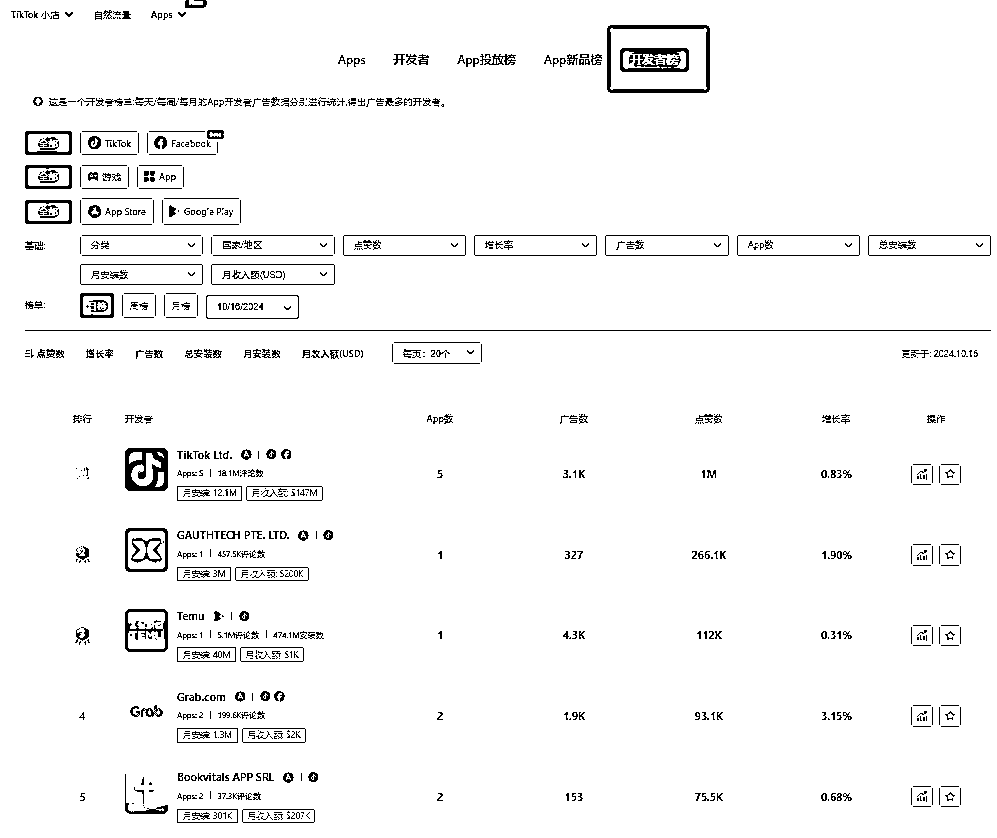

Pipiads 的**App 开发者榜** 为广告主和开发者提供了一种全面的市场分析工具，旨在深入了解各个开发者的市场表现和广告投放策略。通过这一榜单，用户可以有效识别竞争对手的成功经验，并及时调整自己的市场策略。

功能亮点

1.**详细的广告表现分析**

**全面的数据展示** : App 开发者榜列出了每个开发者的广告数量、点击数、曝光率等关键指标。比如，TikTok
Ltd.的广告数量为 3.1K，点击数达 1M，曝光率为 0.83%。这些数据不仅展示了广告的传播范围，还反映了其在用户中的受欢迎程度，帮助广告主判断投放效果。

1.  **增长趋势分析** : 用户可以查看特定时间段内的广告表现变化，识别出哪些开发者在短时间内实现了广告的快速增长，从而把握市场动态。

2.**竞争对手策略解析**

**互动率和点击率分析** : 通过对广告的点击率和用户互动（如点赞、评论等）的分析，用户可以识别出表现优秀的开发者。例如，GAUTHTECH PTE.
LTD.的广告点赞数为 266.1K，而广告数量仅为 327，这表明该开发者的广告内容非常吸引人。广告主可以参考这些成功案例，借鉴其广告创意和投放策略，以提升自身的广告效果。

1.  **实时市场反馈** : 结合用户评论和评分，广告主可以了解哪些内容受到用户喜爱，进而调整自己的广告方向。

3.  3.**市场份额与收入分析**

4.  **月收入与用户基数** : App 开发者榜提供开发者的月收入数据和活跃用户基数，例如，**Temu** 的月收入为$51K，用户基数达到 471.1M。这些信息不仅帮助用户评估开发者在市场上的影响力，还能揭示潜在的广告投放机会。例如，若一款应用用户基数庞大，广告主可以考虑投放广告以快速获取用户。

4.**高表现开发者推荐突出高表现开发者** : 榜单中特别标识表现突出的开发者，方便用户快速获取成功案例。用户可以从如**Grab.com** 等高表现开发者身上学习其广告投放策略，了解其如何在竞争中脱颖而出，进而优化自己的广告策略。

广告**案例分析** :**Grab.com**

广告播放:2B 点赞数:155.2k 广告数:1.9k 广告开始时间 - 广告结束时间: 2022.04.08 - 2024.10.17

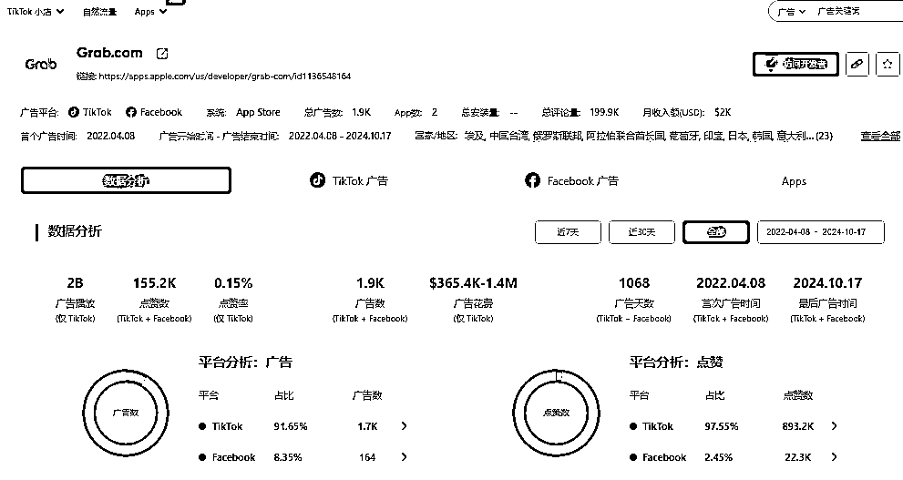

**Grab** 是一款综合性的超级应用，提供打车、外卖、电子支付和金融服务等多种功能，旨在满足用户的多元化需求。这类应用在最近几年迅速崛起，特别是在东南亚地区，反映了用户对便利和效率的追求。随着互联网普及和移动支付的快速发展，超级应用正成为消费市场的趋势，用户希望在一个平台上解决多种生活需求。Grab 的成功不仅展示了科技如何提升生活便利性，也表明了消费者对整合服务的偏好正在加速。

35.8**M** 播放广告素材

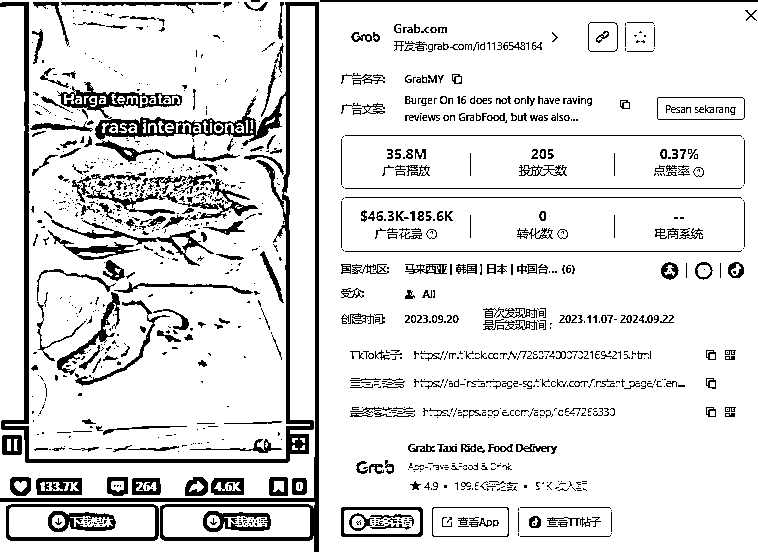

通过活泼的场景和美味的产品展示有效吸引了观众的注意。文字信息清晰传达了价格和推荐的专业性，进一步激发了潜在消费者的购买欲望。

facebook 广告使用了鲜艳的色彩和大字号的文字，使得信息更加突出，易于阅读。加上吸引人的图案设计，增加了整体的视觉吸引力。广告的信息传达非常直接，消费者可以一目了然地了解到促销活动的具体内容和参与方式，降低了潜在用户的决策成本。

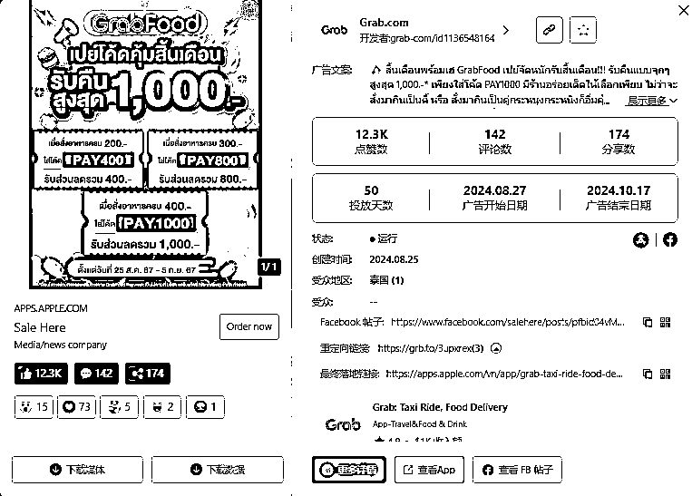

**总结：**

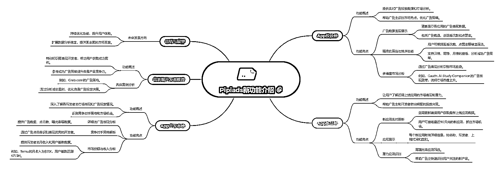

App 投放榜、App 新品榜和 App 开发者榜，为广告主和开发者提供了全面而深入的 App 市场分析工具。通过实时监测广告表现、识别潜力应用和分析竞争对手的策略，用户能够在快速变化的应用市场中把握机遇，优化广告投放决策。无论是寻找市场爆款，还是借鉴成功的广告策略，这些功能都为用户提供了有力的数据支持，帮助他们在竞争中脱颖而出。随着市场的不断演变，Pipiads 将继续致力于提供更强大的功能，助力用户实现更高的广告投资回报，推动业务的持续增长。

* * *

评论区：

暂无评论