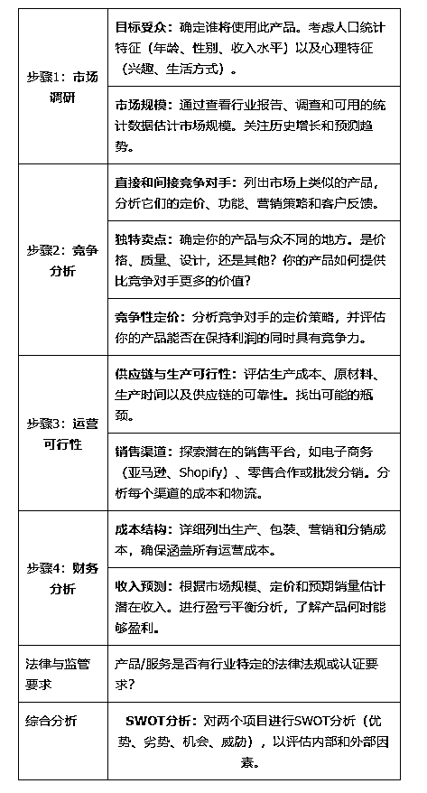
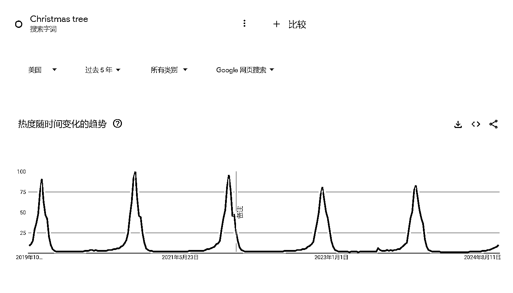
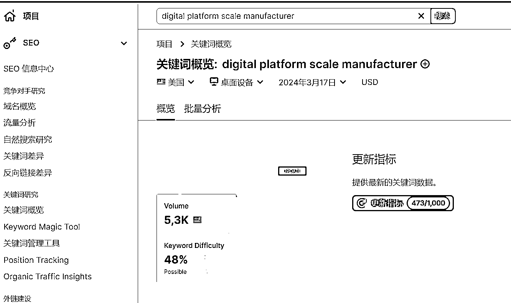

# 如何分析产品-项目的海外市场体量与机会

> 原文：[`www.yuque.com/for_lazy/zhoubao/gazt6w16gbba3cek`](https://www.yuque.com/for_lazy/zhoubao/gazt6w16gbba3cek)

## (精华帖)(62 赞)如何分析产品-项目的海外市场体量与机会

作者： 希声

日期：2024-10-18

之前我在生财分享过一篇 [快速分析一个产品在海外有多大市场？B 端和 C 端市场分析](https://articles.zsxq.com/id_nh64drgxukw8.html)*。*

看到亦仁的龙珠悬赏之后，我觉得这篇文章还挺适合的，只要再做一些内容补充就可以。

于是，就有了这篇文章：

# 项目的调研流程

下面是我让 chatgpt 写出的一个调研的简单流程，我稍微做了修改。

这篇文章会以一两个产品简单讲下如何搭配不同的工具来完成简单的产品市场和竞争对手调研和卖点提炼。

## 一、目标受众调研

如果已经有了一些客户，可以通过分析他们来获取关于目标受众的初步数据。

**Google Analytics** ：如果你有一个网站，Google
Analytics 可以为你提供关于网站访问者的详细数据，包括他们的年龄、性别、位置和兴趣等。

**社交媒体分析工具** ：如果你有相关产品/服务的社媒账号，那么大多数社交媒体的后台都会有分析工具，会展示部分用户特征。

比如这是 tiktok 的分析页面。

如果项目还没开始。

那么可以通过这些方式来确定目标受众。

1.团队内部头脑风暴。

2.消费者采访。

3.查看调研报告。

常见的调研报告网站有 Statista、ibisworld

 images.zsxq.com/FuZzLcXZyuhUpgitvf6g41jiqPWS) images.zsxq.com/FuSkZYvWWuRt3lvpk1lv979xmrVm)

## 二、**市场规模调研**

市场规模的调研在我看来主要是两个方法：

1.查看行业调研报告。

2.产品/服务关键词调研。

调研报告的网站上面已经罗列过了，主要就是通过 Statista、ibisworld。

有料的调研报告里面往往有许多重要信息。

比如常见的市场，用户人群画像的分析。

但是有的报告还会有些不一样的内容，比如产品矩阵分析、社交媒体分析等等……

下面具体说下怎么通过查询关键词大小来确定市场规模。

假设我们要销售的产品是电子秤，更具体来说，是下面这个东西，用来称比较重的货物，在菜市场很常见。

### 确定产品的关键词

第一步，我们先需要确定产品关键词或者说是产品的英文名称，因为只有产品的名称有了，我们才能借助工具去查询这个产品的市场大小。

我们有两个办法，第一是用翻译器软件，比如百度翻译。

第二个办法是用 AI 工具。

让我们先试下百度翻译，翻译结果是：Electronic scale。

第二种办法，我们用 AI，这里我用谷歌的 gemini 来演示——当然你也可以用 Chatgpt 或者 claude 等 AI 工具，效果也差不多。

我们把产品图片作为附件传上去，然后写上提示词：

请告诉我图片中的这个产品的具体英文名称是什么？

可以看到，AI 的回答是 digital platform scale。

到这里我们就初步得到了这个产品的两个英文名称：

electronic scale 和 digital platform scale。

### 验证关键词是否正确

那么，到底哪个关键词才是正确的呢？

哪个关键词才能最准确地表达这个产品呢？

这是非常非常重要的一步，也是太多 B 端外贸公司在产品出海踩到的第一个坑：没有找到正确的产品关键词。

举个身边的例子，番薯。

在不同的省份和地区，番薯是有多种名称，比如有可能被称为“红薯”或者是“地瓜”。

在日本，红薯被称为“薩摩芋”（Satsuma-imo），而在美国，红薯又常常被称为“甜薯”（sweet potato）。

所以如果关键词不对，那么剩下的工作就将是在错误的道路上狂奔，都是在做无用功。

我这里推荐一个方法，就是用谷歌图片进行关键词和产品的相互验证。

我们打开谷歌图片，输入关键词：electronic scale，看下结果。

很明显，和我们的产品不一样，结果显示更多的是小型电子秤，和我们的产品不是很符合。

接下来我们试下 AI 给到的关键词结果：digital platform scale。

和我们的产品非常相似。

所以初步结论就是这个产品的英文名称应该是：digital platform scale。

为了进一步验证，还有个方法就是：

点开这些正确产品的图片，查看图片下面的名称。

我们可以多点开几个做参考。

通过点开不同的图片，我们能看到，这个产品还有种可能的英文名称是 electronic platform scale。

到这里我们就得到了两个比较具体的产品词，分别是：

digital platform scale

electronic platform scale

下面我们来进一步用数据来告诉我们，目标市场的客户到底更习惯用什么词来搜索，同时看到这个产品的市场/需求大小。

### 确定关键词的市场/需求大小

假设我们要做的市场是美国。

那么我们用关键词工具来搜索上面得到的关键词。

这里的底层逻辑就是：产品关键词在谷歌上的搜索量大小≈市场的需求大小≈产品的市场大小。

虽然用户在搜索某个产品时，可能通过多种不同的平台搜索，但对于 B 端用户来说，最符合直觉的搜索工具依然是谷歌。

关键词工具有很多，付费工具里面比较常见的比如：

semrush，ahrefs，kwfinde、Ubersuggest、AnswerThePublic、Moz 等等。

如果想要使用免费的关键词工具，可以使用谷歌的 Google Keyword Planner。

下面我使用 semrush 来演示。

我们先看下 digital platform scale 的搜索情况。

可以看到全球的平均每月搜索量是 440，在美国地区，平均月搜索量是 90。

再看下 electronic platform scale 的搜索情况。

可以看到全球的平均每月搜索量是 420，在美国地区，平均月搜索量是 20。

从上面简单对比我们能确定，如果做的是美国市场，那么主要的产品关键词应该是：digital platform scale。

这个工具还有许多功能，比如以主要关键词做一些扩展，看到一些其他的相关关键词：

还包括不同关键词的意图分析等。

semrush 的作用不只是关键词分析，还能进行同行数据的调研等，后面我会简单地提到一些。

### 利用谷歌趋势进行市场判断

接下来我们再用谷歌趋势做一个数据对比和市场简单判断。

打开谷歌趋势网站[`trends.google.com/trends/`](https://trends.google.com/trends)

输入两个关键词，地区选择目标市场美国，时间选择过去五年。

对比之后可以看到，两个关键词的搜索数据非常接近，差别并不大。

这个页面我们往下滑，可以具体地查看不同地区的关键词搜索情况。

看到不同地区的关键词情况有什么用呢？

比如你要投谷歌的搜索词广告，在投放地区上面，我们是可以手动选择某个州来进行投放，而这个时候，谷歌趋势给到的这些数据就是很有参考价值。

从上面这个图可以看到，在美国的大多数地区，习惯使用的关键词还是 digital platform scale。

最后，终于可以得出结论。

这一款产品的主要关键词应该是 digital platform scale，次关键词是 electronic platform scale。

**但这里有个注意事项，谷歌趋势显示的是一个热度得分，而热度得分越高表示字词在当地所有查询中占比越高，并不代表绝对查询次数越多。**

谷歌趋势另外一个作用就是看到产品的趋势变化。

有些产品可以明显看到市场需求随着季节或者节日而变化。

### 确定产品在 B 端贸易市场的大小

如果要做的产品是 B2B 外贸，而不是做 C 端面向消费者的生意，所以实际上为了更好地判断市场大小，我们应该用 B 端的搜索词来验证市场大小。

我们先打开下面这个二叔开发的 B 端关键词工具：

[[https://2uncle.com/google-search-ads-keywords-2b/]](https://2uncle.com/google-search-ads-keywords-2b/])([`2uncle.com/google-`](https://2uncle.com/google-) search-ads-keywords-2b)

在这个页面输入我们的产品关键词 digital platform scale，等一会就会看到生成大量的 B 端常见关键词。

我们就可以拿这些词一一去搜索，查看关键词的搜索量。

这里依然要用到 semrush。

因为搜索量太少，结果是搜不到数据。

我换了几个关键词，都因为搜索量太小，搜索不到数据。

### 没有数据等于没有市场？

这是做 B2B 外贸常见的一个问题，因为 B 端市场需求并不大，所以很多时候你会发现使用工具去确定市场的时候，经常会出现数据是空白的情况。

但是一定要注意，但这并不代表没有市场。但这并不代表没有市场。但这并不代表没有市场。

重要的事情说三遍。

原因是因为第三方的数据工具本质上是拿不到完整的谷歌搜索数据，都是利用自己的技术和算法去推算数据，所以导致了每一个工具都一定是有局限性的，都是无法百分百准确地去反映真实数据情况——特别是当某个关键词的数据量很小的时候，更容易出现查询不到任何数据的情况。

所以我们永远要知道，工具一般只能拿来做横向的数据对比。

那么针对上面这种情况，我们要怎么解决？

我的方法是：看同行。

看大量的同行，同行多不多，同行做得怎么样，就基本能反映出市场的真实情况。

## 三、同行调研

### 如何寻找同行的网站

首先我们要打开下面这个网站：

[`www.brightlocal.com/local-search-results-
checker/`](https://www.brightlocal.com/local-search-results-checker)

这个工具的作用是让我们模仿真正的当地人来查看谷歌的搜索情况。

这里再次补充一个知识点：

如果你经常使用谷歌，你会发现，有的时候你搜索一个词，但是在谷歌的搜索页面没有任何的广告。

这不是因为没有人投广告，而是因为谷歌发现了你在中国，所以就不会展示广告，毕竟几乎没有广告主会把广告投放到中国地区。

我们都知道淘宝有个千人千面——你是女性就多推女装，你在哈尔滨就多推羽绒服——同样的，谷歌也有千人千面，所以为了更好地进行本土化数据调研，第一步就得伪装成本地人。

利用这个工具，我们就能伪装成一个真正的本地人来进行谷歌搜索。

打开网站，输入关键词，选择目标国家为美国，确定语言，然后点击搜索。

点击第一页进入。

如果你发现这里有很多的 sponsored 标志，说明伪装成功了。

我们可以看到，第一页上就有很多人在投放相关的产品广告，而有人投广告就初步说明这个市场是有需求的，毕竟如果投广告赚不到钱大部分企业也就不会继续投了。

而这些在投放广告的同行其实是可以重点关注的。

毕竟他们在花钱，说明他们业务大概率是赚钱的。

### 网站流量和数据调研

接下来我们就可以把这些网站的网址放入到 semrush 或是 similarweb 等分析工具，查看更详细的数据情况。

通过 semrush，我们可以看到同行网站的自然流量流量大小，付费广告情况，主要的市场，主推的产品关键词，品牌声量，主要竞争对手等一系列数据。

下面是 semrush 的截图。

下面是 similarweb 的截图，在网站全部流量分析方面，会比 semrush 更加齐全。

### 网站的历史变化情况

网站时光机：[`web.archive.org/`](https://web.archive.org)

这个工具可以查看某个网站过去的页面样式。

有什么用呢？

我们就可以看到同行主推产品，网站设计的一些变化，然后思考为什么要这么改动。

### 网站是用什么搭建的？

可以用插件查看。

知道网站是用什么搭建的有一个好处。

如果是用 shopify 搭建的，那么市面上有不少 shopify 网站的分析插件和工具，可以看到热销产品和销量预估等。

### 推导同行订单量的方法

这里介绍一个简单推导 shopify 同行订单量的一个技巧。

我们可以在每天的固定时间去同行网站上下单，然后再取消。

之后就可以通过订单号相减的方式来间接推测出每天的单量。

因为 shopify 的单量编号都是递增的。

### 同行的广告、社媒情况

怎么查看同行的谷歌广告情况？

Spyfu 或者 semrush。

怎么查看同行的 Facebook 广告？

Facebook Ads Library，免费工具。

怎么追踪同行社媒内容。

BuzzSumo。

可以查找特定领域、主题或产品相关的热门内容，可以快速发现某个关键字相关的最受欢迎的内容，也可以用来追踪同行社媒的情况。

### 其他调研方式

AI 搜索引擎或者是一些 ai 工具的高级功能也能帮我们直接做数据分析。

ai 工具的好处是，能帮我们找到大量的调研报告和数据。

比如 kimi 的探索功能。

虽然 ai 的总结不一定好，但我们可以反向利用 ai 来帮我们直接找到大量的数据源。

### 找到利基同行的技巧

试想一下，如果有个同行，能力很差，但是却很赚钱，或者说有很多流量，那我们直接模仿他，或者参考他的策略，就是一个弯道超车的机会了。

用到的工具是 ahrefs。

首先，登录 ahrefs，点击右上角的“content-explorer”。

输入产品或者服务的主关键词。

选择“in title”，点击黄色搜索按钮。

按照目标市场的语言，选择语言，将“Filter explicit results”选项打开。

点击“Add filter”，按照以下调整：

这么筛选的含义就是，页面的流量要求大于 1000，DR 值小于 10。

（DR 值就是一个在 ahrefs 这个工具根据自家算法得出的这个网站的权重。在 MOZ 工具里，这个值称为 DA 值，不同的 seo 工具，对于网站权重的计算方式不同，所以叫法不同，数值也不同。所以我们在对比网站权重的时候，最好使用同一个 seo 工具，这样数值的对比才有意义。）

这样筛选的目的就是找到那些网站权重并不高，却有一定流量的网站（当然，你也可以适当地增加或者减少这个数值）。

然后我们就可以具体分析，是因为他关键词选的好？外链多？产品做的好？

## 四、扩大同行的数据搜集

以上的同行主要还是局限在网站。

做市场调研，肯定要全面。

如果是做电商的，那么肯定还要在电商平台上调研。

那么就可以用到电商平台的调研工具。

比如亚马逊平台的卖家精灵、shopee 平台的知虾，Etsy 平台的 eRank 等等。

## 五、卖点调研

卖点调研最好的方式就是去看同行。

而比看同行更好的方式，是看消费者的真实需求。

最简单的办法就是各大电商平台的评论区。

比如亚马逊评论分析插件，TheReviewIndex。

客户的差评=客户的痛点=产品的缺点=我们的机会

[#龙珠悬赏](https://wx.zsxq.com/tags/龙珠悬赏/48824518525858)

**如果分享对你有帮助希望点个赞哦~**

* * *

评论区：

亦仁 : 很棒的基于一个场景介绍工具使用的案例。

希声 : 感谢老大[呲牙]