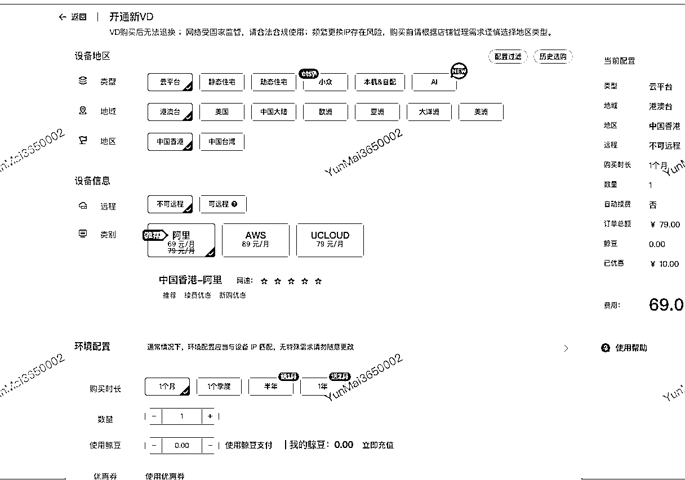
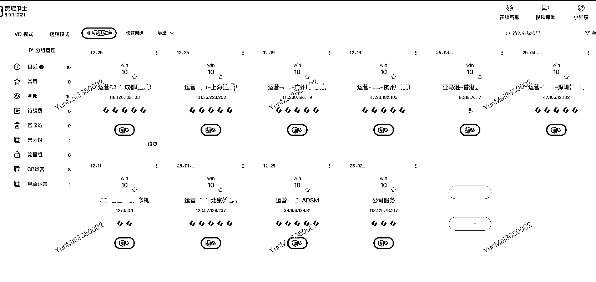
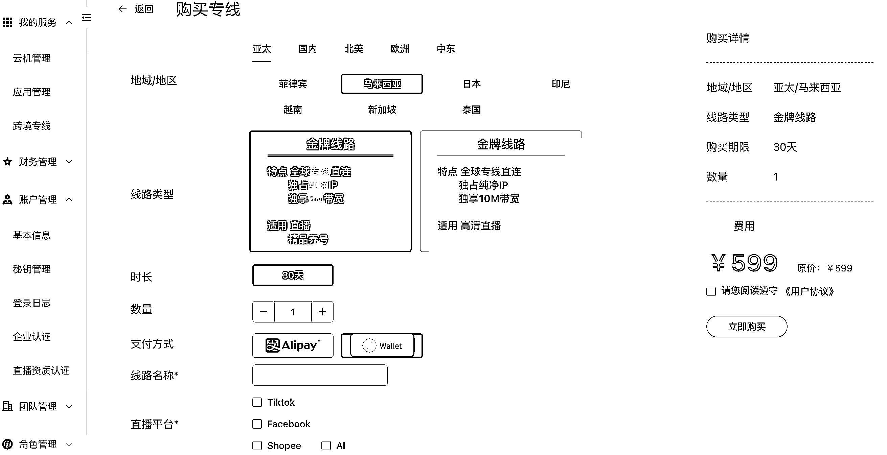

# 各平台账号矩阵运营交流「交作业#龙珠悬赏」

> 原文：[`www.yuque.com/for_lazy/zhoubao/gs3hm5yxlcc712kg`](https://www.yuque.com/for_lazy/zhoubao/gs3hm5yxlcc712kg)

## (29 赞)各平台账号矩阵运营交流「交作业#龙珠悬赏」

作者： 李海滨

日期：2024-10-15

刚才开车路上，弹出消息，感觉挺贴切，我就简单分享一下。文笔不好
多见谅，我喜欢直接分享上我认为比较干的内容，所以赶紧就写一下。期待后续肯定有大佬分享更好的内容。

简单自我介绍一下，引用加入生财时候的模版。是的 比较懒

【生财昵称】李海滨

【所在地区】天津 河西区

【自我介绍】

MBTI 是 INIFJ 90 后互联网打杂工。算是有近 10 年互联网及跨境电商等相关产品经验，主要产品是跨境出海浏览器、网络 IP 专线资源等底层服务

【提供资源】

1、跨境电商网络资源等不限云服务器、代理 ip、各种海外社交媒体账号等

2、社媒运营、web3 一些相关行业业务运营知识分享、多账号管理等

3、项目管理咨询服务、产品逻辑梳理或者海外运营矩阵梳理交流

乍一看，是不是就明白很多，不是打广告哈！不是打广告哈！不是打广告哈！说三遍。是的
我是做 SaaS 出海工具的，但我本身自己也是用户，因为必须得了解业务才行。我的 SaaS 是付费工具，免费的其实都是最贵的，这道理大家应该都懂，毕竟没有免费的午餐。直接来：

**一、如果你是跨境电商卖家：跨境卫士安全浏览器（**[`www.kuajingvs.com`](https://dwz.cn/mf9qgdQA)**）**

跨境电商大家应该都有所了解，国内传统电商淘宝、京东、拼多多等等电商平台，那通俗讲，把国内产品通过海外电商平台卖到海外客户手里就是跨境电商的通俗含义。平台很多，方式很多，常见 Amazon、ebay、Lazada、Shopee、Shopify、Ozon 等等各种国外电商平台。

跨境卫士浏览器是做什么的呢？它是为国内这些想要跨境电商生意的卖家们，提供店铺的安全管理、环境隔离、网络隔离的必备浏览器。海外电商平台审查机制和风控体系非常严格，比如你是卖家，你在国内做淘宝开店铺，
一个电脑是不是就够了，可以开几个甚至十几个淘宝店铺，而且是在一个浏览器一个网络下就可以。但是海外这些电商平台不行，如果你这样做，过几天甚至当场开店就会封禁你的账号。基于平台审查这么严格的规则下，卖家伙伴们就会衍生出很多解决办法，举例有 10 个亚马逊店铺，那就需要购置 10 个电脑，然后找一个网管，布置 10 个独立的网线及网关，以这种高成本的方式解决环境以及网络的隔离问题。跨境电商卖家或者店群卖家如果继续以这种方式经营下去，没等到货物卖出去，买设备管理就已经累得半死了，所以 2018 年我们就自己做了这个浏览器，因为我们本身集团就是做了 30 多年的外贸的，内部孵化团队转去踩跨境电商的风口，所以我们既是跨境电商卖家也做 SaaS 软件，为了去赋能更多的跨境电商小伙伴。卖家只需要电脑安装跨境卫士浏览器，购买一个 VD（环境+ip 网络等）添加店铺，就会实现一个电脑管理 N 个平台的 N 个店铺，而且安全合规自带出海加速，快速打开任意跨境电商平台。而且可以多人协同、异地办公、等等。如图所示：

购买开通 VD 环境及全球 ip

以下是我自用的截图

就是简单的这样使用，方便便捷，高效降本切安全。近 6 年服务了差不多有几百万个店铺，十几万跨境电商卖家。

二**、如果你是想做出海生意的伙伴：ClonBrowser 浏览器（[`www.clonbrowser.com/zh`](https://www.clonbrowser.net/?code=l1qUzv)）**

**  **说大一点，全球经济趋势使然，必然有很多小伙伴去想赚更多更多的 money 囤粮等等，第二个推荐的我自用且也是我们的产品指纹浏览器 ClonBrowser 指纹浏览器，适用于各种出海生意及多账号玩法。

出海赛道种类繁杂，我自调研大概有四五十种类，游戏出海、声娱出海等各大种类，但是从场景化角度思考，我认为 3 个方面比较重要：远程、创作、成本。这里的远程是指远程工作及生活附加一体的方式，远程的办公、服务、协同等等都不简单只是‘线上化’这么简单；而创作就理解简单多了，每个人都是创造者，从内容或品牌的创造者，到各行业的创造者，甚至到 AI 产生的内容，都是必不可少的；最后的成本是指你个人的是时间、财力等衡量价值。

所以，基于以上 3 个角度出发 clonbrowser 浏览器适合矩阵运营出海赛道归纳为以下：

1、各种海外社媒平台、游戏矩阵账号管理运营：TikTok、Facebook、WhatsApp、X、Instagram、Discord、Telegram、Gmail 等等。

2、web2 想向 web3 迁移的伙伴们、工作室们、项目方们：web3 必备最优性价比的指纹浏览器

3、B2B 及 B2C 的传统企业：推广运营垂类行业的免费流量，获取垂类精准询盘

所以种类工具针对的主要是在多账号矩阵运营的情况下使用，肯定小伙伴会问，我为什么要用这类工具，用我自己的电脑浏览器多开不行么？回答是否定的，看起来本地能用且没有问题，实际电脑虚拟多开的已经被记录了，大家做的都是长期生意，长期主打的是账号资产隔离安全，所以别心存侥幸。

以下是我自用的截图，运营推广账号 800 多套，涉及海外图文、问答、视频等平台，以 tk 截图举例：  images.zsxq.com/FltSt7dLjcNTijbMpyJLgtZ66gD2)

使用同步器同时操作以及后续 rpa 自动化运营账号：

敏感信息已经抹去了

 images.zsxq.com/Fmzci7Ow5HUECvUNQMfgGBWAAFea) images.zsxq.com/FhFvIxDK4pRagX5l48VgyC-AKk3G)

三**、各种网络资源：开鲸云（[`www.kaiwhale.com）`](https://www.kaiwhale.com）)**

这就简单直接了，提供各种网络 ip、专线、AI 算力资源。合作的是全球各大运营商。没错，这也是我们的。

1、为什么推荐呢？

因为市场太卷，太杂乱，导致很多资源并不唯一且干净安全的，指网络 ip、节点、加速、等等。基于跨境出海各种安全合规，以及账号数据安全的前提下，我们提炼了这一部分网络资源，去合作更多的想用干净安全的网络资源的伙伴，省去盲目筛选资源的过程，其实网络资源的水很深，看起来透明，但玩法很多。就是想开放一下这个能力，毕竟我们踩过的坑你们没必要踩了，因为我也是卖家呀，在这全球经济形势下，肯定都想去赚更多的美金、英镑、欧元等等去囤粮呀。不想内卷在这上面浪费时间。

2、都有啥？

干净且卫生的全球 ip，包含各大厂商 images.zsxq.com/Fg2uDtiCkDB6KbUUrLOw97gz_htP)

适合 TikTok 直播的直播专线：这块我测试过的，市面上解决的办法太多了，流量卡、软路由、科学上网软件等等，最终我们筛选出了 2-3 个优质线路合作伙伴，虽然贵了些，但是很多客户反馈都好用，没别的，就是好用。因为账号资产比这必备解决方案贵的多的多。因为，账号才是最值钱的！

说的有点乱，有点杂，我本身也参与过生财活动，web3 等等，就会发现有很多伙伴有出海的心，迫切的同时就会费很多时间摸索很多事情。所以那时候就免费给很多小伙伴解决一些软件网络等问题，让他们回到赛道的本身，而不是这些地方浪费时间。

以上不是广告哈，是纯分享工具，恰巧我确实也是做这个的。如果有需要的伙伴可以联系以上客服，提我名字享受 VVVIP 服务以及各种优惠！

第一次写多担待

希望能帮到大家

后续可以多交流

我在天津

我叫海滨

* * *

评论区：

暂无评论