# 龙珠悬赏：对新兴事物、全球趋势、热度方向的研究工具分享

> 原文：[`www.yuque.com/for_lazy/zhoubao/crqapbzrr27z0hcl`](https://www.yuque.com/for_lazy/zhoubao/crqapbzrr27z0hcl)

## (23 赞)龙珠悬赏：对新兴事物、全球趋势、热度方向的研究工具分享

作者： 彩笺

日期：2024-10-15

#龙珠悬赏

工具主题：对**新兴事物、网站或者应用的热度、全球趋势** 的研究

内容分为两部分，**目录** ：

*   为什么要用这些工具，使用工具**背后的经历和思考** 。

*   工具的具体使用，包括**使用场景** 、我自己的**使用案例** 。

## 背景

分享工具之前，我先分享下为什么我会经常性的使用这些工具。

我一直都觉得，**比较大的机会，往往都藏在那些新兴事物中** 。主观印象上，我在社群内看到的相当一部分帖子，都是围绕：公众号、小红书、视频号、闲鱼、抖音；来展开的，在生财官网的航海实战也能看到，

他们几个在生财行业页面出现的频率还是相当高的：

*   小红书：52 次

*   视频号：42 次

*   闲鱼：19 次

*   公众号：14 次

*   抖音：51 次

他们共有的特点是：**自媒体相关** 。而自媒体恰恰是国内这些年有着比较大机会，同时在之前出现的新兴事物。

我是 00 后，家在 18 线小县城。17 年上大学那一年，身边好多人听从身边人的建议报考了当时在我们那看起来很火热的土木、机械等等；我报名了软件工程。在 21 年毕业前后，我在国家某统计网站上看到了应届生工资排行，其中软件工程还是计算机与科学（记不清了）以每月 8000 元排名第一。而我在 21 年毕业，以普通本科的学历，拿到了月薪资 2w 的 offer。

**我对此的总结是，得益于前些年移动互联网的出现以及高速发展，让我在这两年还能有口汤喝，这也坚定了我要持续关注新事物的想法。**

上面提到的一些已经很成熟的平台、项目、机会，在当年他们刚刚出现的时候，我还在上学、受限于认知、年龄、眼界，失之交臂错过了，现在心中有了这个道理，待时而动。

我们都知道的一句话是：**站在风口上猪都能飞起来。**

**我不奢求可以预测到下一个风口，下一次技术革命是什么方向、什么时候到来，只要持续保持着对新事物的关注、在机会到来时有精力、有能力参与进去，我想这就够了。**

我记得之前听 caoz 反复提到过一个观点，**“一切皆概率** ”。每一次机会的到来，每一次的参与，都会增加我们胜算的概率，而我们只需要赢一次，就够了。

像这些年很火的 AI，不就有一大批人拿到了非常不错的成绩吗？从一开始的账号售卖，到后来延伸到很多细分领域的实践。

看下数据：

**以摩尔定律为基础的高科技发展，会继续导致未来不同领域的很多事物，在一年时间内的增量，超过之前的几十年几百年的积累。**

> 从 1947 年科学家发明晶体管开始，高科技行业每隔大约 15 年会发生一次重大范式转移 (Paradigm shift) 。笔者在此挑选了几个标志性的事件：
> 
> 1947 年 12 月贝尔实验室发明第一个点接触晶体管， 晶体管范式的开始 ；
> 
> 1959 年第一个单块集成电路推出，集成电路范式的开始 ；
> 
> 1977 年 6 月 Apple ii 推出， PC 范式的开始 ；
> 
> 1993 年 3 月 Mosaic 浏览器推出，互联网范式的开始 ；
> 
> 2007 年 1 月 Iphone 推出， 移动互联网范式的开始 ；
> 
> 2022 年 12 月 Chatgpt 推出， AI 范式的开始.
> 
> 平均间隔大约十五年一轮, 对应着摩尔定律迭代至少七次，单位成本的算力至少增长一百倍以上。可以参见笔者的老文章

都不需要我多嘴，每一次事件的发生，在此后的很多年里，都伴随着重大生活方式的改变，而这其中，全都是赚钱的机会。上文信息来源：[王川:
只有生存狂才无需偏执](https://mp.weixin.qq.com/s/RTE6Diuu669Z98CmKGu6tQ)

## 工具分享

以下所有的海内外工具，都是我经常在用，并且都围绕着**新兴事物、网站或者应用的热度、全球趋势来展开** 。

### Google Trends

**使用场景：** 分析全球或区域搜索趋势的工具，研究某个词语、话题或事件的搜索热度变化，并且能够查看长期或短期的趋势。**免费使用** 。

链接：[`trends.google.gg/trends/`](https://trends.google.gg/trends/)

**使用案例 1：**

可以看到 AI 从 23 年，到现在一直都是非常热非常热的话题，同时从相关查询中也可以看到人们对该事物的哪些内容会很关注。机会就在其中。

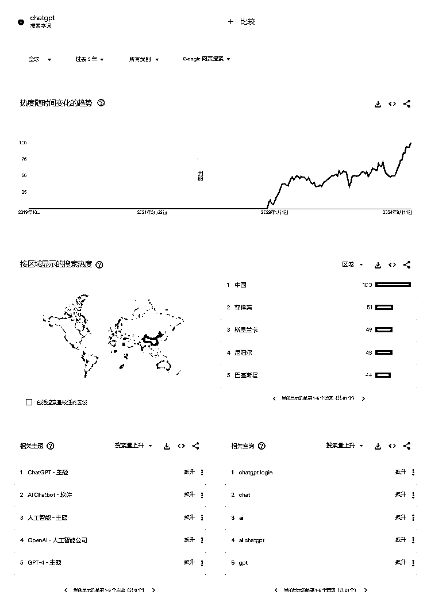

**使用案例 2：**

比如 galgame 这个词，是来源于日本的可以和动画美少女互动的电子游戏。从 trends 可以看到，主要在中国有很高热度，带着疑问可以去搜索一下：见下图 2

图二排在搜索前两名的分别是：为什么虚拟恋爱游戏在中国流行、为什么美国人不玩 galgame 游戏

**搜索阅读之后，你就会对你见到的某一新事物，有了自己的看法和了解。**

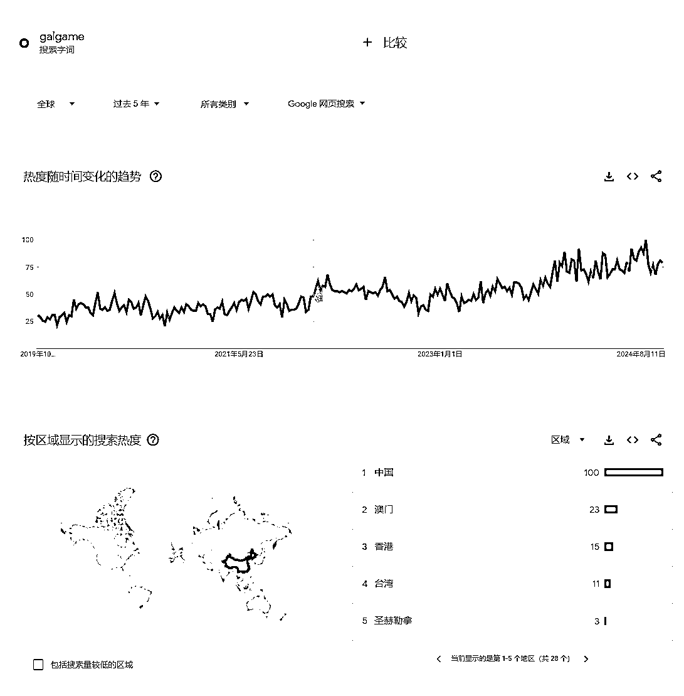

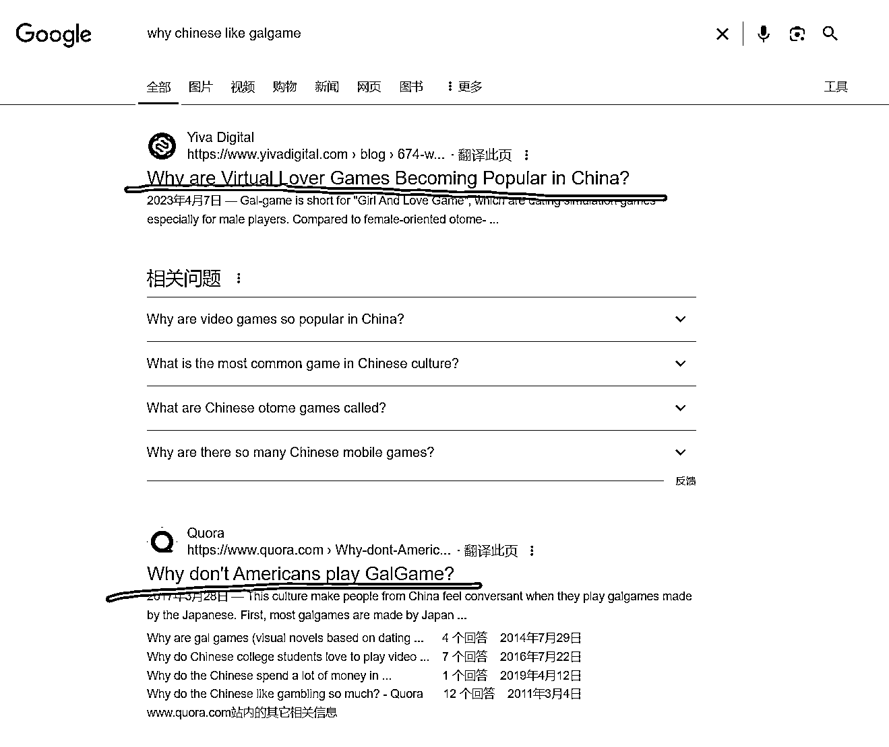

## Github Trending

**使用场景：** 浏览当下最热门的开源项目，我经常会去看周榜、以及月榜，国内外有什么热度比较高的项目。同时可以发现很多有意思的、或者很实用的工具。**免费使用** 。

链接：[`github.com/trending`](https://github.com/trending)

**使用案例 1：**

看下当前的全世界月榜（已翻译）[`github.com/trending?since=monthly`](https://github.com/trending?since=monthly)

可以看到，排名前两个的都是和 AI 相关的。这就是**信息** 。

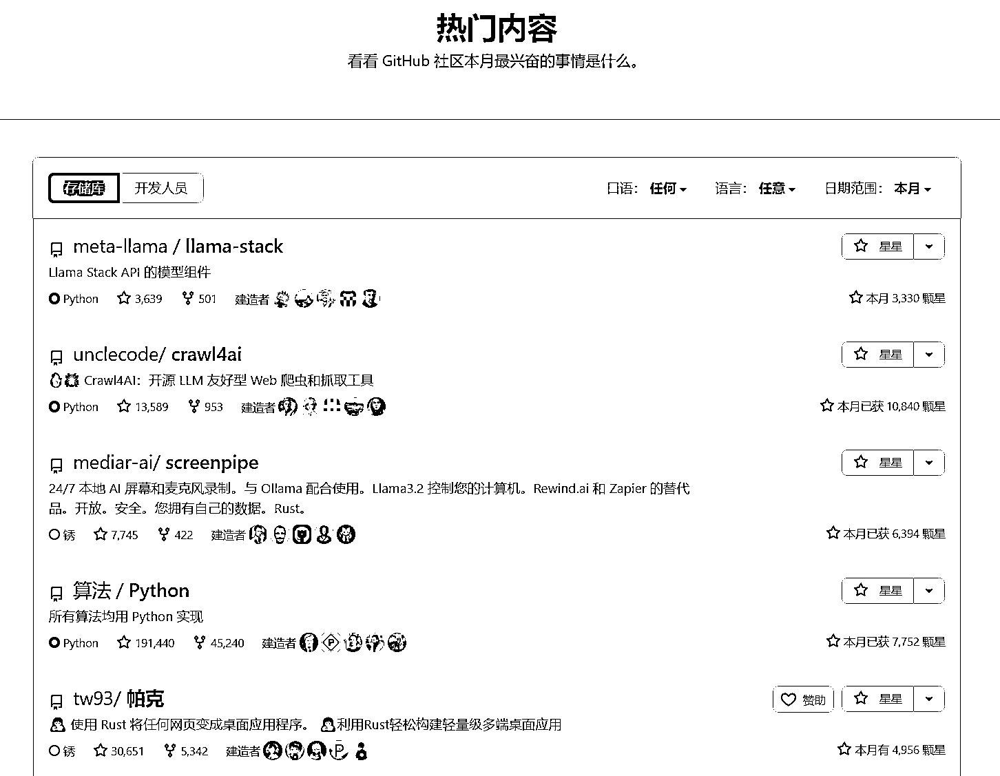

**使用案例 2：**

看下这个月使用中文语言的月榜：[`github.com/trending?since=monthly&spoken_language_code=zh`](https://github.com/trending?since=monthly&spoken_language_code=zh)

1.科技爱好者周刊，我经常看，可以看到一些科技新闻，好用的工具，相关招聘，优质文章。这个项目我每周都看，已经成为我的信息源之一了。同理比如做出海工具站的，也可以做好之后提交到这里，也是一种推广。发布或者找相关工作的也可以来发布或者浏览招聘信息。

2.一些有趣的应用，或者项目网站。

3.免费的音乐播放器 （是不是可以挂个咸鱼当虚拟品卖？

4.linux 操作系统的学习资料

我最近使用了一些工具，PDF 编辑、b 站视频下载，音频提取、练习英语的网站、等等，很多工具资源，都是日常浏览中发现的，看多了用多了之后，逐渐有了自己的信息资源渠道，同时我还在这里找到了一些好看的简单的网站模板，使用模板制作了一个网站，专门存放我日常在各个平台，看到的好用的或者有趣的资源、工具。

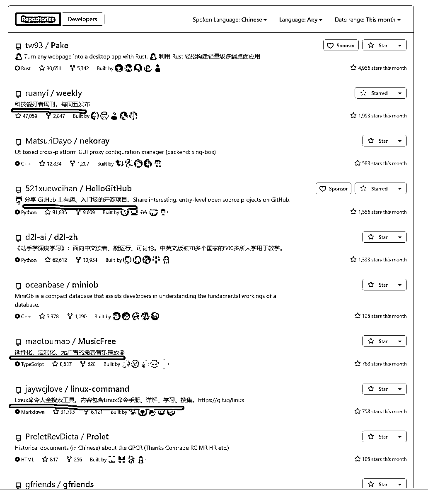

## X 趋势

**使用场景：** 在 X 这个平台上，看下当前受欢迎的内容，同理使用各个社交平台的 API，或者搜索对应平台的趋势，可以看到海内外的一些自媒体内容。**免费使用** 。

链接：[`x.com/explore/tabs/trending`](https://x.com/explore/tabs/trending)

**使用案例：**

因为一些特殊的原因，我这里当前显示的是日本那边的趋势，点开第一个可以看到，现在在那边某明星饮料好像挺火。

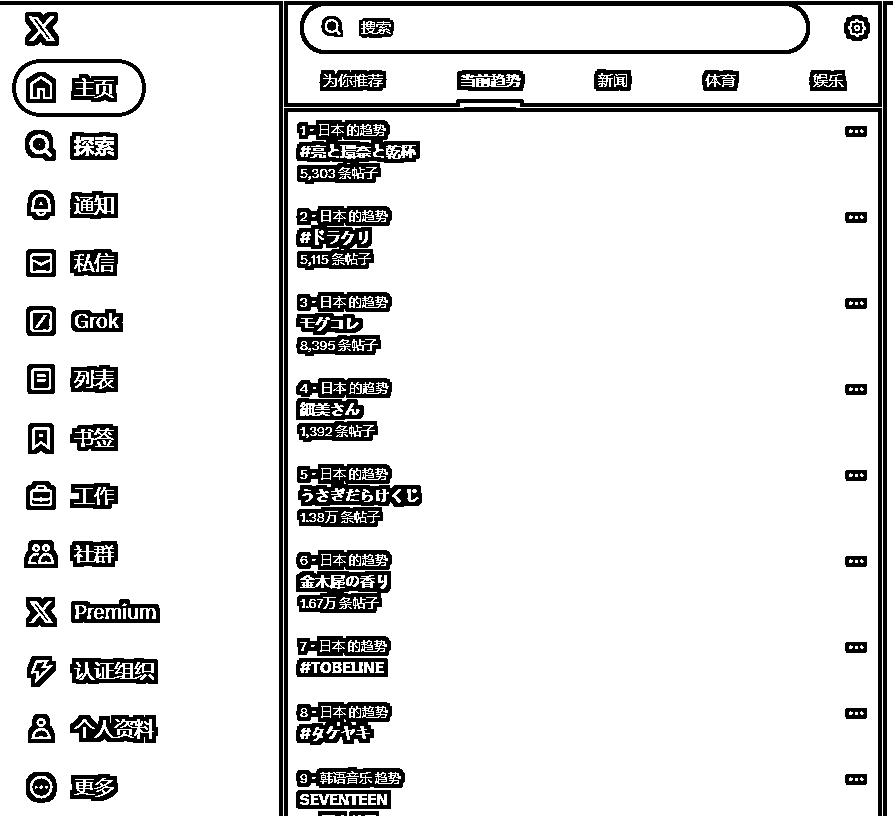

## SimilarWeb & Semrush

**使用场景：** 用于分析网站或应用的流量数据和用户参与度。它可以提供竞争对手分析、用户行为趋势、流量来源以及地区受众等数据，帮助你了解某个网站或应用的市场地位和用户增长趋势。**收费使用** 。

我使用的比较多的场景是和 google
trends 搭配起来，当我看到一个好玩的网站，我会尝试把该网站放到 SimilarWeb 里面分析，**看下都是什么人在看这个网站、这个网站的哪些内容看的人最多，同时对于人们关注的内容延伸搜索，这些内容背后，反应了用户的需求，抓住细分需求，就能从中赚到一些钱。**

链接：[`www.similarweb.com/zh`](https://www.similarweb.com/zh)  [`zh.semrush.com/projects/`](https://zh.semrush.com/projects/)

使用教程：[`scys.com/view/docx/HA9gdKmiLodgznxfwCYc44GtnDf#doxcnTXopfewLQkxJNJ1PRqEu7f`](https://scys.com/view/docx/HA9gdKmiLodgznxfwCYc44GtnDf#doxcnTXopfewLQkxJNJ1PRqEu7f)

**使用案例：**  [`zh.semrush.com/analytics/organic/positions/?db=us&q=bargpt.app&searchType=domain`](https://zh.semrush.com/analytics/organic/positions/?db=us&q=bargpt.app&searchType=domain)

我平时喜欢喝鸡尾酒，结合 AI 我就想，能不能使用 AI 制作鸡尾酒配方呢？然后发现了一个使用 AI 制作鸡尾酒的网站，通过在网站上的数据，可以看到还是很赚钱的；同时一些关键词竞争难度小，使用 AI 辅助也不是很难做；正好我在做网站出海，就打算从这个相关方向入手，做个类似的网站。

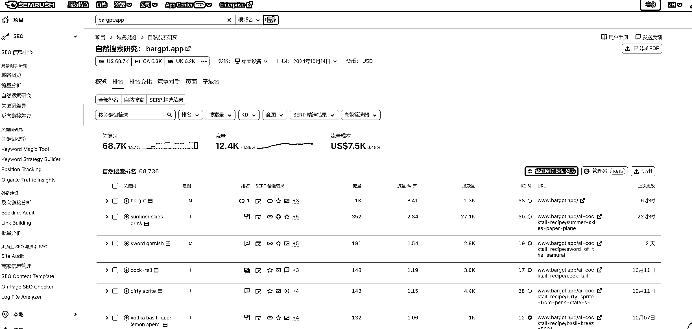

以下是我使用 cursor 还没做完的网站，目前核心功能已经做完，还有很多个细节，优化亿下，应该就可以发布。

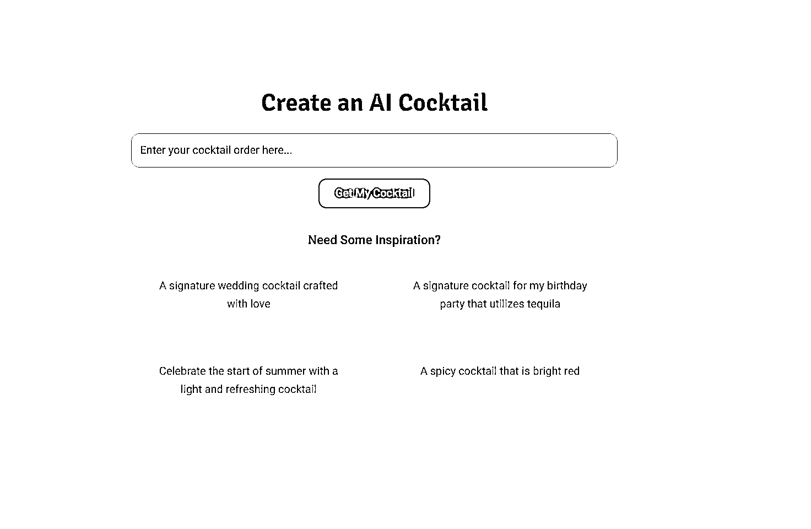

## 个人博客网站

**使用场景：** 很多个人博客网站，都包含着很优质的信息，其中有些信息最近还被我拿来小小的赚了一些钱。此类网站需要长久的收集，在**上文提到的 github
trending 里** ，我就看到过一个项目，里面包含了很多的**中文独立博客列表** 。此外，还有很多未被收录的个人网站，在搜索信息的时候会看到；很多个人博客网站也都会添加友情链接，顺藤摸瓜会发现好多个人网站。

同时，很多个人博客站都会放自己的某一个社交平台的链接，在平台上经常也能看到一些内容分享。

链接：[`github.com/timqian/chinese-independent-blogs`](https://github.com/timqian/chinese-independent-blogs)

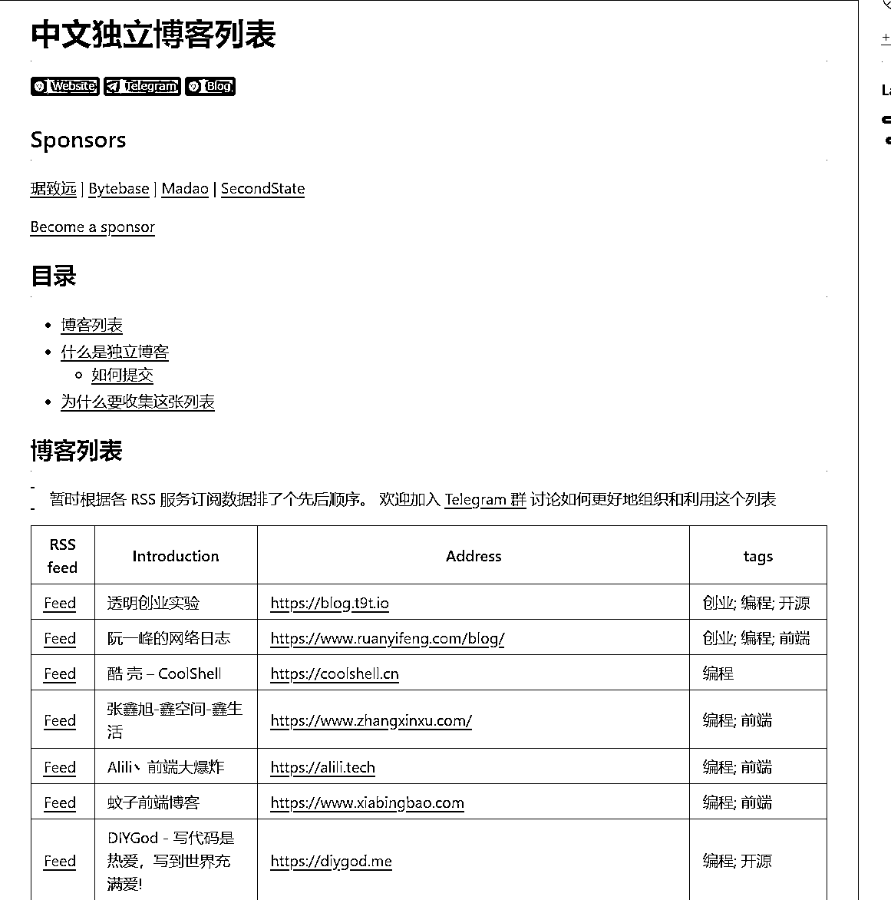

**使用案例 1：**

前段时间使用 AI 的时候，有需要绑定国外的手机号的，我就搜索到了这个在个人博客上的教程，教程详细介绍在便宜好用的 esim 卡渠道，我个人需求解决后，去咸鱼也发布了 esim 卡信息，帮他人购买，成本不到 20￥的卡，卖 50￥每天也是有人要的。

链接：[`azhu.site/posts/1021/#:~:text=Moldteleco`](https://azhu.site/posts/1021/#:~:text=Moldteleco)

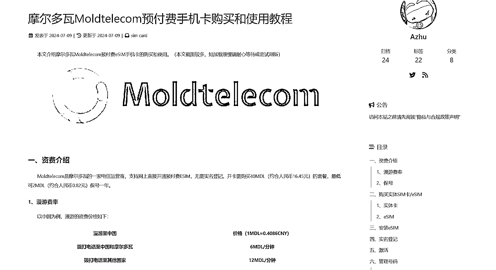

**使用案例 2：**

通过友情链接，获取更多个人博客地址，拿到更多信息。

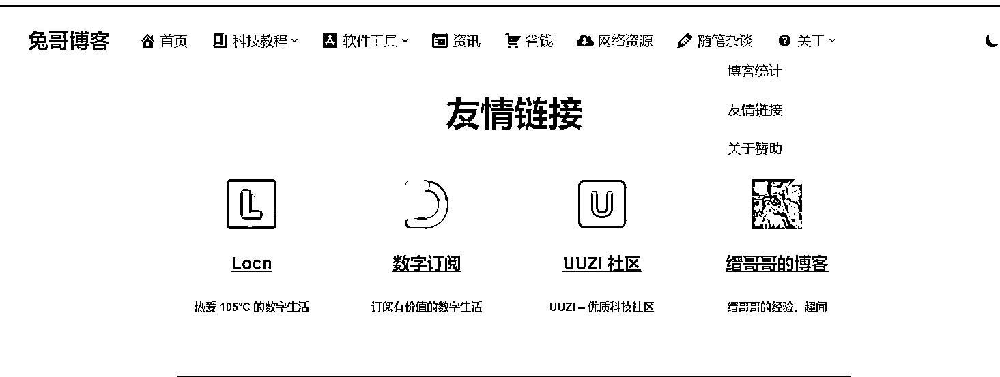

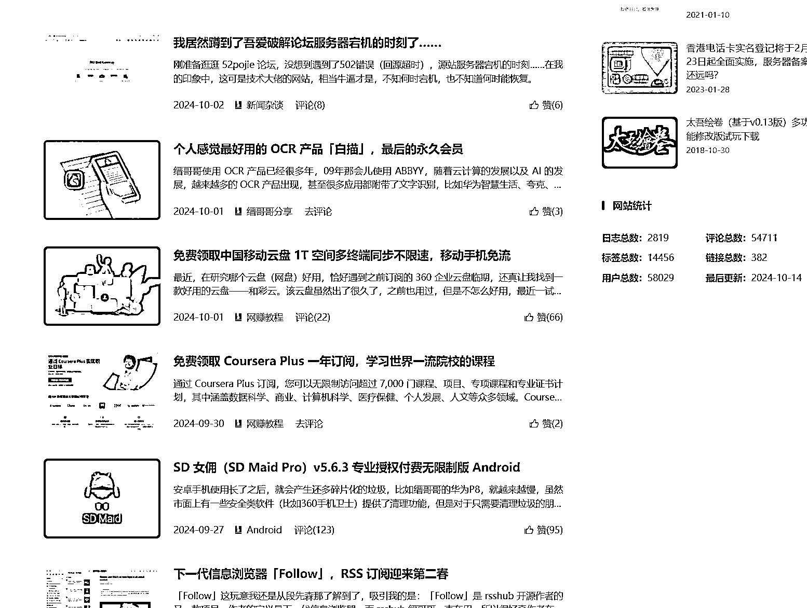

## 洞见研报

**使用场景：** 全行业研究报告,免费阅读下载市场分析报告，想了解某个不熟悉领域、或者看行业详细数据的时候我会用到它。

链接：[`www.djyanbao.com/report/search`](https://www.djyanbao.com/report/search)

**使用案例：**

生财航海有 web3 交流，在洞见，可以进行相关搜索，看下国内外机构对于事物的报告，从中可以获取到相应数据；网站右上角也有当前热门搜索，也是一种获取新兴事物的方式。

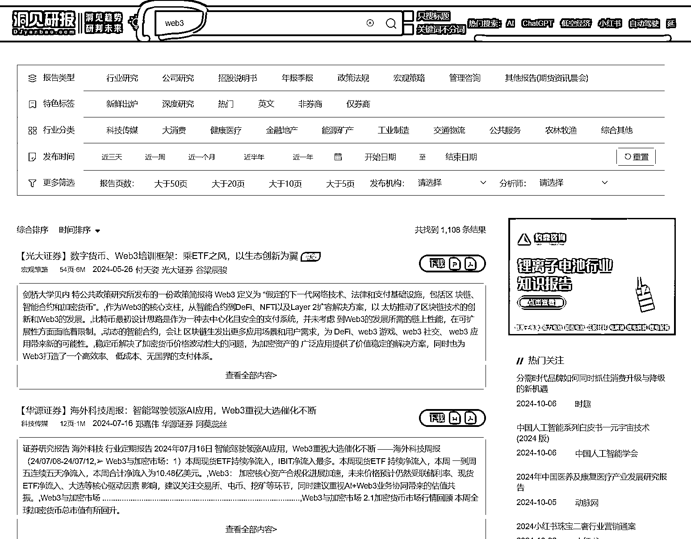

## exploding topics

**使用场景：** 发现热门话题的网站，一个人的经历是有限的，当我不知道有什么事物比较火的时候，我会去网站上看一下，有什么在**快速崛起热门话题** ，搭配上面提到的 Google Trends、Sem 等、或者将内容以另一种形式，**在国内自媒体平台进行创作，应该都是很不错的选择。**

链接：[`www.djyanbao.com/report/search`](https://www.djyanbao.com/report/search)

**使用案例：**

链接：[`explodingtopics.com/topic/spacegoods`](https://explodingtopics.com/topic/spacegoods)

在网站上发现了一个在英国，主要是多种**营养成本补充剂** 的，去 Google
Trends 搜索了一下，是 22 年 5 月份才出现的一个新词、以及新商品，主要受众地是在英国，那么如果有做外贸的，或者相关行业的老板，是不是可以因地制宜，做一些相关的呢？**这不就是获取了新的信息么？**

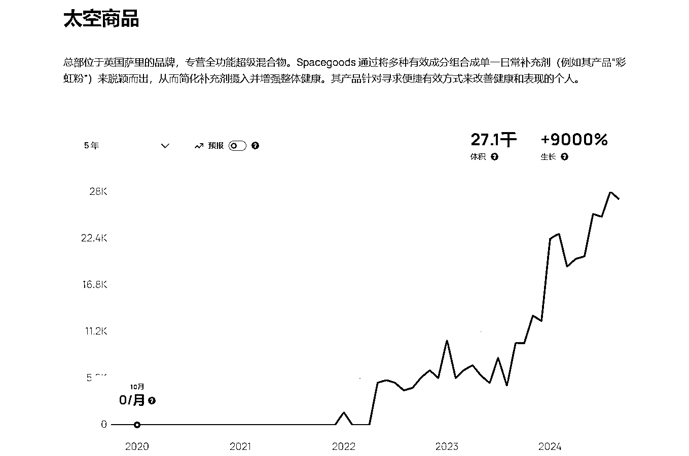

#龙珠悬赏

* * *

评论区：

暂无评论