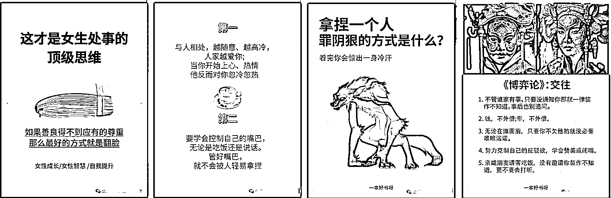
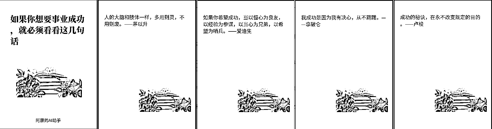

# 借助 AI+RPA 实现小绿书图片一键生成和自动发布，可矩阵（小白级工作流详细讲解，附：影刀脚本）

> 原文：[`www.yuque.com/for_lazy/zhoubao/ggmgbh74m1v4pe8n`](https://www.yuque.com/for_lazy/zhoubao/ggmgbh74m1v4pe8n)

## (精华帖)(192 赞)借助 AI+RPA 实现小绿书图片一键生成和自动发布，可矩阵（小白级工作流详细讲解，附：影刀脚本）

作者： 陈序员大康

日期：2024-09-29

听说最近，小绿书流量不错？于是我去大致看了一下小绿书的形式，发现好多形式挺简单，很多其实没有做的很绚丽的，数据也不错。也就是说，估计又是一个吃流量红利的一波。以下是小绿书的展现形式

**我一瞅，这么简单的形式，按我的习惯，不管三七二十一，先自动化了再说，后面再根据情况优化内容，这个是我目前一键生成的简单效果：**

**我发现群里很多朋友都是刚接触工作流，他们在用我工作流的时候，老习惯一个卡点就问我问题。不是说问问题不对，而是问的问题不对。就是感觉，纯粹是为了搭建而搭建，却没理解整个原理和思路。**

** *因此，这一篇分享，我将详细讲解搭建思路，方便刚接触的小白用户，可以更好理解***

# 整体功能思路

首先，我们分析了一下，小绿书的展现形式，小绿书主要由，标题，简介内容，以及多张图片内容组成。标题，内容简介，这几个都可以通过 coze 的工作流实现。

但是，我看了一下微信接口文档，暂时没有图片形式的发布接口，因此，自动发布这部分，要交给 RPA 实现，**没法像之前的图文一样，一个工作流一步到位**

因此为了让工作流产出的内容，可以转接给 RPA 拿去发布，所以我选择了飞书作为存储媒介。所以整体流程如下：

**开始** **》工作流产出内容 ==》录入飞书表格****》RPA 拉取表格内容，批量发布 ==》结束**

需要注意的是，**本教程还是沿用创作罐头作为多账号发布的工具，如果大家不知道这套方案，需先了解一下**

[借助 AI+RPA，打造公众号爆文完全自动化工具](https://b121w2zgwyx.feishu.cn/docx/V4ysdJ4Jgo8GLdxLW7YcGAEbnWh) 这篇文章

接下来开始具体的步骤：

# 一、一键生成小绿书图片工作流搭建

工作流源码我已经分享到社群团队，社群成员朋友，可以直接查看复制。工作流的搭建与讲解，大家可以看下面介绍

## 1、整体工作流搭建前的准备。

在完成，主体工作流前，我们分析一下，整个工作流需要哪些元素。

① 一个大模型节点，为我们写简介内容。

② 一个大模型节点，为我们产出正文内容。（理论上可以用一个大模型搞定。但我习惯一个大模型尽量只干一件事，太复杂不稳定）

③ 一个封面图制作工作流

④ 一个内容图制作工作流

⑤ 一个主体图片生成图像流

⑥******一个录入内容到飞书的插件，这个在上一篇文章有介绍，没有做好插件的，要先去做一下插件（很重要）**

[如何只使用扣子 AI 工作流，将文章自动生成+自动配图+批量发布多个公众号，完全自动化？](https://b121w2zgwyx.feishu.cn/docx/HDE0dSuocoXWPQxGyESc1YKon8b)

## 更好的阅读体验，请跳转[`b121w2zgwyx.feishu.cn/docx/DFJrd1G1KozPCHxCNG7csGoLntb`](https://b121w2zgwyx.feishu.cn/docx/DFJrd1G1KozPCHxCNG7csGoLntb)

* * *

评论区：

嘉应岛主 : 期待来一个知乎带货文，我太讨厌写文案了[捂脸]

一栗米范 : 期待+1

彬୧😊૭ : 期待+1

陈序员大康 : 给我来个知乎带货经典案例

刘卡卡 : 牛的 感谢分享

墨鱼 : 第一个： 第二个：
云测评好物带货类的文章[`zhuanlan.zhihu.com/p/219702607?utm_psn=1823785963186429952`](https://zhuanlan.zhihu.com/p/219702607?utm_psn=1823785963186429952)[`zhuanlan.zhihu.com/p/377638776?utm_psn=1823786147333156865`](https://zhuanlan.zhihu.com/p/377638776?utm_psn=1823786147333156865)

刘成 : 这个太棒了

凉风 : 哭了，八爪鱼不支持苹果电脑