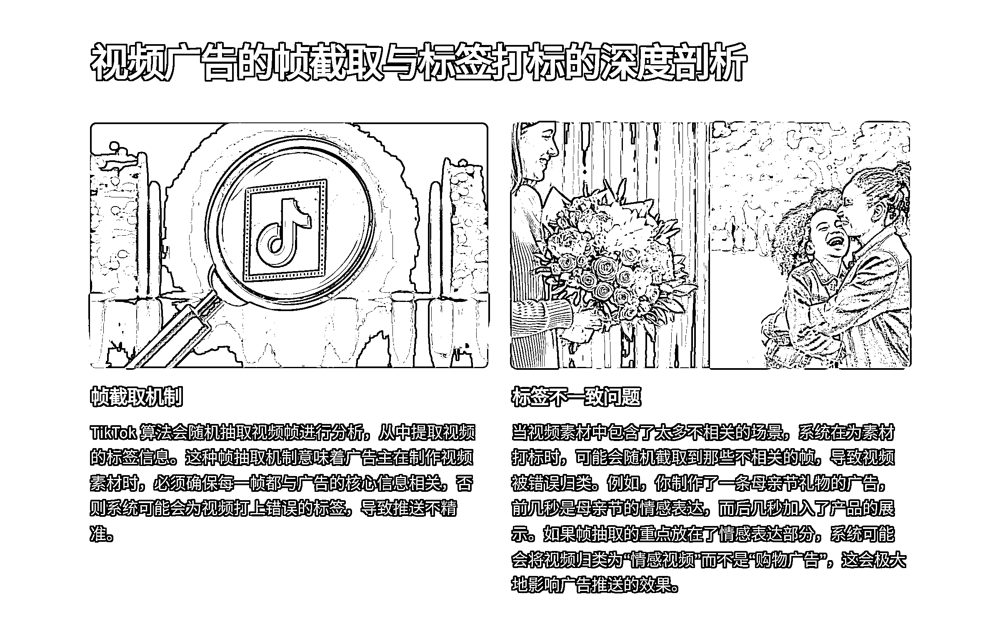
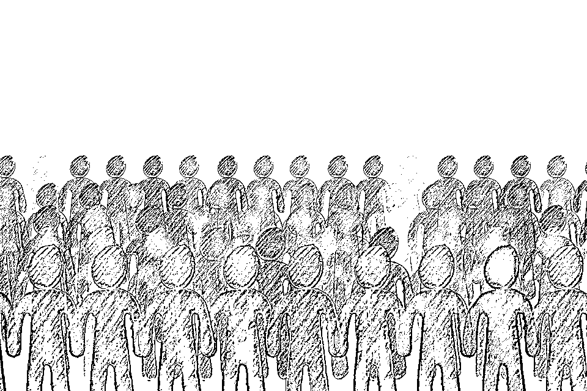

# TikTok Ads 旺季实战放量宝典

> 原文：[`www.yuque.com/for_lazy/zhoubao/yu8m65igbngmk211`](https://www.yuque.com/for_lazy/zhoubao/yu8m65igbngmk211)

## (17 赞)TikTok Ads 旺季实战放量宝典

作者： 梁小伟

日期：2024-10-08

大家好，我是梁小伟，大家都喜欢叫我皮皮，生财大佬多多，有写的不好的地方欢迎提出改进意见。

TikTok 广告的效果往往成为很多人头疼的问题。有人花了大笔预算，结果广告效果惨淡，点击率好到爆，转化率让人怀疑人生。广告空耗不仅仅是预算的无情消耗，还直接影响广告主对平台的信心。今天我们就来深度剖析，为什么你的 TikTok 广告效果不好？空耗的背后有哪些核心问题？以及如何通过策略优化，减少这种令人抓狂的浪费？

**平台算法逻辑与用户行为模式——深度分析**

#### 1.  **TikTok 广告推送机制与兴趣电商逻辑**

经常皮皮群，很多 FB 转 Tik
Tok 的皮友，都在吐槽 TikTok 广告效果差，其实 TikTok 的广告平台与传统的 Facebook 或 Google 广告有着显著的不同。其背后的**兴趣电商逻辑** 决定了 TikTok 广告的推送不仅依赖于用户的行为数据，还强烈依赖于广告内容本身的标签与创意元素。

TikTok 不是根据用户的明确购买需求来投放广告的，这个很关键，而是更多依赖**兴趣引导和情感种草** 。这意味着，用户在看到广告时，可能并没有立即购买的冲动，但广告会为他们**种下兴趣的种子** ，引导他们在未来某个时间点（甚至是在其他平台）进行购买。

#### 2.  **TikTok 的算法逻辑：视频内容分析与标签打标**

我之前的文章就有详细写过，TikTok 的广告算法核心在于它的**视频内容分析与标签打标机制** 。平台通过**机器学习模型** ，对每个广告视频进行内容识别，包括视频中的图像、声音、文本（如标题和描述）等元素。然后，算法会根据这些识别结果，给视频打上对应的标签。

**问题：视频标签打标不精准，导致广告投放效果差**

广告素材中的标签决定了它最终会被推送给哪些用户群体。如果视频的标签不够精准，或者素材内容过于分散，系统无法为视频打上明确的标签，广告就会被推送给不匹配的用户群体，从而导致大量的流量浪费和广告空耗。

**标签打标与推送效果的关系** ：假设你制作了一条科技产品广告，其中加入了搞笑元素或者其他无关的场景。TikTok 的算法可能会误认为这是一条搞笑视频，而将广告推送给喜欢搞笑内容的用户。最终，虽然广告得到了很高的曝光量，但这些用户并不对科技产品感兴趣，导致点击率低、转化差。

**  **

**解决方案：精准的标签设置与素材优化**

**保持视频素材的简洁性和聚焦性** ：广告素材应当围绕核心关键词展开，避免加入无关的元素和场景。素材的每一帧画面、标题和文案都应当与产品的核心卖点保持一致，确保系统为视频打上精准的标签。

**简短且直接的广告形式** ：TikTok 的用户习惯于快速消费内容，因此广告素材不宜过长。广告主可以将视频控制在 15 秒到 30 秒之间，重点突出核心信息和产品特点，让系统能更好地识别出广告的主题和标签。

#### 3.  **用户行为驱动的广告推荐机制**

其实 TikTok 的广告推荐机制主要依赖于**用户行为数据** ，包括用户的观看时长、点赞、评论、分享等互动行为。每一次用户的互动都会帮助算法进一步了解用户的兴趣偏好，从而推送更符合他们兴趣的广告内容，通俗的来讲，你的广告受众不仅是你的客户，还是你的打分员，这一群人的打分影响你的广告成本，以及你判断这条广告好与坏的关键。

**问题 2：用户行为数据波动大，导致广告效果不稳定**

TikTok 的广告推送算法与用户的短期行为高度相关，这导致广告效果具有**高度的波动性，这个波动性很有意思** 。广告的效果在不同的时间段、不同的用户群体中表现出很大差异，这使得广告主难以找到稳定的投放策略。一条广告可能在某段时间内表现很好，但随后效果迅速下滑，或者某些广告开始效果一般，后期突然爆发。

**广告效果的波动** ：假设你投放了一条广告，前几天点击率和转化率都很好，但随着时间推移，广告效果突然下滑。这种波动实际上是因为**用户的兴趣偏好变化** ，以及系统调整推送人群所致。算法会根据用户的短期行为不断优化广告的展示，但这种优化往往伴随着人群的随机性和不确定性。

**解决方案：分阶段扩量+保持广告组复制**

**广告投放的分阶段扩量** ：广告主不能一次性提高大量预算，而是应该分阶段逐步扩量。通过小规模增加预算，逐步测试不同人群的反应，减少广告效果突然下滑的风险。

**复制广告组+持续优化** ：TikTok 广告的核心策略之一就是通过**复制广告组** 来找到最佳表现的组合。在初期阶段，可以同时投放多个广告组，通过数据分析找出表现好的广告组，复制这些广告组并进一步扩量。表现差的广告组则应及时关闭，避免浪费广告预算。

我上周每天消耗 1000-1500 美金，复制了差不多每天 150 组,6 条素材

#### 4.  **视频广告的帧截取与标签打标的深度剖析**

TikTok 的算法在为视频打标时，会**随机抽取视频帧进行分析** ，从中提取视频的标签信息。这种帧抽取机制意味着广告主在制作视频素材时，必须确保**每一帧都与广告的核心信息相关** ，否则系统可能会为视频打上错误的标签，导致推送不精准。

大家可以多去皮皮看一下高消耗高播放的广告共性

**问题 3：素材帧的随机截取导致标签不一致**

当视频素材中包含了太多不相关的场景，系统在为素材打标时，可能会随机截取到那些不相关的帧，导致视频被错误归类。例如，你制作了一条母亲节礼物的广告，前几秒是母亲节的情感表达，而后几秒加入了产品的展示。如果帧抽取的重点放在了情感表达部分，系统可能会将视频归类为“情感视频”而不是“购物广告”，这会极大地影响广告推送的效果。

**解决方案：保持广告视频的标签一致性**

**素材要围绕核心场景展开** ：在制作视频素材时，广告主应确保每一帧都与产品或广告核心主题相关，不要加入太多无关的场景或元素。尤其是视频的前三秒应当清晰地传达产品信息，让系统能够快速为视频打上准确的标签。

**结合视觉元素与文字信息进行双重打标** ：广告素材不仅要通过图像来传递信息，还可以结合文字标题、字幕等形式，帮助系统更好地识别视频内容，确保打标精准。

#### 5.  **TikTok 广告的内容推荐与个性化推送**

TikTok 的推荐系统不仅依赖于广告素材本身的标签，还结合了用户的历史行为数据，包括他们的搜索记录、点赞、评论、分享、观看时长等。系统通过分析用户的短期行为，自动推送更符合他们兴趣的广告内容。

### 第二部分：广告空耗的核心原因与应对策略

#### 1.  **人群匹配不精准：算法的复杂性与投放误区**

在 TikTok 广告中，**人群匹配不精准** 是导致广告空耗的核心问题之一。TikTok 广告推送的精准度依赖于**系统算法的智能化** ，通过用户的互动行为和视频标签来推送广告。然而，TikTok 与 Facebook 的用户匹配模式存在巨大差异。

TikTok 的用户匹配更倾向于从**兴趣标签开始，由外向内逐步筛选用户** 。这与 Facebook 的精细化人群定位形成了鲜明对比，后者是从小圈子往外扩，逐步拓宽人群。因此，TikTok 的投放策略决定了其人群匹配更具随机性，广告组容易撞到不相关的用户群体，导致广告展示与用户需求不匹配。

**补充示例：**

**人群错配的常见误区** ：广告主往往会误以为 TikTok 的兴趣推荐能够自动精准匹配人群，但实际上，**广告人群的扩展** 存在一个复杂的博弈。如果出价和素材表现不佳，系统就会开始推送给更多“边缘兴趣人群”，导致曝光量高但转化低。

大家看，同样的素材，cpm 不一样，点击点击率也不一样。

**解决方案：**

**优化广告素材标签** ：广告素材标签的设置要尽量聚焦在核心用户群体上。不要加入过多无关内容，让系统准确打上兴趣标签，推送给高相关度人群。

**分阶段人群扩量策略** ：不要一次性扩大人群，而是**逐步增加出价** ，让系统从小范围内找到最佳受众，再逐步向外扩展。这种方式可以避免因一次性扩展人群导致的广告效果下滑。

**多素材人群测试** ：通过面向不同需求不同人群的素材进行多人群素材，例如常用的 AB 测试。进行多场景多群体匹配，测出购买人群。

#### 2.  **出价策略的失误：TikTok 与 Facebook 的竞价差异**

**TikTok 与 Facebook 的竞价策略差异** 极大，这也是许多广告主在 TikTok 上出现广告空耗的另一个主要原因。TikTok 的出价系统并不像 Facebook 那样稳定，出价过高或过低都会导致广告效果的严重波动。TikTok 的出价策略决定了广告的展示频次和人群匹配效果，因此，如果你的出价不合理，广告会迅速“死掉”。

**问题：出价不合理，导致广告空耗**

在 TikTok 的广告投放过程中，广告主常常会陷入“**出价过高广告效果却下滑** ”的困境。这通常是因为 TikTok 算法会优先推送广告给已经对某类商品表现出高需求的人群，但这些人群往往已经饱和，继续提高出价反而会让广告推送到“兴趣边缘”的用户，造成出价越高效果越差的局面。

**补充示例：**

**高出价的副作用** ：例如，你正在推广一款价格较高的科技产品，当出价达到一定门槛后，广告会被推送给那些已经对类似产品表现出较高兴趣的用户。但这些用户可能已经在其他地方购买了类似产品，或者不再对该类型产品有需求，这就导致你的广告在这些人群中失去了效用，出现了大量的无效展示。

**极限出价的潜在优势** ：与此相对，适当的**低出价** 反而能帮助广告在精准用户群中保持长期的曝光，并通过多次展示逐步影响用户购买决策。

**解决方案：**

**阶梯式出价策略** ：避免一次性大幅度提高出价。建议采取阶梯式出价法，从 5 到 20 美元不等，逐步增加或减少 1-2 美元，测试合理的出价区间，并观察广告效果的变化。

手动出价的情况，出价是动态调整的，除非他的流速合理正常。如果不消耗或者消耗快的情况，就要进行实时调整

**复制广告组与控制流速** ：如果某个广告组效果好，小幅度加预算，而是通过**复制广告组** 的方式扩大曝光量，维持广告的转化率。

#### 3.  **CPM（每千次展示费用）过高：竞争与广告表现之间的拉锯战**

在 TikTok 广告投放中，**CPM（每千次展示费用）过高** 是许多广告主头疼的问题。特别是在某些高竞争的品类中，TikTok 广告的 CPM 成本逐年增加。这一问题的核心原因不仅在于市场竞争的加剧，还在于广告素材的表现不够出色，无法吸引足够多的用户点击，导致展示费用持续走高。

**补充示例：**

**CPM 过高的原因分析** ：广告的 CPM 过高通常是因为广告素材的点击率（CTR）不够高，算法认为你的广告“质量不佳”，因此在竞价过程中抬高了你的展示费用。此外，如果你的广告素材标签过于宽泛，系统会推送广告给不相关的用户，导致用户无感兴趣的行为，进一步推高了 CPM。

**垂直类目中的 CPM 困境** ：在某些高度垂直的类目（如科技产品、金融服务）中，TikTok 的 CPM 会因为竞价激烈而迅速升高，特别是当多个广告主争夺同一类用户时，单个广告的展示费用可能会远超预期。

例如商品卡广告这方面特别明显，商品卡流量精准，但受众始终有限，竞争激烈后成本增加。

从 15 美金涨到 20+美金的 cpm

**解决方案：**

**优化素材点击率（CTR）** ：素材的表现至关重要。广告主需要通过测试多个素材版本，寻找点击率（CTR）较高的版本，以降低 CPM。一般情况下，CTR 超过 2%的素材会有较低的 CPM，并能有效提高广告的整体 ROI。

**多层次素材测试** ：通过对不同版本的素材进行多层次测试，选择那些表现最佳的广告投放。特别是高点击率素材能够直接影响 TikTok 算法的评分，进而降低 CPM。

**避开竞争激烈的关键词** ：在高竞争品类中，广告主需要找到相对冷门但相关性较高的关键词进行投放，避免与大品牌直接竞争，以此降低 CPM。

#### 4.  **广告素材的空耗与频繁更换的风险**

TikTok 广告空耗的另一个主要原因是垃圾**广告素材的频繁更换** 。很多广告主为了“追求新鲜感”频繁更换同质化素材，不追求质量而过于频繁的更换同质化素材反而导致广告效果不佳。

**问题 4：频繁更换素材导致算法学习重置**

TikTok 的算法需要通过用户行为的反馈来“学习”广告素材的表现。正常情况，广告主频繁更换素材，算法的学习进程被打断，广告的推送效果会大幅波动，导致广告空耗。

**解决方案：**

1.  **保持一定周期的素材稳定性** ：广告素材的更换不宜过于频繁，建议多批次测出稳定素材后，至少保持 1-2 周的投放周期，给算法充分的学习时间。同时，同步迭代新素材以免断崖式下跌。

2.  **多素材迭代测试** ：广告主应当通过多版本素材的迭代测试，找到表现最佳的素材，并将这些素材进行保留和放量投放。在测试期间，可以采用“种草视频+收割商品图”的组合模式，通过种草引导流量，再通过商品图精准收割，确保广告的高转化率。

#### 5.  **商品图广告与视频广告的组合策略**

很多广告主过度依赖**视频广告** 进行推广，而忽略了**商品图广告** 在 TikTok 上的作用。事实上，商品图广告往往更适合针对已经有明确购买意向的用户进行精准收割。

**补充示例：**

**视频种草+商品图收割** ：商品图广告在复购、收割用户方面有更高的转化率。例如，一个用户可能在观看视频广告时对某件商品产生兴趣，但在他准备下单时，**商品图广告的精准展示能够有效促使他完成购买** 。

**解决方案：**

**双效模式：视频种草+商品图收割** 。广告主应该将**视频广告** 与**商品图广告** 结合使用，通过视频广告种草，商品图广告收割测试的方式同步进行

建议：商品图广告比视频更好讲故事，只是大家都不知道，不可能每一个商品都拍视频。视频不可能每个商品都有大量素材去支撑销量，而商品图讲故事更简单，包括平台也会将商品图根据人群进行排序，适合复购，收割。

案例分析

广告主：lumorea.com

广告开始时间 - 广告结束时间: 2023.04.07 - 2024.10.08

总广告数: 1.2K 广告播放：2.1M

lumorea.com 复制 1200 条广告组，其实是同一个广告素材。

广告素材一：广告播放：89.7k

广告素材二：广告播放：**68.5K**

广告素材三：广告播放：32**K**

总结：标签打得不准、用户行为波动大、出价策略错位等往往是是广告效果不佳的核心原因。

通过优化广告素材、精准投放、以及巧妙结合视频与商品图广告，你可以大幅减少广告空耗，抓住高转化机会，让每一分钱都花得更值！

* * *

评论区：

暂无评论