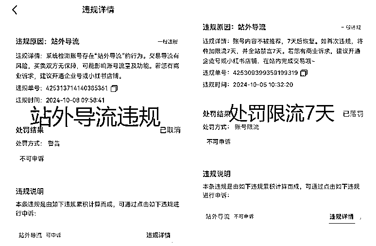
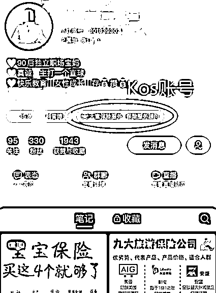
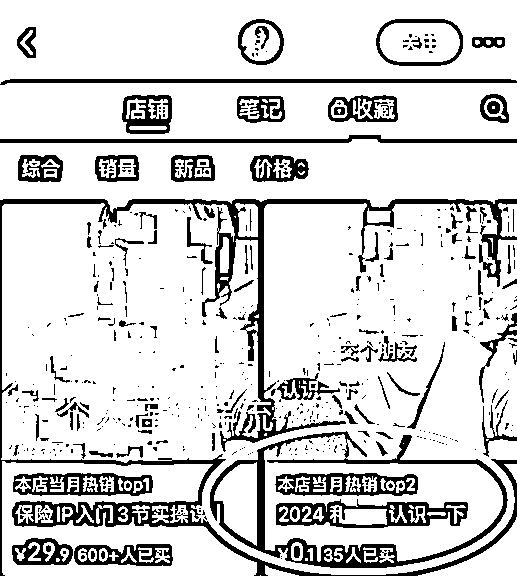

# 小红书私域导流频频违规？一份瑟瑟发抖的合规生存指南

> 原文：[`www.yuque.com/for_lazy/zhoubao/zk6mf72ldrx7iw5w`](https://www.yuque.com/for_lazy/zhoubao/zk6mf72ldrx7iw5w)

## (19 赞)小红书私域导流频频违规？一份瑟瑟发抖的合规生存指南

作者： 阿何🌊

日期：2024-10-11

hello 我是阿何，一个求生欲满满的保险新媒体运营~

9 月中下旬以来，我和同行的小红书账号都受到了“站外导流”的违规通知，2 次提醒限流 7 天，接下来是 14 天……

对于一直“薅”小红书自然流羊毛获客到私域成交的我们来说简直是致命打击！

通过同行交流和官方求证发现，这本不是某个行业特殊性的问题，是针对全站的对私信“导流”（加微信、留电话等）的监管收紧。以前还能钻“引导客户主动留微信”这个空子，目前这条路也完全走不通了

Finally，小红书的商业化时代全面到来了！！

**如果你也有同样的违规困扰，希望这个帖子能对你有所帮助~保险、咨询之类的非标品接下来该如何“合规导流”呢？** 企业蓝 v 号和个人号策略不同：

**一、企业号导流**

目前要解锁“私信白名单”，唯一正规无风险的方法就是开通广告投放业务，也就是“聚光投流”，如果你还没有了解过这种方法，可以先看看下面这些小白须知。

**√什么是聚光？**

小红书营销的一站式广告投放平台，通过信息流、搜索排名、全站智投等方式，让内容去匹配精准客群曝光，实现种草产品、销售商品、收集客资、推广直播等等的营销需求。

即便上述的需求你都没有，那也有解锁“私信白名单”这个隐形的好处。

**√聚光充值门槛？**

1、情况一：链接官方运营团队，投手协助投流、优化和数据反馈等服务

新客户：1w 起

老客户（非首次充值）：5k 起

2、情况二：不对接官方，纯自己投放操作

新客户：3k 起

3、情况三：通过三方代理商（服务商）充值

新客户：2k 起

*这种情况要注意甄别机构，谨防受骗

**√只充值不投放消耗可以解锁“私信白名单”吗？**

不行。

目前小红书对“私信白名单”做了设置，如果停投 2 天以上，将回收该功能。

也就是按照官方要求，投放频率每周差不多 3 次。

**√投放金额门槛？**

不低于 100

结合前一个问题的投放频率，可以得出结论：

如果你单纯就是想交个“保护费”，通过“聚光投放”解锁私信白名单功能，每个账号、每个月最低的投入在 1200 元左右。

**√个人号能投聚光吗？**

不能，聚光只支持企业号。

个人如果也想投，可以先升级为企业号，或者挂靠一个蓝 v 主号成为 kos 号。

**二、个人号导流——开通店铺**

导流的逻辑无非是如何获取客户信息，在站外联系。这一点，个人号可以通过开通个人店铺来实现，因为客户下单商品的时候是会留下电话信息的。

以保险从业者为例，可以选择“教育类目”，需要押金 1000。

然后上架一个“0.1 交个朋友”、“9.9 咨询费”…这类的产品。

需要注意的是，即便开通了店铺，私信客户导流依然是违规的，开店不是“免死金牌”，而是多了一种导流思路而已。

**三、其他导流方式**

非官方的导流方式也很多，@小号、进群、改小红书号、花样百出的伪装方式……

不过都存在较大风险，我自己就遇到过“炸号”的情况。

一方面，要警惕平台风控，可以多准备一些小号来测试；

另一方面，涉及到第三方的要注意甄别，谨防诈骗。

**关于各种野路子和黑科技，大家感兴趣的话我们可以下次再聊~8**

* * *

评论区：

小韭菜 : 在同城地点表态页面可以留微信号或者二维码，也会展示在主页可以引导查看

陈少 : 这个可以详细说一下嘛、