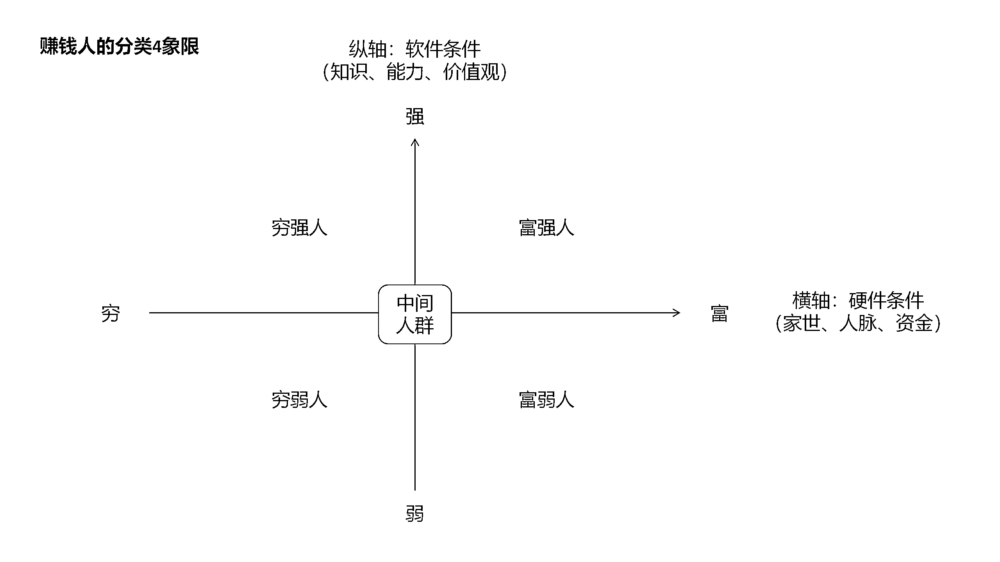

# 为什么生财线下活动需要暂停和调整？关于赚钱路上的五类人，对应的人做适合的事。

> 原文：[`www.yuque.com/for_lazy/zhoubao/wq38b9dei6kmvg7x`](https://www.yuque.com/for_lazy/zhoubao/wq38b9dei6kmvg7x)

## (54 赞)为什么生财线下活动需要暂停和调整？关于赚钱路上的五类人，对应的人做适合的事。

作者： 白菜

日期：2024-10-10

为什么生财线下活动需要暂停和调整？

最近亦仁有一篇帖子说生财线下活动问题比较多，宣布暂停一个月进行研究优化后再开放，我作为第五年生财圈友，抱着共爱生财，共建生财的发心，以及锻炼自己思维和写作能力的想法，分析一下线下活动这个栏目的本质。

粗略地讲，赚钱的路上只有五类人，为了方便理解，我们画一个横轴代表硬件条件，再画一个纵轴代表软件条件。（如图）

硬件条件指的是一个人的资源，包括家世、人脉以及资金。

如果一个人的家世好、人脉广、资金多，我们姑且称这类人叫做富人，相反就是穷人。

软件的条件指的是一个人的知识、能力以及价值观。

如果知识高、能力强以及价值观正，我们就可以称其为强人，相反就是弱人。

因此，根据软硬件条件，我们可以把整个赚钱路上的人划分为五类人，分别是富强人、穷强人、富弱人、穷弱人以及中间人群。

比如一些历经多年至今兴旺的家族掌门人，或者通过长期奋斗成为头部的企业家，他们家世好、人脉广、资金多，知识高、能力强以及价值观正，就属于富强人。

再比如一些独角兽企业主、项目操盘手、行业精英，虽然知识多、能力强以及价值观也很正，但是他们的家底不够厚，生意在扩大，人脉有待扩展，因此属于穷强人。

而广大的上班族、打工者、小生意主，大都是穷弱人，他们知识较少，能力也不够强，价值观有待修正。

我国经过发展到了新时代，出现了不少家境好的年轻人，比如一些二代们。他们家世好，资源也多，但是知识不高、能力不强以及价值观对于强人而言还有很大差距，这类人属于富弱人。

还有一类人，它们既不是强人，也不是弱人，既不是富人，也不是穷人，它们处于坐标的中心，我们可以叫做中间人群。

而赚钱路上的人都有一个共同的梦想，即成为一个富强人。

而穷弱人要想成为一个富强人，需要分两步：

第一步，先成为一个穷强的人；第二步，再成为一个富强的人。

而由穷弱的人变成穷强的人需要三个方面：

第一方面是增加知识，比如看书、看精华帖，不断学习让脑子里有货。

第二方面要实战提高能力。然后第三方面可以修正自己的价值观，与强人看齐。

这三个方面提升后，就能由穷弱人变成穷强人。

但是由穷强人变成富强人，又是一道门槛，这道门槛就是人脉。

因为这个时候必须要扩大生意，不管是伙伴、团队、还是资金，都需要人脉。

而建立人脉需要时间去接触，所以有效的活动组织和完善的活动系统能帮助他们节省时间提高效率。

富弱人容易陷入到链接人脉的假象，他们本身知识能力不高，但他们也想变强。

他们家里有钱、生活无压力、由于上一代人的影响，多少还挺懂待人接物，容易成为链接人脉活动里受欢迎的人。

大家感觉他们既有钱，又没什么功利心，强人看重资源也愿意带他们。

但是他们急需提升的是知识、能力和价值观，否则真正落实到要做一件事情的时候，还是出不来结果。

他们如果自身强了之后，现成的人脉很多，其实不需要过多地寻找资源。

而中间人群要想成为富强人，也需要和穷弱人、富弱人一样走提升知识、能力和价值观的路径。

而一个人成为富强人之后，只有一个重要任务，就是维持他们的成果，主要包括三个方面。

一是做好保障，比如财富管理、保险信托等，万一生意出问题还能保持生活品质和东山再起。

二是看好方向，关注局势和政策，关注科技前沿等，确保路线正确。

三是强化系统，比如建立规则和培养人，让生意生生不息。

可以看出，不同人群当下要完成的任务是不同的，所以这时候就会发现为什么生财线下活动会出现问题而不得不暂停，因为核心是没有做人群区分。

线下活动的主要目的是扩大人脉，而扩大人脉是穷强人的关键动作之一。

他们的生意已经闭环，完成 0-1，有相当的知识和能力，价值观也正。

他们愿意在活动中付出，而付出也能给他们带来正向收获，看到新商机、扩大团队或者扩大生意，对接人脉就能产生价值。

他们会需要线下活动，如果参与活动的人大多数都是同类人，他们的反馈就会很好。

而生财里或者说社会上大多数人属于穷弱人，他们需要增加知识、提高能力和修正价值观，此时链接人脉的效果是很小的。

他们本身价值不高，甚至还不懂如何交换价值，因此无法进行价值交换。

要么他们的生意还在 0-1 的过程，要么他们只是一个生意里的一环。

如果不想浪费时间非要产生价值，往往就会胡乱付费被所谓“割韭菜”，或者在价值观不够正、生意不够强的时候，仅把活动当成引流业务的一个口子，并且未提供良好的产品和服务，所以呈现出来了很多问题。

所以线下活动，应面对穷强人来设计和组织，他们的链接会比较有效，虽然并不一定说不让穷弱人参加，但是大家可以自己心里有数，适合的阶段做适合的事，效率最高。从穷弱人进化至穷强人之后，就很适合链接人脉了。

进而延申到整个生财的所有栏目，我认为对应不同人群所适合关键动作是不同的。

穷弱人：看精华（精华帖、嘉宾贴、亦仁相关栏目，增加知识提升认知）、参加航海、实战出结果、写总结帖子。

穷强人：看精华、看风向标（风向标由于快且短，碎片信息并不能增加知识和提升认知，本质上要生意思维够强够闭环才能抓住新商机，所以并不适合穷弱人，而适合穷强人）、参加航海、参加线下活动、实战出结果、写总结帖子。

根据这些关键动作，形成一个评分系统，圈友完成一个关键动作，就给一个分数，每个月统计发布一次，这样就能看到所有人有没有做，做了多少生财里对赚钱有价值的关键动作。既能激励圈友，又能互相快速了解，还能有助于管理。

这个评分系统，是我在一个运行了 30 多年，拥有 20 多万人的生意社群里看到的，我在里面也待过 5 年，群友们通过这套评分系统，不断修正自己的动作，并且自发管理好社群，很有借鉴意义，也许找天可以写一篇深度剖析这个社群的帖子。

最后，我目前属于穷弱人群，在做公众号爆文的创业领域，今天整理写作素材的时候联想到生财这个事情，因此发帖，望大家指正，共同进步。

祝福生财越来越好。

* * *

评论区：

阿静 : 就很佩服能把抽象的东西具象化的人

亦仁 : “这个评分系统，是我在一个运行了 30 多年，拥有 20 多万人的生意社群里看到的，我在里面也待过 5 年，群友们通过这套评分系统，不断修正自己的动作，并且自发管理好社群，很有借鉴意义，也许找天可以写一篇深度剖析这个社群的帖子。”
这是什么社群呢？期待你的分享。

贤雅 : 我也期待，生财可以约稿？

胖大魔 : 线下活动长效解决良币驱逐劣币。还有激励双赢[撇嘴]

白菜 : 好的！

吴秉晖 : 确实如此，我就自知目前无法给到对方什么价值，所以老老实实不去参加线下聚会，踏踏实实做好当下的事。跟着航海实践。

宇星 : 写的挺好的。也解决了我的一些疑惑。

米杰 : 我猜是 BNI 商会