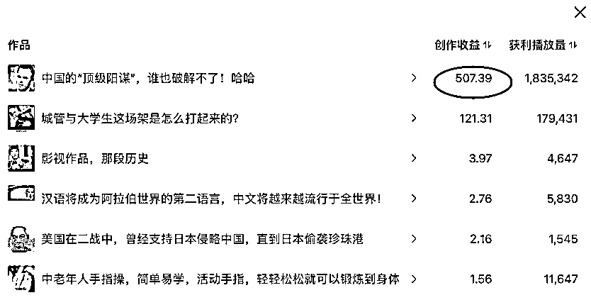
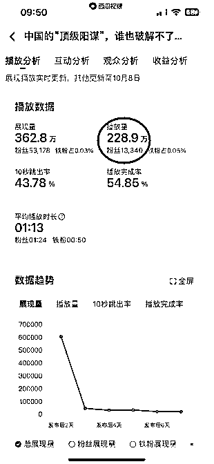
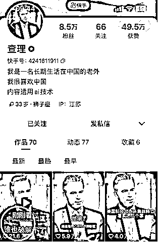
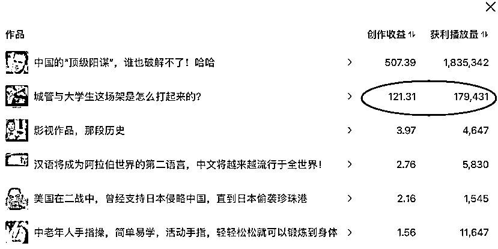
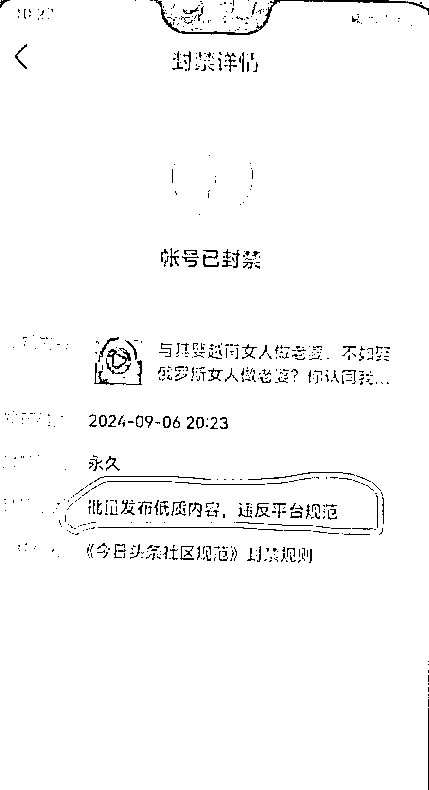
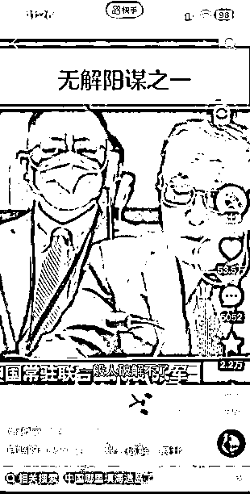
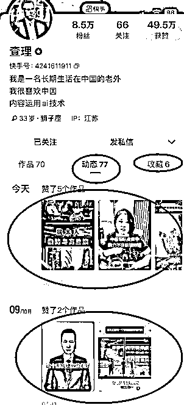

# 从快手搬运视频发到今日头条，一条视频赚了 507 块，这个项目如何才能做到月入过万？

> 原文：[`www.yuque.com/for_lazy/zhoubao/cupae2fms2pkcszm`](https://www.yuque.com/for_lazy/zhoubao/cupae2fms2pkcszm)

## (22 赞)从快手搬运视频发到今日头条，一条视频赚了 507 块，这个项目如何才能做到月入过万？

作者： 旭宏

日期：2024-10-10

我从快手上搬运视频发到今日头条，最近爆了一条，228 万播放量，收益是 507 块钱（见上图）。

这条视频播放量接近 230 万次，平均每 1 万次播放给我带来的收益是 2 块 2，和腾讯视频号创作分成计划的单价 3-5 块钱相比，略低一点：

搬运的过程：

这条视频我是从快手上刷到的，一个叫“@查理”的数字人老外账号发布的口播视频，文案（台词）是很早之前就火过的：“中国的顶级阳谋，谁也破解不了”：

原视频在快手上得到了 21.6 万个点赞，按照我搬到头条后的视频点赞率 4%去反推原视频的播放量，应该在 500 万次左右。

我用的是微信小程序短视频去水印工具下载原视频，然后用剪映花了不到 5 分钟剪辑后，发布到今日头条：

 images.zsxq.com/Fu5HVe7zc3Y5tzvk5PtcVWt56VeX) images.zsxq.com/FsE0x52Fh6450VQdrKX8npXvl4a8)

整个过程就是这样。下面详细复盘、拆解一下，并分析 2 个关键问题：

**1.为什么这条视频能赚到钱？**

**2.这个项目可以放大、一个月赚 1 万块以上吗？**

02

**为什么这条视频能赚到钱？**

这个问题可以转化为：“为什么这条视频会爆？”

答案是：因为它是在快手爆过的视频，原视频有 500 万左右的播放量。而今日头条人数最多的用户是中老年人，和快手的主流用户类型是一样的。

我做的是“搬运”，一模一样的视频，给一模一样的用户群体看，就一样会爆。

文章写到这里时，我突然想到，微信视频号的主流用户群体也是中老年人，也许发到视频号也会爆，于是我就发了，测试一下。

能不能在视频号也爆，我回头把结果写在评论区，分享给大家。

03

**这个项目怎么才能每个月赚到 1 万块钱？**

我从这条视频赚到 500 块钱，花的时间，包括下载、剪辑到发布，也就 5 分钟左右，而且只需要一部手机。

算上从快手搜索爆款视频的时间，也不超过 10 分钟。

要赚 1 万块钱，就需要发 20 条这样的视频，是不是花 10 分钟*20=200 分钟就可以了呢？

显然不是，因为：

搬运 20 条视频，并不是每一条都能够爆。

如果视频在头条上能爆的概率（以下简称“爆率”）是十分之一，那么，赚一万块钱就要搬运 200 条，需要花的时间就变成了 2000 分钟，也就是 33 个小时，接近是打工人一周的正常工作时间（40）小时。

如果“爆率”只有二十分之一呢？那就需要 400 条视频，需要花 66 小时，也就是 2 周时间。

当然，2 个星期能赚 1 万块钱，对很多人来说，也是可以接受的。

哪怕“爆率”再降低一半，只有四十分之一，即每搬运 40 条视频，才能爆一条赚 500 块，时间就得花一个月，搬运 800 条视频，月入过万。

当然，也有可能搬运 40 条，没有一条的播放量“爆了”，但是，只要这 40 条视频加起来的播放量能达到 230 万次，收益（应该）也可以达到 500 块钱。

40 条视频总共要达到 230 万播放量，平均每条视频的播放量要达到 6 万次，要求并不低。

有没有其它办法提高效率呢，有--**提高播放单价** 。

我爆的这条视频的播放单价只有 2 块 2/万次。但是，我这个账号赚钱的视频排名第二的视频，播放单价是 6 块 8/万次（见下图）：

121 块钱/18 万次播放量=6.8 元/万次，是那条赚了 500 块钱视频的播放单价的 3 倍。

但是，要怎么才能提高播放单价呢？我还不知道，有待研究。

违规风险，搬运视频，可能涉及到侵权、与平台已有视频重复度过高、批量发布低质视频违规等问题，我的另一个账号已经因为这方面问题被封号了：

好在今日头条的提现是每周一次，只要你每周都提现，就算你被封号，也最多只会损失一周的收益。

账号数量问题，可能需要一机一卡，提升了成本。

如果视频爆率只有四十分之一，要想月入过万，就得发 800 条视频，平均下来，每天需要发 27 条。

而一个账号发 27 条，肯定会被系统盯上，正常一个账号每天发布 3[5 条是合适的，所以就得准备 5]10 台手机，这样就增加了 5000 块钱左右的成本。

综合以上分析，要想搬运视频做到月入过万，不是不可能，但是有一些卡点要解决。如果能把卡点打通，甚至可能月入 2~5 万。

核心卡点是：

如何降低违规风险；

如何提高短视频的爆率；

如何提高选视频、下载、去水印、剪辑、发布的效率，能否批量。

这三个卡点中的前 2 个，我有一些自己的教训和优化经验，但第三个卡点目前我没有多少经验，如果有过来人可以分享以下经验就太好了。

接下来我先分析前两个卡点的优化方法。

04

**如何降低违规风险**

**方法 1：一机一号一网络。**

我现在 7 部手机 7 个账号，只有一部连 WiFi，其他手机直接用数据，记住其他手机连过 WiFi 的要点“忘记”，强行不让它们自动 Wifi。

一部二手的手机大约 500 块钱左右，手机卡成本大约一个月 10 块钱。

也可以用电脑或者一部连 WiFi 的手机统一下载、剪辑视频，然后用 Landrop 软件发到其它 6 部手机上，再单独发布。

但是要注意传输时得连 WiFi，传输完记得忘记 WiFi，否则可能被平台识别到批量用同一个网络发布。

**方法 2：选视频时注意避免“低质”。**

我被封号的那个账号，发了一条“与其娶越南人做老婆，不如娶俄罗斯人”，内容比较垃圾，加上其它视频也有类似问题（编造话题博眼球），被判定“批量发布低质内容”封号了。

**方法 3：做“伪原创”** ：自己实拍或者学会数字人，模仿爆款口播视频。

自媒体行业有个规律，就是：火过的文案一定会再火。

我从快手搬运的那条视频，原作者也是直接搬运了早就火过的文案，只不过他用数字人老外来重新读了一遍这条文案而已，就有 500 万播放量。

而同样的文案，也有博主用混剪的方式，获得了 53 万点赞，播放量应该超过了 1000 万！

那么，我们是不是可以自己出镜实拍，读一遍文案呢？或者自己做一个数字人呢？

我注意到快手这位@查理的作者，他的收藏和动态里面的视频，全都是文案很好的爆款视频，说明他平时也通过刷爆款视频来找爆款文案：

我们也可以向他学习，找爆款文案来做伪原创。

05

如何提高短视频的“爆率”？

**首先是定位。**

最好是选择人数最多的用户：小城市的中老年人。

我们熟悉的抖音、快手、视频号平台上，这些人数量最多。

他们还普遍喜欢“正能量”视频，比如“厉害了我的国”、“中国人强、外国人弱”方面的内容，很受欢迎。

这些也是比较不容易违反平台规则的内容，有些正能量视频，甚至是平台的鼓励方向。

定位好了以后，就是通过一个爆款去**延伸** 到相关的爆款主题。

比如，中国人的阳谋视频爆了，那么，除了填海造岛，还有其它什么中国人的阳谋呢？搜一下就会出现相关的内容。

这方面，也有很多圈友分享了，就不展开了。

* * *

评论区：

北纬 64 度 : 这个有个风险，就是查重，后续平台会识别出来，你不是原创。我之前发的微博的文案，转为视频的，都把我收益一百多给取消了 也有可能视频文案不查重。我那是文字类文案

旭宏 : 头条会有视频文案重复度过高的违规处罚，遇到过几次，影响单条视频的推荐，不会直接封号。如果是自己实拍或者数字人口播，可以适当修改几个无伤大雅的文字，应该可以降低违规的概率

其实也不行 : 请问今日头条批量上账号，怎么解决账号实名的问题，用亲戚朋友的？

姚先森 : 我的实名账号被永久封号 我再办一张卡 注册账号 行不行

九里香 : 如果是发视频，可以先不实名，用西瓜来发同步头条，头条也会有收益，等到不做了，提现完了一个账号，注销掉了，再实名另一个账号提现。不知道这个方法行不行[呲牙]

九里香 : 如果是去水印和批量的话，用电脑浏览器扩展功能猫抓，打开快手网页版，直接抓下来不带水印的。

旭宏 : [强]感谢分享！

旭宏 : 号商有办法把你的手机号释放出来，我那个被封掉的号就是他们给解决的，然后我用释放出来的手机号又重新注册了一个账号。要注意的是，被封号的那个手机，最好是刷机，因为平台会记录违规的手机的标识。如果不刷机，好像恢复出厂设置也会好一些。
号商大概是通过懂车帝、番茄之类的同一个手机号码的不同 app，然后换绑到另一部手机，这样你被封账号的手机就释放出来了，我没自己操作过，你可以试一下。