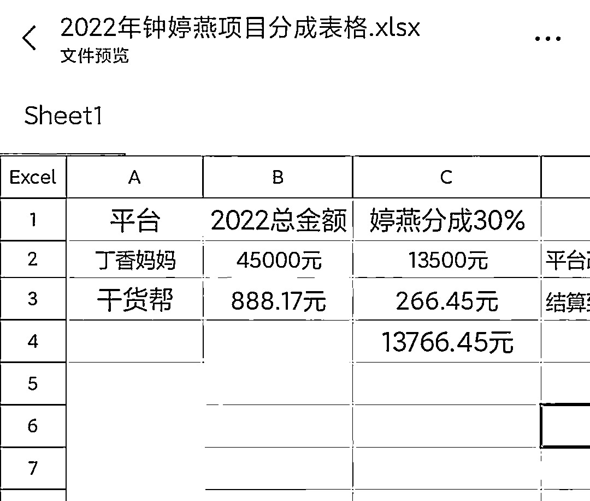
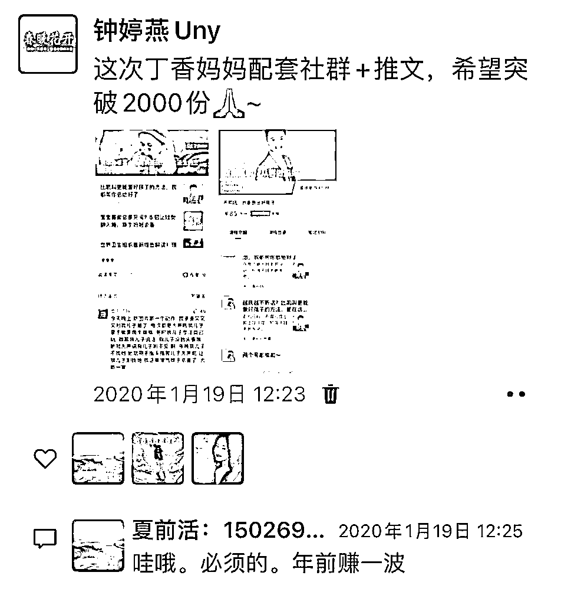
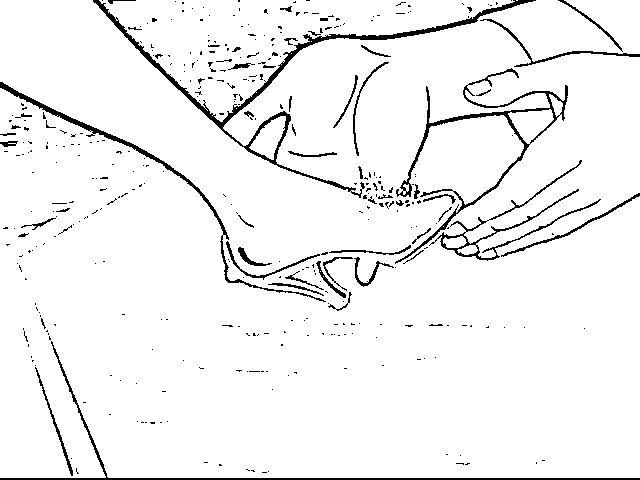
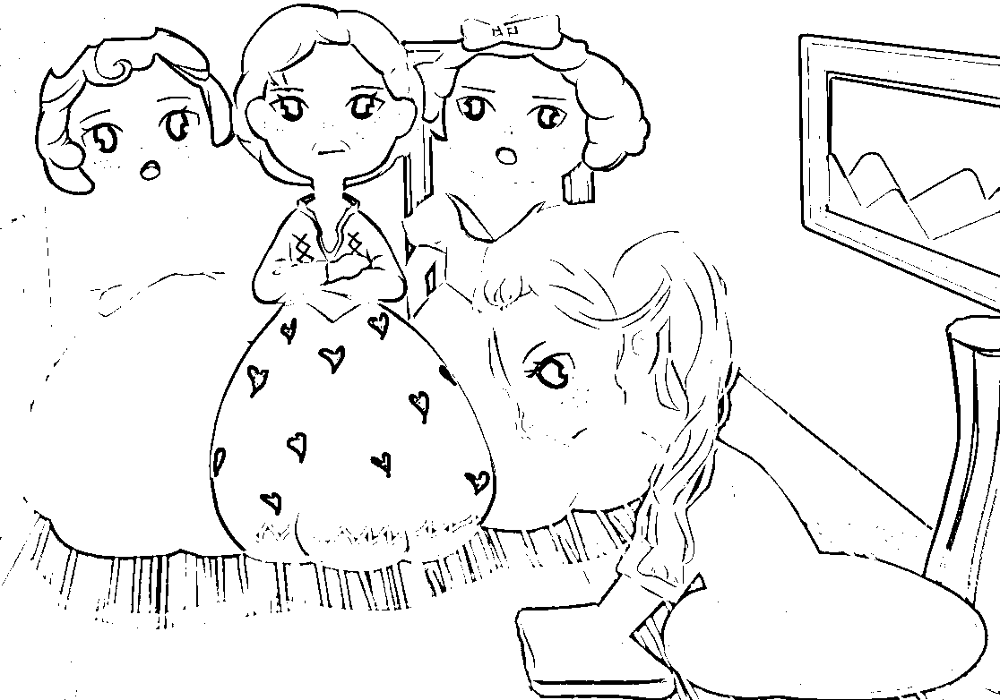
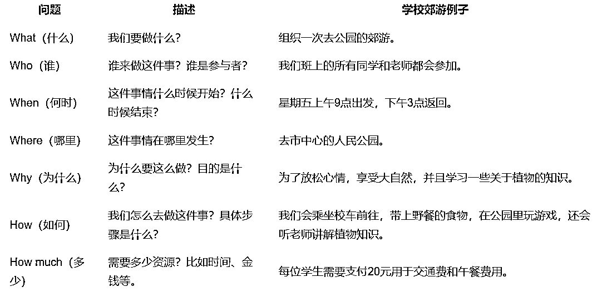
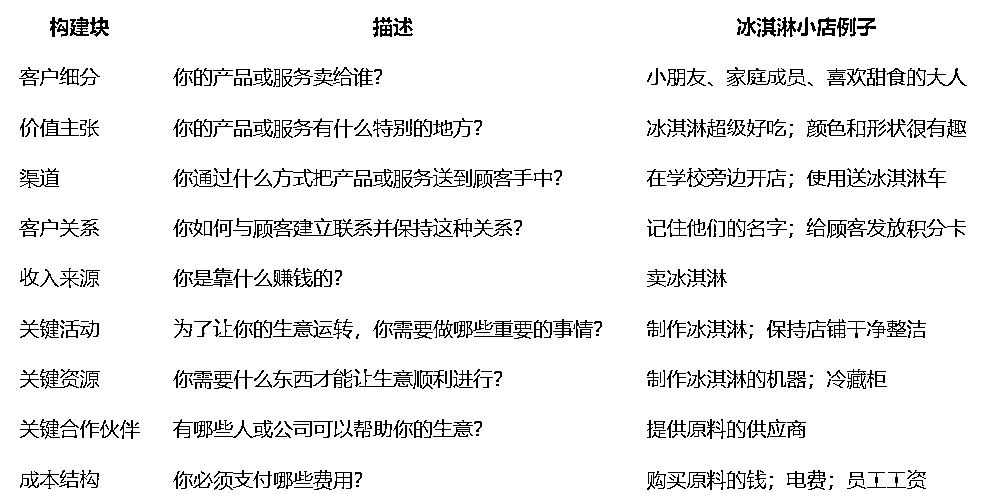
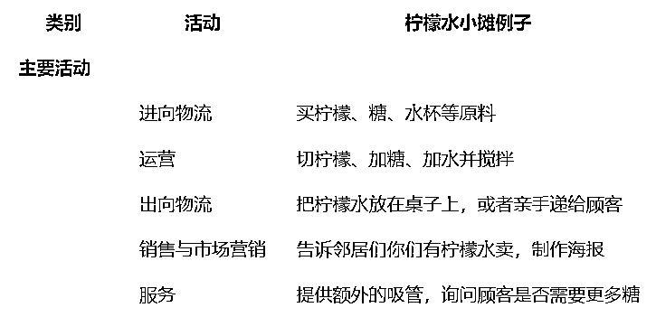
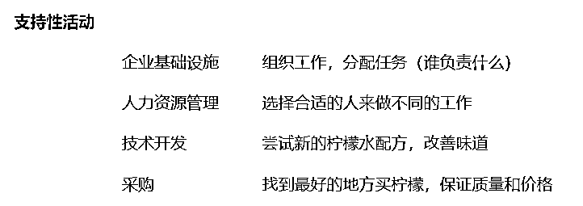
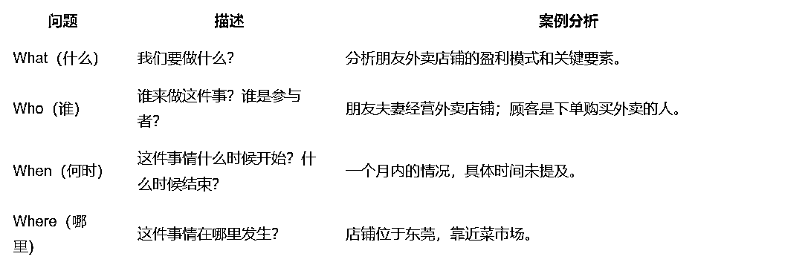
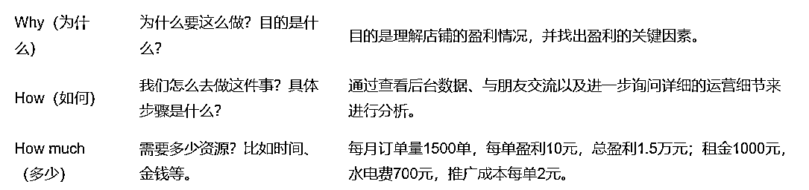

# 普通人想赚小钱和做到一些基本的成绩，是可以用几个方法去衡量！我更建议你遇事不决就追问 AI

> 原文：[`www.yuque.com/for_lazy/zhoubao/clcua9k3i7i5zksn`](https://www.yuque.com/for_lazy/zhoubao/clcua9k3i7i5zksn)

## (19 赞)普通人想赚小钱和做到一些基本的成绩，是可以用几个方法去衡量！我更建议你遇事不决就追问 AI

作者： 嘉应岛主

日期：2024-09-29

**我不建议只靠方法取巧赚钱，构建自己的赚钱的底层逻辑更重要，我称之为嗅知行**

为什么这么说？我从 2019 年做自媒体以来，看到了很多风口，是真的躺赚的风口。例如 2019 年头条知识付费专栏和 2020 年百度知识付费专栏的各自第一批有版权的用户，基本在前三个月都会有收益，我有朋友是卖麻将课程的月入 10W。对，就是，只是把课程放平台，就可以了。过了半年你如果不去运营专栏，那么收益就会降低一半。到现在那么多课程，能赚到的可能只是其中 30%的课程上架方。

就是 2024 也有方法去赚小钱，就是不断去找平台补贴的项目（这个可能我接触不多，等圈友们下方评论补充），或者平台主导有前景利润的项目例如闪购（在这块预见是美团可以占据大部分市场），或者大鱼盛给你的小虾米例如芒果 TV 外包的综艺剪辑，IT 公司外包的项目（这在拼能力的时候也是拼资源）......

**怎么去构建属于自己的嗅知行的赚钱逻辑**

什么是嗅？其实是通过听闻或者现象感觉了这个事情也许有商机，但，是不是，其实你不确定。更正确的说，你无法判断，因为你不知道事件的全貌。

**例如你看到隔壁家的小美把自己带娃的生活放到小红书，粉丝 5W，你觉得这事情靠谱，你脑袋一热，也想去做，却发现自己无法复制。因为你是单身的！这其实同理，你只看别人的成绩—带娃母婴博主月入过万，你没看到她成功的要素是什么—有个可爱且有表现力的娃，因为很直观你很快衡量自己没有娃娃就放弃。**

这时你看自己可以冷静判断从而放弃。市面上那些月入过万带你飞的副业，你反而没办法分辨是否是真的，如果是真的，你也没把握自己是否能成？其实每个人认知、经验、能力和资源是不同的，你看到别人成功的一面，但是你没看到他成功的要素是什么？

**这时候别只看成功，你去把他为什么成功的因素列出来，跟自己对比，是否自己有优势又或者自己能跟上？**

这时候其实做也就是行，其实在听到，判断洞悉之后。

也就是最重要的是，嗅与知。

**没想到第一个门槛是嗅**

这就不意外我们生财会有 2000 入门的门槛费用。物以类聚，人以群分。我们其实都是各自待在自己的圈子里面。想要获得信息，就要有信息源，就要去破圈，去接触不同圈子的人、事、物。

这时候你也会有难题，就是，去哪里破圈？破圈后怎么与人交际认识。这些都是得去修炼，总之别太懒。

人类很多必须要获得的不少就需要依靠交际，例如恋爱结婚。躺在家里，等着白马王子到来，不觉得不切实际吗？你连门都不出去，谁认识你。

**连躲在家里打扫拖地的家政灰姑娘，为了舞会，依靠神奇的力量获得了马车、礼服和玻璃鞋，从而获得了王子。连灰姑娘都得去破圈交际！**

同样，成功也是如此。

**其实最重要的居然是知**

我们学习是为了知道知识？我们学习是为了使用知识？我们学习是为了改变自己的行为模式？

**其实不要那么复杂，我们这次的主题是赚小钱靠什么？**

**那么就得知道对方赚小钱的逻辑。**

**我觉得@深圳刘宁培的商业分析工具已经说得很好了。掌握特别掌握其中三个理论**

**1.根据 5W2H 查漏补缺**

### 什么是 5W2H？

5W2H 是一个记忆助记符，帮助我们记住在解决问题或计划事情时需要问自己的七个关键问题：

1.  What（什么） - 我们要做什么？

2.  Who（谁） - 谁来做这件事？谁是参与者？

3.  When（何时） - 这件事情什么时候开始？什么时候结束？

4.  Where（哪里） - 这件事情在哪里发生？

5.  Why（为什么） - 为什么要这么做？目的是什么？

6.  How（如何） - 我们怎么去做这件事？具体步骤是什么？

7.  How much（多少） - 需要多少资源？比如时间、金钱等。

**2.商业模式画布**

### 商业模式画布是什么？

商业模式画布是亚历山大·奥斯特瓦德（Alexander
Osterwalder）提出一个单一页面的图表，它将企业的业务模型分解为九个基本构建块，帮助团队在一页纸上清晰地勾勒出企业如何创造价值、传递价值并捕获价值。这九个构建块分别是：

1.  客户细分（Customer Segments）：公司想要接触和服务的不同人群或组织。

2.  价值主张（Value Propositions）：产品或服务为客户提供的利益组合。

3.  渠道（Channels）：通过哪些方式向客户传递价值主张。

4.  客户关系（Customer Relationships）：与特定客户细分建立的关系类型。

5.  收入来源（Revenue Streams）：公司从每个客户群体中获得现金收益的方式。

6.  关键活动（Key Activities）：为了使商业模式有效运作所必须执行的最重要的事情。

7.  关键资源（Key Resources）：为了让商业模式运作所需的最重要资产。

8.  关键合作伙伴（Key Partnerships）：让商业模式运作所需的供应商和其他合作伙伴网络。

9.  成本结构（Cost Structure）：运营商业模式所产生的所有成本。

**3.波特价值链**

**波特价值链** （Porter's Value
Chain）是由美国哈佛商学院的迈克尔·波特教授提出的一种分析工具，用于帮助企业理解其内部活动如何创造价值。这个模型将企业的各种业务活动分为两大类：主要活动和支持性活动，通过这些活动来增加产品或服务的价值，并最终为企业带来竞争优势。

#### 主要活动

1.  进向物流（Inbound Logistics） - 与接收、存储和分配相关原料输入有关的活动。

2.  运营（Operations） - 将各种投入转化为最终产品的过程，比如制造、组装等。

3.  出向物流（Outbound Logistics） - 包括收集、存储和分发成品到买方的过程。

4.  销售与市场营销（Marketing and Sales） - 涉及提供购买者购买产品的方式以及引导他们进行购买的手段。

5.  服务（Service） - 提供售后支持以保持或提高产品价值的活动，如维修、培训等。

#### 支持性活动

1.  企业基础设施（Firm Infrastructure） - 如总体管理、计划、财务、会计、法律支持等。

2.  人力资源管理（Human Resource Management） - 招聘、培训、发展和激励员工的活动。

3.  技术开发（Technology Development） - 改进生产过程和技术应用的努力。

4.  采购（Procurement） - 购买原材料和其他资源的活动。

这里我们使用一个简单的比喻来帮助理解：假设你和你的朋友们决定开一家“柠檬水小摊”，我们将通过这个例子来解释波特价值链的不同部分。

**作为普通人可以学一招试试，我们来个简易版的 5W2H**

**WHY,凭什么小赚？**

举个例子，你说朋友的沙拉店有赚，怎么看出来的？

你直接看了店铺的后台看到朋友一个月有 1500 单，每单盈利 10 元，一个月盈利 1.5W。你深入找朋友聊发现他们只做外卖，成本只有东莞铺面租金 1000 元，水电费月 700（他们剔除了两公婆自己的人力成本），外卖推广成本每单 2 元，食材成本 8 元。

只是拨开这一层还不够！再仔细问，用上 5W2H

### 盈利要素的进一步分析

1.  订单量（1500 单）：高订单量是盈利的基础。

2.  低成本租金（1000 元/月）：低廉的租金减少了固定成本。

3.  新鲜实惠的食材（8 元/单）：靠近菜市场使得原材料成本较低。

4.  廉价劳动力（0 元）：夫妻自己经营，没有额外雇员成本。

5.  外卖推广成本（2 元/单）：每单的推广费用相对较低。

### 盈利计算

1.  总收入 = 1500 单 * 10 元/单 = 15,000 元

2.  总成本 = 租金 1000 元 + 水电费 700 元 + 推广成本（1500 单 * 2 元/单）= 1000 元 + 700 元 + 3000 元 = 4700 元

3.  净利润 = 总收入 - 总成本 = 15,000 元 - 4700 元 = 10,300 元

### 关键成功因素

1.  高订单量：通过外卖平台获得大量订单。

2.  低成本结构：低租金、低食材成本、无额外劳动力成本。

3.  有效的推广策略：虽然有推广成本，但每单 2 元的成本相对较低，且能带来稳定的订单量。

**通过这样的分析，我们可以清楚地看到朋友的外卖店铺是如何通过控制成本和提高订单量来实现盈利的。这种详细的 5W2H 分析有助于我们更好地理解业务的成功之处，并可以为类似的小型企业提供参考。**

这时候有些月入 2W 的白领就不再看这个项目了，哪有什么廉价劳动力。但是二三线城市的人觉得还行。

**结果在广州有个前任沙拉也是这个模式，一个店长配两个兼职工，开在了五羊新城，一天就有 500 单。惊呆了吧？这里你忽略了客源的计算。二线城市和一线城市的人流不同，不同商业圈的客单价也不同**

**YOU 凭什么是你可以小赚？**

你朋友说，就是做外卖不做堂食，这个重点就是做好外卖运营。选择临近高档写字楼密集的地方去开门店，人群就是减肥和注重健康的人，客单价一线城市去到 26，二线城市 20。

这时候你怎能做？

机不可失，直接下场那就太鲁莽了。还是要去看美团大盘数据看一看地区的人流和分类餐饮每月订单量，分析客源和市场竞争情况。然后确定那个地区可以，你也得亲自去那个地区蹲点看看，找那边的商家聊一聊。确定市场需求够旺。

这时候直接干？

当然不是，了解一下本地生活运营，外卖运营，做好店铺一年租金多少，装修成本多少，倒闭转让和折旧准备。实际模拟你在开店当中遇到的所有成本开支问题，当你确定可以接受风险。

**你还得问在问一问自己？**

**  **

**是因为选取了市场需求旺的地理位置，因为自己的沙拉特色明显，因为我的价格和套餐实惠，因为我铺面租金和人力成本低？因为我自己够勤奋努力至于，还有懂行的人带着我去经营？**

**  **

当你问自己，笃定回答后，你再把这些顾虑拿出来和商业圈的长辈探讨，如果几个商业圈的朋友一致认可，你就行动？不是的。你还是不懂餐饮行业的外行，靠运气太难了。你擅长的是什么？其实还就是简单的做沙拉餐，店铺的杂活。

**做第三选择，你还是做自己擅长有把握的，​找外部力量合作。**

​

2024 年的现在可以找一个擅长外卖运营的人来分成合作，你主打店长的活，招几个实习生去做好沙拉。

不知道对你是否有所启发，但是希望你可以看两遍，试着拿一个项目分析，可以发在评论区，我们一起探讨。

* * *

评论区：

嘉应岛主 : 不会排版，请见谅[裂开]

一栗米范 : 记得之前看过一本书《如何开一家小而美的店》，里面关于线下开店前的准备工作也是说要做好充分的调研，千万不能头脑一热就下场开店。其实，对于普通人而言，越是重资产越是前期需要投入较多资源的项目，越要慎重，相反，互联网创业的很多轻资产项目，在有了基本了解后就应该早点尝试，把手弄脏。

林家少爷 : 其实很多机会都是事后诸葛亮，前期做好调研还是很重要的，还有补充行业认知，也就降低风险，