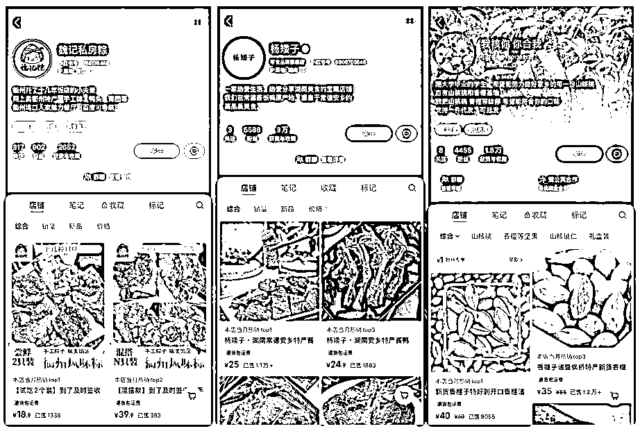

# 成长品牌大会，小红书在释放什么趋势？

> 原文：[`www.yuque.com/for_lazy/zhoubao/alssvhg1pgkhn8nr`](https://www.yuque.com/for_lazy/zhoubao/alssvhg1pgkhn8nr)

## (20 赞)成长品牌大会，小红书在释放什么趋势？

作者： 谢无敌🐱闪亮猫传媒

日期：2024-09-27

Hi~生财的朋友们大家好~ 我是你们的老朋友-谢无敌，闪亮猫传媒创始人。

  前段时间，我受邀参加了小红书成长品牌大会，现场有 1000 多位品牌主理人、老板。

从会场透露的内容来看，小红书正在成为中小商家的下一个风口。

这次大会，官方针对**不同领域、体量、成长周期的中小商家**进行邀约，对各个行业做了流量趋势分析。

今年很明显就能感受到，小红书给商家的流量更多了。

从流量趋势来看，商家做小红书，一定是利好的，尤其对于客单价较高的产品！

今天就来聊一聊，《小红书成长品牌大会》具体要向商家们释放哪些流量信号。

## 一、为啥平台要做这个大会？

#### 原因一：

从官方给出的数据可以看出，小红书 TOP 1000 SPU 里面有 160 个属于成长品牌，涵盖了**美妆个护、家用电器、医疗健康、母婴，以及食品饮料类目**。

其中，美妆个护仅次于家用电器。

也就是说，小红书用户除了爱护自己外，对家用电器的需求也很大。

从侧面也说明，小红书种对草就能实实在在的帮助到成长品牌，在策略运营和营销转化上有非常大的提升实现逆势增长。

所以，在小红书也非常适合新锐品牌的加入，去利用平台的种草属性，通过内容，快速突破流量圈层，触达给目标用户人群。

#### 原因二：

除了小红书的种草属性外，从数据能看出，小红书上，每月**寻求购买建议的用户**达到 1.2 亿。

也就是说，用户带着被种草的心态，进入小红书，通过主动搜索、刷视频、蹲直播等沉浸式体验的方式，期待能够收获有用的信息。

说明在小红书平台上用户对新品牌的接受度也会非常高。

成长品牌完全可以通过小红书，用内容的深度，去激发用户的决策，提升转化。

官方数据显示，平台**日均用户搜索渗透达到了 70%。**

并且，在小红书上，商家通过直播，单月直播场次同比增长能达到 350%；

从侧面可以说明，除了产品笔记的种草外，直播成了品牌实现流量增长、生意爆发的第二链路。

所以，即便是知名度并不高的品牌，也同样能够在小红书实现品牌增量，利用平台的反漏斗模型，快速触达精准用户；

**利用内容+定期的直播，**让用户产生信任和认同感，从而去干预用户的消费决策。

总而言之就是，商家**想要快速提升流量和转化，入局小红书一定错不了。**

## 二、成长品牌大会释放的趋势

**1.小红书私域助力成长型品牌走向成功**

这次大会，官方透露 4 月份平台的企业专业号数据，从数据可以看出，小红书私域用户转化效率是非私域用户的 300 倍。

这意味着，商家运营时，一定不能忽视“私域”！！

商家可以通过小红书群聊功能，做好**用户运营、快速冷启、测品选品、直播提效、群内种草、人群积累，以及 UGC 促产；**

比如@老周珍珠就是通过小红书私域转化实现品牌快速成长的品牌主理人，站内**全年 GMV 达到 350000000+元；**

在内容策略上，建立 IP 主账号、差异化矩阵账号；

在直播策略上，通过提升直播频率、创新直播玩法、群聊直播互动；

并通过许愿群、直播群、VIP 高端定制群，实现品牌增量，复购率达到 70%。

饰品类细分赛道，除了运营策略的调整之外，其实最重要的还是**选品差异。**

在我这期刚结束的实战营陪跑学员中，有一位做饰品的实体店老板，就是通过找到自己的优势，在选品和笔记内容上做好亮点差异，无论是种草还是成交、复购，都发生了不止 1 倍的增长。

所以，不管你是什么品牌，小红书群聊的功能一定要加以利用。

**2.小红书新产品：聚光 Lite 首发**

另外，这次成长品牌大会官方还公布了全新的运营工具——**聚光 Lite。**

看了它的宣传点后，发现真的非常适合新手商家！

**省事：**

这个工具主打的是“快捷式”，且门槛低，实现全程托管个，覆盖周期也比较长。

选目标：点赞收藏/主页浏览/私信开口

选素材：从所有笔记中，挑选多个笔记

选套餐：根据行业特点自动匹配最优的选择

移动端口操作，3 步开启推广，轻松拿捏。

省心：

除了简单、省事之外，这个工具还比较省心。

从投放前的“素材灵感”选择，再到“智能计划”、“数据复盘”，这个工具可以完成投前、投中、投后的一站式辅助动作。

省钱：

对于成长品牌来说，最难的就是怕投放太贵，但这款产品既保证了跑量，同时又能控制好成本。

官方表示，摄影写真类品牌通过“聚光 Life”工具，整体冷启通过率能达到 94.1%，投放成本降低了 38.7%。

不仅如此，行业的私信开口成本下降了 50%，私信获客数增长了 5 倍。

平台投放工具的升级，对于成长品牌来说，选择性会更多。

我跟我实战营里的商家老板说的最多的一句话就是，小红书能实现品牌增量的前提，一定是用心、坚持去做一件事。

聚光只是提升生意转化的其中一个环节，作为老板，更应该利用好平台的种草特点，用优质的内容去吸引目标用户的持续关注，为商品转化做提升。

**3.全周期营销策略**

另外，想要通过小红书实现全周期营销、提升商品的转化，除了用心做内容之外，还要掌握**品、号、店、群、直、广这 6 个要素。**

第一步，选品。

优质的品往往具备了**较高的产品颜值、某一项细致需求的功能；**

其次，就是店铺的开通，做好商品变现闭环，并且打通企业号去提升小红书用户的信任度。

除了选品和开店外，社群是商家销量转化的极致体验模块。

在小红书群聊里，不仅能做新品共创，收集来自一线用户的反馈，还能通过“群内购”实现销量增长；

而直播作为高效成交的重要场域，可以利用群里更新直播动态，帮助中小商家们更快速的实现商品的冷启动。

**4.成长型商家激励体系**

在生意越来越难做、利润越来越薄、获客成本越来越高的时代下，用心经营自己品牌的商家成了破局的标杆。

小红书成了商家们增量的首个选择，具备了低门槛、高效性、长效性的特点，更好的帮助中小商家实现生意破局。

去年，小红书月销同期增长 3.5 倍的商家数超过 500 万+，买手增长超 6.7 倍；

成长型商家活跃客户数增长 379%，GMV 同比增长 436%。

由此可见，小红书平台不仅能加速品牌的生意增长，也同时让更多个人加入到小红书直播行业中。

大会的最后，平台针对成长型商家，从**店播助跑、新客入驻、私域运营**三个方面，为小红书成长型商家提供百亿流量扶持，最高 10 万元广告返货惊喜上线。

比如，首播冷启动扶持、30 天 28 万流量激励，以及群聊激励挑战赛等等。

在投放策略上，小红书也为商家提供了更丰富的选择。

## 三、大有可为的成长品牌行业

这次大会，平台透露了品牌在小红书上的发展趋势以及流量趋势。

为此，我特意结合了**官方对行业、流量趋势的分析，整理了 5 个小红书高变现行业。**

**1.留学**

小红书人群偏年轻、高知，且消费能力强，平台的用户决定了它非常适合留学赛道。

而且，留学的客单价并不低，利润自然也非常高。

比如@路觅 通过在小红书分享好内容，找到了有相同需求的兴趣人群，挖掘种子用户；

并设置自己的**定制化产品，在平台找到核心客户人群。**

不仅能让用户找到品牌，更关键的是让品牌精准的找到用户。

通过用户的声音反哺自己的产品，快速优化、提升自己的产品线。

并且，利用**专业号+人设号，**从国家维度、校区维度，按照学校、专业，去做内容的分享，快速树立品牌形象，赢得用户信任。

**2.旅游**

为什么说在小红书上旅游赛道好做？

其实是平台属性决定的。

小红书平台的人群和种草属性，让大家更关注旅游赛道，用户也更愿意被优质的内容种草、买单。

@海洋国旅 用轻奢、定制化的内容，在小红书上，近一年 GMV 超过 5000 万；

通过定制新的内容方向，打通目标人群的同时，还进阶了顶奢人群，真正的在小红书实现了生意第二曲线。

像这类，高客单定制化服务赛道，本身就存在差异优势，找到合适的平台做好推广之后，自然就能实现快速变现、高转化结果。

**3.线下实体转型电商**

除了留学、旅游这类高客单商家外，线下实体门店服装商家的客单也并不低。

比如@熠 从淘宝电商，到公众号，再到小红书，不断地寻找不同品牌的流量，获得更多机会曝光；

在小红书上，利用精准的话题，快速找到兴趣人群，收获种子用户。

通过商品的笔记预热，提升了线下展会的人流量，用长年累月的实体店口碑，和用心的好内容，吸引了几万用户的关注。

在小红书平台双 11 活动中突破 1000 万的业绩，21 年底荣获小红书三等奖，**仅次于奔驰、雅诗兰黛。**

@熠 不仅通过优质的内容，找到兴趣人群，更是利用定制化的服务，通过私信通去提升客户触达的概率，**更大化的增加客户转化效率，实现品牌增量。**

像这类高客单的线下产品，就非常适合在小红书做好内容，用心做好品牌、吸引用户关注。

**4.家居家装行业**

另外，认识我的朋友都知道，我是实体家居起家的，入局小红书的**第一个月就实现了 10 万+的变现，半年通过小红书变现超 1000 万。**

也通过不断地摸索，逐步有了今天的成绩。

这次成长品牌大会上，家居家装行业@格度 用专属的品牌理念去触达产品人群，深度种草拿下心智，单品 SPU 销售额超 1000 万。

并通过反复传递品牌信息、品牌理念，把产品沉淀的人群，转化为品牌需求人群，让人群成为品牌壁垒。

家装品牌的客单价并不低，商家老板需要做的则是如何通过小红书去放大品牌势能，这一点非常关键。

**5.特产赛道**

明显能感觉到，从今年开始，赚钱不像从前那么好赚了！

但在小红书却成了一个例外。

尤其是差异化较明显的赛道，这就不得不说一下，**特产赛道。**

这个赛道成本不高、利润很可观，也没什么垫资压力。

我陪跑过好几位优秀的特产赛道老板，**有一位靠卖特产，10 个月变现超 30 万。**

通过找到美食特产的垂直细分赛道，在小红书上实实在在的拿到了拜变现结果。

另外，从平台的流量趋势能看出，平台正在全力扶持商家做好店铺；

商家应该利用平台，做好双 11 大促节点激励，实现电商闭环动作。

对于中小商家来说，不仅要与平台流量政策相结合，更重要的还是顺势行业的发展，挖掘更多变现可能性。

在小红书找到品牌深度价值，实现生意第二曲线！

* * *

评论区：

更绪 : 没看懂聚光 lite 降低成本的逻辑是什么，感觉这个产品就是纯纯的鸡肋，小红书产品团队没事干了，强行给自己找点事情，刷刷 kpi。
谢无敌🐱闪亮猫传媒 : 就是给新手用的产品 也就是类似全站智投

* * *