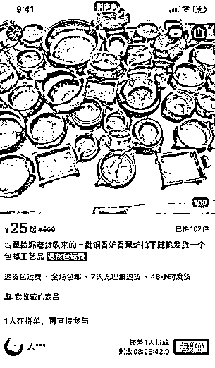

# 闲鱼精细化运营，详解 11 个图片细节实战经验，帮你销量翻倍

> 原文：[`www.yuque.com/for_lazy/zhoubao/cbfb1gmlihodvg1b`](https://www.yuque.com/for_lazy/zhoubao/cbfb1gmlihodvg1b)

## (54 赞)闲鱼精细化运营，详解 11 个图片细节实战经验，帮你销量翻倍

作者： 超级个体张老板

日期：2024-09-25

闲鱼卖货，最直观就是卖图片、卖文案。

选一个好的图片，卖货事半功倍，但事实上很多卖家选的图片惨不忍睹，更别提吸引买家、提升转化效果了。

闲鱼精细化运营，图片非常重要，选好图、选对图，打造人货场三位一体精细化运营，不仅可以帮我们提升流量，还可以提升转化率。尤其是头图，更是重中之重。

关于闲鱼的操作流程，网上有很多的教程流传，就不赘述了，今天的分享不求“**全面覆盖**”，只做“**单点突破**”，从 11 个点来说说如何精细化运营图片。

我实战闲鱼 4 年，闲鱼卖货单日最高纯利润 2000+，还带领着全家 6 口人一起做闲鱼电商副业，以下这 11 条，源自我这几年的实战经验，都是细节干货，请认真阅读。

OK，开始正文。

### **1、APP 设置小细节，关掉这个闲鱼图片设置**

这个在闲鱼：我的——设置——图片视频设置里面

把上传图片自动压缩功能关掉，就可以上传更加高清的图片了。

截图如下：

### **2、细节：头图全部用竖图**

我们去仔细观察一下闲鱼的首页推荐，比如这张：

你会发现，闲鱼的首页推荐展示，是分成 2 列来展示的，出现在首页的，基本都是竖版图，是没有横图的。

竖版图，展示面更大，给人的视觉冲击更大，也方便上闲鱼首页推荐获取更多流量（闲鱼的 2 大流量来源就是搜索流量和首页推荐流量）。所以我们去选首图，优选竖版图。

### **3、用实拍图，不要用网图，如何获取实拍图？**

闲鱼，更喜欢实拍图；

用户，更喜欢实拍图；

所以，我们尽量用实拍图，不要用网图。这个细节，也非常重要。

如何获取实拍图？

淘宝、拼多多、京东、1688 等电商平台的评论区，找买家秀，淘宝的图片质量旺旺会比拼多多好一些，只要是同款产品，图片都可以用；

其他自媒体平台，也可以成为实拍图来源，比如小红书、抖音等，我下面的一个板块里有个实战案例，也会讲到我在小红书找图的经历；

多加老板微信，翻老板朋友圈，问老板要；

这个之前我聊过，我们之前有一个伙伴，加了客服微信，就找到了惊喜：

自己买样实拍。

这个也很建议，买样品，不仅可以查看产品质量，查看快递面单细节、发货流程，还可以自己实拍照片和视频，拍完后退回老板即可，都有运费险，没啥成本。

对单个低价产品，直接买回来拍就行；

对需要买样的数量多、金额大的，建议可以提前和老板协商好，我之前就一次买了好几千的样品回来，提前和老板说好了，拍完都退回去了。

### **4、打造闲鱼人货场提升转化率，清仓体文案配清仓体图片，如何寻找清仓体图片？**

OK，这个部分比较重要，我多说一点。

先给大家展示一个案例：

好，我们看下这个闲鱼帖子：

**标题：**主打了产品的稀缺，就一辆，配上了产品的关键词

**正文：**再次主打稀缺“全新的就一辆”，以及价格的优惠。

**图片：**只放了一张样品尺寸图。

看出问题来了吗？

你说自己是厂家直销，怎么全都是网图？你说自己只有一辆全新的摆摊车，怎么连个实拍图片都没有？

这让人怎么对你产生信任，进而产生销售？

开闲鱼店就是做销售，线下店销售卖东西靠嘴巴；

线上卖东西，就靠文字话术和图片。

先不管闲鱼会不会给你曝光，给不给你流量，我们先把握自己能做的：如何通过文字+图片提升转化？

我认为，关键点在于满足客户的两个心理：

### **信任+捡漏。（划重点）**

我们去换位思考想来闲鱼的买家，要让他们愿意买单，提升转化率，要解决两个问题：

一个是他要信任你，第二满足他的捡漏心理。

怎么解决？只有通过文字+图片，闲鱼的基本功就是：用文字和图片进行销售的能力。

要通过头图+标题+正文+配图要四位一体，打造人货场，建立客户信任+捡漏感，提升转化率。

一个非常典型的实战案例，我们很多伙伴，包括群里的伙伴，都喜欢用“清仓体文案”，“卖惨型文案”，比如“店铺清仓”“仓库清货”“倒闭不干了”等转售理由。

我们以此为例来说一下，像这种文案，就一定要去搭配清仓体图片来打造效果。

直接上案例图片看下：

OK，这种模式，就是清仓型文案搭配清仓型图片，看起来是不是效果就比放一张网图好多了？

有伙伴可能会问，我哪里有这种清仓图片，我又不是厂家。

接上面这个案例我继续给大家展示，这个窗帘的清仓图片，再看看下面这个拼多多上的图：

看图片，是不是也可以从网上找到？和拼多多上面的一模一样，拼多多上还有生产车间图呢，还有打工的大妈图呢！

类似的品，类似的图，拼夕夕上很多，再截图两张看下：

那么这种库存很多的图片怎么找？

用产品+关键词的组合去全网搜索，全网搜索包括各电商平台，包括小红书等自媒体，包括百度等网站，只要能找到，就能为我所用。

简要列举几个关键词，比如产品+以下关键词：**清仓、处理、批发、尾货、库存、特价**等等。

上面那个案例是窗帘，就继续以窗帘为例，可以搜窗帘清仓、窗帘处理、窗帘批发、窗帘库存等等。

另外，多加几个货源的微信，去翻他们的朋友圈，会有不少的素材，熟悉之后也可以直接问他们要素材。

同理，无论你用什么文案、图片，最好要融合、搭配起来，建立人货场，而不是简单的放一个图片和文案完事。

多从客户角度去审视自己的图文，打造出一篇“自己看了都想买”的帖子，就出师毕业啦。

### **5、自己拍摄，如何拍摄？同样可作为找图、选图标准**

**光线：**

拍照要注意光线，不要选择很灰暗的环境，也不要选择阳光直射的环境，眼光直射会导致颜色失真，实物效果出现偏差，尽量选择柔光环境拍摄。

**环境：**

拍摄环境也要注意，不要杂乱无章，不要喧宾夺主，尽量整洁一些。

**背景颜色：**

拍摄照片或者视频的时候，背景颜色要统一。有几个比较常用的背景颜色，比如绿色的草地，让人看上去比较舒服；木质桌面的背景也比较柔和，深色黑色的背景则适合拍摄一些艺术品、贵重物品。

**拍摄角度要全**：

这个也不用多说，拍摄的角度要全面，正面、侧面、背面、全景、细节等。一般来说，闲鱼可以放九张图，我们的前四张图片可以放全景图，后面的几张可以放局部特写图片。

**拍摄要清晰不要虚**：

这个也很容易理解，一定要拍摄清晰的图片。

**提高亮度：**

在几乎任何一个修图软件里，都可以去调高图片的亮度，一定程度上可以让我们的照片更加吸引客户。

**不要过度美化和夸大：**

不要修图过度，造成实物图和卖货图差别太大，容易引来售后。

另外除了上面这些技术指导，还有一个非常重要的，一定要多找优秀的对标账号，看看人家的图是怎么发的。

比如，举几个账号例子，这些账号里有卖体育用品的，有卖五金件的，实战来看一下，看看他们的头图，是不是符合上面我说的那些要点？

### **6、善用对比图，隐藏小心机**

用对比图片也是一个比较有“心机”的方法，怎么对比？当然是为了把自己的优势凸显出来。

举个例子，卖同款的衣服，就可以对比细节，布料、缝线等等，显示自己的做工细节比对方要好。注意，这里不要去露出对方的品牌和店铺，不要怼到脸上树敌。只对比，不点名。

### **7、图片场景化，卖货更带感**

什么是图片场景化，来举个例子：

图片中的商家是卖土鸡的，这就是典型的场景化图片和视频：在散养土鸡的鸡场里面直接卖，一个土鸡，在这种天然鸡场里面卖和在柜台的包装盒里卖，哪个更能给人信任呢？

答案不言而喻。

再比如这个闲鱼上卖枣的，搭配的枣园摘枣子的场景：

所以，我们在发布卖货帖子的时候，如果能使用场景化的图片和视频，可以考虑使用。

包括生产场景、使用场景、效果展现场景等等。

几乎所有的产品，都能够置身于场景化图片或者视频之中，随便举一些例子：

卖洗护用品，可以展示使用之后的效果；

卖屋顶防漏剂，可以展示刷防漏剂的过程；

卖蜂蜜，可以展示蜂场；

卖渔具，可以展示钓鱼的场景，比如一个夸张的大鱼被钓上来；

卖窗帘，可以展示工厂场景；

等等……

### **8、提炼产品亮点，写到头图上**

这种可以用手写的方式，来突出亮点，吸睛夺目。

可以把产品的亮点有文字（比如手写文字）的形式展示在头图上，这里需要注意的是，在头图添加文字一定要醒目，不要多，字不要太小，不要杂乱，一定要突出醒目。

举个例子：

### **9、注意查看首图缩略图，商品主体要突出完整**

使用竖版图做头图，不要一次性把所有图都放进去点发布完事。首先要把主图放进去，看一看缩略图，确保产品的主体是在缩略图中间，突出主体。

因为竖版图，上下是有空间的，有的图片如果不处理下，就容易导致产品主体不突出的情况。

用一个产品图来举例说明下。

大家看下面这两张图，都是同一张图片生成的主图：

第二张的主体展示部分就比第一张展示上要好一些，视觉感官好一些。

### **10、实战案例，如何一次性高效搜集够用 10 天的卖货图片**

如何高效找到大量清晰美观的图，提升效率，节省时间？这里结合我自己操作的一个案例，来聊聊。

我之前专门测试过一个做海参的高客单价店铺，铺这个品的链接，需要大量的图片，不过货源老板只提供了部分产品图，其他图片都需要自己搞定。

我先列了一下，铺这个品，最好需要以下类型的图片：

单个产品细节图；

大批产品堆放图；

生产场景图；

渔船捕捞图；

渔村环境图。

这些图片，可以从产品到场景全方位对商品进行展示，从而建立客户的信任，我们发布图文，不仅仅是为了介绍清楚商品这么简单，还需要用图文建立起客户信任，激发客户购买欲。

然后我在全网大概过了几个平台，比如抖音，淘宝，小红书等，发现小红书这个平台上，有大量这类图片，可以满足我的需求。

再然后，我挑选了一个集中时间，一次性去小红书上专门搜索这个产品的所有关键词，筛选条件先选图片，再选视频，把好看能用的图片和视频截图，一次性保存上一二百张。

再然后，把这一二百张图片集中处理下，就可以慢慢用了，比如你一天发 3 个链接，一个链接用 5 张图的话，这些图能够你用十几天。

看一下我当时保存在电脑文件夹的截图：

这种方式就是：

确定铺链接图片需求；

集中大量下载处理；

保存后待用。

就不需要用一次去找一次，那样比较浪费时间，集中处理会更高效。

### **11、防盗图小技巧**

有些小伙伴已经到了或者有意愿自己买样品回来拍图的地步，自己辛辛苦苦拍的图如果被别人盗走肯定是不爽的，并且如果被盗走的图发布的链接太多，在闲鱼上大规模出现，也可能因为同质化严重影响我们的流量。

对自己拍图的小伙伴，可以这样做：

拍摄完图片后，在图片的中心位置（不要在边角容易被裁掉），加上自己的店铺水印，这样别人就不容易盗走使用了。

同时，自己拍摄图片的话原图保存好，不要删除，以免出现纠纷时证明自己的版权。

以上，是对闲鱼图片精细化运营的一些分享，希望对大家能有所帮助。

做一个项目，是流于信息差表面，还是能做成一米宽、一万米深，成为自己的优势领域，就看你：

精细化的深度。

跑通一个项目

深入一个项目

吃透一个项目

任何一个小项目，都有可能帮你多赚几万、几十万，并且结合 ip 还会有沉淀，还会持续帮你赚钱

不要浮于表面，做透，扎深，你才会收获更多

最后，这几天我看到了王兴老师说的一段话，我觉得非常好，送给大家，作为今天这次分享的结束语。

我们犯了很多错误，交了很多学费才知道，这个世界没有神话，只有一些很朴素的道理：

便宜的打败贵的；

质量好的打败质量差的；

认真的打败轻率的；

耐心的打败浮躁的；

勤奋的打败懒惰的；

有信誉的打败没有信誉的。

愿我们，一起：

认真

耐心

勤奋

做好闲鱼这件小事

* * *

评论区：

姚先森 : 很赞👍🏻 超级个体张老板 : 谢谢
温暖的车车 : 很有收获
克劳德 : 很赞👍 韩易岐 : 就喜欢看这样的文章，实用[强]
超级个体张老板 : [玫瑰]
超级个体张老板 : 谢谢
超级个体张老板 : 很高兴对圈友有帮助[机智]

* * *