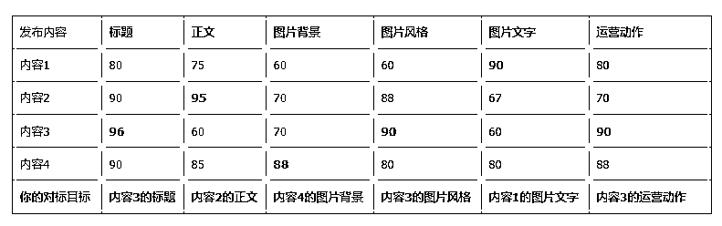

# 账号流量数据不佳，很有可能是拆解不到位

> 原文：[`www.yuque.com/for_lazy/zhoubao/krqg1wc6osvdloip`](https://www.yuque.com/for_lazy/zhoubao/krqg1wc6osvdloip)

## (15 赞)账号流量数据不佳，很有可能是拆解不到位

作者： 重瞳

日期：2024-09-23

最近看到很多人讨论说闲鱼流量不行，我个人认为很大一部分原因是对标账号拆解不到位。

拆解的时候，一定要融入自己的思考，并且拆解的颗粒度要足够细，以闲鱼为例吧，这个我还算有点经验

### **一、拆解数据部分**

1.  **1、浏览/想要**
2.  浏览/想要的比例有多少？
3.  数据这么好有没有可能是刷的？
4.  **2、发布时间**
5.  看到数据一般但发布时间较新的商品有高搜索排名，这是不是一种规律？
6.  **这是否能督促你每日多次发布商品？**
7.  **3、价格**
8.  低价能否吸引你的点击？
9.  高价但体现出了专业性，是否也能吸引你的点击？

### **二、拆解主体部分**

#### **1、主图**

1.  **图片背景**：是可爱动画、纯色背景、聊天记录、还是商务风格？
2.  **图片比例**：1 比 1 还是 4 比 3？如果是 4 比 3 的图片，是否存在文字被 1:1 截断的情况？
3.  **色彩搭配**：浅色、暗色、还是五颜六色
4.  **图片文字**
5.  **字体**：是书法/手写字体还是常规字体？
6.  **大小**：文字占整个图片有多大？文字大的图片是不是比文字小的图片更吸引点击？
7.  **颜色**：文字颜色是不是与背景形成了反差，能看得清楚？

**2、文案**

1.  **标题**
2.  同行的标题**都有哪些高流量的搜索词**，**为什么他们选择了这些词**？
3.  他们的标题是抄别人的，还是说这些词的**搜索流量确实高**？
4.  你是否有尝试去寻找并验证**更爆的搜索词汇，去优化同行的标题，从而实现"先抄后超"？**

1.  **正文文案**
2.  有没有铺设足够多的细分搜索关键词？
3.  **自己看完文案，有没有点击"我想要"的欲望？**如果有，分析出原因，**到底是哪个词汇/数字戳中了你**，是"写过 500 份 PPT"，还是"不满意支持退款"？
4.  有没有把**搜索词去重并收集的习惯，集同行之精华**，把内容更好的排列组合，创作出更具备吸引力的文案。

3、**评论区**

1.  评论区下面是同行留言还是用户留言。
2.  如果在看到**多个同行留言**商品后，**突然看到一个用户留言**较多的商品，你是否能洞察到：**这是一个异常值？**

想把账号拆解的颗粒度，做得足够详细，就要通过可视化的方式，**把每个对标的优点提取出来，取其精华，去其糟粕。**

就好比这样（表格里的数据是分数评价）：

分数视实际情况而定，这里是举个例子说明**优点提取**的方法。

写到这里我发现，先前很多人都提到过相似的观点，但当时我真的无法感同身受。在我花了大量时间精细化拆解后，我才知道他们的这些经验有多么牛逼。

拆解过程中，一定不能忘记可视化，也就是把对标的内容用表格整理出来，每新加一行数据时，都遍历思考一遍列属性，为每个指标打分，重复这个刻意练习的过程，寻找共性和规律。

不进行可视化整理，会有一个很大的问题：**你的模仿动作很有可能不到位**，自己脑袋里想的是一回事，实际做出来是另一回事，实际执行起来才发现与预期相差甚远。

低水平重复 30 次，每次都是 60 分，不如一点点来，每一次都比之前提升一点，逐步迭代到 80~90 分，这才是实打实的提升。

去经历这个痛苦的过程，越早经历，越早成长。

* * *

评论区：

周唯一 : 很赞同。优化都是在不断的拆解中，找到的
重瞳 : 脚踏实地，才是王道

* * *