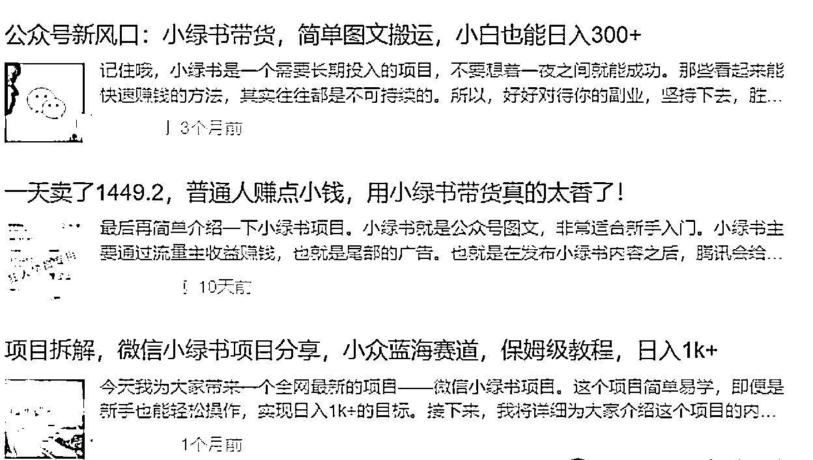
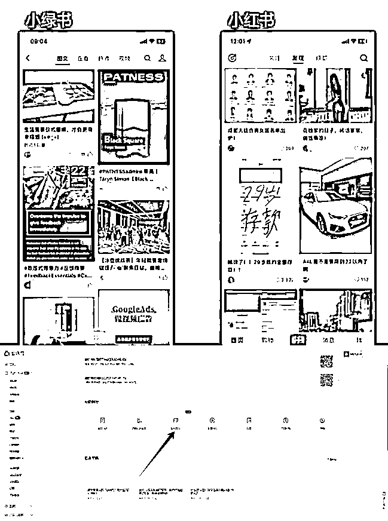
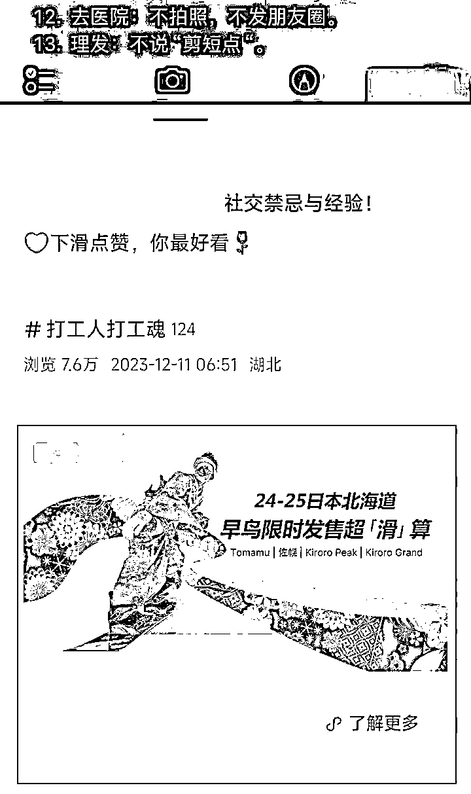
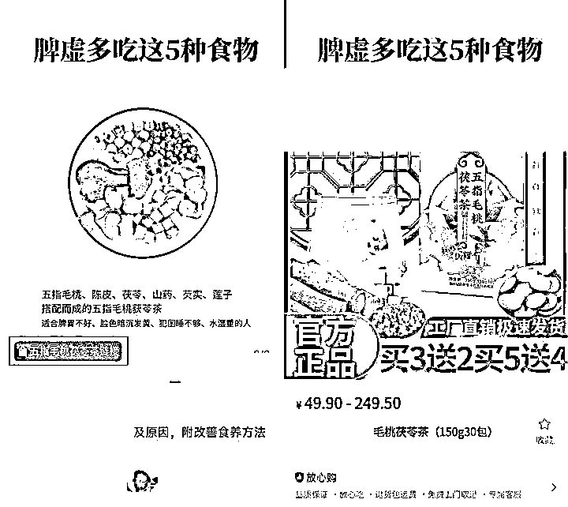
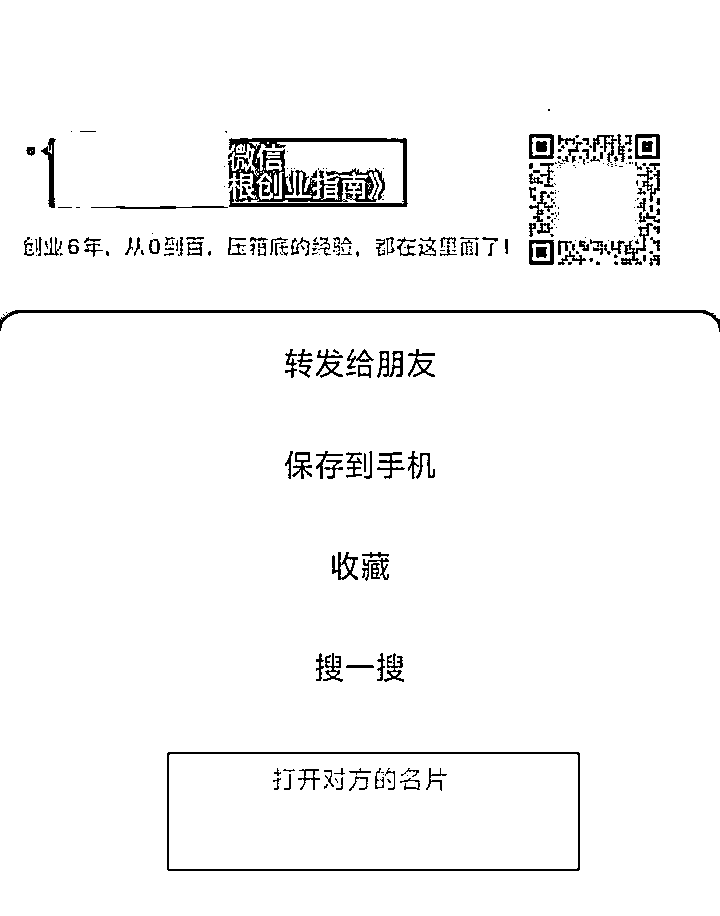

# 小绿书：公众号图片消息功能的热度与变现探讨

> 原文：[`www.yuque.com/for_lazy/zhoubao/yld42odg6hsu4uah`](https://www.yuque.com/for_lazy/zhoubao/yld42odg6hsu4uah)

## (39 赞)小绿书：公众号图片消息功能的热度与变现探讨

作者： 大鹏

日期：2024-09-24

最近在各种圈子、公众号里面刷到很多有关“小绿书”赚钱的消息

看着他们那些有手就行日入多少多少的标题

我实在是搞不懂，为啥这个一直不温不火的小绿书，在最近热度这么高

难道是腾讯又有什么大动作？或者有什么最新玩法我不知道的？

**什么是小绿书？**

可能很多人还不知道什么是“小绿书”，还以为是个什么新平台

这里简单科普下，“小绿书”其实就是公众号推出的图片消息功能

在一年前就已经有了，只是最近被炒热了

页面排版形式和小红书很相似，所以被网友称为“小绿书”

发布小绿书也不需要注册什么新的平台，在公众号后台就能发布

**小绿书怎么变现？**

**1、开通流量主**

其实就是开通公众号流量主，公众号粉丝达到 500 粉之后，在公众号后台点击“广告与服务-流量主”开通

广告展示是在图文底部，根据曝光和点击率来计算，万次阅读的收益大概在 10-50 左右。

**2、图文带货**

达到 100 粉之后就可以开通图文带货功能，发布图文时点击插入返佣商品，发布后会在图片中出现购买图标，引导点击。

**3、导流私域**

小绿书对引流管理很宽松，图片中可以直接放上二维码，长按就能导流，十分丝滑。把粉丝引流到私域之后，在私域进行转化变现。

其实上面说的这些，只要了解过小绿书的基本上都知道

那还有没有什么新玩法？

我花了几个小时，找遍了全网有关“小绿书”的内容

结果很失望，并没看到更多有价值的内容

标题都起的非常唬人，什么日入 300+，日入 1000+的

点进去一看，大多都是一些流水文，并没有什么新东西

其实小绿书的玩法和公众号大差不差，也是爆文的逻辑

发布图文作品，如果作品优质，通过推荐算法，就可以被更多人看见甚至成为爆款

相应的你就能赚取到流量分成收益或者带货分佣

只不过两者发布的内容形式不太一样

相对于公众号长文写作来说，小绿书发图片会简单的多

无非就是找对标案例，先去模仿，然后持续更新，有条件的可以多账号矩阵操作

但操作简单不代表赚钱简单

这个跟做小红书是一个道理，发图文都会发，但大部分人发出去都没有流量

想爆流量还是需要一定的经验和能力还有运气的

项目逻辑没有问题，但想通过这种项目赚到钱还是不简单的

小绿书也是要认真做，才有爆的可能性，才有可能拿到结果

如果你小红书玩的很好，是非常适合玩小绿书的

小红书玩的一塌糊涂，没有美感的，小绿书也不一定能玩起来

在这里也建议新手小白不要上头，别乱付费学习

如果真的想尝试一下，不妨自己先模仿爆款对标发几条体验一下。

* * *

评论区：

神奇的桑桑😄😄😄 : 1 个月前已经开始关注，也测试过几篇文章，拿到了流量，转化率不够。个人判断，这波小绿书流量的目标群体，带来商业化可能是年轻人 00 后 90 后群体。
吴秉晖 : 请问这个挂商品显示要开通微信小店，不能挂视频号橱窗的商品吗？？
神奇的桑桑😄😄😄 : 可以挂橱窗，我挂的就是橱窗的
吴秉晖 : 嗯嗯，懂了
刘成 : 点赞，已经开始寻求自动化操作了

* * *