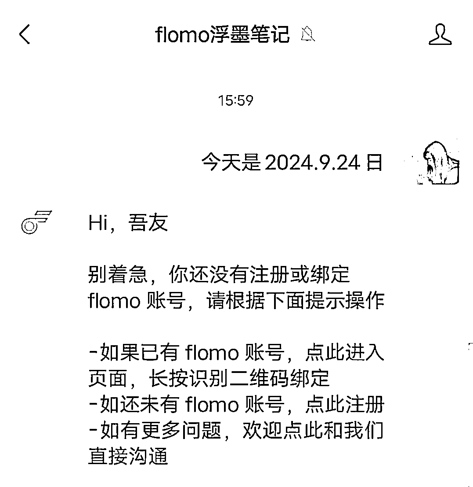
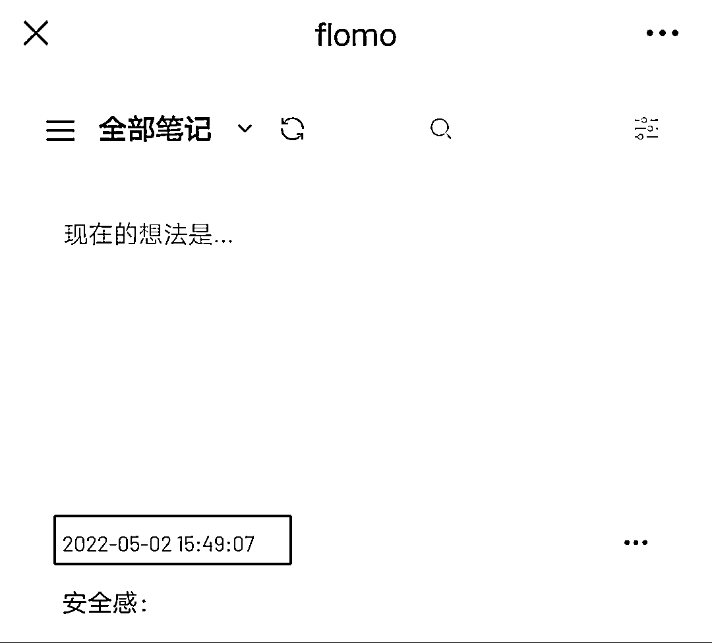
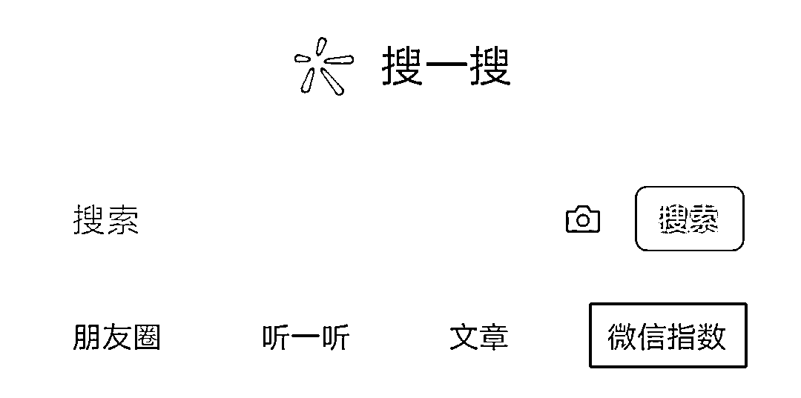
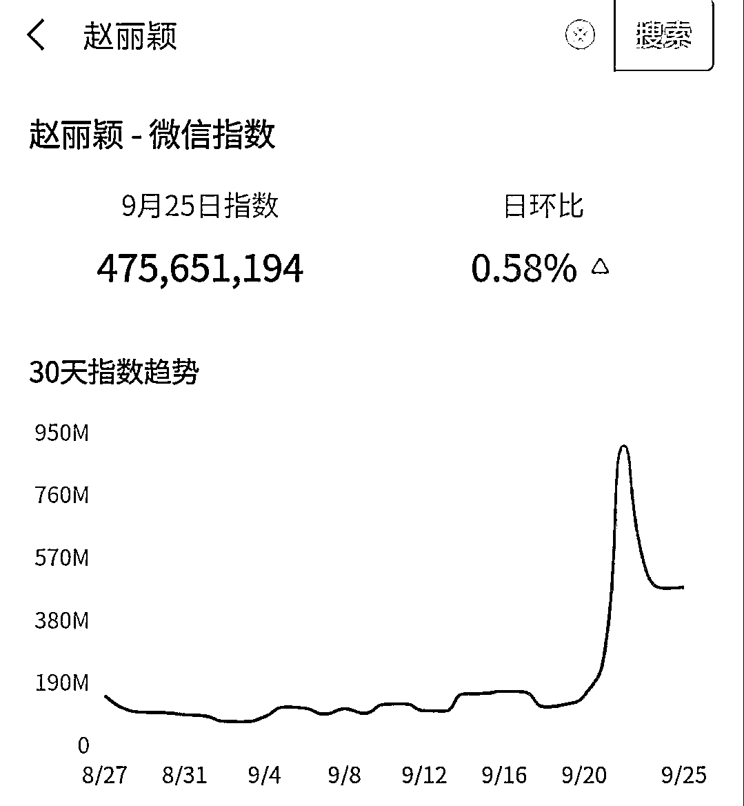

# 写公众号超好用的 7 个写作工具！新手建议收藏~

> 原文：[`www.yuque.com/for_lazy/zhoubao/tuy8guvew65gmn2p`](https://www.yuque.com/for_lazy/zhoubao/tuy8guvew65gmn2p)

## (20 赞)写公众号超好用的 7 个写作工具！新手建议收藏~

作者： 安七

日期：2024-09-26

嗨，你好，我是安七，用 1 年时间，通过写作实现从月薪 3K 到创业年入 7 位数。

这两天有朋友问我：

“安七学姐，我每次写公众号文章都手忙脚乱，有没有什么神器能帮我提高效率，写出更吸引人的内容呢？”

当然有啦，和大家分享 7 个宝藏写作工具，不仅可以提高写作效率，也可以帮你把内容整得更加吸引人。

尤其是最后 1 个，很多人都不知道。赶紧收藏起来备用吧~

**01**

**写作记录工具：石墨文档**

有一次熬夜赶稿，结果电脑突然死机，稿子全没了，当时那个崩溃啊！

后来我听别人说，石墨文档可以**实时保存**，去试了下，发现真的可以。

离线的时候，它会弹出黑色的框框，你点进去，就会提示你是否“备份至本地版本”，备份的话，等你联网，它会自动同步。

这款云端写作工具简直就是救星，真的！再也不怕突然断电或电脑故障导致的心血付诸东流了。

而且，石墨文档的界面简洁，操作起来很顺手，特别适合我们这种**追求效率**的小伙伴。

**02**

**金句宝藏：句子控**

每次写文章，都愁不知道怎么开头和结尾？总觉得自己的话不够有力量？

可以试试句子控这个 APP，里面全是**各种风格的金句**，从文艺小清新到犀利毒舌，应有尽有。

平时可以去句子控里逛逛，找找灵感，偶尔还能直接引用几句，给文章润色。

**03**

**灵感标签：flomo 浮墨笔记**

我经常会建议学员们做个灵感素材库，毕竟灵感这东西，说来就来，说走就走。

面对那些稍纵即逝的灵感，可以试试 flomo 浮墨笔记。

这款笔记应用主打“轻量”和“快速”，你可以随时随地记录下你的想法、灵感或者待办事项。

更重要的是，它支持标签功能，你可以轻松地对灵感进行分类整理，需要的时候一键搜索就能找到，超级方便！

怎么用？

微信直接搜**“flomo”**，关注这个公众号，就可以和它对话了。

没有 flomo 账号的，先免费注册一个，弄好后把你的灵感发在对话框。

像我几年前的，都还在（简直感动）

**04**

**写作素材积累：纸条 app**

素材库匮乏的伙伴，可以用这个 APP 试试看。

要我说，它简直就是**写作素材**的宝库，里面包含了各种类型的美文、名言、事例等等。

每天抽点时间刷一刷，不仅能积累素材，还能提升文笔（当然，要刻意练习哦）

**05**

**找热度词：微信指数**

我们有时候写文章，很容易“想当然”，觉得某个话题，或者某个类目“好像”就是爆款了。

其实不是。微信官方有出，怎么样帮助我们更快找到热点话题的：**微信指数。**

可以通过微信指数来搜索热度词，帮你快速了解某个关键词在微信上的搜索量变化趋势，从而判断它是否值得追。

有了微信指数，至少不用担心自己是否走偏了。

比如：

**06**

**免费图片素材库：Pexels**

俗话说得好，一图胜千言。但有时候，找一张合适的配图往往比写文章还难。

百度的图，一个不小心，容易有版权风险。自己拍的最安全，但是又觉得不好看，怎么办？

推荐 Pexels 这个**免费图片素材库**。里面的图片质量高、种类多，而且完全免费使用，不用担心版权问题。

**07**

**gif 动图：一个木函 APP**

经常会有伙伴问我，文章中的动图是怎么做的呢？

毕竟，一篇文章里加点 gif 动图会让它更加生动有趣。但找 gif 动图也是个技术活啊。

总是找不到合适的，也可以自己做。

这里推荐一个**木函 APP**，里面有一个**“GIF 合成分解”**功能，你可以把图片转换成 gif 动图，还可以添加文字、滤镜等效果。

非常好用，是我很喜欢的一个 APP！

总结一下：写公众号，用好这 7 个工具就够啦：

#### ·写作记录工具：石墨文档

#### ·金句宝藏：句子控

#### ·灵感标签：flomo 浮墨笔记

#### ·写作素材积累：纸条 app

#### ·找热度词：微信指数

#### ·免费图片素材库：Pexels

#### ·gif 动图：一个木函 APP

如果你觉得有收获，可以点亮右下角的**赞**，感谢你的慷慨，一起加油！

**08**

  **其他 5 个系列：**

**【系列 1：】**

**故事篇：**我是如何链接贵人、找到 AI 公众号爆文方向的？

文章：[应届毕业生，一年双百万：0 基础创业经验小白，1 年变现 100W+ ——普通大学生如何通过生财有术挖掘到第一桶金？](https://die28mmde0k.feishu.cn/docx/Wvc2dtcPWoHaNcxjnyvcryiHnEc?from=from_copylink)

**【系列 2：】**

**战略篇：**坦白局——公众号爆文还值得做吗？

文章（精华帖）：[【坦白局】：毕业 1 年，通过公众号爆文项目赚到 7 位数，公众号爆文还值得做吗？](https://t.zsxq.com/GjvBy)

**【系列 3：】**

**数据篇：**精华 or 水帖？用事实说话：04 年大二助理，历时一年，从小白到平均 3 天一篇 10w+爆文机……

文章：[《精华 or 水帖？用事实说话：0...](https://t.zsxq.com/003Ug)》

**【系列 4：】**

**领域推荐篇：**24 年 8 月，有什么还不错的小众领域？

文章：[`t.zsxq.com/p8XG3`](https://t.zsxq.com/p8XG3)

**【系列 5】：**

**AI 写作提示词篇：**热点转瞬即逝，怎么用 AI 快速产出爆款文案？

文章：https://t.zsxq.com/ohtwt

* * *

评论区：

旭哥 : 太感谢了，写作刚需呀[玫瑰][玫瑰][玫瑰]
安七 : 一起加油💪 青云科技—执笔 : 优秀啊太好了
安七 : 😘😘

* * *