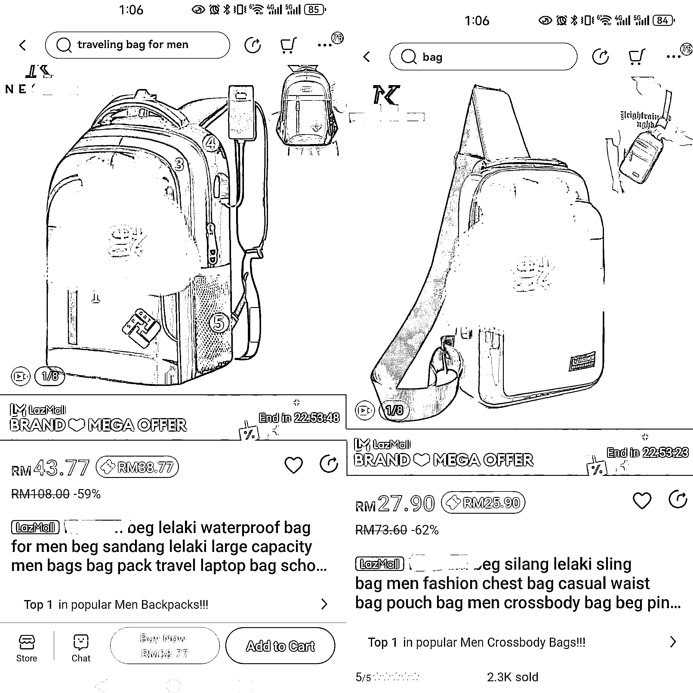
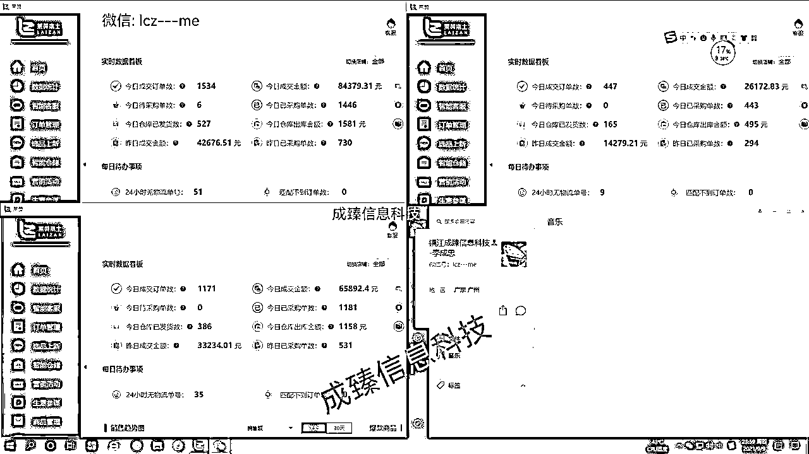
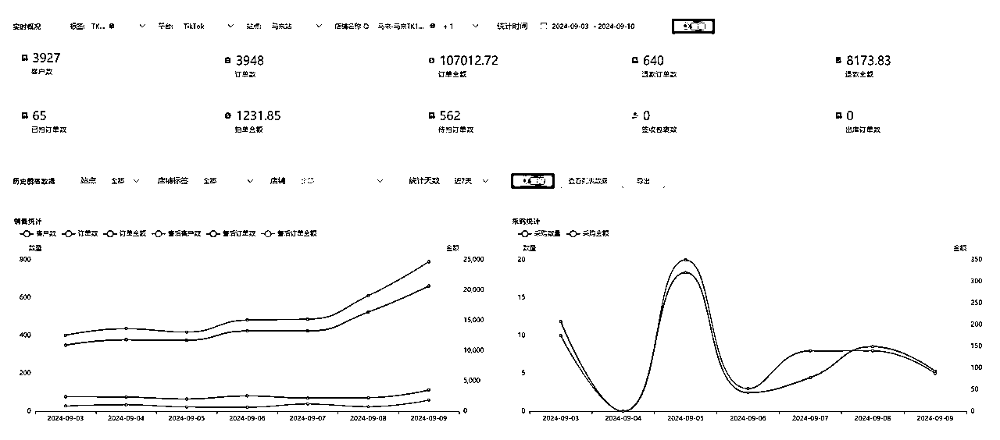
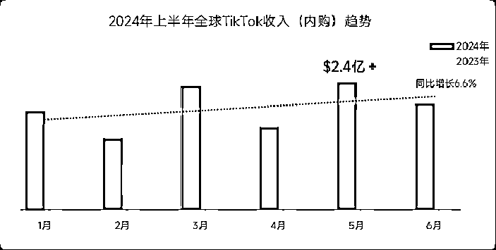
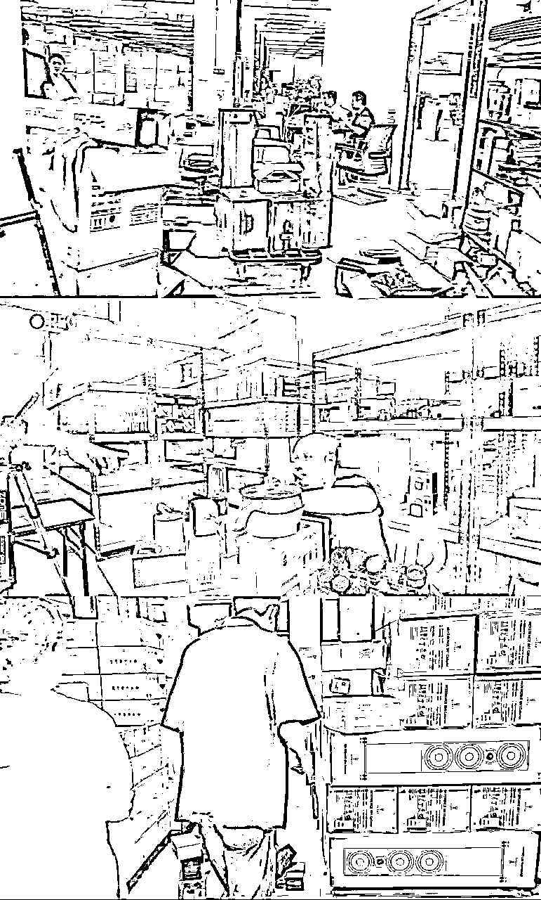

# 2024 风口 TikTok，新人如何避坑并且低成本入局实现从 0-1

> 原文：[`www.yuque.com/for_lazy/zhoubao/ym8v98fq4qkxqwb4`](https://www.yuque.com/for_lazy/zhoubao/ym8v98fq4qkxqwb4)

## (17 赞)2024 风口 TikTok，新人如何避坑并且低成本入局实现从 0-1

作者： 久成

日期：2024-09-23

生财的圈友们大家好，我叫久成 ，5 年跨境电商老兵+东南亚跨境千万级卖家。

深耕东南亚市场五年的我们，在东南亚刚上线 TikTok 小店的时候就开始做了，期间享受了不少了红利，打造多个百万店铺。但是我们也发现其实 TikTok 电商对新人朋友来说不算友好，所以我想写一篇文章，谈谈新人如何避坑并且低成本入局，希望能够帮助到想做 TikTok 的圈友们。

## 一、自我介绍

大家好，我叫久成，连续创业 8 年。16 年大一，在大学开始创业；17 年大二，做了微信淘客，并且开始在公域引流到私域，做私域返利社群，实现大学生的**财务自由**；18 年大三，踩中风口，第一批做抖音视频带货，尝到一个人日出千单，单视频单日佣金 3 万+的甜头；19 年，累计赚到第一个**一百万**，时年 22 岁，拥有人生的第一辆全款奥迪；

20 年，毕业并顺利创立一家超过 20 人的**东南亚跨境**电商公司；21 年，all in 跨境电商 Lazada 平台，本土无货源店群模式，400 家店铺，日单量超过 3 千单，年底惨遭封杀，一夜直接**亏损 80 多万**；22 年，痛定思痛，放弃与平台做对抗，开始**本土备货**，做 Lazada 本土精品模式；23 年，新增虾皮，TIKTOK 电商板块，布局东南亚全域电商，多款美妆产品，箱包产品做到马来西亚站点**top1**，并且开始构建自主品牌的护城河；24 年，开始赋能国内**品牌出海**，进一步扩大供应链优势。

**因为专注，所以专业**，这个是我们其中一个猫店的情况，多款产品做到类目 top1，上榜单的产品也有很多。

## 二、店群起家，我们如何日利润过万却一夜亏损近百万?

21 年的时候，我们玩无货源本土店很猛。这里的本土指的是：用东南亚当地的资料注册的店铺，店铺主体是当地人的，而且是需要在当地本土发货。

那时候我们的模式是：通过软件将 shopee 上面的热销产品直接加价上架到 lazada，出单后直接在虾皮上面采购，然后发货给消费者，赚取差价。模式很简单，相当于我们在国内把拼多多的产品卖到京东，我们只是把玩法换到了东南亚。

那时候平台很缺产品，是平台的**红利期**，我们也抓住了这一波机会，疯狂扩张，陆续加到 400 多个店铺，每天做到 17 万营业额，30%毛利，一天赚 5 万多，那时候很爽，只要无脑加店铺就行了，而且还很简单，可以快速放大。

  

但是好景不长，平台开始大封店，一夜之间把我们全部店铺都封完，直接损失 80 万，后续店铺的货款还拿不回来。

## 三、痛定思痛，我们如何触底反弹，转型精品运营

经过这一次店群大封店的血泪教训，我们也得出结论：无货源店群这种短平快的项目不适合长期创业，随时都可能被平台清理，亏钱不说，而且没有任何的沉淀；电商项目想要长久稳定赚到钱，就要**学会放弃与平台对抗**。

所以我们又重新开始，从 0 开始搭建我们做精品店的团队，并且不断试错，中间也踩过很多坑，交过很多学费，最后做出很不错的成绩，打造了多个百万级的店铺，在虾皮和 Lazada 这两个平台中，多款产品都做到了类目第一。

后来**TikTok**小店在东南亚强势上线，于是我们利用我们的经验技术，加上我们的货盘（我们的货都是已经备好在当地的），**迅速跟上吃肉**。

年初开始做的两个 TIKTOK 店铺，七天稳定 3900 单。

目前对每个人来说，TIKTOK 有一波非常好的**流量变现红利**。TikTok 跨境电商仍处于发展初期和初时期的抖音电商环境一样，未来发展潜力巨大。随着平台的不断完善和用户习惯的养成，**TikTok 电商将会成为跨境电商的重要一环**。

所以我今天侧重说一下**TikTok**。

## 四、新人入局**TikTok**常见问题，以及如何实现从 0-1

### 1、**TikTok**是什么？

说到**TikTok**，大家应该都听过，但还是有很多朋友不是很了解它到底是啥？有哪些玩法？能怎么变现？

那这里大概给大家介绍一下：

简单来说：TITKOK 就是国际版抖音，操作界面也和抖音一样，面向全球用户，目前已经覆盖了 150 多个国家，日活用户近 15 亿+，目前 TikTok 电商在全球的**增速是最快**的，用户较年轻、购买力强、电商消费需求旺盛。

国内抖音已经进入了白热化阶段，各种玩法和赛道都已经很卷，但是现在的 tk 还是几年前的抖音，孕育着极大的机会。那些在抖音上得到验证的商业模式，都值得在 TK 上再跑一遍！

### 2、**TikTok**有哪些变现方法？

那目前 TK 有哪些主流的变现方式呢？

第一类：用账号基于流量变现。例如：短视频橱窗带货、中视频计划、短剧出海、知识付费、游戏赛道；

第二类：引流变现。可以 TK+独立站、TK+whatsapp、TK+discord；

第三类：直播变现。娱乐直播、直播带货；

第四类：基于 tk 小店卖货变现。

### 3、**TikTok**小店介绍

那这里呢，我着重来讲一下第四类：TK 小店。

一样的，你就把它当成抖音小店来看，相当于在 TIKTOK 里面开通一个网店，上架产品，运营店铺，发货收款。

目前开放的市场有英国、美国、东南亚，最近新增了西班牙。

很多人就说了，TK 小店，就是跨境电商，新手就是从 1688 拿货，一件代发卖到国外，对吗？

对，但也不完全对。

#### ①本土跨境区别

很多平台，例如我们现在做的 TIKTOK、Shopee、Lazada 都有跨境和本土模式，有什么区别呢？

1.  跨境店，就是可用国内执照注册的店铺，在国内选品，上架后通过空运发货到国外，如果你没有货源就从 1688，拼多多等平台采购，一件代发。它听起来简单，但是流量小、时效慢、运费高、小白较难拿到好的结果；

附有视频解释，需要了解的朋友可以移步飞书：https://rawitxotvk.feishu.cn/docx/PDH7dhmLVotIfExAleqczgRCnPb?from=from_copylink

1.  本土店，就是当地的个人或企业资料注册的店铺，产品备货在国外仓库，上架后直接从当地海外仓发到消费者手中，它时效很快，大概两三天就能派送完成；其次由于政府扶持当地商业，流量很高；再者，目前平台有运费补贴和免邮活动，所以不需要运费；玩法很多，**天花板很高**，就连小白也很容易拿到好结果。

附有视频解释，需要了解的朋友可以移步飞书：https://rawitxotvk.feishu.cn/docx/Oja1dgsHXobNeIx90fJczQqRnGh?from=from_copylink

1.  同样的产品，本土店**大批量备货**走海运入海外仓，运费成本低，卖 20 元，2-3 天送达，跨境店因为**单件发空运**，运费成本高，卖 40 元，8-9 天送达，你是消费者，你怎么选？
2.  通过以上的介绍，大家明白了跨境店和本土店的区别，显而易见，本土店的门槛更高，风险更大，既要海外仓资源，仓储和物流资源，又要不断把货压到国外，但竞争更小，收益也更高，换句话讲就是，**风浪越大，鱼越贵**！
3.  我们在 21 年就开始布局本土，有很多当地资源，有自营的高质量货盘，海外仓，店铺资料渠道等，所以 TIKTOK 小店我们做起来就会比较容易，而且可以快速放量。

  

#### ②有哪些板块实现出单

1.**商品卡**：是 TikTok 商城、橱窗、搜索、商品榜单、店铺主页等多个页面展示商品的卡片，包含产品主图+价格+标题+星级。主要依赖自然流量来实现出单,如关键词搜索流量、黑五大促推荐流量、猜你喜欢等。即非 TikTok 直播、非 TikTok 短视频带来的流量。

2.**短视频**：自己拍摄或者剪辑视频发布，店铺可以绑定 1 个官方账号和 4 个达人号 0 粉挂车带货。

3.**直播**：自播或代播，挂店铺商品实现出单，。

4.**达人**：设定佣金，通过精选联盟或者自己邀约达人，让达人给你去带货，你可以寄样或者给达人发素材。

#### ③新人入局需要多少投入

跨境店

硬件：电脑一台、手机一台(水果 7 以上)600+

软件：保证金 650 一个站点、手机网络环境 50-200/月、ERP 200/月

货：采购成本、物流成本 20 元+/kg（根据商品来定）

回款周期 25-30 天

本土备货：

硬件：电脑一台、手机一台(水果 7 以上)600+

软件：本土店铺 500-1000 一个店、当地手机卡接收验证码（10 元/月）、网络 50-100/月

货：囤货到海外仓，前期最少准备 1 万元以上的货（或者寻找好的货盘）

仓储：60 元/立方/月

头程物流费：500-2000 元/立方（根据产品和国家而定）

回款周期：10-15 天

#### ④新人如何实现从 0-1 再到 100

#### **1、自己备货或者找到靠谱的本土货盘**

有资金实力的朋友可以直接选品然后备货到海外仓；如果是想找货盘的朋友，大家在做之前一定要擦亮眼睛，七分靠选品，三分靠运营，一定要有一个靠谱的货盘才能支撑你的店铺赚钱，有的货盘，全部产品上完都不出单，就是人家卖不出去的货才给你。

那么什么样的货盘是靠谱的：

①**产品丰富**。有的货盘都只有几十个产品就收几千元的分销价，没什么产品可卖；

②**产品质量高**。分析货盘里产品现阶段的市场数据，有的货盘是那种尾货或者垃圾滞销品，上架之后根本没销量；

③**分销价合理**。产品分销价一般就是产品成本价+物流和仓储的成本，有的货盘直接在产品成本价上翻 2 倍 3 倍让你去分销，哪里还有什么利润可言；

④**有对接系统**。有的货盘就做一个表格让你看，出单之后你还要把买家的地址信息、面单信息、产品信息等等很多东西一个个发给他帮你发货，很麻烦，而且你也不知道发货的进度，也很难统计成本。

⑤**货盘上新速度和补货周期**。有的货盘收几千块永远就那些品，你上完就没新的了，或者你上架后出单了，但是没货了，他也不管你，也不会补货，不上新新品，那么你的店铺怎么办？

⑥我们自营的货盘是很符合上面的五点的，我们深耕东南亚五年，热销的产品有 400 多款，每月都会更新，但是不对外，只有我们自营和合作伙伴在用。

#### **2、熟悉 TikTok 基础操作**

那么开店后，我们的第一步是做好基础搭建，熟悉 TikTok 前期的准备工作，包括设备、账号、产品和网络问题等。

后台需要设置发货退货地址、卖家信息、绑定 TK 号等等。

#### **3、选品上架**

我们可以参考同行的链接，结合 AI 工具，挖掘产品卖点，做出高质量的 listing，做好主图、标题、详情、价格、sku 等，然后保持上新频率。

#### **4、自然流商品卡起店**

可以用最简单的商品卡玩法快速起店，比如这种**低客单价撸运费**：

**底层逻辑解析**

通过超低价（0.99/1.99）吸引客户点击，然后客户进来付款发现运费要额外付费 8 元，但是客户如果购买多件凑够 5 元并且是新用户则可包邮！即使不包邮，客户对比最终价也比较划算会愿意购买!

**实操设置低客单入口价**

比如售价 29.99 元的商品，包含多个装或者含配件，那么可以把配件或者单件数做 SKU，把价格区间拉低，间隔拉大，前台显示 5.99-29.99 元，吸引客户点击!提升流量和点击率!

自然流测品，自然流能够测出来的品再去做付费投流。如果想以低成本的去测品，可以选择矩阵短视频的方式去做。也可以选择达人分销测品，当然最快最好的方式是付费投流测品。

利用达人短视频、直播的方式快速起量，达人直播有 10%的概率可以做到直接爆单，效果好的达人要深度建联合作，并配合付费投流打流量。

#### **5、日出百单**

商品卡入池或者拥有一定量的达人分销之后，店铺的出单会逐渐趋于稳定，此时可以选择逐步打造自己的短视频矩阵和直播间，达到每日稳定出单的效果。打造直播间的这个任务一定要放在最后，因为无论是东南亚还是美区，直播体系并没有那么完善，能够在直播上拿到大结果的非常少。

##   五、想对新买家说的话

风口来了我们一定要把握机会，19 年我抓住了抖音短视频带货的风口，那时候混剪视频加投流相结合，只要投产比没问题，广告就无限量加，爆一条短视频轻松十几万佣金。

那现在还能做吗？都过去 5 年了，平台已经拥有大量同质化的内容，对视频的原创度要求极高，而且消费者对类似的内容已经麻木了，我也只能说，风口来了，第一批做的人吃肉，第二批做的人喝汤，再后面的人连一杯羹都分不到！

目前来说，跨境出海必是大势所趋，国内已经卷不动了，经济下滑，大量失业问题出现，国家早已将目光转移到海外。

亚洲新“四小龙”，Temu、希音、速卖通、TIKTOK，神仙打架，纷纷在海外抢占市场，对我们普通人来说，跟上吃肉就是最明智的选择。

就东南亚跨境电商而言，16-17 年是 shopee 的风口，19-20 年是 Lazada 的风口，最近的风口无疑是 TIKTOK 电商。

平台正在大力抢占市场，撒钱做各种补贴，大量的 1 分购，这一幕幕不正和国内抖音前期崛起时的场景一样吗？

最后希望大家不要迷茫，想做什么就去做，这个年代钱并不是那么好赚，让自己努力去拼搏奋斗，种一棵树最好的时间是十年前，其次是现在！

* * *

评论区：

暂无评论

* * *