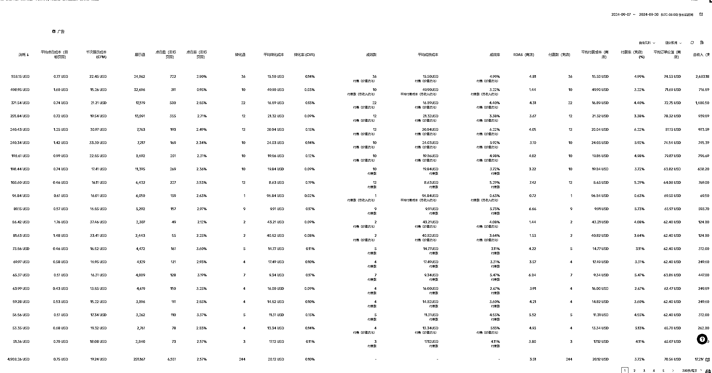

# TikTok 橱窗封号潮过后，莫名爆单，妈妈~我可以吃猪脚饭了。

> 原文：[`www.yuque.com/for_lazy/zhoubao/gbga2ztrx7l8yp1h`](https://www.yuque.com/for_lazy/zhoubao/gbga2ztrx7l8yp1h)

## (9 赞)TikTok 橱窗封号潮过后，莫名爆单，妈妈~我可以吃猪脚饭了。

作者： 梁小伟

日期：2024-09-24

9 月 14 有一波大封号，做橱窗的应该都感受到了吧。我们也被封了 5 个号（泪目）

因为我们打账号打出来特别稳定，包括每天发布的所有内容，都是纯实拍的。混剪都没让小伙伴去碰。

我去反复分析和找原因，我发现大概率是实名资料的问题。有网友提到风控大概率是账号的内容问题

我个人的感觉是资料不合规，被扫了。因为我们自己的内容从头到尾其实都没有触碰平台的红线，平台的规则我们也特别熟悉了。像其他几个号也是双屏，游戏，甚至情感号打出来的，也没有问题。

先看数据趋势。

9 月 15 之前，数据上下浮动不大。9 月 16 日迎来一波小爆发，9 月 19 日迎来一波小高潮。

这个新店铺从 0-百单，用时 2 个月

账号拆解最近七天：

这个店铺的账号配额情况

相关数据显示

商品卡流量拆解：

达人分析：今天共 11 个达人带，有 5 个还是我们自己的号

广告分析：

过去 14 天，每天 300 配额承接商品卡+自然流刺激

消耗 5000 美金，roas3.51 盈亏平衡线 1.9

异常值和实战分享

异常值，本周有个达人的视频爆了，出了 100 单。

注意：118 单是达人的，53 单的是自己的。

我是怎么做的。

53 单的这个是模仿了达人的拍摄框架。1：1 模仿没有露脸

借用了他的文案解说，用 AI 去改写类似的文案用作配音

直接借鉴了标题和前三秒文案

1：1 的模仿。他出 118 单，我出 53 单。

单条视频的结果

同样，我们理解这个事情。很多用户刷到视频，他第一时间是不是不会购买，可能会去搜索一下这个产品的市场反馈。

于是远在美国的小帅默默的进行搜索产品名称 xxx

这个时候我的各种橱窗内容出现了

这个时候他又懒得回去找原作者。。

机智的小帅默默刷了几条视频后，找个顺眼的视频下单了。

刚好，这个橱窗是我们自己打的。

oh，糟了，成我自然流量了。

更细致的来说呢

选购 Shoes，这里有产品推荐

查看视频，有一条广告位，有一条自然流位置

刚好，广告位我也开了，自然流位置也是我的。

oh？

总结：这里是什么意思呢。

我们来理解，玩流量的过程，任何作品都会流量溢出。

从小一点的思路出发，某条视频爆了，不管是自己的，达人的，甚至是路人测评的。

有一部分是直接转换的，还有一部分是流量溢出的。

去搜索，去看其他作品，去商城继续浏览

从大的角度出发，他会去亚马逊对比，会去 temu 对比，会去谷歌对比

这些流量溢出承接的方式：

1：多渠道布局

2：平台内部做好承接

承接：

1：优质且有一定播放量的软种草或营销作品

2：视频广告+商品卡广告拉满

这样的方法其实是一个具体的案例。

我日常是怎么做的呢？

第一步：找广告创意

打开皮皮，把相关的所有品类的广告创意，大结果的，广告播放超过 100K 的，全部模仿脚本，发一遍自然流。

品类少怎么办？去找其他品类的广告素材，刷到可以用，再模仿一遍脚本，发一遍自然流。

放大：将播放超过 2000 播放（24 小时内），或者几百播放就有出单的视频。投流刺激

每条刺激个 20-50 美金

有转换的，＋预算

没有转换的，刺激自然流播放。

第二步：挖掘自然流和达人的视频数据案例。

参考上方，模仿+放大

去 TikStar 查看对标账号近七天的达人数据和视频数据，同样的可以复制。

**最终总结：**

要在平台快速发展的环境中生存并实现长期增长，**合规运营**是基础，而**持续优化和执行**是成功的关键。无论是账号的资料合规，还是日常的内容发布和广告投放，都必须严格遵循平台规则。与此同时，保持对流量、达人策略、广告创意的持续跟进和调整，才能抓住每一个增长的机会。**合规+持续**，才是应对市场变动、实现稳健增长的最佳策略。

* * *

评论区：

暂无评论

* * *