# TikTok vs Facebook 广告

> 原文：[`www.yuque.com/for_lazy/zhoubao/tsu3r3r3fgf5gn4d`](https://www.yuque.com/for_lazy/zhoubao/tsu3r3r3fgf5gn4d)

## (6 赞)TikTok vs Facebook 广告

作者： 梁小伟

日期：2024-09-26

在这个流量为王的时代，广告投放不再是单一维度的转化比拼，它是一次次在用户心智中制造印象、引导决策的过程。抛开那些套路化的解读，TikTok 与 Facebook 这两大广告平台，究竟各自藏着怎样的秘密？我们今天不谈那些你随便搜一下就能找到的结论，而是深入看看它们的内在运作逻辑——尤其是在“流量外泄”与“用户迁移”的大背景下，广告主该如何在这些平台中游刃有余。

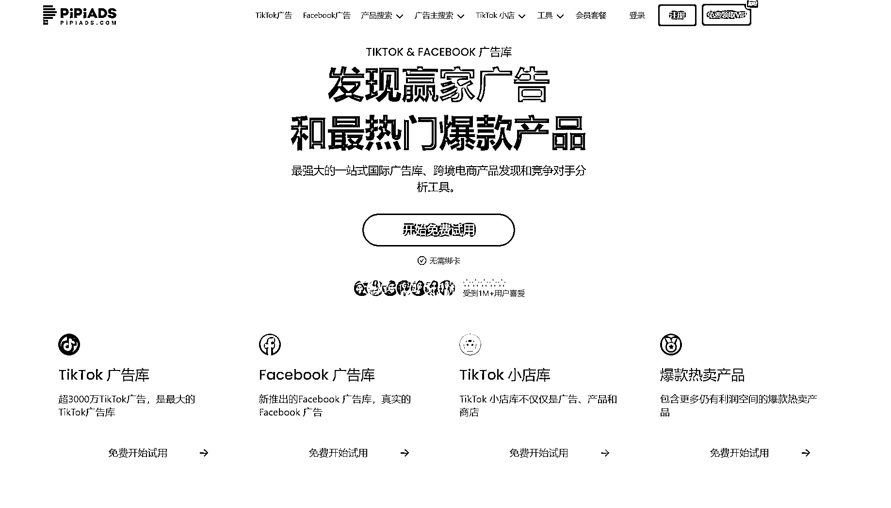

#### **一、归因的真实影响：Facebook 的精密，TikTok 的种草**

如果我们把广告归因比作侦探游戏，Facebook 毫无疑问是那个拥有显微镜和指纹采集工具的侦探。它不仅能精准地追踪用户从广告点击到最后的转化，还能“猜测”用户下一步的行为。如果你今天点击了一条 Facebook 广告。它不仅能追踪你从广告点进去的每一步操作，还能通过各种小招数，比如 Cookie 追踪，抓住你在别的平台上的每一个动作。举个简单例子吧，你今天看了一款咖啡机广告，过几天 Facebook 会推送相关品牌优惠，顺便还提醒你：“是不是该配点咖啡豆了？” 这种“无处不在”的数据追踪，真让人防不胜防。

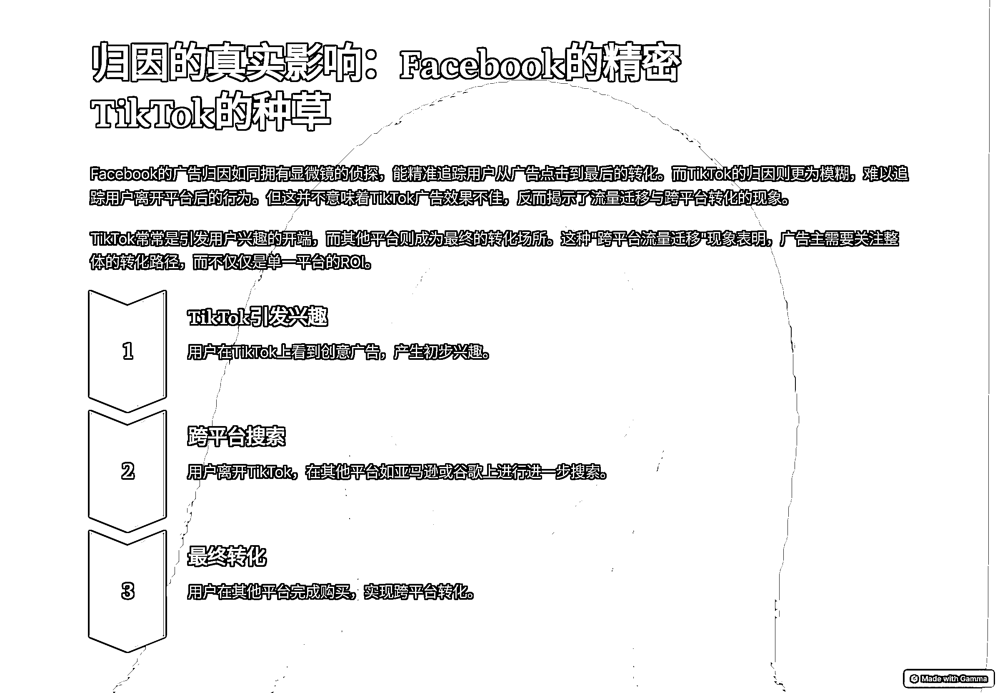

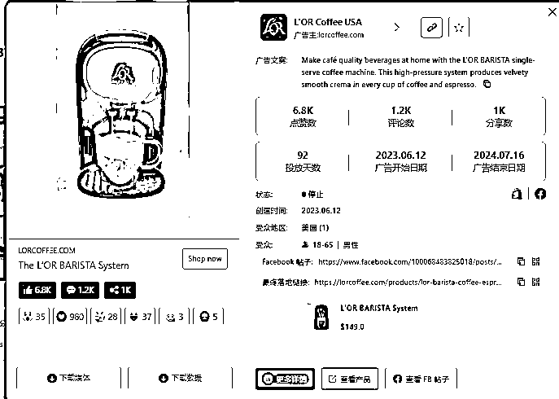

然而，TikTok 就有些“不拘小节”了。它的广告归因往往只能看到表面的点击和互动，用户离开 TikTok 之后的行为基本上就难以追踪。很多人觉得这意味着 TikTok 广告效果不如 Facebook，但真的是这样吗？我认为，TikTok 的模糊归因反而揭示了互联网世界中一个被忽视的现象：**流量迁移与跨平台转化**。

举个例子，你在 TikTok 上刷到了一个充满创意的家居产品广告，你可能不会当场购买，而是先记住这个产品，然后在亚马逊或谷歌上进一步搜索并下单。这个过程并非简单的“广告失效”，而是表明了消费者的**跨平台行为链条**。TikTok 是引爆兴趣的开端，而其他平台则成了最后的收割者。

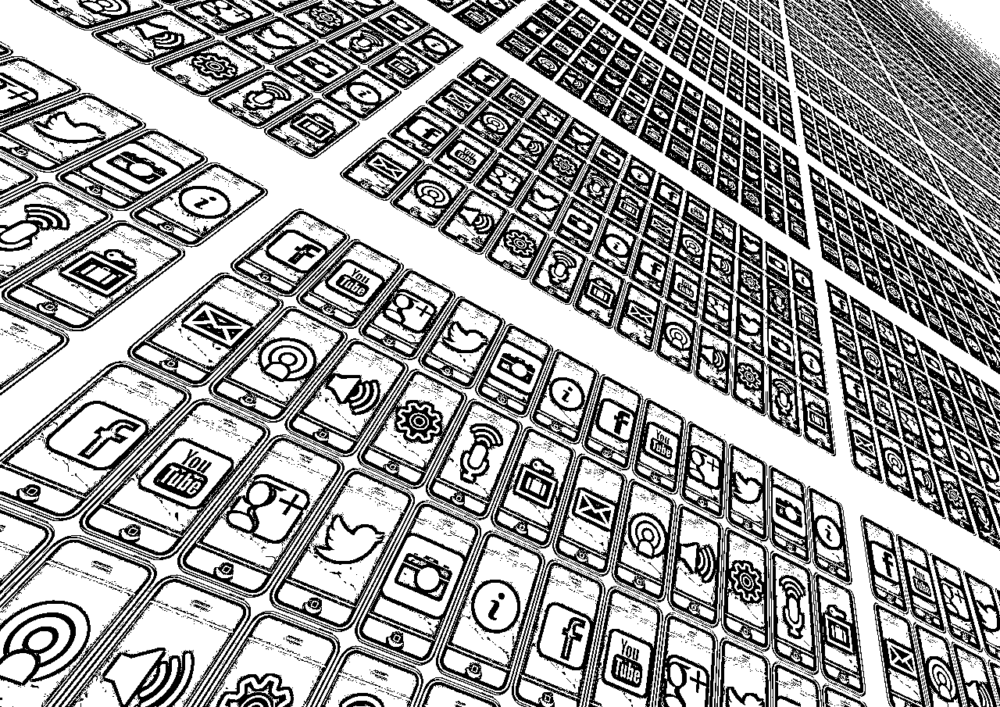

很多品牌主反映，在 TikTok 上，用户虽然互动热烈，但最后的转化不一定在平台上发生。这背后其实有个很有意思的现象——**流量外泄**。举个例子：你在 TikTok 上刷到一个创意家居产品广告，不一定当场下单，但记住了这个产品，然后去亚马逊或者谷歌上搜了搜，最终在哪个平台买？这就是典型的“跨平台流量迁移”。TikTok 是引发兴趣的“开胃菜”，而其他平台可能是“主菜”。

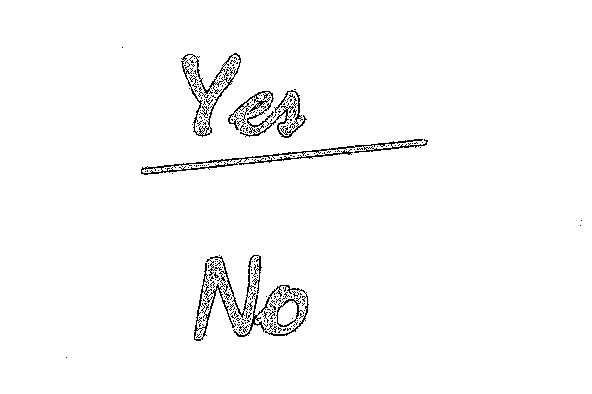

最终：真正聪明的广告主，应该意识到广告的最终效果并不仅仅体现在一个平台的 ROI 上，而是体现在整体的转化路径中。TikTok 引导用户去其他平台消费，Facebook 则让用户通过精密的追踪完成转化，两者各有侧重。广告主要做的不是只看某一个平台的表面数字，而是如何把多个平台的用户行为打通，让每一笔广告费都花得值。

#### **二、广告推送：算法背后的用户心智博弈**

#### **精准算法 vs.兴趣触发**

Facebook 的广告推送有一种让人“无法逃脱”的精准。它通过用户的兴趣标签、历史行为，把广告精确送达给那些已经有消费意向的人，Facebook 的广告推送精度，是基于数据的强大积累和用户行为的持续监控。它可以将广告精准推送给那些已经表现出明确需求的用户，且这种需求是长期的、可预测的。如果你喜欢喝咖啡，Facebook 不仅会给你推送不同品牌的咖啡机，连配套的杯子、豆子都会跟上。甚至你一想到咖啡，广告可能已经准备好了。

尤其是那些需要深度决策的商品，如电子产品、保险服务等。在 Facebook 上投放广告，你可以期待稳定的效果，

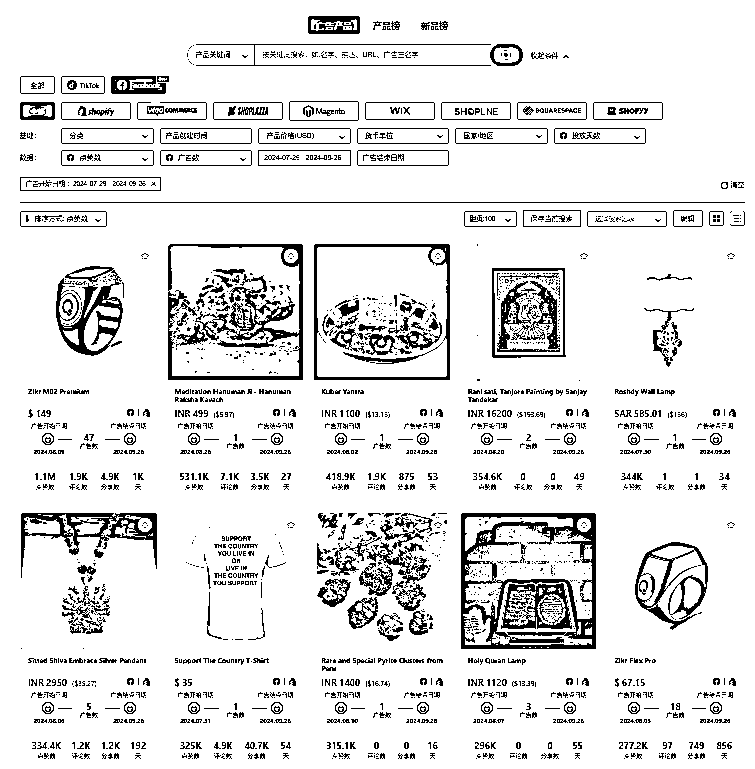

TikTok 则走的是完全不同的路线。它的广告推送是基于“兴趣瞬间”的捕捉，算法不会太在意用户是否有明确需求，而是关注用户的短期兴趣。广告常常是一种“瞬间触发”的行为，一条爆笑的视频可能突然激发用户的购物欲望。你看过多少在 TikTok 上刷到的搞笑广告后，忍不住点进去了？用户不是因为需求，而是因为广告的趣味性和创造力，通过兴趣去带动转化，比如，你刷到一个搞笑视频，笑着笑着突然来个广告，让你一时兴起点进去。这就是 TikTok 的“兴趣触发”：你可能并没有什么明确的需求，但广告就是这么突然抓住了你的情绪。那些爆款创意广告就是这么火起来的。

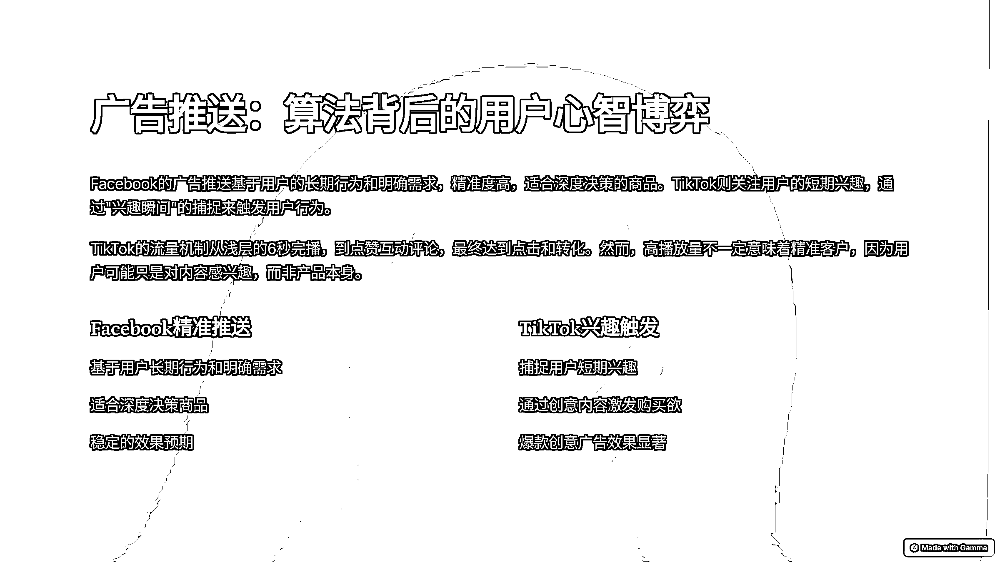

嘿嘿，这里需要纠正一个有意思的点。

为什么有些自然流视频能跑到几十万播放。但是实际转化可能只有几单或几十单。

我们聊聊 TikTok 的流量机制。

用大白话来说，最浅层是 6s 完播，接着是点赞互动评论，最终是点击和转化

你获取用了一个黄金三秒去引导客户，或者用一段非常有意思的文案去引导评论，实际上视频播放量增长，但你吸引过来的未必是精准的客户。

就像天天去 TikTok 看炒股的人，他可能不炒股，但他感兴趣！！天天看宠物的人，他不养宠物，但是喜欢看。

我们处在一个充满信息噪声的时代，Facebook 用数据逻辑打磨精准度，TikTok 则用算法制造惊喜。广告主的工作不只是放广告，而是去理解这两种广告背后**用户心智的博弈**。Facebook 帮你找到了“想买的人”，TikTok 则帮你制造了“想要的欲望”。两者的优势不应该对立，而是应当互补——让你在精准营销与情感共鸣之间游刃有余。

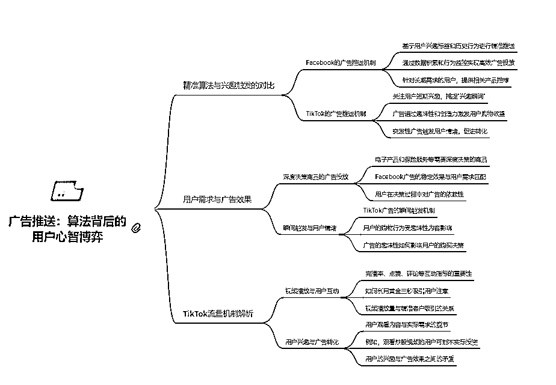

#### **三、用户行为迁移：老一辈与 Z 世代的消费之战**

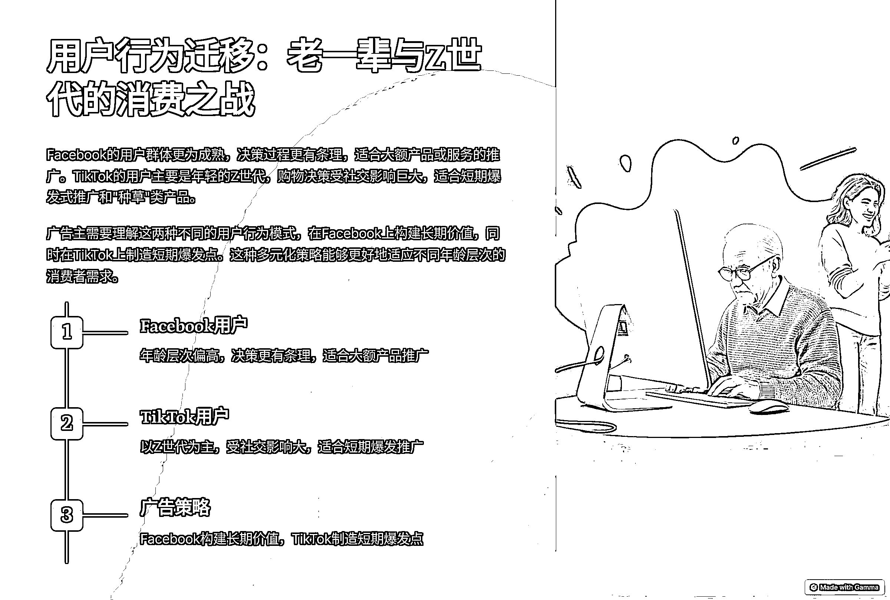

如果你还记得五年前的广告世界，Facebook 占据了几乎所有广告主的预算，大家都在追求“精细化营销”，而今天，TikTok 成了年轻品牌的宠儿，尤其是在快消、时尚、娱乐领域。为什么会有这样的转变？用户的行为迁移是关键。

**Facebook**的用户更为成熟，年龄层次偏高，他们做决策的时候更有条理，讲求逻辑，他们愿意花时间做对比、搜集信息。对于那些大额产品或服务，比如家电、汽车、金融服务，Facebook 的确更适合，因为用户愿意一步步了解并做出明智决策。

**TikTok**的用户群体主要是年轻的 Z 世代，他们的购物决策往往受社交影响巨大。刷到一个有趣的短视频，朋友也点赞，评论区还在热烈讨论，用户的购买欲望就被迅速点燃。这就是为什么许多品牌在 TikTok 上做短期爆发的推广，尤其是那些需要“种草”的产品。

我们不应该单纯用老一套的转化思维来看待新兴平台。广告主除了强转化结果，也可以主要把 TikTok 视作一种引爆品牌知名度和引导社交裂变的工具，而非单纯追求短期转化的手段。要赢得这场“消费之战”，广告主不仅要懂得如何在 Facebook 上构建长期价值，还要会在 TikTok 上制造短期的爆发点。

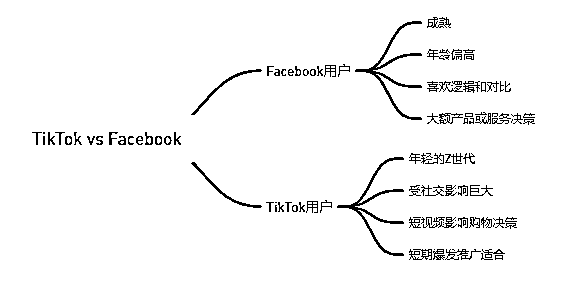

#### **四、流量外泄与多渠道布局：如何承接 TikTok 带来的“隐形流量”**

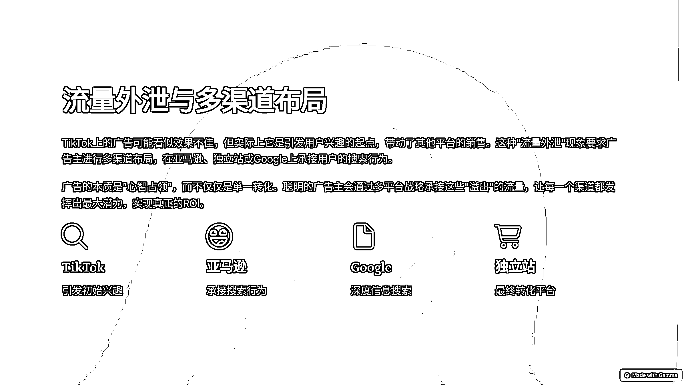

最后，说点最容易被忽视的东西——**流量外泄**。TikTok 上的流量看似没什么转化，投了广告用户不买，但他们记住了你的品牌，几天后在亚马逊下了单。表面上看，这些转化不归功于 TikTok，但实际上，这正是跨平台流量的经典案例。

广告主不能只看 TikTok 的单个平台数据，真正的 ROI 来自于**多渠道布局**。当用户从 TikTok 得到了初次印象，你需要在亚马逊、独立站或者 Google 上承接他们的搜索行为。你可能认为 TikTok 广告效果不佳，实际上它给其他平台带来了大量潜在客户。

广告的本质是“心智占领”，而不是单一转化。TikTok 的广告或许看起来效果不佳，但它是带动其他平台销售的起点。聪明的广告主会通过**多平台战略**承接这些“溢出”的流量，让每一个渠道都发挥出它的最大潜力。

总的来说，TikTok 和 Facebook 并不是对立的竞争者，它们各自的优势恰好补充了广告世界中的不同需求。聪明的广告主应懂得如何结合两者，利用不同的用户行为和流量特征，在每一个环节中抓住用户的心智。只有这样，你才能在这个复杂的广告生态中，真正找到属于自己的生存之道。

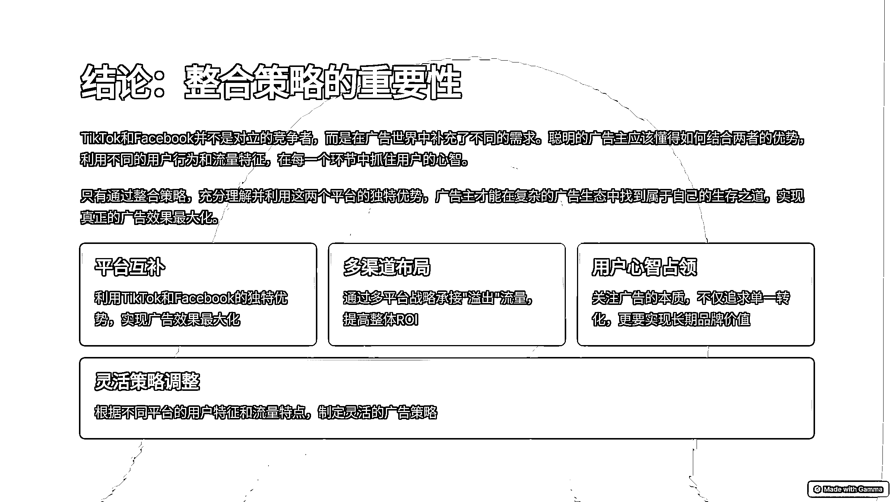

* * *

评论区：

追梦人~ : 伟哥，链接一下；
V;13043933311

* * *