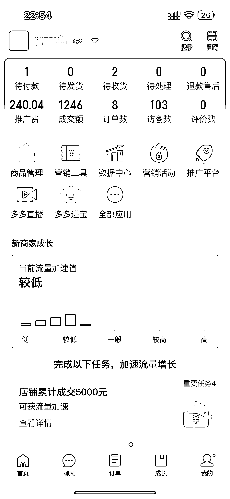

# 新手小白如何运营好拼多多流量赋能 AI 写作

> 原文：[`www.yuque.com/for_lazy/zhoubao/bi9x4wmez8suu919`](https://www.yuque.com/for_lazy/zhoubao/bi9x4wmez8suu919)

## (24 赞)新手小白如何运营好拼多多流量赋能 AI 写作

作者： 志恒 | Ai 写作

日期：2024-09-26

**新手小白如何运营好拼多多流量赋能 AI 写作的干货拆解！**

圈友们好，我是志恒，之前是货架电商店群操盘手，现在正在实操 AI 写作变现项目

入行两月，月收入 2W+

同时也在探索一些平台流量玩法.

作为刚入行没多久的新人，知道小白在这个行业获取流量的烦恼

在这里特地和各位圈友交流分享下，希望以下内容能给你现阶段带来一些帮助。

内容较长，请移步飞书：

[`nxpftdnmb71.feishu.cn/docx/S6NZdN2QKoQPoCxC3uAcc80Gngb?from=from_copylink`](https://nxpftdnmb71.feishu.cn/docx/S6NZdN2QKoQPoCxC3uAcc80Gngb?from=from_copylink)

* * *

评论区：

凡夫俗子 : 真是及时雨，AI 写作航海船员的福音。[强][强][强]
宇宙 : 优秀的零零后
陈 bu 懂 : 非常好使
Qwen : 厉害厉害，有问题请教一下，怎么链接？[握手][握手]
Qwen : 拼多多是不是会出现仅退款的风险？
志恒 | Ai 写作 : 目前我没碰到过仅退款，跟我的报价应该有关系，直接筛选掉
Qwen : 你是报高了还是报低？还想请教一下，如果不能出现违规词，是不是有一些客户知道怎么规避？只要是不会规避的都不接这样的客户？
志恒 | Ai 写作 : 报高，快捷回复，涉及到可直接选择不接

* * *