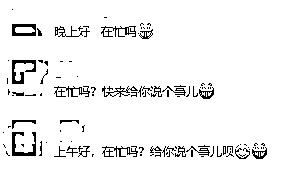
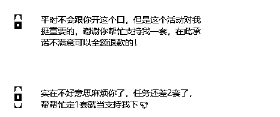
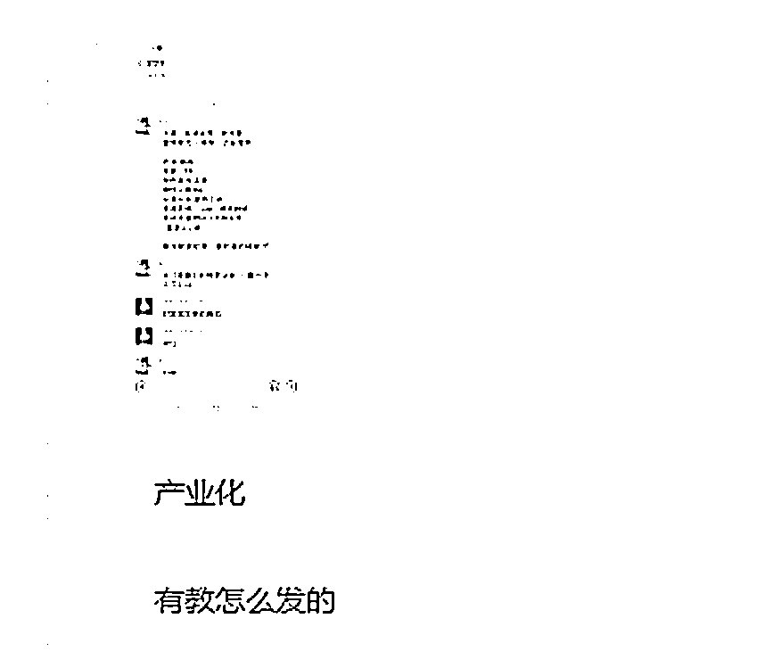

# 私域流量变现还能这么玩？

> 原文：[`www.yuque.com/for_lazy/zhoubao/xp005ofk8eoyhdkl`](https://www.yuque.com/for_lazy/zhoubao/xp005ofk8eoyhdkl)

## (16 赞)私域流量变现还能这么玩？

作者： 大鹏

日期：2024-09-25

大家好，我是大鹏，只讲真话，专注私域引流变现。

最近也不知道是怎么回事儿，微信里面主动找我聊天的人突然多了起来

一般都会先给我发一句“在忙吗？给你说件事儿”

有的甚至还用语音发

刚开始我还以为他们是有什么问题要咨询，所以一般都会回复

可令我没想到的是，只要我一回他，一大串广告就来了

有说什么参加带货比赛，有说公司绩效考核呢，就差我这一单就完成任务了

又是求支持又是求帮助的……

噢~原来是打广告的

本来我对微信群发打广告是没有这么反感的，因为只要看到是广告我不打开不看就行了

但我对这种打广告的方式极度反感，浪费精力浪费时间浪费表情

就好像有个人告诉你“我送你个礼物”

你满怀期待，结果那个人摊开手给了你一坨屎

这种心理上的落差感会让人产生极度厌烦

打广告的人虽然通过耍小聪明吸引到了人们的注意力，但对后续成交不仅没有帮助反而有很大的反作用

相信收到这种消息的人，后面的广告信息没几个人会看，大部分人都会选择拉黑删除~

当然我也不例外，因为我不想让这样的人在后面再有机会打扰到我，所以碰到一个删一个

本来我以为这个方法是一些自作聪明的人想的办法

但是我看到他们的话术出奇的一致

经过询问大佬才知道，原来这套玩法已经成了产业链了

还专门有人培训教你怎么去群发广告

他们把这个玩法还起了个高大上的名字“私域流量变现……

不是，各位他们是不是对私域变现理解有点偏了啊...

做私域确实可以赚到钱没有错

但运营私域可不等于打广告啊...

这都是多少年前微商时代的玩法了

他们不会真的以为这种低级营销方式能卖出去东西吧！

他们没有意识到你已经打扰到别人被很多人默默单删了了吗？

有的人账号估计都被封了好几次了吧...

成交的前提是信任

私域流量之所以能够赚钱，主要是源于粉丝对你有信任

为什么董宇辉直播间的东西比别人的贵那么多依然有大把人购买？是因为信任！

**私域运营的底层逻辑就是培养粉丝的信任度**

粉丝的信任度可不是说你通过像前面那种小伎俩培养的

这种小伎俩不仅不能培养粉丝信任度，反而对粉丝信任度是一种严重的消耗！

信任度也不是你编一个一眼假的小故事就能培养起来的，毕竟现在的人都不傻

那粉丝信任度到底该怎么培养呢？

一句话：**真诚利他，提供价值**

无论是情绪价值还是实用价值都可以

你需要通过不断地给粉丝提供价值，不断输出对他们有帮助的内容

让你的粉丝知道你很靠谱，知道你很专业，知道你很真诚

只有这样当他们需要你的产品或你的服务的时候才会想起你

这样即使你不打广告，都会有人主动来问你有没有什么产品？有没有什么项目？......

这才是私域流量变现的正确路径

而不是像群发广告这群人一样，不仅给别人提供不了任何价值，还满脑子都想着怎么掏粉丝兜里的钱...

这不是做私域流量变现，其实就是在做广告营销

现在的老铁对这种营销广告的免疫力已经极强了，基本没有什么耐受度了

你想想你平时接到推销电话的时候是什么感觉

你就知道别人收到这种营销广告消息的时候是什么心态了

要是像他们这么玩私域，有多少私域也不够啊，路只能越走越窄

想在网上赚钱，不用想的太难，按照成功人的路径去走就可以了

但也不要想的太简单，妄图通过一些偏门、捷径达到目的的，大概率都会掉进一个更大的陷阱！

* * *

评论区：

梓铷 Tina : 我最近一天也收到 4，5 条，通常是晾一晾

* * *