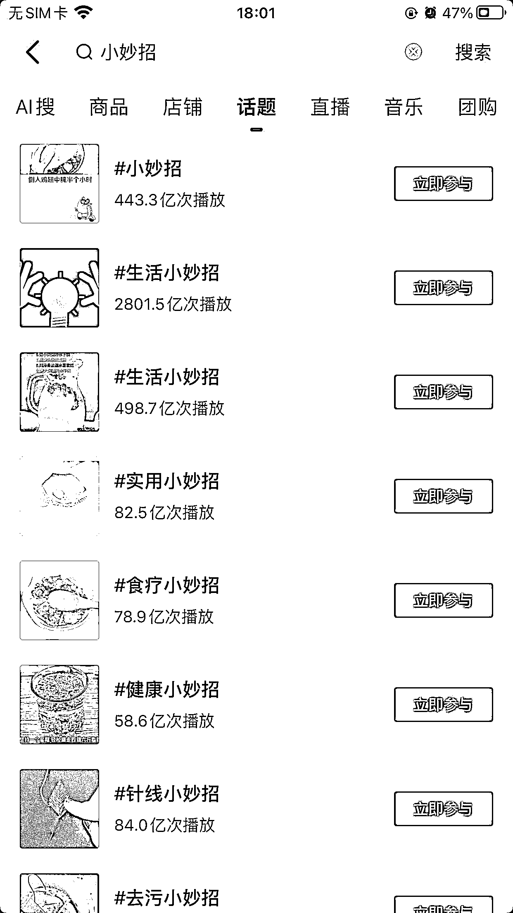
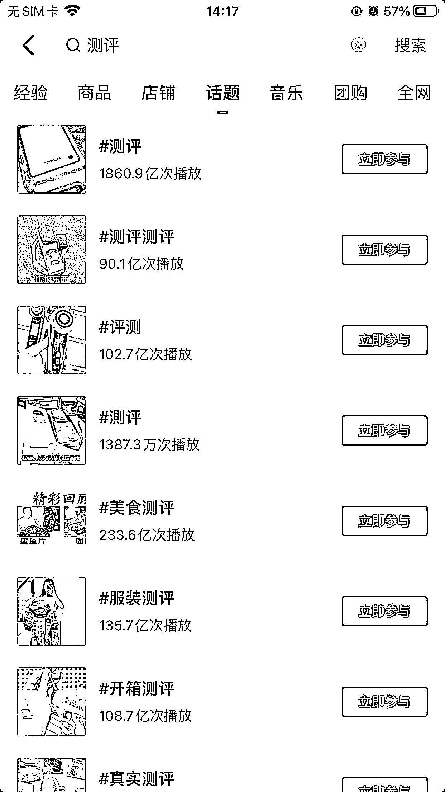
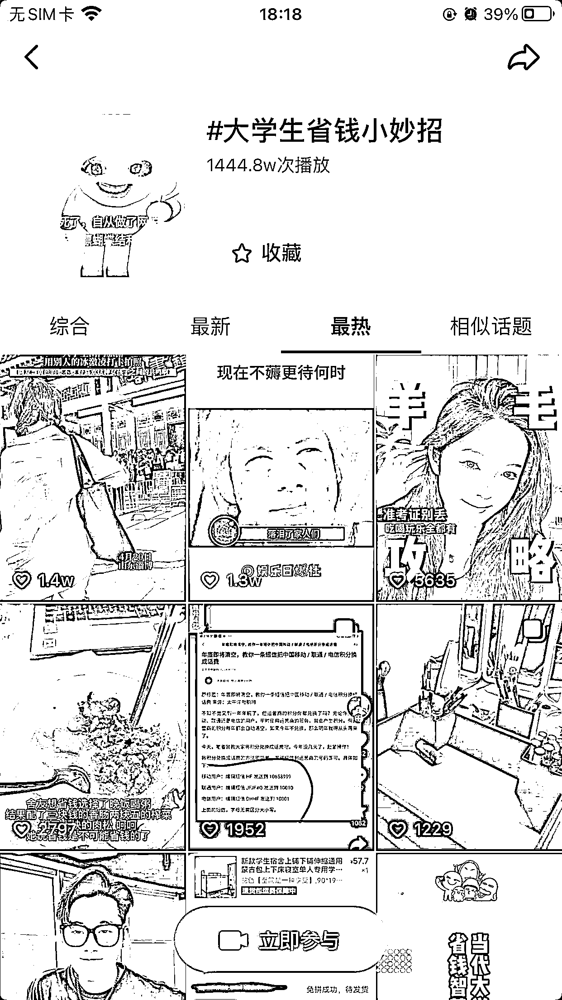
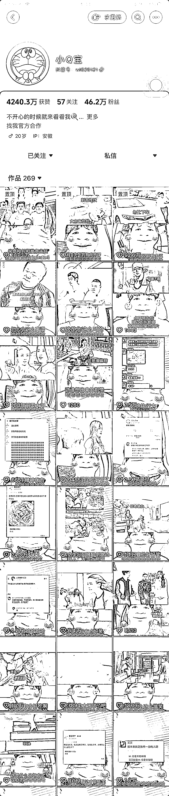
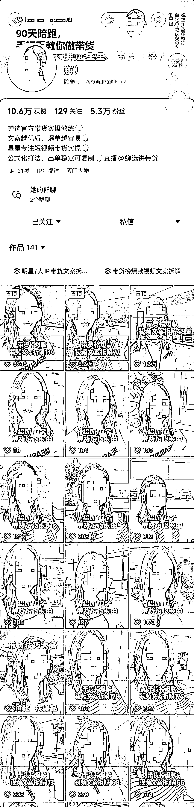

# 0 到 1 破局，筛精提效法

> 原文：[`www.yuque.com/for_lazy/zhoubao/ff4h3gneykpixs3z`](https://www.yuque.com/for_lazy/zhoubao/ff4h3gneykpixs3z)

## (12 赞)0 到 1 破局，筛精提效法

作者： 昊东

日期：2024-09-24

**一、【应用场景】**

1.群体中个体在同一个问题上重复搜集，工作量太大，总成本太高，需要超级结点来解决这个问题，并链接众人。

例：同城每日新闻、生活小妙招

2.事物数量纷杂，质量鱼龙混杂，需要筛选出符合标准的。

例：测评博主、精华贴、风向标、考古加、选品社群

3.表象真假参杂，需要去假存真，提炼元模型。

例：高考要点工具书、抖音案例拆解

# **二、【方法拆解】**

## Ⅰ.〈价值〉

由于多数人很难在繁杂的信息中，高效精准的获取有效信息，所以就出现了筛精提效的需求。

**击中心理：**捷径心理、懒惰心理、猎奇心理、慕强心理

## Ⅱ.〈稀缺〉

1.各行各业都存在信息差，不能事事精通。

2.人们的时间精力有限，不能事事亲力亲为。

3.大多数人的能力有限，不能看的深远。

## Ⅲ.〈壁垒〉

1.找痛点的能力。

2.解决问题的专业能力。

3.识别诱惑陷阱，坚守原则和底线。

4.散点成网进而成体的系统构建能力。

5.坚持和重复。

6.品牌声誉

**三、【实例】**

## 1.生活小妙招

## 2.测评

## 3.每天一个省钱小技巧

## 4、全网搞笑名场面

## 5、今日抖音带货榜前 3 的视频拆解

**四、【提示】**

主导者要有原则和专业能力，不能为了利益和偏好去主观的随意筛选，或放任破坏品牌声誉的事不管。

反例：某 8 同城

**最后，圈友们，可以把你发现的各行业符合筛精提效的案例，在评论区分享出来一起讨论一下。**

* * *

评论区：

昊东 : 6.配料表干净的零食
击中痛点：食品安全问题是广大群众的痛点，但自己又没那么多时间去筛选，因此有这块需求。引申出来的有儿童零食、宠物零食。
昊东 : 7.同城日结兼职

击中痛点：
同城日结兼职信息获取渠道太少，太分散，触达的用户少，招聘软件日结招收效果不理想。很多靠线下宣传，微信收集。人们自己找厂的话，效率很低，还容易被不好的厂坑。厂家可以通过日结工较低成本的筛选出符合要求的优秀员工转为长期工。

用户画像：
一是刚出社会的年轻人，没经验，没学历，找长期工比较难，需要日结兼职过渡一下。

二是一些有主业的人或大学生想做兼职多赚点。

三是一些上年纪的人不好找工作，需要做日结兼职谋生。
七天 : 昊东可以再分享下这个信息差有什么变现机会哇[洞察特别好]其实就是去除信息噪音，提供有效信息带来的需求变现
昊东 : 你想增加哪种粉丝，那就从用户爱好和生活场景中遇到的一些痛点着手，然后通过筛精提效的方式不断持续输出。

例如:很多圈友想做电商，但却不会选品，没时间选品，那你就做个选品群，然后通过各平台筛选软件选出最近爆品或优秀对标账号。
昊东 : 例如:现在食品安全问题严重，很多人都比较注重看配料表，而尤其重视儿童食品，那你就做个【一表衷心】的号，整几条猫狗做测评，有配料表展示解读环节，然后评论区设置精选留言，鼓励观众分享自己遇到的好产品，中选送礼物，并将起拉入粉丝群建立鉴品团，后续选中的产品展示环节视频中@中选人。

* * *