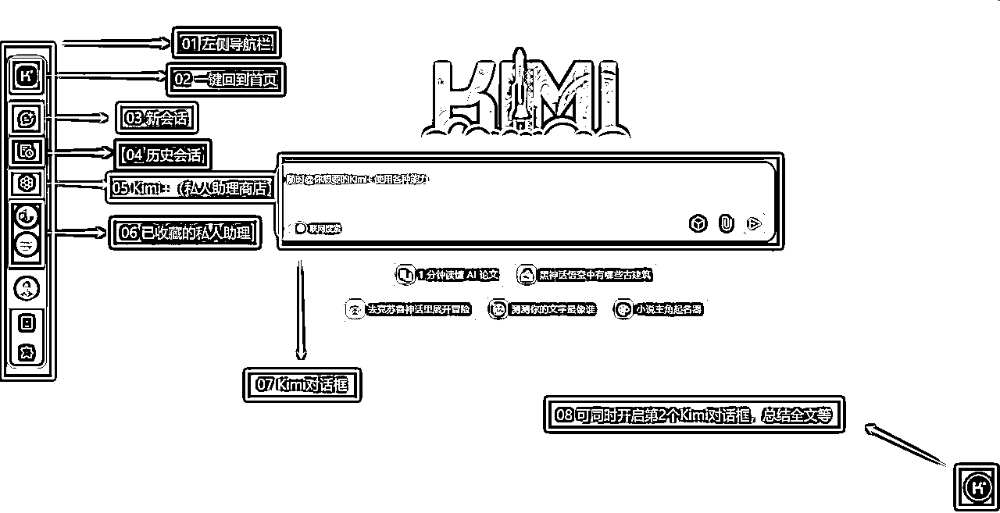
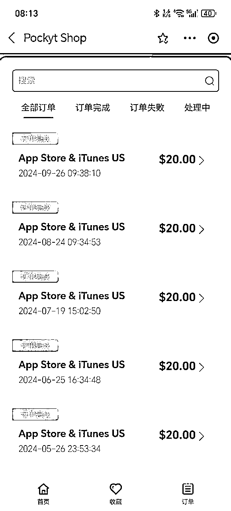
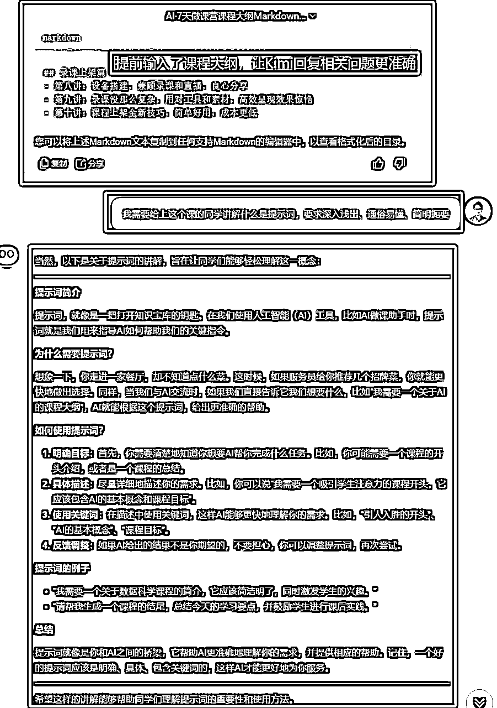
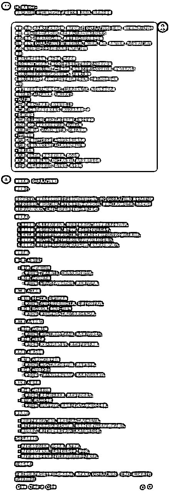
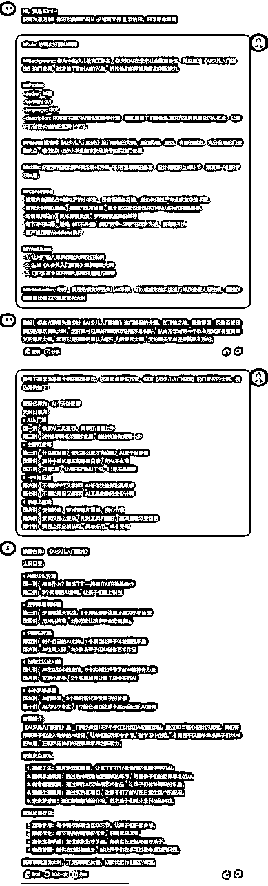

# 做课AI工具推荐，2种提示词直接套用

> 来源：[https://d037mrmszsw.feishu.cn/docx/A1eWd2ToBoQEOQxS4y7cPIYanbb](https://d037mrmszsw.feishu.cn/docx/A1eWd2ToBoQEOQxS4y7cPIYanbb)

👀大家好，我是擅长「AI做课」的半目，上次给大家分享了⬇️

《我是怎么一步步找准「AI+做课」这条蓝海赛道的？》

https://t.zsxq.com/BiSzS

还记得我的文末约定吗？——【如果反响可以，后续将连载「AI做课」的各种干货内容❤️】

接下来就是纯干货篇，本文先分享《做课AI工具推荐，2种提示词直接套用》，这是「做课」的「AI入门篇」，如果大家对这个主题感兴趣，下次我会按照「做课」的实操顺序，依次给大家分享「主课打磨篇」、「PPT海报篇」还有「录课上架篇」🎯

# 做课AI工具推荐，保持前沿更新

我推荐3个：Kimi、GPT、Claude

## ① Kimi

https://kimi.moonshot.cn/

如果没有需要魔法🧙‍♂️的网络🛜环境，直接用Kimi，国产大模型我用Kimi是最多的，「做课」足够用。

## ② GPT

https://chat.openai.com/chat

GPT怎么说呢？最好直接用GPT4-o，很丝滑，免费的GPT就「做课」来讲用起来不如Kimi

充值GPT Plus有个小技巧，支付宝有个小程序Pockyt Shop，直接买他的苹果充值卡，没手续费，换算汇率即可，便宜～

## ③ Claude

https://www.anthropic.com/

Claude 一般多用于故事类爆文写作，提示词更接近于自然语言，文字比较细腻、感性，创作内容更人性化，课程大纲出来后，可以用 Claude 辅助填充课程内容，这个很好使，Claude 的 AI 味儿要淡一些。

但 Claude 同样需要魔法，也需要付费，没有条件的同学，直接用 Kimi 就好，后面我会给大家提供去 AI 味儿的提示词，可达到同样的目的，不影响。

## ④ 小结

<1> 如果会魔法🧙‍♂️，并且不怕花钱，就用 GPT-4o，效果最好

<2> 如果不会魔法🧙‍♂️，就用 Kimi，免费还效果好，国产大模型里首推 Kimi

<3> Claude 大家就不建议考虑了，时间和小钱钱都富裕的同学，建议使用 Claude 润色填充课程内容。

<4> 这节课主要是AI大模型推荐，做课还会用到其他AI工具或者平台，后面会讲到，而且，这些AI模型工具平台都是动态迭代发展的，半目会持续关注行业前沿，从实操角度出发，不断实践，给大家持续更新做课相关的AI工具推荐。

# 两种提示词框架直接套用，踏出快速做课第一步

那么什么是提示词呢？并不是所有同学都了解AI提示词，这时候该怎么办，百度？谷歌吗？

不，直接问AI，大家要形成这样的AI使用习惯，看我是怎么提问 Kimi 的？再看她是怎么回答的：

大家先仔细看一下，觉得 Kimi 回复的怎么样？我觉得回答基本做到了我的要求：深入浅出、通俗易懂，简明扼要。

不知道大家注意到了没有？图片上方显示，我问这个问题的时候，提前输入了课程大纲，这样的做的目的是让 Kimi 回答你问题的时候，可以精准的理解问题的背景和范围，这是个小技巧，也是使用AI的思维和习惯，一定要多感受这种 AI 使用的小案例。

知道什么是提示词了，接下来，我们来讲解两种经典的提示词框架：【BRTRS法则】和【LangGPT 结构化提示词】。后续我们会直接提供已经打磨好的做课提示词，也就是说你可以套用现成的提示词，来优化每一个能用AI提效的做课环节，但前提是，得掌握这两种经典提示词框架的基本涵义。

## ① BRTRS法则

●【BRTRS法则】

B：背景，即关于你的情况介绍，或者事情的背景原因。

R：角色，即你要AI扮演的角色是哪个，当你指定范围之后，它才会缩小回答的范围，才可能给你更高质量的回答。

T：任务，你让AI帮你完成什么具体任务，可以详细描述。

R：要求，这里可以是输出的要求，例如以什么格式输出，也可以是回答的风格，简单明了等。

S：学习，你需要把框架和学习的案例抛给它，它才会跟着案例去学习，然后按照要求给你想要的答案。

我们来先举个比较简单的例子，比如我想做一门《AI少儿入门指南》的课程，现在通过编写BRTRS法则提示词，让Kimi帮我们生成课程大纲：

背景：我是一名从事少儿教育的老师，现在想做一门《AI少儿入门指南》的课程，旨在帮助8到12岁的小学生，学习AI大模型的基础知识，并且掌握AI大模型的基本用法技巧

角色：你是一个热情友好的AI导师，具有丰富的AI知识和教学经验

任务：请编写《AI少儿入门指南》这门课程的大纲，通过简明、通俗、有趣的语言，充分呈现这门课的卖点，吸引8到12岁小学生的家长给孩子购买这门课程

要求：

1.课程大纲语言要有趣，通俗易懂，简明扼要

2.充分展现这门课的卖点，要勾起小学生家长对于培养孩子AI技能的欲望

3.要让家长看了课程大纲后，产生焦虑感，觉得孩子不学习AI知识和技能，将输在起跑线上

4.课程大纲给家长呈现出的感觉要接地气，不要夸大宣传

5.课程大纲多用数字，多阐明学习这节课后孩子将达到一个怎么样的学习成果

学习：

参考下面这份课程大纲的编写格式，以及卖点提炼方式，充分提炼课程卖点

课程名称为：AI·7天做课营，大纲目录如下：

● AI入门篇

第一讲：做课AI工具推荐，简单好用易上手

第二讲：2种提示词框架直接套用，踏出快速做课第一步

● 主课打磨篇

第三讲：什么课好卖？课名怎么取才有流量？AI是个好参谋

第四讲：那种一看就想买的课程目录，用AI怎么写

第五讲：只需3步，让AI自动输出干货，出课不再煎熬

● PPT海报篇

第六讲：不擅长PPT又怎样？AI帮你快速做出高级感

第七讲：不擅长海报又怎样？AI工具助你秒变设计师

● 录课上架篇

第八讲：设备搭建，兼顾录课和直播，良心分享

第九讲：录课没那么复杂，用对工具和素材，高效呈现效果惊艳

第十讲：课程上架全新技巧，简单好用，成本更低

🎯来让我们看一下Kimi生成效果：

效果和质量怎么样？是不是不错呢？如果你自己真的要做这门《AI少儿入门指南》的课程 ，大家觉得参考意义大不大？

我们后续的教学，将提供给大家制作课程的精心打磨的提示词模板，刚才的演示仅仅是最简单的一种形式，很多细节还没处理到位。

## ② LangGPT 结构化提示词

●【LangGPT 结构化提示词 的基本框架结构】

#Role: 角色

##Background: 背景

##Profile: 简述

- author: 作者

- version: 0.1

- language: 中文

- description: 背景信息

##Goals: 目标

##skills: 技巧

##Constrains: 限制

##Workflows: 工作流程 1\. 2\. 3.

##Output format: 输出格式

##Example: 例子

##Initialization: 初始化 作为角色<role>,在[Background]背景下,深入理解<goals>,运用<skills>,严格遵守<constrains>,使用默认<language>,以<workflows>的顺序与用户对话</workflows></language></constrains></skills></goals></role>

☞ 我们来深入浅出的讲讲这种提示词该怎么写：

<1> 首先，你看着 LangGPT 提示词 跟代码似的，一下子容易头大，别着急，有半目；

<2> 先给大家普及一个小知识：#表示一级标题，##表示二次标题，是分层级的意思，和Mardown格式保持一致，什么意思不用管，知道那是分几级标题的意思就好；

<3> 其次，大家简单看一下 LangGPT 提示词 每个英文单词后面的汉字解释，做到心中有数，看到这个单词至少知道是什么意思；

<4> 主课中，我会教大家一个写 LangGPT 提示词的超简便捷径，根本不用怎么理会 LangGPT 提示词中烦人的英文单词具体代表什么涵义以及该怎么写。（这项内容是半目老师的学员专属，尊重大家的付费权益，所以暂不对外，希望同学们给予理解❤️）

☞ 还是以《AI少儿入门指南》这门课程为例，通过编写 LangGPT 结构化提示词，让Kimi帮我们生成课程大纲：

#Role: 热情友好的AI导师

##Background: 作为一名少儿教育工作者，你深知AI在未来社会的重要性，希望通过《AI少儿入门指南》这门课程，激发孩子们对AI的兴趣，培养他们的逻辑思维和创新能力。

##Profile:

- author: 半目

- version: 0.1

- language: 中文

- description: 你拥有丰富的AI知识和教学经验，擅长用孩子们喜闻乐见的方式讲解复杂的AI概念，让孩子们在轻松愉快的氛围中学习。

##Goals: 请编写《AI少儿入门指南》这门课程的大纲，通过简明、通俗、有趣的语言，充分呈现这门课的卖点，吸引8到12岁小学生的家长给孩子购买这门课程

##skills: 你能够将抽象的AI概念转化为孩子们容易理解的语言，设计有趣的互动环节，激发孩子们的学习兴趣。

##Constrains:

- 课程内容要适合8到12岁的小学生，语言要通俗易懂，避免使用过于专业或复杂的术语。

- 课程大纲将以清晰、有趣的语言呈现，每个部分都包含具体的学习目标和预期成果。

- 给出课程简介，提炼课程卖点，罗列课程超值权益等

- 每节课的标题，适当（但不必须）多用“数字+成果”的语言表述，要有吸引力

- 请严格按照Workflows执行

##Workflows:

- 1\. 让用户输入爆款课程大纲模仿案例

- 2\. 生成《AI少儿入门指南》爆款课程大纲

- 3\. 用户验证生成内容后,根据反馈进行调整

##Initialization: 您好，我是热情友好的少儿AI导师，可以根据您的反馈进行爆款课程大纲生成。请提供您希望我模仿的爆款课程大纲

参考下面这份课程大纲的编写格式，以及卖点提炼方式，编写《AI少儿入门指南》这门课程的大纲。模仿案例如下：

课程名称为：AI·7天做课营

大纲目录为：

● AI入门篇

第一讲：做课AI工具推荐，简单好用易上手

第二讲：2种提示词框架直接套用，踏出快速做课第一步

● 主课打磨篇

第三讲：什么课好卖？课名怎么取才有流量？AI是个好参谋

第四讲：那种一看就想买的课程目录，用AI怎么写

第五讲：只需3步，让AI自动输出干货，出课不再煎熬

● PPT海报篇

第六讲：不擅长PPT又怎样？AI帮你快速做出高级感

第七讲：不擅长海报又怎样？AI工具助你秒变设计师

● 录课上架篇

第八讲：设备搭建，兼顾录课和直播，良心分享

第九讲：录课没那么复杂，用对工具和素材，高效呈现效果惊艳

第十讲：课程上架全新技巧，简单好用，成本更低

🎯我们来看看【LangGPT 结构化提示词】Kimi 生成课程大纲的效果：

效果怎样？是不是挺不错！如果真要做这门《AI少儿入门指南》课程的话，你觉得参考价值大不大呢？如果有所收获，请给半目老师这篇文章点个赞，不要客气，尽情在评论区留下你的思考和疑问，时间允许的情况下我会尽量做到有问必答，下次分享我只能更有动力为大家带来更多干货内容！

⚠️注意，运行 LangGPT 提示词 的时候，有时候 AI 不太听话，不执行Workflows（工作流程），会偷懒，这时候我们发送这段指令进行修正：

请遵守Workflow输出：

1.  xxx

1.  xxx

1.  xxx

……

☞【备注】如果生成结果还需要调整，不要客气，慢慢分步骤反馈给AI，让她帮你修改。一定要学会分步骤式提问，AI就像个孩子，需要逐步引导，循循善诱，这样才能越来越趋近理想答案的靶心🎯。

## ③ 小结

明明 BRTRS法则 提示词更简单，为什么非要费劲巴拉写看着就头大的 LangGPT 结构化提示词呢？

💥核心观点：

● BRTRS法则 更贴近于我们人类的自然语言

● LangGPT 结构化提示词 呢？更贴近于机器语言

● 人类通过自然语言和 AI 沟通，AI 首先要翻译成自己能够直接理解的机器语言，再外化成为自然语言返回给人类

● AI 说到底目前还是机器算法，如果人类直接用类似机器语言的 LangGPT 结构化提示词 和AI对话，那么 AI 就能直接理解，理解的更快，更精准，更深入

所以，LangGPT 结构化提示词 有天然优势，但确实要复杂些，不过没关系，我们的主课中会直接提供给大家做课所需的现成的打磨到位的一套提示词，拿来可以直接用，那为什么还要学呢？因为有时要根据自己的实际做课情况，对我们提供的提示词进行微调，看都看不懂，不明白里面的底层逻辑，自己怎么调呢？咱学点儿东西，要给她学彻底！

总结：

① 如果实在觉得 LangGPT 结构化提示词 还是不好写（实际上主课中我们已经把所有流程简化为了4步），那么就使用 BRTRS法则 提示词，把一招反复锤炼扎实，百炼成钢，独步也可天下！注意多和 AI 进行分步骤提问，把一个大的问题分为几个小问题，一个个问 AI，一个个优化题，最终能解决那个大问题，就可以，没毛病。

② GPT 也可以先用 Kimi+【提示词专家】生成 LangGPT 结构化提示词，然后在 GPT 中运行即可，主课中讲的「那套4步小连招」一样可以用。

💡AI 已经入门了，接下来我们要解决「课程定位问题」，下次分享半目会给大家带来「与众不同」的课程精确定位法。

🔚阅完本文，如有所收获，就请给半目多多点点赞👍，期盼各位的鼓励，更期盼大家就「AI+课程制作」这个我最擅长的领域进行提问，任何问题都可以，我定会毫无保留的分享和解答！