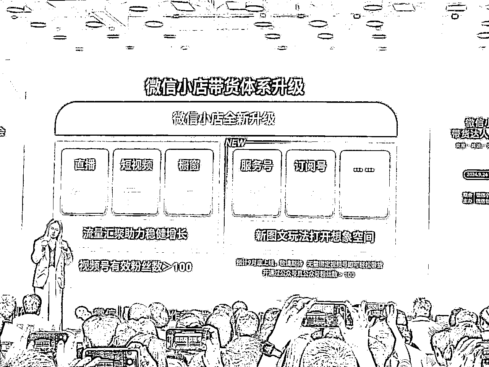
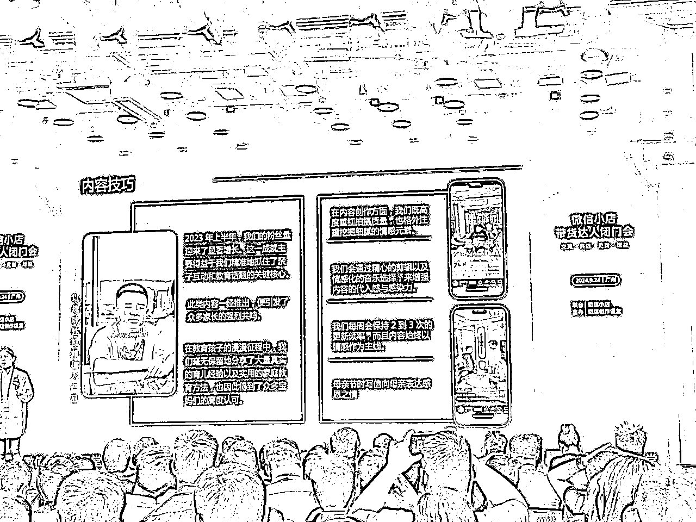
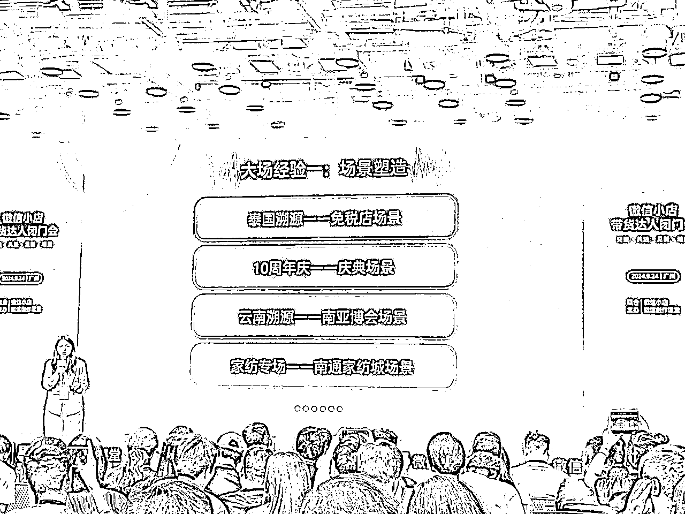
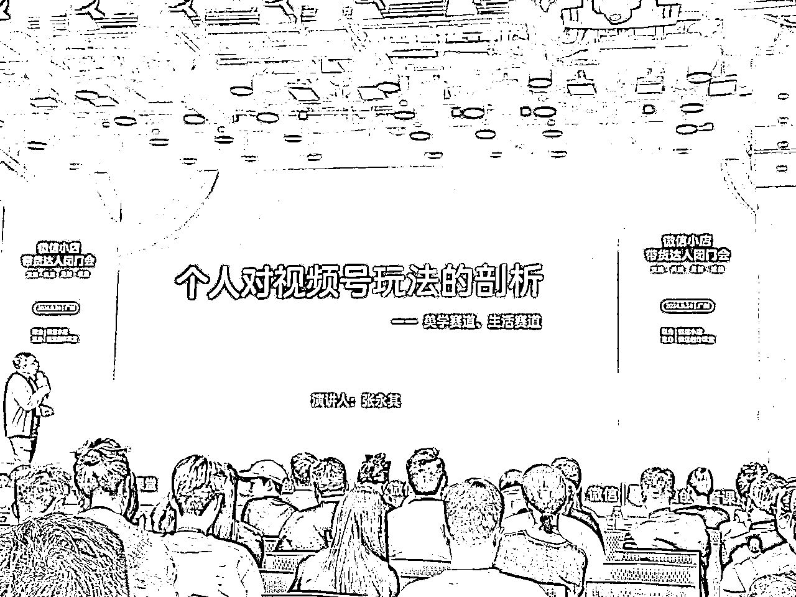

# 微信小店带货达人闭门会

> 来源：[https://rxc7lnelf7.feishu.cn/docx/A2wkdauRLo36VMxvciuclrZUnRf](https://rxc7lnelf7.feishu.cn/docx/A2wkdauRLo36VMxvciuclrZUnRf)

# 

# 达人业务新进展分享

线上商达双选会，让商达撮合效率更高。

公众号小绿书带货，无需绑定视频号，即可带货，新图文玩法打开想象空间。

直播间流量大盘数据更清晰，流量算法白盒化。

MCN和服务商的系统升级，下半年MCN分账功能/MCN等级体系将会上线。

优质内容达人账号分享

知识文化：冯唐老师，钛金属杯子，视频内容植入产品，七夕发售卖了4k单，客单价100+。知识老师，带来的不止是知识观点，还有文创周边。

才艺技能：丁老师，用户因为达人唱歌，对达人有信任感，也会下单购买达人推荐的产品。

海外旅游：厦门阿波，每到节假日，用户需求激增。

科技测评：菜阿玛，平台供给少，但是用户需求量大，该类型达人很稀缺。

家庭情感/三农美食/品质生活/明星名人，围绕特定群体而做的账号，有不错的机会。

# 新上线产品玩法介绍

## 数据驱动，科学经营。

用达人罗盘，一个工具，让所有视角负责人都可以在同一入口去查看数据分析数据，提高工作效率。

达人罗盘+直播数据大屏「可对比同行直播数据，针对性优化」

平台持续通过产品迭代，解决用户购买的信任感，让用户放心买，提升转化率。

未来上线独立小程序: 达人助手工作台，商家客服工作台，多端消息聚拢，更好服务用户。

## 达人成长等级上线

达人成长-星级体系，帮助达人进行全生命周期成长运营。

国庆节前，上线带货达人星级体系，从带货结算Gmv，有效关注数，橱窗带货分三个指标考核。

达人星级，1星到5星达标规则：

4星以上达人，展示优质带货达人金标

从0星到5星均有达标奖励和权益

4星以上达人，大场报名排期，有流量扶持。

四星以上达人获得优达优品权限，不受优选联盟观察期限制，可以无限制带观察期产品，产品更多元化。

# 达人新政策解读

## 达人政策支持

达人：涨粉快，价值高，有耐心，增量稳。

达人持续有流量扶持，根据带货Gmv返现流量卡，可以直接用来投流。

*   拉新激励政策：https://docs.qq.com/doc/p/13109e325f722136364be44387cd1e9b15982d6c

*   成长与大场激励政策：https://support.weixin.qq.com/cgi-bin/mmsupportacctnodeweb-bin/pages/Gesu9ts1AVFKutUr

自然流叠加微投放，整个账号的成长会更好。

## 达人机构x服务商的支持

完善达人机构功能的基建：机构等级以及权益，机构保证金，机构线上分账能力。

达人机构拉新达人，扶持政策。

*   MCN达人拉新与成长激励政策：https://docs.qq.com/doc/p/24c1cea845d2af8e23a30626c639b5efcb29ddfb

## 达人机构案例

分享了达人机构与主播的合作案例，包括如何提升内容质量、教学专场、产品结构、商业投放能力等方面。

强调了达人机构在处理客诉和正向运营方面的作用，以及与官方团队的深度合作。

最后，提到了未来的一些政策和方向，包括在特定时间节点和季节性节点配合行业侧的伙伴一起创建季节性的活动政策。

# 规则治理负责人分享

不是处罚，而是治理，让生态更好。

规则官网 https://store.weixin.qq.com/commerce#/noticeList

#视频号：视频号卖货助手

公众号：微信小店交易规则中心

微信消息页面可直接查看违规，不用再从视频号入口到消息入口查看。

如新增规则，公示7天，规则反馈7天，不小心被处罚可以在消息里，点击下方联系客服，是规则治理的业务同学，非外包客服。

柔性治理，弹窗提醒，以考代罚，不直接处罚，24小时内通过考试即可免除处罚。

PC端也可以查看详细违规信息，可以参加以考代罚和申诉。

总之，少点套路，多点真诚

真诚，就是最好的带货技巧。

# 服饰行业动态与机会

行业分享与选品方向探讨。主要分享了来自大行业的经验，包括行业概况、选品方向和人群等内容。

首先，介绍了整个行业的高速增长和发展阶段，以及服饰女装的重要性。其次，讲述了目前市场的趋势和市场反馈，特别是在9月底，整个行业的商品给大家超过人类，特别是在里面接待的非常大的一个机会。最后，分享了如何做好商家，包括在黄金区域上留意需求，以及如何针对不同人群进行推广。

主要讲述了服饰行业的一些特点和需求。

首先，提到了：人、货、场。其次，分析了不同年龄段和职业的人对服装设计的偏好。

最后，强调了消费场景和舒适性在消费者选择中的重要性。在设计方面，要根据不同人群的需求进行优化，如提供适合他们的设计，使用进口面料等。

主要讲述了消费场景、用户偏好、电商激励等方面的内容。

首先，根据用户的偏好，可以分为不同的消费场景，如旅游、社交、健身等。

其次，微信用户在购买时会考虑到家庭成员的需求，如女性会为丈夫购买衬衫。

再次，电商激励方面，从9月11号到10月1号，鼓励更多的达人参加活动。

【🔥服饰秋冬上新季激励计划火热报名🔥】

活动规则链接：https://support.weixin.qq.com/cgi-bin/mmsupportacctnodeweb-bin/pages/aLm9hFUPKFPUhEso

核心奖励：按照结算GMV*1.5%奖励电商成长卡

活动时间：9月19日 10:00 至10月09日23:59:59

参与商品：服饰内衣、鞋靴箱包、家纺、母婴和运动户外等类目

扫描下方二维码或报名直达链接➡️➡️➡️➡️https://channels.weixin.qq.com/shop/ssr/marketing/activity/h5?id=240

# 达人，机构伙伴分享

## 俊爸轩妈

起号背景，来自不同行业，没有任何经验

不知道做哪个板块，只能选择自己擅长的领域，家庭教育，吸引宝妈群体。

内容围绕家庭展开，传递夫妻关系，婆媳关系，家庭关系，中国传统家风文化。

视频时长比较长，看完视频能留下来关注的都是铁粉。

推荐产品要对铁粉负责，以品质优先，把粉丝服务好。

内容技巧，内容引起用户共鸣:开家庭会议，播放量高，粉丝显著增长。

案例：视频植入产品，儿子偷吃火龙果，引入洗衣机凝珠，软植入更适合平台用户。

平台x达人x机构，三向奔赴

## 小峰小志的猫咪小院

起号背景，情绪需求，选对宠物赛道

私域蓄水和维护，保持内容输出，拒绝过度商业化。

不强推加微，微信群是猫咪成长分享，猫咪家长之间互动。

粉丝群，小程序抽奖

在有直播带货变现的情况下，粉丝增长仍稳定

视频号人群质量高，粉丝粘性强，只分享自己使用过的产品。

分享产品的优劣，比如猫砂，有些可溶于水，有些不可溶于水。

强人设，做真实的自己，可以带动白牌产品，视频号直播节奏更平缓。

增强直播粘性

1.定制福袋

2.直播福利活动

3.定期更换直播背景，服化道。

4.日常直播不带货，聊天，增强信任感

大促前后的动作

提前挂预约，粉丝群预告，

私域客诉反馈，公示售后问题和处理进度

博主本人亲力亲为，关注选品和售后

## 洞见

背景，从公众号转型视频号，知识分享

起步蓄力，多种直播形式的探索，知识分享，作家采访，电台语音。

陪伴型带货，洞见夜读，朗读美文。

长期发展需要一个真人IP，找到王牌主播，林静。

增强转化，高质量但缺乏成交习惯，不知道怎么下单。--付费潜力股

大场经验1-场景塑造

大场经验2 借热点引入，图文种草，短视频+直播收获

大场经验3 团队高效配合

## 1918机构对玩法的剖析

1918机构ceo张永其分享

流量来源分析01直播间

流量来源分析02短视频

流量来源分析03私域微信

选品方向

## 微盟机构孵化IP方法论

以人为本，全域变现

内容运营到用户运营

机构对达人:底层能力

达人成长三部曲

起盘期，被记住才能有所图

起盘期服务案例

成长期，深耕细作，留客转化

参考别人，不要照抄，找自己的特长，做主题营销

成长期案例

成熟期方法

成熟期案例

达人账号全链路变现

