# 如何提高小绿书爆文出单概率？

> 来源：[https://die28mmde0k.feishu.cn/docx/BPJ9dj5MzoYDiVxypAQcfh9Znnd](https://die28mmde0k.feishu.cn/docx/BPJ9dj5MzoYDiVxypAQcfh9Znnd)

嗨，你好，我是安七。毕业1年，通过AI+写作（公众号爆文）年入7位数，最近在跑小绿书带货。

这是我在生财写的“AI小绿书”系列的第一篇。

# 一、前言

从9月27日跟生财10X孵化的负责人@许老师，见面聊天，许老师聊到了“小绿书带货”这件事，

9月29日团队伙伴开始着手准备，

10月4日，小绿书带货小分队正式启动，

到今天（10月12日），

了解这个项目，刚好半个月。

实操这个项目，8天，

最快出结果的，是一个新手伙伴，2天时间订阅号卖了50多单、营业额1700+。

通过跟300+位伙伴不断的答疑、交互、

刷了几百上千个对标文章、账号后，

我发现：

容易爆、出单好的文章一般有这5个特点：

1.正文：图片吸引人

2.标题：7类爆款标题

3.正文：干湿结合

附：AI写文教程

4.商品：关联度高、及时需求、物美价廉

5.排版：好看、有表情、分段

文末会附小绿书小白容易踩的10个坑，希望对大家有帮助~

# 二、正文图片吸引人

和我们做公众号爆文一样的逻辑——别人在没有看到你的内容之前，能看到的无非是你的图片、标题。

尤其小绿书，它是图文形式，上图下文，图片就更重要了，尤其是首图。

润宇老师做过一期分享，讲的是“微信大力推广图文带货”，里面提到了4个信息：

## 1.小绿书，可以用量对抗概率

## 2.优化首图

“一般一个号，在当下的机制下是可以拿到大概100-200的初始曝光，

但是这个初始曝光量未必等于文章的阅读量，因为有可能你的头图做得太烂了。”

就像我的这篇，它的初始曝光有2000多，但是点击只有22，就是首图不吸引人、要优化首图。

（它首图长这样：）

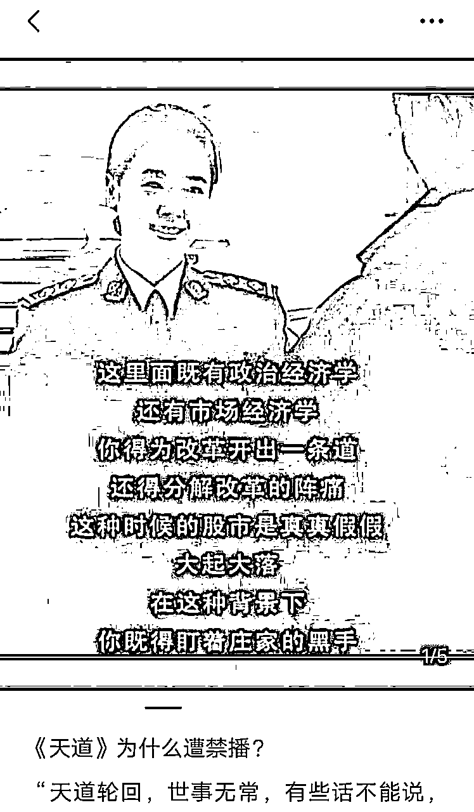

清晰度不够是直接影响的一个因素。

## 3.完读率很重要

做过公众号爆文的伙伴都知道，完读率很重要，但是没想到这个小绿书其实也有完读率

润宇老师：“因为本身是图文，它的文章也不长，基本你完读率都要干到40-50%以上。”

怎么提高完读率？答：控制文章篇幅

如果你是只有一张图的话，那么就需要控制一下你文章的篇幅，不要超过800字，建议10-500字左右就可以。

它是图文不是文章，有的伙伴会写很长，但其实没有什么人有耐心完整的看完。

而且更要注意的一个细节是，在我们测的过程中，发现有的伙伴为了提高商品的购买量，会在一篇正文当中插入多个商品图，导致每隔2~3段就有一个商品出现。

这样的话，其实是会影响用户的观感。

## 4.平均停留时长

“一般大爆款，都是平均停留时长能达到1分钟甚至更高。”

怎么拉长平均停留时长？

一个小细节：你可以在首图和其他图片右下角，增加一句：向右滑，看更多精彩内容

之类的话语，这样就引导他能不断往下翻。

这四个点都做到位后，就看发布后的「互动」情况了。

互动数据这一块，目前小红书的是比较公开透明的：

小绿书的目前还没有公开，但是润宇老师也提到了一个“公式”，可以参考：评论＞分享＞点赞＞在看。

# 三、爆款标题：

什么样的标题容易爆？我总结了以下几点：

## 1.干货合集类

例：《【减脂秘籍】一周不重样》

## 2.猎奇类：

例：

《我独创的拌饭，美味到让人热泪盈眶！》

《👀宝子们快来看！怎么看出来一个女孩很聪明呢？》

《女人非常傻的8个行为，你占了几个？》

## 3.戳痛点类：

《让大脑变笨的行为，你中了几招？》

《妈妈必看：再不追高，孩子身高就耽误了！！！》

《入秋后掉发多的姐妹，试试这个！！》

## 4.符合懒人心理：

《5分钟搞定孩子营养早餐》

《万能和面公式：有了这个，不会和面都不再是难题》

《我愿称它为懒人早餐天花板！！！！》

## 5.利益挂钩类：

《坚决不删！重度黄脸18个冷知识！不看亏大了》

《长期坚持跳绳的隐性成本》

《你的转运珠戴对了吗？自查❗❗别戴来霉运❗》

## 6.反差类：

《竟然被我妈种草！！几十块就养出来初恋脸！！》

## 7.名人效应：

《董宇辉推荐的神奇背书7步法》

# 四、正文：干湿结合

一篇好的小绿书笔记，是干湿结合的。尤其对我们创作者来说，不能只爆文，不出单啊。

既想出单，又想爆文，我总结了一个正文结构公式，供大家参考：

开头：金句/痛点/故事开头

文章中：干货

结尾：以“我”的视角走心分享/说产品对“你”的帮助。

比如这是我拆解的一篇近期爆文：

10月11日的，9.3W阅读量：

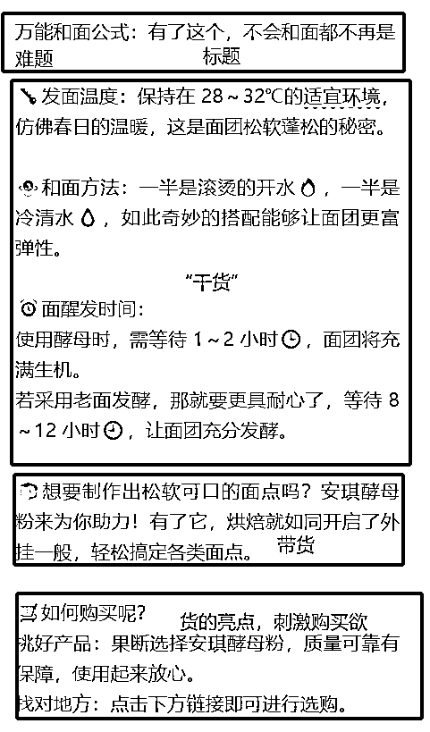

本想再多拆解一些，但是……我发现很多都是AI写的。

有的甚至有明显的**号，都没有删，但是照爆不误。

所以，现在小绿书的红利期，还是要抓紧时间铺。

# 怎么用AI辅助写正文呢？

## 野路子版（新手建议）：

直接复制小红书爆款笔记的正文内容，丢给AI，下达指令——

把以下内容换种风格表达出来，顺带加点表情、排版：“……”

（这里的“……”就是你想丢给它模仿的内容）

这是我用「文心一言」免费版生成的效果：

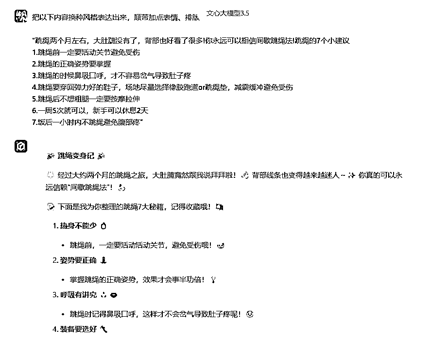

## 自用版（我用 文心一言APP）：

帮我写一个要卖跳绳的营销文案，切入点以用户痛点为切入口，比如要减肥，比如瘦大腿，瘦腰等，写一段600字左右的文案

要求：

1.开头以金句/故事/痛点开头

2.文风亲切，利他、口语化

3.要具体给到实操性比较强的建议，并分点

4.最好有详细的数据做支撑

5.最后要以“我”的体验作为分享，引导大家下单，同时言语上看起来要利他

6.不要说假大空的话，用户痛点要足够痛，让人看到你的这篇笔记，就觉得“是这样”“你能理解我”“这篇笔记有收藏、实用价值”“我需要这个商品”

这是它的效果：

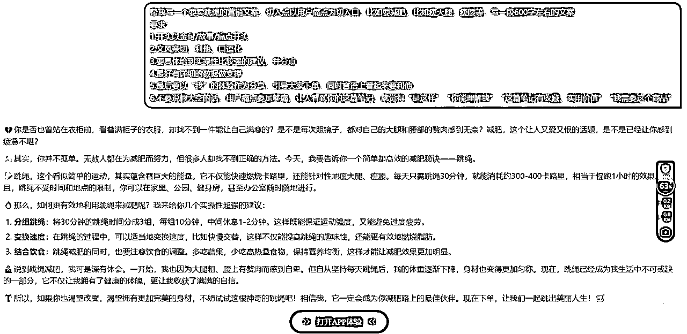

## 口令思路：

给它身份设定+字数控制+具体要求。

### 身份设定：

可以给它多重身份设定，让它不要天马行空，同时可以写出比较符合自己需要的文案。

我一般会给2~3个身份设定：假设你是一个……的大师/高手/专家，擅长……

例子：假设你是一个有10年营销软文经验的大师，深谙用户心理，擅长用通俗易懂的文字写出效果很好的种草文

### 字数控制：

是为了不要超/少篇幅，小绿书的设定我一般会在800字以内，太少字数它就不能满足要求，字数太多又容易影响完读率。

### 具体要求：

这个要根据你的需求去调，每个人要求都不一样。

而且，往往要根据初版提示词生成的效果，才能知道它还要改哪些方面。

一般要求，不要少于5个点，可以包含：

语言（口语化、通俗易懂、接地气……）、风格（亲切/严谨/专业……）、举例……

# 五、商品：关联度高、及时需求、物美价廉

根据我们实操下来，发现商品对出单也是有影响的。

一般满足这3个要求的商品，出单量相对来说更好些：

## 1.商品关联度高

我们这边就有伙伴，阅读量快上万了，一单没出；也有伙伴，10个阅读量，出了1单。

也不完全是运气影响，跟细节也有关。

比如有位伙伴，他是写减肥、跳绳有关的，首图也吸引人，但是他带的商品是：“中学生跳绳”。

这就不符合看这篇文章的人群喜好，带个成年人的跳绳，出单率可能就高很多。

不能挂羊头卖狗肉。

## 2.及时需求

我们发现，一些能满足“及时需求”的商品，出单也不错。

什么是“及时需求”？是我当下就想要、需要。

比如：跳绳、招财的一些东西……

这些是我看了，我觉得我应该要马上下单的。

经常会有人问我：为什么不上一些书籍类的品？

怎么说呢？书籍类，很多人带，但是出单速度没有那么快。

因为书籍类的可供选项太多了，而且人群不一定精准——

选项多：我可以去拼多多买，或者我用微信读书，看电子版免费的。

人群：微信月活有13.9亿，但是小绿书做为一个刚出的产品，有哪些人群比较多？这个我不是官方，不好说，但——

如果是爸妈一代看到书籍类的文章，他们中，大部分是不爱看书的。甚至没有“红薯”、“调料”之类的衣食住行对他们的冲击大。

## 3.物美价廉

上次越越也写到了，客单价不超过百元的比较好卖。

这个是的，我们自己测下来，价格不贵、物美价廉的东西出单更好。

# 六、排版：好看、有表情、分段

小绿书虽然目前还是一个很粗糙的阶段——不能像文章一样加粗/用别的颜色/调字体大小/选字体。

但是，有心的伙伴也能把它打扮得好好的。

好看的小绿书排版，肯定还是更受欢迎的。

怎么把小绿书排的好看点？

## 1.分段：

电脑上1-2行为一段，手机上1-3行为一段就可以了，不要超过4行，不然看起来很密密麻麻。

## 2.适当加入一点表情

不知道怎么加的，用AI帮你加，对它说：

“帮我把这段话适当加点表情进去，好看点”

## 3.重点可以用【】之类的标记

以上3点，就差不多了。

比如这个，我觉得看起来就比较舒服：

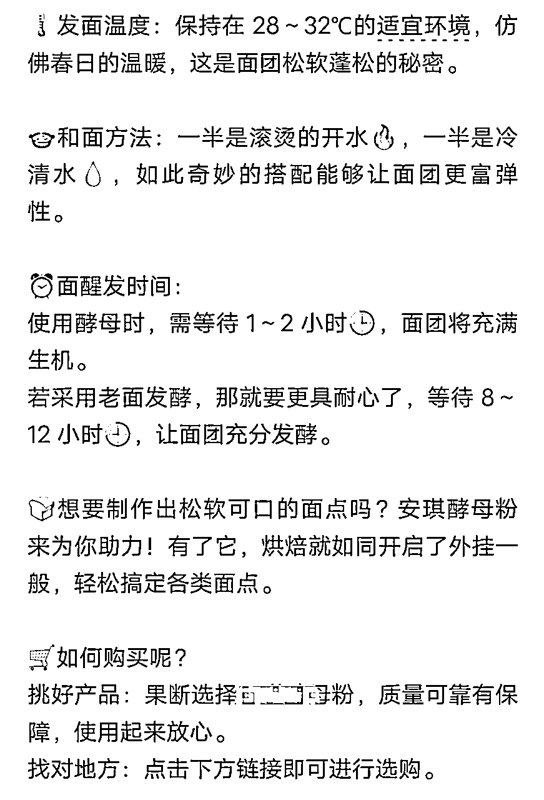

# 七、小白经典8问

你永远不知道，小白能变着法踩了哪些坑（哭）。

下面是最近实操交流过程中，发现小白很容易犯的错、踩的坑，如果你也有，赶紧改哇。

## 1.为什么我的标题是“分享图片”？

这个问题，是会让人吐血的程度。

为什么别人是有图有标题，但是我的图比例不对、标题也没有？

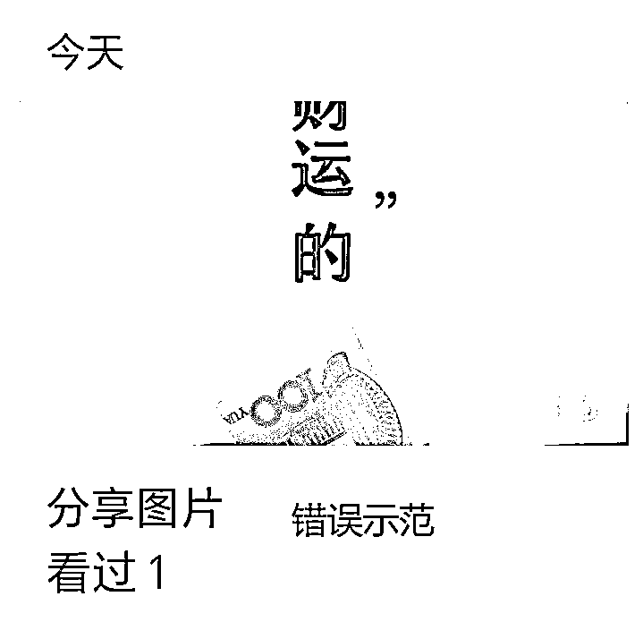

因为：没有填标题，图片比例也没有选。

怎么填标题？

手机上下载一个“订阅号助手”APP——发表——图片·文字——填写标题、正文

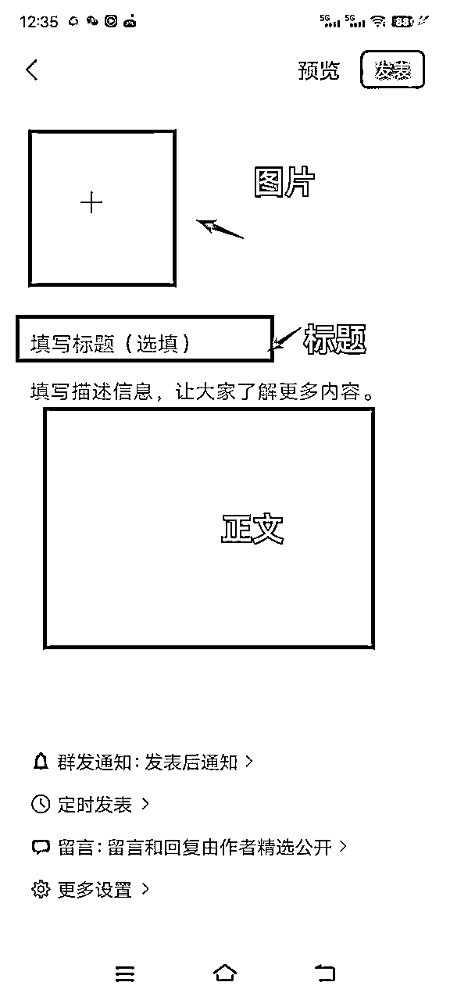

## 2.图片是商品图片吗？

我们说，小绿书很简单，会抄就行。

但事实证明，不是的。

有伙伴会以为，小绿书是找对应商品图片去上，不是的！

小绿书找的图片，

要么：同行的图，去水印、增强清晰度，拿来用；

要么：小红书搜想带的商品的笔记，抄小红书【爆款笔记】的图，而不是商品图。

小绿书虽然是带货，但是它不是淘宝呀，它不是直接卖产品，

而是用户通过看你的这篇图文，觉得有价值有帮助，然后你正好带了有关的产品图，所以下单购买了。

## 3.开通的非橱窗，而是开了个小店？

如果你想成为带货达人，那么：

正确的流程是开通橱窗-成为达人带货-选品中心上商品即可

非自己开店！

怎么看是不是误点了开店？

到创作者中心-带货中心主页，看这个板块，正常（未开店）是这样显示：

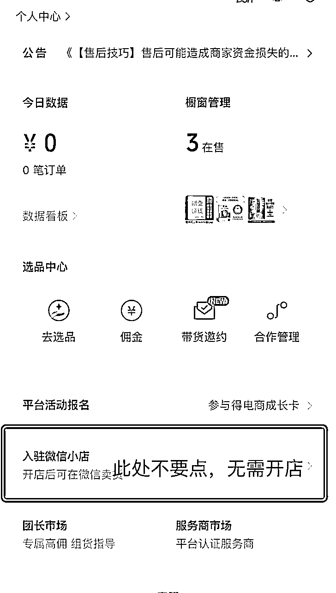

误点了开店，是这样显示：

或者这样：

自己开的店有什么问题？

如果是开了小店，首先你自己得有货源/厂家，才能上架自己的商品，并且很多品类需要资质。

咱们大部分人都是没有这个的，而且与此同时，不能和达人带货的方式并存，也就是说，一旦你自己开店，就无法正常带橱窗里的货

已经不小心开了怎么办？

点开小店，终止开店流程/注销店铺，可以在带货中心找客服进行协助处理。

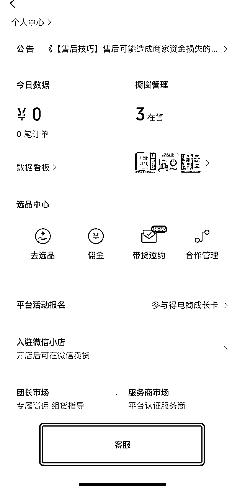

## 4.我手机上订阅号助手，怎么没有看到插入商品链接的地方？

答：先把鼠标/光标点到中间正文的位置，有一个“＋”，+ 号下拉走第看有没有“商品”。

有，就可以插入。

没有，就用电脑：

#### ①先找到小绿书的入口页面：

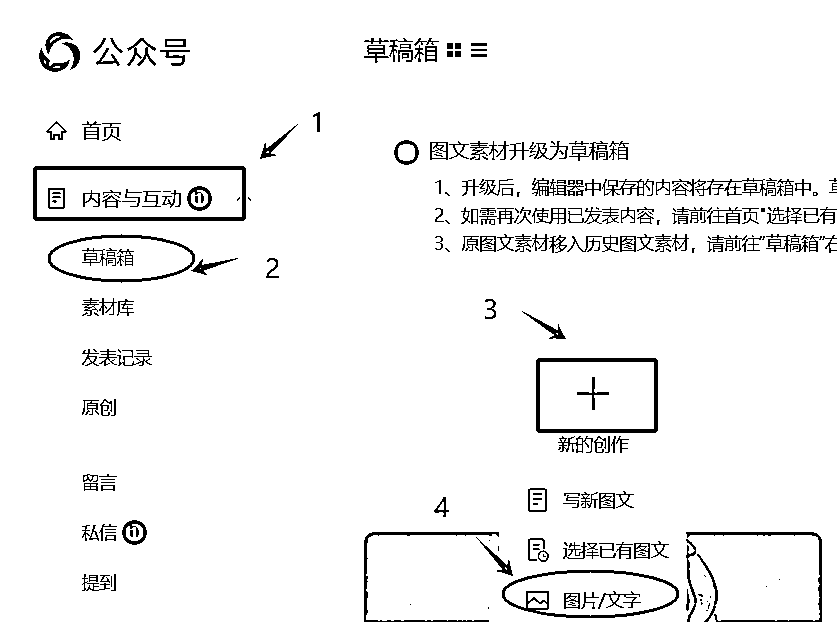

#### ②上传好图片、标题、内容，选择微信小店

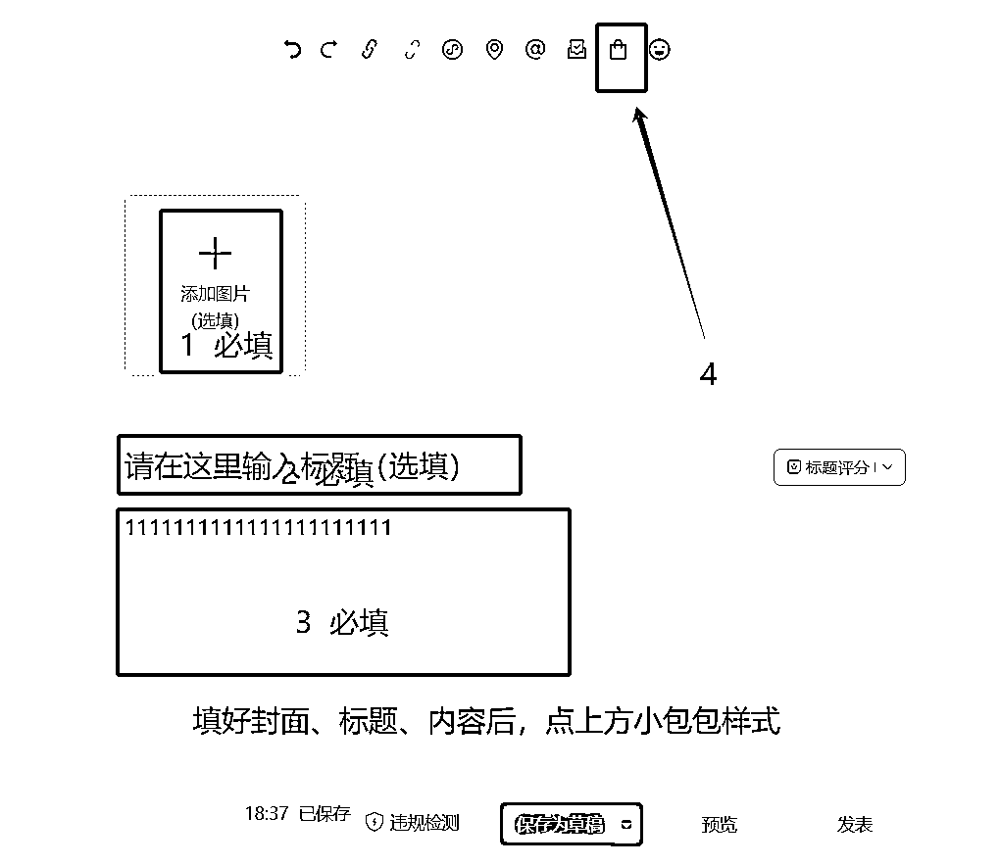

就可以开始带货了。

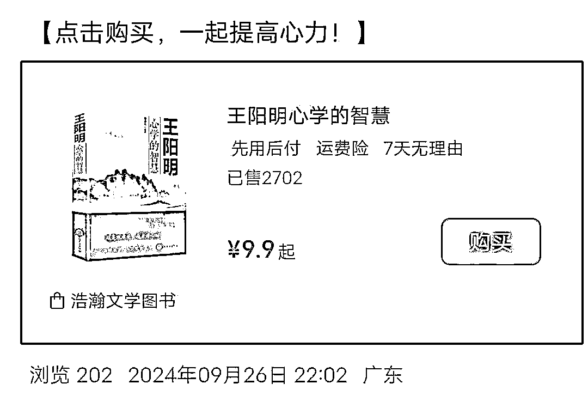

## 5.请问文章发表后需要转发引流吗？

不用，看自然流情况，一般都没有那么快。

## 6.带货文章多少字比较合适？

不到800字都还好 建议是10-600字左右。

## 7.小绿书一天发几条比较好？

小绿书发布目前不限制，一般一天最少1篇，1-5篇比较常见。

我们自己的服务号，发文在20篇上下。

因人而异，想爆的快点就多发点。

## 8.小绿书一直没流量怎么办？

先问自己：发了多少篇？每篇都做到位了吗？愿意花多久时间去做？

想做了马上就有结果的话，小绿书项目不适合，大部分副业都不适合。

快的话，1天2天就有明显的阅读量提高。

慢的话，可能一周甚至更久时间，阅读量都是0.

主要，阅读量都是0的伙伴，我有点怀疑是不是就是“无脑”操作的——标题也没改、正文内容自己不知道写了什么、图片还是商品图（不吸引人、广告位）

模仿爆款来，不要自创。模仿爆款来，不要自创。模仿爆款来，不要自创。

模仿爆款的图片、标题，用AI去修改对方正文内容，自己再手动改改，一般都是没什么大问题的。

# 八、特别感谢

最后，要很认真地和许老师、生财、生财伙伴们、投资人致谢：

感谢许老师，大爱大义，知道我在做公众号爆文，就跟我分享了同样是微信系列的小绿书，不然可能又会错过一个机会。

感谢生财，不在生财圈的话，我是很少会关注到这块的，可能要过段时间才有体感。

每个小机会都值得认真对待，年轻时遇到一个好的引路人、好的圈子，可能会改命。

感谢生财圈友孟、越越等伙伴真诚利他的分享！

从孟那里，我才知道了微信闭门会这个信息；

从越越那里，我才知道这么多的细节；

感谢鸡汤、周周，于急时毫不犹豫搭把手……

感谢投资人张哥@张昭，没有张哥的反复提醒、强调，我们可能会懈怠，就不可能有现在的一些小结果。

感谢感谢！