# 深度复盘：我用AI帮一位老板省下15万招人费用的经历。

> 来源：[https://c9udwbvfqq.feishu.cn/docx/C0RZd6IjzohUEUxmeK5cXTMTnob](https://c9udwbvfqq.feishu.cn/docx/C0RZd6IjzohUEUxmeK5cXTMTnob)

# 零、前言

深夜11点38分...

"老板,我今天身体不太舒服,明天的公众号文章可能要延期..."

我盯着手机,叹了口气。这已经是这个月第三次了。

咨询了写手?一篇600-800,质量还不稳定。

找实习生?一个月至少3K-5k,还得手把手带。

招全职?深圳一个合格的内容运营,底薪保底1.2w起。

更要命的是:

*   直播、课程素材越堆越多,就是没时间好好整理

*   读者私信说文章味道变了,互动率直线下滑

*   眼看竞品天天发爆款,自己却总是赶稿子...

老板，如果你也正在经历这样的问题。那这篇文章值得你读下去。

因为,我要分享一个让我惊喜的发现: 只需花个几千块钱,

就能拥有一个永不请假、质量稳定、懂你调性的AI内容团队。

有多猛?

*   1小时出一篇带情感、有调性的公众号文章

*   不用担心人员流失和状态不稳定

*   文章质量可能比你自己写得还要好...

别着急说不信,先听我讲个真实的故事...

本文将向你展示：

*   如何用AI将内容创作时间缩短75%

*   如何用5000元创造10万+的年度价值

*   如何在不扩大团队的情况下，显著提升内容质量和数量

*   为什么现在不开始使用AI，你可能很快就会落后于竞争对手

圈友们好，我是李书生。在AI+内容营销赛道上，我已经深耕了一年半。

今天，我要和大家分享一个让我又意外又兴奋的经历，这个经历可能会彻底改变你对内容创作的看法。

大家好，我是书生，一个AI提示词/智能体工程师。

目前专注于AI＋文字内容营销＆变现赛道。(切入的是自媒体文及网文这两块）。

之前在生财也有两篇精华帖，秀秀我在AI这块的肌肉哈哈

一文深度解析市面提示词分类，提示词工程师助力大家紧随AI浪潮

给生财的微信公众号定制了三条AI指令！用来帮助生成标题和阅读引导语（前言/摘要）

下面呢，话不多说，我们开始今天的正菜~

* * *

# 一、背景

"书生老师,有个朋友想找你聊聊。"

那是个平常的九月下午,我正准备喝杯咖啡,收到了之前学员小王的微信。

一番简单寒暄后,我了解到他朋友是个做了5年的教育IP。通过短暂交流,我很快就摸清了他朋友的困境:

*   每周3-4场高质量直播

*   每月4-5个新课程内容

*   大量优质素材被束之高阁

*   人工改写费时费力还难找人

"这些内容都是金子啊,但就是没时间好好整理发布..."他一语道出很多IP主的心声。

看来是个有意思的项目。

我顺手打开了常用的报价文档: 基础版: 3K 进阶版: 4K 尊享版: 5K

"李老师,直接来尊享版。"

他的快速决策让我愣了一下。在这个人人喊着省钱的时代,遇到一个这么爽快的客户着实不多。

正当我琢磨的时候,他补了一句: "我们找了好几家AI公司,要么只懂技术不懂内容,要么只会调API不懂运营。

看了你的直播分享后,我觉得就你最懂我们要什么。"

这句话戳中了我。

是的,我不是纯技术开发者,也不是单纯的内容创作者。

我的优势在于:懂AI的人里面最懂内容,懂内容的人里面最懂AI。

但这次的需求,说实话还真有点儿挑战。

客户要的不是简单的文章生成器,而是要一个能把长达1小时

文字内容长达1-3W字数的直播和课程，转化成带品牌调性、有营销思维的内容助手。

"有难度,但值得一试。"

这个念头刚闪过,我就接下了这单生意。

虽然当时还没想好具体怎么实现,但直觉告诉我:这可能会是个改变行业的机会。

事实证明,我的直觉没错。最终完成的作品,价值远超5000块...

# 二、正文

## 一）不止是写写文章这么简单

听到这儿,可能有人会想:"不就是让AI写个文章吗？现在随便找个ChatGPT不就搞定了？"

慢着,让我跟你讲讲这里面的"门道"。

先说说我这位客户的真实需求:

*   每周3-4场直播内容要转成文章

*   要保持IP个人特色和品牌调性

*   要能带来持续转化

*   最重要的是...要让读者"欲罢不能"

简单吗？我们来拆解一下,一篇能转化的好文章到底需要什么:

1.  标题要有吸引力

"为什么你的课程卖不动?"比"如何提升课程销量"更戳人痛点,对吧？

1.  开头要抓人心

"老板,我今天身体不舒服,明天的文章可能要延期..."

这种场景化开头,是不是比干巴巴的说教更吸引你看下去？

1.  内容要有料

光是干货还不够,得让读者感受到"这不就是我遇到的问题吗?"

1.  行文要有魅力

早上看到的文章,下午还在回味,这才叫真本事。

1.  营销要有温度

硬广告人人喊打,但看完后自然想买,这才是高手。

听起来不算难？但问题在于,市面上的AI工具根本搞不定这些!

为什么？我给你掰扯掰扯:

1.  内容提炼能力太差

一个小时的直播,重点内容可能就几分钟,AI却经常抓不住重点。就像个没听懂老板意图的实习生。

1.  写作风格太死板

"根据数据显示""经过研究表明"...你觉得这种机器人腔调的文章,谁愿意看完？

1.  营销转化太生硬

"点击下方链接立即购买"...这种话术,10年前就已经审美疲劳了好吗？

最要命的是,这些AI工具就像个黑盒子:

*   写得好?全靠运气

*   写得差?重新来过

*   想修改?对不起,我只会从头再来...

这不就等于是在浪费时间吗？

一个月下来,你除了和AI工具较劲,什么事都干不了。

所以当我听完客户需求后就明白了 - 这活儿真不简单。

我们需要的不是一个会写文章的机器人,而是一个:

*   能读懂直播精华的"编辑"

*   会写爆款文章的"作者"

*   懂得营销转化的"策划"

*   还得是个永不疲倦的"工作狂"

难度不小,但这正是检验真本事的时候。

## 二）第一次尝试：一刀流解决方案

既然接下了这单生意,那就得拿出真本事。

作为一个"简单暴力"的技术派,我首先想到的是用"一刀流"解决方案。

什么是"一刀流"？

想象一下古代武士的一刀毙敌 - 一个超长的提示词指令,要求AI一气呵成地完成所有任务。就像是给AI下达一个完整的"作战计划"。

"一刀流"是我最擅长的领域。来,我给大家看两个我日常在用的案例:

1.  小红书改写智能体

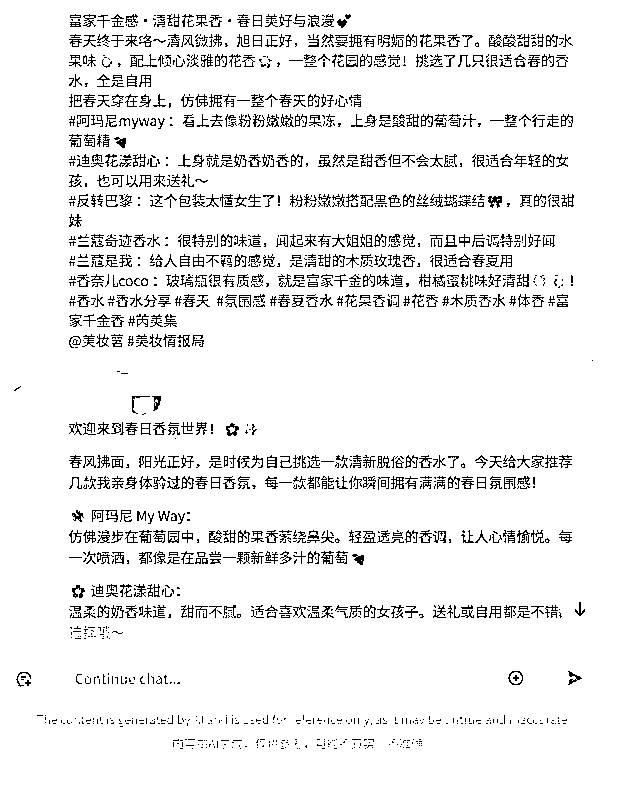

1.  公众号标题成文大师

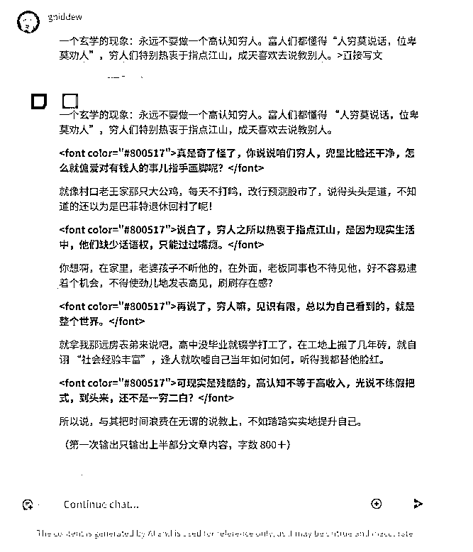

为什么我喜欢做这种东西？因为:

*   容易规范化

*   便于批量处理

*   用户上手快

*   我有丰富经验

看到我之间这些成果,我信心满满:既然能搞定这些,区区一个内容转化器有什么难的？

于是我开始着手设计这个终极版"一刀流"提示词。

这次的难度确实更大 - 要把一个小时的直播内容,转化成一篇吸引力爆棚的公众号文章。

花了整整两天,我写出了一个1000多字的"巨型"提示词,几乎包含了我所有的AI调教经验：

*   加入了刘润式的商业文风（客户喜欢的）

*   植入了爆款文章的结构

*   设计了完整的分析框架

*   还特别优化了语言风格

东西出来了，还得测试下效果不是？为了保护客户的隐私，我就用自己的直播内容试了试。

我的素材来源：我自己的直播视频，通过通义千问将文字稿给转录了出来，但还非常的口语化

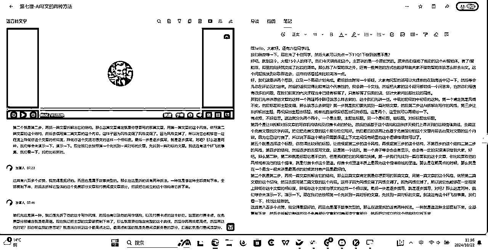

然后来到目前最强的Claude模型里面，内嵌一个高阶指令，并将我的文字稿给发进去。

我的这个“经过调教"的AI，就开始写作了。（这里解释一下哈，用的是刘润的商业体文风），

所以下方会说自己是刘润。

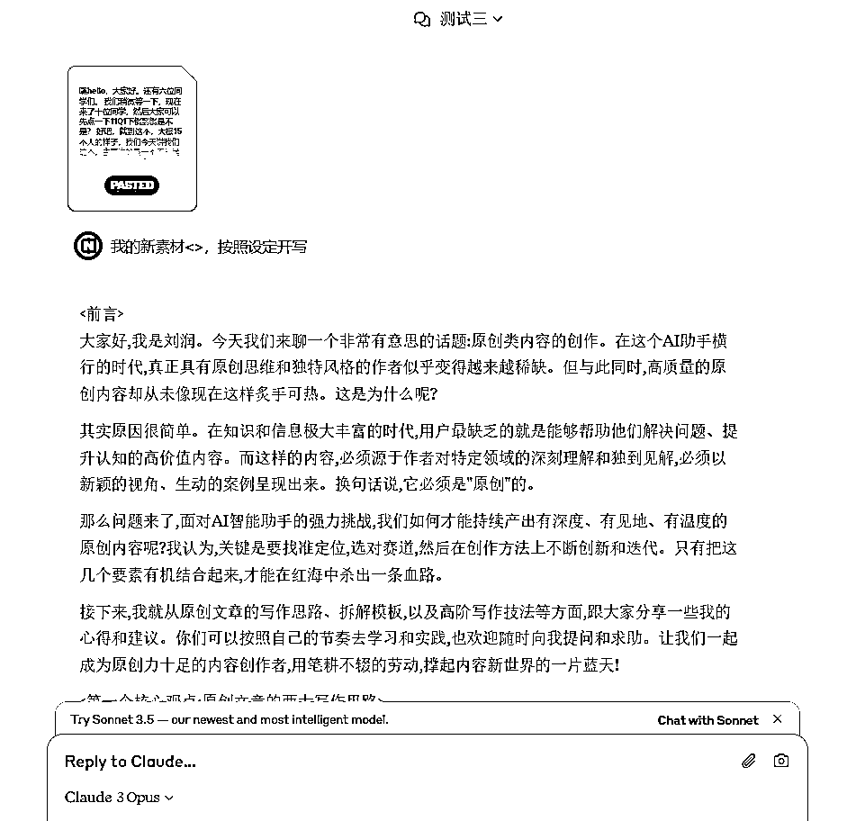

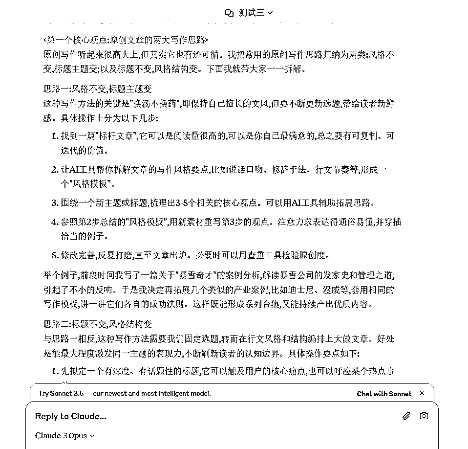

因为是我自己的内容嘛，说实话，这个产出的效果，我自己都是被惊艳到了的。

更多的我就不贴图了哈，完整的内容我都贴近下方的Word文档里面了哈，有兴趣的朋友可以看下全部。

看到这个效果,我都忍不住为自己鼓掌。不仅完美复制了风格,连情感表达都恰到好处。

这波稳了！我内心的小人在心中欢呼!

按照惯例测试了客户三篇文字稿，

为了让客户测试起来更方便,我还特意把这个提示词封装进了Coze平台,做成了一个可以直接对话的智能体。

发过去的时候,我已经在想象客户惊喜的表情了...

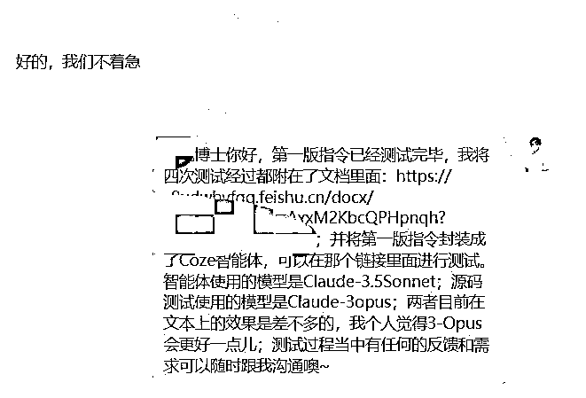

可惜...

"李老师,这个效果..."

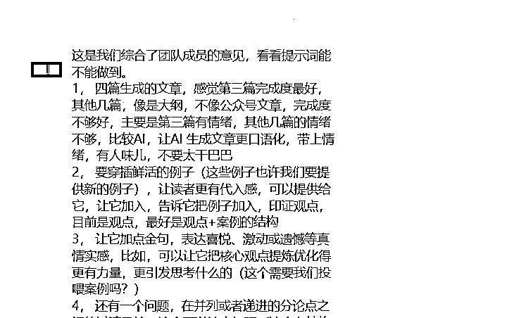

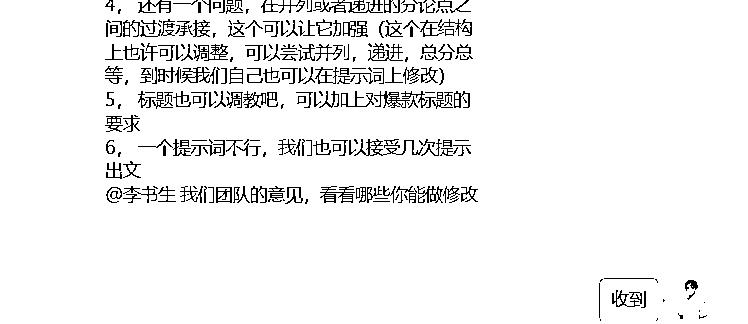

客户的反馈让我瞬间清醒。看来,我的拿手好戏，"一刀流"路子有点行不通啊。。

那怎么办呢？

## 三）转机：厕所里的灵光一闪

"李老师,内容不错,但..."

看完客户的反馈,我差点把咖啡打翻。

主要问题集中在四个方面：

1.  情感温度不够

*   文章看着像大纲的升级版

*   缺少真实情感的注入

*   读起来像机器人在说话

1.  结构需要加强

*   案例太少,说服力不足

*   段落之间生硬,不够流畅

*   缺少层次感和节奏感

1.  金句太少

*   核心观点不够有力

*   缺少能让人记住的金句

*   文章整体平淡无奇

1.  标题有待优化

*   不够吸引眼球

*   缺少市场洞察

*   爆款元素不足

看着这些问题,我第一反应是继续优化"一刀流"提示词。

但转念一想 - 等等,这样做对吗？

*   加入更多规则？那提示词可能要翻倍。

*   强化每个功能？复杂度会直线上升。

*   照顾所有场景？那不是得写本字典...

"子孙代代无穷已"啊！

就在我一筹莫展的时候,我上了个厕所。

没错,就是厕所！那个被称为"思考者的圣地"的地方。

坐在马桶上,我突然想起了大学时学过的亚当·斯密。

等等...分工理论？

我的脑海中突然浮现出一个画面：

一群小AI围在会议桌前,每个AI都负责自己最擅长的工作：

*   有的负责阅读理解

*   有的专注选题策划

*   有的设计文章结构

*   有的专门写作润色

就像一个专业的内容工作室！

想到这里,我激动得差点从马桶上跳起来。

这不就是传说中的"多Agent工作流"吗？！

回到电脑前,我一口气设计了四个核心角色：

1.  内容分析师(The Analyst)

*   专门研究课程内容

*   提取核心价值观点

*   找出亮点金句

*   像个资深编辑一样火眼金睛

1.  选题策划师(The Planner)

*   基于分析结果出选题

*   了解市场热点

*   懂得读者心理

*   堪比10年市场总监

1.  结构架构师(The Architect)

*   设计文章框架

*   规划内容节奏

*   安排论据分布

*   就像盖房子的设计师

1.  创意写手(The Writer)

*   负责具体写作

*   注入情感和细节

*   打磨语言风格

*   还能随时接受反馈调整

最妙的是,我要让这四个AI形成一条流水线：

*   分析师提供原材料

*   策划师定下方向

*   架构师搭建框架

*   写手负责最终呈现

用户可以在任何环节介入,给出指导和反馈。

这样的设计简直完美！既保持了AI的效率,又避免了"一刀流"的死板。

但是...怎么实现呢？

我面前有两条路：

1.  用Coze平台的多Agent协作功能

优点:

*   界面友好

*   容易调试

*   用户体验好

缺点:

*   依赖平台

*   成本较高

*   灵活性受限

1.  写一个超级"一刀流"

优点:

*   独立部署

*   成本可控

*   随时调整

缺点:

*   开发难度大

*   测试周期长

*   维护工作重

最后我选择了...

## 四）终极选择：一个价值十万的决定

既然卖了个关子,现在是时候揭晓答案了。

当时摆在我面前的有两条路:

第一条路:用Coze的多Agent协作功能

就像是买一套高档的乐高积木:

*   界面精美,拼起来就能用

*   模块化设计,随意组合

*   还有完整的技术支持

简直就是懒人的天堂啊！

但是...

第二条路更吸引我:写一个超级"一刀流"提示词。

这就像是... 自己从零开始打造一台超级跑车。

虽然困难,但是想想还是热血沸腾！

为什么最后选择了更难的路？

让我给你掰扯掰扯其中的门道:

1.  便携性无敌

想象一下:

*   一个文件走天下

*   不用配环境不用装软件

*   随处可用随时可改

这不就是活脱脱的"御剑飞行"吗？

1.  适应性超强

*   ChatGPT能用

*   Claude能用

*   文心一言也能用（暂时还不行啊哈哈）

*   以后新出的模型也能用

这叫什么？这叫"一招鲜,吃遍天"！

1.  成本直接腰斩

*   不用付平台费用（AI费还是要出滴）

*   不用买额外服务

*   维护成本几乎为零

这可是实打实的省钱利器啊！

但是,要把这个"终极武器"打造出来,可不是闹着玩的。

我整整花了3天3夜:

*   第一天写框架

*   第二天调试优化

*   第三天反复测试

最终交付的这个"庞然大物"足足有4000多字:

```
[系统角色设定]
你现在是一个内容创作专家团队,由四个核心角色组成...

[第一步：内容分析]
1\. 仔细阅读输入的文字内容
2\. 提取核心价值点和金句
3\. 分析受众心理和痛点...

[第二步：选题规划]
1\. 基于分析结果提出3-5个选题方向
2\. 评估每个选题的爆款潜力
3\. 设计情感共鸣点...

[以下省略3000字...]
```

整个提示词分为四大模块:

1.  整体框架

就像是给公司制定组织架构:

*   谁负责什么

*   怎么互相配合

*   如何保证效率

1.  分阶段指令

相当于给每个部门的具体工作指南:

*   该做什么

*   怎么做

*   做到什么程度

1.  交互机制

设计用户参与的环节:

*   在哪里可以介入

*   怎么给反馈

*   如何进行调整

1.  输出规范

统一所有的输出标准:

*   格式要求

*   质量标准

*   交付规范

说实话,整个过程差点没把我的脑子给转晕了！

但是...

当我看到最终的测试结果时,那种成就感简直无法形容！

"李老师,这简直是为我量身定制的！"客户看了演示后两眼放光。

看着他们满意的样子,我心里却在盘算着一个更大的问题:

这个AI助手的真正价值,恐怕远不止5000块...

## 五）初见成果：一个超乎想象的AI内容助手

看到这里，可能有的圈友就要问了：李老师，说了这么多，能在这里给我们演示一下效果吗？"

当然可以！让我用我自己的一次直播内容来展示这个AI助手的实力。

### 第一步：内容分析

还记得那些熬夜做课程笔记的日子吗？

现在,你只需要把录音转成文字稿,往AI助手里一丢...

滴滴滴...loading...

不到60秒,它就会给你:

1.  思维导图分析

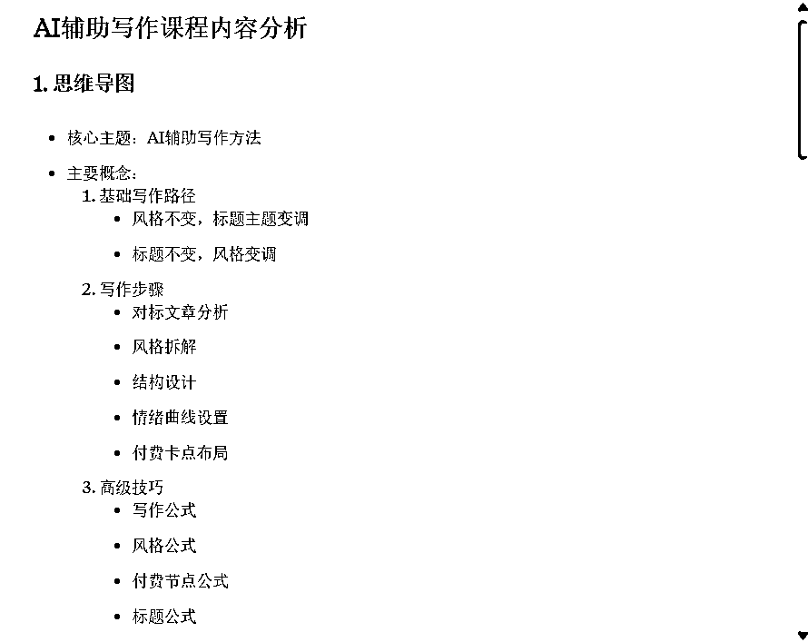

1.  重点内容提取

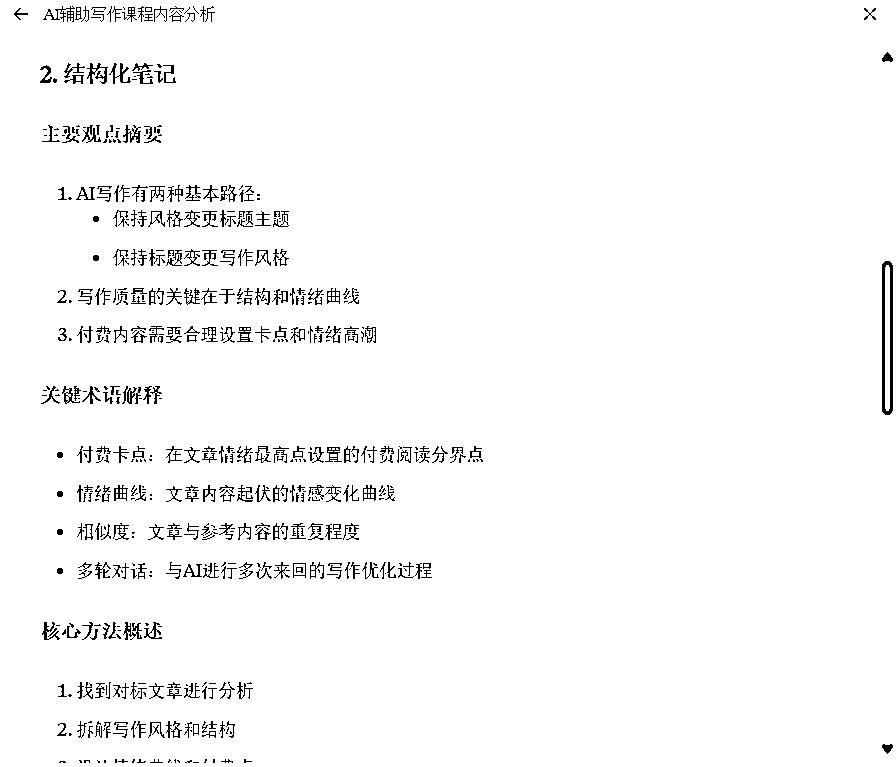

1.  受众洞察表格

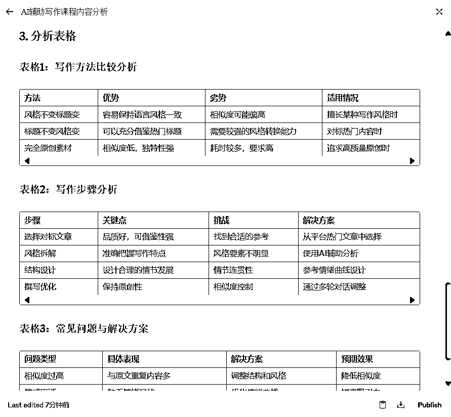

看到了这个后，我的助理跟我说："这比我听课做的笔记还要清晰..."

这不是废话吗？它可是一秒都不带走神的！

### 第二步：选题生成

基于分析结果,AI助手会给出1-3个爆款选题方向：

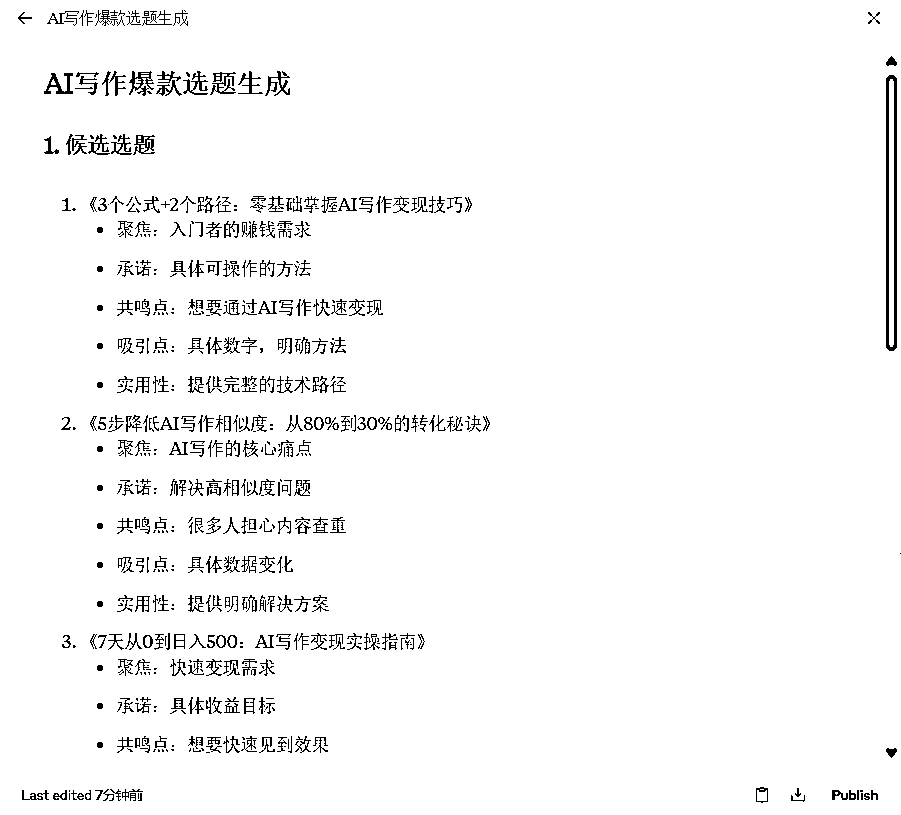

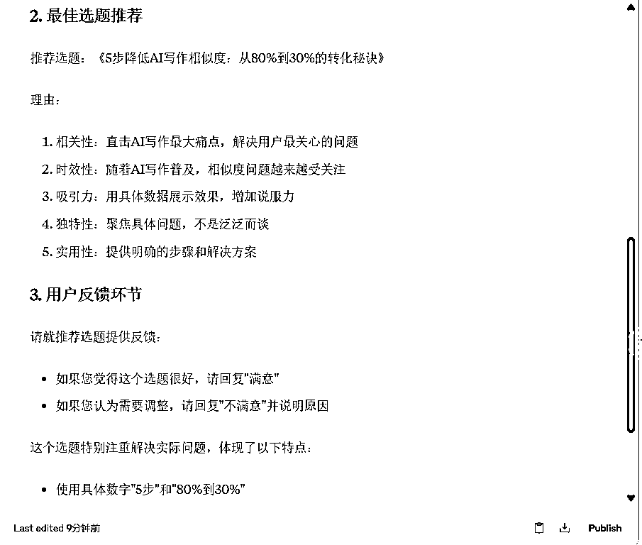

每个选题都配备了详细的市场分析,连我这个写了3年爆文的人都自叹不如！

### 第三步：结构设计

选定主题后,它秒速生成大纲：

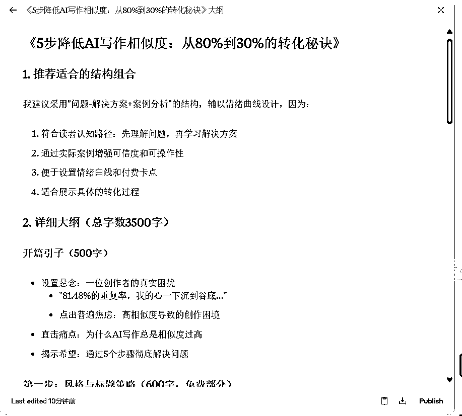

每个段落都有详细的写作建议,就像有个资深编辑在指导你！

### 第四步：写作执行

最后是见证奇迹的时刻...

AI助手会根据大纲,一气呵成地完成写作。

但它不是一次性吐出整篇文章,而是分段完成,每写完一段都会问："需要调整吗？"

比如开段：

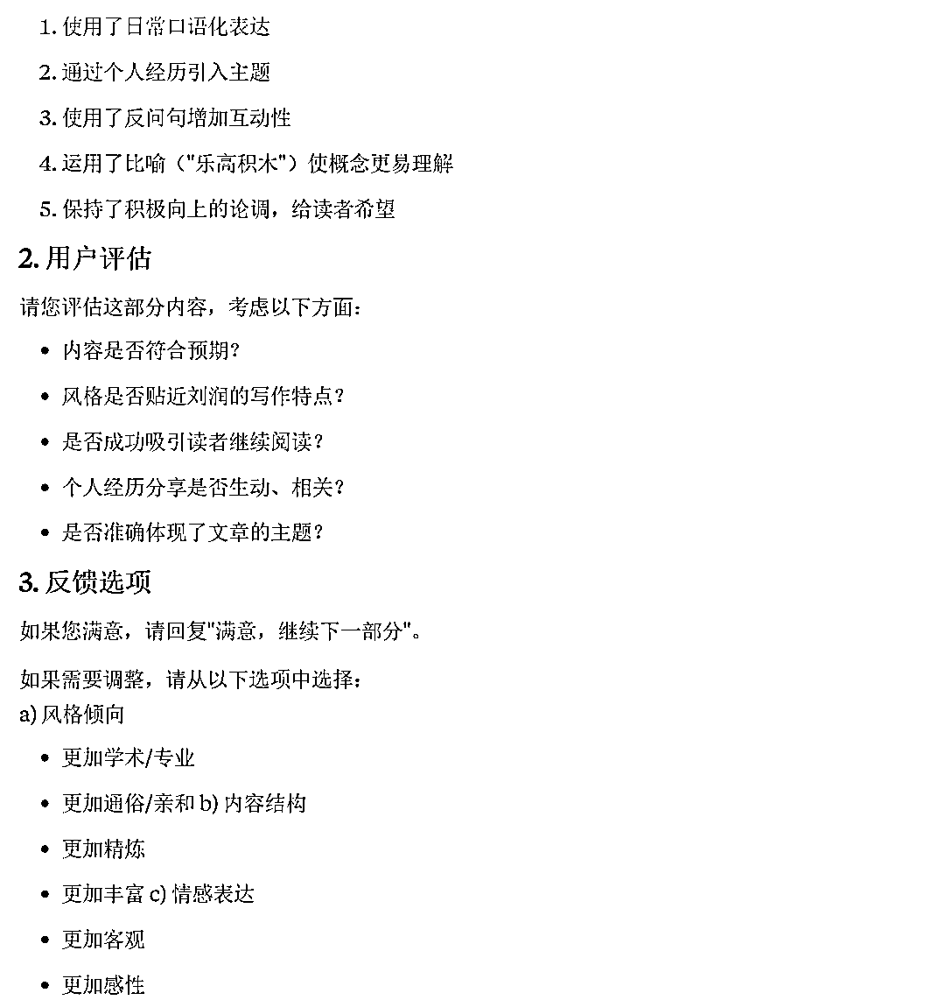

写完就询问："这个开头的情感是否到位？要不要调整文风？"

简直就是一个会和你讨论文章的资深编辑！

整个过程:

*   快速模式：20分钟搞定

*   精细模式：1-2小时(包含多轮修改)

*   普通人：至少4-6小时

*   外包写手：可能要1-2天

一次偶然,我拿自己的一篇旧文章测试,结果...

这个AI助手不仅完美复制了我的风格,有些段落的表达居然比我自己写的还要好！

"完了完了,我是不是要失业了？"这个念头刚闪过,我就笑了。

等等,这不就是我设计出来的吗？这相当于我把自己复制了一遍,还是升级版的！

这哪是什么AI助手,这简直就是我的超级分身啊！

看着它流畅的操作,再看看市面上其他的AI写作工具...

就像是在对比iPhone 15 Pro和诺基亚3310。

不对,我错了,至少3310还能砸核桃呢！

在拿到了这个版本之后，客户终于是定稿了。。。

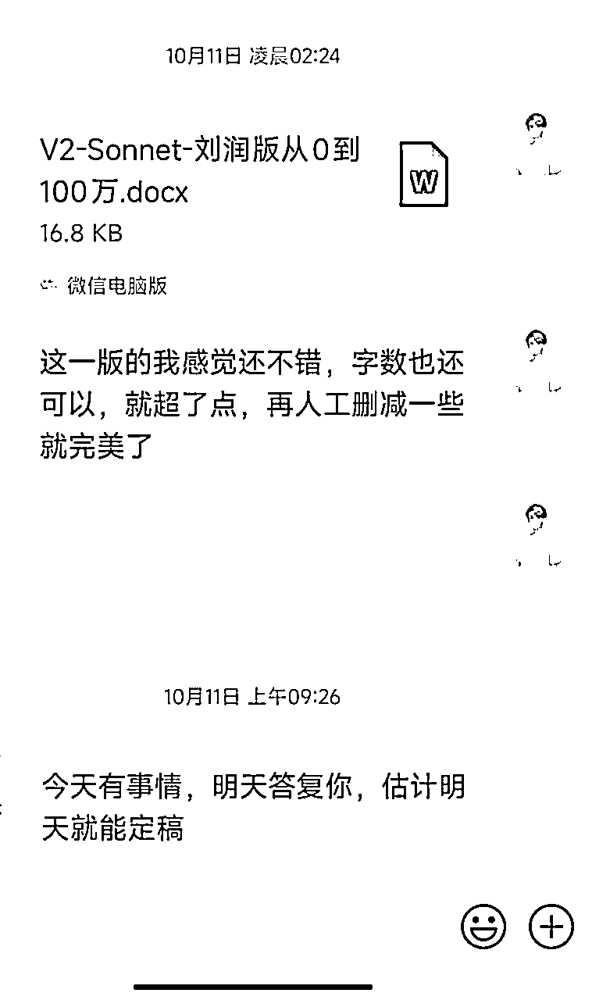

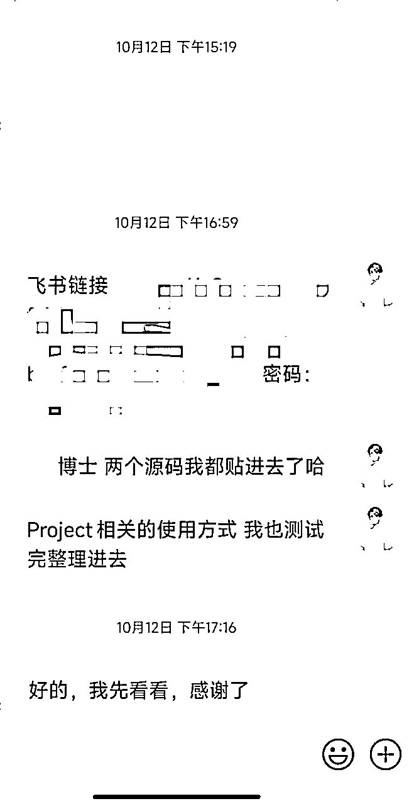

## 六)数字会说话：一个5000块的超值投资

为啥我会说最终的这个作品，价值远超5K元呢

### 1、先算人力成本

深圳招一个普通内容运营：

*   基本工资：12k-15k

*   社保公积金：3k-5k

*   每月总成本：15k-20k

*   一年支出：18w-24w

外包方案：

*   一篇直播稿改写：600块

*   排版运营费用：200块

*   一篇总成本：800块

*   每月12篇：9600块

*   一年支出：11.5w

### 2、再看AI方案

一次性投入5000块（定制化服务）：

*   一篇内容1-2小时搞定

*   质量稳定不掉线

*   不用管理不用带

*   想用就用随时待命

简单对比：

```
人力方案：20w/年
外包方案：11.5w/年
AI方案：5000元/一次性投入
```

但这只是表面的节省。

### 3、隐性收益更惊人

1.  时间就是金钱

*   传统写作：4-6小时/篇

*   AI辅助：1-2小时/篇

*   每天节省：3-4小时

*   一个月：90-120小时

*   一年：1080-1440小时

按照市场上一个自由职业者100元/小时的收费标准：

```
1080小时 × 100元 = 108,000元
```

这就是一年能创造的额外价值！

1.  质量带来的溢价

*   内容更专业：不会疲劳,质量稳定

*   创意更丰富：选题更抓眼球

*   互动更及时：读者粘性更强

*   转化更高效：营销更自然

1.  经营的可能性

*   接更多内容单子

*   拓展其他业务线

*   尝试视频、播客

*   打造个人IP

### 4、老板们最关心的两点

1.  省钱

*   比招人省15w+/年

*   比外包省6.5w+/年

*   一次投入,长期受益

1.  更好

*   出稿速度快3倍

*   质量更稳定

*   不用操心管理

*   可以规模化

就像一位客户说的：

"这不是给了我一个助手,是给了我一个团队！"

更重要的是 - 这个投资越早越值钱。

为什么？

想想看：

*   竞争对手还在用传统方式

*   你已经实现降本增效

*   内容质量远超对手

*   时间可以用在更重要的事上

说到这里,我突然想起一个有趣的比喻：

这就像是10年前买一台苹果电脑。

*   当时可能觉得贵

*   但现在回看,那是最值的投资

*   因为它让你比别人提前进入新时代

*   赢在了起跑线上

现在,AI内容助手就是这样一个机会。

不是在问"要不要买"

而是在问"能不能早点买"

因为市场不会等人,机会也不会。

# 三、结语：重新定义AI内容创作的价值

让我们回到开头的问题：

如何用5000元打造一个价值10万的内容团队？

答案已经很明显了：关键不在于工具本身，而在于如何巧妙运用它。

就像一位老板对我说的：

"李老师，这笔钱我花得很清楚，不是在买一个工具，而是在投资未来。"

在这个AI快速迭代的时代：

*   落后就意味着出局

*   但盲目跟风同样危险

*   真正的机会在于：打造属于自己的内容创作体系

如果你正在被这些问题困扰：

*   觉得招人太贵又不稳定

*   觉得外包质量难以把控

*   觉得品牌调性无法统一

*   觉得创作效率跟不上市场...

其实,此刻的你面临三个选择：

1.  继续观望

*   看别人弯道超车

*   等市场彻底成熟

*   错过最佳布局期

1.  自己摸索

*   花时间试错

*   付出学习成本

*   错过市场机会

1.  寻求专业方案

*   直接获取成熟经验

*   快速建立竞争优势

*   领先市场一步

有人问我：你不怕分享这么多，竞争对手越来越多吗？

说实话,我更怕的是：

*   优秀的创作者被庸常的工具束缚

*   有潜力的品牌被落后的方式拖累

*   好的内容因为效率问题无法产出

因为我深信：

*   真正的高手不怕分享

*   真正的价值不怕复制

*   真正的机会不怕竞争

如果你也认同这些观点，不妨评论区留言，我们再深度的聊一聊？